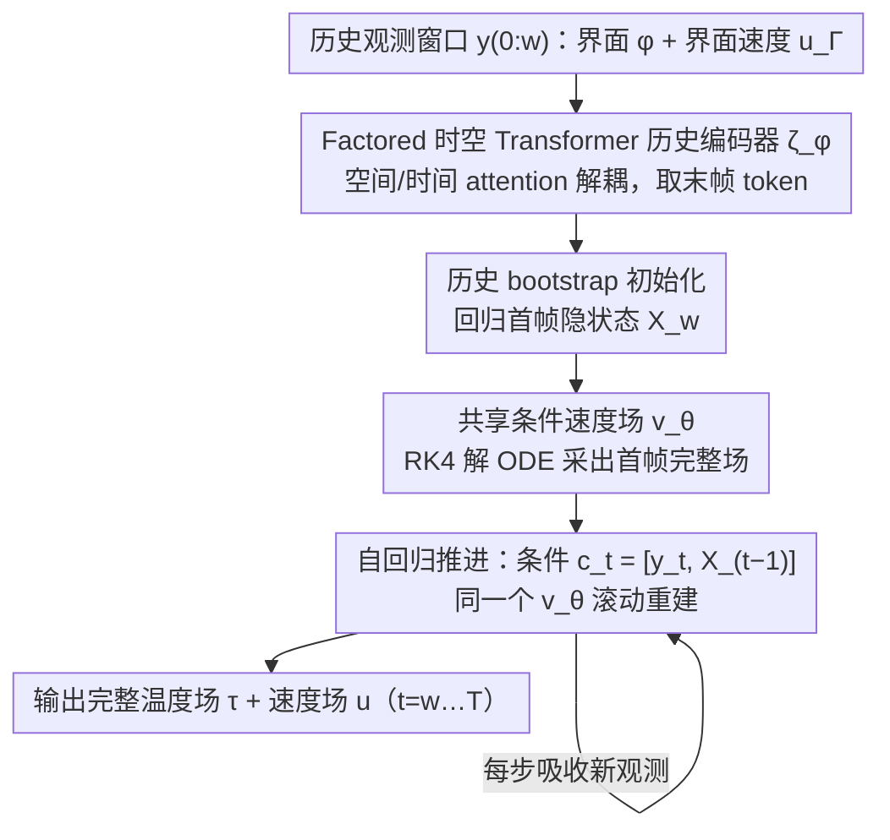

# (HB-ARFM) History-Bootstrapped Flow Matching for Inverse Boiling Reconstruction

**会议**: ICML2026  
**arXiv**: [2606.00349](https://arxiv.org/abs/2606.00349)  
**代码**: 待确认  
**领域**: 科学机器学习 / 逆问题重建 / Flow Matching / 多相流  
**关键词**: 流匹配, 自回归, 沸腾流场, 部分观测, 时空逆问题

## 一句话总结
HB-ARFM 用"历史观测引导"的条件 flow matching 解决多相沸腾流场的逆问题重建：先用一段历史观测窗口 bootstrap 出初始隐状态，再用同一个条件速度场自回归地把重建向前推进，在仅观测界面几何与界面速度的情况下，首次完成完整温度场与速度场的时空一致重建。

## 研究背景与动机
**领域现状**：两相沸腾是已知最高效的传热形式，但温度场、速度场、相间质量传输等关键量在实验中几乎无法直接测量；以往的学习方法（neural operator、Bubbleformer、FFNO 等）几乎都假设可以拿到完整模拟数据做"前向预测"或代理建模。

**现有痛点**：把这些前向模型用到只有图像（界面分割 + 光流）的真实场景，会立刻碰到 **cold start** 问题——没有真值初始状态可以喂进去；而 DiffusionPDE、FunDPS 这类生成式逆问题方法只能做单帧重建，无法保证时间一致性；VE-SDE 等甚至会直接坍缩到近均匀场。

**核心矛盾**：虽然两相 N-S 方程在**完整状态**上是马尔可夫的，但只观察界面几何 $\phi$ 这样的部分变量后，根据 Mori-Zwanzig (MZ) 形式主义，可观测变量的有效动力学就会出现**非局部记忆核**——单时刻观测里"少掉的那些隐变量"的影响必须靠**历史**才能找回来。换句话说，部分观测把一个马尔可夫前向问题变成了非马尔可夫逆问题。

**本文目标**：在只看到 (i) 界面几何 $\phi$、(ii) 界面法向速度 $\mathbf{u}_\Gamma$ 的前提下，同时重建液相和气相的完整温度 $\tau$ 和速度 $\mathbf{u}$ 场，并保证：观测一致 + 物理合理 + 时间连贯 + 长时滚动稳定。

**切入角度**：既然 MZ 告诉我们记忆核的存在源于隐变量，那么用**有限长度的观测历史窗口**就能近似补回这部分信息——历史长度只要覆盖气泡上升时间与冷凝时间这种特征时间尺度即可。

**核心 idea**：用历史观测先 bootstrap 出第一个隐状态，然后把同一个条件 flow matching 模型当作"自带数据同化的自回归推进器"，每一步同时吃当前观测和上一步重建结果。

## 方法详解

### 整体框架
HB-ARFM 要解的是一个时空逆问题：输入是从 $t=0$ 开始、长度为 $w$ 的观测序列 $y_{0:T}$（每帧是 SDF 形式的界面 $\phi$ 加界面法向速度 $\mathbf{u}_\Gamma$），输出是 $t=w,\dots,T$ 的完整温度+速度场 $\{\hat{X}_t\}$。它把"无真值初始状态的逆重建"拆成两段、但只用同一个条件速度网络 $v_\theta$ 来完成：先用历史窗口 bootstrap 出第一个隐状态，再以"当前观测 + 上一步重建"为条件自回归地往前滚。换句话说，cold start 和持续数据同化这两件事被统一进同一个条件传输框架里。

### 关键设计

**1. 历史 bootstrap 初始化：把不适定的瞬时反演弱化成有历史约束的问题**

传统自回归方法默认能拿到 ground-truth 初始状态 $X_0$，但成像观测里根本没有真值场，直接喂瞬时观测会得到一个高度不适定的"瞬时观测→完整状态"映射。HB-ARFM 改用一段长度为 $w$ 的历史窗口 $y_{0:w}$ 来生成首帧隐状态估计：训练时联合优化历史编码器的回归损失 $\mathcal{L}_{\text{boot}}=\|\zeta_\phi(y_{t_0-w:t_0-1})-X_{t_0}\|^2$，以及以 $\mathbf{c}_{t_0}=[y_{t_0},\hat{X}_{t_0}]$ 为条件的 flow matching 速度场损失 $\|X_{t_0}-\mathbf{x}^0-v_\theta(\mathbf{x}^s,\mathbf{c}_{t_0},s)\|^2$，其中 $\mathbf{x}^s=(1-s)\mathbf{x}^0+sX_{t_0}$ 是 OT 路径上的线性插值。之所以"固定长度窗口"就够用，是因为 MZ 形式主义保证记忆核在特征时间（沸腾里是气泡上升时间加冷凝时间）之外指数衰减——窗口只要覆盖这个时间尺度，少掉的隐变量信息就能基本补回来，从而把不适定的瞬时反演转成约束更好的"历史观测→完整状态"问题。

**2. 共享条件速度场 + 自回归推进：一个网络同时做逆重建和数据同化**

bootstrap 出首帧后，对 $t>w$ 的每一步把上一步预测 $\hat{X}_{t-1}$ 和当前观测 $y_t$ 拼成条件 $\mathbf{c}_t=[y_t,\hat{X}_{t-1}]$，flow matching 目标变成 $\|X_{t_0+k}-\mathbf{x}^0-v_\theta(\mathbf{x}^s,\mathbf{c}_{t_0+k},s)\|^2$，推理时用 4 阶 Runge-Kutta 解 ODE $d\mathbf{x}_s/ds=v_\theta(\mathbf{x}_s,\mathbf{c}_t,s)$ 从噪声采样出 $\hat{X}_t$，如此滚动。关键在于 bootstrap 与 AR 复用同一个 $v_\theta$、且一条轨迹同时贡献两种损失 $\mathcal{L}=\mathcal{L}_{\text{boot}}+\mathcal{L}_{\text{AR}}/(K-1)$，从而避免两阶段拼接带来的分布漂移。把上一步状态显式写进条件，等价于给采样加了一个隐式的"物理可达性"约束——这正是 HistoryFM 那种每帧独立采样所缺的：后者不保证 $\hat{X}_{t+1}$ 物理上能从 $\hat{X}_t$ 到达，于是 wake 会时有时无，而 HB-ARFM 相当于一个自带物理流形约束的数据同化器。

**3. Factored 时空 Transformer 历史编码器：用解耦 attention 把 $w$ 帧压成首帧状态**

历史编码器 $\zeta_\phi$ 要把 $w$ 帧观测压成一个首帧隐状态估计，但 joint space-time attention 的代价是二次方的，难以承受。它的做法是先对每帧用 $p\times p$ 卷积做 patch embedding 得到 $N=(H/p)(W/p)$ 个 token，叠加 2D 正弦空间位置编码与可学习时间位置编码；随后堆 $L$ 层、每层交替做"帧内空间 self-attention"和"跨帧但只在同一 patch 位置上的因果时间 self-attention"；末层只保留最后一帧的 token，经 linear unpatchify 加 learnable scale/bias 还原回像素空间。空间与时间 attention 解耦后，每个像素既能整合整段历史又只付 $O(w+N^2)$ 的代价；因果时间 mask 保证 bootstrap 阶段不偷看未来；只取末帧 token 也正好对应"用历史 nowcast 出当前状态"的语义。骨干网络方面，$v_\theta$ 用 Residual U-Net 做速度场参数化，flow time $s\in[0,1]$ 经正弦嵌入后注入残差块。

### 一个完整示例
取一段 subcooled pool boiling 序列，重建从 $t=w$ 开始：① 历史编码器 $\zeta_\phi$ 吃 $y_{0:w}$（界面 $\phi$ + 界面速度 $\mathbf{u}_\Gamma$）回归出 $\hat{X}_w$，作为 bootstrap 条件 $\mathbf{c}_w=[y_w,\hat{X}_w]$；② $v_\theta$ 以 $\mathbf{c}_w$ 为条件、用 RK4 从高斯噪声解 ODE，采出首帧完整温度+速度场 $\hat{X}_w$；③ 进入自回归段，下一步把刚得到的 $\hat{X}_w$ 和新观测 $y_{w+1}$ 拼成 $\mathbf{c}_{w+1}=[y_{w+1},\hat{X}_w]$，同一个 $v_\theta$ 再解一次 ODE 得 $\hat{X}_{w+1}$；④ 重复 ③，每步都吸收一帧新观测又消化上一帧状态，直到 $t=T$。训练时随机采起始点 $t_0\sim\mathrm{Uniform}(w,T-K)$，把 bootstrap 那一帧和后续 $K-1$ 步 AR 放在同一条轨迹上、按 $\mathcal{L}=\mathcal{L}_{\text{boot}}+\mathcal{L}_{\text{AR}}/(K-1)$ 联合优化，强制两套条件共享同一个 $v_\theta$。

## 实验关键数据

### 主实验
数据集为 BubbleML，分为 subcooled pool boiling 与 flow boiling 两个 setting；两个逆任务：(T1) 只给 $\phi$ 重建温度，(T2) 给 $\phi+\mathbf{u}_\Gamma$ 联合重建温度+速度。baseline 涵盖 DDPM / VE-SDE / 标准 FM / DiffusionPDE / PDEDiff / Bubbleformer / FFNO / UNet / HistoryFM。

| 维度 | HB-ARFM 表现 | 对比基线 | 关键观察 |
|--------|------|------|----------|
| 近界面重建 | 锐利梯度 + 一致 wake | 大多数模型都还行 | 界面附近几何约束强，区分度低 |
| Bulk 区温度/速度 | 保留细尺度 + 高频能量 | FFNO/UNet 过度平滑；VE-SDE 坍缩近均匀 | bulk 才是真正考验 |
| HF Energy Ratio | 最高（与 HistoryFM 同档） | DiffusionPDE/DDPM 碎片化 | 历史条件能保住高频 |
| Wall heat flux 误差 | 全场最低 | — | 沸腾换热最关键的工程指标 |
| 长时滚动（300 步） | 误差稳定，跨 seed 方差随时间下降 | Bubbleformer/UNet 立刻坍缩；HistoryFM 帧间漂移；PDEDiff 直接发散 | cold start + AR 缺一不可 |
| Flow boiling 泛化 | 速度幅值比 = 1，wall heat flux 误差 < 0.2% | — | 在动力学完全不同的 setting 也成立 |

### 消融实验

| 配置 | 关键现象 | 说明 |
|------|---------|------|
| 完整 HB-ARFM | 重建一致 + 长时稳定 | 联合优化 bootstrap + AR |
| 历史窗 $w$ 从 1 → 64 | 温度/速度误差随 $w$ 单调下降 | 速度场对历史更敏感，符合 MZ：记忆核对隐藏速度场贡献更大 |
| HistoryFM（独立每帧采样，无 AR 反馈） | 单帧好看但 wake 时有时无 | 证明 AR 反馈是时间连贯的关键 |
| PDEDiff（联合窗口 + 随机 masking） | 直接发散 | 联合空间时间建模在多相+sharp interface 下不稳定 |
| 前向 SOTA（Bubbleformer/UNet） | cold start 即崩 | 证明 history bootstrap 不可或缺 |

### 关键发现
- 历史长度 $w$ 越大，重建误差越小，且**对速度的提升明显大于温度**——这与 MZ 形式主义一致：速度场是隐变量主导，需要更长的记忆核来恢复。
- HistoryFM 与 HB-ARFM 都用了历史，但只有 HB-ARFM 不会出现 wake "闪烁"，说明 **AR 反馈把"相邻帧的物理可达性"显式写进了条件**，这一点比"看更多历史"更重要。
- 测量空间一致性测试中，把预测速度场再过一遍观测算子 $H$，与输入 $y_{\text{obs}}$ 的 cosine similarity 在 300 步滚动后仍 > 0.92，证明模型没有生成自相矛盾的场。
- 模型在训练分布外 $T_{\text{wall}}=117$°C 仍能保持 < 2% 的 wall heat flux 误差，说明它**学到了"边界条件 → 相变换热"的函数关系**而不是简单插值。

## 亮点与洞察
- **Mori-Zwanzig 形式主义当作设计原理**：作者不是凭直觉加历史，而是用 MZ 证明"部分观测一定带来非马尔可夫性"，进而把"有限窗口够用"的合理性也用 MZ 的指数衰减记忆核论证清楚——理论动机和工程设计完全对齐。
- **共享 $v_\theta$ 把 cold start 和数据同化合并**：bootstrap 阶段把"无初始状态"的逆问题转化为有初始状态的问题，AR 阶段又把"持续观测"转化为隐式数据同化，两件事在同一个条件速度场里完成，参数效率和分布对齐都很漂亮。
- **沸腾流作为 SciML 逆问题 benchmark**：sharp interface、多物理耦合、隐藏传输三件套同时存在，是少数能同时压测生成式、AR、PINN 三类方法的场景。文章顺便把现有方法的失效模式都画出来了，对后续工作很有参考价值。

## 局限与展望
- 模型完全数据驱动，**没有在训练里显式加守恒约束**，divergence 误差表明质量守恒并不完美；未来可加 projection 或 divergence penalty。
- 历史编码器是有损的，作者承认这是一个 lossy bottleneck——更强的 history encoding（比如可学习的记忆核 / state-space model）有空间。
- 所有评估都在仿真数据上，**sim-to-real gap 是开放问题**：真实沸腾图像有噪声、有传感器漂移，且没有真值场可以监督。
- 我的观察：bootstrap 与 AR 共享同一个 $v_\theta$，但两者的条件结构差异不小（一个吃 $\hat{X}_w=\zeta_\phi(y_{0:w})$，一个吃 $\hat{X}_{t-1}$），参数共享是否最优可以再探讨——尤其当历史窗很长时，bootstrap 那一支可能需要不同 capacity。
- 流量任务 (flow boiling) 中温度仍然偏弱，原因是流向对流主导，模型还没专门处理 streamwise advection 的长程依赖，可以考虑显式加 advection-aware 模块。

## 相关工作与启发
- **vs DiffusionPDE / FunDPS**：它们在采样里加观测引导做单帧重建，本文用 flow matching 的条件传输把观测当成显式条件，并加 AR 反馈，解决了"单帧好看但时间断裂"的问题。
- **vs S3GM**：S3GM 联合建模整个时空体 $p(X_{0:T})$，需要在巨大空间里采样；本文把它**沿时间因子化**为条件传输，效率与可扩展性都更好，还顺手获得 AR 数据同化能力。
- **vs HistoryFM**：同样吃滑窗历史，但 HistoryFM 每帧独立采样、无反馈，等价于 MZ 里丢掉了状态约束，所以会出现 wake 闪烁；HB-ARFM 把上一步预测写进条件，等价于显式恢复了"轨迹连续性"约束。
- **vs Bubbleformer / FFNO / UNet**：这些前向预测器假设有完整初始状态，cold start 后立即坍缩；HB-ARFM 用 history bootstrap 解决初始化，再保留生成式的多样性表达能力。

## 评分
- 新颖性: ⭐⭐⭐⭐ 用 MZ 形式主义当设计原理 + bootstrap/AR 共享 $v_\theta$ 是较新颖的组合，但 AR flow matching 和 history conditioning 单独都不算首创。
- 实验充分度: ⭐⭐⭐⭐⭐ 两个任务 × 两个 setting × 10 个 baseline，含 history-length ablation、长达 300 步的滚动稳定性、OOD 边界条件外推、measurement-space 一致性等多维度评估。
- 写作质量: ⭐⭐⭐⭐ Problem formulation 严谨（MZ 论证清晰），方法和算法伪代码完整；缺点是 figure 引用对纯文本读者不太友好。
- 价值: ⭐⭐⭐⭐⭐ 首次完成"只靠成像观测重建完整沸腾热流体场"，对热管理、数据中心冷却、安全系数（CHF 估计）都有直接工业意义；同时把沸腾推荐成 SciML 逆问题的标准 stress test，对社区有 benchmark 价值。

<!-- RELATED:START -->

## 相关论文

- [\[ICML 2026\] Saving Foundation Flow-Matching Priors for Inverse Problems](saving_foundation_flow-matching_priors_for_inverse_problems.md)
- [\[ICML 2026\] LithoGRPO: Fast Inverse Lithography via GRPO Reinforced Flow Matching](lithogrpo_fast_inverse_lithography_via_grpo_reinforced_flow_matching.md)
- [\[CVPR 2026\] RecTok: Reconstruction Distillation along Rectified Flow](../../CVPR2026/image_generation/rectok_reconstruction_distillation_along_rectified_flow.md)
- [\[CVPR 2026\] Flow Matching for Multimodal Distributions](../../CVPR2026/image_generation/flow_matching_for_multimodal_distributions.md)
- [\[ICML 2026\] Bootstrap Your Generator: Unpaired Visual Editing with Flow Matching](bootstrap_your_generator_unpaired_visual_editing_with_flow_matching.md)

<!-- RELATED:END -->
