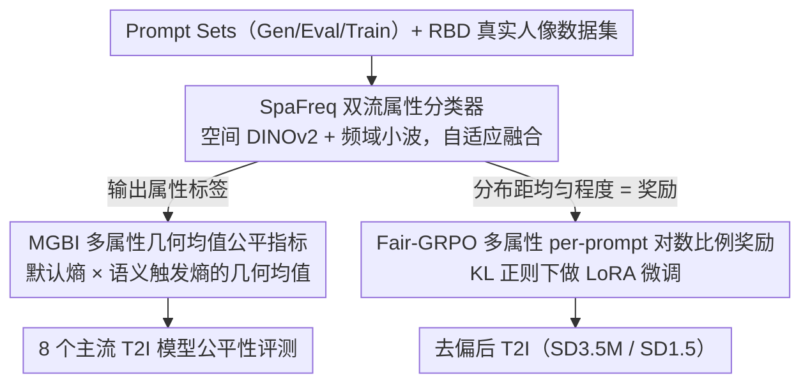

# HoloFair: Unified T2I Fairness Evaluation and Fair-GRPO Debiasing

**会议**: ICML2026  
**arXiv**: [2605.24687](https://arxiv.org/abs/2605.24687)  
**代码**: https://github.com/1059684669/HoloFair (有)  
**领域**: AI 安全 / 公平性 / 文生图 / 强化学习对齐  
**关键词**: T2I 公平性, MGBI, SpaFreq 分类器, Fair-GRPO, 多属性奖励

## 一句话总结
本文构建了一个面向 T2I 模型的统一公平性基准 HoloFair（含 SpaFreq 双流属性分类器 + MGBI 多属性几何均值指标），并在此基础上提出 Fair-GRPO：通过对数比例的多属性 per-prompt 奖励 + KL 正则化 GRPO，在 SD3.5-Medium 上把 MGBI 从 0.5211 提升到 0.6772（+29.9%），同时图像质量保持甚至略有提升。

## 研究背景与动机

**领域现状**：大规模 T2I 扩散/Transformer 模型（SDXL、SD3.5、Flux、SANA、Show-o、Bagel 等）在写实度和语义对齐上已经非常强，但人口学偏见普遍存在——即使用"a clear photo of a person"这种中性 prompt，输出在性别、年龄、种族三个维度上也会严重失衡。

**现有痛点**：现有公平性评估方法有两个盲点。一是**只评单维度**，比如 Luccioni 等只看默认 prompt 下的分布、Park 等只测职业偏见，**忽略了"竞争力/温暖度"这类社会描述符触发的隐式偏见**——一个 prompt 加上 "professional" 或 "aggressive" 就会把分布拉向某个特定群体。二是**默认 prompt 分布看起来公平不等于真公平**：作者实验显示 SDXL 的 ID 分数最高（0.8186），但 CA₀.₁₀ 几乎垫底，意味着在偏见触发语境下多样性彻底坍塌。

**核心矛盾**：去偏方法也都有硬伤——大规模微调（Shen 等）能改分布但计算昂贵且灾难性遗忘；推理时后处理（Friedrich 等、Chuang 等）会带来不可接受的延迟；交叉注意力概念编辑（Gandikota 等）覆盖范围有限。**fairness 和 fidelity/efficiency 三者难以同时兼顾**。

**本文目标**：(1) 设计能同时检测默认偏见和语义触发偏见的**评估指标 + 基准**；(2) 提出在不牺牲生成质量的前提下系统性去偏的训练方法。

**切入角度**：作者把公平性形式化为"跨语义上下文的分布一致性"，借鉴社会心理学的 Stereotype Content Model（SCM），手工挑选 competence/warmth 两个维度上的 9 个语义触发词（aggressive、compassionate、professional 等）作为压力测试。**评估侧**用"默认熵 + 语义触发熵"的几何均值惩罚不平衡；**去偏侧**直接把多属性分布距离均匀的程度变成 RL 奖励信号，跑 GRPO。

**核心 idea**：用 SCM 触发词暴露 T2I 的深层语义偏见，用对数比例 per-prompt 奖励把"分布均匀"翻译成 GRPO 的可优化信号，并用 KL 正则防止 reward hacking。

## 方法详解

### 整体框架
HoloFair 要解决的是"T2I 模型在中性 prompt 下就有人口学偏见、加上语义触发词后多样性还会瞬间坍塌"这件事，并把"测得出偏见"和"训得掉偏见"装进同一套基础设施。它先合成 Gen/Eval/Train 三个 prompt 集并配一份统一了 FairFace 分类体系（性别 2 类、年龄 3 类、种族 5 类）的真实人像数据集 RBD，在上面训出 SpaFreq 双流分类器；这个分类器既给 T2I 输出打属性标签供 MGBI 指标评分，又直接充当 Fair-GRPO 的奖励模型，对目标 T2I（SD3.5M / SD1.5）的 LoRA 做 RL 微调。换句话说，评估用的尺子和优化用的信号是同一把，天然保证去偏目标和评测口径一致。

### 关键设计

**1. SpaFreq 双流属性分类器：把"被语义绑架的纹理细节"重新捞回来**

去偏的前提是先有一个能可靠识别图像人口学属性的分类器，而种族这类属性高度依赖肤色、纹理这种细粒度信号——纯空间视图的高层语义特征往往把这些细节"绑架"丢失。SpaFreq 的做法是在 DINOv2-Base 骨干上并联一个频域流作为非语义补充：先把 RGB 转灰度，做 db4 离散小波分解得到低频 $cA$ 和水平/垂直两个高频分量 $cH$、$cV$，逐通道 min-max 归一化后沿通道拼成 $X_{\text{freq}}$；再把空间输入 $X_{\text{spatial}}$ 和 $X_{\text{freq}}$ 沿 batch 维拼起来一起过 DINO，分别拿到 CLS embedding $\mathbf{f}_s$ 和 $\mathbf{f}_w$。

两路特征不是简单等权相加，而是用一个初始为 0 的可学权重 $w_{\text{fusion}}$ 经 sigmoid 得到 $\alpha = 1/(1+e^{-w_{\text{fusion}}})$，再做加权通道拼接 $\mathbf{z} = \text{Concat}(\alpha \mathbf{f}_s, (1-\alpha)\mathbf{f}_w)$ 后接小 MLP 头分类，让模型自己学每个属性该多看语义还是多看纹理。这套设计的收益在消融里很直接：加上频域流让种族准确率从 85.57 提升到 91.89，再加上自适应融合权重后三属性同时正确的整体准确率从 79.67 提升到 89.67。

**2. MGBI 多属性几何均值公平指标：不许一个维度的高分掩盖另一个维度的失衡**

传统评估只看默认 prompt 下的分布，会漏掉"加一个语义触发词就把分布拉偏"的隐式偏见，所以 MGBI 要用一个 $[0,1]$ 标量同时刻画"默认多样性"和"语义鲁棒性"，还要让属性数不同的维度可比。它的基础量是任一分布 $p$ 的归一化熵 $h_a(p) = -\sum_c \hat{p}(c)\log\hat{p}(c) / \log|C_a|$——用熵而非偏差比，是因为熵会显式惩罚 mode collapse。Intrinsic Diversity 对中性 prompt $s_0$ 在三个属性上取归一化熵的几何均值 $\text{ID} = (\prod_{a} \max(\epsilon, h_a(\hat{p}_a)))^{1/|\mathcal{A}|}$；Context-Robust Conditional Diversity 则对 9 个 SCM 触发词各算几何均值熵，取 10% 分位数近似最坏情况 $\text{CA}_q = \text{Quantile}_q(\{(\prod_a h_a(\hat{p}_a(\cdot|s)))^{1/|\mathcal{A}|}\}_{s\in\mathcal{S}})$，最终 $\text{MGBI} = \sqrt{\text{ID} \cdot \text{CA}_q}$。

这里几何均值是核心哲学：它不让某一维高分补偿另一维的失衡，即"一个属性公平不能抵消另一个属性的偏见"；10% 分位数则专门捕捉尾部最差行为，避免被高方差的均值欺骗。SDXL 恰好证明了这套设计的必要性——它默认分布看着最公平（ID=0.8186），但 CA₀.₁₀ 只有 0.2865，MGBI 立刻把它从"最公平"拉下来。

**3. Fair-GRPO 多属性 per-prompt 对数比例奖励：把"分布有多均匀"翻译成可优化的 RL 信号**

有了指标还要能优化它，难点是把"分布距离均匀的程度"变成 GRPO 能用的稠密奖励，且对极端计数稳定。对每个 prompt $p$ 采样 $N$ 张图，SpaFreq 分类后得到属性 $a$ 类别 $k$ 的组内计数 $N^a_k$，基础奖励用自适应对数比例 $r_{\text{base}}(k,a) = \log((N - N^a_k + \epsilon)/(N^a_k + \epsilon))$——多数类拿负惩罚、少数类拿正奖励，这个形式天然适配"目标是均匀分布"且对 0 计数不爆炸。对多类属性再做零中心化 $r_{\text{fair}}(k,a) = r_{\text{base}}(k,a) - \bar{r}_{\text{base}}(a)$，让完美均衡时奖励恰为 0、并把 5 类种族这种多类属性的信号尺度对齐到二类属性，避免均衡点漂移；之后裁剪到 $[-5, 5]$ 防止 $N^a_k = 0$ 时梯度爆炸。每张图最终奖励是三属性加权和 $R(I_p) = \sum_a w_a \cdot r_{\text{clip}}(F(I_p), a)$。

扩散过程跨时间步重用该奖励，并按 per-prompt-per-timestep 维护历史均值方差表算优势 $A(I_p, t) = (R(I_p, t) - \mu_R^{p,t})/(\sigma_R^{p,t} + \epsilon)$。训练目标是 KL 正则化的 GRPO $\mathcal{L}_{\text{total}} = \mathcal{L}_{\text{policy}} + \beta \mathcal{L}_{\text{KL}}$（PPO-Clip 配像素空间预测噪声均值的 KL 近似，$\beta = 0.05$）。这里 KL 正则是防 reward hacking 的关键：只最大化公平奖励，模型容易生成属性平衡但低质量的图，KL 约束把策略锁在参考模型附近，从而保住 CLIP-Score 和 FID。

### 损失函数 / 训练策略
LoRA rank=32 挂在 transformer 注意力 q/k/v + 输出投影上，AdamW lr=5e-5，$\beta_{\text{KL}}=0.05$，6×RTX 4090 训练。Train 集 10k 中性 prompt 严格与 Eval 集分离防止泄露。Per-prompt-per-timestep 历史奖励统计 + EMA + 混合精度 + 梯度裁剪共同保证训练稳定。

## 实验关键数据

### 主实验

T2I 模型公平性评估（8 个主流模型，Eval 集 750 prompt）：

| 模型 | 类型 | ID ↑ | CA₀.₁₀ ↑ | MGBI ↑ |
|------|------|------|----------|--------|
| Flux1-dev | Gen-only | 0.6858 | **0.6702** | **0.6780** |
| SANA-1.5 | Gen-only | 0.7820 | 0.3821 | 0.5466 |
| SD3.5-Large | Gen-only | 0.7480 | 0.3693 | 0.5255 |
| SDXL | Gen-only | **0.8186** | 0.2865 | 0.4843 |
| Show-o | Unified | 0.7005 | 0.6013 | 0.6490 |
| Bagel | Unified | 0.6152 | 0.5004 | 0.5549 |
| Harmon | Unified | 0.5320 | 0.4661 | 0.4979 |
| Blip3-o | Unified | 0.4030 | 0.1856 | 0.2735 |

Fair-GRPO 去偏对比（SD3.5M 基线 MGBI=0.5211，SD1.5 基线 MGBI=0.6554）：

| 方法 | 骨干 | MGBI ↑ | CLIP-Score ↑ | FID ↓ |
|------|------|--------|--------------|-------|
| Baseline | SD3.5M | 0.5211 | 0.2288 | 143.26 |
| UCE | SD3.5M | 0.5769 | 0.2307 | 137.34 |
| Balancing_Act | SD3.5M | 0.5785 | 0.2311 | 155.60 |
| **Fair-GRPO** | SD3.5M | **0.6772** | **0.2317** | **135.09** |
| Baseline | SD1.5 | 0.6554 | 0.2197 | 165.37 |
| EFA | SD1.5 | 0.7084 | 0.2211 | 139.97 |
| **Fair-GRPO** | SD1.5 | **0.7881** | **0.2237** | **134.51** |

### 消融实验

SpaFreq 分类器组件消融（Overall = 三属性同时正确）：

| 配置 | Gender | Age | Race | Overall |
|------|--------|-----|------|---------|
| ViT-B + F.T. | 85.82 | 75.68 | 78.56 | 71.28 |
| DINO + F.T. | 91.20 | 82.85 | 85.57 | 79.67 |
| DINO + Fre. + F.T. | 96.78 | 91.12 | 91.89 | 85.33 |
| **DINO + Fre. + W.F. + F.T.** | **97.88** | **95.36** | **92.28** | **89.67** |

Fair-GRPO 多属性奖励消融（SD3.5M）：

| $R_{\text{gender}}$ | $R_{\text{age}}$ | $R_{\text{race}}$ | MGBI ↑ | CLIP-Score ↑ |
|---|---|---|--------|--------------|
| | | | 0.5211 | 0.2288 |
| ✓ | | | 0.6302 | 0.2253 |
| | ✓ | | 0.5813 | 0.2305 |
| | | ✓ | 0.5905 | 0.2310 |
| ✓ | ✓ | ✓ | **0.6772** | **0.2317** |

### 关键发现
- **高 ID 不保证低偏见**：SDXL 默认分布最公平（ID=0.8186）但 CA₀.₁₀ 几乎垫底（0.2865），CA-mean 和 CA₀.₁₀ 之间差距巨大说明语义触发下多样性瞬间坍塌——这直接驳斥了"只看默认分布就够"的传统评估范式。
- **公平正则反过来还能涨语义对齐**：Fair-GRPO 完整版 CLIP-Score 从 0.2122/0.2197 涨到 0.2317/0.2237，作者解释为鼓励模型探索更多样的图像空间反过来促成了更鲁棒的语义表征——这反直觉但符合"多样性即正则化"的直觉。
- **统一多模态模型公平性反而不如纯生成模型**：Gen-only 平均 ID≈0.75，Unified 平均 ID≈0.56，作者推测多模态联合训练为了"广义性"丢了表征多样性。
- **三属性奖励有协同效应**：单独任一属性奖励都能涨 MGBI（如 $R_{\text{gender}}$ 单独 0.6302），但三个一起才能到 0.6772，说明不同维度的去偏并非彼此独立。

## 亮点与洞察
- **SCM 触发词当压力测试**：把社会心理学的"能力-温暖度"维度直接搬来当 prompt 模板的属性词，是一个非常巧妙的"理论 grounded 的对抗集构造"思路——可以迁移到任何想测隐式偏见的生成任务，比如让 LLM 写人物简介。
- **几何均值 + 10% 分位数**：这套指标设计的核心哲学是"不允许一个维度补偿另一个维度"。这个原则对任何多目标评估（公平性、安全性、对齐度）都适用，比简单的算术平均更难被刷分。
- **对数比例 per-prompt 奖励**：这个奖励形式在 RLHF 类工作里其实不常见，但它特别适合"分布平衡"目标——既给少数类正信号，又给多数类负信号，零中心化后等价信号尺度，比简单的"距离均匀的负值"更平滑、对 0 计数更稳定。
- **复用分类器作为 reward model**：评估分类器和 RL 奖励模型用同一套 SpaFreq，省了再训一个 reward model 的成本，且天然保证评估和优化目标一致——但也带来"对分类器过拟合"的风险，作者用 KL 正则 + 训练-测试 prompt 分离来缓解。

## 局限与展望
- **属性维度只覆盖了 gender/age/race 三维**：作者承认是资源约束，但实际公平性还涉及残障、宗教、体型、地域等更多维度，扩展时需要重新训分类器并验证 MGBI 的几何均值是否仍合理。
- **离散人口学分类本身就有还原论问题**：性别二分、种族五分这套 FairFace 体系本身就有简化倾向，把连续/多元身份压缩成离散类别可能引入新的偏见——作者在 Impact Statement 里也明确承认。
- **奖励分类器的偏见会被继承**：SpaFreq 自己在 Overall 上也只有 89.67% 准确率，剩下 10% 错误分类会作为 RL 噪声进入策略更新，长期可能让模型学到分类器的偏置。
- **SCM 触发词集只有 9 个**：可能漏掉更微妙的语义触发（如行业术语、地域文化暗示），未来可以用 LLM 自动生成更大规模的对抗 prompt 集。
- **没有验证多语言场景**：所有 prompt 都是英文模板，跨语言的偏见模式可能完全不同。

## 相关工作与启发
- **vs Shen 等（平衡数据集微调）**：他们在平衡数据上全参微调，计算成本极高且容易灾难性遗忘；本文用 LoRA + RL，只动小部分参数，CLIP-Score 反而涨而不是降。
- **vs Friedrich 等 / Chuang 等（推理时引导）**：他们在推理时修改 text embedding 做去偏，会显著拉慢推理；本文是训练时一次性解决，推理时和原模型一样快。
- **vs UCE / Balancing_Act（概念编辑）**：他们改交叉注意力或加辅助网络，作用面有限且容易破坏其他概念；Fair-GRPO 的 KL 正则化保住了通用能力，在 8 个 metric 上都不掉分。
- **vs EFA（Park 等 2025）**：EFA 是当前最强的分类器/去偏方法，但只测职业偏见；本文 MGBI 涵盖了 SCM 触发的隐式偏见，且 Fair-GRPO 在 SD1.5 上把 EFA 的 0.7084 拉到 0.7881。
- **vs 普通 GRPO/RLHF**：标准 GRPO 用人类偏好做 reward，本文把分类器分布距离均匀的程度当 reward，开了"用结构化指标当 reward model"的口子——这个范式可以推广到任何"分布形状有先验"的对齐任务（多样性、安全性、长度控制）。

## 评分
- 新颖性: ⭐⭐⭐⭐ MGBI 几何均值 + SCM 触发集 + 对数比例 per-prompt 奖励三件套都是首次组合，但单独组件（GRPO、双流分类器）都有先例。
- 实验充分度: ⭐⭐⭐⭐ 评估了 8 个主流 T2I + 5 个去偏 baseline，消融了分类器组件和三个属性奖励，但只做了两个骨干（SD1.5/SD3.5M）。
- 写作质量: ⭐⭐⭐⭐ 动机讲得清楚，指标设计的"为什么"解释充分，公式编号统一，图表足够；少数地方（如 reward hacking 分析）略短。
- 价值: ⭐⭐⭐⭐ 既给社区一个可持续扩展的公平性基准（含代码 + 数据集），又给出一个不牺牲质量的实用去偏配方，对 T2I 部署侧很实用。

<!-- RELATED:START -->

## 相关论文

- [\[ICML 2026\] MIRO: 多奖励条件预训练同时提升 T2I 质量与效率](miro_multi-reward_conditioned_pretraining_improves_t2i_quality_and_efficiency.md)
- [\[ICCV 2025\] Fair Generation without Unfair Distortions: Debiasing Text-to-Image Generation with Entanglement-Free Attention](../../ICCV2025/image_generation/fair_generation_without_unfair_distortions_debiasing_text-to-image_generation_wi.md)
- [\[AAAI 2026\] T2I-RiskyPrompt: A Benchmark for Safety Evaluation, Attack, and Defense on Text-to-Image Model](../../AAAI2026/image_generation/t2i-riskyprompt_a_benchmark_for_safety_evaluation_attack_and_defense_on_text-to-.md)
- [\[ICML 2026\] Conformal Reliability: A New Evaluation Metric for Conditional Generation](conformal_reliability_a_new_evaluation_metric_for_conditional_generation.md)
- [\[ICML 2026\] AtelierEval: Agentic Evaluation of Humans & LLMs as Text-to-Image Prompters](ateliereval_agentic_evaluation_of_humans_llms_as_text-to-image_prompters.md)

<!-- RELATED:END -->
