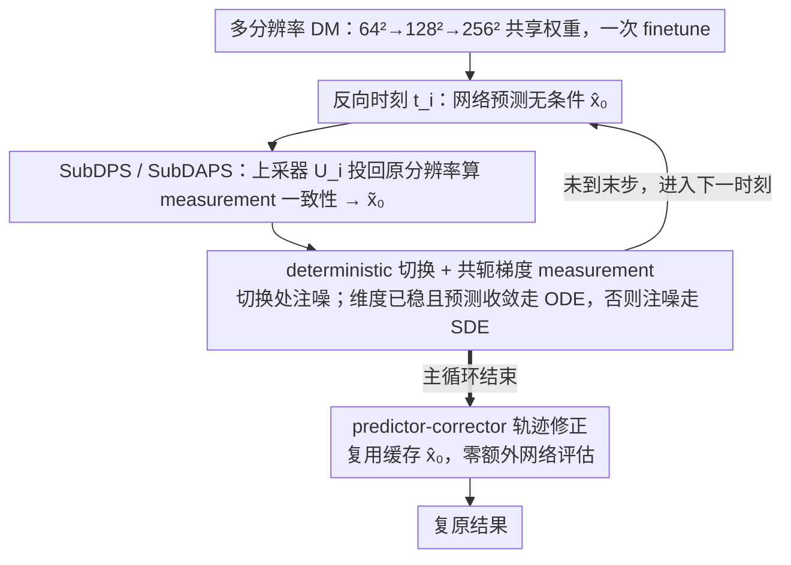

# Image Restoration via Diffusion Models with Dynamic Resolution

**会议**: ICML 2026  
**arXiv**: [2605.14267](https://arxiv.org/abs/2605.14267)  
**代码**: https://github.com/StarNextDay/SubDAPS (有)  
**领域**: 扩散模型 / 图像复原 / 加速推理  
**关键词**: 动态分辨率扩散, DAPS, 共轭梯度, predictor-corrector, ISR

## 一句话总结
SubDAPS / SubDAPS++ 把 DPS、DAPS 这类 pixel-space 扩散复原方法搬进"动态分辨率扩散模型"框架——早期在 $64^2 / 128^2$ 子空间采样、后期才回到 $256^2$ 全分辨率，并用共轭梯度替掉 Langevin、用阈值切换 stochastic / deterministic 采样、再附一个无需额外网络评估的 corrector 步，在 4 类线性 + 2 类非线性复原任务上多数指标超越 pixel 与 latent 扩散方法且推理更快。

## 研究背景与动机

**领域现状**：扩散模型在图像复原上很强，pixel-space 方法（DPS、DDRM、DDNM、DiffPIR、DAPS、AdaPS）直接在 $256^2 \times 3$ 上反复采样，反演质量高但慢；latent-space 方法（PSLD、ReSample、LatentDAPS、SILO）在 VAE 隐空间采样，理论上更便宜，但每步都要 VAE encoder/decoder，整体反而经常比 pixel 方法还慢。

**现有痛点**：(a) pixel 全程在高维上算，早期阶段绝大多数计算量花在"画全局结构"上，存在大量冗余；(b) latent 节省的是隐空间维度，却付出了反复编/解码的代价，且 VAE 本身限制可重建质量。

**核心矛盾**：你既想"早期省钱"又想"晚期画细节"，pixel/latent 各取一端都不优；需要一种 dimensionality-on-demand 的扩散过程。

**本文目标**：(a) 把动态分辨率扩散（Subspace Diffusion / UDPM / DVDP / DiMR / Fresco）从纯生成迁移到通用 image restoration；(b) 让 DPS / DAPS 这样的 pixel-space algorithm 在动态分辨率框架下还能用 measurement consistency；(c) 进一步优化噪声注入、measurement update、轨迹修正三处子模块，把质量和速度同时再推一档。

**切入角度**：作者抓住 Jing et al. (2022) 关于"早期 timestep 主要是低频，可以在低分辨率子空间做"的洞察，注意到这正是 ISR 这种"先恢复全局结构再补高频"任务的天然适配。

**核心 idea**：先 finetune pretrained pixel DM 为多分辨率三档（$64^2 / 128^2 / 256^2$）共享权重；把 DPS / DAPS 改造为 SubDPS / SubDAPS 做基线；再针对 SubDAPS 提出三项改进（CG 解 measurement、deterministic 切换、predictor-corrector）合成 SubDAPS++。

## 方法详解

### 整体框架
推理沿时间 $0 = t_0 < t_1 < \dots < t_N = T$ 反向走，每个时刻关联一个维度 $d_i$，满足 $d = d_0 \geq d_1 \geq \dots \geq d_N$（论文用 $256^2 \to 128^2 \to 64^2$ 三档）。每步做三件事：(1) 用 $\bm{x}_\theta(\bm{x}_{t_i}, t_i)$ 得到无条件预测 $\hat{\bm{x}}_0$；(2) 用 measurement 把 $\hat{\bm{x}}_0$ 修正成与观测一致的 $\tilde{\bm{x}}_0$；(3) 若该步要从 $d_i$ 上采到 $d_{i-1}$，把状态投回上层并注入噪声以匹配 diffusion prior；否则按收敛准则决定继续注入随机噪声还是改用 deterministic 更新。SubDAPS++ 在主循环结束后再加一个 predictor-corrector pass 不调网络地修正整条轨迹。

### 关键设计

**1. SubDPS / SubDAPS：给 measurement 修正套一个上采器，让 DPS/DAPS 进得了子空间**

DPS 的梯度 trick 和 DAPS 的解耦轨迹都是为 pixel-space 设计的，一旦在 $64^2/128^2$ 子空间采样，观测 $\bm{y}$ 仍住在原图域，两者就对不上。作者的解法是只在 measurement operator 前塞一个上采矩阵 $\bm{U}_i$，把子空间预测投回原分辨率再算一致性。对 DPS，在维度不变的步 $d_{i-1} = d_i$ 上，把 likelihood 梯度改写为 $\nabla_{\bm{x}_{t_i}} \log p_{t_i}(\bm{y} | \bm{x}_{t_i}) \approx -\zeta_{t_i} \nabla_{\bm{x}_{t_i}} \|\bm{y} - \mathcal{A}(\bm{U}_i \bm{x}_\theta(\bm{x}_{t_i}, t_i))\|^2$；对 DAPS 则先解优化问题 $\hat{\bm{x}}_0^{t_i} = \arg\min_{\bar{\bm{x}}_0} \big( r_{t_i} \|\bar{\bm{x}}_0 - \tilde{\bm{x}}_0^{t_i}\|^2 + \|\bm{y} - \mathcal{A}(\bm{U}_i \bar{\bm{x}}_0)\|^2 \big)$，再 stochastic 采样到下一步。

分辨率切换处 $d_{i-1} \neq d_i$ 是这套改造的麻烦点——上采本身会引入误差。作者借了 DAPS 的观察"早期注入的随机噪声足以纠正累积误差"，干脆在切换步不做专门修正，直接 $\bm{x}_{t_{i-1}} = \alpha_{t_{i-1}} \dot{\bm{U}}_i \bm{x}_\theta(\bm{x}_{t_i}, t_i) + \sigma_{t_{i-1}} \bm{\epsilon}_i$，把切换误差交给后续噪声去抹平。这个"只加一个 $\bm{U}_i$"的算子改造很轻，却让 DPS/DAPS 在子空间内部和切换点上都自洽。

**2. SubDAPS++ 的 deterministic 切换 + 共轭梯度 measurement：把低 timestep 的伪迹和迭代成本一起砍掉**

SubDAPS 全程注入随机噪声，但到了低 timestep、已经回到全分辨率时，多余的噪声会破坏 diffusion prior、留下 artifact。作者用两个条件刻画"该切到确定性更新"的时机：先定义最后一次维度变化的 index $h = \min\{i: d_{i-1} \neq d_i\}$，当 $i < h$（维度已稳定到 $256^2$）且预测已收敛 $\|\bm{x}_\theta(\bm{x}_{t_i}, t_i) - \hat{\bm{x}}_0^{t_i}\|^2 \leq \tau$ 时，改走 deterministic 更新 $\bm{x}_{t_{i-1}} = \alpha_{t_{i-1}} \hat{\bm{x}}_0^{t_i} + \frac{\sigma_{t_{i-1}}}{\sigma_{t_i}}(\bm{x}_{t_i} - \alpha_{t_i} \hat{\bm{x}}_0^{t_i})$，否则继续注噪。这等于把"剩多少噪声该走 SDE 还是 ODE"交给当前轨迹自己判断，比按固定 timestep 硬切更鲁棒。

另一半是把 measurement 更新里的 Langevin 换成 Fletcher-Reeves 共轭梯度。SubDAPS 解 measurement 子问题用 Langevin，慢且只对可微算子友好；CG 每步把 $\mathcal{A}(\bm{U}_i(\bar{\bm{x}}_0^{(j)} + \alpha \bm{d}_j))$ 做一阶 Taylor 线性化，从而得到闭式步长 $\alpha_j = (\bm{g}_j^\top \bm{d}_j) / (r_{t_i} \bm{d}_j^\top \bm{d}_j + \bm{\omega}_j^\top \bm{\omega}_j)$，搜索方向按 $\bm{d}_{j+1} = \bm{g}_{j+1} + \frac{\bm{g}_{j+1}^\top \bm{g}_{j+1}}{\bm{g}_j^\top \bm{g}_j} \bm{d}_j$ 更新。闭式 line search 同时适用线性和非线性 measurement，比 Langevin 既快收敛又少超参，也比 DDRM/DDNM 那种只为线性算子设计的路线适配面更广。

**3. 不增加网络评估的 predictor-corrector 轨迹修正：事后免费把噪声拉宽的偏差拉回来**

主循环为防发散注入了随机噪声，代价是轨迹偏差被拉宽。作者在主循环跑完后再过一遍轨迹做修正，形式借自 UniPC 的二阶 corrector：

$$\bm{x}_{t_{i-1}}^c = \frac{\sigma_{t_{i-1}}}{\sigma_{t_i}} \dot{\bm{U}}_i \bm{x}_{t_i}^c - \left(\sigma_{t_{i-1}} \frac{\alpha_{t_i}}{\sigma_{t_i}} - \alpha_{t_{i-1}}\right) \hat{\bm{x}}_0^{t_{i-1}} - \sigma_{t_{i-1}} \mathcal{I}_i \frac{\hat{\bm{x}}_0^{t_{i-1}} - \dot{\bm{U}}_i \hat{\bm{x}}_0^{t_i}}{\lambda_{t_{i-1}} - \lambda_{t_i}}$$

其中 $\lambda_t = \log(\alpha_t/\sigma_t)$ 是 half log-SNR。关键在于这一步完全复用主循环里缓存的 $\hat{\bm{x}}_0^{t_i}$，不再调用神经网络——纯解析公式把状态拉回更"标准"的扩散轨迹，几乎零成本就能再涨一档。

### 损失函数 / 训练策略
- 训练：在 Dhariwal-Nichol 预训练 pixel DM 基础上 finetune，目标里 $\bm{x}_0$、$\tilde{\bm{U}}^\top \bm{x}_0$、$\hat{\bm{U}}^\top \bm{x}_0$ 三档分辨率联合 denoise，让单个网络可处理 $256/128/64$ 三种分辨率；只 finetune 一次，所有下游任务共享。
- 推理：唯一与 SubDAPS 不同的是把 multi-step ODE solver 估 $\tilde{\bm{x}}_0$ 退化为单次网络评估 $\tilde{\bm{x}}_0 = \bm{x}_\theta(\bm{x}_{t_i}, t_i)$；measurement consistency 用 $J$ 步 CG；切换阈值 $\tau$、上采索引 $h$、噪声水平 $\sigma$、迭代数 $N$ 都是超参。

## 实验关键数据

### 主实验

| 任务 (256² FFHQ) | 类型 | DiffPIR | MGPS | DAPS | AdaPS | LatentDAPS | **SubDAPS++** |
|---|---|---|---|---|---|---|---|
| Inpainting 70% rand, PSNR ↑ | pixel/latent/dynamic | 32.16 | 31.41 | 30.68 | **32.34** | 31.17 | 32.21 |
| Inpainting 70% rand, LPIPS ↓ | | 0.052 | 0.050 | 0.073 | 0.057 | 0.090 | **0.056** |
| SR ×4, PSNR ↑ | | 27.64 | 27.58 | 28.88 | 27.34 | 28.56 | **29.34** |
| SR ×4, LPIPS ↓ | | 0.116 | 0.110 | 0.162 | **0.090** | 0.174 | 0.157 |
| Gaussian Deblur (FFHQ), PSNR ↑ | | 28.07 | 27.78 | 28.91 | 27.02 | 28.50 | — (≈ DAPS) |
| Motion Deblur (FFHQ), PSNR ↑ | | 26.95 | 26.82 | 28.27 | 27.06 | 27.58 | **28.28** |

| 任务 (256² ImageNet) | 类型 | DPS | DAPS | LatentDAPS | **SubDAPS++** |
|---|---|---|---|---|---|
| Inpainting 70%, PSNR ↑ | | 25.33 | 27.63 | 27.33 | **28.61** |
| Inpainting 70%, FID ↓ | | 141.99 | 56.73 | 85.24 | **49.15** |
| SR ×4, PSNR ↑ | | 21.68 | 25.54 | 25.43 | **25.79** |
| SR ×4, LPIPS ↓ | | 0.432 | 0.354 | 0.377 | 0.358 |

### 消融实验

| 配置 | 说明 |
|---|---|
| SubDPS | 朴素移植 DPS 到动态分辨率，性能与 DPS 同档（最弱），主要价值是验证框架可用 |
| SubDAPS | 直接得到与 DAPS 相当或略好的结果，且因子空间提速 |
| SubDAPS + CG 替 Langevin | measurement 更新更快、对非线性算子兼容 |
| SubDAPS + deterministic 切换 | 减少低 timestep 伪迹，PSNR 涨、LPIPS 降 |
| SubDAPS + corrector | 不调网络的二阶修正，几乎免费再涨一档 |
| 全堆 = SubDAPS++ | 在 6 类任务里多数指标第一或第二 |

### 关键发现
- 动态分辨率比 latent 路线更适合复原任务：避免了 VAE 编/解码反复带来的 overhead，且没有 VAE 重建瓶颈，所以 SubDAPS++ 比 LatentDAPS 在几乎所有数据集上同时更快更准。
- "前期低分辨率画结构、后期全分辨率补细节"对 ISR / inpainting 这种本来就需要全局到局部的任务很顺手；motion deblur 这种全局退化场景受益尤其明显。
- 把"切换 stochastic→deterministic"用预测收敛性 + 维度稳定性两个条件控制，是一个比"按 timestep 切"更鲁棒的策略——它把"剩多少噪声该走 SDE 还是 ODE"交给当前轨迹自己判断。
- CG + 一阶 Taylor 闭式 line search 让 measurement 更新对任意可微 $\mathcal{A}$ 都能跑（不只线性），扩展性比 DDRM/DDNM 那条专为线性算子设计的路线更强。

## 亮点与洞察
- "把动态分辨率扩散从生成借给复原"这个跨界迁移是这篇最具洞察力的一笔——同一个思路不同任务下意义完全不同，复原刚好契合"先粗后细"的天然结构。
- 三件 patch（CG、切换、corrector）各自来自不同邻居（数值优化 / 采样器、deterministic ODE 切换、UniPC predictor-corrector），但作者把它们组合在一起且互不冲突，是工程组合的典范。
- 共享一个 finetuned 多分辨率 DM 来服务所有任务和所有分辨率，使部署时无需为每个分辨率训新模型，对工业落地友好。
- 对 measurement 用 CG + 一阶 Taylor 闭式步长这个细节挺漂亮——既保留共轭梯度的快收敛，又让代码实现对任何可微算子都通用，迁移性好。

## 局限与展望
- 动态分辨率只到三档；面对更高分辨率（$1024^2$ 以上）是否需要更多层 + 更复杂上采矩阵，论文没探讨。
- 切换阈值 $\tau$ 是固定超参，作者承认对一些任务需要单独调；自适应 $\tau$ 应该是下一个方向。
- Corrector 是事后批量做的，没有在生成途中纠错；如果出现严重 hallucination 后期已经没法挽回。
- 与最新 LDM 复原（如基于 SD 的方法）的对比偏少；尤其在自然图像 super-resolution 上，SD-based 在感知指标上常有优势。

## 相关工作与启发
- **vs DPS / DAPS**：本文几乎是"用动态分辨率重写 DPS/DAPS"——保留它们的 measurement 修正思路，但把每一步搬到合适维度，加速且不掉点。
- **vs PSLD / ReSample / LatentDAPS**：latent 路线靠 VAE 降维，付出 encoder/decoder 反复调用的代价；动态分辨率不需要 VAE，所以速度和质量更平衡。
- **vs Subspace DM / UDPM / DiMR / Fresco**：那些是动态分辨率的"生成版"，本文是首次系统化做"复原版"，并解决了 measurement consistency 在维度切换处的协调难题。
- **vs UniPC**：UniPC 的 corrector 给确定性 ODE 用；本文把它移植到 stochastic 主循环结束后，作为"事后免费纠错"，是一种聪明的范式跨界。
- 启发：动态分辨率思想也可以反过来用——比如视频生成中按时间段切空间分辨率、3D 重建中按 LoD 切体素分辨率，本质都是"先粗后细"的归纳偏置。

## 评分
- 新颖性: ⭐⭐⭐⭐ 把动态分辨率 DM 首次用于一般 image restoration，并把 DPS/DAPS 一起改造。
- 实验充分度: ⭐⭐⭐⭐⭐ 4 线性 + 2 非线性任务 × FFHQ/ImageNet 双数据集 × 三类 baseline（pixel/latent/dynamic）全套对比。
- 写作质量: ⭐⭐⭐⭐ 算法伪代码、公式推导、合理切换条件都讲得清楚；图示稍少。
- 价值: ⭐⭐⭐⭐ 推理同时快又准，且不靠 VAE，对实际部署是真正的提速方案。

<!-- RELATED:START -->

## 相关论文

- [\[CVPR 2026\] VibeToken: Scaling 1D Image Tokenizers and Autoregressive Models for Dynamic Resolution Generations](../../CVPR2026/image_generation/vibetoken_scaling_1d_image_tokenizers_and_autoregressive_models_for_dynamic_reso.md)
- [\[ICLR 2026\] Eliminating VAE for Fast and High-Resolution Generative Detail Restoration](../../ICLR2026/image_generation/eliminating_vae_for_fast_and_high-resolution_generative_detail_restoration.md)
- [\[ICML 2026\] Q-DiT4SR: Exploration of Detail-Preserving Diffusion Transformer Quantization for Real-World Image Super-Resolution](q-dit4sr_exploration_of_detail-preserving_diffusion_transformer_quantization_for.md)
- [\[CVPR 2026\] Training-free, Perceptually Consistent Low-Resolution Previews with High-Resolution Image for Efficient Workflows of Diffusion Models](../../CVPR2026/image_generation/training-free_perceptually_consistent_low-resolution_previews.md)
- [\[ICML 2026\] Learning General Causal Structures with Hidden Dynamic Process for Climate Analysis](learning_general_causal_structures_with_hidden_dynamic_process_for_climate_analy.md)

<!-- RELATED:END -->
