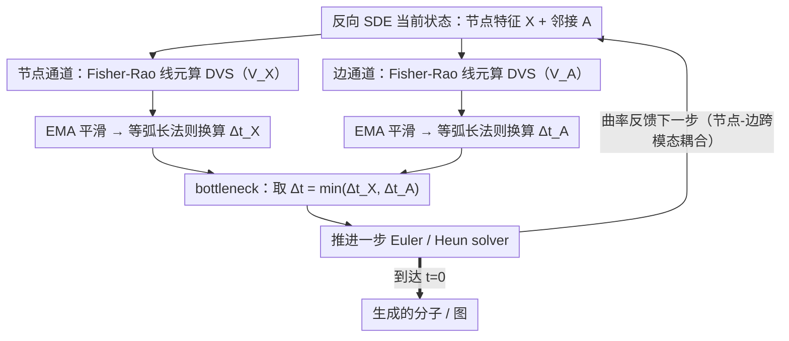

# Information-Geometric Adaptive Sampling for Graph Diffusion

**会议**: ICML 2026  
**arXiv**: [2605.00250](https://arxiv.org/abs/2605.00250)  
**代码**: 无  
**领域**: 扩散模型 / 图生成 / 自适应采样  
**关键词**: 图扩散, Fisher-Rao 度量, 自适应步长, 信息几何, 分子生成

## 一句话总结
本文把图扩散反向 SDE 的采样轨迹看成 Riemannian 统计流形上的参数曲线，用 Fisher-Rao 度量推出一个无需训练的 Drift Variation Score (DVS) 来度量轨迹的局部"信息曲率"，并据此自适应缩放步长，使每步在信息流形上前进等长，从而在分子（QM9/ZINC250k）和图（Planar/SBM/Ego）生成中以更少步数取得更高 FCD / MMD 保真度。

## 研究背景与动机

**领域现状**：图扩散模型（GDSS、GruM 等）用反向 SDE 在节点特征 $\mathbf{X}$ 和邻接 $\mathbf{A}$ 上联合去噪，主流采样器都是 Euler-Maruyama / Heun 等固定步长 predictor-corrector 框架。

**现有痛点**：(i) 固定步长隐含假设"等时间间隔 = 等分布变化"，但反向 SDE 在不同时段动力学严重不均：高噪声段 drift 平滑、低噪声段 drift 急剧变化（stiff）；(ii) 启发式 quadratic schedule 是静态预设，无法根据数据/模型自适应；(iii) 基于局部截断误差的自适应步长在状态空间估误差，忽略概率路径的内禀几何；(iv) 图数据特有的"节点 vs 边异步去噪"让节点和边的 stiff 时刻不一致，单一步长很难兼顾。

**核心矛盾**：要均匀刻画"分布演化速率"，必须放弃用时间 $t$ 作弧长——时间是外参，分布距离才是内禀几何。

**本文目标**：(i) 为图扩散反向 SDE 提供一个"信息几何"语义下的自适应步长指标；(ii) 让节点和边各自有 stiff 检测信号并能联合决策；(iii) 即插即用、不重训。

**切入角度**：把反向 SDE 在每个时刻诱导的高斯转移核 $p(x_{t+dt}|x_t; f_t)$ 看成以 drift $f_t$ 为坐标的统计流形的一点，整段采样就是一条曲线；用 Fisher-Rao 度量（由 Chentsov 定理唯一确定的不变度量）量曲线弧长——弧长就是"分布变化的内禀距离"。

**核心 idea**：每步 $\Delta s^2 \approx$ 常数 ⇒ $\Delta t \propto 1/V_t$，其中 $V_t = \|d f_t\|^2 / g_t^2$ 就是 DVS。

## 方法详解

### 整体框架
本文要解决的是图扩散反向 SDE "用固定步长采样"的浪费：高噪声段动力学平滑却照样一步步磨，低噪声段 drift 急剧变化（stiff）却来不及细分。作者的转法是不再用时间 $t$ 当采样进度的标尺，而是把每个时刻诱导的高斯转移核看成统计流形上的一点，用 Fisher-Rao 度量量出"分布到底变了多快"，让采样器在这条信息流形上等弧长前进。落到实现上，每个离散时刻对节点 $\mathbf{X}$ 和邻接 $\mathbf{A}$ 各算一个反映局部信息曲率的标量 DVS，EMA 平滑后按幂律换算成步长，取两支里更保守的那个推进一次 Euler/Heun solver step，再把曲率反馈给下一步。整套逻辑只在采样循环里加几行，不碰预训练 score 网络。

### 关键设计

**1. Fisher-Rao 线元 + Drift Variation Score：给"分布变化速率"一个可在线算的标量**

固定步长的根本病因是它假设"等时间间隔 = 等分布变化"，可反向 SDE 在不同时段动力学严重不均。作者把这件事量化：反向 SDE $dx_t = f_t dt + g_t d\bar{w}_t$ 在一个小时间片内的转移核是高斯 $p(x_{t+dt}\mid x_t; f_t) = \mathcal{N}(x_t + f_t dt,\, g_t^2 dt\, I)$，把 drift $f_t$ 当作流形坐标，对 log-likelihood 求梯度得到 Fisher 信息矩阵 $\mathcal{I}(f_t) = \frac{dt}{g_t^2}I$，于是流形上的线元 $ds^2 = \frac{dt}{g_t^2}\|df_t\|^2$。时间归一后得到无量纲的 Drift Variation Score：$V_t = ds^2/dt = \|df_t\|^2 / g_t^2$，离散 solver 里就用相邻两步差分估 $V_k = \|f(x_k, t_k) - f(x_{k-1}, t_{k-1})\|^2 / g_{t_k}^2$。这个标量同时吃进"drift 变化量"和"噪声尺度"——$g_t$ 一小 $V_t$ 就一大，正好对应"低噪段 drift 一抖就翻车"的物理直觉，提醒采样器此处该减速。之所以选 Fisher-Rao 而非随手凑的度量，是因为 Chentsov 定理保证它是统计流形上唯一的 sufficient-statistic 不变度量，比启发式 schedule 有原则。

**2. 等弧长自适应步长法则：把质量风险和步数预算均匀摊开**

有了 DVS 当弧长速率，调度目标就变成"每步在流形上前进近似等长"，即要 $\Delta s_k^2 = V_k\cdot\Delta t_k \approx \text{const}$。反解出步长 $\Delta t_k = \text{clip}\big(\Delta t_{\text{base}}(\kappa_{\text{ref}}/\bar{V})^\beta,\ \Delta t_{\min},\ \Delta t_{\max}\big)$，其中 $\kappa_{\text{ref}}$ 是目标曲率参考值，$\beta=0.5$ 取平方根阻尼防止步长剧烈抖动。效果是 stiff 区（高 $V$）步长自动收缩、平滑区（低 $V$）步长自动扩张。为什么值得这么做，Fig 3 看得最直观：固定 $\Delta t$ 下 $\Delta s^2$ 前中段几乎贴零、末段指数爆炸，等于早期空烧算力、末期结构成键时又爆雷；等 $\Delta s^2$ 策略把整条"信息进度"曲线压平，算力花在真正有信息变化的地方。

**3. 节点-边双通道 + bottleneck 步长 + EMA 平滑：照顾图数据的异步去噪**

图扩散有个特有麻烦：节点（连续特征）和边（离散邻接）的去噪速度天差地别，stiff 时刻并不重合，单一步长指标必然丢掉一边。作者因此分别算 $V_{\mathbf{X},k}, V_{\mathbf{A},k}$ 两路 DVS，各自换算出候选步长 $\Delta t_{\mathbf{X},k}, \Delta t_{\mathbf{A},k}$，最终取 $\Delta t_k = \min(\cdot, \cdot)$，让更 stiff 的那条支路当 bottleneck、不被另一支拖跨。同时 SDE 自身的随机性会把 DVS 估计噪声化，所以每路再过一道 EMA $\bar{V}\leftarrow(1-\alpha)\bar{V} + \alpha V_k$（$\alpha=0.2$）滤高频抖动又能跟上结构突变；每步推进后还把曲率乘增益反馈给下一步 $\bar{V}\leftarrow\gamma(\bar{V}_{\mathbf{X}} + \bar{V}_{\mathbf{A}})$，注入节点-边之间的跨模态耦合。

### 损失函数 / 训练策略
完全 training-free，没有任何可学习参数。采样阶段引入 4 个超参：$\kappa_{\text{ref}}$ 参考曲率（数据自适应）、$\gamma$ 反馈增益（QM9 实验里 0.10-0.35 扫到 0.20 最佳）、$\beta=0.5$ 阻尼指数（固定）、$\alpha=0.2$ EMA 系数（固定）。在某些数据集上仅对采样轨迹的部分区间启用 DVS（appendix B.1），其他时段保持固定步长以稳数值。

## 实验关键数据

### 主实验

| 数据集 | 模型 | 方法 | 关键指标 |
|--------|------|------|----------|
| QM9 | GruM + Euler | Fixed-Step | FCD 0.107 |
| QM9 | GruM + Euler | Quadratic | FCD 0.107 |
| QM9 | GruM + Euler | DVS (Ours) | **FCD 0.095** |
| QM9 | GruM + Heun | DVS | **FCD 0.099 / SSIM 等综合最佳** |
| ZINC250k | GruM + Euler | DVS | FCD 2.092 vs 2.207 baseline |
| QM9 | GDSS + Euler | DVS | FCD 2.482 vs 2.551 |
| Planar | GruM + Heun | DVS | Spec MMD 0.0049 vs 0.0059 |
| SBM | GruM + Euler | DVS | Spec MMD 0.0030 vs 0.0051 |

### 消融实验

| $\gamma$ | NFE (步数) | Valid ↑ | FCD ↓ | Scaf. ↑ |
|----------|-----------|---------|-------|---------|
| Euler 基线 | 1000 | 0.9943 | 0.1065 | 0.9341 |
| 0.10 | 706 | 0.9937 | 0.1050 | 0.9370 |
| 0.20 | 745 | 0.9947 | **0.0976** | 0.9415 |
| 0.25 | 770 | 0.9956 | 0.1028 | **0.9455** |
| 0.35 | 836 | 0.9951 | 0.1043 | 0.9428 |

### 关键发现
- **步数减 25%、质量反升**：QM9 上 DVS 用 745 步达到 FCD 0.0976，而 Euler 1000 步只到 0.1065，说明"分配"比"加量"更重要。
- **DVS-Euler 常常追平甚至超越 Fixed-Step Heun**：暗示对图数据，"在流形上等弧长前进"比"高阶 solver 局部更精确"更划算。
- **等弧长可视化（Fig 3）**：Euler 的 $\Delta s^2$ 早中期接近 0、末段指数爆炸；DVS 把整条曲线压平为接近常数，只在最后撞 $\Delta t_{\min}$ 时略翘——这是 InfoLaw 论文所述 "rush through stiff" 问题的直观对应。
- **$\gamma$ 决定 conservativeness**：$\gamma$ 越大反馈越强、步长越细、NFE 越多；FCD 在 0.20、Scaf 在 0.25 各自达到甜点，二者错开说明不同指标对"细分度"偏好不同。
- 通用图（SBM、Planar、Ego-small）的 spectral / orbit MMD 同样压倒 quadratic，说明信息几何指标对捕捉"全局拓扑+局部 motif"都有效。

## 亮点与洞察
- **把"什么时候多走、什么时候少走"上升到信息几何**：相比 EDM-Karras 等用 noise schedule 经验调参，DVS 从 Fisher-Rao 度量推出，原则性强；这种"换坐标系思考采样调度"的视角可以直接迁移到 score-based 图像扩散、video diffusion。
- **训练 free 即插即用**：直接在采样循环加 4 行算 DVS、更新 EMA、决定 $\Delta t$，对现有 GruM/GDSS 等模型零侵入，是落地友好的工程改造。
- **双通道 + bottleneck**：把节点和边视作两个异步组件，最终步长由 stiff 那条 bottleneck 决定，这种思路可推广到任何多分量耦合扩散（文本+图像、3D 几何+语义）。
- **Fig 3 等弧长可视化**：是这篇文章最有教学价值的一张图——告诉社区"固定步长 = 烧前期、爆末期"的尴尬。

## 局限与展望
- 仅在两类图扩散模型（GruM 的 OU bridge 和 GDSS 的 score SDE）上验证，对 discrete diffusion (DiGress) 等没测。
- 在某些数据集上 DVS 只在轨迹部分区间启用，区间的选择仍是经验设定，没给统一规则。
- $\gamma, \kappa_{\text{ref}}$ 是数据集相关超参，换数据集需要重新扫；缺一个自动校准方法。
- DVS 用相邻两步 drift 差分估梯度，对超低 NFE（如 10 步）下噪声估计会失真。
- 没有比较推理成本——虽然 NFE 降了，但每步多了一次 EMA 更新和差分，是否真正端到端 wall-clock 加速没报告。

## 相关工作与启发
- **vs AYS (Sabour 2024)**：AYS 在状态空间估局部截断误差做时间重参数化；DVS 在分布空间估 Fisher-Rao 弧长，几何上更内禀，且与具体 SDE 形式无关。
- **vs Quadratic schedule (Song 2021a)**：quadratic 是数据无关的固定幂律；DVS 是数据-模型联合自适应，文章证明 quadratic 在大多数 setting 都被 DVS 压倒。
- **vs Karras EDM**：EDM 调 $\sigma(t)$ 是经验设计，DVS 在反向 SDE 直接用 Fisher metric，理论更清晰但适用面也更窄（依赖能解析算 Fisher 的 Gaussian 转移核假设）。
- **vs Song & Lai (Fisher Information for diffusion)**：他们用 Cramér-Rao 重加权 score；本文用 Fisher 度量重新分配步长。两者互补，未来可结合。

## 评分
- 新颖性: ⭐⭐⭐⭐ 把 Fisher-Rao 弧长引入 diffusion 采样调度是少见的视角，公式推导自洽。
- 实验充分度: ⭐⭐⭐⭐ 跨 2 个模型（GruM/GDSS）× 2 类任务（分子/通用图）× 多种 solver + $\gamma$ 扫，覆盖到位；少了一个 wall-clock 时间和超低 NFE 评估。
- 写作质量: ⭐⭐⭐⭐ Fig 1 概念图 + Fig 3 等弧长可视化把核心思想讲得很清楚，公式分段稳健。
- 价值: ⭐⭐⭐⭐ 训练 free + 即插即用 + 可解释，对部署侧吸引力强；如能扩展到图像/视频扩散将影响更大。

<!-- RELATED:START -->

## 相关论文

- [\[CVPR 2026\] Region-Adaptive Sampling for Diffusion Transformers](../../CVPR2026/image_generation/region-adaptive_sampling_for_diffusion_transformers.md)
- [\[CVPR 2026\] Adaptive Spectral Feature Forecasting for Diffusion Sampling Acceleration](../../CVPR2026/image_generation/adaptive_spectral_feature_forecasting_for_diffusion_sampling_acceleration.md)
- [\[ICML 2026\] Escaping Mode Collapse in LLM Generation via Geometric Regulation](escaping_mode_collapse_in_llm_generation_via_geometric_regulation.md)
- [\[ECCV 2024\] EchoScene: Indoor Scene Generation via Information Echo over Scene Graph Diffusion](../../ECCV2024/image_generation/echoscene_indoor_scene_generation_via_information_echo_over_scene_graph_diffusio.md)
- [\[ICML 2026\] Watch Your Step: Information Injection in Diffusion Models via Shadow Timestep Embedding](watch_your_step_information_injection_in_diffusion_models_via_shadow_timestep_em.md)

<!-- RELATED:END -->
