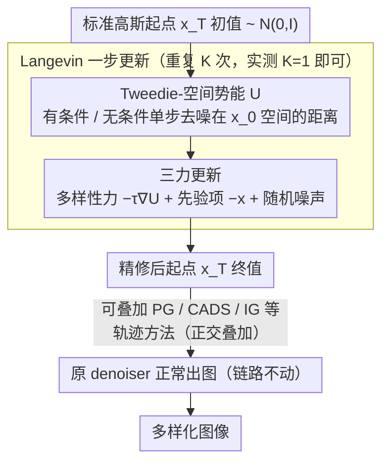

# Initialization is Half the Battle: Generating Diverse Images from a Guidance Potential Posterior

**会议**: ICML 2026  
**arXiv**: [2606.02453](https://arxiv.org/abs/2606.02453)  
**代码**: https://github.com/South7X/divin (有)  
**领域**: 扩散模型 / 图像生成  
**关键词**: 多样性增强, 初始噪声, Langevin 动力学, 模式坍塌, 引导势能

## 一句话总结
本文把"初始噪声"看作可以从一个由 conditional guidance 势能定义的后验中采样的随机变量，提出 DivIn：用一步 Langevin 动力学把标准高斯噪声往"低势能、平坦"的区域里推一推，在几乎不增加推理开销的前提下显著缓解扩散/flow matching 模型的 mode collapse，并和已有的 trajectory-based 多样性方法正交叠加。

## 研究背景与动机

**领域现状**：现代扩散模型和 flow matching 模型在文生图、类生图上的保真度已经很好，但严重存在 mode collapse —— 换 random seed 出来还是几张高度雷同的图，极端情况下甚至复现训练样本。提升多样性的主流路径都在改"生成轨迹"，例如调 CFG 尺度（CADS、Interval Guidance）或在轨迹上互相排斥（Particle Guidance）。

**现有痛点**：所有这些方法都默认起点 —— 各向同性高斯 $\mathcal{N}(0,\mathbf{I})$ —— 是 OK 的，只在后面动手脚。但作者发现一个被忽视的事实：标准高斯噪声对 conditional guidance 的"地形"完全无感知，常常恰好掉进 guidance 势能很高的"陡峰"附近，于是不同种子的随机轨迹会被同一个强 mode 吸引过去，最终输出几乎一样。

**核心矛盾**：现有的"种子优化"方法（最有代表性的是 SAIL）走另一个极端 —— 用确定性 Hessian/sharpness 优化挑一个"最佳种子"，结果反而把初始分布塌缩成一个点，破坏了原本的高斯先验，又会把整张图的多样性砍掉，而且 latent norm 偏离 $\sqrt{d}$ 后会出现高频伪影。

**本文目标**：把"挑初始噪声"重新表述成"从一个**保留先验、又偏向多样区域**的后验里采样"，既要利用 guidance 势能地形，又不能破坏初始分布的体积。

**切入角度**：作者注意到，conditional guidance 势能越高的区域，反向过程对应的概率体积收缩率越大（Theorem A.3），轨迹更容易被卷进单一 mode；用 1000 个 prompt 做实测，势能与 Vendi score 的 Spearman 相关系数为 $-0.4$（$p<0.001$）。所以**主动把初始噪声推向低势能basin**就能拉回多样性，但必须保持分布意义而非点估计。

**核心 idea**：用一步 Langevin 更新近似从 "diversity-weighted 后验" 里采样 —— 同时受三种力：(1) 把噪声推离高势能的 diversity force；(2) 把噪声拉回高斯先验流形的 prior constraint；(3) 防止陷入局部极小值的随机噪声项。

## 方法详解

### 整体框架

DivIn 要解决的是扩散/flow matching 模型换种子也出雷同图的 mode collapse，做法不去改后续的 denoising 轨迹，而是只在最前面修正起点：把"采初始噪声"从盲采各向同性高斯，改成从一个由 guidance 势能定义的后验里采样。这个后验写成 $p_{\text{diverse}}(\mathbf{x}_T|c) \propto \exp(-\tau \cdot U(\mathbf{x}_T,c)) \cdot \mathcal{N}(\mathbf{x}_T;0,\mathbf{I})$，温度 $\tau$ 调节"贴近高斯先验"和"追求低势能"之间的权衡。整条 pipeline 只多了一步：标准高斯起步 $\mathbf{x}_T^{(0)} \sim \mathcal{N}(0,\mathbf{I})$ → 用 $K$ 步 Langevin 把它推到这个后验上（实测 $K=1$ 已经够用）→ 把更新后的 $\mathbf{x}_T^{(K)}$ 交给原 denoiser 正常出图，后续链路一律不动。

### 关键设计

**1. Tweedie-空间的 guidance 势能 $U$：用便宜标量量化条件对起点的拉扯**

要从后验采样，先得有一个能描述"condition 在这个噪声点上 push 得有多猛"的势能，而且要便宜、稳定、跨 sampler 通用。DivIn 把它定义成有条件和无条件的单步 Tweedie 去噪估计在 $\mathbf{x}_0$ 空间的欧氏距离：$U(\mathbf{x}_T,c) = \|\hat{\mathbf{x}}_0(\mathbf{x}_T,c) - \hat{\mathbf{x}}_0(\mathbf{x}_T,\varnothing)\|_2$。这个差距越大，说明 condition 在 $\mathbf{x}_T$ 这点上把轨迹拽得越狠，不同种子越容易被同一个强 mode 吸过去。作者证明（Prop. A.1）它是局部曲率的稳健代理；而因为是投影到 $\hat{\mathbf{x}}_0$ 空间算的，不同 sampler 的 $\lambda_t$ 时间缩放被自然吸收掉，最优 $\tau$ 对推理步数（30 步 vs 50 步）几乎不敏感——这正是为了绕开 SAIL 那套 Hessian-score 二阶展开加手工阈值的脆弱做法。

**2. 后验上的 Langevin 一步更新：采样而非优化到一个最佳种子**

有了势能就要从后验取样，而不是确定性地优化出一个"最佳种子"。对后验取对数梯度得到 $\nabla_\mathbf{x}\log p_{\text{diverse}} = -\tau \nabla_\mathbf{x} U(\mathbf{x},c) - \mathbf{x}$，离散化成更新规则：

$$\mathbf{x}_T^{(k+1)} = \mathbf{x}_T^{(k)} - \eta\big(\tau \nabla U + \mathbf{x}_T^{(k)}\big) + \sqrt{2\eta}\,\boldsymbol{\xi}^{(k)}$$

这一步同时受三股力：diversity force $-\tau\nabla U$ 把 latent 推离势能陡峰；prior 项 $-\mathbf{x}$ 把它拉回 $\|\mathbf{x}\|\approx\sqrt{d}$ 的高斯流形；噪声项 $\sqrt{2\eta}\boldsymbol{\xi}$ 帮它跳出 shallow local min。和 SAIL 的根本分歧就在最后这个噪声项上——SAIL 把种子选择当确定性优化，一批 latent 最后全掉进同一个 sharp local min（图 5），分布体积被塌成一个点，多样性反被砍掉；DivIn 是分布层面的后验采样，能保留 entropy，让一批 latent 分散在 low-potential basin 里。

**3. 最小侵入设计带来的跨范式正交叠加**

DivIn 把"初始化"和"轨迹"明确切成两个独立的多样性来源，既然现有方法都默认起点已经够散，那只修起点就能白拿一份正交多样性。能做到 plug-and-play 的关键是 $U$ 定义在 $\hat{\mathbf{x}}_0$ 空间：扩散和 flow matching 都能用各自的公式 $\hat{\mathbf{x}}_0 = (\mathbf{x}_t - \sqrt{1-\bar\alpha_t}\epsilon_\theta)/\sqrt{\bar\alpha_t}$ 或 $\hat{\mathbf{x}}_0 = \mathbf{x}_t - t\mathbf{v}_\theta$ 算出势能，于是同一套 DivIn 能直接套在 SD v1.4（DDPM）和 SD v3.5 Medium（Rectified Flow）这两类完全不同的范式上，$K=1$ 时整步只多一次有条件加一次无条件 forward/backward。改完起点后再丢给 PG/CADS/IG 这些 trajectory 方法继续干预，相当于"更好的种子 + 原来的轨迹干预"，多样性直接乘法叠加。

### 损失函数 / 训练策略

DivIn 是完全 training-free 的推理时方法，不改动任何模型权重，整套方法的"目标函数"就是上面那条 Langevin 更新规则。关键超参有三个：温度 $\tau$（默认在 $[0.5, 1.0]$ 之间扫，越大多样性越强）、步长 $\eta$（如 $0.05$，对应噪声尺度 $\sqrt{2\eta}\approx 0.316$）、步数 $K$（默认 $1$；加大到 $3$ 时 diversity 有边际提升但 FID 也会涨）。

## 实验关键数据

### 主实验

**类生图（ImageNet-1K，SD v1.4，10k 张图，5 个 seed 平均）**：

| 方法 | Recall ↑ | Vendi Score ↑ | Coverage ↑ | FID ↓ |
|------|---------:|--------------:|-----------:|------:|
| Base Model | 0.503 | 4.265 | 0.596 | 16.696 |
| + SAIL | 0.543 | 4.549 | 0.591 | 16.395 |
| **+ DivIn (Ours)** | **0.569** | **4.688** | 0.597 | **16.158** |
| CADS | 0.528 | 4.384 | 0.598 | 16.360 |
| **CADS + DivIn** | **0.553** | **4.548** | 0.602 | 16.336 |
| IG | 0.564 | 4.585 | 0.597 | **15.531** |
| **IG + DivIn** | **0.576** | **4.729** | 0.599 | 15.877 |

**文生图（500 prompts 混合集，SD v3.5 Medium / Rectified Flow）**：DivIn 单独把 in-batch Similarity 从 0.793 降到 0.775，Vendi 从 1.803 升到 1.864；叠加 CADS 后 Similarity 进一步降到 0.761、Vendi 升到 1.918，且 CLIP score / Aesthetic score 基本持平甚至略涨。**对 trajectory 方法是真正的正交叠加，不是简单替换。**

### 消融实验

| 配置 | Recall ↑ | Vendi ↑ | Precision ↑ | FID ↓ |
|------|---------:|--------:|------------:|------:|
| Base Model | 0.503 | 4.265 | **0.833** | 16.696 |
| SAIL (确定性 baseline) | 0.543 | 4.549 | 0.825 | 16.395 |
| DivIn w/o noise（去掉 $\sqrt{2\eta}\xi$） | 0.541 | 4.534 | 0.822 | 16.544 |
| DivIn w/o prior（去掉 $-\mathbf{x}$） | 0.557 | 4.584 | 0.824 | **16.121** |
| **DivIn (full)** | **0.569** | **4.688** | 0.825 | 16.158 |

去掉随机项后效果立刻退化到 SAIL 水平，**说明多样性的真正来源是 Langevin 后验采样这套形式，而不是势能 $U$ 本身**；去掉 prior 项后短期 FID 反而略好，但把 $K$ 从 $1$ 加到 $3$，noise-free 的 FID 飙到 17.53、prior-free 飙到 17.36，full DivIn 只有 15.98 —— 两项缺一不可。

### 关键发现
- **Manifold preservation 是关键安全网**：SAIL 在 10 步优化里把 latent norm 从 $\sqrt{d}\approx 128$ 一路压下去，离开高斯流形后图像出现高频噪声伪影；DivIn 在三力平衡下，norm 始终稳定在 128 附近，可以多走 Langevin 步而不崩。
- **零开销近免费的多样性**：$K=1$ 时单图生成时间从 0.754s 涨到 0.779s，约 $+3\%$ 的 wall-clock 成本，而 SAIL 因为要走拒绝采样 + 二阶近似明显更贵。
- **正交性能在 Pareto 前沿上看到**：在 diversity-quality Pareto 图上，所有 baseline + DivIn 的曲线（实线）都把对应 baseline（虚线）整体包在内侧，**没有质量代价**地推外前沿。
- **温度 $\tau$ 提供平滑的可调旋钮**：$\tau$ 从 $0$ 调到 $1.0$，recall 从 $0.500$ 涨到 $0.607$，precision 仅小幅下降；相比之下 SAIL 的早停阈值是悬崖式的，稍微调严就让 FID 飙到 27.11。

## 亮点与洞察
- **重新定义了"种子选择"的问题语言**：从"找一个最优种子"（点估计、确定性优化）切换成"从一个 diversity-weighted 后验里采样"（分布、Langevin），既保留高斯先验的体积、又能利用势能信息，这套"prior + energy + noise"的三力分解非常优雅。
- **Tweedie-空间的势能代理是个可复用的 trick**：把"有条件 vs. 无条件"的单步 $\hat{\mathbf{x}}_0$ 距离当成 guidance 强度的代理，不仅躲过了二阶 Hessian 计算，还能在不同 scheduler、不同步数、不同生成范式（DDPM vs Rectified Flow）下保持超参稳定 —— 适合任何"想把 CFG 强度量化到具体噪声点"的任务（比如 memorization 检测、prompt-aware 采样调度）。
- **"先验项的真正作用是分布体积保护"**：消融里 prior 项在 $K=1$ 时几乎没贡献甚至略拖累 FID，但 $K$ 一加大就成为防止 norm 爆炸的关键 —— 这给所有"基于优化挑种子"的后续工作提了个醒：**只要离开 $\|\mathbf{x}\|\approx\sqrt{d}$ 的壳，扩散模型都会出 artifact**。

## 局限与展望
- **依赖温度 $\tau$ 的人工标定**：换到全新架构或特化领域（例如医学图像、视频）就得重新扫一次 $\tau$，作者承认这是部署成本。
- **Langevin 多步时方差变大**：单步 $K=1$ 已经能拿大头收益，但要逼近真正的 posterior 还得多走几步，会引入更高的 run-to-run 方差和算力。
- **只支持 conditional 生成**：势能 $U$ 完全建立在 conditional vs. unconditional 估计的差上，所以原生不支持纯 unconditional 模型；作者提出可以未来用 unconditional score 曲率代替。
- **没有显式约束 prompt 语义保真**：from 实验里 ImageReward 在叠加 IG/CADS 时略有下降（如 IG+DivIn 从 0.521 → 0.501），说明 DivIn 推到极端低势能区域时可能稍微牺牲一点"prompt 精准度"，未来如果能在 Langevin 力里再加一个语义对齐项可能更稳。

## 相关工作与启发
- **vs SAIL (Jeon et al., 2025)**：同样从"初始化的几何"出发，但 SAIL 是**确定性 sharpness 优化** —— 用 Hessian-score 二阶近似 + 手工阈值早停，本质是点估计，结果把分布体积塌缩、latent 漂出高斯流形导致 artifact；DivIn 用 Tweedie-空间势能 + Langevin 分布采样，既保流形又保多样性，且在 Vendi 和 FID 上全面优于 SAIL（4.688 vs 4.549；16.158 vs 16.395）。
- **vs Particle Guidance / CADS / Interval Guidance**：这三类都在**生成轨迹**上动手脚（粒子互斥、annealing condition、把 CFG 限制在中间区间），假定起点已经够散；DivIn 正好在它们没碰过的"起点"上动手，因此可以**乘法叠加**，把 Pareto 前沿往外推一截。这是论文最有传播力的卖点。
- **vs noise-optimization 路线 (Mao 2023, Guo 2024, Samuel 2024, Xu 2025)**：以前用初始噪声优化主要是为了"text-image 对齐"、"找罕见概念"、"特定 fidelity"，DivIn 把这条路线明确扩展到 **diversity** 这个维度，并提出"sample from posterior 而不是 optimize to a point"的范式转换。

## 评分
- 新颖性: ⭐⭐⭐⭐ 不是新工具（Langevin + Tweedie 都是老朋友），但把"初始化"重新表述为后验采样、并把它和 trajectory 方法清晰划成正交两半，视角足够新。
- 实验充分度: ⭐⭐⭐⭐ DDPM + Rectified Flow 两类模型、类生图 + 文生图两类任务、5 个 seed 取均值、与 SAIL/PG/CADS/IG 全套 baseline 对齐、Pareto 前沿扫参齐全；只差一点视频/真正大图（>512）的验证。
- 写作质量: ⭐⭐⭐⭐⭐ 故事线非常清楚 —— 现象（mode collapse）→ 几何洞察（曲率收缩 + 势能负相关）→ 公式（diversity posterior）→ 算法（Langevin 三力）→ 与 SAIL 的对照消融，每一步都能挂上证据。
- 价值: ⭐⭐⭐⭐ 训练免费、推理仅 $+3\%$ 开销、即插即用、和现有方法可叠加 —— 对工程师非常友好，几乎是任何扩散/FM pipeline 都可以无痛集成的 inference-time tweak。

<!-- RELATED:START -->

## 相关论文

- [\[ICML 2025\] Shielded Diffusion: Generating Novel and Diverse Images using Sparse Repellency](../../ICML2025/image_generation/shielded_diffusion_generating_novel_and_diverse_images_using_sparse_repellency.md)
- [\[ICLR 2026\] Does Semantic Noise Initialization Transfer from Images to Videos? A Paired Diagnostic Study](../../ICLR2026/image_generation/does_semantic_noise_initialization_transfer_from_images_to_videos_a_paired_diagn.md)
- [\[ICML 2026\] PhysForge: Generating Physics-Grounded 3D Assets for Interactive Virtual World](physforge_generating_physics-grounded_3d_assets_for_interactive_virtual_world.md)
- [\[ICML 2026\] Spectral Guidance for Flexible and Efficient Control of Diffusion Models](spectral_guidance_for_flexible_and_efficient_control_of_diffusion_models.md)
- [\[ICML 2026\] GuidedBridge: Training-freely Improving Bridge Models with Prior Guidance](guidedbridge_training-freely_improving_bridge_models_with_prior_guidance.md)

<!-- RELATED:END -->
