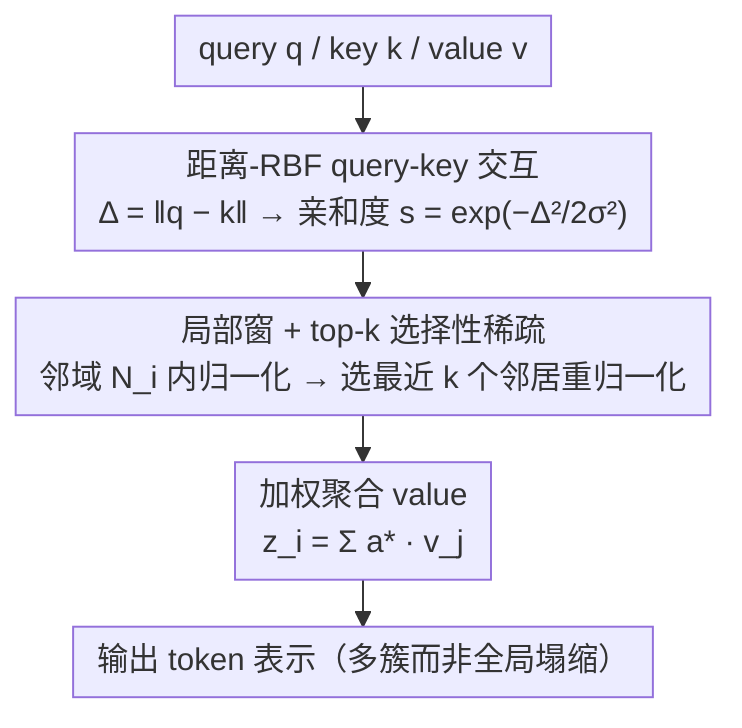

# Krause Synchronization Transformers

**会议**: ICML 2026  
**arXiv**: [2602.11534](https://arxiv.org/abs/2602.11534)  
**代码**: https://jingkun-liu.github.io/krause-sync-transformers/  
**领域**: Transformer 架构 / 注意力机制 / 视觉与生成模型  
**关键词**: 注意力机制, 有界置信动力学, 局部稀疏注意力, 注意力沉降, 多簇同步

## 一句话总结
作者把 Krause 有界置信共识模型搬进 Transformer，用"距离-RBF+局部窗+top-k 稀疏"替代全局 softmax 相似度，从理论上证明它鼓励多簇同步而非全局塌缩，并在 ViT / 自回归图像生成 / LLM 上同时获得更优性能和 30%+ 算力节省。

## 研究背景与动机
**领域现状**：自注意力已经成为视觉、语言、生成的统一架构；但其全局 softmax 归一化让每个 token 都参与抢"影响力分配"，跨层叠加后会产生强同步动力学。

**现有痛点**：(1) 注意力沉降 (attention sink) — 注意力质量会集中到少数 token（通常是开头几个），与语义相关性脱钩；(2) 表征塌缩 — 在 mean-field 极限下 token 表示会指数收敛到一个 dominant mode，限制深层模型表达力；(3) 计算复杂度 $O(N^2 d)$ 限制长序列扩展。

**核心矛盾**：现有改进路线（稀疏注意力、kernel approximation、SSM）大多是为效率而设计的事后近似，没有从交互规则本身重新思考"为什么全局 softmax 会塌缩"。

**本文目标**：(1) 用一种有显式归纳偏置的交互规则替代 softmax，使其在动力学上倾向于多簇而非单一共识；(2) 在不牺牲表达力的前提下把复杂度降到 $O(NWd)$；(3) 验证在视觉、生成、语言三大任务族上都有效。

**切入角度**：作者借鉴社会动力学中的 Krause 共识模型 — 个体只与"意见相近"（在置信半径 $\epsilon$ 内）的邻居互动，结果系统不会收敛到单一意见，而是形成多个稳定的局部共识群。把它对应到 Transformer：tokens 就是 agents，value 是状态，关键是把"全局相似度"换成"局部有界距离"。

**核心 idea**：用 RBF kernel 把 query-key 距离 $\Delta_{i,j}=\|q_i-k_j\|$ 映射为亲和度 $s_{i,j}=\exp(-\Delta_{i,j}^2/(2\sigma^2))$，限制在局部邻域内 + 只保留 top-$k$ 个最相近邻居做归一化，从而把全局 softmax 替换为"距离感知 + 局部稀疏"的有界置信注意力。

## 方法详解

### 整体框架
作者要解决的是全局 softmax 注意力跨层叠加后塌向单一共识、产生 attention sink 与表征塌缩的问题。做法是把社会动力学里的 Krause 有界置信模型搬进来：tokens 当成只与"意见相近"邻居互动的 agents，于是标准 self-attention 里"全局 dot-product 相似度 + softmax 归一化"被换成"欧氏距离的 RBF 亲和度 + 局部窗内 top-$k$ 稀疏归一化"。整个模块是 drop-in replacement，LayerNorm / FFN / RoPE 等其余组件原封不动。

### 关键设计

**1. 距离-RBF query-key 交互：把"远即低权重"写进相似度本身**

标准 dot-product 相似度只看方向不看绝对距离，再配合 softmax 总会出现"某个 token 远比其他大"的赢家通吃，这正是全局塌缩的起点。作者改用 query-key 的欧氏距离 $\Delta_{i,j}=\|q_i-k_j\|$，并经 RBF kernel 映射成亲和度 $s_{i,j}=\exp(-\Delta_{i,j}^2/(2\sigma^2))$，其中 $\sigma$ 是可学习温度。这个 RBF 本身就带 softmax 风格的指数非线性和温度调节，所以**后面不再额外套 softmax**——距离近权重大、距离远天然被抑制，刚性对应 Krause 模型里的"置信半径"，是产生 bounded-confidence 行为的基础。

**2. 局部窗 + top-$k$ 选择性稀疏：把"只与有限邻居互动"做实**

只有距离-RBF 还不够，远处 token 权重虽小但非零，长程仍可能耦合、最终还是会全局同步。于是作者把每个 token 的注意力范围硬切到一个空间/时间局部窗 $\mathcal{N}_i$（视觉用空间窗、自回归用 causal 窗），先在邻域内归一化 $\tilde a_{i,j}=s_{i,j}/\sum_{\ell\in\mathcal{N}_i}s_{i,\ell}$，再选出最相似的 top-$k$ 个邻居 $\xi_i^k\subseteq\mathcal{N}_i$ 重新归一化 $\tilde a^*_{i,j}=s_{i,j}/\sum_{\ell\in\xi_i^k}s_{i,\ell}$，最终输出 $z_i=\sum_{j\in\xi_i^k}\tilde a^*_{i,j}v_j$。这把"竞争且有限"做实，正是 Krause 模型只与有限邻居互动的核心机制；副产品是复杂度从 $O(N^2 d)$ 降到 $O(NWd)$（$W$ 为窗口大小），也是后面理论里 attention 矩阵能分块对角化、产生多簇结构的关键。

**3. 多簇同步的理论保证：把"防塌缩"变成可证明的结构性质**

作者从动力学和 mean-field 两个视角证明上述设计会稳定形成多簇而非全局塌缩，而不只是经验调参。把 token 演化看作粒子流 $\dot z_i=\sum_j a_{i,j}V z_j$：当 token 自然分裂成 $m$ 个超出彼此互动范围的簇时，top-$k$ 强制 cross-cluster pair 的 $a_{i,j}=0$，于是全局注意力矩阵 $A(t)$ 是 reducible 的、分块对角，每块独立演化，且 $\lambda=1$ 的特征值重数至少为 $m$。在 mean-field 极限下，因为 kernel 被截断，empirical 分布 $\mu_t$ 会演化成多原子分布 $\sum_k\pi_k\delta_{\mathcal{L}_k}$。这与标准 self-attention（Wasserstein 梯度流持续向单一共识收缩）形成鲜明对比，使 attention sink 缓解从启发式变成原理保证。

### 损失函数 / 训练策略
完全用标准任务损失（分类 cross-entropy、自回归 NLL、语言建模 next-token）；除可学习温度 $\sigma$ 外无额外超参或正则。视觉任务窗大小 4-25、top-$k$ 在层间线性递增（vision: 2→4 或 8→16）；自回归任务用 causal 窗 + top-$k$（CIFAR-10: 窗 256、k=192）；LLM 实验则把 Krause Attention 作为 auxiliary shortcut 在每层与标准 attention 并行（图 6），两者都用 LoRA 适配，本身不替换 self-attention。

## 实验关键数据

### 主实验
视觉与生成上 Krause 替换 self-attention 的全面提升：

| 任务 | 数据集 | 模型 | 标准 | Krause | 增益 / FLOPs |
|------|--------|------|------|--------|--------------|
| 分类 | CIFAR-10 | ViT-B | 92.45 | **95.35** | +2.9, FLOPs 5.61G→3.77G |
| 分类 | CIFAR-100 | ViT-B | 72.28 | **78.03** | +5.8, FLOPs ↓ 33% |
| 分类 | ImageNet-1K | ViT-S/16 | 75.54 | **76.39** | +0.85, FLOPs 4.62G→3.22G |
| 分类 | ImageNet-1K | ViT-B/32 | 69.90 | **71.49** | +1.6, FLOPs 4.42G→3.00G |
| 分类 | CIFAR-10 | Swin-S | 90.21 | **91.13** | +0.92, FLOPs 0.38G→0.18G |
| 生成 | MNIST | ARM (BPD↓) | 0.5685 | **0.5652** | 速度 83→106 img/s |
| 生成 | CIFAR-10 | ARM | 3.0224 | **3.0032** | 速度 1.9→4.5 img/s |

### 消融实验
LLM 上 Krause-Llama3-8B（Krause attention 作为 LoRA shortcut）vs 基线：

| 评测 | Llama3-8B | LoRA-FT | Krause-Llama3 | 解读 |
|------|-----------|---------|---------------|------|
| BoolQ | 76.13 | 80.41 | **80.59** | 持平 |
| CB (Acc/F1) | 41.07/19.41 | 60.71/47.81 | **64.29/48.04** | 显著提升 |
| PIQA | 51.52 | 75.16 | **77.77** | +2.6 |
| MNLI | 35.45 | 59.53 | **63.27** | +3.7 |
| ANLI-R1/R2/R3 | ~33 | 38.7/39.9/44.9 | **40.3/40.5/45.7** | 全面增益 |
| IFEval | 22.18 | 32.72 | **34.01** | +1.3 |

从零训 200M 参数 LM 在 6 个 zero-shot benchmark 上 Krause 与 5 个 baseline（标准/窗/top-k/Longformer/Routing）对比：Krause 在 LAMBADA / CBT / Hellaswag / ARC-E 3-4 个上拿最优，其余持平或微差。

### 关键发现
- **同时提精度与降算力**：CIFAR-10/100 / ImageNet 上几乎所有规模 ViT 的 Krause 版本都精度涨、参数几乎不变、FLOPs 降 30% 左右 — 表明增益来自交互规则本身，不是参数增加。
- **缓解 attention sink 有可视化证据**：图 7 显示 Llama 在每层都有强烈的"首 token 注意力峰"且层间振荡剧烈，加上 Krause shortcut 后曲线平滑且没有明显沉降。这是 mechanistic 验证。
- **自回归图像生成同时快又好**：KARM 比标准 ARM 速度快 2× 以上，BPD 还更低；比纯线性注意力 LARM 慢一些但 likelihood 优秀，提示"距离感知 + 局部稀疏"是 BPD-speed Pareto 上的好点。
- **注意力头更多样**（图 3）：Krause ViT 的多头注意力呈现明显的多簇分布，而标准 ViT 多头几乎收敛到同一种 pattern — 直接观察到了"多簇同步" vs "全局同步"的差异。
- **作为 shortcut 与 LoRA 互补**：在 LLM 上即使不替换 self-attention 仅作并行通道，也能稳健提升 zero-shot 能力，提示距离感知归纳偏置对长程语言建模也是有用的。

## 亮点与洞察
- 把 Krause 共识模型 — 一个社会动力学经典模型 — 引入 Transformer 是个让人"啊哈"的跨界类比；更难得的是作者把这个类比做到了可证明的多簇形成定理（附录 C），不止停在 inspiration 层面。
- 用 RBF kernel 自带的指数非线性"吸收"掉 softmax，这个小动作既简化了计算路径，又自然契合 bounded-confidence 的物理直觉，是典型的"少即是多"设计。
- 在 LLM 场景把 Krause Attention 作为 shortcut 而非替换，是非常务实的策略 — 既保留全注意力的长程能力，又叠加距离感知的多簇偏置，从可视化上看是真正解决了 attention sink。
- 图 3 中多头注意力的多样性可视化是篇极有说服力的定性证据 — 标准 ViT 多头近乎冗余，Krause ViT 多头各司其职，直接说明了"多簇"是怎么落到 attention pattern 上的。

## 局限与展望
- 理论分析依赖"token 已经分裂成超出互动范围的簇"这一假设，对从初始化到达到簇分裂前的暂态行为没给出严格刻画。
- 窗口大小 $W$ 和 top-$k$ 需要按任务调（vision 用 4-25，CIFAR-10 生成用 256），目前没有自动选取策略。
- 在 LLM 上是 shortcut 形式，作者承认全替代 self-attention 还没充分验证；语言建模中长程依赖能否被 $O(NW)$ 完全覆盖仍存疑。
- 没有跑 GPT 级别的大规模训练对比（仅到 200M 参数），scaling 行为未知。
- 自回归生成与扩散生成的扩展性未在 ImageNet 级别测过。

## 相关工作与启发
- **vs Sparse / Linear Attention (Linformer / Performer / Reformer)**：这些是为效率近似 softmax，Krause Attention 是重新设计交互规则，目标是归纳偏置而非近似，二者正交。
- **vs Top-k Attention (Gupta 2021) / Routing Transformer**：都用稀疏选择，但都基于 dot-product 相似度，没有 RBF 距离的物理可解释性，也没有多簇动力学的理论保证。
- **vs Elliptical Attention (Nielsen 2024) / Probabilistic Attention Keys**：同样改 query-key 度量，但目的是建模不确定性 / 椭圆相似度，与本文"防止全局塌缩"的动机不同。
- **vs Energy Transformer / Hopfield Attention**：从能量视角解释注意力，与本文的动力学视角互补；Krause 模型可视作引入了多稳定点的能量景观。
- **vs Gated Attention (Qiu 2025)**：另一条缓解 attention sink 的路线（用门控引入非线性稀疏），与 Krause 路线（距离 + top-k 显式稀疏）目标一致但机理不同。

## 评分
- 新颖性: ⭐⭐⭐⭐⭐ — 从社会动力学引入有界置信模型并把多簇形成做成可证明性质，在 attention 设计圈子是真正的概念创新。
- 实验充分度: ⭐⭐⭐⭐ — 覆盖视觉分类（CIFAR/ImageNet）+ 自回归生成（MNIST/CIFAR）+ LLM 微调（Llama/Qwen）+ 从零训语言模型（100M/200M），跨度大；但缺 LLM 全替代 + 大规模 scaling 对比。
- 写作质量: ⭐⭐⭐⭐ — 故事线清晰、定理与算法干净；附录的多簇形成定理推导（附录 C）逻辑严谨且有说服力。
- 价值: ⭐⭐⭐⭐ — 提供了一个理论扎实、实用有效的 attention 替代方案，对 attention sink / 表征塌缩这两个开放问题有直接缓解作用。

<!-- RELATED:START -->

## 相关论文

- [\[NeurIPS 2025\] OmniSync: Towards Universal Lip Synchronization via Diffusion Transformers](../../NeurIPS2025/image_generation/omnisync_towards_universal_lip_synchronization_via_diffusion.md)
- [\[ICML 2026\] Diagnosing and Correcting Concept Omission in Multimodal Diffusion Transformers](diagnosing_and_correcting_concept_omission_in_multimodal_diffusion_transformers.md)
- [\[ICML 2026\] Scalable GANs with Transformers](scalable_gans_with_transformers.md)
- [\[CVPR 2025\] SyncSDE: A Probabilistic Framework for Diffusion Synchronization](../../CVPR2025/image_generation/syncsde_a_probabilistic_framework_for_diffusion_synchronization.md)
- [\[ICML 2026\] DiScoFormer: Plug-In Density and Score Estimation with Transformers](discoformer_plug-in_density_and_score_estimation_with_transformers.md)

<!-- RELATED:END -->
