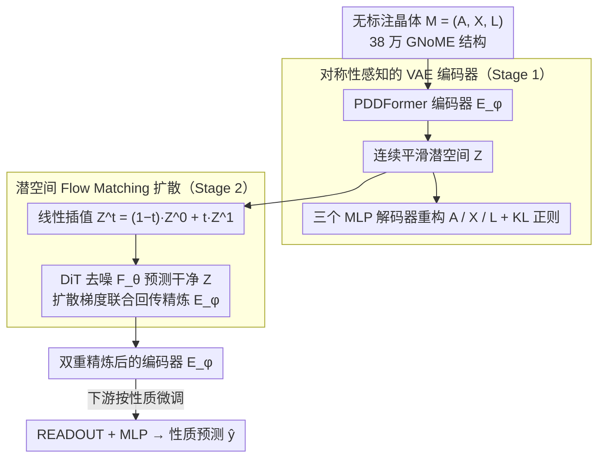

# Latent Diffusion Pretraining for Crystal Property Prediction

**会议**: ICML2026  
**arXiv**: [2606.00776](https://arxiv.org/abs/2606.00776)  
**代码**: https://github.com/shrimonmuke0202/CrysLDNet.git  
**领域**: 科学计算 / 材料科学 / 晶体属性预测 / 潜空间扩散预训练  
**关键词**: 晶体性质预测, 潜空间扩散, 变分自编码器, GNoME 预训练, 材料基础模型

## 一句话总结
CrysLDNet 把"扩散预训练"从原始晶体特征空间搬到 VAE 学到的平滑潜空间，让 PDDFormer 编码器在 38 万无标注 GNoME 晶体上学到更紧凑、更对称感知的结构语义，下游 JARVIS / MP 性质预测平均比强监督 SOTA 再降 4.26% / 4.90% MAE，且在低数据和实验数据校正场景下优势更大。

## 研究背景与动机
**领域现状**：用 GNN（CGCNN、ALIGNN）和等变 Transformer（Matformer、PDDFormer）从 3D 晶体结构预测形成能、带隙等性质，已经能在 DFT 标注数据上接近 DFT 精度，是材料筛选的主力替代品。

**现有痛点**：DFT 标注数据极其稀缺且分布极不均（部分性质只有几千样本），监督模型在低数据场景下严重过拟合；而无标注晶体结构（GNoME 收集了 38 万条）大量可用，但目前的自监督方案（CrysXPP、Crystal Twins、CrysGNN）对结构语义的捕捉仍不够；近期的扩散式预训练 CrysDiff、DPF 直接在原始特征空间做扩散，需要同时处理三类异构变量——**离散的原子类型**（需用 D3PM 离散扩散）、**连续的晶格参数**（用 DDPM）、**周期性的分数坐标**（需基于 wrapped normal 的 score matching），这逼着架构变复杂、扩散步数变多，且最终表示被这个非平滑输入空间约束。

**核心矛盾**：晶体性质本质上由原子排布 + 晶格几何决定，但原始特征空间是离散 + 连续 + 周期三者拼接的"裂缝结构"，直接在上面做扩散既不优雅也不利于学到平滑、可迁移的表示。

**本文目标**：构造一个**对三类异构变量统一处理**、且对编码器架构无侵入的扩散式预训练框架，使学到的表示既能完整重构晶体的 A / X / L，又能在下游小样本场景下迁移得好。

**切入角度**：借鉴 Stable Diffusion 那套"先 VAE 压到潜空间、再在潜空间做扩散"的范式——VAE 把三种异构变量统一编码进一个连续、平滑、低维的潜空间 $\mathbf{Z}\in\mathbb{R}^{N\times d}$，所有扩散都只在这个连续空间发生，等变约束（旋转 / 周期平移）由 PDDFormer 编码器天然保证。

**核心 idea**：用 "VAE 编码器（PDDFormer）+ 潜空间 Flow Matching（DiT 去噪）" 联合预训练，把扩散的"重活儿"全压到潜空间，下游只 fine-tune 这个被双重精炼过的编码器。

## 方法详解

### 整体框架
CrysLDNet 要解决的是"无标注晶体多、但 DFT 标注稀缺"这个矛盾：怎么在 38 万条无标注晶体上预训练出一个迁移性强的结构编码器。它的做法是把 Stable Diffusion 那套"先 VAE 压到潜空间、再在潜空间扩散"的范式搬到晶体上——先用一个对称性感知的 VAE 把异构的晶体输入 $\mathcal{M}=(\mathbf{A},\mathbf{X},\mathbf{L})$（原子类型 one-hot $\mathbf{A}\in\mathbb{R}^{N\times k}$、3D 坐标 $\mathbf{X}\in\mathbb{R}^{N\times 3}$、晶格基 $\mathbf{L}\in\mathbb{R}^{3\times 3}$）统一编码进连续平滑的潜空间 $\mathbf{Z}\in\mathbb{R}^{N\times d}$，再只在这个潜空间上做 flow matching 扩散去精炼编码器。整套预训练分两阶段（VAE 重构 + 潜空间扩散），下游只把精炼好的 PDDFormer 编码器接上 READOUT + MLP 按性质微调，输出 $\hat{y}=\text{MLP}_\lambda(\text{READOUT}(\mathcal{E}_\phi(\mathcal{M})))$；由于所有扩散和解码器只看潜表示，编码器换成别的等变 Transformer 也能直接跑。

### 关键设计

**1. 对称性感知的 VAE 编码器：把异构晶体摊平成统一潜空间**

晶体的原始输入是离散原子类型、连续晶格参数、周期分数坐标三者拼接的"裂缝结构"，CrysDiff/DPF 为此不得不在三类变量上各开一种扩散（D3PM + DDPM + wrapped normal），架构复杂、扩散步数多。CrysLDNet 换个思路：先用一次 VAE 把异构变量统一压进连续平滑的潜空间，让后续扩散只面对一种简单分布。编码器选 PDDFormer——当前对周期晶体最强的等变 Transformer 之一，天然满足 $\mathcal{E}_\phi(\mathbf{A},\mathbf{QX},\mathbf{QL})=\mathcal{E}_\phi(\mathbf{A},\mathbf{X},\mathbf{L})$，等变性被"封装"在编码器里，潜空间里就不必再显式约束对称性。三个独立 MLP 解码器分别把 $\mathbf{Z}$ 还原成原子类型（交叉熵）、坐标（$\ell_2$）、晶格（$\ell_2$），总损失 $\mathcal{L}_{\text{VAE}}=\mathcal{L}^{\mathbf{A}}_{\text{recon}}+\mathcal{L}^{\mathbf{X}}_{\text{recon}}+\mathcal{L}^{\mathbf{L}}_{\text{recon}}+\alpha\mathcal{L}_{\text{reg}}$，其中 $\mathcal{L}_{\text{reg}}=d_{\text{KL}}(q_\phi(\mathbf{Z}|\mathcal{M})\,\|\,p(\mathbf{Z}))$ 把潜分布拉向标准高斯、稳定方差，为后续扩散铺好一个干净的目标分布。

**2. 潜空间 Flow Matching 扩散：用扩散目标二次锤炼编码器**

光做 VAE 重构，编码器只学到"能还原结构"的表示；CrysLDNet 在 stage-1 的潜空间上再加一层 flow matching 扩散，逼编码器学到的 $\mathbf{Z}$ 同时"可重构"又"可去噪"。具体做法是把干净样本设为 $\mathbf{Z}^1=\mathcal{E}_\phi(\mathcal{M})$、噪声设为 $\mathbf{Z}^0\sim\mathcal{N}(0,1)^{N\times d}$，采样 $t\sim\mathcal{U}(0,1)$ 后线性插值 $\mathbf{Z}^t=(1-t)\mathbf{Z}^0+t\mathbf{Z}^1$，对应的条件向量场为 $u_t(\mathbf{Z}^t|\mathbf{Z}^1)=(\mathbf{Z}^1-\mathbf{Z}^t)/(1-t)$，再用 DiT 去噪网络预测干净潜变量 $\bar{\mathbf{Z}}^1=\mathcal{F}_\theta(\mathbf{Z}^t,t)$，损失化简为 $\mathcal{L}_{\text{LDM}}=\frac{1}{(1-t)^2}\frac{1}{N}\sum_i\|\mathbf{z}^1_i-\bar{\mathbf{z}}^1_i\|^2$。关键在于 $\mathcal{E}_\phi$ 和 $\mathcal{F}_\theta$ 是**联合**更新的——扩散梯度会反传回编码器，相当于用扩散目标对潜空间做"二次塑形"。这样做有三重红利：潜空间是单一连续高斯目标，省掉了 D3PM/wrapped normal 这类异构扩散；$\mathbf{Z}$ 维度低且光滑，DiT 的去噪步数和参数都能省；编码器被扩散目标精炼后对结构和化学信息的捕捉更精细——Figure 3 显示 CrysLDNet 重构 A/X/L 的精度全面优于 CrysDiff 和 DPF，直接印证了潜空间扩散对表达力的提升。

**3. Backbone-Agnostic 设计：让范式独立于主干网络演化**

晶体表示学习的骨干迭代极快（CGCNN、ALIGNN、Matformer、PDDFormer……），如果预训练框架和某一具体编码器深度耦合，每次升级都要重训重设计。CrysLDNet 把 VAE 解码器 / DiT / 损失 / 优化目标全部只挂在潜表示 $\mathbf{Z}$ 的形状 $(N,d)$ 上，不依赖编码器内部如何聚合邻域，于是"预训练范式"和"主干网络"被分层解耦。实测把 $\mathcal{E}_\phi$ 从 Matformer 换成 PDDFormer，下游 JARVIS / MP 平均再提升 10.46% / 12.39%（Table 2），几乎正比于骨干本身的强弱；反过来即便只用较弱的 Matformer，CrysLDNet 仍比原 Matformer 平均降 7.53% / 7.87%——说明增益主要来自"潜空间扩散"这一训练范式而非编码器升级，框架因此既能吃骨干升级红利、又不会被某一代骨干绑死。

### 损失函数 / 训练策略
- Stage 1：$\mathcal{L}_{\text{VAE}}=\mathcal{L}^{\mathbf{A}}_{\text{recon}}+\mathcal{L}^{\mathbf{X}}_{\text{recon}}+\mathcal{L}^{\mathbf{L}}_{\text{recon}}+\alpha\mathcal{L}_{\text{reg}}$，直到收敛。
- Stage 2：$\mathcal{L}_{\text{LDM}}=\frac{1}{(1-t)^2}\frac{1}{N}\sum_i\|\mathbf{z}^1_i-\bar{\mathbf{z}}^1_i\|^2$，**联合**更新 $\mathcal{E}_\phi$ 和 $\mathcal{F}_\theta$。
- Pretrain 数据：从 GNoME 过滤出来的 380,740 个无标注晶体结构（剔除与下游测试集重复或物理意义不明确的条目）。
- Finetune：$\mathcal{L}_{\text{MSE}}=\|\hat{y}-y\|^2$，每个性质独立微调一份编码器副本。

## 实验关键数据

### 主实验：JARVIS-DFT 与 MP 上的 MAE 对比

下表给出几个代表性性质的 MAE（数字越小越好），覆盖监督最强基线 PDDFormer、扩散预训练 DPF / CrysDiff，以及本文 CrysLDNet：

| 数据集 | 性质 | PDDFormer | DPF | CrysDiff | CrysLDNet | 相对 PDDFormer |
|--------|------|-----------|-----|----------|-----------|------|
| JARVIS | Formation Energy (eV/atom) | 0.027 | 0.029 | 0.029 | **0.026** | -3.7% |
| JARVIS | Bandgap OPT (eV) | 0.120 | 0.122 | 0.131 | **0.118** | -1.7% |
| JARVIS | Bandgap MBJ (eV) | 0.251 | 0.311 | 0.287 | **0.238** | -5.2% |
| JARVIS | Ehull (eV/atom) | 0.033 | 0.059 | 0.062 | **0.032** | -3.0% |
| JARVIS | Bulk Modulus (GPa) | 9.546 | 10.43 | 9.875 | **8.817** | -7.6% |
| JARVIS | Shear Modulus (GPa) | 8.808 | 9.596 | 9.191 | **8.428** | -4.3% |
| JARVIS | SLME (%) | 4.300 | 5.129 | 5.030 | **4.120** | -4.2% |
| MP | Formation Energy | 0.016 | 0.020 | – | **0.015** | -6.3% |
| MP | Bulk Modulus | 0.034 | 0.042 | – | **0.032** | -5.9% |
| MP | Shear Modulus | 0.062 | 0.073 | – | **0.059** | -4.8% |

整体平均：CrysLDNet vs PDDFormer = **-4.26%（JARVIS）/ -4.90%（MP）**；CrysLDNet vs DPF = **-16.76% / -19.34%**。

### 消融实验

| 配置 | Formation | Bandgap OPT | Ehull | Bulk | Spillage | 说明 |
|------|-----------|------|------|------|------|------|
| VAE only | 0.031 | 0.126 | 0.059 | 10.61 | 0.374 | 去掉 LDM，只做 stage-1 重构预训练 |
| LDM only | 0.030 | 0.123 | 0.052 | 10.37 | 0.370 | 去掉 VAE 阶段，直接对原始空间做扩散 |
| Only A | 0.032 | 0.125 | 0.058 | 10.49 | 0.355 | 只重构原子类型 |
| Only X | 0.031 | 0.122 | 0.060 | 10.21 | 0.352 | 只重构坐标 |
| Only L | 0.032 | 0.136 | 0.055 | 10.46 | 0.351 | 只重构晶格 |
| A + X | 0.034 | 0.125 | 0.052 | 10.25 | 0.358 | 重构 A 和 X |
| L + X | 0.033 | 0.124 | 0.046 | 10.51 | 0.354 | 重构 L 和 X |
| **CrysLDNet（完整）** | **0.026** | **0.118** | **0.032** | **8.817** | **0.340** | 三种重构 + LDM |

### 关键发现
- **VAE 与 LDM 缺一不可**：单 VAE 或单 LDM 在 Bulk Modulus 上分别只能到 10.61 / 10.37，远差于完整模型的 8.817，说明"先 VAE 摊平异构空间、再 LDM 精炼语义"两步互补缺一不可。
- **低数据增益更大**：Figure 2 显示在 20% / 40% finetune 数据下，CrysLDNet(Matformer) 甚至能超过满数据训练的 PDDFormer；40% 数据下 CrysLDNet 比 PDDFormer / Matformer 分别再降 12.83% / 22.49% MAE，是典型的预训练对小样本的"杠杆效应"。
- **Backbone-agnostic 真的成立**：把编码器从 Matformer 升级到 PDDFormer，CrysLDNet 在 JARVIS / MP 上额外提升 10.46% / 12.39%，几乎正比于 backbone 本身的提升，说明框架"未来不会被淘汰"。
- **能校正 DFT 系统偏差**：在 OQMD-EXP 实验数据上，零样本 MAE 从 CrysGNN 的 0.253 降到 CrysLDNet 的 0.205；用 20% 实验数据微调更降到 0.097（CrysGNN 0.135），证明潜空间预训练学到的表示能跨越 DFT-实验的系统差。
- **重构质量直接对应下游表现**：Figure 3 显示 CrysLDNet 在 GNoME 上对 A/X/L 的重构精度全面优于 CrysDiff/DPF，这种"表示能力差"直接体现在下游 MAE 上，给出了一个清晰的因果链。

## 亮点与洞察
- **把 Stable Diffusion 的"潜空间扩散"范式跨界搬到晶体**：晶体的异构（离散原子 + 连续晶格 + 周期坐标）和图像的 RGB 维度本质都是"原始空间不利于扩散"的问题，本文用同样的解决方案——先压到 VAE 潜空间——拿到了类似的红利（简化模型、提升表达力），是一个非常优雅的范式迁移。
- **联合训练 $\mathcal{E}_\phi$ + $\mathcal{F}_\theta$ 是真正的精髓**：很多人会按"VAE 先训完再固定，然后训 LDM"做，但本文 stage-2 让扩散梯度回传到编码器，相当于用扩散目标"二次塑形"潜空间，这才是 Table 1 上能反超 PDDFormer 的关键——单 VAE 预训练版本仅有 10.61 Bulk MAE，联合训练后骤降到 8.817。
- **Backbone-agnostic 是一个很"诚实"的卖点**：不少自监督框架的提升其实来自骨干升级，本文用同一个骨干（Matformer）对比，仍能拿到 7.87% 的提升，说明范式本身扎实；同时换更强骨干又能继续吃骨干升级的红利，对长期工程化非常友好。
- **可迁移到其他"异构 3D 结构"任务**：分子（mol）、蛋白质（protein）、催化界面等都是"离散原子 + 连续坐标 + 可能的拓扑/周期约束"的组合，本文这套 "等变编码器 → 平滑潜空间 → 潜空间 flow matching" 的模板几乎可以原样搬过去；对 SE(3)/E(3) 等变扩散研究是一种"轻量但有效"的替代方案。

## 局限与展望
- **作者承认的局限**：实验主要集中在 JARVIS 与 MP 这两个 DFT 标注 benchmark，对 alloy、合金、玻璃等更复杂的晶体类型未做评估；OQMD-EXP 仅约 1500 条样本，DFT 偏差校正实验的样本规模有限。
- **方法层面的潜在问题**：(1) VAE 的 KL 正则强度 $\alpha$ 没给出敏感性分析，过强会损失重构精度、过弱会让潜空间不平滑——这对 stage-2 扩散稳定性影响巨大，论文没单独讨论；(2) DiT 在 $N$ 个原子的 token 序列上做 self-attention，对超大晶胞（如 supercell、moiré）计算量可能急剧上升；(3) 实验都是 per-property 独立 finetune，没探索多任务微调或 zero-shot prompt 设置。
- **可改进方向**：(a) 引入条件 LDM（conditional flow matching），在预训练中就注入部分性质标签，实现 semi-supervised 联合训练；(b) 用 LoRA 或 adapter 让一份预训练编码器同时服务多个性质，减小 deployment 成本；(c) 把潜扩散和生成任务统一起来——既能预测性质又能反向生成满足约束的新晶体（CrysLDNet 已经具备 LDM，理论上 sample 就可生成）。

## 相关工作与启发
- **vs CrysDiff (Song et al. 2024)**：CrysDiff 在原始特征空间对 A/X/L 同时做扩散（D3PM + DDPM + wrapped normal），架构复杂、扩散步数多；本文用 VAE 把异构空间统一摊平到潜空间再做扩散，结构简单、训练高效，且在 JARVIS Bulk Modulus 上 8.817 vs 9.875，MAE 降 10.7%。
- **vs DPF (Shen et al. 2025a)**：DPF 是 PDDFormer 同作者的 diffusion-based pretraining，但用 Matformer 做编码器、在特征空间扩散；本文用 PDDFormer + 潜空间扩散，在 JARVIS 上整体降 16.76%。Table 2 进一步证明：即使把本文编码器换成 Matformer（和 DPF 公平），仍比 DPF 好——说明"潜空间扩散"本身就比"特征空间扩散"更有效。
- **vs CrysGNN / Crystal Twins (2022-2023)**：这些是早期对比学习 / 重构式自监督，没用扩散，下游 MAE 整体高出 CrysLDNet 一截（JARVIS Bulk Modulus 13.41 vs 8.817），证明扩散预训练在材料 GNN 上同样能复刻 NLP / CV 里"生成式 SSL > 对比式 SSL"的趋势。
- **vs Stable Diffusion / DALL-E 2 的潜空间扩散**：方法论同源——都是"VAE 把高维异构数据压到连续低维 + 在潜空间做扩散"，但用途完全不同：CV 是为了高分辨率生成，本文是为了预训练表示。这种跨域范式迁移本身值得关注：哪一类"原始空间不利于扩散"的任务都可以套用同一模板。

## 评分
- 新颖性: ⭐⭐⭐⭐ 把潜空间扩散这一成熟范式干净地搬到晶体预训练，方法清晰但不算颠覆性创新
- 实验充分度: ⭐⭐⭐⭐⭐ 两大数据集 13 个性质 + backbone-agnostic + 低数据 + 实验数据校正 + 完整消融，几乎面面俱到
- 写作质量: ⭐⭐⭐⭐ 故事线清晰，公式和算法步骤都给得到位，部分超参敏感性可以再展开
- 价值: ⭐⭐⭐⭐⭐ 在材料发现这种"标注极贵、骨干快速迭代"的领域提供了一个可长期复用的预训练范式，工程价值大

<!-- RELATED:START -->

## 相关论文

- [\[CVPR 2026\] Property-Informed Diffusion-Based Text-to-Microstructure Generation](../../CVPR2026/image_generation/property-informed_diffusion-based_text-to-microstructure_generation.md)
- [\[CVPR 2026\] Latent Diffusion Inversion Requires Understanding the Latent Space](../../CVPR2026/image_generation/latent_diffusion_inversion_requires_understanding_the_latent_space.md)
- [\[ECCV 2024\] Learning Semantic Latent Directions for Accurate and Controllable Human Motion Prediction](../../ECCV2024/image_generation/learning_semantic_latent_directions_for_accurate_and_controllable_human_motion_p.md)
- [\[CVPR 2025\] Generative Multimodal Pretraining with Discrete Diffusion Timestep Tokens](../../CVPR2025/image_generation/generative_multimodal_pretraining_with_discrete_diffusion_timestep_tokens.md)
- [\[NeurIPS 2025\] LLM Meets Diffusion: A Hybrid Framework for Crystal Material Generation](../../NeurIPS2025/image_generation/llm_meets_diffusion_a_hybrid_framework_for_crystal_material_generation.md)

<!-- RELATED:END -->
