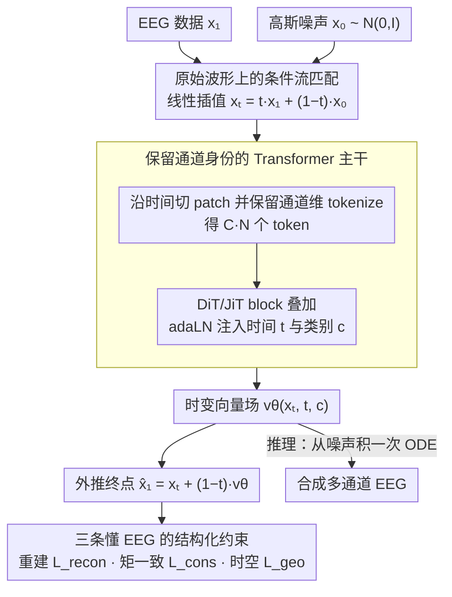

# Let EEG Models Learn EEG

**会议**: ICML 2026  
**arXiv**: [2605.21280](https://arxiv.org/abs/2605.21280)  
**代码**: https://y-research-sbu.github.io/JET/ (项目页)  
**领域**: 医学图像 / 神经信号生成 / 流匹配  
**关键词**: EEG 生成, 条件流匹配, Transformer, 频谱保真, 结构化约束

## 一句话总结
JET 把多通道 EEG 生成重新定义为"在神经流形上的连续轨迹"，用条件流匹配 + 标准 Transformer 直接对原始波形建模，并配三条专门刻画 EEG 频谱/平稳性/统计的结构化约束，在 TUH 三大临床基准上把 TS-FID 较强基线降低 40% 以上。

## 研究背景与动机

**领域现状**：EEG 基础模型这两年发展很快（BrainBERT/Brant/Neuro-GPT/EEGPT/CbraMod 等），但高质量临床 EEG 受隐私和标注成本制约，比文本/图像数据小好几个量级，因此需要可靠的"原生 EEG 生成"作为大规模神经建模的前提。

**现有痛点**：现有 EEG 生成器要么是 GAN（EEG-GAN），要么是离散去噪扩散，要么是把信号 tokenize 后做自回归（MEG-GPT、GPT2MEG）。这些方法的训练目标在各向同性高斯噪声假设下做局部重建，频谱偏置严重、长序列里波形单调重复、还无法覆盖病理性大幅度事件。

**核心矛盾**：EEG 信号本质上是 $1/f^{\chi}$ 幂律谱 + 非平稳 + 重尾的连续生物时间序列；而主流生成范式（离散去噪 + 高斯先验）只擅长局部均方误差最小化，两者在频域、时序、统计三个维度系统性错位，小误差沿采样步累积成全局结构破坏。

**本文目标**：(1) 把 EEG 生成形式化为连续动力学过程，而非离散去噪步；(2) 设计一个能捕捉长程依赖+通道间动态交互的主干；(3) 给训练目标加上"懂 EEG"的结构性约束，让流场在保持几何/统计意义上的 EEG 不变量。

**切入角度**：脑活动本身就在高维状态空间里平滑演化（神经流形假设），那生成就应该顺着这条连续轨迹做，而不是反复加噪去噪。条件流匹配（CFM）刚好提供了"学一个把先验运到数据的向量场"这种连续替代方案。

**核心 idea**：直接在原始多通道 EEG 上做条件流匹配，用 DiT/JiT 风格的纯 Transformer 学时变向量场 $\mathbf{v}_\theta(\mathbf{x}_t,t,c)$，并把 EEG 物理特性（鲁棒重建、统计一致、时频结构）显式写进损失里。

## 方法详解

### 整体框架
JET 要解决的问题是：怎么直接在原始多通道 EEG（$\mathbf{X}\in\mathbb{R}^{C\times T}$）上生成既保频谱又不漂移的高保真波形。它的做法是把生成看成"在神经流形上从噪声运到数据的一条连续轨迹"——训练时学一个时变向量场，推理时从高斯噪声出发积一次 ODE 就得到一段合成 EEG，整条管线不再有 diffusion 那种几十步的离散去噪，而把"懂 EEG"的物理约束直接写进训练目标里。

### 关键设计

**1. 原始波形上的条件流匹配：把离散去噪换成连续轨迹**

EEG 本质是平滑演化的连续生物过程，离散噪声日程会和神经动力学系统性错位，长序列里小误差还会沿采样步累积。JET 因此用 Lipman 等人的 Conditional Flow Matching：训练时从数据采 $\mathbf{x}_1$、从 $\mathcal{N}(\mathbf 0,\mathbf I)$ 采 $\mathbf{x}_0$，沿线性插值路径 $\mathbf{x}_t = t\mathbf{x}_1 + (1-t)\mathbf{x}_0$ 回归目标向量场 $\mathbf{u}_t = \mathbf{x}_1 - \mathbf{x}_0$，损失退化成简洁的 $\ell_{\text{CFM}} = \mathbb{E}_t \|\mathbf{v}_\theta(\mathbf{x}_t,t,c) - (\mathbf{x}_1 - \mathbf{x}_0)\|$；推理只需求解 ODE $\mathrm{d}\mathbf{x}_t/\mathrm{d}t = \mathbf{v}_\theta(\mathbf{x}_t,t,c)$ 直到 $t=1$。这样建模在"全局轨迹"层面更贴合脑活动的连续性，速度也比 token 自回归更快（同等条件 4.78s vs Diffusion 7.01s）。为了对付 TUH 里正常背景 vs 罕见癫痫事件的严重失衡，训练还按类别频率倒数 $p_i \propto 1/N_c^\alpha$ 做自适应均衡采样，保证罕见病理事件被覆盖到。

**2. 保留通道身份的 Transformer 主干（JET）：在原始波形上建长程时空依赖**

EEG 受容积传导和功能连接影响，电极间既有长程同步又随时间漂移，这违背了 CNN 的局部假设、也不符合静态图模型的固定拓扑，所以 JET 干脆不做时频变换、不预设邻接图，直接用自注意力的全局感受野去学。具体是沿时间轴把 $\mathbf{X}$ 切成长度 $P$ 的非重叠 patch 得到 $\mathbf{X}_p\in\mathbb{R}^{C\times N\times P}$；与 ViT 不同的关键一步是把 patch 投影到 $D$ 维 token 时保留通道维度，得到长度 $C\cdot N$ 的 token 序列，再叠 DiT/JiT 风格的 Transformer block，时间 $t$ 与类别 $c$ 的嵌入相加后通过 adaLN 注入每个 block 的 scale/shift。这种"保留通道身份"的 tokenize 让模型能同时建模时间依赖和跨通道交互；消融显示 $P=200$ 是效率/保真的最佳折中（$P=400$ 全局局部都掉，$P=50$ 略好但 token 数翻 4 倍）。

**3. 三条"懂 EEG"的结构化约束：把物理不变量写进流场**

标准流匹配的欧氏回归对应高斯似然，会被 EEG 的尖峰伪迹拉偏、对 $1/f^\chi$ 幂律谱欠拟合，又对长序列的均值/方差漂移毫无约束。JET 针对这三个失败模式各加一条约束：先用 $\hat{\mathbf{x}}_1 = \mathbf{x}_t + (1-t)\,\mathbf{v}_\theta$ 把当前状态外推到终点估计，再叠加 (i) 拉普拉斯先验重建 $\mathcal{L}_{\text{recon}} = \mathbb{E}_t \|\mathbf{x}_1 - \hat{\mathbf{x}}_1\|_1$ 抗肌电/电极伪迹；(ii) 一阶/二阶矩一致性 $\mathcal{L}_{\text{cons}} = \lambda_{\text{cons}} (\|\mu(\mathbf{x}_1) - \mu(\hat{\mathbf{x}}_1)\|_1 + \|\sigma(\mathbf{x}_1) - \sigma(\hat{\mathbf{x}}_1)\|_1)$ 防幅度漂移；(iii) 时空结构项 $\mathcal{L}_{\text{geo}} = \lambda_{\text{tv}}\frac{1}{T}\sum_t \|\nabla_t \hat{\mathbf{x}}_1\|_1 + \lambda_{\text{corr}} (1 - \rho(\mathbf{x}_1, \hat{\mathbf{x}}_1))$，其中 TV 项压制虚假高频抖动、皮尔逊相关 $\rho$ 保住波形形态。三条恰好对应"鲁棒性—统计流形—时频结构"三个维度，互补缺一不可；Table 7 还特意把 BrainOmni 的 tokenizer-style 损失套进同一主干做对照，证明收益来自约束与 EEG 不变量的结构性对齐，而非单纯堆 loss。

### 损失函数 / 训练策略
总目标是三条约束之和 $\mathcal{L}_{\text{total}} = \mathcal{L}_{\text{recon}} + \mathcal{L}_{\text{cons}} + \mathcal{L}_{\text{geo}}$（重建用 $\ell_1$、统计用 $\ell_1$ 矩匹配、几何用 TV+Pearson）。采样基分布固定为 $\mathcal{N}(\mathbf 0, \mathbf I)$——消融显示一旦退化成单点 $\delta(\mathbf 0)$，流场会变成 ill-posed 的一对多映射，TS-FID 飙升一个量级；样本权重则按类别频率倒数 $1/N_c^\alpha$ 重加权，以覆盖罕见病理事件。

## 实验关键数据

### 主实验
在 TUH Corpus 三大子集（TUAB 异常、TUEV 事件、TUSZ 癫痫，合计 1 万+ 临床 session）上对比 EEG-GAN 和 Vanilla Diffusion，三项指标分别衡量分布保真（TS-FID）、条件一致（Silhouette）、下游增强收益（$\Delta$ Acc，使用 CbraMod 分类器）。

| 数据集 | 指标 | EEG-GAN | Vanilla Diffusion | JET (本文) |
|--------|------|---------|--------------------|-----------|
| TUAB | TS-FID $\downarrow$ | 324.18 | 342.91 | **188.27** |
| TUAB | Silhouette $\uparrow$ | 0.786 | 0.710 | **0.995** |
| TUAB | $\Delta$ Acc $\uparrow$ | +0.000 | -0.002 | **+0.029** |
| TUEV | TS-FID $\downarrow$ | 448.65 | 415.82 | **235.86** |
| TUEV | Silhouette $\uparrow$ | 0.667 | 0.703 | **0.983** |
| TUEV | $\Delta$ Acc $\uparrow$ | -0.004 | -0.000 | **+0.032** |
| TUSZ | TS-FID $\downarrow$ | 274.37 | 300.47 | **151.27** |
| TUSZ | Silhouette $\uparrow$ | 0.891 | 0.746 | **0.987** |
| TUSZ | $\Delta$ Acc $\uparrow$ | +0.001 | +0.000 | **+0.017** |

JET 在所有数据集 TS-FID 至少下降 40%，Silhouette 接近 1 说明类内一致性几乎完美；更关键的是只有 JET 的合成样本对下游 CbraMod 分类器有正向增益，基线甚至会拖累准确率。

### 消融实验
**约束逐项消融（Table 4，TS-FID）**：

| 配置 | TUAB | TUEV | TUSZ | 说明 |
|------|------|------|------|------|
| 仅 $\mathcal{L}_{\text{recon}}$ | 231.19 | 287.81 | 221.74 | 纯 $\ell_1$，最差，验证欧氏回归不够 |
| +$\mathcal{L}_{\text{cons}}$ | 228.87 | 281.70 | 209.99 | 矩匹配防漂移，小幅提升 |
| +$\mathcal{L}_{\text{tv}}$ | 219.45 | 266.61 | 210.00 | 抑制虚假高频 |
| +$\mathcal{L}_{\text{corr}}$ | 221.26 | 278.01 | 200.87 | 保住波形形态 |
| Full (四项全开) | **188.27** | **235.86** | **151.27** | 四项互补，最佳 |

**噪声基分布消融（Table 3）**：把高斯先验换成退化的 $\delta(\mathbf 0)$，三个数据集的 TS-FID 直接从 ~200 飙到 1600+，验证非退化基分布对覆盖多模态 EEG 的必要性。

**漂移分析（Table 2，TUEV）**：用 RMS 包络的线性斜率 + 首尾段矩差 $D_\mu, D_\sigma$ 衡量虚假漂移，JET 的 Wasserstein 距离（0.015 / 0.021 / 0.018）只是 real-vs-real 地板（0.008 / 0.012 / 0.010）的 2× 以内，而 EEG-GAN/Diffusion 是 5–8×。

### 关键发现
- 三条结构化约束彼此互补：TV 砍高频噪声、Pearson 保形态、矩一致防漂移，单独加哪一条都不够，组合起来才把六项物理诊断指标（PSD 斜率、时间包络、Hjorth 三项）整体压低一半（Table 5）。
- 基分布必须非退化：从单点 $\delta(\mathbf 0)$ 出发会让流场退化成 ill-posed 的一对多映射，瞬间崩盘；这一现象在 EEG 这种重尾多模态分布上格外明显。
- 频谱分析显示 JET 既保住 $\alpha$ 波峰（8–13Hz）又主动抑制 15Hz 以上的肌电噪声，是"懂 EEG"的选择性建模，而非简单逼近边际频谱。

## 亮点与洞察
- **范式重构**：把 EEG 生成从"离散去噪"换成"流匹配 ODE"，第一次让连续轨迹这一物理事实进入训练目标，技术路径干净、推理还更快。
- **结构化约束的拆解很有教学意义**：Table 5 用六项未被直接优化的物理诊断指标分别验证 $\mathcal{L}_{\text{cons}}/\mathcal{L}_{\text{tv}}/\mathcal{L}_{\text{corr}}$ 各管哪一类失败模式，给后人加约束设计提供了一个清晰范本。
- **可迁移性**：CFM + 保通道身份的 Transformer + 物理量约束的组合，对 ECG、MEG、连续运动信号等其他生物时间序列都成立——只需把约束换成各信号自带的不变量（节律、心率变异、平稳性等）。

## 局限与展望
- 只用了 TUH 一个语料族（TUAB/TUEV/TUSZ），跨设备、跨采样率、跨电极标准的泛化性还没验证；跨数据集少样本生成是自然的下一步。
- TS-FID 用 spectral feature 的 Fréchet 距离作为分布度量，本身就部分对齐了模型的频域约束，存在"自定义指标自评"的轻微 inflation 风险，最好补独立的临床医生主观盲评。
- 当前条件 $c$ 只是病理类别 one-hot，未利用受试者元信息（年龄、电极放置、用药状态）；未来可以引入更细粒度的条件控制做个性化合成。
- ODE 求解步数和采样精度的折中没有系统分析，4.78s 是某固定步数下的结果，进一步加速空间（如蒸馏到一步）值得探索。

## 相关工作与启发
- **vs EEG-GAN (Hartmann 2018)**：早期 GAN 路线，对抗训练不稳、模式覆盖差，无法保住 EEG 的频谱与重尾统计；JET 用连续流场直接绕开对抗目标，TS-FID 下降 ~40%。
- **vs Vanilla Diffusion (Song 2021)**：离散去噪在 EEG 上有严重频谱偏置，长序列还会漂移；JET 用 CFM 替换离散步、再加 EEG 物理约束，下游迁移增益从 0 变成正。
- **vs MEG-GPT / GPT2MEG (2024–2025)**：自回归把信号 tokenize 成离散符号，根本上与连续神经动力学错位；JET 保持原始波形，跳过 quantization 损失。
- **vs BrainOmni (Xiao 2025) tokenizer-style 损失**：同样用 $\ell_1$、Pearson 等单项约束，但 Table 7 显示直接把它的 loss 套进 JET 主干 TS-FID 仍然差 60%+，说明 JET 的贡献不在"多加几个 loss"而在"约束设计与 EEG 不变量的结构性对齐"。
- **vs DiT / JiT (Peebles 2023; Li & He 2025)**：方法学血统在此——证明视觉里 plain Transformer + adaLN 在 EEG 上同样成立，"最小归纳偏置 + 强扩展性"的设计哲学迁移成功。

## 评分
- 新颖性: ⭐⭐⭐⭐ 把 CFM 系统化引入 EEG 生成，并配套"对齐物理不变量"的约束设计，组合是新的。
- 实验充分度: ⭐⭐⭐⭐ 三大临床基准 + 三类指标 + 物理诊断 + 多项消融，结论扎实；扣分在仅 TUH 一个语料族。
- 写作质量: ⭐⭐⭐⭐ 动机→方法→约束→消融的链条清晰，三个失败模式与三条约束一一对应，可读性高。
- 价值: ⭐⭐⭐⭐ 为 EEG 大模型时代的数据匮乏问题提供了高保真合成基线，TS-FID 减半 + 下游正增益直接可用。

<!-- RELATED:START -->

## 相关论文

- [\[ICLR 2026\] Step-Aware Residual-Guided Diffusion for EEG Spatial Super-Resolution](../../ICLR2026/image_generation/step-aware_residual-guided_diffusion_for_eeg_spatial_super-resolution.md)
- [\[ECCV 2024\] DreamDiffusion: High-Quality EEG-to-Image Generation with Temporal Masked Signal Modeling and CLIP Alignment](../../ECCV2024/image_generation/dreamdiffusion_high-quality_eeg-to-image_generation_with_temporal_masked_signal_.md)
- [\[ICLR 2026\] Concept-TRAK: Understanding how diffusion models learn concepts through concept-level attribution](../../ICLR2026/image_generation/concept-trak_understanding_how_diffusion_models_learn_concepts_through_concept-l.md)
- [\[ICLR 2026\] When Scores Learn Geometry: Rate Separations under the Manifold Hypothesis](../../ICLR2026/image_generation/when_scores_learn_geometry_rate_separations_under_the_manifold_hypothesis.md)
- [\[ICML 2026\] Adversarial Flow Models](adversarial_flow_models.md)

<!-- RELATED:END -->
