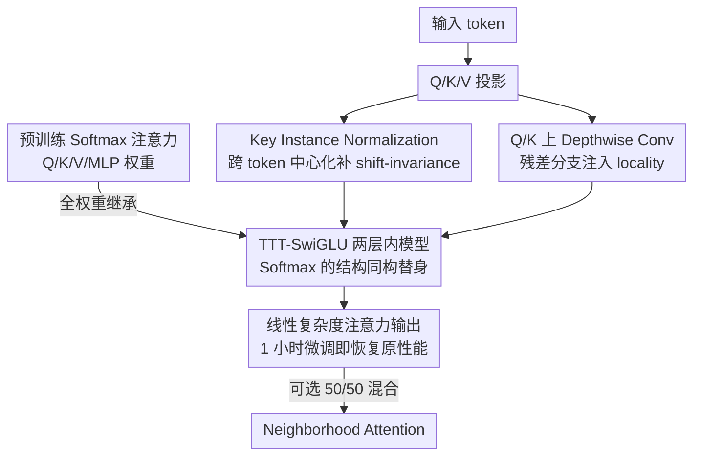

# Linearizing Vision Transformer with Test-Time Training

**会议**: ICML 2026  
**arXiv**: [2605.02772](https://arxiv.org/abs/2605.02772)  
**代码**: 暂未公开  
**领域**: 图像生成 / 视觉 Transformer / 线性注意力 / Stable Diffusion 加速  
**关键词**: Test-Time Training、Linear Attention、Weight Inheritance、Instance Normalization、DiT 加速

## 一句话总结
作者发现两层 TTT 内模型在结构上等价于 Softmax 注意力（Softmax 可看作两层动态 MLP），由此实现 Q/K/V/MLP 的全权重直接继承，再通过 key Instance Normalization 处理 shift-invariance、depthwise conv on Q/K 补齐 locality，仅 1 小时微调就把 Stable Diffusion 3.5 线性化并加速 1.32×–1.47×。

## 研究背景与动机

**领域现状**：Vision Transformer 的 Softmax 注意力是当前 vision foundation model（DiT、SD3.5、ViT）的事实标准，但 $\mathcal{O}(N^2)$ 复杂度让长序列推理代价昂贵。学术界提出了大量线性复杂度替代方案——核近似（Performer/Linear Attention）、状态空间（Mamba）、TTT 等——但从头训一个大模型的成本巨大，业界更想要"在已经训好的 Softmax 模型上，零成本替换 attention"。

**现有痛点**：(1) Hedgehog / LoLCATs 只能继承部分权重（MLP），Q/K 需要重新学激活；(2) CLEAR 把 Softmax 限制在局部窗口，损失全局建模；(3) LiT 只继承 MLP；(4) Diffusion Grafting 需要多阶段精调。所有方案都没能"全权重继承 + 短时微调"。

**核心矛盾**：Softmax attention 在数学上等价于一个由 $K, V$ 动态构造的两层 MLP $\sigma(qK^\top)V$；而 standard linear attention 只能表示一层动态线性变换 $\phi(q)(\phi(K)^\top V)$——表示能力差一个量级。即使迁移权重，目标空间根本装不下源空间，所以继承必然失败。

**本文目标**：(i) 找一个真正能"装得下" Softmax 注意力的线性复杂度结构；(ii) 在表示空间层面也对齐 Softmax 的两个特性（shift-invariance、locality）；(iii) 在 DiT 和 SD3.5 上做完整线性化验证。

**切入角度**：作者注意到 Test-Time Training（TTT）的内模型如果选两层 MLP $f_W(x) = \sigma(xW_1)W_2$，再加上从输入序列学到的 fast weights $W_1' = W_1 - \Delta_1, W_2' = W_2 - \Delta_2$，得到的输出 $\mathrm{TTT}(q) = \sigma(qW_1')W_2'$ 与 Softmax 的"动态两层 MLP"形式完全对应——这是数学结构上的一致而不仅是符号上的相似。

**核心 idea**：用两层 TTT（具体用 TTT-SwiGLU）作为线性复杂度替身，把 Softmax 的 Q/K/V/MLP 全权重直接复用进去；再用 key Instance Normalization 模拟 Softmax 的常数 shift 吸收能力，用 depthwise conv 注入局部性；后训练 1 小时即可恢复原模型性能。

## 方法详解

### 整体框架
方法要解决的是"把已经训好的 Softmax 注意力换成线性复杂度的替身，又不想重新训练"。作者的做法是只动 attention 模块、保留 MLP/LayerNorm/embedding：先把 Softmax 注意力替换成两层 TTT-SwiGLU 内模型，让内部的 $W_1, W_2$ 直接继承原 Q/K/V projection 权重；再在 K 上加 instance norm、在 Q/K 上各加一条 depthwise conv 分支，把 Softmax 隐含的 shift-invariance 和 locality 在表示空间补回来。改造完成后只需 1 小时量级的微调即可恢复原性能，可选地再与 Neighborhood Attention 做 50/50 混合进一步涨点。

### 关键设计

**1. TTT 作为 Softmax 的"结构同构"替身：跨越表示能力鸿沟**

以前的线性 attention 之所以继承不了 Softmax 权重，根因是表示能力差一个量级——它们把"动态权重"压缩成单层 $\phi(K)^\top V$，丢掉了 Softmax 中间那层非线性。作者的关键观察是：从 query 角度看，Softmax 注意力本质上是一个两层动态 MLP，写成 $\mathrm{Attn}(q,K,V) = \sigma(qW_1^{dyn})W_2^{dyn}$，其中第一层权重 $W_1^{dyn}=K^\top$ 由序列动态构造、中间非线性是 row-wise softmax、第二层 $W_2^{dyn}=V$。而两层 TTT 的输出 $\mathrm{TTT}(q)=\sigma(qW_1')W_2'$（$W_1', W_2'$ 是静态权重 $W_1, W_2$ 加上从序列梯度算出的 fast weights $\Delta_1, \Delta_2$）在结构上与之完全对应。因为 TTT 原汁原味保留了"非线性 + 两层"，它真正装得下 Softmax 的表示空间，于是 Q/K/V/MLP 可以直接全权重继承。控制实验印证了这一点：vanilla linear attention 即便加上 ProjQK，在 freeze 协议下也只有 24.39% acc，而结构匹配的 TTT-SwiGLU 直接到 67.33%——同样 0.3–0.5M 新参数，结构对齐带来的迁移收益远超单纯的激活替换。

**2. Key Instance Normalization：补回 Softmax 的 Shift-Invariance**

这是表示对齐里最关键也最易被忽视的一环。Softmax 对 $K$ 的常数 shift $\delta$ 天然不敏感——分子分母同减 $q^\top\delta$ 后结果不变，所以即使预训 K 系统性不居中，原模型照样工作。但 TTT 是显式优化的，它的内 loss $\mathcal{L}_t(k_t) = -v_t^\top f_W(k_t)$ 对 $\delta$ 极度敏感：对 $W_1$ 的梯度展开到一阶会冒出 $-[W_2^\top v_t \odot \sigma'(W_1 k_t)]\delta^\top$ 这类额外项，在 online 更新里逐步累积就导致梯度爆炸。为量化这个 bias，作者定义 shift ratio $r = \|\bar{k}\|_2 / (\frac{1}{N}\sum_i \|k_i\|_2)$，实测预训 ViT 的 $r\approx 0.5$、随机初始化仅 0.07，证实 K 确有系统性偏移。修复办法就是在喂进 TTT 前对 K 做 instance norm $\hat{k}_i = (k_i-\bar{k})/\sqrt{\frac{1}{N}\sum_j(k_j-\bar{k})^2+\varepsilon}$，把这条 invariance 人工补回去。消融进一步坐实根因：去掉 mean subtraction 训练立刻 NaN，去掉 std division 几乎无影响——真正起作用的是"跨 token 中心化"而非"标准化"。

**3. Depthwise Conv on Q/K：注入 Softmax 的 Locality**

locality 是视觉 Softmax 的隐式归纳偏置，而全局型的 linear/TTT 本就弱在局部纹理上。由于 TTT 没有显式 $QK^\top$，作者借助梯度定义了一个 implicit attention $A_{implicit}(i,j)=\partial o_i/\partial v_j$ 作可视化工具，发现 TTT 的注意力比 Softmax 更全局、缺乏局部 spike。针对这个痛点，作者在 Q/K 前各加一条 depthwise conv 残差分支 $\hat{q}=q+\mathrm{DWC}(q),\ \hat{k}=k+\mathrm{DWC}(k)$，等价于让 TTT 内部的学习目标 $L(f_W(k),v)$ 看到的是"局部窗内 keys 联合预测 v"，从而自然扩大感受野。这是最便宜的 locality 注入器，仅 0.5M 参数就能拉回约 2% acc。消融显示 DWCQK 优于在 input 上加 CPE 或在 value 上加 DWC；若再与 NAT3/NAT5 混合还能继续涨点，但即便不混合 DWCQK 也已能独立达标。

### 损失函数 / 训练策略
两种微调协议：(1) Freeze 协议——只训新引入的 TTT 内参数和 DWC 权重，用大学习率，主要用于结构验证；(2) Full Fine-Tuning——所有参数都训。在 SD3.5 上仅做 3000 步微调（4×H20 约 1 小时），用 standard rectified flow loss 加 EMA 教师对齐；在 DiT-XL/2 上做 8 epochs，仅占原训练步数的 0.57%。

## 实验关键数据

### 主实验（ImageNet 分类，weight inheritance 后微调，TTT 都搭配 InstanceNorm）

| 模型 | 新参数 | Freeze acc | FT acc | FLOPs |
|------|--------|-----------|--------|-------|
| Softmax（原版）| — | 72.05 | — | 1.25G |
| Linear Attn | 0 | 3.71 | 63.30 | 1.13G |
| Linear + ProjQK | 0.3M | 24.39 | 66.23 | 1.19G |
| TTT-1Layer-Gate | 0.3M | 61.95 | 67.59 | 1.25G |
| TTT-2Layer | 0.3M | 65.98 | 68.14 | 1.25G |
| TTT-3Layer | 0.5M | 67.09 | 68.93 | 1.37G |
| **TTT-SwiGLU** | 0.5M | **67.33** | **69.25** | 1.34G |

| 大模型实验 | 设置 | 加速 | 性能 |
|-----------|------|------|------|
| DiT-XL/2 | 仅 8 epochs（原训练 0.57%）| — | 与 Softmax 持平 |
| SD3.5-T5 (1K) | 3000 步微调 | 1.32× | 接近 fine-tuned Softmax |
| SD3.5-T5 (2K) | 同上 | 1.47× | 接近 fine-tuned Softmax |

### 消融实验

| Normalization 策略 | 稳定 | Acc | 说明 |
|---------------------|------|------|------|
| 无 | ✗ | 0.37 | 立即发散 |
| RMSNorm | ✗ | 57.38 | token 级，去不掉 key shift |
| LayerNorm | ✗ | 57.25 | 同上 |
| **InstanceNorm**（本文） | ✓ | **71.19** | 跨 token 中心化，匹配 shift-invariance |
| InstanceNorm w/o ÷std | ✓ | 71.15 | std scaling 几乎不重要 |
| InstanceNorm w/o mean sub. | ✗ | 51.43 | mean subtraction 不可缺，否则 NaN |

| Locality 增强策略 | Acc | 参数 | FLOPs |
|--------------------|------|------|-------|
| TTT (no locality) | 69.25 | 6.2M | 1.34G |
| + CPE on input | 69.64 | 6.2M | 1.34G |
| + DWC on Value | 70.47 | 6.2M | 1.34G |
| **+ DWCQK**（本文）| **71.19** | 6.2M | 1.34G |
| + DWCQK + NAT3 | 71.67 | 6.2M | 1.36G |
| + DWCQK + NAT5 | 72.06 | 6.2M | 1.39G |

### 关键发现
- **结构匹配比激活替换重要 1 个量级**：Linear + ProjQK 在 Freeze 下只有 24.39%，TTT-SwiGLU 直接 67.33%——同样是 0.3-0.5M 新参数，结构对齐带来的迁移性差异巨大。
- **TTT 非线性深度有边际效益**：1→2→3 层 freeze acc 从 61.95→65.98→67.09，但 3 层只比 SwiGLU(2 层)差 0.2，说明两层足够近似 Softmax，多层反而徒增 FLOPs。
- **InstanceNorm 必须去 mean 但 std 可有可无**：直接验证了"key shift 是数学根因"这一理论分析，是论文最精彩的诊断实验。
- **NAT 是锦上添花而非必需**：与 Hedgehog、CLEAR 等强依赖局部窗的方法不同，本文 DWCQK 已经能独立达到 71.19%，NAT 仅作为可选增强——说明结构对齐 + 表示对齐才是核心，局部窗只是补丁。

## 亮点与洞察
- **"Softmax = 两层动态 MLP"是这篇论文的核心瞬间**：这种观察并非彻底原创（kristiadi 等也有相关分析），但作者把它落地为 "TTT 内模型用两层就能装下 Softmax"，是一个极其优雅的工程映射。
- **Shift-invariance 诊断方法可借鉴**：定义 $r = \|\bar{k}\|/\mathrm{avg}\|k_i\|$ 这种简单 ratio 来量化"模型对哪些隐式不变性敏感"，可以推广到其他迁移学习诊断（如 RMSNorm vs LayerNorm 选择）。
- **Implicit attention via gradient 是测量 locality 的通用工具**：$A_{implicit} = \partial o/\partial v$ 在任何无显式 attention map 的模型（SSM、TTT、RNN）上都适用，对解释和可视化 sub-quadratic 架构非常有用。
- **训练成本数据令人震撼**：SD3.5 一小时、DiT-XL 0.57% 步数——把"linearize"做到几乎免费，对工业部署有直接价值。

## 局限与展望
- 实验主要在 vision 任务上（ViT、DiT、SD3.5），未验证语言任务上能否同样以 1 小时微调线性化 Llama 类大 LM。
- TTT 的 fast weight 更新本身需要额外算子开销，1.32×/1.47× 加速主要在 1K-2K 分辨率，更小分辨率下 TTT 的 overhead 可能反而劣于 Softmax。
- 没讨论 KV cache 在推理时的处理细节——TTT 的内模型状态如何高效缓存对自回归生成至关重要。
- DWCQK 对 16×16 patch 友好，但对其他 patch 大小（如视频里的 3D patch）需要重新设计 conv kernel。
- 文中只列了 DiT-XL/2 + SD3.5，更大的 SD3.5-Large、Flux 等模型上的可扩展性留作未来工作。

## 相关工作与启发
- **vs Hedgehog / LoLCATs**：它们用可学习 Q/K 激活近似 Softmax，但仍在 single-layer linear attention 框架内，无法跨越表示能力鸿沟；本文用 TTT 直接换"内核"。
- **vs CLEAR**：CLEAR 用局部窗保留 Softmax 但限制全局——本文用全局 TTT + 局部 DWC，更灵活。
- **vs LiT**：LiT 只继承 MLP，本文实现"全权重继承"，迁移效率成数量级提升。
- **vs Diffusion Grafting**：Grafting 强调多阶段精调流程，本文则强调"找对架构 + 对齐表示"——两者正交，可以组合。
- **vs ViT3 (Han 2025)**：同样在 vision TTT 方向，本文专注"从 Softmax 转 TTT"，ViT3 关注"从零设计 TTT 视觉骨干"；两者对 TTT 内模型的选择不同（本文 SwiGLU 更优）。

## 评分
- 新颖性: ⭐⭐⭐⭐ "TTT 与 Softmax 结构同构"的洞察 + Instance Norm 修复 shift-invariance 都很新；不过线性化 Transformer 是热门方向，相关工作密集。
- 实验充分度: ⭐⭐⭐⭐ ImageNet 分类、DiT-XL/2、SD3.5 全覆盖；消融把 normalization、locality、结构选择都打透；缺少 NLP 任务和更大模型的扩展。
- 写作质量: ⭐⭐⭐⭐⭐ 故事链条清晰——结构对齐 → 表示对齐 → 实验验证；公式推导（特别是 shift gradient 展开）一目了然。
- 价值: ⭐⭐⭐⭐ 给工业界一个"1 小时把 SD3.5 线性化"的可用方案，且揭示了 TTT 在 vision 上的真正用法。

<!-- RELATED:START -->

## 相关论文

- [\[ICLR 2026\] Test-Time Iterative Error Correction for Efficient Diffusion Models](../../ICLR2026/image_generation/test-time_iterative_error_correction_for_efficient_diffusion_models.md)
- [\[CVPR 2026\] Progress by Pieces: Test-Time Scaling for Autoregressive Image Generation](../../CVPR2026/image_generation/progress_by_pieces_test-time_scaling_for_autoregressive_image_generation.md)
- [\[CVPR 2026\] From Scale to Speed: Adaptive Test-Time Scaling for Image Editing](../../CVPR2026/image_generation/from_scale_to_speed_adaptive_test-time_scaling_for_image_editing.md)
- [\[CVPR 2025\] LaVin-DiT: Large Vision Diffusion Transformer](../../CVPR2025/image_generation/lavin-dit_large_vision_diffusion_transformer.md)
- [\[CVPR 2026\] Test-Time Instance-Specific Parameter Composition: A New Paradigm for Adaptive Generative Modeling](../../CVPR2026/image_generation/test-time_instance-specific_parameter_composition_a_new_paradigm_for_adaptive_ge.md)

<!-- RELATED:END -->
