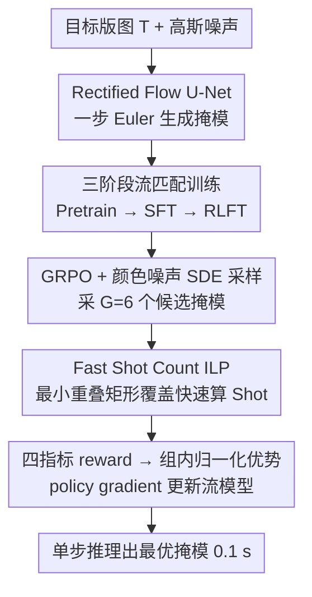

# LithoGRPO: Fast Inverse Lithography via GRPO Reinforced Flow Matching

**会议**: ICML 2026  
**arXiv**: [2606.00228](https://arxiv.org/abs/2606.00228)  
**代码**: https://github.com/laiyao1/LithoGRPO  
**领域**: 科学计算 / 半导体制造 / Flow Matching / 强化学习  
**关键词**: 逆光刻（ILT）、Rectified Flow、GRPO、不可微指标、Shot Count

## 一句话总结
LithoGRPO 把光刻掩模生成建模为以目标版图为条件的 rectified flow，并用 GRPO 强化学习微调，让一次前向就能同时优化 L2/PVB（可微）与 EPE/Shot（不可微）四类光刻指标，配合一个 130×–490× 加速的快速 shot-count 算法，在 LithoBench 上把综合排名从 5.6 拉到 4.3，单样本推理仅 0.1 s。

## 研究背景与动机

**领域现状**：在半导体制造中，光刻把电路版图通过掩模投影到晶圆上。当特征尺寸缩到曝光波长以下，衍射会让"投出来的图"严重偏离"想要的图"。传统补救手段 OPC（光学邻近校正）只在已有边缘上做局部位移；ILT（逆光刻）则把整张掩模当像素级反问题来优化，是当前最强的范式。ILT 方法大致分两类：基于优化的（MOSAIC、LevelSet 等，迭代梯度下降）和基于学习的（GAN-OPC、Neural-ILT、DAMO、ILILT、扩散模型等，端到端 image-to-image）。

**现有痛点**：优化派慢且只能处理可微目标；学习派则被两件事卡住——其一，监督数据本身来自优化派结果，质量天花板被锁死；其二，训练损失仍然必须可微，所以两个真正决定良率与成本的关键指标——**EPE（边缘位置误差，离散计数）**与 **Shot Count（掩模被分解为多少个矩形 shot，写片成本直接相关）**——在训练里完全被忽略，只在最终评估时算一遍。基于扩散的 ILT（如 DiffOPC、AdaOPC 系扩散变体）虽然图像质量高，但多步采样推理太慢。

**核心矛盾**：ILT 的目标函数天然是"可微 + 不可微"混合的——L2 与 PVB 可以走梯度，EPE 和 Shot 不行；而且这四个指标互相打架（追 L2 会让掩模几何更碎，Shot 立刻飙）。纯生成模型只能学到训练数据分布，没有"指标反馈"通道；纯优化又只能爬一种可微地形。

**本文目标**：用一个统一框架同时优化四个指标，并且保持单步推理速度；同时把 Shot 这个评估瓶颈本身也加速到可以放进训练循环里。

**切入角度**：作者把 ILT 类比成"带物理 reward 的图像合成"——光刻 metric 本来就是显式、确定性的标量函数，天生适合当 RL 的 reward；这正好对应近期 Flow-GRPO 系列把 GRPO 搬到流模型上的做法。

**核心 idea**：用 **rectified flow** 把掩模建模为从噪声到掩模的直线 ODE（一步推理），再用 **GRPO 强化学习**通过随机化的 SDE 采样在同一目标下生成多个候选掩模，按四指标 reward 做组内归一化优势计算，从而把不可微指标也接入梯度更新；同时设计一个**最小重叠矩形覆盖 ILP** 替代 NP-hard 的传统 shot-count，让 RL 训练循环跑得起来。

## 方法详解

### 整体框架
LithoGRPO 把"给定目标版图、生成最优掩模"这个像素级反问题，转化成一个以目标版图 $\mathbf{T}$ 为条件的 rectified flow 生成任务：一个 87M 参数的 U-Net 参数化时间相关速度场 $\mathbf{v}_\theta(\mathbf{x}_t, t; \mathbf{T})$（噪声 $\mathbf{x}_t$ 与 $\mathbf{T}$ 沿通道拼接），推理时从高斯噪声出发用 Euler 法走一步 $\mathbf{x}_1 = \mathbf{x}_0 + \mathbf{v}_\theta(\mathbf{x}_0, 0; \mathbf{T})$ 即出掩模，512×512 整张图 0.1 s。真正的难点不在生成而在指标——四个光刻指标里 L2/PVB 可微、EPE/Shot 不可微且彼此打架，所以训练被拆成 Pretrain（学版图→掩模的条件分布）、SFT（接入可微指标把 L2/PVB 推到饱和）、RLFT（用 GRPO 让不可微的 EPE/Shot 也能反向影响参数）三阶段，逐步把不同性质的指标喂进同一个流模型。

物理建模侧，掩模 $\mathbf{x}$ 经 Hopkins 衍射模型 $\mathbf{I} = \sum_k \mu_k |h_k \otimes \mathbf{x}|^2$ 得到空中像，再经 sigmoid 软化阈值 $\mathbf{Z} = 1/(1+\exp[-\alpha(\mathbf{I}-I_\mathrm{th})])$ 得到光刻胶图像；整条 $g(\mathbf{x}) = f(h(\mathbf{x}))$ 对 $\mathbf{x}$ 可微，正是 L2 与 PVB 能走梯度的反传通道。

### 关键设计

**1. 三阶段 Pretrain → SFT → RLFT 流匹配训练：把生成与冲突指标逐层解耦**

如果一上来就把四个相互冲突的指标全塞进损失，梯度会被四个方向同时拉扯而卡死，尤其 Shot 这种离散目标根本没有梯度。作者画的训练动力学图（Fig. 4）揭示了这个冲突的物理根源：L2/EPE 在 Pretrain+SFT 阶段单调下降，但 Shot 反而单调上升——这正是"追 fidelity 会把掩模做碎、shot 数飙升"的固有 trade-off。于是三阶段分工：Pretrain 用标准 rectified flow loss $\mathcal{L}_\mathrm{flow} = \mathbb{E}[\|\mathbf{v}_\theta(\mathbf{x}_t, t) - (\mathbf{x}_1 - \mathbf{x}_0)\|^2]$ 学条件分布；SFT 在任意中间时刻 $t$ 把当前速度投影到终点 $\mathbf{x}_1 = \mathbf{x}_t + (1-t)\mathbf{v}_\theta$，在 $\mathbf{x}_1$ 上算可微指标，损失为 $\mathcal{L}_\mathrm{sft} = \lambda_\mathrm{flow}\mathcal{L}_\mathrm{flow} + \lambda_{\mathrm{L2}}\mathrm{L2} + \lambda_\mathrm{PVB}\mathrm{PVB}$；RLFT 则在"可微指标已饱和"的初始化上专门用 GRPO 修 Shot。这样 RLFT 不必同时管四个目标，只需在一个已经很好的起点上把飙起来的 Shot 擦回去而不掉其余三项，结果才稳定。

**2. GRPO + 颜色噪声 SDE 采样：给确定性流模型注入"可制造"的随机探索**

Rectified flow 本身是确定性 ODE，采不出多条轨迹，没法做 GRPO 的组内优势归一化；而 ILT 又要求掩模几何"成片成块"，不能像 GAN 那样像素级抖动。作者把确定性 ODE 重写为等价 SDE 并用 Euler–Maruyama 离散化 $\mathbf{x}_{t+\Delta t} = \mathbf{x}_t + [\mathbf{v}_\theta + \frac{\sigma_t^2}{2t}(\mathbf{x}_t + (1-t)\mathbf{v}_\theta)]\Delta t + \sigma_t\sqrt{\Delta t}\boldsymbol{\varepsilon}$（$\sigma_t = a\sqrt{(1-t)/t}$），在保持边缘分布不变的前提下生成 $G=6$ 个候选掩模；reward 取四指标负归一化和 $R = -\sum_{k \in \{\mathrm{L2,PVB,EPE,Shot}\}} k/k_0$（$k_0$ 为 SFT 末态基线），优势 $A_i = (R_i - \mathrm{mean}) / (\mathrm{std} + \varepsilon)$。其中最关键的工程选择是：噪声 $\boldsymbol{\varepsilon}$ 不用白噪声，而用**低频颜色噪声**（在傅里叶域对白噪声低通滤波得到）——白噪声会在掩模上撒高频碎片，直接把 shot count 顶飞，而颜色噪声保留空间相关性、不打破掩模拓扑，恰好把"RL 要探索"和"掩模要可制造"这对矛盾需求拼到一起。幅度 $a=0.1$ 最佳：太小（0.01）探索过慢，太大（0.5）初始 reward 就崩。

**3. 最小重叠矩形覆盖 ILP 的 Fast Shot Count：把 NP-hard 指标压进 RL 循环**

传统 shot count 是"最小不重叠矩形分割"，NP-hard，每张 mask 要算 30–150 s；而 GRPO 一次迭代要算 $G \times \text{batch}$ 张掩模，完全跑不动，这一段才是把 RL 跑通的真正瓶颈。作者把它近似成一个可解的"最小集合覆盖 ILP"，三步流水线完成：先用基于直方图的扫描在 $O(N^2)$ 内枚举所有局部最大矩形作候选，再在 $O(K^2)$ 内剪掉被完全包含的冗余候选，最后让剩余候选构成集合覆盖 ILP、用行扫描在 $O(NK^2)$ 内生成约束并交 PuLP 求解——允许 shot 之间重叠，正好契合现代多电子束（multi-beam）写片实践。代价是"重叠覆盖"的绝对计数会比"非重叠分割"略大，但作者证明 GRPO 的组内归一化（Eq. 12）会自动消掉这个常数偏移，**只要组内排序保持，policy gradient 就不受影响**，因此放任绝对值、只保排序即可。这套"算法-训练目标共同设计"实测把单张掩模从 60 s 量级压到 0.2 s，与传统实现相关系数 $R^2 = 0.994$。

### 损失函数 / 训练策略
总训练 = 50 epoch Pretrain + 25 epoch SFT + 1000 step RLFT（Metal 设置，Via 设置略减）。GRPO 用标准 clipped 形式 $\mathcal{L}_\mathrm{grpo} = -\mathbb{E}_\mathbf{T}[\sum_i \min(r_i A_i, \mathrm{clip}(r_i, 1-\varepsilon, 1+\varepsilon) A_i)]$，其中 $r_i = \pi_\theta(\mathbf{x}_1^{(i)}|\mathbf{T}) / \pi_{\theta_\mathrm{old}}(\mathbf{x}_1^{(i)}|\mathbf{T})$，每步过渡 log-prob 用 $\mathcal{N}(\boldsymbol{\mu}_t, \sigma_t^2 \Delta t \mathbf{I})$ 近似。硬件为 4 × RTX 3090，每阶段 < 8 小时，推理默认 1 步采样。

## 实验关键数据

### 主实验
在 LithoBench 的 4 个数据集（MetalSet / StdMetal / ViaSet / StdContact）上对 4 个指标 + 推理时间共 17 列做综合排名（越低越好）：

| 类别 | 方法 | MetalSet L2 | MetalSet Shot | ViaSet L2 | StdContact Shot | 时间(s) | Avg. Rank |
|------|------|------------:|--------------:|----------:|----------------:|--------:|----------:|
| 优化派 | MOSAIC | 35860 | 361 | – | – | 0.940 | 9.8 |
| 优化派 | LevelSet | 34712 | 263 | 9632 | 275 | 2.290 | 6.9 |
| 优化派 | MultiLevel | 27893 | 1250 | 4268 | 1473 | 1.030 | 5.6 |
| 学习派 | GAN-OPC | 43414 | 574 | 14767 | 276 | 0.010 | 7.4 |
| 学习派 | Neural-ILT | 36670 | 476 | 12723 | 265 | 0.025 | 6.5 |
| 学习派 | DAMO | 32579 | 523 | 5081 | 458 | 0.028 | 5.7 |
| 混合 | ILILT | 30353 | 433 | 4666 | 510 | 0.441 | 5.9 |
| 本文 | **LithoGRPO (Pretrain)** | 32824 | 487 | 11595 | 377 | 0.104 | 6.6 |
| 本文 | **LithoGRPO (SFT)** | 29123 | 803 | 4270 | 1546 | 0.104 | 4.7 |
| 本文 | **LithoGRPO (RLFT)** | **28933** | 444 | **4276** | **889** | 0.104 | **4.3** |

LithoGRPO (RLFT) 在综合排名上取得 4.3，显著领先此前最强基线 MultiLevel 的 5.6；推理时间 0.1 s 仅次于 GAN-OPC/Neural-ILT 等更快但精度差很多的方法。±std（4 个随机种子）控制在 ±21–541 之间，结果稳定。

### 消融实验

| 配置 | MetalSet Shot ↓ | 关键观察 |
|------|----------------:|----------|
| Pretrain only | 487 | flow 基线，L2/Shot 都一般 |
| + SFT（可微指标） | 803 | L2/PVB 大幅下降，但 Shot 飙升 65% |
| + RLFT（四指标 GRPO） | **444** | Shot 比 SFT 阶段砍掉 45%，且 L2/PVB/EPE 不退步 |
| RLFT + 白噪声 SDE | ↑ | 掩模碎裂，Shot 显著变差 |
| RLFT + 颜色噪声 $a=0.5$ | ↑ | 初始 reward 崩，但仍能收敛 |
| RLFT + 颜色噪声 $a=0.01$ | ↑ | 探索过慢 |
| RLFT + 颜色噪声 $a=0.1$（默认） | **444** | 最佳 |
| 推理 1 步 vs 2/5/10 步 | 444 / 460 / 483 / 491 | 1 步已和多步打平，速度优势保留 |

Fast Shot Count 单独评估：在 4 个数据集上分别取得 134.6× / 398.2× / 251.1× / 491.3× 加速，与传统实现相关 $R^2 = 0.994$。

### 关键发现
- **三阶段拆分是必要的**：训练动力学图显示 L2/EPE 在 SFT 单调降但 Shot 单调升；如果一开始就把 Shot 塞进 reward，模型会被冲突梯度卡住。SFT 把可微指标推到饱和、RLFT 再"擦"Shot 的分工，是结果稳定的关键。
- **颜色噪声是工程上的关键 trick**：它解决了"RL 探索需要噪声"和"掩模需要连续区域"之间的物理冲突。如果直接用白噪声，整篇文章的 Shot 优势会全部消失。
- **GRPO 的组内归一化天然容忍 reward 的常数偏移**，这一点被作者用来在数学上证明可以放心地用 fast shot 替代精确 shot——这是把 NP-hard 指标接入 RL 训练循环的整篇工作的支柱。
- **OOD 泛化最难**：StdContact 是 ViaSet 的 OOD 测试集，RLFT 在 L2 上从 LevelSet 的 50770 降到 19102（–62%），是所有 baseline 里最大的提升。

## 亮点与洞察
- **"指标即 reward"的范式迁移**：ILT 这种带显式、确定性物理 metric 的任务，比文本到图像任务更适合 GRPO——奖励无需训练 reward model，物理就是 ground truth。这种思路完全可以迁移到其他"前向可仿真、后向不可微"的科学计算任务（如电磁仿真反演、PDE 控制、电路布线）。
- **flow matching + RL 这条线** 在 ILT 域是第一次：它绕开了扩散多步推理的速度瓶颈，又保留了 SDE 探索能力。一步采样 + GRPO 微调的组合在其他需要部署效率的生成任务上有借鉴价值。
- **算法-训练共同设计的范例**：fast shot count 不是"独立加速器"，而是"为 RL 量身定做的近似器"——只保证排序不变，绝对值放任，反过来让 GRPO 接受这种近似。如果把它当独立模块去追 $R^2$，可能会过度工程化反而失去速度优势。
- **不给顶级 trade-off 打满分的诚实**：作者在 limitations 里直接说"jointly optimizing conflicting metrics remains inherently challenging"——这点很真实，四指标之间的 Pareto 前沿不是被消除而是被推进。

## 局限与展望
- **多阶段训练在计算成本上确实更贵**：Pretrain + SFT + RLFT 三段加起来近 24 GPU·h，比纯学习派（DAMO 等）训练成本高一个量级，作者把它当作"质量换成本"的权衡。
- **评估只在 LithoBench**：工业级版图（更大尺寸、更复杂层、EUV 工艺）未验证；论文也明确说"远离 cutting-edge industrial processes"。
- **GRPO 超参（$G=6$、$a=0.1$、ILP 求解器）依赖人工选择**：换工艺节点很可能需要重调，缺少自适应机制。
- **Shot 与 L2/PVB 的本质 trade-off 没有被消除**：表 1 中 SFT 的 L2 比 RLFT 略低，但 Shot 几乎翻倍——RLFT 是在 Pareto 前沿上选了一个更好的折中点，而非全面碾压。
- **可能的改进**：把 reward 权重从均匀改为依据制造工艺成本自适应、引入差异化时间步的 reward shaping（参考 TempFlow-GRPO）、在多电子束写片成本模型上直接训练 reward。

## 相关工作与启发
- **vs ILILT（混合优化-学习）**：ILILT 用端到端可微 pipeline 把优化展开成学习，但仍受限于可微目标且推理 0.44 s 较慢；LithoGRPO 单步 0.1 s 且能动 Shot/EPE，综合排名 4.3 vs 5.9。
- **vs 扩散派 ILT（DiffOPC / AdaOPC 系）**：扩散需多步去噪，无法直接挂 GRPO（每步 reward 计算太贵）；rectified flow 的直线路径 + 一步推理刚好让 RL 微调在算力上可行。
- **vs RL-OPC**：同样用 RL 但只在 OPC 的 edge displacement 空间上操作，几何先验受限；LithoGRPO 把整个像素级掩模空间交给 flow 学，再用 RL 修，自由度高一个维度。
- **vs FlowGRPO / DanceGRPO / TempFlow-GRPO**：本文是首个把 flow + GRPO 搬到 ILT 这个"物理 reward 已知"的科学计算任务上的工作，验证了 GRPO-on-flow 这套范式跨域的可迁移性。
- **启发**：任何"前向可仿真、后向不可微、有明确数值 metric"的科学问题（光学/电磁/电路/材料反演）都可以套用这个三阶段 + 颜色噪声 SDE-GRPO 的 recipe，关键是设计一个"排序保真度高、计算极快"的 reward 近似器。

## 评分
- 新颖性: ⭐⭐⭐⭐⭐ 首次把 flow matching 与 GRPO 引入 ILT，并把 NP-hard 的 shot count 用 ILP + 排序不变性证明接入 RL 训练循环
- 实验充分度: ⭐⭐⭐⭐ 4 数据集 × 4 指标 + 推理时间 + 4 种子，对比 9 个基线；缺工业级版图与 EUV 节点
- 写作质量: ⭐⭐⭐⭐ 训练动力学图与噪声类型可视化很有说服力，物理建模与算法部分平衡得当
- 价值: ⭐⭐⭐⭐⭐ 半导体良率与成本直接受益，是 RL+生成模型落地科学计算的一个干净示范

<!-- RELATED:START -->

## 相关论文

- [\[ICML 2026\] Saving Foundation Flow-Matching Priors for Inverse Problems](saving_foundation_flow-matching_priors_for_inverse_problems.md)
- [\[CVPR 2026\] GRPO-Guard: Mitigating Implicit Over-Optimization in Flow Matching via Regulated Clipping](../../CVPR2026/image_generation/grpo-guard_mitigating_implicit_over-optimization_in_flow_matching_via_regulated_.md)
- [\[ICML 2026\] (HB-ARFM) History-Bootstrapped Flow Matching for Inverse Boiling Reconstruction](hb-arfm_history-bootstrapped_flow_matching_for_inverse_boiling_reconstruction.md)
- [\[CVPR 2026\] Stepwise-Flow-GRPO：给流匹配模型的去噪步逐步分配信用](../../CVPR2026/image_generation/stepwise_credit_assignment_for_grpo_on_flow-matching_models.md)
- [\[ICML 2026\] Exploring and Exploiting Stability in Latent Flow Matching](exploring_and_exploiting_stability_in_latent_flow_matching.md)

<!-- RELATED:END -->
