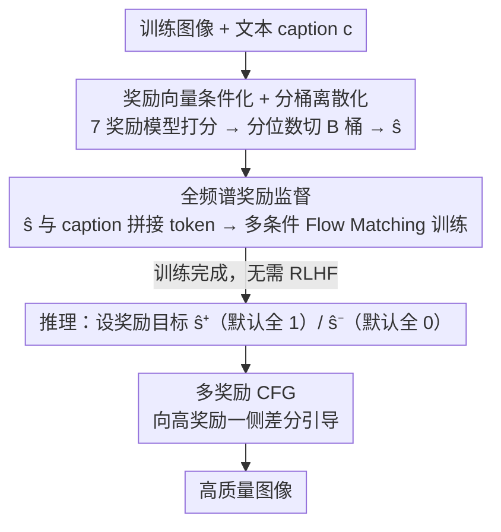

# MIRO: 多奖励条件预训练同时提升 T2I 质量与效率

**会议**: ICML 2026  
**arXiv**: [2510.25897](https://arxiv.org/abs/2510.25897)  
**代码**: 有（论文声明 "Code and weights available here"）  
**领域**: 扩散模型 / 文生图  
**关键词**: 多奖励条件、Flow Matching 预训练、Classifier-Free Guidance、奖励引导采样、推理时缩放

## 一句话总结
MIRO 把"对齐"从 RLHF 后训练阶段直接塞回预训练：给每张训练图打 7 个奖励分（美学、用户偏好、文图对齐、视觉推理、科学正确性等），让 Flow Matching 模型学习 $p(x|c, s)$，推理时通过多奖励 CFG 指向高奖励区域，0.36B 参数即在 GenEval 上超过 12B 的 FLUX-dev，训练算力少 370×，单样本推理质量超过 baseline 跑 128 次。

## 研究背景与动机

**领域现状**：现代 T2I 系统遵循"预训练 → SFT → RLHF"三段式流水线（Stable Diffusion 3 / FLUX 路线）。预训练学网图分布，SFT 在精挑数据上收口味，RLHF 把分布拉向某一个标量奖励（通常是 PickScore 或 HPSv2）。

**现有痛点**：每一段都付出代价——预训练只优化 likelihood 不管用户偏好；SFT 抛弃"低质"数据，丢掉了让模型学习自然图像结构的信号；RLHF 把分布坍缩到单一标量奖励上，造成 mode collapse、损害语义保真度，而且把奖励间的 trade-off 在训练时就钉死，用户在推理时无法再调。

**核心矛盾**：这三段是**串行收缩**的——前一段产生的分布被后一段进一步收窄，最终把用户钉死在训练者选的那一个操作点上。同时"单一奖励 + 数据过滤"既浪费了低分但富含结构信号的数据，又天然诱发 reward hacking（如美学奖励飙高但文图对齐崩塌）。

**本文目标**：把多奖励对齐**直接融进预训练**，做到三件事：(i) 不丢任何训练样本；(ii) 推理时让用户在多个奖励维度上自由滑动；(iii) 用奖励信号本身作为密集监督加速收敛。

**切入角度**：与其在后训练阶段把分布拉向 $\arg\max r$，不如把奖励分 $s$ 当作**额外条件**喂给生成器——让模型学"在 $s$ 这个奖励水平下，给定 caption $c$，图片长什么样"。这样低分图也有归宿（成为 $p(x|c, s_\text{low})$ 的样本），高分图也有归宿，整个奖励频谱都被建模。

**核心 idea**：把生成模型从 $p_\theta(x|c)$ 改成 $p_\theta(x|c, s)$，其中 $s=[s_1,\dots,s_N]$ 是 N 个奖励模型的离散分桶分数；用一个简单的多奖励 CFG 把推理引向高奖励一侧，用 RLHF 都换不来的"训练即对齐"。

## 方法详解

### 整体框架
MIRO 要解决的是"对齐"被推迟到 RLHF 后训练才做、且只能锁死单一奖励的问题。它的做法是把生成模型从 $p_\theta(x|c)$ 改成 $p_\theta(x|c, s)$：先用 7 个现成奖励模型给每张训练图打分、离散成奖励向量 $\hat{s}$，让 Flow Matching 模型把"在这个奖励水平下给定 caption 该长什么样"一并学进预训练；推理时再把奖励向量推到高分一侧并用扩展版 CFG 做引导。这样 SFT 和 RLHF 两个后训练阶段被整段替换掉，低分图、高分图、整个奖励频谱都进入同一个条件分布。骨干是 CAD（Coherence-Aware Diffusion）的 0.36B 参数 DiT 变体，在 16M 张图（CC12M + LA6）上训练；七个奖励涵盖五个维度——AestheticScore（美学）、PickScore / HPSv2 / ImageReward（用户偏好）、OpenAI CLIP / JINA CLIP / VQAScore（文图对齐）、SciScore（科学正确性）。

### 关键设计

**1. 奖励向量条件化 + 分桶离散化：把尺度迥异的奖励分变成模型能消化的条件**

七个奖励的量纲天差地别（Aesthetic 是 0~10、CLIP 是 0~1），直接把 raw 分数当条件喂进去，模型会被高密度的中段分数（大多数图都是平均质量）带偏，尾部那些真正高质量的样本根本学不会。MIRO 的做法是先用各奖励模型对全数据集打分得到 $s^{(i)} \in \mathbb{R}^N$，再做 **uniform binning**——按分位数等比例切 B 个桶，而不是 equal-width binning。这等价于把奖励分换成 rank，天然抗尺度，且保证高分稀疏区也有足够样本量，模型才学得动 $s=B-1$ 的尾部分布。条件注入沿用 CAD 的方式，把 $\hat{s}$ 编码成 token 与 caption token 拼接，使奖励向量和文本 $c$ 同级地进入 velocity network。

**2. 全频谱奖励监督：把收敛加速和抗 reward hacking 都归结到监督密度**

baseline 只能靠扩散重建 loss 反复摸索"什么是好图"，监督信号很稀。MIRO 让模型每一步训练都看到"这张图在 7 个维度上分别多好"，等于拿到 7 路 dense label，监督密度大幅提升——这正是它比 baseline 收敛快 19× 的根因：不是模型变大，而是信号变密。同时定理 2.2 用熵保持证明这一改造不丢分布：边缘化 $\sum_s p(s|c)\, p_\theta(x|c, s) = p_\text{data}(x|c)$，且 $H(p_\text{marginal}) = H(p_\text{data})$。保留全频谱也顺带成了防 mode collapse / reward hacking 的根本机制——要拟合低分桶的样本，模型就必须保留"丑图"的生成能力，反过来约束它别过拟合到单一高分模式。

**3. 多奖励 Classifier-Free Guidance：把训练时锁死的权重搬到推理时让用户自由滑动**

RLHF 在训练时就把多个奖励的 trade-off 钉死，用户事后无法再调。MIRO 把单奖励 CFG 扩展到向量空间来解决这件事：推理时用正负两个奖励目标 $\hat{s}^+$（默认全 1）和 $\hat{s}^-$（默认全 0）做差分推断，$\hat{v}_\theta(x_t, c) = (1+\omega)\, v_\theta(x_t, c, \hat{s}^+) - \omega\, v_\theta(x_t, c, \hat{s}^-)$。定理 2.1 证明这等价于从 reward-tilted 分布 $p_\omega(x|c) \propto p(x|c, s^+)\big[\frac{p(s^+|x,c)}{p(s^-|x,c)}\big]^\omega$ 采样，速度差近似对数几率梯度 $\nabla_{x_t}\log\frac{p(s^+|x_t,c)}{p(s^-|x_t,c)}$。因为每个奖励维度的目标值都能独立设定，用户可以单独把美学维度调到 0.625 而其余保持 1（GenEval 上能挤出 +7 分），相当于在多奖励 Pareto 前沿上自由取点，而不会像单维度优化那样坍缩。

### 损失函数 / 训练策略
训练目标是多条件 Flow Matching loss $\mathcal{L} = \mathbb{E}\big[\|v_\theta(x_t, c, \hat{s}) - (\epsilon - x)\|_2^2\big]$，其中 $x_t = (1-t)x + t\epsilon$；CFG 按标准做法在训练时以一定概率 drop 条件。整体单阶段训练即得对齐效果，不需要任何后训练 RL 阶段，也就绕开了 RLHF 的奖励模型梯度估计、PPO ratio 截断等不稳定环节。

## 实验关键数据

### 主实验（GenEval + PartiPrompts，节选 Table 1）

| 模型 | 参数 | 推理 TFLOPs | GenEval | Aesthetic | ImageReward | HPSv2 | PickAScore |
|------|------|-------------|---------|-----------|-------------|-------|------------|
| SDXL | 2.6B | – | 55 | 5.94 | 0.46 | 0.25 | 0.220 |
| SD3-medium | 2.0B | – | 62 | 6.18 | 1.15 | 0.30 | 0.225 |
| Sana-1.6B | 1.6B | – | 66 | 6.36 | 1.23 | 0.30 | 0.228 |
| **FLUX-dev** | **12.0B** | **1540** | 67 | 6.56 | 1.19 | 0.30 | 0.229 |
| Baseline (real cap.) | 0.36B | 4.16 | 52 | 5.18 | 0.52 | 0.25 | 0.212 |
| MIRO (real cap.) | 0.36B | 4.16 | 57 | 6.28 | 1.06 | 0.29 | 0.220 |
| **MIRO (50% synth.)** | **0.36B** | **4.16** | **68** | 6.28 | 1.11 | 0.29 | 0.220 |
| MIRO† (synth. + $\hat{s}^+_\text{aes}=0.625$) | 0.36B | 4.16 | **75** | 5.24 | 1.18 | 0.29 | 0.220 |
| ImageReward-Scaled MIRO (128 样本) | 0.36B | 532 | 75 | 6.28 | **1.61** | 0.30 | 0.223 |

关键对比：0.36B MIRO + 合成 caption 的 GenEval 68 已经压过 12B FLUX-dev 的 67，训练算力少 **370×**；推理算力 532 vs 1540 TFLOPs（含 128 样本 best-of-N），仍快 **3×**。

### 消融与训练效率（Figure 3 训练曲线）

| 配置 | Aesthetic | ImageReward | PickScore | HPSv2 |
|------|-----------|-------------|-----------|-------|
| Baseline 收敛步数 | ~500k | ~500k | ~500k | ~500k |
| MIRO 达到 baseline 终态所需步数 | 26k | 135k | 143k | 79k |
| 加速比 | **19.1×** | **3.7×** | **3.5×** | **6.3×** |

合成 caption 拆解（Figure 5 + Table 1）：Baseline 用合成 caption 把 GenEval 从 52 提到 57；MIRO 用合成 caption 从 57 提到 68，**多奖励条件和合成 caption 是协同放大**而非冗余。最大单项提升：Position 30→46（+53%）、Counting 44→61（+39%）。

### 关键发现
- **奖励监督的密度直接换算成训练速度**：Aesthetic 加速 19× 远超其他维度（HPSv2 6.3×、PickScore 3.5×），说明哪个奖励信号越"密集易学"，加速越夸张；但即使最难的 PickScore 也提速 3.5×，全频谱密集监督的红利是普适的。
- **单奖励训练 = 显式 reward hacking 实验**：单 Aesthetic 条件 GenEval 仅 33（比 baseline 还低 19 分），美学冲到 6.65 但语义对齐崩溃；MIRO 反而美学 6.28、GenEval 57，验证了多奖励**互相约束**才能避免坍缩。
- **测试时 best-of-N 的效率对比惊人**：ImageReward 维度 MIRO 跑 8 次 ≈ baseline 跑 128 次（16×）；PickScore 维度 MIRO 跑 4 次 ≈ baseline 跑 128 次（**32×**）。Aesthetic 和 HPSv2 上 MIRO **单样本**已经超过 baseline 的 128 样本上界。
- **推理时调奖励权重换 trade-off**：把 $\hat{s}^+_\text{aesthetic}$ 从 1 降到 0.625，GenEval 从 68 跳到 75；调到 0 则美学崩塌但语义最强。说明 MIRO 真的在多维奖励空间里建模了 trade-off 曲面，不是"哪个奖励训练时权重高就只能在哪里"。
- **跨指标泛化**：用 HPSv2 做 best-of-N 选样的 MIRO 反过来在 ImageReward 上拿到 1.35，超过专门为 ImageReward 训练的模型（1.04），证明多奖励训练学到的是更通用的"好图"概念。

## 亮点与洞察
- **把对齐当作条件而非目标**，思路上很类似 classifier-free guidance 之于 classifier guidance——不再单独优化 reward gradient，而是把 reward 编码进条件分布，所有 RLHF 的 instability 都被绕开了。这条思路可以直接迁到视频生成、3D 生成、code generation 等任何"有多个 reward model 可用"的领域。
- **理论与工程的呼应**：Theorem 2.1 把多奖励 CFG 解释为 reward-tilted 采样的对数几率梯度，Theorem 2.2 用熵保持证明全频谱不丢分布。理论不只是装饰，它直接预言了"调 $\omega$ 控制对齐强度、调 $\hat{s}$ 控制方向"两个旋钮在工程上必然有效。
- **训练效率的真正来源是监督密度，不是参数**：MIRO 0.36B 打 FLUX 12B，不靠新架构、不靠更多数据，只靠把 reward 喂回训练 loop——把"模型还得从重建里再次学习什么是好图"这一冗余阶段消掉了。这给所有"小模型如何追大模型"的研究者提供了一条新路：找到更多 dense supervision，比扩参数划算。

## 局限与展望
- **依赖现成 reward model 的盲区**：MIRO 的天花板被 7 个 reward model 的覆盖度卡住——如果某个维度（如版权风险、文化适配）没有可用 reward model，MIRO 就完全学不到。SciScore 等较新奖励的可靠性也未充分验证。
- **奖励间的相关性未显式建模**：Aesthetic 和 PickScore 高度相关，VQAScore 和 CLIP 也是，论文用了 7 个 reward 但没有给出独立性分析；理论保证假设 reward 间条件独立，实际未必成立，分桶后的有效自由度可能远低于 7。
- **数据规模仍偏小**：16M 图、0.36B 参数的设置距离 FLUX 的训练规模差几个量级，扩到 100M 图、1B+ 模型时，多奖励条件是否还能维持 19× 加速比、是否会被 reward 信号本身的噪声反噬，没有验证。
- **推理时奖励权重调节虽然灵活，但缺少自动化**：MIRO† 那个"美学=0.625"是手工搜出来的；如果用户面对 7 个旋钮 + B 个分桶，怎么找到自己想要的 trade-off 点是个开放问题，可能需要一个 meta-learning 或 preference inference 层。
- **改进方向**：可以把 MIRO 和 DPO 类的 preference pair 训练结合，把"哪个图比哪个图好"的相对信号也当作条件；或者用 reward model uncertainty 加权，让模型对低置信度的 reward 维度学习权重更低。

## 相关工作与启发
- **vs RLHF / DPO（Fan 2023, Rafailov 2023）**: 它们在后训练阶段优化 $\mathbb{E}_x[r(x)]$ 或偏好对，需要单独的 RL 阶段和奖励模型梯度估计；MIRO 直接把奖励作为条件喂给生成器，单阶段训练完成对齐，无 mode collapse、无 PPO 超参、无后训练阶段。
- **vs Coherence-Aware Diffusion (CAD, Dufour 2024)**: CAD 是 MIRO 的前身，但只条件化单一 CLIP score 来避免数据过滤；MIRO 把它扩展到 7 个奖励并提出多奖励 CFG。Table 1 显示单 CLIP 条件版（"CAD-like CLIP" 行）GenEval 57，和 MIRO real-caption 持平，但合成 caption 上 MIRO 能再加 11 分，说明多奖励的可扩展性远超单奖励。
- **vs Parrot (Lee 2024, ECCV)**: Parrot 也做多奖励 T2I 但走的是 Pareto-optimal RL 路线，需要复杂的多目标 PPO；MIRO 完全绕开 RL，仅用条件化 + CFG 就达到类似多目标平衡效果，工程实现简单一个量级。
- **vs Synthetic Captioning（DALL·E 3 路线）**: 合成 caption 把 baseline 从 52 提到 57，是单一手段；MIRO 与合成 caption 正交，叠加后到 68，证明两条路线解决的是不同问题（caption 解决文本侧噪声，MIRO 解决奖励侧监督密度）。
- **启发**：任何"有多个评估器可用、但训练只用单 loss"的场景，都可以套 MIRO 范式——把评估器当条件而不是优化目标。code generation 里的 unit test pass rate、execution correctness、style score；视频生成里的运动平滑度、物理合理性、时序一致性，都可以这么干。

## 评分
- 新颖性: ⭐⭐⭐⭐ "奖励当条件而非目标"在 RLHF 时代是个范式翻转，但 CAD 已经在单奖励上跑通，MIRO 是扎实的扩展而非颠覆。
- 实验充分度: ⭐⭐⭐⭐⭐ 7 个单奖励 baseline + 合成 caption 拆解 + 训练曲线 + best-of-N + 跨指标泛化 + 权重 sweep，每个论点都有针对性实验，没有挑樱桃嫌疑。
- 写作质量: ⭐⭐⭐⭐ 三段式痛点分析非常清晰，Method 公式 + 定理 + 直觉描述兼顾；图 2 八合一雷达图略密但信息量足。
- 价值: ⭐⭐⭐⭐⭐ 0.36B 打 12B、训练算力少 370× 的结果如果可复现，对工业 T2I 流水线意味着 SFT + RLHF 阶段可被整段删除，长期影响很大。

<!-- RELATED:START -->

## 相关论文

- [\[ICML 2026\] HoloFair: Unified T2I Fairness Evaluation and Fair-GRPO Debiasing](holofair_unified_t2i_fairness_evaluation_and_fair-grpo_debiasing.md)
- [\[CVPR 2026\] Bias at the End of the Score: Demographic Biases in Reward Models for T2I](../../CVPR2026/image_generation/bias_reward_models_t2i.md)
- [\[ICLR 2026\] Infinity and Beyond: Compositional Alignment in VAR and Diffusion T2I Models](../../ICLR2026/image_generation/infinity_and_beyond_compositional_alignment_in_var_and_diffusion_t2i_models.md)
- [\[CVPR 2026\] FailureAtlas: Mapping the Failure Landscape of T2I Models via Active Exploration](../../CVPR2026/image_generation/failureatlas_mapping_the_failure_landscape_of_t2i_models_via_active_exploration.md)
- [\[ICLR 2026\] The Intricate Dance of Prompt Complexity, Quality, Diversity, and Consistency in T2I Models](../../ICLR2026/image_generation/the_intricate_dance_of_prompt_complexity_quality_diversity_and_consistency_in_t2.md)

<!-- RELATED:END -->
