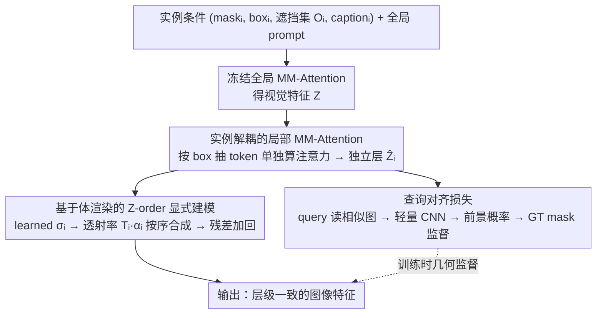

# OcclusionFormer: Arranging Z-Order for Layout-Grounded Image Generation

**会议**: ICML2026  
**arXiv**: [2605.21343](https://arxiv.org/abs/2605.21343)  
**代码**: https://henghuiding.com/OcclusionFormer/ (项目页)  
**领域**: 图像生成 / 布局到图像 / 扩散模型  
**关键词**: 布局到图像, Z-order 遮挡, 体渲染, 实例解耦, DiT

## 一句话总结
针对布局到图像生成在重叠区域出现纹理纠缠和层级混乱的问题，作者构建了带显式 Z-order 与 amodal 标注的大规模数据集 SA-Z，并提出 OcclusionFormer：通过实例解耦 + 体渲染显式建模遮挡优先级，再用查询对齐损失强化空间一致性，在 OverLayBench 复杂子集与自建 SA-Z Eval 上的遮挡感知指标全面超过 Eligen、Creatilayout、InstanceAssemble 等强基线。

## 研究背景与动机

**领域现状**：布局到图像（layout-to-image）生成通过给扩散模型注入 2D/3D 边界框作为空间条件，在 GLIGEN、Eligen、Creatilayout 等工作推动下已经在单实例的空间可控性上做得不错，是复杂场景合成、视觉故事生成等任务的基础设施。

**现有痛点**：一旦多个 bounding box 出现重叠，主流方法就开始"翻车"——交叠区里的物体会出现纹理纠缠、层级颠倒、甚至被强制缩进只覆盖可见部分。原因是这些方法把布局当作 2D 平面条件，对"谁挡谁"完全没有概念。用户其实是按 amodal（完整范围）画框的，并默认有一个深度顺序，但模型读不出来。

**核心矛盾**：图形学里早就有 Z-buffer 来解决遮挡，但扩散模型的注意力机制天生在 2D 平面上"无差别混合"特征，没有显式的 Z 轴维度。LaRender 用 training-free 的体渲染做了一次尝试，但它把 cross-attention 空间挪用来做遮挡控制，既丢了 global prompt，也对超参敏感、在复杂场景下容易跑偏。

**本文目标**：(1) 提供一个开放词表、带 Z-order 与 amodal 标注、规模够大的训练集；(2) 设计一个能在 DiT 框架里显式建模 Z-order 的训练式方案，既不破坏预训练能力，又能在重叠区给出物理一致的层级。

**切入角度**：作者认为 training-free 启发式不够，必须靠"数据驱动 + 显式监督"。具体做法是把每个实例先"解耦"到独立层，再用体渲染按用户指定的遮挡顺序把它们"合成"回来，最后用 mask 监督拉住空间几何。

**核心 idea**：把图像生成看成沿正交相机射线的体渲染过程——每个实例在自己框内独立做 MM-Attention 得到 "层"，再用学到的密度 $\sigma_i$ 计算透射率 $T_i$ 与不透明度 $\alpha_i$，按 Z-order 加权合成；同时引入查询对齐损失把每个实例的特征几何"焊"到 GT mask 上。

## 方法详解

OcclusionFormer 要解决的是：扩散模型的注意力天生在 2D 平面上"无差别混合"特征，没有 Z 轴的概念，所以重叠区会纹理纠缠、层级颠倒。它的思路是把图像生成重新看成一次沿正交相机射线的体渲染——先把每个实例"解耦"到独立的特征层，再按用户给的遮挡顺序用 NeRF 式的透射率公式把这些层有序合成回去。整个模块串接在 Flux.1-dev（DiT + Rectified Flow）每个 MM-Attention 块之后，仅用 LoRA（rank=4）微调，不破坏预训练骨干。

### 整体框架
输入是一组实例条件 $(M_i, B_i, \mathcal{O}_i, C_i, P)$（mask、bounding box、遮挡集合、实例 caption、全局 prompt）。每个 DiT block 先跑一次冻结的全局 MM-Attention 得到视觉特征 $\mathbf{Z}\in\mathbb{R}^{L\times D}$，随后做三件事：按每个实例的 box 抽出局部 token 单独算注意力得到"独立层" $\hat{\mathbf{Z}}_i$；用体渲染按 $\mathcal{O}_i$ 指定的 Z-order 把所有层合成成 $\mathbf{Z}_{out}$ 并残差加回主干；再用一个可学习 query 从每层读出空间相似度图、经轻量 CNN 预测前景概率，用 GT mask 监督几何。训练目标为 $\mathcal{L}_{total} = \mathcal{L}_{flow} + \lambda \mathcal{L}_{align}$，$\lambda=0.5$。

### 关键设计

**1. 实例解耦的局部 MM-Attention：把全局平面注意力切成可分层的"层"**

显式建模 Z-order 的前提，是先有一个个干净、互不污染的"层"可供排序，而 Eligen/Creatilayout 把布局当全局条件，所有实例和背景 token 挤在一个大注意力里"无差别"交互，根本没有层的概念。为此，对每个实例 $i$ 先用 $\Omega_i = \{u \mid \text{Coord}(u) \in B_i\}$ 选出落在它 bounding box 内的 token 索引，只在这个局部子集 $\mathbf{Z}_{\Omega_i}$ 与该实例的 caption embedding $\mathbf{C}_i'$ 之间复用原 MM-Attention 模块更新 $\hat{\mathbf{Z}}_{\Omega_i}, \hat{\mathbf{C}_i} = \text{MM-Attention}(\mathbf{Z}_{\Omega_i}, \mathbf{C}_i')$，框外补零。原 attention 参数全程冻结，只在投影矩阵上加 LoRA，这样既把每个实例的特征算干净、为后续有序合成打好基础，又保住了 Flux 的生成能力。

**2. 基于体渲染的 Z-order 显式建模：用透射率公式按顺序合成各层**

有了一个个层，还要按"谁挡谁"把它们合回去。这里借鉴 NeRF，把图像平面视为正交相机的成像面，每个实例对应一段沿射线的"介质"。关键是密度 $\sigma_i \in \mathbb{R}^D$ 不取固定值，而是由扩散时间步 $t$ 和实例文本池化向量 $y_i$ 经 time-text embedding 模块预测：$\mathbf{e}_{temb}^i = \text{TimeTextEmbed}(t, y_i) \to \sigma_i$——这样扩散早期低频阶段和后期细节阶段的"实心程度"可以不同，比 LaRender 那种 training-free、手工启发式且对超参敏感的密度更稳。在像素 $\mathbf{p}$ 处，不透明度 $\alpha_i(\mathbf{p}) = (1 - \exp(-\sigma_i)) \cdot \mathbb{I}(\mathbf{p} \in B_i)$，透射率 $T_i(\mathbf{p}) = \exp(-\sum_{j \in \mathcal{O}_i} \sigma_j \cdot \mathbb{I}(\mathbf{p} \in B_j))$，合成权重 $w_i = T_i \cdot \alpha_i$。在"有遮挡声明"的像素上做归一化加权平均 $\mathbf{Z}_{out}(\mathbf{p}) = \sum_i w_i \hat{\mathbf{Z}}_i / (\sum_i w_i + \epsilon)$，最后残差加回 $\mathbf{Z}$。对"框相交但并未真的互相遮挡"的边界像素，则退回简单平均（hybrid 策略），避免被强行加权后纹理崩坏。

**3. 查询对齐损失（Queried Alignment Loss）：把每层特征焊到 GT mask 的几何上**

体渲染只管"谁在前谁在后"的合成顺序，却不保证每一层特征本身有连贯的形状——若不约束，特征容易在 box 内乱飘、导致重叠区轮廓断裂。为此对每个实例从 $\mathbf{e}_{temb}^i$ 派生一个可学习 query $\mathbf{q}_i \in \mathbb{R}^D$，在 $\hat{\mathbf{Z}}_i$ 上做逐像素余弦相似度得到空间相似图 $\mathbf{S}_i(\mathbf{p}) = \hat{\mathbf{Z}}_i(\mathbf{p}) \cdot \mathbf{q}_i / ((\|\hat{\mathbf{Z}}_i(\mathbf{p})\| + \epsilon)\|\mathbf{q}_i\|)$，再喂入轻量 CNN $\mathcal{F}_\theta$ 输出前景/背景概率图 $\hat{\mathbf{M}}_i$，对 SA-Z 提供的 mask $M_i$ 用交叉熵 $\mathcal{L}_{align}$ 监督。之所以走"query + 独立 CNN 头读出"而不是直接在 attention map 上加 mask 损失，是因为后者会与 MM-Attention 的全局语义打架，监督路径更不解耦、效果反而更差（见消融）。

### 损失函数 / 训练策略
总目标 $\mathcal{L}_{total} = \mathcal{L}_{flow} + \lambda \mathcal{L}_{align}$，$\lambda=0.5$。$\mathcal{L}_{flow}$ 为 Flux 的 rectified flow matching：$\mathcal{L}_{flow} = \mathbb{E}_{t,\mathbf{z}_t,\mathbf{c}}[\|v_\theta(\mathbf{z}_t,t,\mathbf{c}) - \mathbf{v}_{target}\|_2^2]$，$\mathbf{v}_{target} = \mathbf{x}_1 - \mathbf{x}_0$。骨干 Flux.1-dev，LoRA rank=4，200K 步，batch 16，lr=1e-4。配套数据集 SA-Z 由 SACap-1M 派生：用 DescribeAnything 生成像素级 caption，用 InstaOrder 预测两两遮挡顺序，用 SAM-3D 重建 3D 几何再投影回图像平面得到 amodal mask 与 box，共 1M 高分辨率图、5.69M 实例，是首个开放词表、带 amodal + Z-order 的大规模布局生成数据集。

## 实验关键数据

### 主实验
评测在 OverLayBench（Simple/Regular/Complex）+ 自建 SA-Z Eval（1K 真实图片）。指标分三组：空间精度（mIoU / O-mIoU）、语义一致性（SR$_E$ / SR$_R$ / CLIP-G/L）、图像质量（FID），外加 InstaOrder 风格的遮挡指标 Occ.（F1）与 Dep.（WHDR）。

| 子集 | 指标 | OcclusionFormer | 前 SOTA (InstanceAssemble) | Creatilayout | Eligen | LaRender |
|------|------|------|------|------|------|------|
| OverLay-Simple | mIoU ↑ | **0.7405** | 0.7279 | 0.6998 | 0.6673 | 0.6604 |
| OverLay-Simple | O-mIoU ↑ | **0.5456** | 0.5152 | 0.4725 | 0.4151 | 0.4136 |
| OverLay-Simple | Occ. ↑ | **0.8051** | 0.7852 | 0.7559 | 0.6823 | 0.6294 |
| OverLay-Regular | mIoU ↑ | **0.6487** | 0.6299 | 0.5997 | 0.5680 | 0.5721 |
| OverLay-Regular | O-mIoU ↑ | **0.4161** | 0.3861 | 0.3517 | 0.3075 | 0.3006 |
| OverLay-Complex | mIoU ↑ | **0.6037** | 0.5706 | 0.5584 | 0.5195 | 0.5227 |
| OverLay-Complex | O-mIoU ↑ | **0.3468** | 0.3189 | 0.3006 | 0.2569 | 0.2507 |
| OverLay-Complex | Occ. ↑ | **0.7797** | 0.6987 | 0.7142 | 0.5994 | 0.6026 |
| OverLay-Complex | Dep. ↓ | **0.1602** | 0.1791 | 0.1907 | 0.2378 | 0.2374 |
| SA-Z Eval | mIoU ↑ | **0.4509** | 0.4292 | 0.4216 | 0.3007 | 0.4053 |
| SA-Z Eval | O-mIoU ↑ | **0.2231** | 0.2021 | 0.1904 | 0.1016 | 0.1709 |
| SA-Z Eval | Occ. ↑ | **0.7568** | 0.6947 | 0.6921 | 0.6095 | 0.6833 |
| SA-Z Eval | FID ↓ | **62.79** | 63.65 | 64.66 | 69.91 | 77.98 |

亮点：场景越复杂（Simple→Complex）相对优势越大，O-mIoU 与 Occ. 这两个直接衡量重叠区域的指标提升最明显（Complex 子集 Occ. +0.08，Dep. -0.019）。

### 消融实验（OverLay-Complex）

| 配置 | mIoU ↑ | O-mIoU ↑ | Occ. ↑ | Dep. ↓ | 说明 |
|------|------|------|------|------|------|
| OcclusionFormer (full) | **0.6037** | **0.3468** | **0.7797** | **0.1602** | 完整模型 |
| w/o Learned Sigma | 0.5911 | 0.3276 | 0.7530 | 0.1694 | 把动态密度换成静态值，遮挡 F1 掉 ~2.7 点 |
| w/o Queried Loss | 0.5922 | 0.3319 | 0.7659 | 0.1666 | 去掉对齐损失，O-mIoU 掉 ~1.5 点 |
| w Attn. Map Loss | 0.5753 | 0.3207 | 0.7510 | 0.1695 | 改用 attention map 上的 mask 损失，反而比 w/o 更差 |
| w/o Amodal Data | 0.6004 | 0.3411 | 0.7703 | 0.1644 | 不用 SA-Z 的 amodal 标注（只用可见 mask），各项小幅下降 |

### 关键发现
- **动态密度是收益最大的设计**：去掉 learned $\sigma$ 后 Occ. 掉 0.027、Dep. 涨 0.009，证明"密度随扩散时间步与文本自适应"比固定密度更能稳定刻画不同扩散阶段的层级权重。
- **查询对齐损失优于 attention-map mask loss**：直接在 attention map 上加 mask 监督会与 MM-Attention 的全局语义产生冲突，反而劣于 w/o Queried Loss 的设置，说明"query 引导 + 独立 CNN 头读出"是更解耦的监督路径。
- **amodal 标注虽小但稳定有用**：相比 only-visible mask，amodal 数据给了"被遮挡部分"的监督信号，对复杂遮挡的几何完整性有持续帮助，是 SA-Z 数据集相对此前 LayoutSAM/SACap-1M 的独有价值点。
- **真实图片域差距明显**：所有方法在 SA-Z Eval 上的 mIoU/O-mIoU 都显著低于 OverLayBench（后者由 Flux 合成）；OcclusionFormer 在真实域的相对优势同样存在，说明改进不依赖于合成图分布。

## 亮点与洞察
- **把图形学 Z-buffer 思想搬进 DiT 的可微版本**：用 NeRF 体渲染公式做"层"的合成，让"显式 Z-order"以可微、可端到端训练的形式回到扩散模型里，思路干净；相比 LaRender 的 training-free 启发式更稳，相比 GLIGEN/Eligen 的"全局加条件"更物理一致。
- **"实例解耦 → 显式 Z-order 合成 → 几何对齐"的三段式可复用**：这个流程不局限于布局生成——任何需要"按用户给定顺序"合成多源 token 的任务（视频图层、3D 场景编辑、可控扩散）都可以套这个骨架：先 box-mask 出局部、独立 MM-Attention、用 learned density + transmittance 做有序合成、用 query 头拉几何监督。
- **数据策略给"开放词表 + amodal"打了样**：用 SAM-3D 重建 3D 再投影来"白嫖" amodal 标注，规避了 COCOA 那种依赖人工标 amodal mask 的小规模困境，可以推广到任何已有可见 mask 的数据集，是有迁移价值的标注思路。

## 局限与展望
- **依赖输入正确的 Z-order**：方法把遮挡集合 $\mathcal{O}_i$ 当成已知条件，但用户提供的 Z-order 可能有歧义甚至错误（尤其是三个以上物体形成循环遮挡时），论文没有讨论模型在错误 Z-order 下的鲁棒性。
- **复杂场景下绝对 FID 仍偏高**：SA-Z Eval 上 FID=62.79 虽然是 SOTA，但绝对值仍远高于 OverLay-Simple 的 24.6，说明在真实复杂多实例场景下整体保真度还有相当大的空间。
- **正交相机假设较强**：体渲染建立在虚拟正交相机+轴对齐 box 的假设上，对透视失真大、box 远小近大、或者需要倾斜 amodal box 的场景适配性不明。
- **训练成本**：基于 Flux.1-dev + 200K 步 + 1M 高分辨率数据，复现门槛较高，论文未给推理时延对比，串行的每实例局部 attention 在实例数很多时（论文表上 SA-Z 平均 5.7 实例）可能成为瓶颈。

## 相关工作与启发
- **vs LaRender**：同样借了 NeRF 体渲染，但 LaRender 是 training-free + 启发式 + 复用 cross-attention 空间（因此丢全局 prompt），本文是 training + learned density + 独立合成模块，复杂场景 Occ. 高 0.18、O-mIoU 高 0.10，显示"学一点比手工调要稳很多"。
- **vs Eligen / Creatilayout**：同样基于 Flux/DiT，但它们把布局当全局 2D 条件，本文额外加了 Z 轴维度并用 box 范围限制 attention 范围，O-mIoU 在所有子集上稳定领先 0.04~0.05；启示是"把空间约束从'加条件'升级为'切 attention 子空间'"是个比堆条件更直接的可控性手段。
- **vs InstanceAssemble**：当前最强 baseline，差距在复杂子集明显更大（Complex 上 mIoU +0.033、O-mIoU +0.028、Occ. +0.081），说明显式 Z-order 建模比单纯改进实例组装更能撬动重叠区性能。
- **vs InstaOrder / COCOA**：这些数据集首次提供 Z-order/amodal，但被困在 COCO 的低分辨率 + 闭集词表里；SA-Z 把同样的标注思路扩展到 SA-1B 规模 + 开放词表 + amodal，把"显式遮挡"从分析任务带回到了开放词表生成任务的视野中。

## 评分
- 新颖性: ⭐⭐⭐⭐ 把可微体渲染 + 实例解耦组合用于显式 Z-order 控制是 layout-to-image 方向的清晰新设定，但单看模块（NeRF 渲染、LoRA、query-mask 监督）都是已有部件的重组。
- 实验充分度: ⭐⭐⭐⭐ 三难度 + 真实评测 + 6 个基线 + 9 个指标 + 4 个消融维度，覆盖到位；缺推理时延与对错误 Z-order 的鲁棒性分析。
- 写作质量: ⭐⭐⭐⭐ 动机、模块设计、公式串讲清晰，图 1/3/4/5/6 配合得当，符号统一。
- 价值: ⭐⭐⭐⭐ SA-Z 数据集 + 显式 Z-order 框架对后续可控扩散生成是可复用的基础设施，对"用户自然给 amodal box + 期待遮挡正确"这一痛点给出第一个系统化方案。

<!-- RELATED:START -->

## 相关论文

- [\[NeurIPS 2025\] InstanceAssemble: Layout-Aware Image Generation via Instance Assembling Attention](../../NeurIPS2025/image_generation/instanceassemble_layoutaware_image_generation_via_instance_a.md)
- [\[CVPR 2026\] PhysGen: Physically Grounded 3D Shape Generation for Industrial Design](../../CVPR2026/image_generation/physgen_physically_grounded_3d_shape_generation_for_industrial_design.md)
- [\[ICML 2026\] Position: AI Evaluations Should be Grounded on a Theory of Capability](position_ai_evaluations_should_be_grounded_on_a_theory_of_capability.md)
- [\[ICML 2026\] Envisioning Beyond the Few: Disentangled Semantics and Primitives for Few-Shot Atypical Layout-to-Image Generation](envisioning_beyond_the_few_disentangled_semantics_and_primitives_for_few-shot_at.md)
- [\[AAAI 2026\] EchoGen: Cycle-Consistent Learning for Unified Layout-Image Generation and Understanding](../../AAAI2026/image_generation/echogen_cycle-consistent_learning_for_unified_layout-image_generation_and_unders.md)

<!-- RELATED:END -->
