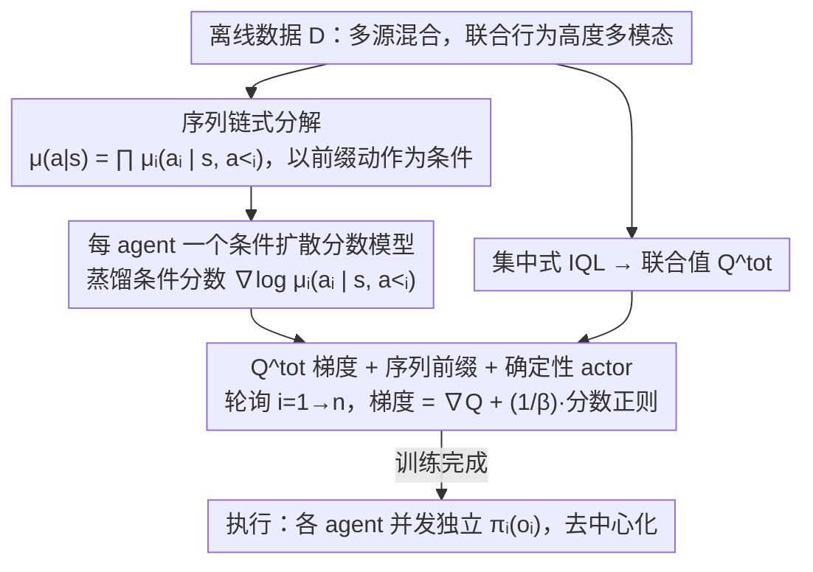

# Offline Multi-agent Reinforcement Learning via Sequential Score Decomposition

**会议**: ICML 2026  
**arXiv**: [2505.05968](https://arxiv.org/abs/2505.05968)  
**代码**: https://github.com/qiaodan-cuhk/OMSD  
**领域**: 多智能体强化学习 / 离线 RL / 扩散模型  
**关键词**: Offline MARL, 行为策略多模态, 序列分解, 扩散分数, CTDE

## 一句话总结
OMSD 用"链式条件分解 + 每个 agent 一个条件扩散模型"取代传统离线 MARL 里"各 agent 独立边缘回归"的行为约束,把每个 agent 的策略沿着前缀 agent 已经选定的动作做条件正则,从而避免多模态联合行为分布下"边缘对齐但联合错位"的 OOD 失配,在 MPE / MaMuJoCo 多个数据集上把平均回报刷到现有 SOTA 的 +33% ~ +74%。

## 研究背景与动机
**领域现状**:在线 MARL 通过反复交互+耦合更新,通常会让所有 agent 收敛到**单一** Nash 均衡,联合行为策略是低熵单模态的;主流离线 MARL 要么走 IGM + 保守值估计(CQL/OMAR/CFCQL/OMIGA),要么走"独立行为正则"或"集中规划器/世界模型"(AlberDICE, MOMA-PPO, MADiff)。

**现有痛点**:离线数据集是从**多个**专家/次优策略混合采来的,联合行为分布 $\mu(\bm{a}|s)$ 本质上是**高度多模态**的(图 1 的双苹果合作采摘任务就是教科书式例子)。但现有方法几乎都默认 $\mu(\bm{a}|s)=\prod_i \mu_i(a_i|s)$,把每个 agent 单独正则到自己的边缘分布。

**核心矛盾**:作者在 Proposition 3.1 (Combinatorial Mode Shift, CMS) 里给出了一个极简反例——$n$ 个 agent 的两模态合作任务 $\bm{a}_1=(1,\dots,1)$, $\bm{a}_2=(0,\dots,0)$,如果对每个 $\hat\mu_i$ 独立学边缘,边缘会收敛到 Uniform({0,1}),重构出的联合分布会摊到 $2^n$ 个模上,与真分布的 TV 距离 $\delta_{TV}=1-2^{1-n}\to 1$。换句话说,"边缘对齐"在多模态下=联合策略**几乎完全错位**到没人采过的 OOD 联合动作上。

**本文目标**:在不显式建模整个联合策略、也不依赖集中规划器的前提下,给每个 agent 提供一个**与联合多模态结构相容**的行为正则方向。

**切入角度**:用概率链式法则把联合行为做**精确**分解 $\mu(\bm{a}|s)=\prod_{i=1}^n \mu_i(a_i|s, a_{<i})$,让每个 agent 的约束以**前缀 agent 已经选定的动作**为条件——这是无偏分解,而不是独立分解的近似。

**核心 idea**:用**每 agent 一个条件扩散模型**蒸馏出条件分数 $\nabla_{a_i}\log\mu_i(a_i|s,a_{<i})$ 当作策略梯度正则项,叠加集中式 $Q^{tot}$ 的动作梯度,实现"序列条件 + 模态感知"的协调正则。

## 方法详解

### 整体框架
OMSD 整体是一个 CTDE 框架下的 actor-critic,但 actor 端的行为约束从"边缘 KL"换成了"序列条件分数正则",并分两阶段离线训练:

1. **预训练阶段**:用 centralized IQL 在离线数据 $\mathcal{D}$ 上学一个联合状态-动作值 $Q^{tot}(s,\bm{a})$;同时为每个 agent $i$ **并行**训练一个条件扩散模型 $\epsilon_i^*(a_i|s, a_{<i}, t)$,其低噪声极限近似条件分数 $-\epsilon_i^*/\sigma_t \approx \nabla_{a_i}\log\mu_i(a_i|s,a_{<i})$。
2. **策略优化阶段**:轮询更新每个 agent 的确定性 actor $\pi_{\theta_i}(s)$。更新 agent $i$ 时,前缀动作 $a_{<i}^{\mathrm{new}}$ 用本轮已更新的 $\{\pi_{j}^{\mathrm{new}}\}_{j<i}$ 现采得到,作为扩散模型的条件;后缀动作只用于估计 $Q^{tot}$ 梯度,不反传。
3. **执行阶段**:所有 agent **并发独立**执行 $\pi_{\theta_i}(o_i)$——序列条件只用于训练时正则,**不破坏**去中心化执行假设。

整套流程的关键就一句:把"独立扩散 + 独立正则"(DOM2 的做法)替换为"沿链式分解的条件扩散 + 条件正则",代价仅是训练时多一次前缀采样。

### 关键设计

**1. 序列链式分解（Sequential Score Decomposition）：把“边缘对齐”换成“前缀条件对齐”，从根上消解 CMS**

现有离线 MARL 几乎都默认联合行为可按 $\mu(\bm{a}|s)=\prod_i\mu_i(a_i|s)$ 拆成各 agent 的边缘，再把每个 agent 单独正则到自己的边缘上。可一旦数据是多专家混合、联合分布多模态，这种边缘分解就出事：Proposition 3.1 给出的 Combinatorial Mode Shift（CMS）反例显示，独立学边缘会让重构的联合分布摊到 $K^n$ 个虚假模、与真分布的 TV 距离趋于 1（推论 3.2 把它从双模态推广到 $K$ 模态）——“边缘对齐”在多模态下等于“联合几乎完全错位”到没人采过的 OOD 联合动作。OMSD 改用概率链式法则做**精确**分解 $\mu(\bm{a}|s)=\prod_{i=1}^n \mu_i(a_i|s, a_{<i})$，让 agent $i$ 的决策以“前缀 agent $1\ldots i-1$ 已选的动作”为条件。这样每个 agent 的 KL 正则项 $D_{\mathrm{KL}}[\pi_{\theta_i}(\cdot|s)\|\mu_i(\cdot|s,a_{<i})]$ 的参考分布天然是“前缀模态下的条件分布”而非被平均掉的边缘，CMS 自然消解。它是**最便宜的无偏修复**：只引入“训练时顺序”这一种序结构，不必显式建模整个 $\mu(\bm{a}|s)$，也不需要集中规划器。

**2. 每 agent 一个条件扩散分数模型：只当分数估计器，不当采样器（沿用 SRPO 风格）**

链式分解里的条件分布 $\mu_i(a_i|s,a_{<i})$ 本身高度多模态，GMM、normalizing flow 这类轻量密度估计器要么 mode collapse、要么 mode coverage 差（附录 D.7.5 有对比）。OMSD 为每个 agent 训练一个 DDPM 式条件扩散模型 $\epsilon_i(a_i^k, k| s, a_{<i})$，损失就是标准去噪损失 $\mathcal{L}_{\text{denoise}}=\mathbb{E}\|\epsilon-\epsilon_i(a_i^k,k|s,a_{<i})\|^2$。关键是它**不**用扩散模型做生成采样——那样执行时要跑几十步去噪、推理成本高还会在低质量数据上累计采样误差（Diff-QL/MADiff 的痛点）；OMSD 沿用 SRPO 思路，只取低噪声极限 $t\to 0$，此时 $-\epsilon_i^*/\sigma_t$ 就近似条件分数 $\nabla_{a_i}\log\mu_i(a_i|s,a_{<i})$，一步前向就给出一个梯度方向直接加进 actor 梯度（见 Eq. (6)）。这样既用扩散模型的表达力吃下多模态，又把推理成本压到与普通策略一样、根本不调用扩散模型。各 agent 的分数模型还**完全可并行**预训练、与 agent 数 $n$ 解耦，论文一直扩到 6-HalfCheetah。

**3. $Q^{tot}$ 梯度 + 序列前缀 + 确定性 actor：把方法落成一条可执行的策略梯度**

有了分数估计器，还要把“往哪走更赚”和“待在数据支持的模态里”合成一个更新方向。OMSD 用集中式 IQL 先学一个联合值 $Q^{tot}(s,\bm{a})$，策略更新按 Eq. (6) 取 $\nabla_{\theta_i}\mathcal{L}^i = \mathbb{E}[\nabla_{a_i}Q_\phi(s,\bm{a}) + \frac{1}{\beta}\cdot(-\epsilon_i^*/\sigma_t)]\nabla_{\theta_i}\pi_{\theta_i}(s)$——前一项是 critic 给的“增益方向”，后一项是条件扩散分数给的“留在模态内”约束，二者相加得到一个**模态内的爬山方向**。每轮按 agent 索引 $i=1\to n$ 滚动更新，agent $i$ 的前缀 $a_{<i}^{\mathrm{new}}$ 用本轮**已更新**的 $\{\pi_j^{\mathrm{new}}\}_{j<i}$ 现采，后缀动作只用于估 $Q^{tot}$ 梯度、不反传——这就把“协调”压进了训练时。actor 之所以取**确定性**（DiLac）而非随机策略，是因为前缀采样的方差会沿链累积，随机 actor 会让条件扩散每次拿到的 $a_{<i}$ 跳来跳去、分数估计噪声爆炸；确定性策略既保住表达力又稳住前缀信号（附录 D.7.1/D.7.4 显示对更新顺序不敏感，说明序列结构是“训练时协调机制”而非强归纳偏置）。执行时所有 agent 并发独立调用 $\pi_{\theta_i}(o_i)$，完全去中心化。

### 损失函数 / 训练策略
- 预训练:`centralized IQL` 学 $Q^{tot}$;每个 agent 独立训练 $\epsilon_i$,损失 = 条件去噪损失 (Eq. 1)。所有扩散模型**完全可并行**,与 agent 数 $n$ 解耦,scalable 到大 team(论文做到 6-HalfCheetah)。
- 策略更新:沿 agent 索引 $i=1\to n$ 滚动更新 $\pi_{\theta_i}$,梯度按 Eq. (6),正则系数 $\beta$ 是关键超参——专家数据用强约束(0.001),random 数据用弱约束(0.3),对 $\beta$ 大范围扫描相对稳定(Fig. 4(b))。
- 执行:每个 agent 独立调用 $\pi_{\theta_i}(o_i)$,**不调用**扩散模型,不依赖任何集中通信。

## 实验关键数据

### 主实验

| 数据集(MPE) | 指标(归一化分数) | 之前 SOTA | OMSD | 提升 |
|---|---|---|---|---|
| Cooperative Navigation - Random | normalized | 62.2 (CFCQL) | **69.8** | +12.1% |
| Predator Prey - Medium | normalized | 83.9 (DoF-P) | **137.1** | +63.0% |
| Predator Prey - Random | normalized | 78.5 (CFCQL) | **133.9** | +70.6% |
| World - Random | normalized | 68 (CFCQL) | **141.1** | +107.5% |
| MPE 平均 | normalized | 87.3 (CFCQL) | **126.7** | +33.2% |

| 数据集(MaMuJoCo / OMIGA) | 之前 SOTA | OMSD | 提升 |
|---|---|---|---|
| 3-Hopper - Expert | 859.6 (OMIGA) | **3595** | +329% |
| 3-Hopper - Medium-Expert | 709.0 (OMIGA) | **3568** | +403% |
| 3-Hopper - Medium | 1189.3 (OMIGA) | **3360** | +183% |
| 6-HalfCheetah - Medium-Replay | 2504.7 (OMIGA) | **4582** | +83% |
| OMIGA 平均 | 1954.7 | **3400** | +73.9% |

关键观察:**多模态越严重的数据集(Medium / Medium-Replay / Random),OMSD 提升越大**;在 Expert(本身接近单模态)上提升相对较小,这正好佐证了"CMS 才是要解决的真问题"。

### 消融实验

| 配置 | MPE 平均 / 现象 | 说明 |
|---|---|---|
| BRPO-IND(独立学习 + 独立 KL) | 在 2-agent bandit 上经常陷入 $[1,-1]$/$[-1,1]$ OOD 联合动作,得分 $0\pm 1$ | CMS 在最小例子上就翻车 |
| BRPO-CTDE(集中 critic + 独立 KL) | 同样 $0\pm 1$ | 集中 critic 救不了边缘正则 |
| BRPO-JAL(联合动作学习,oracle) | $1\pm 0$ | 上界 |
| **OMSD** | **$1\pm 0$**(高维任务上全面 SOTA) | 单 agent 看链式条件,匹配 JAL 上界 |
| OMSD w/ 不同更新顺序(OMIGA Hopper) | 性能差异不显著 | 序列结构是训练协调机制,不是强归纳偏置 |
| 分数估计器:GMM / Normalizing Flow vs 扩散 | 扩散显著优于轻量密度估计器(附录 D.7.5) | 多模态下扩散模型的 mode coverage 是必要的 |
| $\beta$ 扫描(Fig. 4(b)) | 专家集偏好 $\beta=0.001$,random 集偏好 $\beta=0.3$,大范围稳定 | 行为约束强度与数据质量耦合 |

### 关键发现
- **CMS 的"严重程度随 agent 数指数放大"是个实证可见的现象**:bandit 上 BRPO-IND 直接挂掉;高维任务上独立扩散 actor (DOM2 思路) 在 medium / random 数据集上明显被 OMSD 拉开几十个点,正是因为 $K^n$ 虚假模带来的 OOD 联合动作。
- **OMSD 在低质量数据上反而提升最猛**(World Random +107.5%,OMIGA Hopper +183~403%),原因是低质量数据多模态更明显(图 1d),CMS 损失最大、修复价值最大。
- **失败案例的诊断很诚实**:作者明说在 2-Ant Good / 4-Ant Good 等任务上略输于 MADiff,原因不是分解错而是**预训练 critic 不够强**——扩散模型能把模态对齐,但 critic 给不出足够的提升方向。
- **t-SNE 可视化(Fig. 4(c))**显示 OMSD 学到的 (s,a) 一直贴着数据集支持的高奖励区域演化,而独立正则方法会飘到数据稀疏区。
- **可扩展性**:扩散模型预训练完全 agent-parallel,序列依赖只在策略更新时通过前缀动作出现,**执行时仍并发**——6-agent HalfCheetah 跑得通就是证据。

## 亮点与洞察
- **把"独立分解"这个一直被默默接受的假设掀掉,并给了一个 closed-form 反例(Prop 3.1)**:论文最大的贡献不在算法,而在把"为什么 offline MARL 比 online 难"归因到"在线对称破缺收敛单模 vs 离线多源混合多模"这个数据分布层面的根因——这个角度在以前的工作里基本是缺失的,可以直接迁移去诊断 offline multi-agent IL / offline 多车协同 / offline 多机械臂等任务。
- **"用扩散模型当分数估计器而非生成器"是个很可复用的工程范式**:推理成本 = 1 次前向,完全规避了扩散 actor 的慢推理+采样误差累积问题,适合任何"想用扩散建模复杂分布但不想付生成成本"的场景(offline IL、模型ベース RL prior、行为克隆正则等)。
- **链式分解 + 训练时序、执行时并发**:把"协调"完全压进训练阶段,执行端保持 CTDE 的纯净性。这种"训练序、执行并"的解耦思路也可以套到 offline multi-agent imitation、coordinated diffusion planning 等问题上。
- **$\beta$ 与数据质量的反相关**(专家强约束、随机弱约束)给出了一个简单可操作的调参直觉,这一观察对所有 BRPO 类方法都适用。

## 局限与展望
- **更新顺序的鲁棒性只在小规模任务上验证过**(OMIGA Hopper),agent 数远大于 6 时是否真的"序无所谓"还需要更大规模实验,真极端情况下排错顺序可能放大前缀采样方差。
- **依赖确定性 actor (DiLac)**:论文承认随机策略会让 prefix 噪声沿链累加,但确定性 actor 在某些需要探索性 stochastic policy 的任务(如部分可观博弈)上可能受限。
- **依赖 IQL critic 的质量**:Sec. 4.2 已经诚实指出在部分 MaMuJoCo Good 数据集上输 MADiff 的根因是 critic 弱——这意味着 OMSD 把"模态对齐"做到了上限,但"提升幅度"依赖一个额外组件,真正想突破需要同步升级 critic。
- **链式条件意味着 agent 之间有隐式"角色不对称"**:虽然实验显示对顺序不敏感,但当 agent 异质性大时,前缀 agent 实际承担了更强的"先验设定者"角色,理论性质尚未充分分析。
- **改进思路**:(a) 用 importance-weighted 多顺序集成代替单链顺序,显式去掉序结构;(b) 把 $Q^{tot}$ 也换成扩散 critic,联合升级方向估计;(c) 推广到部分可观 / 异步执行场景。

## 相关工作与启发
- **vs AlberDICE / OMIGA / CFCQL**(独立正则 + 保守值类):本文从根上指出它们都吃了 CMS 的亏——再保守的 critic 也救不了"边缘对齐 → 联合错位"的方向性错误;OMSD 不动 critic,只换正则参考分布就拿到大幅提升,说明在 offline MARL 里"约束方向的正确性"比"约束强度"更重要。
- **vs MOMA-PPO / MADiff-C**(集中规划器 / 世界模型类):那条路要建联合策略或环境模型,推理时还要跑规划器,在低质量数据上易累计采样误差;OMSD 完全不建联合模型也不规划,只用"链式条件 + 分数蒸馏",推理成本与单 agent 策略一样。
- **vs DOM2 / MADiff-D**(独立扩散 actor):它们都假设独立分解 + 扩散建模边缘,本质上还是 CMS 受害者;OMSD 沿同一条扩散路线但把分解改成链式条件,直接吃掉它们在 medium/random 数据集上的差距。
- **vs SRPO (single-agent)**:OMSD 可以看作 SRPO 的多智能体扩展——继承"扩散模型当分数估计器+SRPO 风格策略梯度"的思路,把单 agent 的 $\nabla\log\mu(a|s)$ 推广为 multi-agent 的链式 $\nabla\log\mu_i(a_i|s,a_{<i})$;这种"把 single-agent offline RL 的工具用对的分解推到 multi-agent"是一种值得复用的范式。

## 评分
- 新颖性: ⭐⭐⭐⭐ "用链式分解修复 CMS"虽然不算技术上多么复杂的发明,但把问题诊断、反例构造、扩散分数应用三件事打通到一个干净的方法,在 offline MARL 这个被独立分解垄断的领域里是清新的切入。
- 实验充分度: ⭐⭐⭐⭐ MPE + MaMuJoCo(OMAR/OG-MARL/OMIGA)三套基准 + bandit 玩具例子 + 顺序鲁棒性 / 密度估计器 / $\beta$ 敏感性 / t-SNE 可视化,覆盖比较全;敢报负例(Expert MaMuJoCo 上输 MADiff 并诊断原因)更难得。
- 写作质量: ⭐⭐⭐⭐ Prop 3.1 给的 CMS closed-form 很有教学价值,图 1/2 把"为什么离线多模态"和"为什么独立正则错"讲得很清楚;不过方法 3.3 节的公式推导有点跳,需要对照附录 H 才能完全跟上。
- 价值: ⭐⭐⭐⭐ 给 offline MARL 提供了一个"理论诊断 + 即插即用修复"的范式,代码也开源(github.com/qiaodan-cuhk/OMSD),对所有还在用独立行为正则的方法都是一个直接可对比 / 可替换的 baseline。

<!-- RELATED:START -->

## 相关论文

- [\[AAAI 2026\] Conditional Diffusion Model for Multi-Agent Dynamic Task Decomposition](../../AAAI2026/image_generation/conditional_diffusion_model_for_multi-agent_dynamic_task_dec.md)
- [\[CVPR 2026\] Towards Robust Sequential Decomposition for Complex Image Editing](../../CVPR2026/image_generation/towards_robust_sequential_decomposition_for_complex_image_editing.md)
- [\[ICLR 2026\] Flow Matching with Injected Noise for Offline-to-Online Reinforcement Learning](../../ICLR2026/image_generation/flow_matching_with_injected_noise_for_offline-to-online_reinforcement_learning.md)
- [\[ICML 2026\] Path-Coupled Bellman Flows for Distributional Reinforcement Learning](path-coupled_bellman_flows_for_distributional_reinforcement_learning.md)
- [\[ICML 2026\] CoCoEdit: Content-Consistent Image Editing via Region Regularized Reinforcement Learning](cocoedit_content-consistent_image_editing_via_region_regularized_reinforcement_l.md)

<!-- RELATED:END -->
