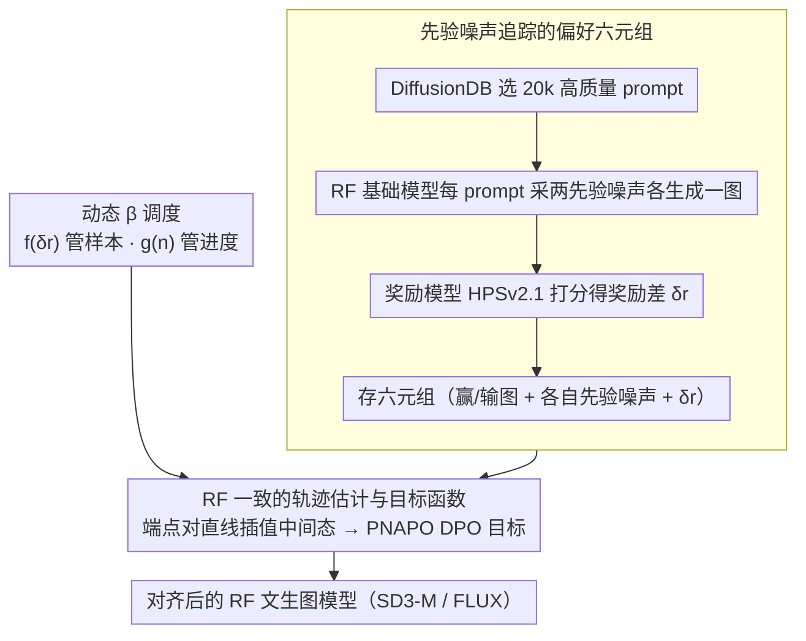

# Offline Preference Optimization for Rectified Flow with Noise-Tracked Pairs

**会议**: ICML 2026  
**arXiv**: [2605.09433](https://arxiv.org/abs/2605.09433)  
**代码**: 无（论文未公开仓库链接）  
**领域**: 对齐 RLHF / 扩散模型 / 文生图  
**关键词**: Rectified Flow、Diffusion-DPO、偏好优化、先验噪声、动态正则

## 一句话总结
本文针对 rectified flow（RF）类文生图模型，提出 PNAPO——一种把"生成时用的先验噪声"和"赢者/输者图片"一起保存为六元组的离线偏好优化框架，配合 RF 直线轨迹假设做轨迹估计和动态正则系数调度，相比 Diffusion-DPO 在 SD3-M/FLUX 上同时提点又把训练算力降到 1/12。

## 研究背景与动机

**领域现状**：文生图（T2I）后训练对齐的主流做法是收集 (prompt, winner, loser) 三元组偏好数据，然后用 RL（DDPO、DPOK）或者 RL-free 的 DPO 风格目标（Diffusion-DPO、D3PO 等）让生成器更倾向赢者。RL-free 因为稳定简单更受欢迎。

**现有痛点**：现有偏好数据集（Pick-a-Pic、HPDv2、ImageReward 等）只保存最终图像，丢掉了"生成这张图所用的先验噪声"——但扩散/流模型的生成本质上是从某个特定噪声出发的轨迹过程。Diffusion-DPO 等方法只能用独立采样的前向噪声去近似反向轨迹，对真正的反向动力学是错配的，导致训练不稳定、信用分配低效。

**核心矛盾**：在标准扩散模型里反向轨迹是随机且弯曲的，给定端点采样精确反向路径是不可解的。但 RF 不一样——RF 的训练目标本来就是把数据-噪声耦合"拉直"成接近直线的轨迹，先验噪声直接决定了一条轨迹。所以"丢弃先验噪声"在 RF 上是一个比在普通扩散模型上更严重的损失。

**本文目标**：（1）让偏好数据保留先验噪声；（2）设计与 RF 几何一致的 DPO 风格目标；（3）解决 DPO 训练后期固定 $\beta$ 导致更新过弱、对所有样本一视同仁的两个老问题。

**切入角度**：作者观察到 RF 的关键性质：$\boldsymbol{x}_t = (1-t)\boldsymbol{x}_0 + t\boldsymbol{x}_T$ 是端点之间的直线插值。如果数据集里同时存有 $\boldsymbol{x}_0$ 和 $\boldsymbol{x}_T$，那么中间状态可以直接由插值估计，根本不需要额外加噪。这把不可解的反向采样降级成一次线性插值，方差骤减。

**核心 idea**：把偏好三元组扩展为六元组 $(\boldsymbol{c}, \boldsymbol{x}_0^w, \boldsymbol{x}_0^l, \boldsymbol{x}_T^w, \boldsymbol{x}_T^l)$ 并加一个连续奖励差 $\delta r$，用 RF 直线插值估中间状态，加上由奖励差和训练步数共同调度的动态 $\beta$。

## 方法详解

### 整体框架
PNAPO 要解决的是 Diffusion-DPO 在 RF 上"丢掉先验噪声、只能拿独立采样的噪声近似反向轨迹"这一方差源头。它把这件事拆成一条离线、off-policy 的 RL-free 管线：先用 RF 基础模型给每个 prompt 采两个先验噪声、各生成一张图、再用奖励模型打分，存成保留噪声的六元组；训练时不再重采样，而是借 RF 的直线轨迹性质从存好的端点对插值出中间态，喂进一个与 RF 几何一致的 DPO 风格目标，并配上随奖励差和训练进度自动调节的动态 $\beta$。

### 关键设计

**1. 先验噪声追踪的偏好六元组：把噪声一起存下来**

现有偏好数据集（Pick-a-Pic、HPDv2 等）只留最终图像，逼着 DPO 从独立的 $\boldsymbol{x}_T^* \sim \mathcal{N}(0, I)$ 重采样去估反向过程，引入了与训练实际不匹配的方差。PNAPO 把传统三元组 $(\boldsymbol{c}, \boldsymbol{x}_0^w, \boldsymbol{x}_0^l)$ 扩展为六元组 $(\boldsymbol{c}, \boldsymbol{x}_0^w, \boldsymbol{x}_0^l, \boldsymbol{x}_T^w, \boldsymbol{x}_T^l)$，外加连续奖励差 $\delta r$。数据构造上用 DiffusionDB 选 20k 高质量 prompt（NSFW 过滤 → Jaccard/CLIP 去重 → 100 KNN 聚类重采样），每个 prompt 用 RF 基础模型自己采两次噪声生成两张图（off-policy 但同模型族，保证噪声和策略一致），再用 HPSv2.1 评分得到 $\delta r = r_\theta(\boldsymbol{x}_0^w) - r_\theta(\boldsymbol{x}_0^l)$。把噪声存下来等价于显式保留了 $p_\theta(\boldsymbol{x}_T^* | \boldsymbol{x}_0^*)$，从而把决策空间从"所有可能轨迹"缩小到"实际产生这张图的那条轨迹"，方差骤减——这正是后面理论保证和 12× 提速的来源。

**2. RF 一致的轨迹估计与目标函数：用直线插值替代反向采样**

直接对反向轨迹 $p_\theta(\boldsymbol{x}_{1:T-1} | \boldsymbol{x}_0)$ 建模是不可解的，PNAPO 改用 $p_\theta(\boldsymbol{x}_T | \boldsymbol{x}_0) q(\boldsymbol{x}_{1:T-1} | \boldsymbol{x}_0, \boldsymbol{x}_T)$ 近似，并形式化证明 $D_{KL}(p_\theta(\boldsymbol{x}_T|\boldsymbol{x}_0) q(\boldsymbol{x}_{1:T-1}|\boldsymbol{x}_0, \boldsymbol{x}_T) \| p_\theta(\boldsymbol{x}_{1:T}|\boldsymbol{x}_0)) \leq D_{KL}(q(\boldsymbol{x}_{1:T}|\boldsymbol{x}_0) \| p_\theta(\boldsymbol{x}_{1:T}|\boldsymbol{x}_0))$，即这个近似在 RF 上严格紧于 Diffusion-DPO 的前向加噪近似。关键之所以成立，是因为 RF 的中间态本就是端点的直线插值 $\boldsymbol{x}_t^* = (1-t)\boldsymbol{x}_0^* + t\boldsymbol{x}_T^*$，存好端点对后中间态一次插值即得，无需任何重采样。经 Jensen 不等式和 KL 分解，损失落成 $\mathcal{L}_{\text{PNAPO}}(\theta) = -\mathbb{E}_{(\boldsymbol{c}, \boldsymbol{x}_0^w, \boldsymbol{x}_0^l, \boldsymbol{x}_T^w, \boldsymbol{x}_T^l), t} \log \sigma(-\beta(\boldsymbol{s}_\theta^t(\boldsymbol{x}_0^w, \boldsymbol{x}_T^w, \boldsymbol{c}) - \boldsymbol{s}_\theta^t(\boldsymbol{x}_0^l, \boldsymbol{x}_T^l, \boldsymbol{c})))$，其中 $\boldsymbol{s}_\theta^t(\boldsymbol{x}_0^*, \boldsymbol{x}_T^*, \boldsymbol{c}) = \|(\boldsymbol{x}_T^* - \boldsymbol{x}_0^*) - v_\theta(\boldsymbol{x}_t^*, t, \boldsymbol{c})\|^2_2 - \|(\boldsymbol{x}_T^* - \boldsymbol{x}_0^*) - v_{\text{ref}}(\boldsymbol{x}_t^*, t, \boldsymbol{c})\|^2_2$。直观上它就是让速度场 $v_\theta$ 在赢者轨迹上比冻结的参考模型 $v_{\text{ref}}$ 更准、在输者轨迹上比 ref 更差；类比 RL 里的稀疏奖励，决策空间一旦收窄，梯度方差随之下降、训练随之加速。

**3. 基于奖励差和训练进度的动态 $\beta$ 调度：让正则强度随样本和阶段自适应**

对 $\nabla_\theta \mathcal{L}_{\text{PNAPO}}$ 做梯度分解后会发现固定 $\beta$ 有两个老毛病：对所有图对无差别加权（忽略难度），且训练后期强正则又把模型硬拉回 ref。PNAPO 把 $\beta$ 改成 $\beta(\delta r, n) = \beta \cdot f(\delta r) \cdot g(n)$ 两个解耦因子。其中样本控制器 $f(\delta r) = 2\sigma(\delta r) - 1$ 单调递增到 1，让奖励差大的对子（"明显更好"）权重更大；退火因子 $g(n)$ 管训练进度——前 $n_1$ 步保持 1，$n_1$ 到 $n_2$ 之间按余弦下降到 $1/2$，之后保持 $1/2$，让后期允许更多偏离 ref。两者配合的效果是：margin 为负时抬高 $\beta$ 加速对齐，margin 转正后给出更柔和的更新。

### 损失函数 / 训练策略
核心损失就是上面的 PNAPO 目标函数。优化器 AdamW，学习率 $1\mathrm{e}{-6}$；FLUX 的 $\beta=2000$，SD3-M 的 $\beta=5000$。数据为 20k prompt × 每 prompt 2 图，采样用 Euler 离散调度器、50 步、guidance scale=1，训练在 8× NVIDIA H800 GPU 上完成。

## 实验关键数据

### 主实验
基线包括原模型、SFT、Diffusion-DPO、IPO、CaPO，全部用相同超参数和模型配置复现以保证公平。在 HPDv2（3200 prompt）和 OPDv1（7459 prompt）上评 PickScore、HPSv2.1、ImageReward、LAION Aesthetic、CLIP；在 GenEval 评对象生成对齐。

| 测试集 / 模型 | 指标 | 原模型 | DPO | PNAPO | 提升 |
|--------------|------|--------|-----|-------|------|
| OPDv1 SD3-M | HPSv2.1 | 31.96 | 32.39 | 33.09 | +1.13 (vs base) |
| OPDv1 FLUX | HPSv2.1 | 30.74 | 30.79 | 32.10 | +1.36 (vs base) |
| OPDv1 FLUX | ImageReward | 1.202 | 1.209 | 1.238 | +0.036 |
| OPDv1 FLUX | Aesthetic | 6.550 | 6.548 | 6.692 | +0.142 |
| GenEval SD3-M | Overall | 0.68 | — | 0.73 | +7.4% 相对 |
| GenEval FLUX | Overall | 0.65 | 0.66 | 0.69 | +6.2% 相对 |
| HPSv2.1 胜率 FLUX | PNAPO vs DPO | — | — | 84.6% | — |

### 消融实验
训练算力对比（NVIDIA H800 GPU-Hours）：

| 模型 | Diffusion-DPO | PNAPO | 节省 |
|------|--------------|-------|------|
| SD3-M | ~249.6 | ~20.8 | 12× |
| FLUX | ~422.4 | ~35.2 | 12× |

用户研究（10 名参与者，20 对图，PNAPO-FLUX vs baselines）：

| 评估维度 | PNAPO 偏好率 |
|---------|------------|
| 整体偏好 | 56% |
| 视觉吸引力 | 72% |
| 文本-图像对齐 | 52% |

### 关键发现
- **质量与算力双赢**：在所有指标都超过 Diffusion-DPO 的同时把 GPU 时间砍到 1/12，验证了"轨迹估计变紧"直接带来的训练效率提升。
- **背景模糊问题被缓解**：FLUX 标志性的背景模糊瑕疵在 PNAPO 下显著减少，质化结果显示文字渲染和构图也变好。
- **跨架构泛化**：在 RF 家族两个不同骨架（SD3-M / FLUX）上一致提升，说明方法依赖的是 RF 几何性质而不是特定模型。
- **CLIP 文本-图像对齐**：FLUX 上从 35.97 提到 36.89，证明动态 $\beta$ 没有牺牲文本对齐去换美学。

## 亮点与洞察
- **从"丢弃噪声"到"追踪噪声"的范式翻转**：以前的偏好数据集都只存图，本文指出对 RF 而言噪声是轨迹身份的一部分——这是一个被长期忽视的"免费午餐"，只要在数据构造阶段额外存一份噪声 tensor 就能拿到 12× 算力节省，性价比极高。
- **几何一致的近似带来理论保证**：作者用 KL 链式不等式严格证明 PNAPO 的轨迹近似比 Diffusion-DPO 更紧，把"更好"从经验观察提升到理论结果，少见的扎实。
- **动态 $\beta$ 的两个相互独立的因子设计**：$f(\delta r)$ 管样本难度，$g(n)$ 管训练进度，解耦得很干净，可以独立组合到其他 DPO 变体上（D3PO、IPO、Diffusion-KTO 都能套）。
- **离线 RL-free 的工程友好性**：相比 GRPO 类在线 RL 方法，PNAPO 只需要采一次数据然后稳定离线训练，对生产环境算力/调度限制更友好。

## 局限与展望
- **依赖奖励模型**：用 HPSv2.1 当伪人类标注，奖励模型本身的偏见和盲点会被放大；论文没讨论 reward hacking 风险。
- **只覆盖 RF 类模型**：核心机制（直线插值）严格依赖 RF 的轨迹直线性，对纯 DDPM/DDIM 不能直接迁移；作者也明确把适用范围限定在 RF。
- **数据规模较小**：20k prompt 在 T2I 偏好数据集里偏少，规模化到 100k+ 时动态 $\beta$ 调度是否仍然稳定还需要验证。
- **没有与在线 RL 比对**：论文定位为 RL-free 的补充方案，但缺少和 GRPO 系列方法的同算力公平对比，离线/在线收益的真实差距没量化。
- **超参 $n_1, n_2$ 需手调**：余弦退火的两个阈值靠经验设置，不同模型/数据集需要重新调，没有自适应方案。

## 相关工作与启发
- **vs Diffusion-DPO (Wallace 2024)**：核心思路类似但用前向加噪近似反向轨迹；PNAPO 在 RF 上证明轨迹近似更紧、训练快 12×，且明确利用 RF 几何。
- **vs D3PO (Yang 2024)**：D3PO 用迭代反向过程估计每步偏好，计算昂贵；PNAPO 用插值跳过反向过程，效率更高。
- **vs SPO / InPO / SmPO**：这些方法在去噪全程对齐偏好，需要 DDIM Inversion；PNAPO 端到端直接用存储的噪声，工程更简单。
- **vs Diffusion-NPO / Self-NPO**：从 CFG 角度训"负样本模型"做引导；PNAPO 是正面更新，思路互补，可以结合。
- **vs GRPO 系列（在线 RL）**：高对齐但需大量在线采样和细调；PNAPO 走"采一次离线训练"路线，在算力/工程约束下更实用。

## 评分
- 新颖性: ⭐⭐⭐⭐⭐ "存噪声"这个数据结构改动看起来简单，但配合 RF 几何分析直击 Diffusion-DPO 的方差源头，思路漂亮。
- 实验充分度: ⭐⭐⭐⭐ 双模型两数据集多指标 + 用户研究 + GPU-Hours 对比，唯一缺失是与在线 RL 方法的对比和大规模数据验证。
- 写作质量: ⭐⭐⭐⭐ 推导清楚，从动机到目标函数到动态 $\beta$ 一气呵成，公式记号略密。
- 价值: ⭐⭐⭐⭐⭐ 对 RF 类 T2I 后训练是即插即用且节省一个数量级算力的方法，工程价值大。

<!-- RELATED:START -->

## 相关论文

- [\[ICCV 2025\] Straighten Viscous Rectified Flow via Noise Optimization](../../ICCV2025/image_generation/straighten_viscous_rectified_flow_via_noise_optimization.md)
- [\[ICML 2026\] E²PO: Embedding-perturbed Exploration Preference Optimization for Flow Models](embedding-perturbed_exploration_preference_optimization_for_flow_models.md)
- [\[ICML 2026\] Support-Proximity Augmented Diffusion Estimation for Offline Black-Box Optimization](support-proximity_augmented_diffusion_estimation_for_offline_black-box_optimizat.md)
- [\[ICLR 2026\] Flow Matching with Injected Noise for Offline-to-Online Reinforcement Learning](../../ICLR2026/image_generation/flow_matching_with_injected_noise_for_offline-to-online_reinforcement_learning.md)
- [\[NeurIPS 2025\] Diffusion Model as a Noise-Aware Latent Reward Model for Step-Level Preference Optimization](../../NeurIPS2025/image_generation/diffusion_model_as_a_noiseaware_latent_reward_model_for_step.md)

<!-- RELATED:END -->
