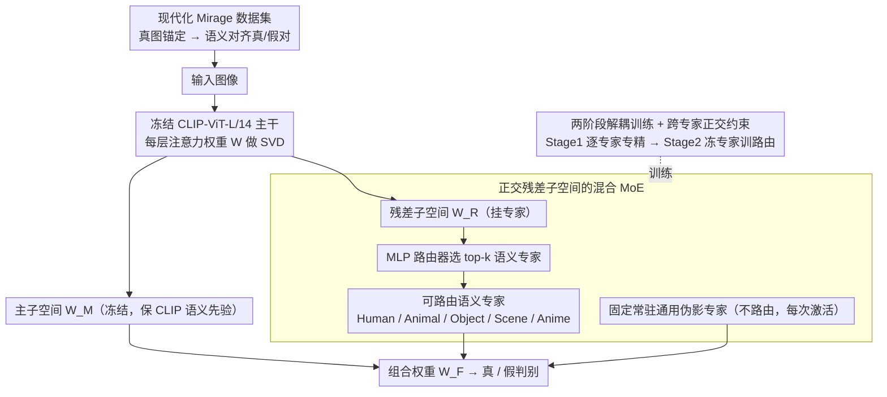

# OmniAID: Decoupling Semantic and Artifacts for Universal AI-Generated Image Detection in the Wild

**会议**: ICML 2026  
**arXiv**: [2511.08423](https://arxiv.org/abs/2511.08423)  
**代码**: https://github.com/yunncheng/OmniAID  
**领域**: AI 安全 / AIGC 检测 / 多专家模型  
**关键词**: AIGI 检测, MoE, 语义-伪影解耦, SVD 残差子空间, Mirage 数据集

## 一句话总结
OmniAID 用一个"语义专家 + 通用伪影专家"的解耦 MoE 架构，在 CLIP-ViT 注意力权重 SVD 出的低秩残差子空间里分别学习"画了什么会露馅"和"怎么画都会露馅"两类伪造线索，再配上新的现代化数据集 Mirage，在 GenImage / Chameleon / Mirage-Test 三套基准上把通用 AIGI 检测平均准确率推到 95.9% / 91.4% / 88.4%。

## 研究背景与动机
**领域现状**：当前 AI 生成图像（AIGI）检测主要分两条路。一条是 artifact-specific 路线，用频域滤波、上采样指纹等手工特征捕捉特定生成器的低层痕迹；另一条是当下主导的 VFM-based 路线，借 CLIP / DINOv2 这类视觉基础模型的强语义先验，通过 LoRA、SVD 残差微调（Effort）或类别原型注入（C2P-CLIP）来获得跨生成器的泛化能力。

**现有痛点**：作者指出两条路线都受困于两个瓶颈。第一，**单一纠缠表征**——所有 SOTA 把"语义层的内容相关瑕疵（畸形人脸、违背物理的建筑）"和"内容无关的通用伪影（生成器频域指纹、VAE 重建痕迹）"压进同一个特征空间，结果在 Animal 上训出来的检测器到 Scene 上掉得很厉害（论文 Fig 2a/b 验证）。第二，**基准老旧**——GenImage 等数据集主要来自 GAN 和早期 Stable Diffusion，训出来的模型在 Chameleon 这种 in-the-wild 集上几乎崩溃（Fake 准确率近 0）。

**核心矛盾**：VFM 的预训练目标是通用语义理解，并不天然倾向"伪造证据"；同时数据混合训练又把语义瑕疵和低层伪影耦合在一起，使得模型在跨域时必然要做妥协——要么对训练域内的语义模式过拟合，要么对单一生成器的伪影过拟合。

**本文目标**：把两类证据**显式解耦**——(i) 不同语义域之间的瑕疵互相独立；(ii) 内容相关的语义瑕疵与内容无关的通用伪影互相独立。同时配套提出符合 2025 年生成器分布的新基准。

**切入角度**：作者从两个观察出发。一是"内容无关的伪影"在所有图像上都存在，应该有一个**始终激活**的专家来管；而"内容相关的瑕疵"高度依赖领域，应该由**可路由的多个领域专家**分别学习。二是在 SVD 出的低秩残差子空间里训练专家，既能保持 CLIP 主成分先验，又能通过 orthogonality 约束让不同专家分配到不同方向，天然支持解耦。

**核心 idea**：用一个 "Routable Semantic Experts + Fixed Universal Artifact Expert" 的混合 MoE，把 "what is generated" 和 "how it is generated" 拆到不同子空间里学。

## 方法详解

### 整体框架
OmniAID 要解决的是"伪造证据被压进同一个特征空间、跨域就崩"的问题，做法是把"画了什么会露馅"和"怎么画都会露馅"两类线索拆到不同的低秩子空间里学。主干用冻结的 CLIP-ViT-L/14@336px，对每个注意力层权重 $\mathbf{W}\in\mathbb{R}^{d_{out}\times d_{in}}$ 先做 SVD 切成两块——$\mathbf{W}_M=\mathbf{U}_{:d-r}\mathbf{\Sigma}_{:d-r}\mathbf{V}_{:d-r}^{T}$ 是冻结的"主子空间"，保住 CLIP 的预训练语义先验；$\mathbf{W}_R=\mathbf{U}_{d-r:}\mathbf{\Sigma}_{d-r:}\mathbf{V}_{d-r:}^{T}$ 是用来塞专家的"残差子空间"。残差里挂两类专家：$N_S$ 个可路由的语义专家 $\mathcal{E}_S=\{e_1,\dots,e_{N_S}\}$（Human / Animal / Object / Scene / Anime）和一个固定常驻的通用伪影专家 $\mathcal{E}_U$。前向时，一个独立冻结的 CLIP 编码器把图像特征喂给轻量 MLP 路由器 $\mathcal{R}$，选出 top-$k_S$ 个语义专家，最终层权重组合成 $\mathbf{W}_F=\mathbf{W}_M+\mathbf{W}_{R,U}+\sum_{i\in S}g_i\cdot\mathbf{W}_{R,i}$，门控权重 $g_i=\mathrm{Softmax}(\mathbf{z}_\mathbf{x})_i$，其中伪影专家 $\mathbf{W}_{R,U}$ 不参与路由竞争、每次前向都激活。整体训练分两阶段：先逐个专家专精化、再冻结专家单训路由。

### 关键设计

**1. 正交残差子空间的混合 MoE：用一个固定专家管伪影、多个可路由专家管语义**

这一设计直接针对"单一纠缠表征"的痛点——SOTA 把内容相关的语义瑕疵和内容无关的通用伪影压进同一空间，导致 Animal 上训的检测器到 Scene 上就掉。OmniAID 让所有专家都只占据 $\mathbf{W}_R$ 这块由 SVD 最小若干奇异成分张成的残差子空间，既不破坏 $\mathbf{W}_M$ 里的 CLIP 先验，又能塞下多路证据。其中语义专家用领域专属数据训练（如全 Human 图像），学的是"这类内容长歪了会是什么样"；通用伪影专家则用语义对齐的真/重建图像对训练（COCO 真图配 SDv1.x–SD3.5、TAESD、TAESDXL 等多种 VAE 的重建版），学的是"任何 VAE 都会留下的低层痕迹"。把伪影专家固定常驻、语义专家按需路由，结构上就承认了两类证据本质不同——伪影信号永远有人接，而不同语义域不会被一个空间一锅炖。

**2. 两阶段解耦训练 + 跨专家正交约束：逼每个专家学到互补、不重叠的证据**

光把专家塞进同一残差还不够，还得保证它们不学到同一套东西，这就靠两阶段训练里的正交约束。Stage 1 一次只激活一个专家 $e_a$、其余冻结，目标是 $\mathcal{L}_{\text{Stage1}}=\mathcal{L}_{\text{cls}}+\lambda_1\mathcal{L}_{\text{orth}}$，其中正交损失 $\mathcal{L}_{\text{orth}}=\sum_{j\in\mathcal{I}_{\text{prev}}}(\|\mathbf{U}_i^T\mathbf{U}_j\|_F^2+\|\mathbf{V}_i^T\mathbf{V}_j\|_F^2)$，索引集 $\mathcal{I}_{\text{prev}}=\{M\}\cup\{0,\dots,i-1\}$——也就是同时约束新专家与主子空间**以及所有此前训过的专家**都正交；每训完一个专家就重置分类头，避免头部记忆污染下一个。相比 Effort 只让适配器对主子空间正交，这里把正交边界一路推到"所有此前的语义专家"，正是"语义解耦"的硬约束。Stage 2 则冻结全部专家、只训路由器和新分类头，目标 $\mathcal{L}_{\text{Stage2}}=\mathcal{L}_{\text{cls}}+\lambda_2\mathcal{L}_{\text{gating}}+\lambda_3\mathcal{L}_{\text{balance}}$，其中 $\mathcal{L}_{\text{gating}}$ 用真实领域标签 $y_e$ 监督路由器输出尖锐分布，$\mathcal{L}_{\text{balance}}=N_S\sum_i \mathcal{F}_i\cdot \mathbf{P}_i$ 是 Switch Transformer 风格的负载均衡。之所以把"专家专精"和"路由学习"拆成两阶段，是因为联合训练时路由很容易把所有样本丢给学得最快的专家，而那个专家又会被倾斜过来的样本污染，两者互相败坏。

**3. 现代化 Mirage 数据集 + 锚定式合成管线：用数据构造补上模型做不到的语义不变性**

旧基准（GenImage 用 2022 年模型、DRCT-2M 用 2023 年）已经反映不了 2025 年生成器的水平，于是作者重做了 Mirage。Mirage-Train 含 933K 真 / 1674K 假、覆盖 Human / Animal / Object / Scene / Anime 五类，假图由 SD3.5 / Flux.1 / 商业闭源 API 等 SOTA T2I 生成；Mirage-Test 则用 22K 真 / 28K 假，假图来自 held-out 且为真实感专门微调（LoRA / 私有数据）的生成器，刻意把难度拉高。最关键的是合成管线用了"real-image-anchored prompting"——先用 LMM 给每张真图标注内容描述和粗粒度标签，再拿这段描述去喂多个 T2I 生成器，强制真假图在语义上对齐，从而堵死"靠内容差异判真假"的捷径。这和通用伪影专家所需的"语义对齐真假对"是同一思路：只有把语义变量控制住，才能逼模型真正去学低层伪影而不是抄语义答案。

### 损失函数 / 训练策略
- Stage 1：$\mathcal{L}_{\text{cls}}+\lambda_1\mathcal{L}_{\text{orth}}$，逐专家训练，每次只解冻当前专家的 $\mathbf{U}_{d-r:},\mathbf{\Sigma}_{d-r:},\mathbf{V}_{d-r:}$ 和分类头。
- Stage 2：$\mathcal{L}_{\text{cls}}+\lambda_2\mathcal{L}_{\text{gating}}+\lambda_3\mathcal{L}_{\text{balance}}$，冻结所有专家、只训路由器与新分类头。
- 训练配置：AdamW，$lr=2\times 10^{-4}$，batch 32，每阶段 1 epoch，4× H200；GenImage-SDv1.4 训 3 小时、Mirage 训 18 小时；GenImage 上因类目稀疏把专家合并成 Human/Animal + Object/Scene 两组。

## 实验关键数据

### 主实验

| 数据集 | 指标 | OmniAID | OmniAID-Mirage | 之前 SOTA | 提升 |
|--------|------|---------|----------------|-----------|------|
| GenImage（8 个子集均值） | Acc % | 95.9 | 97.2 | Effort 91.1 | +4.8 / +6.1 |
| Chameleon（in-the-wild） | Acc % | ~77 | **91.4** | GenImage-训出的基线全部 ~50% 崩溃 | 翻倍以上 |
| Mirage-Test 五类均值 | Acc % | 51.1 | **88.4** | Effort 43.0, DRCT 42.0 | +45.4 |
| Mirage-Test 五类均值 | AP % | 53.4 | **96.8** | Effort 46.8 | +50.0 |

注：标准 OmniAID 与所有基线都只在 GenImage-SDv1.4 上训练以公平对比；OmniAID-Mirage 则用作者新的 Mirage-Train。BigGAN 子集尤其能体现解耦的价值：OmniAID 98.7% vs Effort 77.6%。

### 消融实验

| 配置（$e_0$=H/A, $e_1$=O/S, $e_U$=Artifact） | GenImage | Chameleon | Mirage-Test | 说明 |
|---|---|---|---|---|
| 仅 $e_0$ | 84.4 | 58.9 | 39.6 | 单语义专家 |
| 仅 $e_1$ | 85.2 | 59.0 | 36.3 | 单语义专家 |
| 仅 $e_U$ | 83.3 | 60.9 | 45.1 | 单伪影专家，OOD 上已胜过单语义专家 |
| $e_0+e_1$（无伪影专家） | 92.2 | 66.1 | 44.5 | 去掉 $e_U$，Chameleon 掉 11.3 |
| $e_0+e_U$ | 91.9 | 68.1 | 47.4 | 去掉 $e_1$ |
| $e_1+e_U$ | 93.5 | 70.8 | 49.0 | 去掉 $e_0$ |
| **Full ($e_0+e_1+e_U$)** | **95.9** | **77.4** | **51.1** | 三者协同 |

数据层面对比（Table 6）：把 AIDE 训练集换成 Mirage-Train，Chameleon 从 62.6 涨到 83.6（+21.0），Mirage-Test 从 31.3 涨到 76.8（+45.5）——说明"换数据"贡献巨大；但 Effort-Mirage 在 GenImage 上反而从 91.1 掉到 85.0（负迁移），而 OmniAID-Mirage 在所有 5 个基准上同时 SOTA，体现架构鲁棒性。

### 关键发现
- **通用伪影专家是泛化的命门**：去掉 $e_U$ 在 Chameleon 上掉 11.3%，远超去掉任何单个语义专家（≤6.5%）。语义专家更易在域内瑕疵上过拟合，而 $e_U$ 学的是更可迁移的低层痕迹。
- **强主体语义反而坏事**：去掉 Object/Scene 专家比去掉 Human/Animal 专家掉得更多——作者推测 Human/Animal 这类显著主体让模型更容易语义过拟合，反而对泛化贡献小于 Object/Scene 这种更杂的类。
- **路由器是可解释的**：单 Human 图给 Human 专家 0.94 权重，混合 "Animal with Human" 图自动分给 Animal 0.69 + Human 0.31；未见过的医学图像也能合理路由（Object 0.57, Human 0.37）并保持伪影专家激活，在 400 张医学样本上拿到 92% Acc。
- **数据 + 架构必须同时升级**：Mirage-Train 对所有方法都有大幅提升，但只有 OmniAID 同时不在旧基准上回退；说明老基准的成功并不能简单迁移到 in-the-wild。

## 亮点与洞察
- **"内容无关伪影 = 不路由的固定专家"**这一设计很巧妙：通用伪影本来就该在每张图上都出现，让它参与 top-k 竞争反而会被语义专家挤掉。把它从路由分布里拿出来固定激活，相当于在结构层面就承认了"两类证据本质不同"。
- **跨专家正交约束**把 Effort 的"专家 vs 主子空间正交"推广到"专家 vs 主子空间 ∪ 所有此前专家"，是一个简单但强力的"防止 MoE 各专家学到相同东西"的工程 trick，可以直接迁移到任何 LoRA-MoE / SVD-MoE。
- **anchored prompting** 让真假图共享语义，是用数据构造来弥补模型自身做不到的"语义不变性"约束，对训练任何"必须排除内容捷径"的判别模型都适用（如真伪鉴定、deepfake、医学影像 OOD）。
- 不显式做"开放集"，但通用伪影专家 + 路由器对未见类别的软分配，给"开放语义 + 可观测伪影"留了天然的后门，比硬塞 unknown 类的方案优雅。

## 局限与展望
- 作者承认的局限主要在 Impact Statement 层面（偏伦理）；正文未深入失败案例。
- 自己看到的局限：(i) $N_S$ 个语义专家依赖一个固定且可由 LMM 标注的语义分类体系，对真正新颖的语义类（如新兴艺术风格）需要重新设计专家或重训；(ii) 全程依赖 CLIP-ViT-L/14@336px，没分析换更小或更大的 VFM 对解耦的影响；(iii) 路由器用一个独立冻结 CLIP 编码器再过 MLP，推理时多一次前向，没给延迟 / FLOPs 报告（被推到 Appendix）。
- 改进思路：把"专家是否激活"做成连续可微的稀疏门并允许在线加入新专家；用对比学习显式拉远不同专家的输出特征，进一步固化解耦；在通用伪影专家上引入频域 / DCT 分支与 RGB 互补。

## 相关工作与启发
- **vs Effort (Yan et al., 2025b)**：都用 SVD 残差子空间做 PEFT，但 Effort 是单一适配器；本文把残差子空间分成 $N_S+1$ 个互相正交的专家，并加路由，本质是把"一个低秩适配"扩展成"低秩 MoE"。
- **vs DRCT / AlignedForensics**：他们靠语义对齐的真/重建图像对来逼模型学伪影；本文沿用这种数据构造（且加多 VAE 集合），但只用它训"通用伪影专家"这一个分支，语义层另立专家，对"语义证据"不再放弃。
- **vs C2P-CLIP (Tan et al., 2025)**：C2P 加强类别原型匹配以提语义层泛化；本文不再依赖单一语义匹配，而是把"语义证据"按域拆开学，并用一个独立的 artifact 通道保底。
- **vs AIDE (Yan et al., 2025a)**：AIDE 做"语义 + DCT 频域"双路融合；本文也是"语义 + 通用伪影"双路，但把两路实现为同一架构内的 MoE 专家，更易端到端协同。

## 评分
- 新颖性: ⭐⭐⭐⭐ 把"伪影 vs 语义"和"语义之间"两层解耦同时建模到 MoE 里，并且固定一个不路由的伪影专家，是当前 AIGI 检测里少见的明确架构主张。
- 实验充分度: ⭐⭐⭐⭐⭐ 三套基准 + 两套训练数据 + 完整组件消融 + 数据 vs 架构解耦分析 + 路由可视化 + 未见类别（医学图像）的探针，覆盖很全。
- 写作质量: ⭐⭐⭐⭐ Pipeline 图清晰，公式记号 self-consistent，但"orthogonality 约束"的理论分析被推到 Appendix，正文略简略。
- 价值: ⭐⭐⭐⭐⭐ 同时给社区一个 SOTA 检测器和一个面向 2025 年生成器的现代化基准，对实际部署型 AIGI 检测器有直接推动。

<!-- RELATED:START -->

## 相关论文

- [\[ICML 2026\] DGS-Net: Distillation-Guided Gradient Surgery for CLIP Fine-Tuning in AI-Generated Image Detection](dgs-net_distillation-guided_gradient_surgery_for_clip_fine-tuning_in_ai-generate.md)
- [\[AAAI 2026\] Beyond Semantic Features: Pixel-Level Mapping for Generalized AI-Generated Image Detection](../../AAAI2026/image_generation/beyond_semantic_features_pixel-level_mapping_for_generalized_ai-generated_image_.md)
- [\[AAAI 2026\] Aggregating Diverse Cue Experts for AI-Generated Image Detection](../../AAAI2026/image_generation/aggregating_diverse_cue_experts_for_ai-generated_image_detec.md)
- [\[ECCV 2024\] Zero-Shot Detection of AI-Generated Images](../../ECCV2024/image_generation/zero-shot_detection_of_ai-generated_images.md)
- [\[CVPR 2025\] SPAI: Any-Resolution AI-Generated Image Detection by Spectral Learning](../../CVPR2025/image_generation/any-resolution_ai-generated_image_detection_by_spectral_learning.md)

<!-- RELATED:END -->
