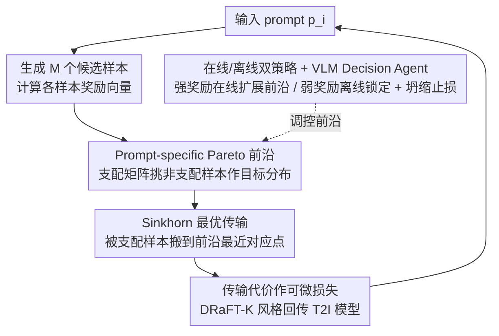

# Pareto-Guided Optimal Transport for Multi-Reward Alignment

**会议**: ICML 2026  
**arXiv**: [2605.13155](https://arxiv.org/abs/2605.13155)  
**代码**: 无  
**领域**: 文生图对齐 / 多奖励优化  
**关键词**: 多奖励对齐, 奖励 hacking, Pareto 前沿, 最优传输, JDR/JCR  

## 一句话总结
PG-OT 把「多奖励文生图对齐」从「加权全局求和」改成「为每个 prompt 单独构造 Pareto 前沿、用 Sinkhorn 最优传输把被支配样本传到前沿」，并引入 Joint Domination Rate / Joint Collapse Rate 两个新指标暴露平均值掩盖的奖励 hacking，在 Parti-Prompts 上 JDR₂ 47.98% 比强基线提升 11%，人评胜率近 80%。

## 研究背景与动机

**领域现状**：文生图（T2I）后训练偏好对齐普遍用一个或多个 reward model 做 RLHF 风格的微调，目标函数形如 $\mathcal{L}(x) = C - \sum_k w_k R^k(x)$，把 $C$ 当作全局上界，最大化加权奖励。

**现有痛点**：(i) **奖励 hacking** 普遍存在——reward 分数继续涨而图像质量崩溃；(ii) **多奖励融合方法** 靠权重搜索，调参成本高且收益不稳；(iii) **均值类评估指标**（各 reward 平均涨多少）会掩盖 hacking：某一维涨而其它维跌，平均仍是正。

**核心矛盾**：作者发现这些问题的根因都是「用一个全局常数 $C$ 当奖励上界」与「不同 prompt 实际能达到的最大奖励差异巨大」之间的不匹配。Figure 1 实证显示，在 ICT 奖励下 20 个 prompt 的最大奖励分布跨度极大；用一个全局 $C$ 等于把所有 prompt 强行对齐到同一个上界，对那些天然上界低的 prompt 来说，梯度会一直推下去直到走捷径 → reward hacking。

**本文目标**：(a) 理论上证明「异质上界 + 全局目标」必然导致一部分样本被推向 hacking；(b) 设计一种「逐 prompt 上界感知」的优化策略；(c) 给出能可靠检测 hacking 的评估指标；(d) 区分强/弱 reward model 的行为差异，设计相应保护机制。

**切入角度**：把多奖励对齐自然嵌入 Pareto 优化框架——既然不同 prompt 的可达上界不同，就把「同 prompt 内最优样本集合」当作该 prompt 的 Pareto 前沿，用 OT 把同 prompt 的非最优样本「传」到前沿；强奖励信号在线扩展前沿、弱奖励信号离线锁定前沿并由 VLM agent 检测 collapse。

**核心 idea**：「prompt-specific Pareto 前沿作目标分布 + OT 作传输算子」，并用 JDR/JCR 两个 Pareto 风格指标量化「真增益 vs 假 hacking」。

## 方法详解

### 整体框架
PG-OT 的核心是放弃「全局常数上界 + 加权奖励求和」，转而为每个 prompt 单独估计它真实能达到的奖励上界，并把这个上界写成一组 Pareto 最优样本（前沿）。训练时，模型当前生成的样本里凡是被前沿支配的，都通过 Sinkhorn 最优传输被「搬」到前沿对应点上，传输代价直接当作可微损失回传到 T2I 模型。强、弱两类奖励分别用在线扩展前沿与离线锁定前沿处理，并由一个 VLM agent 监控弱奖励的早期坍缩、必要时把它从优化中剔除。

### 关键设计

**1. Prompt-specific Pareto 前沿：用逐 prompt 的可达上界替换全局常数**

痛点在于传统目标 $\mathcal{L}(x)=C-\sum_k w_k R^k(x)$ 用一个全局 $C$ 当所有 prompt 的奖励上界，而 Figure 1 实测显示不同 prompt 的可达最大奖励跨度极大——对那些天然上界低的 prompt，梯度会一直把它往够不到的全局极值推，最终走捷径触发 hacking。PG-OT 改成给每个 prompt $p_i$ 先生成 $M$ 个候选样本 $\{x_i^j\}_{j=1}^M$，得到奖励向量集合 $\mathcal{R}_{i,M}^{(pre)}=\{\tilde R(x_i^j)\}$，再构造 $M\times M$ 支配矩阵 $A$（$A_{mn}=1$ 当 $\tilde R(x_i^m)\succ\tilde R(x_i^n)$，支配定义为「所有维 ≥ 且至少一维 >」），把「被支配次数为 0」的样本挑出来作为该 prompt 的前沿 $\mathcal{R}^{front}(p_i)=\{\tilde R(x_i^j)\mid\sum_m A_{mj}=0\}$。这样每个 prompt 拿到的是自己「真实可达」的目标，模型不再被强迫去逼近根本到不了的极值，从源头消除了低上界 prompt 走捷径的诱因。

**2. Sinkhorn 最优传输：把被支配样本以最小代价搬到前沿，且全程可微**

有了前沿这个目标分布，还需要一个能把当前样本「拉过去」的可微算子。PG-OT 在奖励空间里做最优传输：源分布 $\mu_i$ 是当前 batch 中被前沿所有点支配的样本，目标分布 $\nu_i=\mathcal{R}^{front}(p_i)$ 是前沿点，地面成本取平方欧式距离 $c(y_i^m,x_i^j)=\|\tilde R(y_i^m)-\tilde R(x_i^j)\|_2^2$。求解熵正则化 OT $\gamma^\ast_i=\arg\min_{\gamma\in\Pi(\mu_i,\nu_i)}\sum_{m,j}c(y_i^m,x_i^j)\gamma(y_i^m,x_i^j)$ 得到传输方案，把 $\gamma^\ast$ 与 $c$ 的内积当作训练损失，通过 DRaFT-K 风格的可微奖励链路（奖励模型对图像可微）回传到 T2I 模型，本质上让每个被支配样本朝前沿上「最近的对应点」移动。相比加权和或单点最大化，OT 保留了奖励空间的几何结构，避免所有样本朝同一个目标坍缩；而 Sinkhorn 的可微性是让传输代价能反传、整套优化跑得通的工程前提。

**3. 在线/离线双策略 + VLM Decision Agent：按奖励强弱区别对待并主动止损**

不是所有奖励都同样可信。作者在 Pick-a-Pic、Pick-High 两个人偏好数据集上测各奖励的准确率（Table 1：CLIP 60.3%、HPS 72.9%、ICT 87.6%、HP 88.5%），把 ICT/HP 归为「强」、CLIP/HPS 归为「弱」。强奖励与人偏好一致，走在线策略——训练中动态收集每个 prompt 的样本不断扩展前沿，鼓励 T2I 自主探索新的 Pareto 最优点；弱奖励本身就不可靠，再让它在线扩展只会把假信号污染进前沿，因此走离线策略——一次性用预生成的 $M$ 个样本算好前沿后锁死，训练中只对着这个固定目标传输。在此之上，一个 GPT-4o agent 配上各奖励的「轻度 collapse 参考图集」做 in-context 检测，一旦发现弱奖励出现 early mild collapse，就把该奖励移出优化并回滚到上一个 stable checkpoint，避免坍缩信号被持续放大。

### 损失函数 / 训练策略
训练损失就是 OT 传输总成本 $\sum_{m,j}c(y_i^m,x_i^j)\gamma^\ast(y_i^m,x_i^j)$ 回传到 T2I 模型，奖励链路沿用 DRaFT-K 风格的可微奖励；VLM agent 在每个验证步触发一次 collapse 检查。评估侧除了传统单奖励胜率，PG-OT 新增两个 Pareto 风格指标：联合支配率 $\mathrm{JDR}_K=\tfrac{1}{N}\sum_i\mathbb{1}(\mathbf{R}_i\succ\mathbf{R}_{i,b})$（生成样本在 $K$ 维上联合支配 baseline 的 prompt 比例，越高越好）与联合坍缩率 $\mathrm{JCR}_K=\tfrac{1}{N}\sum_i\mathbb{1}(\mathbf{R}_{i,b}\succ\mathbf{R}_i)$（反被 baseline 联合支配、即所有维同时退化的比例，越低越好）。这两个指标专门用来戳破「均值类指标」掩盖的 hacking——某一维涨、其它维跌时平均仍为正，但 JDR 不会涨、JCR 反而会暴露。

## 实验关键数据

### 主实验
基础模型 SD3.5-Turbo，4 个奖励：ICT、HP（强），CLIP、HPS（弱）；Parti-Prompts 评测。

| 方法 | ICT 胜率 | HP 胜率 | CLIP 胜率 | HPS 胜率 | JDR₂ ↑ | JDR₄ ↑ | JCR₄ ↓ |
|---|---|---|---|---|---|---|---|
| +ICT 单奖励 | 56.99 | 36.83 | 47.06 | 48.71 | 20.59 | 7.66 | 10.17 |
| +HP 单奖励 | 52.45 | **90.26** | 44.30 | 57.29 | 36.15 | 13.73 | 4.11 |
| 加权 2:3:2:3 | 50.80 | 56.43 | 46.51 | 86.03 | 28.31 | 13.42 | 2.57 |
| Reward Soup 3:2:1:4 | 50.80 | 53.74 | 43.32 | 85.29 | 26.29 | 10.85 | 3.19 |
| Weighted-Sum (w/o OT) | 52.63 | 56.86 | 46.94 | 82.48 | 29.84 | 13.66 | 3.49 |
| **PG-OT** | 56.43 | 85.23 | 43.63 | 61.70 | **47.98** | **17.10** | **2.39** |

**人评胜率近 80%**——这是论文最强卖点之一，PG-OT 没有在所有单 reward 上拿最高分（在 CLIP/HPS 上比 weighted-sum 低），但 JDR₂/JDR₄ 同时显著最高、JCR₄ 最低，说明它产出的样本更广泛地多维优于 baseline，且很少有维度坍缩。

### 消融实验

| 变体 | 关键观察 |
|---|---|
| 全局上界（weighted-sum） | 各单 reward 涨但 JDR 低，JCR 偏高，证明 hacking 风险 |
| 仅 OT 不用 Pareto 前沿 | OT 缺乏明确目标，效果接近 weighted-sum |
| 仅 Pareto 不用 OT | 前沿点离散，无可微信号 |
| 不区分强/弱 reward | 弱 reward 在线扩展前沿会污染目标 |
| 不用 VLM agent 检测 | 弱 reward collapse 后无法及时止损 |
| 完整 PG-OT | JDR₂ 47.98%、JCR₄ 仅 2.39%，同时改进与抑制 hacking |

表 2 给出 CLIP-only 优化时各 reward 的 trend：CLIP 涨 +7.27% 而 HPS 跌 -2.78%、HP 跌 -4.38%，正是典型的奖励冲突 + 部分 hacking 例证，凸显 PG-OT 引入 JDR/JCR 检测的必要性。

### 关键发现
- 单奖励优化（如 +HP 拿到 HP 胜率 90.26%）在该单维拿到最高但 JDR/JCR 都很差，说明传统「单 reward 胜率」指标严重误导。
- weighted-sum 调权重收益有限：4 种比例下 JDR₄ 仅 12.44%–13.66%，远不如 PG-OT 的 17.10%。
- JCR 指标揭示了 mean-based 指标看不到的隐藏 collapse：Separate-Cons 配置 HPS 胜率 61.21% 看起来 OK，但 JCR₄ 高达 6.68%，说明许多样本在所有维度同时退化。

## 亮点与洞察
- 「prompt-wise 异质上界」这一观察一针见血，把人们都习惯的「全局 reward」假设变成了显式可证的 hacking 来源，理论 + 实证一起推。
- 用 Pareto 前沿作 OT 目标分布是一个**思想的接力**——把单点最大化升级为「分布到分布的传输」，在多目标设置里有结构性优势。
- JDR/JCR 把多奖励对齐评估从「平均分」转到「Pareto 比较」，可以作为之后多奖励 RLHF 工作的通用诊断标准。
- 强/弱 reward 的对称处理（在线扩展 vs 离线锁定）+ VLM agent 动态裁剪 reward，是对真实 RLHF 训练里 reward 质量参差不齐的务实工程方案。

## 局限与展望
- 离线 Pareto 前沿质量取决于预生成样本数 $M$ 和 reward model 自身可靠性；若 reward 严重失调，前沿就是错的目标。
- Sinkhorn 在大 batch 上的计算量与正则系数选择都对超参敏感，论文未给详细超参 ablation。
- VLM agent 用「mild collapse 参考集」做触发，依赖人工标注的 collapse 案例，对未见过的新 collapse 模式可能失灵。
- 实验局限于 4 个 reward 与 SD3.5-Turbo 一个 backbone，跨更多 reward 数量级和扩散/AR 架构的可迁移性需更多验证。

## 相关工作与启发
- **vs 加权求和 / Reward Soup**：它们以「调权重」绕过冲突；PG-OT 用 Pareto 前沿正面承认冲突，再用 OT 把样本传过去，结构上不需调权。
- **vs DRaFT / Diffusion-DPO**：传统可微奖励微调用全局目标推 reward；PG-OT 用 prompt-specific 前沿作目标，把 hacking 风险显式压下来。
- **vs Pareto-MTL / Multi-task Learning**：MTL 里常用 MGDA 等找 Pareto 方向；PG-OT 不在权重空间找方向，而是在样本空间用 OT 传输，避免 MGDA 在高维任务下的求解不稳定。

## 评分
- 新颖性: ⭐⭐⭐⭐⭐ 「prompt-wise Pareto 前沿 + OT」+ 「JDR/JCR」双重原创，思想清晰
- 实验充分度: ⭐⭐⭐⭐ 多基线（单奖励/加权/Reward Soup/带 OT 无 Pareto）+ 人评，但 backbone 单一
- 写作质量: ⭐⭐⭐⭐ 理论铺垫严谨、动机分析（hacking 三类机制）很有教益
- 价值: ⭐⭐⭐⭐⭐ 对 multi-reward RLHF 的通用启示性强，JDR/JCR 可直接被社区采纳

<!-- RELATED:START -->

## 相关论文

- [\[CVPR 2026\] POCA: Pareto-Optimal Curriculum Alignment for Visual Text Generation](../../CVPR2026/image_generation/poca_pareto-optimal_curriculum_alignment_for_visual_text_generation.md)
- [\[CVPR 2026\] COT-FM: Cluster-wise Optimal Transport Flow Matching](../../CVPR2026/image_generation/cot-fm_cluster-wise_optimal_transport_flow_matching.md)
- [\[NeurIPS 2025\] On the Relation between Rectified Flows and Optimal Transport](../../NeurIPS2025/image_generation/on_the_relation_between_rectified_flows_and_optimal_transport.md)
- [\[ICML 2026\] Alignment-Guided Score Matching for Text-to-Image Alignment in Diffusion Models](alignment-guided_score_matching_for_text-to-image_alignment_in_diffusion_models.md)
- [\[ICML 2026\] Gradient Preconditioning for Efficient and Reliable Reward-Guided Generation](gradient_preconditioning_for_efficient_and_reliable_reward-guided_generation.md)

<!-- RELATED:END -->
