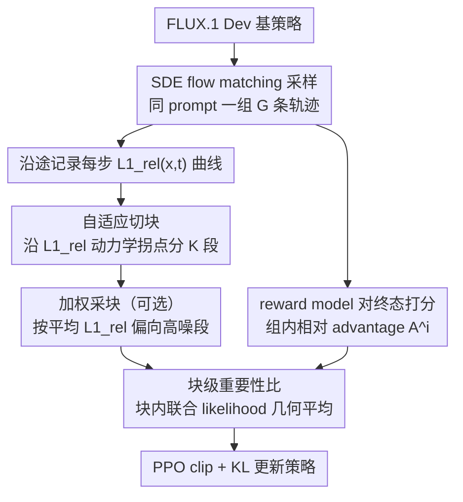

# Principled RL for Flow Matching Emerges from the Chunk-level Policy Optimization

**会议**: ICML2026  
**arXiv**: [2510.21583](https://arxiv.org/abs/2510.21583)  
**代码**: https://github.com/xingzhejun/GCPO  
**领域**: 图像生成  
**关键词**: flow matching, GRPO, chunk-level policy optimization, T2I, preference alignment

## 一句话总结
GCPO 把 GRPO 在 flow matching 后训练里"每一步都用同一个最终 reward 当 advantage"的步级优化改成"块级"——按 flow matching 自身的时间动态 $L1_{rel}(x,t)$ 自适应地把连续若干步聚成 chunk，用规范化的 chunk-level 重要性比 $r^i_j$ 做策略更新，从而平滑掉"最终好≠每步好"造成的错误梯度，在 HPSv3/ImageReward/GenEval/DPG 上相对 GRPO 取得最高 43% 的相对增益。

## 研究背景与动机
**领域现状**：Dance-GRPO、Flow-GRPO 这类方法把 LLM 里成功的 GRPO 搬到 T2I flow matching 后训练上：对同一 prompt 采一组 $G$ 张图，按组内 reward 算相对 advantage $A^i=(r^i-\bar r)/\sigma_r$，再把这个 **scalar advantage 均匀贴到生成轨迹的每一步** $t=1\ldots T$ 上做 PPO-style 更新。

**现有痛点**：作者称之为 **inaccurate advantage attribution**——这种均匀分配隐含一个强假设："最终结果更好 ⇒ 每一步策略都更好"。但 Figure 2 给的反例很直观：轨迹 1 终态 reward 更高，但在 $t=1$ 这一步轨迹 2 的中间策略反而更优；这时 GRPO 给轨迹 2 的 $t=1$ 一个负 advantage，纯粹是错信号。作者用 step-aware preference model 在 HPDv2.1 的 400 个 prompt 上统计，**约一半**的 step 的"step-级 preference"和"final reward"不一致（37% + 44%），说明这是系统性问题而非个别噪声。

**核心矛盾**：要真正解决就得有 process reward model 能在含噪 latent $x_t$ 上打分，但训这种 PRM 需要大量"含噪图像的偏好标注"，目前几乎拿不到；现有用 1-step diffusion 近似的方案（Liang 2025、Liao 2025）又有 estimation bias。所以"上 PRM"这条路短期走不通。

**本文目标**：在**不引入 process reward** 的前提下，仅靠改变"策略优化的粒度"就把这套错误归因带来的梯度抖动压下去。

**切入角度**：从机器人 action chunking（Zhao 2023）借类比——既然单步预测会被人类示教里的非马尔可夫噪声打乱，那就把若干步当作一个"动作块"联合预测；类似地，flow matching 的相邻步骤本来就高度相关，把它们当一个 atomic action 来评 advantage 应该能"平均掉"错误归因带来的局部抖动。

**核心 idea**：把策略优化从 **step level** 提升到 **chunk level**——保留 GRPO 原有的"最终 outcome reward 均匀分配"，但用规范化的 chunk-level 重要性比 $r^i_j$ 作为基本梯度单元；同时利用 flow matching 自带的 prompt-invariant 时间动态曲线 $L1_{rel}(x,t)$ 自适应地切 chunk（动态变化相近的步归到一块）。

## 方法详解

### 整体框架
GCPO 想解决的是 GRPO 在 flow matching 后训练里"把同一个最终 reward 均匀贴到生成轨迹每一步"造成的错误归因，而它的做法是把策略优化的最小单元从单步抬到"块"。整条 pipeline 不动 reward、不动 sampler、不动 KL 约束，只改 GRPO 目标函数里"对哪个粒度做 importance ratio + clip"：以 FLUX.1 Dev 为 base policy，沿 SDE 化的 flow matching 公式 $dx_t=(v_\theta+\frac{\sigma_t^2}{2t}(x_t+(1-t)v_\theta))dt+\sigma_t dw_t$ 把轨迹采出来，沿途记下每步的 $L1_{rel}(x,t)$ 用来切 chunk，reward model 只对终态 $x_0$ 打分得到组内相对 advantage $A^i$，最后用 chunk-level 的重要性比做 PPO-style 更新。

### 关键设计

**1. Chunk-level importance ratio：把错误的步级梯度在块内稀释掉**

GRPO 把 outcome reward 平摊到每一步，隐含"最终更好 ⇒ 每步更优"的强假设；但作者用 step-aware preference model 统计出约一半的步上"step 级偏好"和"final reward"方向不一致，这意味着 GRPO 对这些步给的是完全错的梯度。GCPO 的对策是把轨迹切成 $K$ 个 chunk 后，不再对单步算 likelihood 比，而是对第 $i$ 条轨迹第 $j$ 个 chunk 取联合 likelihood 的几何平均 $r^i_j(\theta)=\left(\prod_{t\in ch_j}\frac{p_\theta(x^i_{t-1}|x^i_t,c)}{p_{\text{old}}(x^i_{t-1}|x^i_t,c)}\right)^{1/cs_j}$，再代回 PPO clip 目标 $\frac{1}{G}\frac{1}{K}\sum_{i,j}\min(r^i_jA^i,\text{clip}(r^i_j,1\pm\epsilon)A^i)-\beta D_{KL}$。

这样改之后，chunk 内某个"被 final reward 误判"的步，它的 ratio 会被同 chunk 内其它步平均掉，等价于在 chunk 内做了一次低通滤波，把错误归因引起的高频梯度抖动压下去。这个目标也是 step-level GRPO 与 sequence-level 的统一形式：$K=T$ 时每个 chunk 只含一步即退回原 GRPO，$K=1$ 时整条轨迹一个 chunk 即退回类 GSPO 的序列级（Zheng 2025）。$1/cs_j$ 的几何平均归一化保证不同长度 chunk 的 ratio 量级可比，从而 clip 阈值 $\epsilon$ 不必随 chunk 大小重调，也避免长 chunk 因联合 likelihood 太小被 clip 误杀。

**2. Temporal-dynamics-guided 自适应切块：让块边界落在动力学拐点上**

切块方式直接决定几何平均"平均的是不是同一类步"。作者观察到 flow matching 的相对 $L_1$ 距离 $L1_{rel}(x,t)=\|x_t-x_{t-1}\|_1/\|x_t\|_1$ 沿 $t$ 呈一条 prompt-invariant 却 step-dependent 的曲线（Figure 5：高噪段变化剧烈、低噪段变化平缓），这条曲线天然把轨迹分成"动力学相近"的段落。于是 GCPO 用它做切块依据：先对 $L1_{rel}$ 求一阶导数，把符号相同的连续步归为一组，整段符号一致就从中点切，再对每个子段递归用更高阶导数继续切，直到 chunk 足够小才停。

之所以不用等长切，是因为只有"动力学相近的相邻步"才真正构成一个有意义的 atomic action——把高噪剧变区和低噪平稳区硬塞进同一个 chunk，会让块内 ratio 的几何平均失去物理意义。Figure 4 的对照里等长切块（$cs=2/4/8/16$）彼此有差且都不如自适应切块，正印证了这点。而用 $L1_{rel}$ 当指标既不用训额外网络、又是 prompt-invariant 的，几乎零开销，换任何 flow matching backbone 都能直接复用。

**3. 基于动力学的 weighted chunk sampling（可选）：高噪加速、低噪兜底**

为省算力，训练时只从每条轨迹里采一部分 chunk 算梯度（沿用 Dance-GRPO 的子采样，分数 0.5）。GCPO 把原来的均匀采样换成按动力学加权：每个 chunk 的采样权重正比于其平均相对 $L_1$ 距离 $w(ch_j)=\frac{\overline{L1_{rel}}(ch_j)}{\sum_k\overline{L1_{rel}}(ch_k)}$，其中 $\overline{L1_{rel}}(ch_j)=\frac{1}{cs_j}\sum_{t\in ch_j}L1_{rel}(x,t)$，分布因此偏向高噪段。

这么设计的依据来自消融（Figure 7，只在单个 chunk 上训）：高噪 chunk 带来的 reward 提升更大但训练更不稳，60 步后会发散；低噪 chunk 稳定但提升小。加权采样想两头都占——多采高噪加速对齐、少采低噪保住稳定。代价是它会在偏好对齐上涨点、却在 GenEval 这类结构基准上掉点（Figure 6 的失败例把"black loafers"整个画丢、"capris"只画一半），所以作者把它列为 optional。

### 损失函数 / 训练策略
最终目标 Eq.14：$J(\theta)=\mathbb{E}\Big[\frac{1}{G}\frac{1}{K}\sum_{i,j}\big(\min(r^i_j A^i,\text{clip}(r^i_j,1-\epsilon,1+\epsilon)A^i)-\beta D_{KL}(\pi_\theta\|\pi_{ref})\big)\Big]$，其中 $A^i$ 仍是 group 内相对最终 reward。Base model 用 FLUX.1 Dev，数据集 HPDv2.1，主 reward 用 HPSv3（偏好对齐）/ CLIP（标准 T2I），评估时配合 (Li 2025a) 的 hybrid inference 抑制 reward hacking。

## 实验关键数据

### 主实验

| 数据集 / 指标 | Flux base | Dance-GRPO | Flow-GRPO | GCPO w/o ws | GCPO w/ ws |
|---|---|---|---|---|---|
| HPSv3 ↑ | 13.804 | 15.080 | 14.900 | 15.236 | **15.373** |
| ImageReward ↑ | 1.086 | 1.141 | 1.135 | 1.147 | **1.149** |
| GenEval Overall ↑ | 0.66 | 0.67 | 0.67 | **0.69** | 0.67 |
| DPG Overall ↑ | 84.00 | 85.17 | 85.05 | **86.60** | 85.14 |
| User study win rate | – | 0.275 | – | 0.350 | **0.375** |

相对 GRPO 基线在 GenEval/DPG 的"提升幅度"上达到约 3× 的相对增益；偏好对齐相对增益最高 43%（HPSv3 上 GCPO 较 Dance-GRPO 的归一化提升）。User study 上两个 GCPO 变体合计被人类评为最优的概率 72.5%。

### 消融实验

| 配置 | HPSv3 | 说明 |
|---|---|---|
| Flux (no RL) | 13.804 | base，确立下界 |
| Dance-GRPO（step-level） | 15.080 | 复现的 GRPO baseline |
| GCPO fixed $cs=2$ | 15.115 | chunk 化但等长 2 步 |
| GCPO fixed $cs=4$ | 15.078 | 等长 4 步 |
| GCPO fixed $cs=8$ | 15.173 | 等长 8 步，已超 GRPO |
| GCPO fixed $cs=16$（即 $K=1$ 序列级）| 15.142 | 全轨迹一个 chunk 也能赢 |
| **GCPO adaptive（默认）** | **15.236** | 用 $L1_{rel}$ 自适应切，最好 |
| + weighted sampling | 15.373 | 偏好对齐再涨，但 GenEval 掉 |

换 reward model（Table 6，PickScore 训练）：GCPO 在 PickScore / HPSv3 / ImageReward 三个指标上对 Dance-GRPO / Flow-GRPO 仍全面胜出，说明改进来自优化粒度而非过拟合某个 reward。

### 关键发现
- **任何 chunk 化都打 step-level GRPO**：连最粗暴的等长 $cs=2$ 都比 GRPO 高 0.035 HPSv3，说明"步级 advantage 归因"确实有结构性错误，chunk 内几何平均是有效平滑。
- **切块方式重要**：自适应 > 等长 8 > 等长 2 > 等长 4，并非"chunk 越大越好"或"越小越好"——必须和 flow matching 的时间动力学对齐。
- **高噪 chunk 提升大但不稳**：Figure 7 显示低 index（高噪）chunk 单独训能更快涨 reward 但 60 步后发散；motivating 了权重采样的"高噪加速 + 低噪兜底"思路。
- **加权采样是双刃剑**：偏好对齐涨（HPSv3 15.236→15.373），但 GenEval 从 0.69 掉到 0.67、DPG 从 86.60 掉到 85.14，会破坏高噪段的结构生成，所以列为 optional。

## 亮点与洞察
- **把 LLM RL 里"per-token vs per-sequence"的争论搬到 diffusion**：GSPO 之类工作已经在 LLM 端讨论"序列级 importance ratio 更稳"，本文把这条经验显式映射到 flow matching，并指出 LLM 没有的特点——flow matching 有**确定性的时间动力学曲线**，所以可以做"序列内非均匀分块"，比 LLM 端那种简单 token vs sequence 二分粒度更细。
- **$L1_{rel}(x,t)$ 是免费午餐**：prompt-invariant + 无需训练即可作为 chunk 边界依据，理论上换任何 flow matching backbone 都能直接复用，工程价值很高。
- **不引入 process reward 也能缓解 process attribution 问题**：这是个值得迁移的思路——当"细粒度监督信号"难拿但"细粒度参数化"容易做时，可以通过改变"梯度聚合粒度"来代替"监督粒度"，类似 trick 可迁移到 video diffusion、长 CoT LLM 的 step-level reward 缺失问题。
- **几何平均 + $1/cs_j$ 归一化**让不同长度 chunk 公平比较，避免长 chunk 因联合 likelihood 太小被 clip 误杀，是个值得复用的工程细节。

## 局限与展望
- **仍是 outcome reward，没解决归因本质**：chunk 化只是把错误信号"平均"掉了，并没有真正告诉 chunk 内的每一步谁好谁坏；如果未来 process reward model 训得起来，chunk 化可能反而是 sub-optimal。作者也提到可以"在不同噪声段用不同 reward model"作为延伸。
- **加权采样副作用明显**：高噪 chunk 上多采会破坏结构（Figure 6 失败例），目前只能 trade-off 不能两全；缺少自适应权重调度（如随训练进度退火）。
- **只在 FLUX + HPDv2.1 一个 base + 一个数据集上做完整对比**，对 SD3、PixArt-α 等其他 flow matching 模型的迁移性没有正面验证；reward model 也主要是 HPS 家族。
- **chunk 切分超参（递归终止 chunk 大小阈值）没系统消融**，只在 Table 5 报了若干等长设置，自适应切法的鲁棒性证据偏轻。
- **理论分析在 Appendix A**，正文只给直觉，"chunk-level ratio 一定收敛到正确策略"等性质需要查附录验证。

## 相关工作与启发
- **vs Dance-GRPO / Flow-GRPO**: 都是 step-level GRPO + SDE 化 flow matching，把 outcome reward 平贴每步；GCPO 保留两者的 SDE 采样和 KL 约束，只改 ratio 粒度，可作为 plug-in 替换，复杂度近似零开销。
- **vs MixGRPO（混合 ODE-SDE）**: MixGRPO 改采样路径降算力，GCPO 改优化粒度提稳定性，二者正交，原则上可叠加。
- **vs TempFlow-GRPO**: TempFlow 用 timing-aware 权重给不同步加权 advantage，仍是步级；GCPO 直接把若干步合并成原子单元，且权重也作用在 chunk 而不是 step，思路更彻底。
- **vs Pref-GRPO / BranchGRPO**: Pref-GRPO 改"算 advantage 的方式"（pairwise 拟合），BranchGRPO 改 rollout 拓扑（树状共享前缀），GCPO 改"优化的粒度"，三者修不同部件，互不冲突。
- **vs DenseGRPO（Deng 2026, process reward 路线）**: DenseGRPO 走"训含噪 PRM"的硬路；GCPO 不引入新 reward，只靠粒度变化，工程门槛低很多但理论上界不如有真 PRM 的方案。
- **vs Action Chunking（Zhao 2023, ACT）**: ACT 在机器人控制里把未来若干动作联合预测来抗非马尔可夫噪声；GCPO 借的是同一灵感但场景换成 generative RL，并额外用 flow matching 的时间动力学指导"块边界该切在哪里"，这是机器人里没有的免费先验。

## 评分
- 新颖性: ⭐⭐⭐⭐ 把 LLM 里的序列级 ratio + 机器人 action chunking 跨界搬到 flow matching RL，并配上 $L1_{rel}$ 时间动力学切块，组合点新且 motivation 清晰；纯 step→chunk 的改动在 GSPO 等工作里有先例所以不打满分。
- 实验充分度: ⭐⭐⭐⭐ 主实验涵盖 GenEval/DPG/HPSv3/ImageReward + user study + 多 reward model 鲁棒性 + chunk size 全表消融，缺多 base model 横向迁移和理论性质实证。
- 写作质量: ⭐⭐⭐⭐ 从问题 → 量化频次 → 方法演进推导很顺，Figure 2/5/7 用图把"错误归因"和"动力学切块"两件事讲得很直观；数学符号一致；个别地方 K=T 与 K=1 退化讨论值得放正文。
- 价值: ⭐⭐⭐⭐ 几乎零额外算力的 GRPO drop-in 替换，对所有用 GRPO 后训练 T2I flow matching 的工程 pipeline 立刻可用；代码已开源，复现门槛低。

<!-- RELATED:START -->

## 相关论文

- [\[CVPR 2026\] Neighbor GRPO: Contrastive ODE Policy Optimization Aligns Flow Models](../../CVPR2026/image_generation/neighbor_grpo_contrastive_ode_policy_optimization_aligns_flow_models.md)
- [\[ICML 2026\] E²PO: Embedding-perturbed Exploration Preference Optimization for Flow Models](embedding-perturbed_exploration_preference_optimization_for_flow_models.md)
- [\[ICML 2026\] Bootstrap Your Generator: Unpaired Visual Editing with Flow Matching](bootstrap_your_generator_unpaired_visual_editing_with_flow_matching.md)
- [\[ICML 2026\] Shifting the Breaking Point of Flow Matching for Multi-Instance Editing](shifting_the_breaking_point_of_flow_matching_for_multi-instance_editing.md)
- [\[CVPR 2026\] GRPO-Guard: Mitigating Implicit Over-Optimization in Flow Matching via Regulated Clipping](../../CVPR2026/image_generation/grpo-guard_mitigating_implicit_over-optimization_in_flow_matching_via_regulated_.md)

<!-- RELATED:END -->
