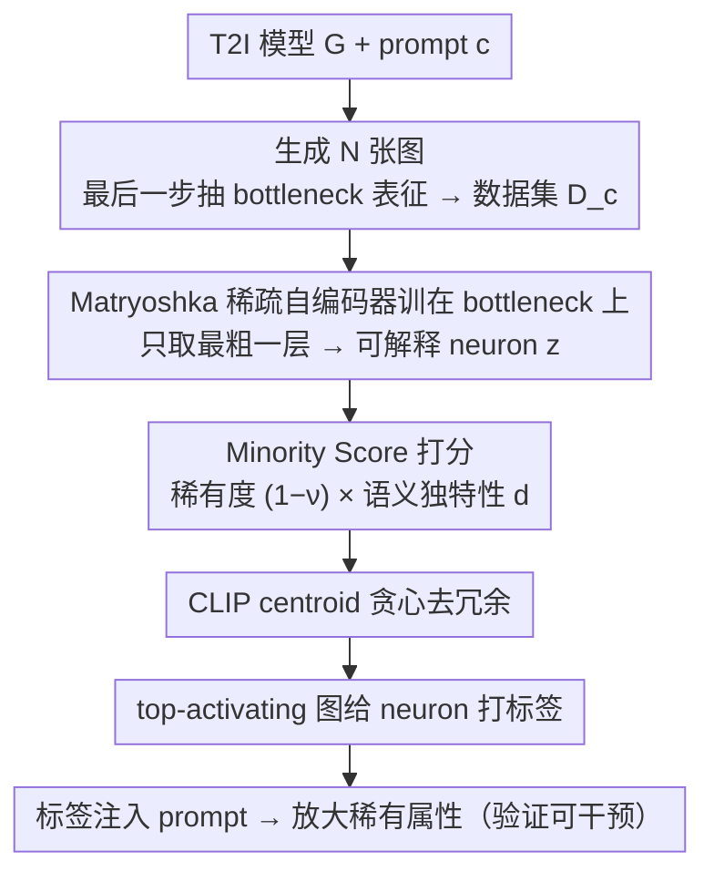

# RAIGen: Rare Attribute Identification in Text-to-Image Generative Models

**会议**: ICML 2026  
**arXiv**: [2602.06806](https://arxiv.org/abs/2602.06806)  
**代码**: https://vssilpa.github.io/RAIGen_webpage/ (项目主页)  
**领域**: 扩散模型 / 图像生成 / 模型可解释性 / 偏见审计  
**关键词**: 扩散模型, 稀疏自编码器, 少数属性发现, 偏见审计, T2I 生成

## 一句话总结
RAIGen 用 Matryoshka 稀疏自编码器把 T2I 扩散模型 bottleneck 表征分解成可解释 neuron，再用"激活稀有度 × CLIP 语义偏离度"组合分数从中挑出"模型内部已编码但生成时几乎不出现"的少数属性 neuron，从而把偏见审计从"已知公平类目"和"显著多数模式"扩展到 label-free 的稀有属性发现。

## 研究背景与动机

**领域现状**：T2I 扩散模型（Stable Diffusion、SDXL、FLUX 等）能输出高保真图像，但同时继承并放大训练数据中的属性偏倚。现有去偏方法分两路：闭集方法（如基于 gender/race 的 fair diffusion、classifier-free guidance、可学习投影模块）只能处理预定义类目；开集方法（OpenBias）借助外部 LLM 提候选属性 + VQA 投票，能发现未知偏见，但主要暴露的是**多数属性**（generation 中过度出现的模式）。

**现有痛点**：闭集方法依赖人工类目，覆盖不到"罕见装扮/文化符号/构图模式"等非公平向少数模式；开集方法把模型当黑盒，靠外部世界模型反推 → 揭示的是"什么被多生成了"，而不是"什么被压制了"。作者在 Appendix G.1 还实证了：仅仅抑制多数属性并不能把概率质量均匀地补给少数属性，而是会在少数组之间不均地再分配。

**核心矛盾**：少数属性的"是否存在"不能从输出端推断 —— 模型完全可以**内部编码**了某个概念却在采样时几乎不输出它（如 LAION 中"教师"几乎男女均衡，但 SD 输出严重偏男）。要找这种"被压制的少数属性"，必须**进入模型内部表征**而不是只看生成图。

**本文目标**：(1) 提出一个 label-free 框架，无需任何少数类目先验，直接从扩散模型内部表征里挖出"已编码但被系统性低表达"的属性；(2) 给每个候选 neuron 一个量化的少数度评分；(3) 验证这些属性能在生成时被针对性放大。

**切入角度**：扩散 bottleneck 表征是天然纠缠不可读的；近期 Matryoshka Sparse Autoencoder (MSAE) 在 CLIP 上展示了分层、可解释的概念分解能力。作者把 MSAE 训在扩散 bottleneck 上，并只取**最粗粒度层**（finer level 容易把单个概念碎片化成 part-feature，反而虚增搜索空间）。

**核心 idea**：用 MSAE 把表征分解成稀疏 neuron 后，"少数属性 neuron"应同时满足两条 —— **激活频率低**（rarely fires）且 **top-activating 图像在 CLIP 空间显著偏离整体语义中心**（distinct）。两者相乘即 Minority Score $s(\mathbf{z}) = \mathbf{d} \odot (\mathbf{1} - \boldsymbol{\nu})$。

## 方法详解

### 整体框架
RAIGen 要回答一个输出端看不到的问题：模型内部已经编码、但生成时几乎从不画出来的属性有哪些。它的做法是把这个问题搬进扩散模型的内部表征——给定 T2I 模型 $G$ 和 prompt $\mathbf{c}$，先用 $G$ 生成 $N$ 张图并在最后一个 denoising step 抽出 bottleneck 表征 $\mathbf{h} \in \mathbb{R}^{h \times w \times n}$，把每个空间位置当作一个 $n$ 维样本攒成数据集 $\mathcal{D}_c = \{(\mathbf{h}^{(j)}, \mathbf{x}^{(j)})\}$；接着在这些向量上训练 Matryoshka 稀疏自编码器把纠缠表征拆成可解释 neuron，对每个 neuron 算一个"少数度"分数并按语义去冗余，最后用 top-activating 图给胜出的 neuron 打标签、并把标签塞回 prompt 验证能否真的把稀有属性放大出来。整条链路无需任何少数类目先验，从内部表征直接挖"被压制的概念"。

### 关键设计

**1. 把 Matryoshka 稀疏自编码器训在扩散 bottleneck 上，且只取最粗一层**

扩散 bottleneck 表征天然纠缠、无法直接读出"这里编码了哪些概念"，作者用 MSAE 把它解成稀疏可解释 neuron $\mathbf{z} = \{z_1, \dots, z_d\}$。MSAE 的特点是用一组从小到大的 Top-$k$ 算子 $\{k_1 < k_2 < \dots < k_f = d\}$ 训练同一套 encoder/decoder，训练目标是各稀疏度下的重构误差加权和 $\mathcal{L}_{\text{MSAE}} = \sum_i \alpha_i \|\mathbf{r} - \hat{\mathbf{r}}^{(k_i)}\|_2^2$，推理时任选一层就拿到对应粒度的特征，于是"概念粒度"变成一个可控旋钮。关键的反直觉取舍是：MSAE 的卖点本是多粒度，但作者**只用最粗层 $k_1$**——更细的层会把"女医生"碎成"白大褂袖子 + 卷发 + 听诊器"这类 part-feature，理论上能定位更细的少数属性，实际上却会让搜索空间爆炸、虚增一堆假阳性稀有 neuron。宁可漏掉部分更细的属性，也要保证留下的 neuron 是稳定、人类可读的语义单元，这是一次"用粒度换可解释性与覆盖率"的工程权衡。

**2. 用 Minority Score = 稀有度 × 语义独特性给每个 neuron 打分**

有了 neuron 还需要一把尺子判断哪些是"少数属性候选"。作者的观察是：真正被压制的少数属性 neuron 应同时满足两条——激活频率低，且其代表的图像在语义空间里明显偏离整体中心；只看任何一条都会出错。于是 Minority Score 被分解成两个正交的可观测量再相乘。其一是**激活频率** $\nu_i = |\{(\mathbf{h}, \mathbf{x}) \in \mathcal{D}_c : z_i(\mathbf{h}) > 0\}| / |\mathcal{D}_c|$，越低越稀有；其二是**语义偏离度** $d_i$，即 neuron 的激活加权 CLIP 中心 $\mu_i = \sum z_i(\mathbf{h}) \cdot \text{CLIP}(\mathbf{x}) / \sum z_i(\mathbf{h})$ 与整体 CLIP 中心 $\mu_{\mathcal{D}_c}$ 之间的余弦距离。两项各自 min–max 归一化到 $[0,1]$ 后逐元素相乘，得到 $s(\mathbf{z}) = \mathbf{d} \odot (\mathbf{1} - \boldsymbol{\nu})$，分数越高越像"内部编码、外部压制"的真少数属性。为什么非要两项相乘？因为低 $\nu$ 可能只是噪声 neuron，高 $d$ 可能是高频却跑偏的语义簇，单独任何一项都会被污染。作者在 toy 实验里验证频率信号本身就和 ground-truth 稀有特征强相关（Spearman $\rho \approx 0.991$），但真实 SD 表征里光看频率会混进大量噪声激活，必须加 distinctiveness 当二级过滤；Appendix G.10 也确认两项缺一不可。

**3. 用 CLIP centroid 距离做贪心去冗余，避免同一概念被重复列出**

MSAE 经常把同一个少数概念（如"卷发女医生"）分散到好几个高分 neuron 上，若直接取 Top-K 会得到一串换皮重复的条目。作者按 Minority Score 降序遍历，每保留一个 neuron，就把它周围 centroid $\mu_i$ 余弦距离小于阈值 $\tau$ 的其他 neuron 全部剔除——本质是以语义中心距离为度量的一次贪心 NMS。阈值 $\tau$ 是控制语义冗余度的超参数，这样既不必预先指定要找几个属性，又能保证最终集合在语义上彼此 distinct。

### 损失函数 / 训练策略
唯一的训练目标就是 MSAE 的多稀疏度重构误差加权和 $\mathcal{L}_{\text{MSAE}} = \sum_{i=1}^{f} \alpha_i \|\mathbf{r} - \hat{\mathbf{r}}^{(k_i)}\|_2^2$；Minority Score 与去冗余都是前向计算、不涉及梯度。bottleneck 表征只在最后一个 denoising step $t = T_{\text{final}}$ 抽取，因为此时语义信息最完整。框架对架构无关：U-Net 系（SD 1.4/2/XL）取 bottleneck，transformer 系的 FLUX.1-schnell 则把 hook 点固定在 `transformer.transformer_blocks.18`、用 4 步采样。neuron 含义的标注用 top-activating 图 + 激活热图，交由人工或 MLLM（GPT-5.2）完成。

> ⚠️ 文中提到的 GPT-5.2 / Llama 4-Scout 等模型名以原文为准。

## 实验关键数据

### 主实验

**主结果（Attribute Presence，越低越稀有，对比 OpenBias 的多数属性）**：

| 模型 | 方法 | WinoBias (↓) | COCO (↓) |
|------|------|--------------|----------|
| SD v1.4 | OpenBias（多数） | 0.941 | 0.933 |
| SD v1.4 | **RAIGen（少数）** | **0.205** | **0.220** |
| SDXL | OpenBias（多数） | 0.941 | 0.933 |
| SDXL | **RAIGen（少数）** | **0.194** | **0.199** |

RAIGen 发现的属性出现频率仅 $\sim 20\%$，OpenBias 的多数属性出现频率 $\sim 94\%$，说明 RAIGen 确实在挖被压制的稀有模式而非显著多数。SDXL 上稀有度略低于 SD v1.4，提示"模型容量更大并不自动等于稀有模式覆盖率更高"。

**Amplification via prompt revision（WinoBias）**：

| 模型 | Prompt | NLL (↑) | Dev. ratio (↓) | CLIP Align. (↑) |
|------|--------|---------|----------------|-----------------|
| SD v1.4 | Base | 1.917 | 0.50 | 20.30 |
| SD v1.4 | RAIGen-Revised | 1.935 | **0.22** | 19.80 |
| SDXL | Base | 1.812 | 0.49 | 27.26 |
| SDXL | RAIGen-Revised | 1.852 | **0.23** | 26.89 |

把 RAIGen 发现的少数属性标签通过 Llama 4-Scout 注入 prompt 后，属性分布偏离度从 $\sim 0.5$ 降到 $\sim 0.22$（更接近均匀），NLL 略升（确实进入了原分布的低密度区域），CLIP 对齐仅掉 $\sim 0.5$（语义基本守得住）。

### 用户研究（25 人，5 个职业，每职业 Top-6 少数属性，10 张图中估计出现次数 / 10）

| 职业 | 平均出现数 (↓) | 95% CI |
|------|----------------|--------|
| Analyst | 1.35 | [1.03, 1.67] |
| **CEO** | **0.70** | [0.44, 0.96] |
| Doctor | 1.18 | [0.97, 1.39] |
| Salesperson | 1.45 | [0.99, 1.91] |
| Sheriff | 2.64 | [2.21, 3.07] |

所有职业下 RAIGen 属性出现次数都 $< 3/10$，CEO 最稀有（$0.70/10$），人类感知层面直接证实"内部编码但生成时罕见"成立。

### 关键发现
- 频率单一信号在 toy 设置里就够用（Spearman $\rho \approx 0.991$），但真实 SD 表征里必须配 distinctiveness 才稳，Appendix G.10 显示去掉任一项都会让稀有 neuron 召回率显著下降。
- 限定在 MSAE 最粗层是关键工程选择：finer 层虽然理论上能定位更细的少数属性，实际会产生大量碎片化"part-feature"，作者明确放弃。
- 框架对架构无关：U-Net (SD 1.4/2/XL) 和 transformer-based DiT (FLUX.1-schnell) 都能跑，FLUX 上 Attribute Presence $= 0.11$，但 FLUX 上 high-score 但弱可解释 neuron 比例更高，作者归因于 transformer hook 点不像 U-Net bottleneck 那样有显式空间对齐。
- RAIGen 揭示的属性远超公平类目：除了"女医生"等社会向少数，还能挖出"画框里的医生肖像"、"motion blur 的侧视火车"等风格/构图向稀有模式。

## 亮点与洞察
- **把"什么没被生成"作为一类独立任务**：之前 fairness 方法做"已知类目去偏"、OpenBias 做"未知多数属性发现"，本文首次把"未知少数属性发现"立成第三个 niche，并给出 label-free 解法 —— 选题层面就拉开身位。
- **rarity × distinctiveness 的两路设计很干净**：低频 neuron 里混了一堆噪声 neuron，作者没去复杂化频率定义，而是引入正交的 CLIP-centroid 距离做二级筛选，相乘形式简单到可以一行代码写完，却同时 cover 了"稀有"和"有意义"两条必要条件 —— 这种"用最小可分解性写最小评分函数"的设计可以迁移到很多 SAE 解释场景。
- **最粗层 only 是反直觉但正确的取舍**：MSAE 卖点本是多粒度，但作者承认"更细不等于更好"，并实测证明 finer 层在少数属性任务上会把单个概念碎成 part-feature 推高假阳性 —— 这条 lesson 对所有"用 SAE 找概念"的下游任务都有警示价值。
- **Discovery → Amplification 闭环**：不仅找到稀有属性，还用 LLM 把标签塞回 prompt 做最轻量的"prompt 改写"就能把分布偏离度砍掉一半，验证了"找出来的属性是可干预的"，让 RAIGen 不只是审计工具，也是 mitigation 的前置模块。

## 局限与展望
- 作者承认 RAIGen 只能找模型**已经编码**的少数属性，模型完全没学到的社会少数仍会被漏掉 —— 因此与 LLM-based 外部先验结合的混合审计才是更完整的方向。
- Minority Score 的"高分 = 少数"成立，但"低分 = 多数"并不成立（低分也可能来自噪声/无 distinctiveness neuron），Appendix G.3 详述了这个不对称性。
- 整套 pipeline 严重依赖 CLIP 作为"语义先验"，CLIP 自身的偏倚（如对某些族裔/文化的弱编码）会直接污染 distinctiveness 评估 —— 作者自己也承认这是"label-free 而非 unsupervised"的关键妥协点。
- Transformer 扩散（FLUX）上 hook 点选择缺乏系统性，目前只是固定 `transformer_blocks.18`，作者明示"系统化选 attention/MLP 流的 hook 点"留给未来工作。
- 双重伦理风险：同样的能力可以被滥用做定向生成敏感属性/刻板印象图像，作者在 Impact Statement 里强调治理与部署 safeguard 是落地必要条件。

## 相关工作与启发
- **vs OpenBias (D'Incà et al., CVPR 2024)**：OpenBias 用 LLM 提候选 + VQA 投票，靠外部世界模型反推**多数**属性；RAIGen 进模型内部找**少数**。二者互补，本文实验里直接把 RAIGen 和 OpenBias 摆在同一张表上对比 Attribute Presence（$0.20$ vs $0.94$），定位非常清楚。
- **vs DiffLens / SAeUron (Cywiński & Deja, ICML 2025)**：这两者用 SAE 干预**预定义**敏感属性或 unlearning 目标概念，属于"下游 mitigation"；RAIGen 是上游 discovery，先回答"哪些 neuron 值得干预"。
- **vs Fair Diffusion / Debiased Prompts (Chuang et al., Friedrich et al.)**：传统去偏方法都需要人工指定 gender/race 等类目，RAIGen 跳过类目先验，理论上能挖出这些方法永远看不到的非公平向少数模式（如构图、文化符号）。
- **vs Matryoshka SAE for CLIP (Pach et al., 2025)**：直接借用 Matryoshka 思想，但把它从 CLIP 搬到扩散 bottleneck，并通过"只用最粗层"的工程实验扭转了"多粒度=多收益"的默认假设。

## 评分
- 新颖性: ⭐⭐⭐⭐⭐ 首次把 "label-free rare attribute discovery" 立成独立任务，rarity × distinctiveness 的极简评分函数干净有力。
- 实验充分度: ⭐⭐⭐⭐ SD v1.4/2/XL、FLUX 都跑了，WinoBias + COCO + 用户研究 + amplification 全链路，但单一数据集规模和 baseline 数量仍偏少。
- 写作质量: ⭐⭐⭐⭐ 问题定式清晰（Def. 1/2），方法符号一致，toy → 真实 → 用户研究 → 干预的论述节奏好读。
- 价值: ⭐⭐⭐⭐ 给 T2I 审计提供了和 OpenBias 互补的"另一只眼"，且发现-干预闭环跑通，工具向 + 思想向价值都有。

<!-- RELATED:START -->

## 相关论文

- [\[ICML 2026\] Content-Style Identification via Differential Independence](content-style_identification_via_differential_independence.md)
- [\[ICML 2026\] Alignment-Guided Score Matching for Text-to-Image Alignment in Diffusion Models](alignment-guided_score_matching_for_text-to-image_alignment_in_diffusion_models.md)
- [\[ICML 2025\] Origin Identification for Text-Guided Image-to-Image Diffusion Models](../../ICML2025/image_generation/origin_identification_for_text-guided_image-to-image_diffusion_models.md)
- [\[CVPR 2026\] All-in-One Slider for Attribute Manipulation in Diffusion Models](../../CVPR2026/image_generation/all_in_one_slider_attribute_manipulation.md)
- [\[ICML 2026\] SAEmnesia: Erasing Concepts in Diffusion Models with Supervised Sparse Autoencoders](saemnesia_erasing_concepts_in_diffusion_models_with_supervised_sparse_autoencode.md)

<!-- RELATED:END -->
