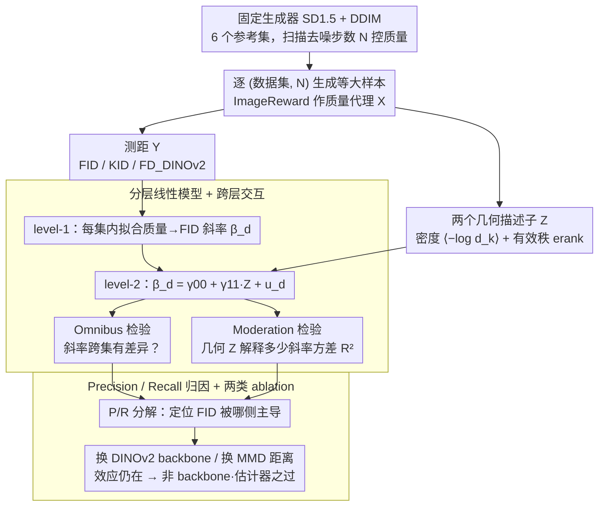

# Rethinking FID Through the Geometry of the Reference Dataset

**会议**: ICML 2026  
**arXiv**: [2605.29335](https://arxiv.org/abs/2605.29335)  
**代码**: 待确认  
**领域**: 图像生成 / 生成模型评估  
**关键词**: FID, 生成评估, 参考集几何, 分布密度, 有效秩

## 一句话总结
本文指出 FID 的"越低越好"假设在不同参考数据集上系统性失效，并用分布密度 $\langle -\log d_k\rangle$ 和有效秩 $\mathrm{erank}(A)$ 两个几何描述子，通过分层线性模型证明它们能解释 ~70% 的"样本质量→FID"斜率跨数据集差异，从而把 FID 的脆弱性首次定量归因到参考集本身。

## 研究背景与动机

**领域现状**：FID 用 Inception-v3 特征 + Fréchet 距离衡量生成分布与参考分布的差异，已经成为图像生成事实上的评测标准，几乎所有 diffusion / GAN / autoregressive 论文都以它作为主要 benchmark。

**现有痛点**：近两年很多反例陆续浮现——Choi et al. (2025) 显示 COCO 上多花算力得到更清晰的图反而让 FID 变差；Lee et al. (2025) 发现按最小 FID 调超参会得到 ImageReward 最差的样本；Jayasumana et al. (2024) 给出更强的图像扰动反而能改善 FID。这些都说明"FID 降 = 质量升"在实践中已经不成立。

**核心矛盾**：以前的解释要么怪 Inception-v3 特征脆弱（Kynkäänniemi et al. 2022, Parmar et al. 2022），要么怪 Fréchet 距离对长尾估计不稳定（Chong & Forsyth 2020），但 FID 的另一个核心成分——参考数据集本身——几乎从来没被审视过。参考集是怎么选的？为什么 CelebA-HQ 上 FID 行得通、在 COCO 上就翻车？这之间是否有可量化的"几何"差异？

**本文目标**：把"参考集到底在塑形 FID 的哪部分"形式化，找到能预测 FID 在不同参考集上行为差异的少量几何描述子。

**切入角度**：FID 本质是分布距离，自然只看参考集的两件事——它在特征空间里聚得有多紧（密度）以及它在多少个主方向上铺开（有效维度）。CelebA-HQ 这种单模态人脸数据集和 COCO 这种多类别开放域天然占据特征空间的不同区域，应该会让 FID 的响应方向也不一样。

**核心 idea**：用 mean kNN log-density 和 effective rank 两个标量描述参考集几何，再用两层分层线性模型把"样本质量 → FID 的斜率"显式建模成参考集几何的函数，跨数据集统计检验这条假设。

## 方法详解

### 整体框架
固定一个生成器（Stable Diffusion 1.5 + DDIM），在六个语义跨度差异巨大的参考集（FFHQ、CelebA-HQ、MJHQ-30K、ImageNet、Flickr30K、COCO）上分别生成图像，扫描去噪步数 $N \in \{15, 20, \dots, 50\}$ 控制样本质量，配上 ImageReward 作为质量代理。然后做两件事：(1) 给每个数据集算两个几何描述子；(2) 用分层线性模型测斜率差异是否能被这两个几何量解释。再用 precision/recall 分解 FID 看哪一侧贡献主导，最后换掉 Inception-v3（→ DINOv2）和 Fréchet（→ MMD/KID）做 ablation。

### 关键设计

**1. 两个几何描述子：用密度 + 有效秩刻画参考集的"形状"**

要把"参考集在塑形 FID"这件事说清楚，先得有办法把一个数据集在特征空间里的形态压成一两个可比的标量，否则只能停在举反例的层面。本文选了互补的两个：分布密度用 $k$-NN 的对数版本

$$\langle -\log d_k\rangle = \frac{1}{n}\sum_i -\log d_k(x_i)$$

其中 $d_k(x_i)$ 是第 $i$ 个样本到第 $k$ 个最近邻的欧氏距离（取 $k=80$）。之所以取 log 再平均，是因为 Loftsgaarden-Quesenberry 估计 $\hat p(x)\propto d_k(x)^{-D}$ 在 $D=2048$ 维下会横跨几十个数量级、直接用根本没法比。有效秩则用奇异值归一化后 Shannon 熵的指数 $\mathrm{erank}(A)=\exp(H(\bm\sigma/\|\bm\sigma\|_1))$（$A$ 为中心化特征矩阵），在所有非零奇异值相等时退化成真正的 rank、其余情况给出"加权维度"的连续推广。两个数加起来就能把本质不同的分布拉开——CelebA-HQ 是（密度 $-2.36$、有效秩 $1220$）的紧致单模态，COCO 是（密度 $-2.67$、有效秩 $1337$）的铺开开放域，而且全程只用特征空间可算量，不需要预先知道语义类别。

**2. 分层线性模型 + 跨层交互：把"几何能否解释斜率差异"做成可报 $p$ 值的检验**

直接对每个数据集画质量–FID 散点既不严谨、也答不出"差异有多大、能不能被几何预测"这两个量化问题。本文用两层结构把它拆开：level-1 在每个数据集 $d$ 内拟合 $Y=\alpha_d+\beta_d X+\epsilon$，得到"质量一变 FID 变多少"的数据集内斜率 $\beta_d$；level-2 再把这些斜率回归到数据集级几何描述子上 $\beta_d=\gamma_{00}+\gamma_{11}Z_d+u_d$。于是两个独立的科学问题对应两道独立的检验：Omnibus test 用似然比检验 $H_0:\beta_d$ 全相等（统计量 $D$ 服从混合 $\chi^2$），回答"斜率到底有没有跨数据集差异"；Moderation test 用 Wald 检验 $H_0:\gamma_{11}=0$ 并报告 $R^2_{\mathrm{slope}}$，回答"几何描述子能解释多少斜率方差"。$X$ 取去噪步数 $N$ 或 ImageReward、$Y$ 取 FID（也换 KID 与 $\mathrm{FD_{DINOv2}}$），让结论可以分层、可复核地报出来。

**3. Precision / Recall 归因 + 两类 ablation：定位 FID 偏向并排除 backbone 嫌疑**

单看 FID 升降只能说它"变好或变坏"，说不清为什么；本文把 FID 分解成 precision（生成样本落在真实流形附近的比例）与 recall（真实样本被生成分布覆盖的比例），对每个数据集分别用 OLS 算 $R^2(\text{Precision},\text{FID})$ 与 $R^2(\text{Recall},\text{FID})$，看哪一侧主导 FID 的变化——这才能解释"COCO 上步数越多样本越精细但 mode 收窄、recall 下降、FID 反而变差"这种反常机制。为了堵住"这只是 Inception-v3 或 Fréchet 的锅"这条最自然的反驳，作者再做两组替换 ablation：把 backbone 换成 DINOv2、把 Fréchet 距离换成 MMD（即 KID），各自重跑整套 omnibus + moderation 检验，若几何效应在换件后依然显著，就说明它是"参考集上的分布度量"这一类指标的共性问题，而非某个旧组件的伪迹。

### 损失函数 / 训练策略
本文是评估而非训练，不涉及损失函数。生成端固定 SD 1.5 + DDIM、CFG=7.5、512×512、每 prompt 固定随机种子，唯一变量是去噪步数 $N$；对每个 (数据集, $N$) 生成与参考集等大的样本，再算 FID/KID/FD$_{\text{DINOv2}}$/precision/recall/ImageReward。

## 实验关键数据

### 主实验
六个参考集的几何描述子：

| 数据集 | $\langle -\log d_k\rangle$ | $\mathrm{erank}(A)$ | 类型 |
|--------|------|------|------|
| FFHQ | $-2.48$ | $1243$ | 集中（单域人脸） |
| CelebA-HQ | $-2.36$ | $1220$ | 集中（单域人脸） |
| MJHQ-30K | $-2.74$ | $1341$ | 中间 |
| ImageNet | $-2.68$ | $1431$ | 分散 |
| Flickr30K | $-2.80$ | $1341$ | 分散 |
| COCO | $-2.67$ | $1337$ | 分散 |

主结论：在 CelebA-HQ / FFHQ 上 $N$↑ 时 FID↓（质量与 FID 同向）；在 COCO / Flickr30K / ImageNet 上 $N$↑ 时 FID↑（反向）；MJHQ-30K 居中。Omnibus 检验 $D = 44.3, p < .001$（用 $X = N$）和 $D = 90.9, p<.001$（用 $X = \text{ImageReward}$），强烈拒绝"所有数据集斜率一致"。

### 消融实验
Moderation 检验与 ablation：

| $X$ | $Y$ | $Z$ | $\gamma_{11}$ | $p$ | $R^2_{\mathrm{slope}}$ |
|------|------|------|------|------|------|
| $N$ | FID | $\langle -\log d_k\rangle$ | $-0.0323$ | $<.001$ | $0.707$ |
| $N$ | FID | $\mathrm{erank}$ | $0.0314$ | $.002$ | $0.661$ |
| IR | FID | $\langle -\log d_k\rangle$ | $-0.120$ | $.007$ | $0.548$ |
| IR | FID | $\mathrm{erank}$ | $0.119$ | $.010$ | $0.530$ |
| $N$ | KID | $\langle -\log d_k\rangle$ | $-0.0343$ | $<.001$ | $0.763$ |
| $N$ | KID | $\mathrm{erank}$ | $0.0315$ | $.005$ | $0.596$ |
| $N$ | FD$_{\text{DINOv2}}$ | $\langle -\log d_k\rangle$ | $-0.0108$ | $<.001$ | $0.827$ |
| $N$ | FD$_{\text{DINOv2}}$ | $\mathrm{erank}$ | $0.0110$ | $<.001$ | $0.837$ |

Precision / Recall 归因 $R^2$：FFHQ 0.989 / 0.672、CelebA-HQ 0.951 / 0.001、MJHQ 0.734 / 0.025、ImageNet 0.690 / **0.949**、Flickr30K 0.314 / **0.850**、COCO 0.676 / **0.833**——集中数据集 FID 跟着 precision 走，分散数据集 FID 反而被 recall 主导。

### 关键发现
- 密度系数恒负、有效秩系数恒正：越密集的参考集越容易让 FID 跟着质量同向变好；铺得越广的参考集越容易让 FID 跟质量反向。
- 换 backbone 到 DINOv2 反而让 $R^2_{\mathrm{slope}}$ 上升到 $0.83$，说明这不是 Inception-v3 的锅；换 Fréchet 到 MMD 同样保留显著效应，说明也不是估计器特有的问题。
- 分散数据集上 FID 与 recall 强相关（COCO recall $R^2 = 0.833$），意味着"步数多→样本更精细但 mode 收窄→recall 下降→FID 变差"是这些场景下 FID 反常的机制。
- 实用结论：在集中型参考集（FFHQ、CelebA-HQ）上可以放心用 FID；在分散参考集上必须同时报告几何描述子或换更合适的指标。

## 亮点与洞察
- **把"评测指标的脆弱性"做成一个统计问题**：以前的反例都是 anecdotal，本文用分层线性模型把"参考集 → 斜率方差 → 几何描述子能解释多少"做成可报 $p$ 值、可报 $R^2$ 的检验，方法论上把这个领域从"举反例吵架"推到"实证科学"。
- **两个超低维描述子做出 70%+ 的解释力**：密度 + 有效秩两个标量加起来才两个数，能解释超过半数的"FID 行为差异"，意味着选 benchmark 不再是经验直觉，而是可以先看这两个数。
- **可立刻落地的报告规范**：作者直接给出建议——要么改用 FFHQ/CelebA-HQ 这类集中数据集做 FID，要么报告 FID 时一并报告 $\langle -\log d_k\rangle$ 和 $\mathrm{erank}$，社区可以马上照做。
- **跨指标普适性**：KID 与 FD$_{\text{DINOv2}}$ 上效应更强，说明这是"distributional metric on a reference set"这一类指标的共性问题，不是 FID 一个人的事。

## 局限与展望
- 只跑了 6 个参考集和 1 个生成器（SD 1.5），未来需要在更多文本生图 / 类条件 / unconditional 设置下复制结论。
- 几何描述子还是 post-hoc 选的（density + erank），没有给出"如何在算 FID 时直接修正几何偏置"的可学习方案。
- 质量代理仍依赖 ImageReward，本身也是有偏的，理想中应该把人评纳入回归。
- 还没有讨论"如何把这套几何敏感性纳入 leaderboards 的排序方法"，可以是未来一个 normative 的工作。

## 相关工作与启发
- **vs Kynkäänniemi et al. (2022, 2024)**：他们怪 Inception-v3 特征空间，本文证明 backbone 不是主因（DINOv2 上效应更强）。
- **vs Chong & Forsyth (2020)**：他们怪 Fréchet 距离对有限样本估计的偏差，本文换 MMD 后效应仍在，说明估计器也不是主因。
- **vs Jayasumana et al. (2024) CMMD**：CMMD 提出换 backbone + 换距离来"修"FID，本文给出更上游的诊断：得先看参考集几何，再讨论换指标。
- **vs precision/recall 系列（Kynkäänniemi 2019, Sajjadi 2018）**：传统认为 P/R 是补充指标，本文则用 P/R 解构 FID 在不同几何下的偏向，把 P/R 重新定位为"FID 反常的诊断工具"。

<!-- RELATED:START -->

## 相关论文

- [\[ICML 2026\] Geometry-Aware Tabular Diffusion](geometry-aware_tabular_diffusion.md)
- [\[CVPR 2026\] Garments2Look: A Multi-Reference Dataset for High-Fidelity Outfit-Level Virtual Try-On with Clothing and Accessories](../../CVPR2026/image_generation/garments2look_a_multi-reference_dataset_for_high-fidelity_outfit-level_virtual_t.md)
- [\[ICML 2026\] Geometry-based Schrödinger Bridges for Trustworthy Multimodal Fusion](geometry-based_schrödinger_bridges_for_trustworthy_multimodal_fusion.md)
- [\[ICML 2026\] GASS: Geometry-Aware Spherical Sampling for Disentangled Diversity Enhancement in Text-to-Image Generation](gass_geometry-aware_spherical_sampling_for_disentangled_diversity_enhancement_in.md)
- [\[CVPR 2026\] Refaçade: Editing Object with Given Reference Texture](../../CVPR2026/image_generation/refacade_editing_object_with_given_reference_texture.md)

<!-- RELATED:END -->
