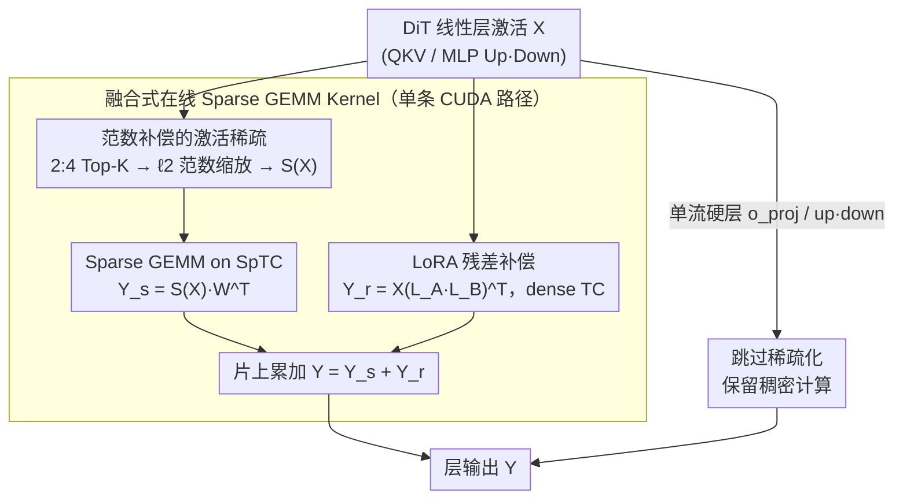

# RT-Lynx: Putting the GEMM Sparsity In a Right Way for Diffusion Models

**会议**: ICML 2026  
**arXiv**: [2605.26632](https://arxiv.org/abs/2605.26632)  
**代码**: 待确认  
**领域**: 模型压缩 / 扩散模型加速 / N:M 稀疏 / CUDA Kernel  
**关键词**: 激活稀疏、2:4 半结构化稀疏、DiT 推理加速、LoRA 误差补偿、Sparse Tensor Core

## 一句话总结
作者发现 DiT 的**激活**比**权重**更天然稀疏（每个 token 只激活 5–10% 通道），于是把 2:4 半结构化稀疏从权重侧搬到激活侧，再用 norm 缩放 + LoRA 残差补偿 + 选择性跳层把质量损失补回来，并写了一套把"在线 Top-K 选择 + Sparse GEMM"融合到单 kernel 的 CUDA 流水，在 Qwen-Image / FLUX / Z-Image 上做到线性层平均 1.55× 加速且 FID/IR 不退化。

## 研究背景与动机

**领域现状**：Diffusion Transformer（DiT）已成为高分辨率图像生成的主流骨架，但每步推理都是 GEMM-dominant 的稠密大矩阵乘，再叠上几十步去噪迭代，延迟和能耗都很难压下来。LLM 领域已经证明 N:M 半结构化稀疏（尤其是 NVIDIA 原生支持的 2:4 模式）是兼顾精度和硬件友好的加速路线，代表方法是 SparseGPT、Wanda、RIA、BaWA、Slim 等，但它们几乎全部在**剪权重**。

**现有痛点**：把这套"剪权重"的范式照搬到 DiT 会直接砸掉生成质量。论文在 Qwen-Image 上做了对照：朴素 2:4 权重稀疏的 FID 从 21.98 暴涨到 51.63，Image Reward 从 1.219 掉到 −0.16，连最新的 Wanda/RIA/BaWA 也只能把 FID 拉回 40 左右；Slim 虽然好一点，但它用了秩 $R=0.1d$ 的 LoRA 补偿，推理开销大。同时，即便选了激活稀疏，**在线**做 Top-K 选择 + 重排格式 + 调 Sparse GEMM 的总开销能吃掉 40–59% 运行时间，理论上的 2× 加速根本落不下来。

**核心矛盾**：DiT 的权重分布近似高斯且元素值"普遍弥散"，根本不具备 2:4 这种局部稀疏结构，强行套就会切掉真正重要的参数；而决定"该剪谁"的，其实是**单个 token 在 FFN 里只激活一小撮神经元**这件事——稀疏性本来就长在激活上而不是权重上。再加上即使转到激活侧，naive 剪枝会让 $\ell_2$ 范数掉一截、高频细节糊掉，online 稀疏化又会被 kernel 调度开销吃掉收益。

**本文目标**：(1) 论证激活稀疏在 DiT 上比权重稀疏天然友好；(2) 设计一套能把质量损失补到"无损"的 sparsification pipeline；(3) 把在线 Top-K + Sparse GEMM 融合到单一 CUDA kernel，让线性层真正跑出 1.5× 以上的端到端加速。

**切入角度**：作者从分布层面观察权重和激活的统计特征——权重元素是 quasi-Gaussian、宽频铺开，没有局部结构；激活则由于 Transformer 的 superposition 现象集中在零附近，只有 ~5–10% 的通道显著激活。基于这点，2:4 这种"每 4 个保留 2 个"的硬约束施加在激活上引入的相对误差远小于施加在权重上。

**核心 idea**：从"剪权重"切到"剪激活"，用 norm 缩放 + 低秩 LoRA 残差把剪掉的能量和高频细节补回来，再用一套融合 Sparse GEMM 的 kernel 把在线开销压到 10% 以下，使理论加速落到端到端 1.2× 左右。

## 方法详解

### 整体框架
RT-Lynx 想解决的是：DiT 线性层 $\mathbf{Y}=\mathbf{X}\cdot\mathbf{W}^{\top}$ 怎么在不掉生成质量的前提下吃到 SpTC 的 2:4 稀疏加速。作者把传统的权重稀疏 $\mathbf{Y}=\mathbf{X}\cdot\mathbf{W}_s^{\top}$ 改写成 $\mathbf{Y}=S(\mathbf{X})\cdot\mathbf{W}^{\top}+\mathbf{X}\cdot(\mathbf{L}_A\mathbf{L}_B)^{\top}$：前一项把稀疏施加在**激活**上（$S(\cdot)$ 是 token 维度的 2:4 Top-K 加 norm 缩放），后一项是一支秩 $R=64$ 的 LoRA 分支，专门把稀疏化丢掉的残差补回来。被稀疏的层是 DiT block 里的 QKV 投影和 MLP 的 Up/Down 投影，单流路径里 LoRA 也救不动的层则直接跳过。整套"在线 Top-K + 格式重排 + Sparse GEMM + LoRA 累加"最后被折叠进一条 CUDA 执行路径，让理论加速真正落到端到端。训练时骨干权重全冻结，只 fine-tune LoRA。

### 关键设计

**1. 范数补偿的激活稀疏（Norm-Compensated Activation Sparsification）：消除"剪枝必掉幅度"的系统性偏置**

naive 的 2:4 Top-K 有个隐患——每个 token 在 4 元素组里只留绝对值最大的两个得到 $\tilde{\mathbf{X}}$，但保留下来这 2 个元素的能量占比不固定，于是 token 输出整体偏小，下游 RMSNorm / Attention 的统计量被系统性地拉偏，FID 直接崩。作者的做法是在剪枝后顺手把向量缩放回原始 $\ell_2$ 范数：算一个缩放系数 $s=\sqrt{\|\mathbf{X}\|_2^2/(\|\tilde{\mathbf{X}}\|_2^2+\epsilon)}$（$\epsilon=10^{-8}$ 防数值崩溃），令 $S(\mathbf{X})=s\cdot\tilde{\mathbf{X}}$。这等于在不改变方向的前提下把幅度对齐到稠密路径，把"系统性偏置"先消掉，剩下的才是真正的近零信息丢失。代价几乎为零——只是一次 reduce 加一次除法，能和 Top-K 塞进同一个 kernel；而收益很大，单这一步就能把 Qwen-Image 的 FID 从 35.85 拉回 25.28。

**2. LoRA 残差补偿：用低秩分支把被剪掉的高频细节捞回来**

范数补偿对齐了幅度，但被丢弃的近零激活仍带走了头发、边缘、纹理这些高频细节。作者用一支低秩分支 $\mathbf{X}(\mathbf{L}_A\mathbf{L}_B)^{\top}$ 专门拟合这部分残差，训练目标直接最小化 $\|\mathbf{X}\mathbf{W}^{\top}-(S(\mathbf{X})\mathbf{W}^{\top}+\mathbf{X}(\mathbf{L}_A\mathbf{L}_B)^{\top})\|^2$，即让"稀疏路径 + LoRA 路径"合起来还原稠密输出；骨干 $\mathbf{W}$ 冻结，只更新 LoRA，推理时 LoRA 在 dense Tensor Core 上算出 $\mathbf{Y}_r$，与 sparse GEMM 的 $\mathbf{Y}_s$ 在芯上累加。关键在于作者论证残差本身是低秩的——绝大多数能量留在 Top-K 保留的通道里，被丢掉的只是细粒度的高频小扰动，所以 $R=64$ 就够，相比 Slim 那种 $R\approx 0.1d$（如 307）的重补偿，额外 GEMM 开销小得多、精度还更高。对单流 DiT 里 LoRA 也补不平的"硬骨头"层（Z-Image 的 `attn.o_proj`/`mlp.up`、FLUX 的 `attn.o_proj`/`mlp.down`），则索性跳过稀疏化保留稠密计算，宁可少加速也不让质量塌。

**3. 融合式在线 Sparse GEMM Kernel：把理论 2× 真正落到端到端**

即便选对了激活稀疏，现有的 PyTorch-SpMM / cuSPARSElt / CUTLASS 把"剪、整理、算"拆成多个 kernel 各自调度，光是 launch overhead 加中间显存读写就吃掉 40–59% 的运行时间，理论上的 2× 根本落不下来。作者把 pattern determination → Top-K → 压缩成 SpTC layout → Sparse GEMM → 与 LoRA 片上累加，整条流水折叠进一条 CUDA 路径：2:4 结构化激活和它的 2-bit index 直接在 register 级生成，不写回 global memory；Sparse GEMM 用 streamK-style 的 block-parallel 流水把 K 维分块流过 SpTC，重叠跨存储层的带宽-延迟；LoRA 分支与 Sparse GEMM 异步并行，$\mathbf{Y}_s$ 算完直接加到 $\mathbf{Y}_r$ 寄存器上，省掉 LoRA 中间张量的物化和一次 host 端同步。本质上是把"算法层的稀疏化"和"硬件层的 SpTC"绑到同一份 register file 上，使在线开销压到 10% 以下、理论 2× 上限可达——实测 Sparse GEMM 加速 1.88×、线性层平均 1.55×、端到端 ~1.2×。

### 损失函数 / 训练策略
只有 LoRA 矩阵 $\mathbf{L}_A,\mathbf{L}_B$ 可训，骨干权重和优化器状态都不更新；训练数据是用 Qwen-Image 在 20k 条用户 prompt 上生成的 prompt-image 对，损失是 MSE 形式的 $\|\mathbf{X}\mathbf{W}^{\top}-\mathbf{Y}\|^2$，约 2k 步收敛。所有训练在 NVIDIA H20 上完成，使用 CUDA 13.0；推理可与 FP8 量化、step 蒸馏、TeaCache、SpargeAttn 等正交叠加。

## 实验关键数据

### 主实验（Qwen-Image 上稀疏策略对比，MJHQ / sDCI）

| 方法 | MJHQ FID↓ | MJHQ IR↑ | sDCI FID↓ | sDCI IR↑ |
|------|-----------|----------|-----------|----------|
| Full (FP16) | 21.98 | 1.219 | 31.15 | 1.172 |
| Sparse Weight (naive 2:4) | 51.63 | −0.16 | 66.91 | −0.22 |
| Sparse Activation (naive 2:4) | 35.85 | 0.599 | 48.59 | 0.472 |
| Wanda (ICLR'24) | 40.81 | 0.536 | 55.61 | 0.325 |
| BaWA (ICML'25) | 39.68 | 0.589 | 54.54 | 0.376 |
| Slim (ICML'25, $R\approx 0.1d$) | 22.25 | 1.278 | 29.26 | 1.217 |
| **RT-Lynx (Ours, $R=64$)** | **21.25** | **1.304** | **25.78** | **1.226** |

RT-Lynx 是唯一在两个数据集上 FID 和 IR 都**优于 FP16 稠密基线**的稀疏方法，而 LoRA 秩只有 Slim 的不到 1/5。

### Kernel 与端到端加速（H20，部分矩阵尺寸为 Qwen-Image 实际用到的）

| $M{=}N$ | $K$ | PyTorch GEMM | cuSPARSElt | RT-Lynx Kernel | 在线稀疏开销 |
|---------|-----|--------------|-----------|----------------|--------------|
| 4096 | 3072 | 0.781 ms | 0.709 (1.10×) | 0.465 (**1.68×**) | 4.60% |
| 4096 | 12288 | 3.099 ms | 2.669 (1.16×) | 1.652 (**1.88×**) | 4.83% |
| 8192 | 12288 | 11.95 ms | 8.202 (1.45×) | 6.754 (**1.77×**) | 2.37% |

端到端：Qwen-Image 每张图 0.75s → 0.62s（1.21×）；与 8-step Turbo 蒸馏叠加后 Z-Image 达到 11.86× 总加速（单独 Turbo 为 9.91×）；与 W8A8、TeaCache、SpargeAttn 叠加均保持 1.3× 左右的额外加速。

### 消融实验（Qwen-Image / FLUX / Z-Image，节选）

| 模型 | 配置 | MJHQ FID↓ | MJHQ IR↑ | 说明 |
|------|------|-----------|----------|------|
| Qwen-Image | SA-Native | 35.85 | 0.599 | 只激活稀疏，无补偿 |
| Qwen-Image | + Norm Comp. | 25.28 | 0.939 | 范数补偿单独贡献 ~10 FID |
| Qwen-Image | + LoRA ($R=64$) | **21.25** | **1.304** | LoRA 进一步抹平剩余 gap，反超 Full |
| FLUX.1-dev | SA-NC-LoRA | 22.61 | 0.978 | 双流补偿足够 |
| FLUX.1-dev | + Skip Layers | **21.17** | **1.011** | 单流路径补一刀跳层 |
| Z-Image | SA-NC-LoRA | 27.39 | 0.929 | LoRA 没完全够 |
| Z-Image | + Skip Layers | **26.17** | **0.967** | 跳 `o_proj`/`up` 单流层后接近 Full（25.70） |

### 关键发现
- 三大补偿（范数缩放 / LoRA / 选择性跳层）贡献由大到小：LoRA > Norm Comp. > Skip Layer；但**对单流 DiT（FLUX、Z-Image），跳层不可省**，否则 LoRA 也补不平。
- 在线稀疏开销占比从 PyTorch/cuSPARSElt 的 40–59% 压到 **<10%**，是端到端加速能不能落地的决定性因素。
- RT-Lynx 与 W8A8 量化、step 蒸馏、TeaCache、SpargeAttn 全部正交可叠：8-step Turbo + RT-Lynx 在 Z-Image 上做到 11.86× 端到端加速；权重稀疏在 8-step 模型上 FID 直接崩到 360.2，而 RT-Lynx 几乎无损。
- 单看 GEMM，RT-Lynx Kernel 在 $4096\times 4096\times 12288$ 上跑出 1.88× 加速，几乎逼近 SpTC 的 2× 理论上限。

## 亮点与洞察
- "把稀疏放到该放的地方"这句话说得很到位：作者用 Figure 2 直接给出权重 vs 激活的分布对照，论证 2:4 不该硬套权重；这是把 LLM 圈里早就有的 superposition 观察（FFN 神经元只有少数被激活）第一次系统性地迁移到 DiT 加速。
- 范数补偿是个几乎零成本的小技巧但作用很大——单独加上去就能把 Qwen-Image 的 FID 从 35.85 拉回 25.28，比很多复杂的权重剪枝方法都强；这套"剪完再 rescale 回原范数"的思路可以直接迁移到任何 token-wise 稀疏场景（含 LLM decoding、视频 DiT）。
- LoRA 残差补偿的真正价值不在"能补回来"，而在**把残差证明为低秩**：$R=64$ 就够 Qwen-Image，意味着 sparsification 丢掉的信息确实是稀疏-低秩的近零扰动，不是密集分布的能量。这给后续"剪枝 + 极小 LoRA 修补"开了一条通用路。
- Kernel 这块的核心创新不在 GEMM 本身，而在**把在线 Top-K + 格式重排 + Sparse GEMM + LoRA 累加塞进同一条 register 流水**——这才是让理论 2× 真正落到端到端 1.2× 的关键，是稀疏研究里少有的"算法 - 系统协同设计"完整案例。
- "正交可叠"被认真验证过：与量化/蒸馏/缓存/稀疏注意力全部 +1.3× 左右地叠加，意味着 RT-Lynx 真能作为 DiT 推理栈里的一块独立加速积木。

## 局限与展望
- 论文承认对单流 DiT（FLUX、Z-Image）必须靠**手工挑选要跳的层**（`attn.o_proj` / `mlp.up` 或 `mlp.down`），而且不同模型的跳层 list 不一样，缺乏一个原则性的"哪些层不能稀疏"的判据；规模再大或换架构后这套 list 是否还成立未知。
- 评估仍集中在 H20 这一张卡的 SpTC 上，对 H100/B200 上 FP8/FP4 + 2:4 的组合、对消费级卡（无 SpTC，如 RTX 4090）退化到 PyTorch-SpMM 的实际加速没有数据；硬件依赖明显。
- 数据集仍是 MJHQ-30K + sDCI 这种 prompt 集合，FID/IR/CLIP-IQA/CLIP-Score 四个指标对"细节糊"的敏感度有限；论文里也只展示了几张样例图，对人脸、文字、复杂场景这些 sparsification 最容易翻车的 case 缺少系统化的失败模式分析。
- 训练数据是用 Qwen-Image **自己**生成的 20k prompt-image 对来 fit LoRA，等于"用模型蒸馏自己"，跨模型迁移（例如用 Qwen-Image 的数据训出来的 LoRA 配方能不能直接灌到一个新出的 DiT 上）没验证。
- 仅稀疏到 2:4（50% 稀疏度）。若硬件支持 4:8 甚至 1:4 的更激进稀疏，激活侧能撑到哪一档、补偿配方要不要重设计，是自然的下一步。

## 相关工作与启发
- **vs SparseGPT / Wanda / RIA / BaWA / Slim**：这些方法都在剪**权重**，靠校准统计或敏感度估计选 mask；RT-Lynx 直接证明权重在 DiT 上不具备 2:4 结构，把战场切到激活侧，且补偿只用 $R=64$ 的 LoRA 就反超 Slim 的 $R\approx 0.1d$ 配置——精度和效率同时改善。
- **vs LLM 激活稀疏（PowerInfer / CATS / ReLU-strikes-back / Q-Sparse / RoSA）**：这些主要服务于 LLM **decoding**（token 数 ≤ 4），剪掉的是与稀疏激活对应的权重通道，无法直接套用到 token 数 >1000 的 DiT 图像生成；RT-Lynx 是第一篇把激活稀疏做成 DiT 推理加速的工作。
- **vs Amber / Haziza et al.**：Amber 用 8:16 模式但当前 GPU 不原生支持；Haziza et al. 在 LLM **预训练**里只对 FFN 做激活稀疏，且只走 LLM 路线；RT-Lynx 是首个对原生 2:4 + DiT + 端到端 kernel 全做完的方案。
- **vs DiT 加速另一条线（SVDQuant、DMD2、TeaCache、TaylorSeer、SLA、VSA）**：那些分别在量化、蒸馏、特征缓存、稀疏注意力上做文章，RT-Lynx 显式定位为 GEMM-dominant 线性层加速，并实验证明可以与上述全部方法正交叠加。
- **启发**：(1) 在判断"在哪里加稀疏约束"之前先做一次分布分析（distribution + induced error）是个值得套用的范式；(2) "范数补偿 + 低秩残差"这套两段式补偿适用于所有 hard mask 类的有损压缩（剪枝/量化/cache 剔除）；(3) 算法和 kernel 必须协同设计，否则理论加速很难落地——这点对所有研究稀疏/低秩压缩的人都是警钟。

## 评分
- 新颖性: ⭐⭐⭐⭐ 把"激活才是 DiT 真稀疏来源"这一观察讲透并完整落到 kernel 上，路线清晰但单点 idea（激活稀疏 + LoRA 补偿）在 LLM 圈已有先验。
- 实验充分度: ⭐⭐⭐⭐⭐ 三个主流 DiT、四个质量指标、消融逐项拆开、与四类正交加速方法叠加、Kernel 级 + 端到端两层 benchmark 都覆盖。
- 写作质量: ⭐⭐⭐⭐ 动机图（Figure 1/2）和算法图（Figure 4/5）都很到位，但部分文字稍显工程报告体；附录信息密度大，正文略短。
- 价值: ⭐⭐⭐⭐⭐ 是少数能在 SpTC 上把理论稀疏加速真正落到端到端 ~1.2× 且无损的 DiT 加速方案，对工业部署直接可用；与现有加速栈正交，落地路径清晰。

<!-- RELATED:START -->

## 相关论文

- [\[CVPR 2026\] Semantics Lead the Way: Harmonizing Semantic and Texture Modeling with Asynchronous Latent Diffusion](../../CVPR2026/image_generation/semantics_lead_the_way_harmonizing_semantic_and_texture_modeling_with_asynchrono.md)
- [\[ECCV 2024\] Getting it Right: Improving Spatial Consistency in Text-to-Image Models](../../ECCV2024/image_generation/getting_it_right_improving_spatial_consistency_in_text-to-image_models.md)
- [\[CVPR 2026\] SparVAR: Exploring Sparsity in Visual Autoregressive Modeling for Training-Free Acceleration](../../CVPR2026/image_generation/sparvar_exploring_sparsity_in_visual_autoregressive_modeling_for_training-free_a.md)
- [\[CVPR 2025\] Panorama Generation From NFoV Image Done Right](../../CVPR2025/image_generation/panorama_generation_from_nfov_image_done_right.md)
- [\[AAAI 2026\] Right Looks, Wrong Reasons: Compositional Fidelity in Text-to-Image Generation](../../AAAI2026/image_generation/right_looks_wrong_reasons_compositional_fidelity_in_text-to-image_generation.md)

<!-- RELATED:END -->
