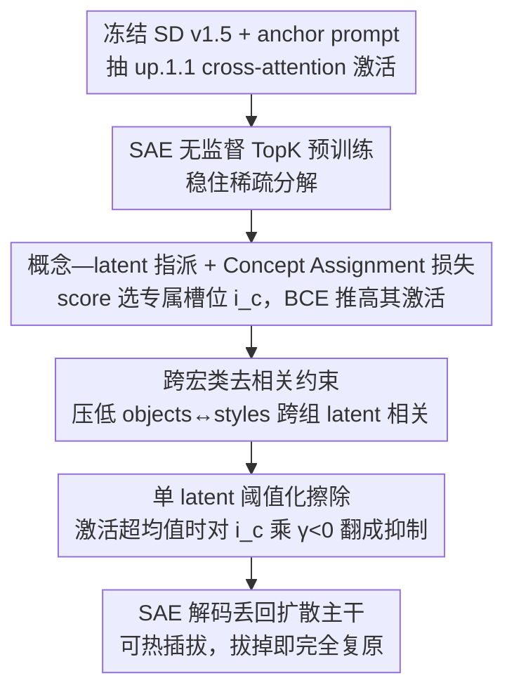

# SAEmnesia: Erasing Concepts in Diffusion Models with Supervised Sparse Autoencoders

**会议**: ICML 2026  
**arXiv**: [2509.21379](https://arxiv.org/abs/2509.21379)  
**代码**: https://github.com/EIDOSLAB/SAEmnesia  
**领域**: AI 安全 / 概念遗忘 / 扩散模型可解释性  
**关键词**: 概念擦除, 稀疏自编码器, 监督训练, 特征中心化, 扩散模型

## 一句话总结
通过在稀疏自编码器（SAE）训练阶段加入监督的"概念—潜变量"指派损失，强制每个目标概念集中到单个神经元（feature centralization），从而把扩散模型的概念擦除从"搜多神经元 + 调强度"的二维超参搜索压成"只调一个 multiplier"，在 UnlearnCanvas 上比 SOTA 的 SAeUron 平均提升 9.22 个点，超参搜索代价降低 96.67%，并对对抗攻击更鲁棒。

## 研究背景与动机

**领域现状**：文生图扩散模型（SD 系列）的安全部署需要"概念遗忘"——选择性地抹掉裸露、版权角色、特定物体等不希望生成的概念，同时保留模型其他生成能力。目前主流路线分两类：(i) 微调整模型权重（ESD、UCE、SalUn 等）；(ii) 不改权重，借助稀疏自编码器（SAE）在 cross-attention 激活上做机制式干预（Concept Steerers、SAeUron），后者优点是**可逆**（拔掉 SAE 模型完全恢复）且具备可解释性。

**现有痛点**：SAE 路线的最强代表 SAeUron 用**无监督**方式训练 SAE，导致 *feature splitting*——同一个概念（如"Bears"）分散在多个潜变量上。要擦掉它必须：(1) 在数千个潜变量里搜索"哪几个组合是 Bears"，文献里实测要枚举 30 种 latent 子集 × 7 种强度 = 210 次评估；(2) 多个潜变量之间还会和相邻概念交叠，干预时容易误伤"Cats"等相关概念。

**核心矛盾**：无监督 SAE 学出的 monosemanticity（一个神经元只对一个概念敏感）和 one-to-one（一个概念只对应一个神经元）这两个性质并不天然成立，后者长期缺失。没有 one-to-one，机制式干预就必须做组合搜索，可解释性也只是事后归因。

**本文目标**：在保留 SAE 重建质量的前提下，**训练时**就把每个待擦除概念绑定到唯一一个 latent 上，让推理阶段的擦除退化为"对一个标量乘负数"。

**切入角度**：扩散训练时其实**已经有现成的监督信号**——生成时用的 anchor prompt（如 `An image of Bears`）天然带概念标签。把这个信号塞回 SAE 训练，比事后用 score function 去对齐要直接得多。

**核心 idea**：在标准 TopK SAE 损失上加两项监督损失——Concept Assignment 损失把每个概念的激活推到一个指定 latent，Decorrelation 损失把不同宏类（objects vs. styles）的 latent 激活之间的相关性压低，从而把"特征分裂"扼杀在训练阶段。

## 方法详解

### 整体框架

SAEmnesia 把一个稀疏自编码器挂在冻结的 Stable Diffusion v1.5 的 cross-attention block `up.1.1` 之后，要拆掉的痛点是"无监督 SAE 会把一个概念摊在多个 latent 上、擦除时不得不做组合搜索"。它的转法是在 SAE 训练阶段就用 anchor prompt 自带的概念标签做监督，把每个待擦概念硬绑到唯一一个 latent，于是推理时的擦除退化成"对那一个 latent 的激活乘个负标量"。整个 SAE 可热插拔、扩散主干一字不改，"忘记—恢复"一行代码切换。

### 关键设计

**1. 监督的概念—latent 指派与 Concept Assignment 损失：把事后归因前移成训练时硬约束**

无监督 SAE 的 feature splitting 来自训练时根本没人告诉模型"哪个 latent 该编码哪个概念"，只能等训练完用 score function 去事后归因。SAEmnesia 把这个 score function 直接搬进训练：先用 SAeUron 的 $\text{score}(i,t,c,D) = \frac{\mu(i,t,D_c)}{\sum_j \mu(j,t,D_c)+\delta} - \frac{\mu(i,t,D_{\neg c})}{\sum_j \mu(j,t,D_{\neg c})+\delta}$ 度量 latent $i$ 对概念 $c$ 的"专属性"（在概念样本集 $D_c$ 里相对激活高、在补集 $D_{\neg c}$ 里相对激活低），取 score 最大者作为该概念的指定槽位 $i_c$；训练时对每个含概念 $c$ 的样本加 $\mathcal{L}_{\text{CA}} = -\frac{1}{B}\sum_b \frac{1}{|\mathcal{T}^{(b)}|}\sum_{c \in \mathcal{T}^{(b)}} \log \sigma(v^{(b)}_{i_c})$，本质是对指派 latent 的预激活值 $v_{i_c}$ 做 BCE，逼它在该概念出现时强烈点亮。妙处在于这股压力只施加在"概念出现的样本 × 该概念对应的 latent"这一极小集合上，是一种局部稀疏监督，不会扰动其余 latent 的无监督表征，所以能叠在标准 SAE 损失之上而不伤重建质量——消融里它带来的 score 峰值 2.43× 提升，正是后续顺序、对抗、效率三条收益的源头。

**2. 跨宏类去相关约束（Decorrelation Constraint）：只在用户语义粒度上拆开"共振"**

光把概念绑到单个 latent 还不够，不同宏类的指派 latent 仍可能在同一 batch 内一起亮——比如 Bears 的 latent 总和 Cubism 的 latent 同步激活，擦物体时就会牵连风格。为此把概念集划成不相交宏类 $\mathcal{C} = \bigcup_m \mathcal{C}_m$（论文就两组：objects 与 styles），对每个 latent 在 mini-batch 内的激活向量 $\mathbf{a}_c = [v_{i_c}^{(1)}, \dots, v_{i_c}^{(B)}]^\top$ 算 Pearson 相关系数 $\rho$，用 $\mathcal{L}_{\text{DC}} = \frac{\sum_{m<m'} \sum_{i\in\mathcal{I}_m, j\in\mathcal{I}_{m'}} \rho(\mathbf{a}_i, \mathbf{a}_j)}{\sum_{m<m'}|\mathcal{I}_m||\mathcal{I}_{m'}|}$ 只惩罚**跨组** latent 对的相关性。之所以不做全 pairwise 去相关，是因为 "Cats" 和 "Dogs" 本就该相关，强行打散会破坏自然语义；只在宏类粒度去相关既保留组内相似度，又把"擦物体别动风格"这种实际诉求直接写进 loss——代价是同宏类内的干扰（within-group interference）被刻意放过，这也是论文坦承的未解遗留。两项监督汇成 $\mathcal{L}_{\text{supSAE}} = \mathcal{L}_{\text{CA}} + \eta \mathcal{L}_{\text{DC}}$。

**3. 单 latent 阈值化擦除：把删除压成一次"只在真激活时生效"的标量乘法**

绑定完成后，推理阶段对指派 latent $i_c$ 执行 $z_{i_c} = \gamma_c\, \mu(i_c, t, D_c)\, z_{i_c}$，但**当且仅当** $z_{i_c} > \mu(i_c, t, D)$（当前激活超过全体样本的平均激活）时才触发，否则原样放过。其中 $\gamma_c < 0$ 是全流程唯一的可调超参，$\mu(i_c,t,D_c)$ 是验证集上该概念样本的平均激活、起归一化作用。这个阈值是精准度的隐藏护栏：score 静态偏高并不代表"此刻这一去噪步、这一空间位置确实在画 Bears"，加上阈值后只在概念真的在被表达时才动手，把误伤降到最低；而 $\mu(i_c,t,D_c)$ 的归一化让 $\gamma_c$ 在不同概念间共用统一量纲，论文里 $\gamma_c=-1$ 一个值就能稳定覆盖全部 20 类物体（Figure 3）。还可选择只在后 25 步 denoising 开启干预，前期保留预训练先验以减少 artifact。

### 损失函数 / 训练策略

完整目标为 $\mathcal{L}_{\text{SAEmnesia}} = \mathcal{L}_{\text{unsupSAE}} + \beta(\mathcal{L}_{\text{CA}} + \eta \mathcal{L}_{\text{DC}}) + \lambda \mathcal{L}_{L_1}$，分两段训练：先纯无监督 TopK SAE 预训练（重建损失 + 防 dead latent 的辅助损失）稳住稀疏分解，再开启监督项 finetune 强化绑定。激活取自 SD v1.5 的 `up.1.1` cross-attention，每个 timestep 都参与训练；UnlearnCanvas 上指派 70 个概念（20 objects + 50 styles）。

### 一个完整示例

以擦除 "Bears" 为例走一遍：用 80 条 anchor prompt（`An image of Bears`）让 SD 跑完 50 步 denoising，从 `up.1.1` 抽出 cross-attention 特征图 $\mathbf{F}_t \in \mathbb{R}^{h\times w\times d}$，把每个空间位置的 $d$ 维向量当作一个 SAE 样本并打上 object 标签；先无监督预训练得到稀疏分解后，用 score function 扫出 Bears 专属性最高的 latent $i_{\text{Bears}}$，CA 损失在每张含 Bears 的样本上把 $i_{\text{Bears}}$ 的激活往高推，DC 损失同时压低它与 Cubism 等 style latent 的跨组相关；部署时只需对 $i_{\text{Bears}}$ 设 $\gamma=-1$，推理中凡 $z_{i_{\text{Bears}}}>\mu$ 的激活就乘 $-\mu$ 翻成抑制、再经 SAE 解码丢回扩散主干——模型从此画不出熊，却对 Cats、Dogs 乃至所有风格毫发无伤，拔掉 SAE 即完全复原。

## 实验关键数据

### 主实验

UnlearnCanvas 物体擦除（百分比，越高越好；UA = Unlearning Accuracy，IRA/CRA = In-/Cross-domain Retain Accuracy）：

| 方法族 | 方法 | UA ↑ | IRA ↑ | CRA ↑ | Avg ↑ |
|--------|------|------|-------|-------|-------|
| Fine-tune | ESD | 92.15 | 55.78 | 44.23 | 64.05 |
| Fine-tune | SalUn | 86.91 | 96.35 | 99.59 | 94.28 |
| Adapter | SPM | 71.25 | 90.79 | 81.65 | 81.23 |
| SAE 无监督 | SAeUron | 87.16 | 85.57 | 74.14 | 82.29 |
| **SAE 监督** | **SAEmnesia** | **94.65** | 91.39 | 88.48 | **91.51** |

相对 SAE 家族 SOTA SAeUron：UA +7.49、IRA +5.82、CRA +14.34、Avg **+9.22**。SalUn 在单纯物体上 Avg 更高，但论文 Appendix 表 15 显示一旦把 style 擦除算进来 SAEmnesia 综合 94.85% 反超。

### 消融 / 关键分析

| 配置 / 场景 | 关键指标 | 说明 |
|-------------|----------|------|
| 超参搜索代价 | 7 vs. 210 次评估 | SAeUron 需 $m=7$ multiplier × $l=30$ latent 组合；SAEmnesia 只调 $m$，降 96.67% |
| 顺序擦除 9 个物体 | UA 92.4% vs. 64.0% (baseline) | +28.4 点；保留精度 RA 60.9% vs. 48.4% |
| 白盒攻击 UnlearnDiffAtk | 攻后 UA 57.50% vs. 34.20% | 攻前→攻后掉 40.1 点，SAeUron 掉 49.5 点 |
| 黑盒攻击 Ring-A-Bell | 攻后 UA 97.0% vs. 79.5% | 鲁棒性优势跨威胁模型成立 |
| NSFW 抑制（I2P, SD v1.4） | 9 例检出 vs. SAeUron 18 例 | 仅用 2 个 latent（"naked man"/"naked woman"） |
| K-NN on top-1 latent | 接近"用全部 latent" | 验证概念信息真的浓缩到单个 latent |
| Feature score 分布（Flowers） | 0.0404 vs. 0.0166 | 监督训练后 score 峰值 2.43× 提升 |

### 关键发现

- **CA 损失是擦除性能的主要贡献者**：score 峰值 2.43× 是所有下游收益的根源，没有 feature centralization 后面三条路（顺序、对抗、效率）都建立不起来。
- **去相关只在宏类粒度起作用**：作者明确说明同一宏类内（如 Dogs vs. Cats）的干扰仍未解决，是限制项里的明确遗留。
- **对抗鲁棒性的"溢出收益"**：one-to-one 让对抗 prompt 必须精确打中那个 latent，攻击面变窄；这并不是论文显式优化的目标，但天然出现。
- **uniform multiplier 也稳定**：Figure 3 表明 SAEmnesia 在 $\gamma_c$ 取全域同值时仍优于 SAeUron 在最优搜索下的表现——说明"为每个概念精调 $\gamma$"的需要被大幅削弱。

## 亮点与洞察

- **把"事后归因"前置成"训练时硬约束"**：SAE 社区长期把 monosemanticity 当成训练后的解释指标，本文证明它可以作为训练目标直接优化，且不破坏重建——这是把机制可解释性从"观察工具"升级为"控制工具"的关键一步。
- **"概念—latent" 的 1:1 不只是干净，而是把搜索空间从乘法降到加法**：$m\times l$ → $m$ 的差异在概念数量上线性放大，9 个物体顺序擦除时 SAEmnesia 比 baseline 高 28.4 个点的本质就是组合爆炸被砍掉了。
- **激活阈值化护栏**：`if $z_{i_c} > \mu(i_c, t, D)$` 这个判断看似工程细节，实则把"score 静态高"和"当前 forward 中确实在表达"解耦，是擦除精准度的隐藏关键——值得借鉴到其他基于 latent steering 的可控生成工作。
- **macro-group 去相关的取舍**：作者只对 objects vs. styles 这种"用户语义粒度对齐"的宏类去相关，而不是全 pairwise 去相关——这种"按下游需求而非数据分布去相关"的思路可以直接迁移到多任务 SAE、模块化 LoRA 等场景。

## 局限与展望

- 作者承认的局限：(1) 只在 U-Net 上验证，FLUX 等 transformer-based 扩散需架构适配；(2) closed-vocabulary，新增概念需要重新算 score（不重新训练 SAE 时只能用与 SAeUron 一样的事后绑定，少一层一致性保证）；(3) **within-group interference**（如 Dogs vs. Cats）仍未解决；(4) scalability 在 20K+ 概念时 latent 容量和稳定指派都会成为瓶颈。
- 我方补充：训练分两阶段（无监督 + 监督 finetune），意味着实际部署要维护两版 SAE checkpoint，存储/工程成本被低估；论文里也只在 `up.1.1` 一个 block 做了 SAE，跨 block 的 concept 表征如何选/合并完全没讨论。
- 改进思路：(1) 把概念间相似度（CLIP 嵌入余弦）作为 pairwise DC 权重，缓解 within-group interference；(2) 在 transformer-based 扩散上把 SAE 接到 MM-DiT 的 modulation 输出做联合 supervision；(3) 对 closed-vocabulary 限制，可以把 SAE 设计成"基座 latent + 概念专用 latent"两段式，新增概念时只 finetune 后者。

## 相关工作与启发

- **vs SAeUron**：同样用 SAE 在 cross-attention 激活上做擦除，区别是 SAeUron 完全无监督，依赖事后 score function 找概念，导致 feature splitting；SAEmnesia 把 score 直接搬进训练 loss。SAEmnesia 在 UnlearnCanvas Avg 上 +9.22 点，超参搜索压 96.67%，且擦除可逆性、推理成本、对抗鲁棒性全面占优。
- **vs Concept Steerers (Kim & Ghadiyaram)**：Concept Steerers 在 text embedding 上训 SAE，作用点在 cross-attention 之前；SAEmnesia 在 cross-attention 之后的视觉路径上干预，对绕过 text encoder 的对抗攻击（Ring-A-Bell 等）更鲁棒。
- **vs SalUn / ESD / UCE 等微调路线**：微调路线要改主干权重，不可逆且容易牵连下游能力；SAEmnesia 完全不改权重，只挂一个可插拔的 SAE，从安全部署角度更可控（出错可拔，可审计单 latent 的语义）。
- **vs ScaPre（顺序擦除专用方法）**：ScaPre 用 spectral trace 正则化处理顺序遗忘的 concept interference；SAEmnesia 不专门设计顺序擦除，仅靠 one-to-one 性质天然支持 9 个物体顺序擦除 UA 92.4% 的可加性，给出"先解决表示再解决调度"的另一条路。

## 评分
- 新颖性: ⭐⭐⭐⭐ 把监督信号引入 SAE 训练实现 feature centralization 是 SAE-based 擦除领域的清晰跨越，但单点创新落在 loss 设计上，并未触及 SAE 架构本身
- 实验充分度: ⭐⭐⭐⭐ UnlearnCanvas + I2P + 白盒/黑盒对抗 + 顺序擦除四线证据互相印证，但只在 SD v1.5/1.4 上验证，新一代架构泛化性留白
- 写作质量: ⭐⭐⭐⭐ 动机—方法—证据链清晰，公式编号严谨，limitations 写得诚实
- 价值: ⭐⭐⭐⭐⭐ 把"机制式擦除"从研究 demo 推到了可工程化部署的门槛（一个 latent、一次乘法、可热插拔、可审计），对生成模型合规化有直接价值

<!-- RELATED:START -->

## 相关论文

- [\[CVPR 2026\] Interpretable and Steerable Concept Bottleneck Sparse Autoencoders](../../CVPR2026/image_generation/interpretable_and_steerable_concept_bottleneck_sparse_autoencoders.md)
- [\[CVPR 2026\] Erasing Thousands of Concepts: Towards Scalable and Practical Concept Erasure for Text-to-Image Diffusion Models](../../CVPR2026/image_generation/erasing_thousands_of_concepts_towards_scalable_and_practical_concept_erasure_for.md)
- [\[ICML 2026\] Skipping the Zeros in Diffusion Models for Sparse Data Generation](skipping_the_zeros_in_diffusion_models_for_sparse_data_generation.md)
- [\[NeurIPS 2025\] When Are Concepts Erased From Diffusion Models?](../../NeurIPS2025/image_generation/when_are_concepts_erased_from_diffusion_models.md)
- [\[NeurIPS 2025\] Learning Interpretable Features in Audio Latent Spaces via Sparse Autoencoders](../../NeurIPS2025/image_generation/learning_interpretable_features_in_audio_latent_spaces_via_sparse_autoencoders.md)

<!-- RELATED:END -->
