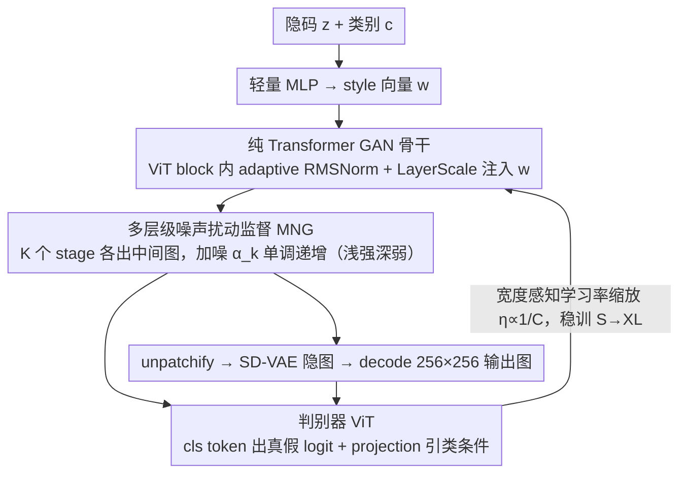

# Scalable GANs with Transformers

**会议**: ICML2026  
**arXiv**: [2509.24935](https://arxiv.org/abs/2509.24935)  
**代码**: https://hse1032.github.io/GAT (有，项目页)  
**领域**: 图像生成 / GAN / Transformer  
**关键词**: GAN 可扩展性、Transformer 生成器、VAE 隐空间、单步生成、ImageNet 类条件生成

## 一句话总结
本文提出 GAT（Generative Adversarial Transformers）——一套在 VAE 隐空间上用纯 Transformer 生成器与判别器搭起来的可扩展 GAN 框架，通过多层级噪声扰动监督（MNG）激活早期生成器层、并用宽度感知的学习率缩放稳定大模型训练，使 GAT-XL/2 在 ImageNet-256 类条件生成上仅训练 60 epoch 就拿到 FID 2.18 的单步生成 SOTA，比同等规模 1-NFE diffusion/flow baseline 少用 4× epoch。

## 研究背景与动机

**领域现状**：近年来生成模型的飞跃几乎都建立在"可扩展性"之上——只要把模型容量、数据量、算力堆上去，性能就近乎单调上升。Diffusion（DiT、SiT）和自回归（VAR、MAR）这两条路线已经反复验证了这条 scaling law：用纯 Transformer 主干 + VAE 隐空间训练，就能稳定地从小模型推到几十亿参数级别。

**现有痛点**：唯独 GAN 这条线，scalability 一直没人系统地讨论过。已有的"大 GAN"工作（GigaGAN、StyleGAN-XL、R3GAN）都是把单一高容量模型针对特定任务精细调参堆出来的，并不能算作"GAN 也能 scale"的证据。而 GAN 又恰恰有 diffusion 没有的优势——单步推理 + 语义可操控的低维隐空间——所以把 GAN 做大是有价值的。

**核心矛盾**：把成熟的 scalable 配方（VAE 隐空间 + 纯 Transformer）直接搬到 GAN 上，naive scaling 会暴露两个失败模式：(1) 生成器**早期层基本不工作**——PCA 可视化显示前几个 block 的特征几乎不变，消融早期 block 对最终图像的 LPIPS 影响也微乎其微，意味着扩容带来的算力大部分被浪费；(2) 同一套超参（尤其是学习率）从 S 推到 XL 时**训练发散**——GAN 本就对学习率极敏感，而 Transformer 加宽后每步输出变化幅度会随通道数线性增长，导致大模型在原配 lr 下直接崩。

**本文目标**：搞清楚 GAN 在"VAE 隐空间 + 纯 Transformer"这条架构上能不能 scale，并针对上述两个具体障碍给出最小化的修复方案。

**切入角度**：作者把 GAN scaling 拆成"架构端"和"优化端"两个独立问题分别治。架构端用辅助监督把闲置的早期层"叫醒"；优化端用一条简单的 lr 缩放公式把不同尺寸模型的有效更新幅度对齐，避免逐尺度调参。

**核心 idea**：用**多层级噪声扰动监督（MNG）** 让生成器中间层都吐出图像并接受判别器审查，强制各层分工做粗到细的 refinement；同时用 $\eta_{\text{adapt}} = \eta_{\text{base}} \cdot C_{\text{base}} / C_{\text{model}}$ 的宽度感知 lr 规则，让从 S 到 XL 共用同一套基础超参也能稳定收敛。

## 方法详解

### 整体框架
GAT 想回答的问题很直接：把 diffusion 社区验证过的可扩展配方——VAE 隐空间加纯 ViT——原样搬到 GAN 上，GAN 能不能跟着一起 scale。它的答案是一个生成器和判别器都是标准 ViT 的隐空间 GAN：随机隐码 $z\sim p_z$（$d_z=64$）和类别 $c$ 经轻量 MLP 映成 style 向量 $w$，由 $w$ 在每个 ViT block 里通过 adaptive RMSNorm + LayerScale 注入 modulation，最后一个 unpatchify 线性头把 token 序列还原成 SD-VAE 的 $32\times 32$ 隐图、再 decode 成 $256\times 256$ 图像，整条链路单次前向就出图。判别器是另一个 ViT，用 `[cls]` token 走线性头出真假 logit、配 projection discriminator 引类别条件。作者把"GAN 能否 scale"拆成正交的两端分别治：架构端只保证骨干贴近原始 ViT，闲置的早期层交给 MNG 叫醒；优化端用一条宽度感知 lr 公式把不同尺寸模型的更新幅度对齐。

### 关键设计

**1. VAE 隐空间上的纯 Transformer GAN 骨干：把架构改动压到最低，好继承 ViT 的 scalability**

痛点在于，以往的 Transformer-GAN（TransGAN、HiT 等）为了能训出来塞进了大量非 ViT 的改造，结果反而把 Transformer 本身的 scaling 优势破坏掉了。GAT 的做法是反着来——尽量不动骨干：生成器把常规的 patchify 换成 unpatchify 当作线性 RGB 解码头，输出维度随 $p^2$ 增长；ViT block 内部只额外插入一个由 style 向量 $w$ 驱动的 adaptive RMSNorm + LayerScale，其中调制参数 $\gamma, \alpha$ 初始化接近零、训练中再慢慢学起来，保证早期训练不被 modulation 冲乱。判别器同样只把 `[cls]` token 拼到 patch token 序列前一起过 ViT，末层 `[cls]` 投影出 logit。所有 modulation 都被刻意做成"轻量级 feature modulation"，目的就是让骨干尽量像原始 ViT，从而把 ViT 已被反复验证的 width/depth/data/compute 四维 scalability 整建制继承过来，把 GAN 特有的麻烦留给后面两个独立模块去解。

**2. 多层级噪声扰动监督 MNG：叫醒闲置的早期层，又不给判别器留 shortcut**

作者实证发现 vanilla GAT 的早期 block PCA 特征几乎不变、消融早期 block 对最终图像的 LPIPS 影响也微乎其微——扩容堆上去的算力大部分被浪费在不工作的浅层上。MNG 的修法是把生成器分成 $K$ 个 stage，每个 stage 经 residual 累积出一张中间图像 $\hat{x}_k$，整体输出写成 $G(z,c)=[\hat{x}_1,\hat{x}_2,\dots,\hat{x}_K]$，让判别器直接审查每一层的中间产物，从而给每层都灌进 per-layer 梯度。关键在审查方式：每个 $\hat{x}_k$ 被加上预设强度的高斯噪声 $\mathcal{E}(\hat{x}_k)=\alpha_k\hat{x}_k+\sqrt{1-\alpha_k^2}\,\epsilon$，其中 $\alpha_1<\alpha_2<\dots<\alpha_K=1$ 按指数 schedule 单调递增——越浅的中间输出被加越强的噪声、越深的越接近干净。这样浅层只被要求"在强噪声下对上粗结构"、深层才负责精细细节，自然形成 coarse-to-fine 的分工。之所以用"单图加多噪声水平"而不是 MSG-GAN 那种 resize 多尺度真图，是因为多尺度监督会让判别器钻"跨尺度一致性"的空子，靠这种 shortcut 偷懒反过来压制 G 的生成质量；换成噪声扰动后判别器无 shortcut 可走，且只是中间多接几个轻量 head，计算开销可忽略。

**3. 宽度感知学习率缩放：一套基础超参稳训 S 到 XL，免去逐尺度手调**

GAN 对学习率极度敏感，naive scaling 时同一套 lr 从 S 推到 XL 经常直接发散——如果每个尺度都要手调 lr，"scalable GAN"就名不副实。作者从一个朴素观察切入：ViT 每层输入被 normalization 归一化到单位方差后，其期望平方范数与通道数 $C$ 成正比，于是每步参数更新引起的输出变化幅度也与 $C$ 成正比。要让"每步输出更新幅度"在不同宽度下大致一致，lr 就该反比于通道数，公式为 $\eta_{\text{adapt}}=\eta_{\text{base}}\cdot C_{\text{base}}/C_{\text{model}}$，其中 $\eta_{\text{base}}$ 是在通道数 $C_{\text{base}}$ 的 base 模型上调好的学习率、$C_{\text{model}}$ 是当前模型通道数，除 lr 外的 batch size / 优化器 / loss 权重等全部不变。ablation 把它验得很死：GAT-S 套 GAT-B 的 $\eta_{\text{adapt}}$ 会发散、GAT-B 套 GAT-S 的会收敛过慢，只有各自用对的 $\eta_{\text{adapt}}$ 才稳。这条规则还能与大 batch 的 $\sqrt{}$-scaling 正交组合——$4\times$ batch 配 $\sqrt{4}$ lr 缩放再叠宽度感知 lr，能用 1/4 迭代步数逼平默认设置的 FID。

### 损失函数 / 训练策略
判别器损失为 approximated relativistic pairing loss 加上双边梯度惩罚和 REPA 对齐：$\mathcal{L}_D = \mathcal{L}_D^{\text{adv}} + \lambda_{\text{aGP}}(\mathcal{L}_{\text{aR1}} + \mathcal{L}_{\text{aR2}}) + \lambda_{\text{REPA}} \mathcal{L}_{\text{REPA}}$，其中 $\mathcal{L}_{\text{aR}}$ 用 $\frac{1}{\sigma^2}\|D(\mathcal{E}(x),c) - D(\mathcal{E}(x+\epsilon'),c)\|^2$ 近似真实梯度惩罚（更便宜），$\mathcal{L}_{\text{REPA}} = \frac{1}{N+1}\sum_i \text{sim}(P(h_i), \hat{h}_i)$ 把判别器末层 `[cls]` 和 patch token 与冻结 DINOv2 教师 token 对齐。生成器只优化 $\mathcal{L}_G^{\text{adv}}$。所有 $x$ 和 $G(z,c)$ 实际都是 MNG 处理过的多层级噪声扰动版本。

## 实验关键数据

### 主实验

ImageNet-256 类条件单步生成（FID-50K）SOTA 对比：

| 类型 | 方法 | 参数 | NFE | Epoch | FID |
|--------|------|------|------|---------|------|
| 2-NFE flow | MeanFlow-XL/2 | 676M | 2 | 240 | 2.93 |
| 1-NFE flow | MeanFlow-XL/2 | 676M | 1 | 240 | 3.43 |
| 1-NFE flow | Shortcut-XL/2 | 675M | 1 | 250 | 10.60 |
| 1-NFE GAN | BigGAN | 112M | 1 | - | 6.95 |
| 1-NFE GAN | GigaGAN | 569M | 1 | 480 | 3.45 |
| 1-NFE GAN | StyleGAN-XL† | 166M | 1 | - | 2.30 |
| **1-NFE GAN** | **GAT-XL/2** | **602M** | **1** | **60** | **2.18** |

† StyleGAN-XL 使用 ImageNet 预训练判别器，FID 比真实图像质量偏低。
GAT-XL/2 比 1-NFE MeanFlow 把 FID 从 3.43 干到 2.18，同时只用 1/4 的训练 epoch。

Scalability 主曲线（Fig. 3）：FID-50K 随 (a) 模型尺寸（S→XL）单调下降；(b) 同等参数下 patch 越小性能越好；(c)(d) FID 与推理 GFLOPs 相关性 $-0.95$，与总训练 GFLOPs 拟合 power law $\text{FID}(C) \approx 3.52 \times 10^5 \cdot C^{-0.456}$。

CLIP-FID 等额外指标（Tab. 3）：60-epoch GAT-XL/2 把 CLIP-FID 从 StyleGAN-XL 的 2.62 降到 1.86，Recall 也更高（0.572 vs 0.530），说明改进不是"对着 Inception 特征过拟合"。

### 消融实验

| 配置 | FID 趋势 | 说明 |
|------|---------|------|
| Full GAT (MNG-exp) | 最佳 | 默认配置 |
| w/o MNG | 显著变差 | 早期层失活、性能塌方 |
| MSG（resize 多尺度真图） | 最差 | 跨尺度一致性 shortcut 压制生成质量 |
| MNG-lin（线性 noise schedule） | 次于 exp | 指数 schedule 更优 |
| 跨尺度 lr 错配（S 用 B 的 lr / B 用 S 的 lr） | 严重退化 | GAT-S 收敛过慢、GAT-B 直接发散 |
| w/o REPA | 明显下降 | 仅在判别器上对齐 VFM 也能大幅提升 G |

解耦 G/D 单独 scale（Fig. 6a）：单独 scale 判别器收益显著大于单独 scale 生成器；CKNNA 度量显示 fake 数据上判别器与 DINOv2-g 的对齐度反而比 real 数据高，提示生成质量被判别器表征质量所 bound。

ImageNet-512 高分辨率（Tab. 2）：GAT-XL/2 在 $512\times 512$ 上只训 15 epoch 就拿到 FID 4.04，与 $256\times 256$ 训 20 epoch 的 4.02 相当，说明配方在高分辨率下同样有效。

### 关键发现
- **MNG 的贡献来自"单图多噪声"而非"多图多尺度"**：MSG-GAN 那种 resize 多尺度真图监督在 GAT 上反而最差，说明让判别器看 N 个尺度的真假图会让它学到"跨尺度一致性"这种 shortcut，反过来限制 G。MNG 用单图加 K 个噪声水平既给 per-layer 梯度又不引入 shortcut，是这种监督形式的关键。
- **GAN 的 lr 缩放严重依赖宽度**：DiT 那种"全尺度一套超参"的便利对 GAN 不成立，必须显式按 $\eta \propto 1/C_{\text{model}}$ 缩放才能稳。而且这条规则可以与大 batch 的 $\sqrt{}$-scaling 自由组合。
- **判别器表征质量是 GAN scaling 的真正瓶颈**：解耦 scale 显示扩 D 比扩 G 收益大；REPA 只对齐 D 也能间接显著提升 G——这一观察直接指向"未来 GAN 该把功夫下在判别器表征上"的方向。
- **scalability 是单调的且服从 power law**：FID-50K 随训练 GFLOPs 拟合出 $\text{FID}(C) \approx 3.52 \times 10^5 \cdot C^{-0.456}$，与 diffusion / AR 模型的 scaling 曲线类似，说明 GAN 不是"天生不能 scale"，而是过去缺一套对的配方。

## 亮点与洞察
- **"用 GAN 的形式吃下 diffusion 的红利"**：GAT 几乎把近几年 diffusion 社区的所有 scaling 经验（VAE 隐空间、纯 ViT、REPA 表征对齐）整建制搬进 GAN，同时保住单步推理和语义隐空间这两个 GAN 的固有优势。证明"单步生成"和"高质量"并不矛盾，只是过去缺一套可扩展配方。
- **MNG 是 MSG-GAN 的"噪声化版本"**：把多尺度图像层级换成单图多噪声层级，巧妙地保留了"中间层直接监督"的好处，同时砍掉"跨尺度一致性 shortcut"的副作用。这种"用噪声扰动取代显式 hierarchy"的思路完全可以迁移到任何需要中间层监督的生成模型（不止 GAN）。
- **宽度感知 lr 公式有理论也有实操**：$\eta \propto 1/C$ 来自一个很朴素的观察——归一化后输入范数 $\propto C$ 因此更新幅度 $\propto \eta \cdot C$——但在 GAN 这种对 lr 极敏感的训练里直接决定了能不能 scale。这条规则可以无脑用于任何"按通道宽度扩容"的 Transformer 模型。
- **"扩 D 比扩 G 更划算"是个反直觉的结论**：传统 GAN 训练里大家通常更关心 G 的容量，但本文实证显示 G 受限于 D 提供的梯度质量；这给后续工作一个明确方向——多给 D 加 VFM 表征监督、多用更大的 D。

## 局限与展望
- **作者承认**：与 1.5B 级别的 AR/MAR 或多步 diffusion（SiT+REPA、LightningDiT FID 1.35）相比，单步 GAT-XL/2 FID 2.18 还有差距，未来需要继续往更大模型 / 更长训练推进。
- **架构与 G 模型选择**：依赖 SD-VAE 作为冻结 tokenizer，VAE 的固有重建上限和 latent 分布偏置会传导到生成质量。换更强的 VAE 应能直接提升 FID（作者在 Tab. 9 提到了这点）。
- **scaling 实验仍主要在 ImageNet 上**：作者把 ImageNet-512 当作高分辨率验证，但没有做文本条件大规模 T2I scaling——而后者才是 diffusion 真正展示 scalability 的战场。要让"GAN 也能 scale"成为共识，未来还需要在 T2I 上重做一遍这套配方。
- **MNG 的 $\alpha_k$ schedule 是手设的指数衰减**：虽然 ablation 显示 exp 比 linear 好，但缺少更系统的搜索，可能存在 schedule 与模型深度的耦合关系尚未挖掘。
- **REPA 只用了 DINOv2**：随着 VFM 不断更新（SigLIP-2、DINOv3 等），REPA 的潜力可能远未触顶；判别器侧的表征对齐应该有更精细的设计空间（多 teacher、多层级对齐）。

## 相关工作与启发
- **vs StyleGAN-XL / GigaGAN**: 同样是大 GAN，但前者依赖卷积 + 渐进式 + ImageNet 预训练判别器，后者堆海量数据做 T2I；GAT 走的是"纯 ViT + VAE 隐空间 + 系统化 scaling 配方"的路线，更接近 diffusion 那种"scale 友好"的工程化做法。GAT 仅 60 epoch 就超过 GigaGAN 训 480 epoch 的结果，证明"对的配方"比"暴力堆 epoch"重要得多。
- **vs DiT / SiT**: 共享 VAE 隐空间 + 纯 ViT 主干，但 GAT 用的是 GAN 训练范式而非 score matching，因此推理只要 1 NFE（DiT 通常要 250×2 NFE）。GAT 用 MNG + lr 缩放专门解决 GAN 特有的早期层失活和 scale-instability 问题，DiT 的"一套超参打天下"在 GAN 上行不通。
- **vs MSG-GAN**: 思想同源（中间层直接监督），但 MSG-GAN 用 resize 多尺度真图，MNG 改用单图 + 多噪声水平。ablation 显示这一改动至关重要——MSG 在 GAT 框架内反而最差，验证了"避免跨尺度一致性 shortcut"是这套监督生效的核心。
- **vs R3GAN**: 沿用其 relativistic pairing loss + 双边梯度惩罚的目标函数（但用 approximated 版本省算力），同时把架构从卷积换成纯 Transformer，证明这条 loss 在 Transformer GAN 上同样稳定。
- **vs MeanFlow / Shortcut**: 同为 1-NFE 路线，但属于 flow/diffusion 蒸馏阵营。GAT 用 GAN 直接训练而非从多步教师蒸馏，避免了"教师质量上限"问题；FID 2.18 vs 3.43 显示 GAN 配方在 1-NFE 单步生成上仍然有不可替代的优势。

## 评分
- 新颖性: ⭐⭐⭐⭐ MNG 是 MSG-GAN 的优雅变种、宽度感知 lr 也并非首创，但把"VAE 隐空间 + 纯 ViT + 系统化 scaling 配方"整套打通并系统验证 GAN 的 scaling law，是这条线第一份扎实工作。
- 实验充分度: ⭐⭐⭐⭐⭐ 四种模型规模 × 两种 patch size 的 scaling 曲线、power law 拟合、解耦 G/D scale 分析、CKNNA 表征对齐分析、CLIP-FID 与 ImageNet-512 验证、跨 lr 错配实验、与大 batch 规则的组合实验，覆盖面非常完整。
- 写作质量: ⭐⭐⭐⭐ 逻辑清晰、把"两个失败模式 + 两个对应解法"的故事讲得非常顺；公式编号略偏多但每个 design choice 都有动机和实证支撑。
- 价值: ⭐⭐⭐⭐⭐ 给出了"GAN 也能 scale"的第一份可复现配方，且把单步 ImageNet-256 生成的 FID 干到 2.18 / 60 epoch，对追求高效推理（单步、隐空间可控）的应用是关键一步；同时"扩 D 比扩 G 更划算"和 MNG 的设计思路对 GAN 社区有 follow-up 价值。

<!-- RELATED:START -->

## 相关论文

- [\[ECCV 2024\] Distilling Diffusion Models into Conditional GANs](../../ECCV2024/image_generation/distilling_diffusion_models_into_conditional_gans.md)
- [\[ICLR 2026\] Condition Matters in Full-head 3D GANs](../../ICLR2026/image_generation/condition_matters_in_full-head_3d_gans.md)
- [\[NeurIPS 2025\] Flatten Graphs as Sequences: Transformers are Scalable Graph Generators](../../NeurIPS2025/image_generation/flatten_graphs_as_sequences_transformers_are_scalable_graph_generators.md)
- [\[ICML 2026\] DiScoFormer: Plug-In Density and Score Estimation with Transformers](discoformer_plug-in_density_and_score_estimation_with_transformers.md)
- [\[ICML 2026\] Krause Synchronization Transformers](krause_synchronization_transformers.md)

<!-- RELATED:END -->
