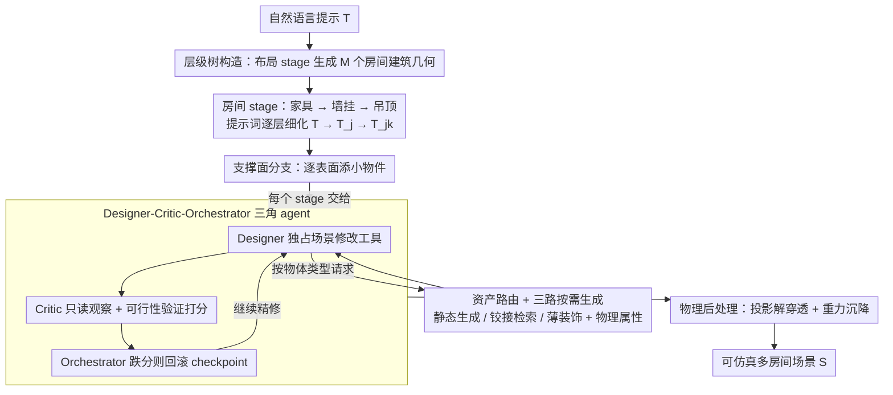

# SceneSmith: Agentic Generation of Simulation-Ready Indoor Scenes

**会议**: ICML 2026  
**arXiv**: [2602.09153](https://arxiv.org/abs/2602.09153)  
**代码**: https://scenesmith.github.io/ (项目主页)  
**领域**: 3D视觉 / 室内场景生成 / Agentic AI / 机器人仿真  
**关键词**: 室内场景合成、VLM Agent、机器人仿真、文本到3D、层级化生成

## 一句话总结
SceneSmith 用 designer-critic-orchestrator 三角 VLM agent 在「布局→家具→小物件」的层级树上逐层构建室内场景，并把 text-to-3D 生成、铰接物体检索与物理属性估计深度耦合到 agent 工具链中，从单条自然语言提示直接产出"可直接喂给物理仿真器"的稠密、可操作环境，每个房间平均 71 个物体（基线只有 11–23 个），物体间碰撞率 <2%、重力下稳定率 96%，远超此前所有方法。

## 研究背景与动机
**领域现状**：家用机器人训练越来越依赖大规模仿真，但现有仿真场景几乎都是"稀疏摆几件家具的空房间"——要么程序化生成（ProcTHOR、Infinigen Indoors）靠手写规则、表达力差；要么数据驱动（DiffuScene 等）受限于 SE(2) 地面对齐假设；要么近期的 LLM/VLM 驱动方法（Holodeck、I-Design、LayoutVLM、SceneWeaver）侧重家具级布局和视觉真实感，对小物件、铰接物体和物理属性视而不见。

**现有痛点**：真实的家庭场景有"塞满杯盘碗碟的橱柜"这种稠密、铰接、可操作的杂物结构，而仿真场景里一个房间通常只有十几个静态物体。机器人在稀疏场景里学到的策略到真实环境就全塌——杂物操作正是 manipulation 的核心难点之一。更糟的是，前述方法生成的场景没有碰撞几何、没有质量摩擦惯性，根本不能直接放进物理仿真器跑。

**核心矛盾**：现有 pipeline 把"asset 生成"和"场景组织"切成两半——asset 侧（如生成单个高质量 3D 物体）和 scene 侧（如在固定资源库上摆布局）各做各的，结果就是没有任何系统能从一句话直接生成"既有几何外观又有物理属性，既稠密又物理可行"的可仿真房屋。同时，单 agent 的 reason-act-reflect 范式（SceneWeaver）容易自评偏差，生成、评估、控制混在一个角色里，难以收敛到稠密且可行的配置。

**本文目标**：让一句自然语言提示直接长出"立刻可仿真"的多房间室内环境，要求同时满足：(1) 物体密度接近真实家庭；(2) 资产开放词表、按需生成；(3) 几何上无穿透、物理上重力下稳定；(4) 全 pipeline 无人工干预。

**切入角度**：把场景构造拆成树结构的 stage 级流水（layout → 家具 → 墙挂 → 吊顶 → 每个支撑面再独立长出小物件分支），每个 stage 用 designer / critic / orchestrator 三个 VLM agent 分工，同时把 text-to-3D、铰接物体库检索、薄覆盖材质、物理属性估计统一封装成 agent 工具，由资产路由器按需调度。

**核心 idea**：用「层级化 agent 树 + 设计-评审-编排三角分工 + 资产生成-路由-验证一体化」取代单 shot 生成或单 agent 反思，把"场景生成"和"资产生成"在 agent 工具层面合并成一个 end-to-end 的、面向仿真就绪的流水线。

## 方法详解
### 整体框架
输入是一条自然语言场景提示 $\mathcal{T}$，输出是一个可直接 export 到 Drake / MuJoCo / Isaac Sim / Genesis 的多房间场景 $\mathcal{S}=\{\mathcal{R}_j\}$，每个房间 $\mathcal{R}_j=(\mathcal{G}_j, \mathcal{O}_j)$ 包含建筑几何（带厚度的墙、地板、门窗）与物体集合 $\{(\mathcal{A}_i, \mathcal{X}_i)\}$，每个资产 $\mathcal{A}_i$ 都含视觉网格、凸分解碰撞几何、物理属性（质量、质心、惯性、摩擦），铰接物体还有 joint 定义。

构造过程是一棵 stage 树：根 stage 由 layout agent 生成 $M$ 个房间的建筑几何；每个房间独立走「家具 → 墙挂 → 吊顶」三个 stage，提示词由全局 $\mathcal{T}$ 派生为房间级 $\mathcal{T}_j$；之后每个房间里被选中的支撑实体（家具表面、墙架、地面区域）再各自开分支用实体级提示 $\mathcal{T}_{j,k}$ 添小物件——「书放这一格、植物放那一格」这种跨表面协调正是在分支提示里被显式约束的。所有 stage 完成后做物理后处理（投影解穿透 + 重力沉降），再 flatten 成 $\mathcal{S}$。每个 stage 内部都由 designer-critic-orchestrator 三角 agent 执行，designer 按需调用资产路由获取物体。

### 关键设计

**1. Designer-Critic-Orchestrator 三角 agent：用工具权限隔离破自评偏差**

单 agent 的 reason-act-reflect（如 SceneWeaver）容易陷入"自己提案自己打 90 分"的陷阱，把生成、评估、控制混在一个角色里很难收敛到稠密且可行的配置。SceneSmith 在每个 stage 把这三件事拆给三个角色，关键是给它们配不同的工具权限。Designer 独占场景修改工具（放置/调整资产、snapping、组装水果碗这类复合物体），可在一个 turn 内连续调用任意多工具完成一组原子编辑；critic 则被严格限制只能访问观察类与可行性验证类工具（查询 pose、渲染视图、碰撞检测、可达性检测），输出一个标量分数加自然语言反馈，拿不到任何修改权限，因此只能站在外部视角去抓 designer 漏掉的语义和物理问题。

Orchestrator 把 designer 和 critic 都当成可调度的工具，维护历史 checkpoint，一旦 critic 分数相比上一步下降就回滚到上一个状态——这把"探索"变成了"安全探索"，避免迭代越改越差。每个 agent 还配了按 turn 的滑动窗记忆，更早的轮次由 LLM 摘要压缩，视觉观察只用有限窗口承载且 stage 结束时清空，以控制上下文长度。这套"按权限拆角色"的隔离比纯提示词角色扮演稳得多。

**2. 资产路由 + 三路按需生成：用最合适的获取策略凑齐开放词表与可仿真性**

designer 提出的请求形态差异极大——"一个红色苹果"是静态物体，"一个带抽屉的厨房柜"是铰接物体，"一块地毯"则是薄装饰。强行用一条 text-to-3D 链路一把梭，对铰接结构只会生成"门拉不开的柜子"，而 retrieval-only 又被库容量绑死撑不起开放词表。SceneSmith 的资产路由器因此按物体类型分流：先把复合请求（如 fruit bowl）分解成原子资产（bowl 加多个 fruit），静态物体走生成链路 GPT Image 1.5 出参考图、SAM3 分割前景、SAM3D 重建带贴图网格，再归一化朝向并按目标尺寸缩放、凸分解出碰撞件、由 VLM 估计质量/质心/摩擦/惯性（图 3 用蓝色椭球可视化惯量）；铰接物体改走检索，从 ArtVIP 库取预制多 link 模型（自带 joint 定义）再补物理属性；薄装饰则用 thin coverings，即轻量几何面片配 ambientCG 检索来的 PBR 材质，避开不必要的刚体复杂度。

所有候选资产统一过网格完整性检查与 VLM 语义验证，失败就按预算重试或换策略，否则把失败原因反馈给 agent。这套"按类型选获取策略 + 统一物理属性后处理"是当前唯一能同时拿到开放词表、铰接可用、立刻可仿真三者的工程平衡点；on-demand 生成还顺带规避了机器人策略在已知资产库上偷跑训练数据的污染问题。

**3. 层级树构造 + 物理后处理：agent 管语义、solver 兜物理底线**

让 agent 严格满足物理约束代价极大且收敛极慢，于是 SceneSmith 把语义/美学交给层级树构造、把物理可行性交给确定性 solver。构造侧是一棵从大到小逐层 commit 的树：房间先分支，每个房间内被选中的支撑实体再分支，提示词随层级 refine（$\mathcal{T} \to \mathcal{T}_j \to \mathcal{T}_{j,k}$）把全局风格、房间用途、表面语义层层向下传递，同一书架的两层这类相关表面会被合并到同一分支以协调摆放（"书放上层、植物放下层"）。物体放置统一在支撑面坐标系下指定 $SE(2)$ pose，再借已知的支撑面 $SE(3)$ pose 升维到完整 $SE(3)$，从根本上杜绝"花瓶悬空"或"杯子斜插桌面"。

家具阶段和小物件阶段各结束时跑一次物理后处理兜底：先用非线性优化把每个物体投影到最近的无碰撞配置（保留朝向），再在 Drake 里做重力仿真让不稳的物体自己沉降到静态平衡。这种"agent 大致合理 + solver 精修"的分工，用 mm 级解穿透加重力沉降这类廉价确定性步骤兜住"仿真就绪"这条硬底线，最终剩余穿透只有 3.8 mm。墙和地板也特意用带厚度的体积几何而非平面，同样是为了离散时间步物理仿真下抗穿透。

### 损失函数 / 训练策略
SceneSmith 不训练新模型，全部由现成 VLM（GPT 等）+ 现成视觉基础模型（SAM3、SAM3D、text-to-image）组合而成。critic 给出的标量分数只用于 orchestrator 的接受/回滚/继续精修判断，而非梯度优化；agent 行为完全由提示工程 + 工具调用预算控制，未做任何参数微调。

## 实验关键数据

### 主实验
210 条提示，覆盖 SceneEval-100、Type Diversity（宠物店、瑜伽馆等）、Object Density、Themed Scenes、House-Level 多房间五类；205 名众包参与者，3,051 条有效成对比较。

| 数据集 / 维度 | 指标 | 本文 SceneSmith | 之前 SOTA | 提升 |
|--------|------|------|----------|------|
| 室内场景 | 物体数/房间 | **71.1 ± 13.0** | HSM 22.7 / Holodeck 23.0 | 3–6× |
| 室内场景 | 碰撞率 COL ↓ | **1.2%** | 3–29%（基线） | 显著 |
| 室内场景 | 静态稳定率 STB ↑ | **95.6%** | 8–61%（基线） | 1.5–12× |
| 室内场景 | 物体-物体关系 OOR ↑ | **67.6** | I-Design 28.6 | 2.2× |
| 用户研究 | 真实感胜率 (vs 6 基线均值) | **92.2%** | — | 全部 p<0.001 |
| 用户研究 | 提示忠实度胜率 (vs 6 基线均值) | **91.5%** | — | 全部 p<0.001 |
| 房屋级 | 物体数 | **214.1 ± 60.9** | Holodeck 81.3 | 2.6× |
| 房屋级 | vs Holodeck 真实感胜率 | **80.3%** | — | p<0.001 |
| 策略评估 | 评估器与人工标签一致率 | **99.7%** (300 case) | — | 仅 1 例边缘水果掉盘缘 |

### 消融实验
6 项消融均在用户研究 + 自动指标上对比 SceneSmith 自身。

| 配置 | 真实感胜率 / 忠实度胜率 | 物体数 | 说明与关键发现 |
|------|----------------|--------|------|
| Full SceneSmith | — | 71.1 | 完整方法 |
| w/o Generated（用 HSSD 检索资产替代生成） | 63.8% / 67.0%（显著） | 57.7 | 生成式资产对真实感和忠实度都是关键贡献，并提供开放词表 |
| w/o AssetValidation | 63.0% / 62.2%（显著） | 72.7 | 资产验证（网格完整性 + VLM 语义检查）抑制坏 asset 入场 |
| w/o ObserveScene（去视觉观察工具） | 61.5% / 53.2% | 69.7 | 视觉反馈对真实感有显著贡献，但对纯文本忠实度边际较小 |
| w/o SpecializedTools（去 snapping/facing/group 等专用工具） | 54.8% / 53.2%（不显著） | 61.5 | 专用工具效应较小，需要 6–18× 比较量才能检出 |
| w/o AgentMemory | 53.4% / 55.1%（不显著） | 78.9 | 单 stage 内记忆作用有限 |
| w/o Critic | 51.8% / 47.5%（不显著） | 54.0 | **省 70% 成本但物体数掉 24%**——存在质量/成本 trade-off 的实用选项 |

### 关键发现
- **稠密度是 SceneSmith 真正甩开基线的轴**：71 vs 11–23 个物体不只是数量好看，是直接决定了机器人能否在场景里学会处理杂物 manipulation；房屋级 214 vs 81 同样压倒性。
- **物理就绪是质变而非量变**：基线碰撞率 3–29%、稳定率最低只有 8%，意味着开场就有物体在穿模或者一开物理仿真就到处掉东西，根本不可用；SceneSmith 把碰撞压到 1.2%、稳定提到 96%，剩余穿透深度仅 3.8 mm（基线的 1/3–1/12），是"可仿真"和"不可仿真"的分界线。
- **ACC/NAV 反而略低**是预期内的——3–6× 的物体密度本就压缩了自由空间，正反映场景的真实杂乱度。
- **NoCritic 的胜率没显著下降但物体数掉 24%**：揭示了 critic 主要贡献是"把场景塞满"和"提高物体多样性"，而非显著拉动真实感分；想省钱可以关掉。
- **房屋连通性**定性上明显更合理：生成的旅馆有"入口→前台→走廊→各房间，浴室只能从对应卧室进"的真实拓扑，而 Holodeck 经常生成"整栋楼只能从某个客房进入"的离谱布局。
- **策略评估闭环**：300 例评估中评估器与人工 99.7% 一致；标准策略 16% vs 退化策略 12% 成功率说明 pipeline 能区分策略质量。

## 亮点与洞察
- **三角 agent 的工具权限隔离**是个可迁移的设计模式：critic 拿不到修改工具、designer 拿不到回滚权限、orchestrator 把同事当工具调用——这种"按权限拆角色"的思路在任何需要迭代精修的生成任务（代码生成、设计 review、文档撰写）都能直接借鉴，比纯提示词角色扮演稳得多。
- **"agent 大致合理 + solver 精修"的分工**是物理感知生成的一个普适范式：让 agent 全权满足物理约束代价极高且收敛慢，而 mm 级投影解穿透 + 重力沉降是确定性、廉价的，把硬约束交给 solver、把语义美学交给 agent，二者收敛到的合集才是"仿真就绪"。
- **资产路由器按物体类型选获取策略**：generation / retrieval / thin covering 三路并存而非二选一，承认了 text-to-3D 对铰接体仍不行的现实并工程化绕开它，是个非常务实的取舍——比硬刚 text-to-articulated 等技术成熟更快推动落地。
- **on-demand 资产生成顺带规避策略评估的训练数据污染**：用生成的而非库里的资产做 benchmark，让"是否见过该 asset"不再是偏置变量，这对未来 robot foundation model 的 zero-shot 评估非常重要。
- **层级化提示 refine**让局部决策既能并行又保持全局一致：把 $\mathcal{T}$ 切成 $\mathcal{T}_j$ 再切成 $\mathcal{T}_{j,k}$ 的写法可以直接迁移到任何需要"全局风格 + 局部细节"协调的生成任务（论文写作、网站生成、UI 设计）。

## 局限与展望
- 全 pipeline 严重依赖闭源前沿模型（GPT Image 1.5、VLM 多次调用）：成本与延迟都不低，NoCritic 才能省 70%；论文未公开端到端时间和 token 成本。
- 铰接物体仍受限于 ArtVIP 库的覆盖度，开放词表只对静态物体成立；铰接物体的真正 on-demand 生成仍是待解决问题。
- 物理后处理只做了"投影解穿透 + 重力沉降"，对动态可达性、抓取可行性、关节运动包络这类机器人专有约束并未在生成过程中显式优化，仍可能出现"看起来稳但实际机械臂够不到"的配置——ACC/NAV 偏低也部分反映了这个问题。
- 自动评估的 SceneEval 自身是 VLM 评分，作者也明确指出有假阳/假阴问题；用户研究虽然 92% 胜率漂亮，但与基线的物体数差距（3–6×）本身就强烈影响"看起来更真"的判断，存在密度混淆。
- 端到端策略评估仍是 toy（pick-and-place、成功率 12–16%）：场景生成能力远跑在了机器人策略能力前面，距离用 SceneSmith 实际训练出通用家用机器人还有相当距离。
- 没有任何"作者-发布-跨家庭跨文化风格分布"的实验，所有 prompt 都是英文场景描述，跨文化室内分布建模未被检验。

## 相关工作与启发
- **vs HSM (Pun et al., 2026)**：HSM 同样做层级化（家具先于小物件、识别支撑面），SceneSmith 沿用了它的支撑面检测和层级思想；区别是 SceneSmith 加了层级化提示 refine 与跨表面联合摆放，并把整个层级嵌入 designer-critic-orchestrator 三角 agent 框架，最终物体数（71 vs 23）和物理可仿真性（COL 1.2% vs 20.6%、STB 96% vs 45%）压倒性更好。
- **vs Holodeck (Yang et al., 2024b)**：Holodeck 用约束求解 + Objaverse 检索做布局，但只支持家具级稀疏场景，房屋级布局还经常物理上离谱；SceneSmith 在房屋级把物体数推到 2.6×、把碰撞压到 1/4。
- **vs SceneWeaver (Yang et al., 2025)**：SceneWeaver 是单 LLM planner 走 reason-act-reflect，每轮选一个工具；SceneSmith 把它升级为三 agent 分工 + 一轮内任意多工具调用 + 视觉观察反馈，胜率 91.7%。
- **vs LL3M (Lu et al., 2025)**：LL3M 是 designer-critic 模式但用于单个 3D asset 的代码生成；SceneSmith 把这个模式提升到场景级并加入 orchestrator 角色和工具权限隔离。
- **vs ProcTHOR (Deitke et al., 2022b) / Infinigen Indoors**：纯规则程序化方法语义表达力有限、开放词表无能；SceneSmith 用 VLM 取得开放语义控制力，但同时用工具系统约束物理可行性，找到了"规则方法的可靠 + 神经方法的灵活"的折中。
- **vs LayoutVLM (Sun et al., 2024) / I-Design (Çelen et al., 2025)**：这两者都偏视觉语言驱动的布局优化，但物体数都只有 11–14、且物理稳定性差（STB 8–61%）；SceneSmith 在所有相关维度都是数量级的飞跃，且这是当前唯一同时满足"自然语言提示 → 多房间 → 物理仿真就绪"的系统。

## 评分
- 新颖性: ⭐⭐⭐⭐ 三角 agent 与层级化资产路由的组合不是单点突破，而是把现有 agent / text-to-3D / 物理后处理拼成了一个真正端到端可用的系统，工程整合的价值远大于单一算法创新。
- 实验充分度: ⭐⭐⭐⭐⭐ 210 条提示、205 名众包参与者 3,051 比较、6 项消融、5 类基线、闭环策略评估 + teleoperation demo，覆盖人评 / 自动指标 / 物理指标 / 真实机器人四个维度。
- 写作质量: ⭐⭐⭐⭐⭐ 动机一路打到根上（"杂物是 manipulation 核心难点而仿真没有"），方法、消融、局限都讲得非常清楚，连"NoCritic 是 cost-efficient alternative"这种 trade-off 都明写出来了。
- 价值: ⭐⭐⭐⭐⭐ 作者结论里说"环境生成不再是仿真训练的瓶颈"并不夸张——3–6× 物体密度 + 1.2% 碰撞 + 96% 稳定的组合让通用家用机器人仿真训练第一次从"研究 demo"走向了"工业可用"，对 robot learning 社区是基础设施级的贡献。

<!-- RELATED:START -->

## 相关论文

- [\[ECCV 2024\] A Diffusion Model for Simulation Ready Coronary Anatomy with Morpho-skeletal Control](../../ECCV2024/image_generation/a_diffusion_model_for_simulation_ready_coronary_anatomy_with.md)
- [\[CVPR 2025\] Channel-wise Noise Scheduled Diffusion for Inverse Rendering in Indoor Scenes](../../CVPR2025/image_generation/channel-wise_noise_scheduled_diffusion_for_inverse_rendering_in_indoor_scenes.md)
- [\[CVPR 2026\] Agentic Retoucher for Text-To-Image Generation](../../CVPR2026/image_generation/agentic_retoucher_for_texttoimage_generation.md)
- [\[ICML 2026\] AtelierEval: Agentic Evaluation of Humans & LLMs as Text-to-Image Prompters](ateliereval_agentic_evaluation_of_humans_llms_as_text-to-image_prompters.md)
- [\[CVPR 2026\] Vinedresser3D: Agentic Text-guided 3D Editing](../../CVPR2026/image_generation/vinedresser3d_agentic_text-guided_3d_editing.md)

<!-- RELATED:END -->
