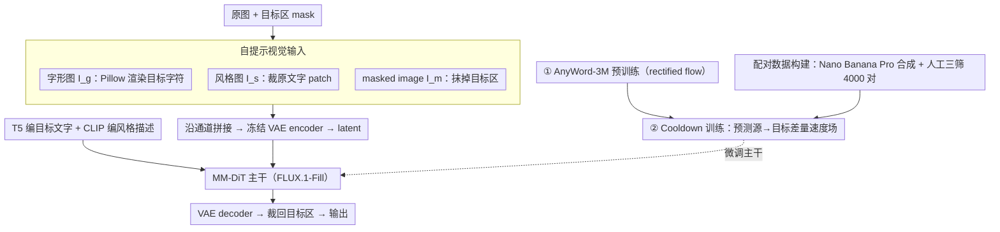

# Self-Prompting Diffusion Transformer for Open-Vocabulary Scene Text Editing via In-Context Learning

**会议**: ICML 2026  
**arXiv**: [2605.15523](https://arxiv.org/abs/2605.15523)  
**代码**: https://hongxiii.github.io/mstedit (项目页)  
**领域**: 扩散模型 / 图像编辑 / 场景文字编辑  
**关键词**: 场景文字编辑, MM-DiT, 自提示, 上下文学习, 开放词表

## 一句话总结
本文提出一种基于 FLUX-Fill (MM-DiT) 的自提示场景文字编辑方法：直接从原图裁出风格 prompt、用 Pillow 渲染出 glyph prompt，两者与 masked image 沿通道拼接后送入扩散 backbone，再用 4000 张 Nano Banana Pro 生成的高质量配对图做 cooldown 训练，从而在 13 种语言上同时实现开放词表与原始风格一致的文字替换。

## 研究背景与动机

**领域现状**：场景文字编辑（Scene Text Editing, STE）当前主流方案沿用图像 inpainting 范式：用 mask 把原文字区域抹掉，再由扩散模型在 mask 内重新生成新文字。为了让生成的字符结构正确，AnyText / AnyText2 / GlyphMastero 等方法常用一个预训练 OCR 模型作为 glyph encoder 来提取字符级特征。

**现有痛点**：这种范式带来两个具体问题。一是 OCR 本质是分类器，其字典是封闭的，对于稀有字符、低资源语种甚至艺术字会直接超出可编辑词表；从零训练 glyph encoder 又依赖海量数据。二是 inpainting 抹除了目标区域的视觉信息，新生成的文字只能从周围像素"借"风格——一旦目标字与背景字风格不同（如图 1 中红色 "Charmander" 周围全是蓝字），新字会被错误地染成蓝色，失去原本的颜色、字体和纹理。

**核心矛盾**：要保留目标文字的原始风格，就需要看到目标区域的像素；可 inpainting 的设定恰恰要求把目标区域抹掉。同样，要支持任意语言/字符，就不能依赖封闭词表的 OCR encoder；但又必须给模型注入足够精细的字形结构。

**本文目标**：在不引入额外 style encoder 与 glyph encoder 的前提下，让 MM-DiT 同时满足"开放词表字形正确"与"前后风格一致"。

**切入角度**：MM-DiT（特别是 FLUX-Fill）天生具备多模态 in-context learning 能力——只要把信息以视觉 token 形式塞进输入序列，模型就能在 attention 中自发使用。作者据此提出"自提示"思想：风格信号干脆直接裁原图，字形信号干脆用字体库渲染，让 MM-DiT 自己学着用。

**核心 idea**：把原图裁出的 style patch 和 Pillow 渲染的 glyph map 与 masked image 沿通道拼接，构成 MM-DiT 的"自提示"视觉输入，替代专用 OCR/style 编码器。

## 方法详解

### 整体框架
方法要解决的是"既要开放词表的任意字形，又要前后风格一致"，而 inpainting 范式做不到，于是作者干脆不训练任何专用编码器，把风格和字形都以"现成的视觉素材"塞进 MM-DiT 的输入序列，让它的 in-context learning 自己挑着用。具体地，backbone 取 FLUX.1-Fill-Dev（inpainting 取向的 MM-DiT，rectified flow + dual/single-stream transformer），视觉端把原图裁出的风格图 $I_s$、Pillow 渲染的字形图 $I_g$、按 mask 抹掉目标区的 masked image $I_m$ 沿通道拼接成 $I_{\text{input}}=\mathrm{Concat}(I_g, I_s, I_m)$，过冻结 VAE encoder 得到 latent $z_0$；文本端再用冻结的 T5 编码目标文字（glyph text prompt，注入语义结构）、CLIP 编码风格描述（style text prompt，强化视觉对齐）。训练只微调 MM-DiT 主干，分两阶段——先在 AnyWord-3M 上 1 epoch 自监督预训练，再在 4000 对高质量配对图上 10 epoch cooldown；推理时 guidance scale=30、采样 30 步，输出经 VAE decoder 还原后裁回目标区域。

### 关键设计

**1. 自提示视觉输入：把风格和字形当现成素材直接喂进序列**

STE 的两个痛点——OCR encoder 词表封闭、inpainting 抹掉了目标区导致风格无从参照——其实都源于"非要把信息编码成专用特征"。作者反其道而行：风格 prompt $I_s$ 直接来自原图，按 mask 的最小外接矩形裁出原文字 patch，天然携带颜色、字体、纹理与局部光照；字形 prompt $I_g$ 用 Pillow 把目标字符串渲染成白底黑字的高对比度单行 glyph map，提供笔画级几何先验。两者与 masked image $I_m$ 沿通道拼接进 VAE 后，MM-DiT 的 attention 会在 in-context learning 中自行分工"风格抄 $I_s$、内容抄 $I_g$、背景抄 $I_m$"。这样用"渲染图"替代 OCR encoder，词表彻底打开（任何 Unicode 字符只要字体支持就能编辑）；用"裁原图 patch"替代 style encoder，既避开 TextCtrl 那种 glyph-encoder 与 VAE latent space 表征错位的问题，也省掉了从零训练 style encoder 的数据成本。

**2. Cooldown 训练：把目标改成"源→目标"的差量速度场防塌缩**

只有渲染信号还不够——AnyWord-3M 这类 OCR 数据集里原文字早被抹掉，模型学到的只是"会渲染字"，并不会"风格一致地换字"。作者于是设计两阶段目标：第一阶段在 AnyWord-3M 上用标准 rectified flow 目标 $\mathcal{L}_{\text{RF}}=\mathbb{E}[\|\hat v_\theta(z_t,t,c)-(z_1-z_0)\|_2^2]$ 学通用 text inpainting；第二阶段借鉴 MECO 把"原文字区域"当 meta-information 注入 style prompt，并把训练目标从"噪声→图像"改成"源图→目标图"的速度场，令 $z_t=(1-\sigma_t)z_0^{\text{src}}+\sigma_t z_0^{\text{tgt}}$，最小化 $\mathcal{L}_{\text{CD}}=\mathbb{E}[\|\hat v_\theta(z_t,t,c)-(z_0^{\text{tgt}}-z_0^{\text{src}})\|_2^2]$。如果直接拿原图进训练，模型会偷懒把风格和字形一起复制、导致"修改失败"；改成预测"源→目标的差量速度场"，等于显式告诉模型"该改哪、不该改哪"，把风格保留与内容替换在优化上解耦。

**3. 配对数据构建：让生成大模型当合成器、人当过滤器**

cooldown 必须看到"两张除文字外完全相同的图"才能学到风格保留，但这种风格一致的真实 pair 几乎采集不到。作者用指令式编辑模型 Nano Banana Pro 按编辑指令生成候选配对，再人工按三条标准过滤：(a) 非目标区域完全不变；(b) 生成文字语义正确；(c) 编辑后文字与原文字保持一致的颜色、字体、纹理，最终留下 4000 对。让一个强生成模型当数据合成器、人来当过滤器，是在"风格一致 pair 不存在"约束下性价比最高的折中。

### 损失函数 / 训练策略
两阶段：(1) AnyWord-3M 上 1 epoch 标准 rectified flow 目标 $\mathcal{L}_{\text{RF}}$；(2) 4000 对配对图上 10 epoch cooldown 目标 $\mathcal{L}_{\text{CD}}$。优化器 AdamW，lr=$2\times10^{-5}$ 常数，bf16 + 8-bit optimizer state，per-GPU batch=1 ×grad-accum 8（有效 batch 64），8×A100。多语种数据混合训练，不做语种级调度。

## 实验关键数据

### 主实验
在 AnyText-benchmark（中/英各 1000 张测试图）上对比 7 个 SOTA：

| 数据集 | 指标 | 本文 | 之前 SOTA (TextFlux) | 提升 |
|--------|------|------|----------|------|
| English | Sen.ACC ↑ | 0.8857 | 0.8231 | +6.26 pt |
| English | NED ↑ | 0.9568 | 0.9235 | +3.33 pt |
| English | FID ↓ | 7.62 | 13.42 | −43% |
| English | LPIPS ↓ | 0.0365 | 0.0721 | −49% |
| Chinese | Sen.ACC ↑ | 0.8249 | 0.7289 | +9.60 pt |
| Chinese | NED ↑ | 0.9147 | 0.8612 | +5.35 pt |
| Chinese | FID ↓ | 7.95 | 13.67 | −42% |
| Chinese | LPIPS ↓ | 0.0268 | 0.0524 | −49% |

在自建的 MST-Edit 多语种数据集（覆盖阿拉伯、法、德、韩、日、意、孟加拉、印地、俄、泰、斯瓦希里语共 11 种）上对比两个 OCR-free baseline（FluxText、TextFlux），所有语种均显著领先；拉丁系语种因笔画结构相近表现最好，泰语因字形与笔画排布复杂表现相对偏低。

### 消融实验

| 配置 | Eng Sen.ACC | Eng FID | Eng LPIPS | Chi Sen.ACC | Chi FID | Chi LPIPS |
|------|------|------|------|------|------|------|
| w/o cooldown (无 style prompt + 无 cooldown) | 0.8738 | 11.56 | 0.0608 | 0.8125 | 12.01 | 0.0425 |
| w/ cooldown (完整模型) | 0.8857 | 7.62 | 0.0365 | 0.8249 | 7.95 | 0.0268 |

### 关键发现
- Style prompt + cooldown 的主要收益体现在图像质量（FID/LPIPS 普遍 −40% 量级），文字准确率提升相对温和（+1 个百分点左右），说明这条设计主要是"修风格"而不是"修字形"。
- 笔画级而非字符级表征带来正向的多语种迁移：作者按 Arabic→English→French→Chinese→…→Swahili 的循环顺序逐步加入新语言，已学语种的 Seq.ACC 不仅没下降，反而随语言数增多稳定上升——共享的低层笔画 primitive 在多语种暴露下被强化。
- 定性图（Fig 6）显示：去掉 style prompt 后，模型会把目标字渲染成原图中根本没出现过的字体（如把 "HOT SUMMER" 渲染成陌生字体），或者保住字体却破坏原背景；完整模型两者都能保住。

## 亮点与洞察
- **"自提示"是对 in-context learning 最直白的物理化**：与其费力训练专用 encoder 把信息编码成 token，不如直接把原图 patch 和渲染图当 token 喂进去，让 MM-DiT 的 attention 自己挑——这条思路同样适用于其他"需要风格 + 内容解耦"的局部编辑任务（logo 替换、贴纸编辑、徽章修改）。
- **用通用图像编辑大模型当"数据合成器"**：Nano Banana Pro 生成 + 人工三筛拿到 4000 对高质量数据，比真实采集风格一致 pair 便宜几个数量级，是低资源任务一种相当通用的训练数据获取范式。
- **Cooldown 目标 $z_0^{\text{tgt}}-z_0^{\text{src}}$ 的差量速度场设计很巧**：等价于显式告诉模型"只需要预测改变量"，天然防塌缩。这个 trick 可以迁移到其他"局部编辑且需保留主体"的扩散任务上。

## 局限与展望
- 字形 prompt 依赖 Pillow + 字体文件，若目标字符在字体文件里缺字形，渲染会失败——开放词表的"开放度"实际上被字体覆盖度上限卡住，对真正稀有的古文字/手写艺术字不友好。
- 风格 prompt 来自目标 mask 的最小外接矩形，当 mask 包含大量背景或多种字体时，裁出的 patch 会混进无关风格，可能产生风格漂移；作者也提到"GOOD DOG!"那种 mask 大于文字的情况虽然鲁棒，但边界没有严格控制。
- Cooldown 数据仅 4000 对，且依赖 Nano Banana Pro 一个生成器，存在生成器风格偏差被蒸馏进模型的潜在风险；可尝试多生成器混合 + 自动评分过滤。
- 计算开销大：FLUX-Fill 全参数微调，8×A100 + guidance=30 + 30 步采样，部署成本高于 LoRA-based STE 方案；如能蒸馏成更轻的 student 会更实用。

## 相关工作与启发
- **vs AnyText/AnyText2 (Tuo 2023/2024)**：他们用 OCR encoder 抽字符级特征，本文用渲染 glyph map 抽笔画级特征；本文优势是开放词表、能稳定支持 13 种语言，劣势是字体库限制。
- **vs FluxText / TextFlux (2025)**：同为 OCR-free 方案，FluxText/TextFlux 在 mask 内直接渲染 glyph 让模型抽特征，本文额外加了"裁原图作为 style prompt + cooldown 训练"两件事，因此在 FID/LPIPS 上拉开 40% 以上差距。
- **vs TextCtrl (Zeng 2024)**：TextCtrl 用专用 text style encoder 抽颜色/字体/纹理，但与 VAE latent 表征空间错位、只能在孤立文字区域工作；本文把 style 信号直接放进 VAE 的输入通道，天然对齐。
- **启发**：MM-DiT 的 in-context learning 不一定要靠"训一个 adapter 把信息变成 token"，把信息以原始视觉形式（裁图、渲染图、参考图）沿通道堆进 VAE 输入也是一种极简而高效的注入方式，值得在 ID-preserving 生成、风格化编辑、可控合成等任务尝试。

## 评分
- 新颖性: ⭐⭐⭐⭐ 自提示 + cooldown 差量目标的组合很干净，不过单点创新都不算"惊天动地"。
- 实验充分度: ⭐⭐⭐⭐ 涵盖 13 种语言、两条数据集、消融含 cooldown 与多语种循环训练，定性图覆盖典型 corner case。
- 写作质量: ⭐⭐⭐⭐ 动机—矛盾—方法—消融的论证链条清晰，公式和图表都到位。
- 价值: ⭐⭐⭐⭐ 把多语种 STE 的 SOTA 直接刷到一个新的台阶，工程可复用性强，对下游图像编辑、多语种内容生成有直接价值。

<!-- RELATED:START -->

## 相关论文

- [\[CVPR 2026\] Dynamic-eDiTor: Training-Free Text-Driven 4D Scene Editing with Multimodal Diffusion Transformer](../../CVPR2026/image_generation/dynamic-editor_training-free_text-driven_4d_scene_editing_with_multimodal_diffus.md)
- [\[NeurIPS 2025\] Seg4Diff: Unveiling Open-Vocabulary Segmentation in Text-to-Image Diffusion Transformers](../../NeurIPS2025/image_generation/seg4diff_unveiling_open-vocabulary_segmentation_in_text-to-image_diffusion_trans.md)
- [\[CVPR 2026\] SHOE: Semantic HOI Open-Vocabulary Evaluation Metric](../../CVPR2026/image_generation/shoe_semantic_hoi_open-vocabulary_evaluation_metric.md)
- [\[NeurIPS 2025\] ICEdit: Enabling Instructional Image Editing with In-Context Generation in Large Scale Diffusion Transformer](../../NeurIPS2025/image_generation/in-context_edit_enabling_instructional_image_editing_with_in-context_generation_.md)
- [\[CVPR 2026\] Omni-Attribute: Open-vocabulary Attribute Encoder for Visual Concept Personalization](../../CVPR2026/image_generation/omni-attribute_open-vocabulary_attribute_encoder_for_visual_concept_personalizat.md)

<!-- RELATED:END -->
