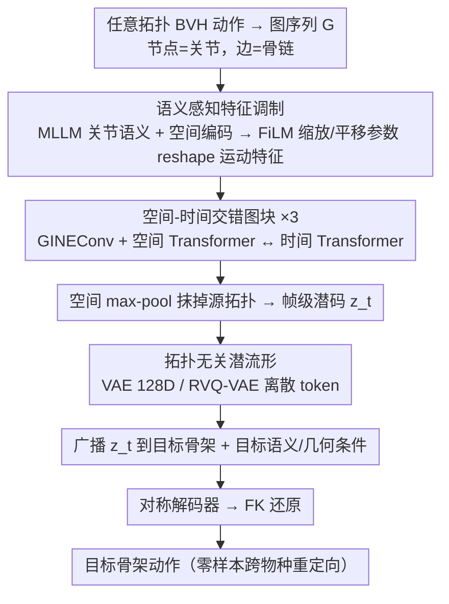

# Semantic-Aware Motion Encoding for Topology-Agnostic Character Animation

**会议**: ICML 2026  
**arXiv**: [2605.27055](https://arxiv.org/abs/2605.27055)  
**代码**: https://github.com/zzysteve/SATA  
**领域**: 3D视觉 / 人体运动 / 角色动画 / 表征学习  
**关键词**: 运动表征、拓扑无关、跨物种重定向、语义调制、图自编码器

## 一句话总结
SATA 用 MLLM 生成的关节语义标签做 FiLM 风格的特征调制，配合空间-时间交错的图自编码器，把任意骨架拓扑的 BVH 动作压到一个共享潜空间，实现高保真重建以及无配对数据的零样本跨物种动作重定向。

## 研究背景与动机
**领域现状**：当前角色动画的运动表征学习几乎都建立在「规范骨架」的假设之上 —— HumanML3D / AMASS 等大规模数据集都先把原始 SMPL 序列映射到固定数量、固定层级的关节集合上，然后用 VAE 或 VQ/RVQ-VAE 把这些固定维度的轨迹压成潜码。这套范式在单一物种内可以做到很高的重建保真度，但本质上是「为某一种骨架定制」的。

**现有痛点**：现实里数字角色从人类到四足兽再到幻想生物，骨架数和层级差异巨大；甚至同样是「人」，不同数据集对关节定义和命名都不一致。这直接挡住了想统一训练的多物种生成模型。已有的拓扑灵活方案要么走图卷积（如 SAME）只看局部图结构、缺乏跨物种的功能对应；要么走 Transformer + 零填充（Gat 2025、Lee 2025）做生成，引入二次方冗余计算、约束最大关节数，并且学不到紧凑连续的潜流形。

**核心矛盾**：拓扑差异 vs. 紧凑可生成的运动表征。固定模板能换来紧凑潜空间但牺牲拓扑灵活性；零填充和图结构能换来灵活性但破坏潜空间结构或缺乏语义对齐。需要一个机制把「拓扑」和「语义」解耦开来。

**本文目标**：构造一个 padding-free 的自编码器，能直接吃任意 BVH 拓扑的原始数据，把动作编进物种共享的连续潜流形，并能在没有配对监督的情况下从这个潜码解码到任意目标骨架。

**切入角度**：作者的关键观察是 —— 尽管骨骼拓扑五花八门，运动的「语义」却跨物种共享：人类胳膊和动物前肢都在「支撑/运动/抓握」这种功能层面对齐。所以与其去匹配几何或图结构，不如直接给每个关节挂一段语义描述（用 MLLM 生成、T5 编码），让网络在语义空间里建立功能对应。

**核心 idea**：用 MLLM 生成的关节语义嵌入做 FiLM 风格的特征调制（语义+空间共同生成缩放/平移参数去 reshape 运动特征），配合空间-时间交错的图块结构，把任意骨架的动作编码到一个统一的拓扑无关潜空间。

## 方法详解

### 整体框架
SATA 要解决的是「任意骨架拓扑的动作如何编进一个共享潜空间、再无配对地解码到另一套骨架上」。它把一段 $T$ 帧动作表达成图序列 $\mathcal{G}=\{G_1,\dots,G_T\}$，每帧图 $G_t=(V,E,E_f,F_s,F_{m,t})$ 由节点（关节）、边（骨链）、边特征（拓扑深度/逆深度）和节点特征构成；节点特征拆成静态骨架部分 $F_s=(X_g,X_l,X_t)$（全局偏移、相对父关节的 rest pose 坐标、关节语义嵌入）与动态运动部分 $F_m=(q,x,v_q,v_x,r,c)\in\mathbb{R}^{J\times D}$（6D 旋转、相对位置、角速度/线速度、根运动、足部接触）。编码侧先用语义感知特征调制把每个关节的运动特征按其功能身份 reshape，再经几个空间-时间交错图块抽特征，最后一次空间 max-pool 把整套骨架压成帧级潜码 $z_t$、抹掉源拓扑信息；解码侧把 $z_t$ 广播到目标骨架的每个节点，叠上目标骨架自己的语义/几何条件走对称解码器，输出 $\hat F_m^{out}=(q,r,c)\in\mathbb{R}^{J\times 11}$ 再经 FK 还原成完整运动。潜码可选 VAE（128D 对角高斯）做连续表征，或 RVQ-VAE 提供离散 token 给下游 text-to-motion。

### 关键设计

**1. 语义感知特征调制（Semantic-Aware Feature Modulation）：用关节语义当跨物种的「功能身份」去调制运动特征**

拓扑五花八门、几何无法直接对齐，但「人类左手」和「猫左前爪」在功能上是同一类关节——这条设计就是要把这种功能对应显式建出来，让它们即便在骨架上的位置完全不同也落到潜空间的相近区域。具体做法是先用 Gemini 2.5 Pro 给每个关节生成中性化的功能描述（刻意强调功能而非物种命名以利迁移），冻结 T5 编码成语义嵌入 $X_t$。三路输入各自投影：运动 $z_m=\phi_m(F_m)$、空间 $z_s=\phi_s([X_g;X_l])$（$\phi_s$ 是正弦编码器，把连续坐标映成高频谱）、语义 $z_t=\phi_t(X_t)$。空间与语义拼接后过非线性得到节点条件 $c=\Phi([z_s;z_t])$，再投影出 FiLM 参数 $[\gamma,\beta]=\Psi(c)$ 去 reshape 运动特征：$\hat x=\mathrm{LN}(z_m)\odot(1+\gamma)+\beta$。相比简单相加会让身份信息淹没在运动里，FiLM 让条件去缩放/平移特征本身而非污染它；外面再套一层门控残差 $\widetilde F_m=z_m+g\odot\hat x$（$g=\sigma(W_g c)$），在语义噪声或模态冲突时模型可以主动把调制关小。

**2. 空间-时间交错图块（Spatio-Temporal Interleaved Graph Block）：交错的空间-时间块，既守住骨架物理先验又拉直长时连贯**

单用图卷积会丢长时上下文，单用全注意力又会丢拓扑先验，所以这个块把两者交错堆叠。空间分支借鉴 GPSConv 并行两条路：一条 GINEConv 做消息传递（吃边特征里的拓扑深度，强化骨长/层级这类骨架先验），一条 Spatial Transformer 建模图上不相邻关节的长程协同（如手脚配合），两路求和后过 MLP+残差。时间分支借鉴 TimeSformer 的时空交错：用映射算子 $\mathcal{T}$ 把批图序列 $\mathcal{G}_{batch}$ 重排成「按关节聚集的时间流」$\mathcal{X}_{temp}$，加正弦位置编码后过 Temporal Transformer 抓长时依赖，再用 $\mathcal{T}^{-1}$ 把更新的特征写回图。编码器堆 3 个这样的块、解码器同构对称。直觉上等于「先让每帧骨架保持物理合理，再沿时间维把序列拉直」，反复纠缠后重建既不穿模也不抖动。

**3. 拓扑无关潜流形 + 任意骨架数据流水线：编码端抹掉源结构、解码端注入目标结构**

要让一个 $z_t$ 通吃任意物种，关键是潜码里不能再残留「源骨架有几个节点、怎么连」。SATA 在编码器末端用一次空间 max-pool 把 $J$ 个节点特征聚成单个帧级向量 $z_t$，正是这一步把源拓扑信息抹平；解码时只看潜码加上目标骨架的 $(X'_t,X'_g,X'_l)$，于是同一个 $z_t$ 能广播到任何节点数的目标骨架上——潜空间承担的是「这段动作的语义」，而不是「这段动作在某具体骨架上的实现」。$z_t$ 既可用 VAE（128D）做主重建/重定向，也可用 RVQ-VAE（256D、6 个残差量化器、码本 1024）出离散 token 喂 text-to-motion。配套的数据流水线把 HumanML3D 和 AniMo4D「反规范化」回四元数 BVH，做 canonicalization 与增广，产出 AT-HumanML3D（80,508 段、724.6 分钟）和 AT-AniMo4D（30,097 段、115 种动物、539.3 分钟）两个任意拓扑基准，从而打通多数据集联合训练。这比此前给每个角色单训一个 AE（WalkTheDog）或锁死 SMAL 四足模板（OmniMotionGPT）的做法更彻底地实现了「一个潜空间通吃所有物种」。

### 损失函数 / 训练策略
端到端优化 $\mathcal{L}=\mathcal{L}_{rec}+\lambda\mathcal{L}_{reg}$。重建项沿用 SAME 的配方：旋转/位置/速度 MSE，加上 foot contact、ground penetration 和平滑性的物理正则；潜空间正则 VAE 用 KL，RVQ-VAE 用 commitment loss。Adam，初始 lr 1e-4，30 轮线性 warmup，指数衰减 $\gamma=0.99$ 训 400 epoch；推理用 64 帧窗口、16 帧重叠的滑窗。基础模型 8.41M 参数 / 29.66 GFLOPs（对比加宽后的 SAME 5.98M / 20.21 GFLOPs）。

## 实验关键数据

### 主实验

单数据集训练的重建/零样本跨数据集评估（灰色为零样本跨集，JR=关节旋转，RT=根轨迹，JP=关节位置，FS=foot skating，GP=ground penetration）：

| 训练源 | 方法 | AT-HumanML3D JR↓ | AT-HumanML3D JP↓ | AT-AniMo4D JR↓ | AT-AniMo4D JP↓ |
|---|---|---|---|---|---|
| HumanML3D | SAME | 0.0831 | 2.81 | 0.5721 | 398.1（崩） |
| HumanML3D | Ours | **0.0568** | **1.36** | **0.4855** | **34.6** |
| AniMo4D | SAME | 0.5266 | 122.7（崩） | 0.5227 | 4.30 |
| AniMo4D | Ours | 0.6616 | 80.9 | **0.3901** | 4.51 |

多数据集联合训练（两个基准上同时训）：

| 方法 | AT-HumanML3D JR↓ | AT-HumanML3D JP↓ | AT-AniMo4D JR↓ | AT-AniMo4D JP↓ |
|---|---|---|---|---|
| SAME | 0.1060 | 2.34 | 0.2357 | 3.68 |
| Ours | **0.0769** | **1.63** | **0.1971** | **3.27** |

人体动作重定向（global joint position error）：

| 方法 | Internal↓ | Cross↓ |
|---|---|---|
| MoMask | 89.42 | 103.72 |
| SAN | 15.96 | 34.82 |
| SAME | 1.48 | 0.96 |
| Ours (RVQ) | 1.12 | 0.97 |
| Ours (VAE) | **0.21** | **0.20** |

### 消融实验

AT-HumanML3D 上的组件消融（节选）：

| 配置 | JR↓ | JP↓ | Internal Retarget↓ | Cross Retarget↓ |
|---|---|---|---|---|
| Full | 0.0568 | 1.36 | 0.21 | 0.20 |
| w/o Spatial Transformer | 0.1243 | 10.23 | 1.78 | 1.67 |
| w/o GNN | 0.0747 | 2.38 | 1.10 | 1.06 |
| w/o Temporal Transformer | 0.0584 | 1.78 | 0.32 | 0.29 |
| w/o Fusion Block（语义调制） | 0.1196 | 7.81 | 0.48 | 0.48 |
| w/o Text Fusion（只去文本） | 0.0663 | 1.52 | 0.35 | 0.25 |
| w/o Sliding Window | 0.0630 | 3.45 | 0.75 | 0.65 |

预训练效果（在 AniMo4D 上用不同比例的数据，✗=从头训，✓=从 AT-HumanML3D 预训练后微调）：

| 数据量 | PT | JR↓ | JP↓ |
|---|---|---|---|
| 10% | ✗ / ✓ | 0.62 / **0.28** | 14.34 / **7.71** |
| 30% | ✗ / ✓ | 0.52 / **0.22** | 8.72 / **4.06** |
| 100% | ✗ / ✓ | 0.39 / **0.18** | 4.51 / **3.14** |

### 关键发现
- **去掉 Fusion Block 是最致命的**：JP 直接从 1.36 涨到 7.81，且 retargeting 误差翻倍。这印证了「语义-空间调制」才是跨物种对齐的关键，光有图结构（如 SAME）不够。
- **Spatial Transformer 比 GNN 更重要**：去掉前者 JP 涨 7.5 倍，去掉后者只涨 1.7 倍，说明骨架上「远距离关节协同」对动作重建至关重要，单纯的局部消息传递不足以建模整体姿态。
- **联合训练能反向受益**：单训 AniMo4D 时本文的 RT 不如 SAME（1.65 vs 1.44），但加入人类数据联合训练后反超（1.23 vs 1.41）。说明本文的语义对齐能让人类动作迁移到动物轨迹建模上。
- **跨物种零样本不崩**：SAME 在 Human→Animal 设置下 JP=398（基本崩了），本文保持在 34.6；这种鲁棒性来自「拓扑无关潜空间 + 解码侧目标骨架条件」的解耦设计。
- **预训练在数据稀缺时收益巨大**：10% 数据下 JP 从 14.34 降到 7.71（约 46% 提升），暗示这个共享潜流形可以作为动作领域的通用 backbone。

## 亮点与洞察
- **「拓扑解耦 = 语义当桥」的设计哲学很干净**：与其在几何/图层面硬拼，不如借 MLLM 给每个关节挂功能标签，让网络在语义空间里隐式建立「人类左手 ↔ 猫左前爪」这种功能对应。这套思路完全可以迁到其他「结构异质但功能同质」的任务，比如不同传感器布局的机器人状态表征、不同物种的解剖学图谱对齐。
- **FiLM + 门控残差的 trick 值得记**：直接相加会让语义淹没在运动特征里，FiLM 让条件去 reshape 而非污染特征本身，门控又允许网络在条件冲突时关掉。在任何「弱条件需要影响强特征」的场景都能复用。
- **max-pool 抹掉源结构 + 解码端注入目标结构**：这个非对称设计是实现真正「拓扑无关潜空间」的关键 trick —— 编码器看见的源信息要被压扁，解码器看见的目标信息要被广播。对比 SAN/SAME 那种「图结构端到端绑死」的做法，更彻底。
- **数据流水线本身是贡献**：AT-HumanML3D / AT-AniMo4D 两个任意拓扑基准把已有的标准化数据「反规范化」回 BVH，给社区提供了真正能测试拓扑泛化的 testbed，而不是各家自己造小数据集互不可比。

## 局限与展望
- **MLLM 生成关节描述的质量不可控**：虽然作者用「中性化」描述模板减轻物种 bias，但对于真正怪异的拓扑（如多臂幻想生物、非动物机器人），Gemini 给出的功能描述是否仍然有意义、是否需要人工兜底，文中没充分讨论。
- **依赖 BVH 格式输入**：流水线绑死在四元数 BVH，对于纯 mesh 驱动、blendshape 驱动或者软体角色没办法直接用，限制了在游戏/影视工业管线中的覆盖面。
- **跨物种重定向只评了几何指标**：FS、GP 这类局部指标在「全局已崩」的情况下反而可能更好（作者自己也承认），缺少更可靠的用户研究或感知指标来评 cross-species motion 的「合理性」与「物种特征保留」。
- **拓扑无关 ≠ 物理无关**：解码到目标骨架时只用了骨长几何和语义，没显式考虑目标物种的物理约束（质量分布、关节自由度限制）；当把人类「跳跃」迁到小型动物时，可能产生关节超限或失重感的不自然结果。
- **改进方向**：把目标骨架的物理参数（质量、惯性、关节限位）也作为解码条件；引入 motion retargeting 评测里的 perceptual metric；将 RVQ codebook 与文本-动作对齐，做更可控的多物种 text-to-motion。

## 相关工作与启发
- **vs SAME (Lee 2023)**：同样做拓扑灵活的图自编码器，但 SAME 只看局部图连接缺乏跨物种语义对齐，因此 Human→Animal 零样本直接崩；本文加了 MLLM 语义调制把功能对应显式建出来，零样本 JP 从 398 降到 34。
- **vs 零填充 Transformer (Gat 2025, Lee 2025)**：他们用 padding 解决任意拓扑做生成，但有二次方冗余计算 + 最大关节数限制 + 缺乏紧凑可生成潜空间；本文 padding-free，且潜流形天然适合下游生成。
- **vs MoMask / VQ-VAE 系列**：那一类在固定骨架上做得极致，但完全没办法迁到异骨架；本文以略低的单骨架重建保真度换来了拓扑泛化与多数据集联合训练能力。
- **vs WalkTheDog / OmniMotionGPT**：之前的跨物种工作要么每个角色训独立 AE（不可扩展），要么锁死 SMAL 四足模板（不通用）；本文真正做到「一个模型/一个潜空间」吃 115 种动物 + 人类。
- **vs Motion2Motion / 规则 retargeter**：那一类需要人工关键点对应或规则映射，限制在预定义场景；本文完全无需配对监督和手工对应，靠语义嵌入做隐式对齐。

## 评分
- 新颖性: ⭐⭐⭐⭐ 「MLLM 关节语义 + FiLM 调制 + 拓扑无关潜流形」这一组合在角色动画里是新的，思路干净。
- 实验充分度: ⭐⭐⭐⭐ 单/联合训练、跨数据集零样本、重定向、消融、预训练扩展性都覆盖了；缺少感知评测和工业管线案例。
- 写作质量: ⭐⭐⭐⭐ 动机推理清晰，方法分块讲解到位；表格信息密度高但可读性 OK。
- 价值: ⭐⭐⭐⭐ 第一次把「任意 BVH 拓扑 + 多物种联合训练 + 零样本重定向」打通，给后续多物种 text-to-motion 和动画基础模型铺了路。

<!-- RELATED:START -->

## 相关论文

- [\[ICML 2025\] FlexiClip: Locality-Preserving Free-Form Character Animation](../../ICML2025/image_generation/flexiclip_locality-preserving_free-form_character_animation.md)
- [\[ICCV 2025\] LIFT: Latent Implicit Functions for Task- and Data-Agnostic Encoding](../../ICCV2025/image_generation/lift_latent_implicit_functions_for_task-_and_data-agnostic_encoding.md)
- [\[AAAI 2026\] Playmate2: Training-Free Multi-Character Audio-Driven Animation via Diffusion Transformer with Reward Feedback](../../AAAI2026/image_generation/playmate2_training-free_multi-character_audio-driven_animation_via_diffusion_tra.md)
- [\[CVPR 2026\] BiMotion: B-spline Motion for Text-guided Dynamic 3D Character Generation](../../CVPR2026/image_generation/bimotion_b-spline_motion_for_text-guided_dynamic_3d_character_generation.md)
- [\[ECCV 2024\] LivePhoto: Real Image Animation with Text-guided Motion Control](../../ECCV2024/image_generation/livephoto_real_image_animation_with_text-guided_motion_control.md)

<!-- RELATED:END -->
