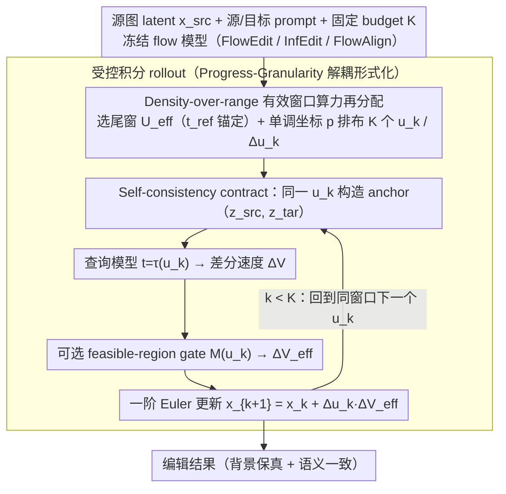

# Semantic Granularity Navigation in Image Editing

**会议**: ICML 2026  
**arXiv**: [2605.21190](https://arxiv.org/abs/2605.21190)  
**代码**: 待确认  
**领域**: 扩散模型 / 图像编辑  
**关键词**: 真实图像编辑, 流匹配, 训练无关推理控制器, 尺度-进度解耦, 语义粒度

## 一句话总结
NaviEdit 把 diffusion/flow 编辑器中"模型尺度坐标 = 编辑进度时钟"的隐式耦合拆开，在固定 step budget 下用一个训练无关的推理时控制器把算力集中在一个有效尺度窗口的密度上而非把范围扩到高噪声区，从而在 PIE-Bench / ImgEdit-Bench / 多种 flow backbone 上同时改善背景保真和语义一致性。

## 研究背景与动机

**领域现状**：基于 diffusion 或 flow matching 的 T2I 模型（SD3、FLUX、Stable Diffusion 系列）被广泛当作通用视觉先验，配合 SDEdit、Prompt-to-Prompt、FlowEdit 等 training-free 编辑管线就能完成真实图像编辑：在推理时调控采样过程，让模型把源图改成目标 prompt 描述的样子，不需要再训练。

**现有痛点**：editability ↔ fidelity 的拉扯一直没有真正解决——想让语义改得更彻底，往往就要把轨迹推到更高噪声的区域（如 FlowEdit 把 anchor 拉到更大的 noise level），结果非编辑区出现飘移、虚构物体、色调爆炸；想保住结构，又改不动几何形状（圆蛋糕 → 方蛋糕这种）。已有工作（TiNO-Edit、Schedule Your Edit、Dual-Schedule Inversion）大多在 schedule 形状上做文章，但没有跳出"用 scale 当 progress"的框架。

**核心矛盾**：这些方法把**两件本质不同的事**用同一个坐标表达——一个是 *scale*（决定模型当前在哪种"可编辑信息域"，是粗结构还是细纹理），一个是 *progress*（决定编辑已经积累了多少语义改动）。作者通过 probe 实验发现 scale 轴上存在三段式 regime：高 scale 处 prompt-conditioned 的 differential field $\Delta V(u)$ 空间上发散、leakage pressure $\rho(u)$ 飙高，低 scale 处又被高频重建主导改不动几何，中间有一个 $\rho(u)$ 谷底区间才是"既语义敏感又空间锚定"的甜区。把 scale 当 progress 用，意味着只要想加大编辑强度就被迫把质量积分推到高风险尾部，注定要付出一个不可消除的 risk floor。

**本文目标**：在 training-free、不动 backbone、固定 model-call budget $K$ 的硬约束下，把"扩展 scale 范围"从加强编辑的唯一手段中解放出来，转为对一个固定有效窗口内的**密度**做算力再分配。

**切入角度**：把编辑视为在显式 progress 轴 $s\in[0,1]$ 上对 latent 的受控积分，scale 坐标 $u(s)$ 退化为一个可控的"测量+作动"输入。整条 rollout（不是单步 timestep）才是评价对象，作者用 *semantic granularity* 这个 rollout 级泛函刻画它。

**核心 idea**：在 rollout 层面把 progress 与 scale 解耦，强制每一步 mixing/querying/update 使用同一个 $u_k$（self-consistency contract），并把固定 budget 用于在有效尺度窗口内增密、而不是向高噪声尾部扩范围。

## 方法详解

### 整体框架
输入是源图 latent $x_{\text{src}}$、源 prompt $c_{\text{src}}$、目标 prompt $c_{\text{tar}}$、固定 step budget $K$，以及一个 frozen 的 flow 模型（FlowEdit / InfEdit / FlowAlign 等任一兼容编辑器作为 base）。NaviEdit 作为一个 rollout-level controller 完全替换原编辑器的"budget→range"调度规则：在 scheduler path 上选定一个固定尾窗 $\mathcal{U}_{\text{eff}}$（由参考深度 $t_{\text{ref}}$ 锚定，排除极端高噪声尾部），通过单调坐标 $p\in[0,1]$ 在该窗口内决定 $K$ 个采样点 $\{u_k\}$ 与对应增量 $\{\Delta u_k\}$。每一步：用同一个 $u_k$ 构造 co-located anchor 对 $(z^{\text{src}},z^{\text{tar}})$、用 $t=\tau(u_k)$ 查询模型得到差分速度 $\Delta V$（可选过一个内部 feasible-region gate $M(u_k)$ 得到 $\Delta V_{\text{eff}}$）、用 $\Delta u_k$ 做一阶 Euler 更新 $x_{k+1}=x_k+\Delta u_k\,\Delta V_{\text{eff}}$。整个过程不训练、不反演、不依赖外部 mask。

### 关键设计

**1. Progress-Granularity 解耦的受控积分形式化：把"算力放在哪个尺度"变成可优化问题**

痛点是现有方法评价编辑质量时只盯终态，看不见算力到底花在了哪些 scale 上，于是 scale 一旦被当成 progress 用就只能靠扩范围加强编辑。NaviEdit 先把编辑显式写成一条沿 progress 轴 $s\in[0,1]$ 的受控积分 $\frac{dx}{ds}=\frac{du}{ds}\,\Delta V_{\text{eff}}\big(x(s);u(s),\epsilon(s)\big)$，scale $u$ 退化成受控输入而非进度本身，再定义 rollout 级的语义粒度泛函 $\mathcal{G}[x(\cdot),u(\cdot)]=\int_0^1 \phi\big(x(s),u(s)\big)\,ds$ 当作整条轨迹的质量评价对象。这里 $\phi(x,u)$ 是非负的 local risk density，假设它随 leakage pressure $\rho(u)$ 与方向震荡 $\omega(u)$ 增大而增大——这两个 probe 是这样测出来的：对 source latent 加新鲜噪声得到 $z^{\text{src}}=(1-u)x_{\text{src}}+u\epsilon$，用残差移位构造目标 anchor $z^{\text{tar}}=x+(z^{\text{src}}-x_{\text{src}})$，差分速度 $\Delta V(u)=v_\theta(z^{\text{tar}},\tau(u),c_{\text{tar}})-v_\theta(z^{\text{src}},\tau(u),c_{\text{src}})$ 给出局部 differential field，而 $\rho(u)=\|(1-M(u))\odot\Delta V(u)\|_2/\|\Delta V(u)\|_2$ 正是泄漏到非编辑区的能量占比。把质量写成 rollout 泛函之后，"该把 budget 放在哪个 $u$"就从经验试错变成可分析、可优化的 compute allocation 问题，也才能直接证出 Theorem 4.2：耦合调度必然带有不可消除的 outside-window 进度质量 $m_{\text{bad}}$，使 $\mathcal{G}$ 有一个 irreducible 下界。

**2. Density-over-range 的有效窗口算力再分配：冻住范围、只调密度**

实验里能看到耦合调度有个反直觉现象——把 step 数加大，CLIP 反而上去、PSNR/SSIM 却掉了，因为 budget 一变大就被自动翻译成了向高噪声端扩范围。NaviEdit 的对策是在 scheduler path 上固定一段尾窗 $\mathcal{U}_{\text{eff}}$（由参考深度 $t_{\text{ref}}$ 锚定，排除极端高噪声尾部），把额外 step budget 全部投到窗口内增密。具体用单调坐标 $p\in[0,1]$ 参数化 $\mathcal{U}_{\text{eff}}$ 上的遍历，$\{p_k\}$ 决定 $K$ 个采样点 $\{u_k\}$ 与对应增量 $\{\Delta u_k\}$，还可以拿编辑过程中已经算出来的 per-step 信号（$\rho$、$\omega$ 的离散代理）做在线密度微调，不需要任何额外 model call。Theorem 4.3 给了为什么有效：当 $K>L_\phi C_E/\gamma$ 时窗口内增密严格优于向 $\mathcal{U}_{\text{bad}}$ 扩范围——前者只付一阶 Euler 离散误差 $C_E/K$，随 $K$ 增大就消失；后者要付一个常数级 risk floor $c_{\text{bad}}\delta_K-c_{\text{good}}\geq\gamma$，怎么加 step 都压不掉。这等于把 budget→quality 这条被耦合调度扭歪的方向重新掰正。

**3. Self-consistency contract 的一阶一致离散化：mix/query/update 必须共用同一坐标**

前两个解耦设计要落到离散步骤上才有意义，而很多 rescheduling 工作（SYE、Dual-Schedule Inversion）只调 schedule 形状、不保证 axis 一致，提升因此不稳定。NaviEdit 强制每一步的 mixing（构造 anchor）、querying（送进模型的 $\tau(u_k)$）、update（步长 $\Delta u_k$）三处用**同一个** $u_k$，更新写成 $x_{k+1}=x_k+\Delta u_k\,\Delta V_{\text{eff}}(x_k;u_k,\epsilon_k)$，这正是 Def. 4.1 在有效窗口内的一阶一致离散。Theorem 4.4 解释了为什么必须如此：三处若用了不一致的 scale，差分速度测量的对象就不再是被作动的那同一个系统，rollout 会累计一个系统性 bias，外显成飘移和伪影。作者用 axis-mismatch ablation 独立扰动 query/step/mix 的 scale，实测一旦失配，drift 与 compliance 两个指标都随偏移量 $|\delta|$ 单调劣化——这说明 self-consistency 不是锦上添花，而是让前两个设计合法成立的必要前提。

### 损失函数 / 训练策略
完全 training-free，没有任何参数更新；推理时仅需固定 $K=50$（PIE-Bench）或 $K=28$（跨 backbone ablation）、$t_{\text{ref}}=42$ 等少量超参；可选 feasible-region gate $M(u)$ 由 base editor 已暴露的内部信号生成，不引入额外 model evaluation。单卡 RTX 3090 即可跑通。

## 实验关键数据

### 主实验

PIE-Bench（700 张带 GT mask 的真实图）上对比覆盖多种 paradigm（fixed schedule / rescheduling / Navi controller）：

| 类别 | 方法 | Struct.Dist↓ | PSNR↑ | SSIM↑ | LPIPS↓ | CLIP-Whole↑ | CLIP-Edited↑ |
|------|------|------|------|------|------|------|------|
| Fixed | FlowEdit (SD3) | 14.64 | 22.46 | 84.08 | 103.00 | 25.91 | 22.50 |
| Fixed | FlowAlign (SD3) | 6.21 | 27.78 | 92.41 | 34.47 | 25.44 | 21.80 |
| Reschedule | SYE (DDIM+PnP) | 27.17 | 21.73 | 87.45 | 110.64 | 24.44 | 21.26 |
| Reschedule | TurboEdit (SDXL-Turbo) | 13.80 | 21.44 | 80.08 | 108.60 | 24.66 | 21.70 |
| Navi | Navi-FlowEdit ($M\equiv 1$) | 14.25 | 22.54 | 89.36 | 92.47 | **26.01** | **22.59** |
| Navi | **Navi-FlowEdit + gate** | 10.67 | 27.94 | **93.85** | 48.74 | **26.18** | **22.72** |
| Navi | **Navi-FlowAlign ($M\equiv 1$)** | **5.40** | **28.33** | 93.40 | **34.49** | 26.15 | 22.44 |

ImgEdit-Bench（Basic + UGE 协议）：Navi-InfEdit 与 Navi-FlowAlign 两个 ungated 变体在 Basic 与 UGE 的平均分上都超过对应 baseline；FlowAlign 上提升最显著的类目是 background / action / replace，正是轨迹飘移最容易出问题的场景。

### 消融实验

跨 backbone 的 coupling vs. decoupling 受控对比（固定 $K=28$，同一差分编辑机制）：

| Backbone | 调度 | SSIM↑ | PSNR↑ | CLIP-Whole↑ | CLIP-Edited↑ |
|------|------|------|------|------|------|
| SD3 | couple | 88.22 | 22.18 | 26.01 | 22.55 |
| SD3 | **decouple** | **93.22** | **27.81** | **26.15** | **22.67** |
| SD3.5 | couple | 85.68 | 22.01 | 26.57 | 22.91 |
| SD3.5 | **decouple** | **92.32** | **27.45** | **26.77** | **23.32** |
| FLUX.1 [dev] | couple | 82.14 | 21.81 | 27.02 | 23.35 |
| FLUX.1 [dev] | **decouple** | **91.75** | **26.83** | **27.06** | **23.42** |

PIE-Bench 上 Navi-FlowEdit 的两行（带 / 不带 gate）隔离了 gate 的作用——gate 主要改善 background preservation（SSIM 89.36→93.85，PSNR 22.54→27.94），核心 controller 本身在 CLIP 与 Struct.Dist 上就已经压过 FlowEdit。Axis-mismatch ablation 显示 query/step/mix 任一处偏离 $u_k$，drift 与 compliance 都随 $|\delta|$ 单调劣化，验证 Thm. 4.4 的 self-consistency 必要性。

### 关键发现
- **Density 真的赢 Range**：Figure 6 显示同 budget 下 rollout proxy $\widehat{\mathcal{G}}$ 几乎与 $m_{\text{bad}}$ 线性相关，PSNR-bg 随 $m_{\text{bad}}$ 增大单调下降——印证 Theorem 4.3 的 risk-floor 论断不是理论摆设。
- **CFG 救不了耦合**：Figure 11 显示拉高 classifier-free guidance 不能稳定地复现解耦带来的提升，因为 CFG 改的是速度场幅度，不改 budget 沿 scale 的分配，对耦合调度的 cost floor 无能为力。
- **跨 base editor 可移植**：同一个 controller 套到 FlowEdit / InfEdit / FlowAlign 三个不同 base 上都拿到正向收益，提示 progress-scale 解耦是普适原则而非某一管线的 trick。

## 亮点与洞察
- **诊断驱动的方法学**：先用 $\rho(u),\omega(u)$ 两个 probe 把 scale 轴扫成 regime 图，再围绕"valley"设计控制器，避免了拍脑袋调 schedule——这种"先做空间诊断、再做算力分配"的范式可以迁移到任何把单一坐标当多重含义用的推理时控制问题。
- **rollout-level 视角的重塑**：把编辑质量从"某个 timestep 的瞬时方向"升格为"沿 scale 的算力分配泛函"，让"调 schedule"从经验试错变成 measure allocation 的最优化问题，并配上 Theorem 4.2 / 4.3 给出存在性与不等式保证。
- **Self-consistency contract 的迁移潜力**：任何用差分速度做控制的 inference-time 方法（视频编辑、3D 编辑、可控生成）都可能踩到 axis mismatch 的坑，把"mix/query/update 必须共享同一坐标"作为合法离散化条件是普适的 sanity check。

## 局限与展望
- 作者承认：controller 只调"算力如何沿 scale 分配"，并不改善 support estimation 或 scene reasoning——当可编辑支持过保守，或有效窗口对某些剧烈替换（fine-grained replacement）偏保留，结果可能停在"半成品"状态，gated 变体上尤其明显。
- 没有显式的几何/关系一致性约束，对镜面反射、重复物体、强物体间关系的场景，局部 drift 抑制住了但全局一致性仍可能崩。
- 适用前提：base editor 必须暴露 conditional differential field 与 monotone scale path，对那种端到端训好的强编辑器（已经在训练时学了部分 trade-off），可优化空间会变小。
- 实验维度也偏窄：图像分辨率、prompt 复杂度（多对象、长 prompt）、user study 规模都还有进一步压力测试空间，跨 backbone ablation 只到 FLUX.1 [dev]、SD3.5，还缺更新型 backbone（如 Z-Image）作为彻底压力检验。

## 相关工作与启发
- **vs FlowEdit (Kulikov et al., 2025)**：同样 inversion-free、训练无关、跑在 flow 上，但 FlowEdit 走的就是典型"扩 scale 范围加强编辑"的耦合路线；NaviEdit 直接套在它之上，在 Struct.Dist / PSNR / SSIM / CLIP 各项上都把它压下去，是最直接的同根对照。
- **vs Schedule Your Edit / Tino-Edit / Dual-Schedule Inversion**：这些 reschedule 工作意识到 scale 分配很重要，但仍把 progress 隐式绑死在 scale 上，没有 axis 一致性合约，所以拿到的提升不稳定（SYE 在 PIE-Bench 上甚至比直接 PnP 还差）；NaviEdit 给出了"为什么 reschedule 不够、还得显式解耦"的理论与实证答案。
- **vs Prompt-to-Prompt / MasaCtrl / PnP**：这些工作通过 attention/feature intervention 在 update 规则层面发力，正交于 NaviEdit；后者完全不动 update 规则，只重排 step 沿 scale 的位置，因此可以叠加在前者之上（论文已在 InfEdit 等基线上验证）。
- **启发**：所有把"模型坐标"当"过程进度"用的训练无关推理控制（视频时序编辑、3D NeRF 编辑、扩散反演）都值得拿"是否在隐式耦合两件本质不同的事"这把刀回查一遍。

## 评分
- 新颖性: ⭐⭐⭐⭐ 把 progress 从 scale 中拆出来是个清晰且原创的视角，并给了 risk-floor 形式的存在性定理而非只做经验调参。
- 实验充分度: ⭐⭐⭐⭐ 覆盖 2 个 benchmark、3 个 base editor、3 个 flow backbone、axis-mismatch 与 density-vs-range 受控 ablation 都齐全；缺更多新 backbone 与 user study 规模。
- 写作质量: ⭐⭐⭐⭐ 诊断→形式化→定理→算法→实验的逻辑链非常顺，符号体系自洽；定理略偏冗长，对工程读者可能门槛偏高。
- 价值: ⭐⭐⭐⭐ 作为可即插即用的推理时控制器，对所有基于 differential field 的 training-free 编辑管线都是直接收益；"density over range"原则容易复用到其他 inference-time control 任务。

<!-- RELATED:START -->

## 相关论文

- [\[ICLR 2026\] Next Visual Granularity Generation](../../ICLR2026/image_generation/next_visual_granularity_generation.md)
- [\[ICML 2026\] End-to-End Autoregressive Image Generation with 1D Semantic Tokenizer](end-to-end_autoregressive_image_generation_with_1d_semantic_tokenizer.md)
- [\[ICML 2026\] WISE: A World Knowledge-Informed Semantic Evaluation for Text-to-Image Generation](wise_a_world_knowledge-informed_semantic_evaluation_for_text-to-image_generation.md)
- [\[ICML 2026\] OmniAID: Decoupling Semantic and Artifacts for Universal AI-Generated Image Detection in the Wild](omniaid_decoupling_semantic_and_artifacts_for_universal_ai-generated_image_detec.md)
- [\[ICML 2026\] DirectEdit: Step-Level Accurate Inversion for Flow-Based Image Editing](directedit_step-level_accurate_inversion_for_flow-based_image_editing.md)

<!-- RELATED:END -->
