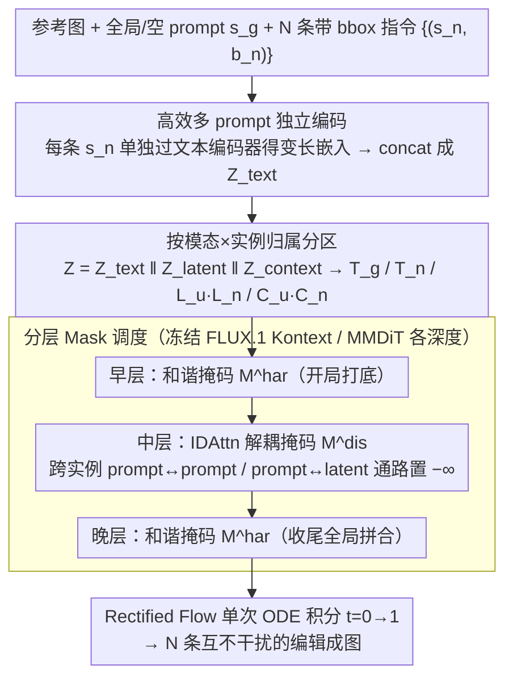

# Shifting the Breaking Point of Flow Matching for Multi-Instance Editing

**会议**: ICML2026  
**arXiv**: [2602.08749](https://arxiv.org/abs/2602.08749)  
**代码**: https://github.com/Blowing-Up-Groundhogs/IDAttn  
**领域**: 图像生成 / 图像编辑 / Flow Matching / 多实例编辑  
**关键词**: Flow Matching, MMDiT, 多实例编辑, 注意力解耦, Infographic 文本编辑

## 一句话总结
针对 FLUX.1 Kontext 这类基于 Rectified Flow Matching 的 MMDiT 编辑模型在多实例同时编辑下"属性串味"的痼疾，本文提出 Instance-Disentangled Attention（IDAttn）：通过对 joint attention 加结构化掩码，把每条编辑指令绑定到对应的 bounding box，再配合分层 disentanglement/harmonization 调度和高效多 prompt 独立编码，单次前向就能完成 N 条互不干扰的编辑，并在自家提出的 Infographic 文本编辑 benchmark 上显著优于多轮和拼接式 baseline。

## 研究背景与动机

**领域现状**：文本驱动图像编辑长期由 U-Net 扩散模型主导，最近社区正在向 MMDiT + Rectified Flow Matching 迁移（Stable Diffusion 3、FLUX.1 Kontext 等），ODE 形式带来更高视觉质量和更快推理；编辑通常把参考图 token 与噪声 latent 拼起来，丢进同一 joint attention 中。

**现有痛点**：现有 FM 编辑器几乎只支持"一句话编辑整张图"或少量编辑，多实例（如同一张信息图里几十个文本框）场景下要么大面积漏改，要么把 A 框的语义渗到 B 框（attribute leakage），多轮 (multi-turn) 推理虽缓解但 N 步推理成本爆炸且会反复破坏背景一致性。

**核心矛盾**：Flow matching 学的是一个**全局** velocity field $v_\theta(x, t \mid c)$，条件 $c$ 也是全局注入；joint attention 又允许 prompt、latent、context 三种 token 自由互相 attend，这导致不同 instance 的 query/key 在共享向量场里相互干扰，instance-level 的隔离在架构上根本没被强制。

**本文目标**：在不动 backbone 权重、不破坏全局 FM 训练目标的前提下，给定 $N$ 条带 bbox 的局部指令 $\{(s_n, b_n)\}_{n=1}^N$，实现 (i) 编辑解耦（各指令互不干扰），(ii) 局部性（非编辑区域保持原样），(iii) 全局相干（成图整体仍然协调）；同时 (iv) 单次前向完成所有编辑以维持 sub-linear 推理成本。

**切入角度**：作者观察到 attribute leakage 的"根因"是**结构性**的——任何两个不相关的 token 在 joint attention 里都被允许互通。所以与其在推理时迭代优化 attention map（如 P2P 类方法），不如直接改注意力的**连通图**，并对应到 MMDiT 不同深度采用不同的连通策略。

**核心 idea**：用一个 $\{0, -\infty\}$ 的加性掩码把 joint attention 切成"按实例分块"的子图——中间层走严格 disentanglement 把每个 instance 的 prompt/latent/context 自封闭、早晚层走 harmonization 让全局 token 把碎片拼回一张图。

## 方法详解

### 整体框架
方法要解决的是"多实例同时编辑时 N 条指令在共享注意力里相互串味"，而把这件事整体转成"在冻结的 FLUX.1 Kontext（MMDiT + Rectified Flow Matching）骨干上，给 joint attention 套一层按实例分块的结构化掩码，让一次前向积分就完成 N 条互不干扰的编辑"。具体而言，先把全局/空 prompt $s_g$ 和每条带 bbox 的指令 $s_n$ 各自独立编码再拼成 text token，再按"模态 × 实例归属"把整条 joint token 序列 $Z = Z^{\text{text}} \| Z^{\text{latent}} \| Z^{\text{context}}$ 划成全局 prompt $\mathbb{T}_g$、实例 prompt $\mathbb{T}_n$、背景/实例 latent $\mathbb{L}_u/\mathbb{L}_n$、背景/实例 context $\mathbb{C}_u/\mathbb{C}_n$（bbox 重叠时一个 token 可同属多个 $n$）；最后让 MMDiT 不同深度的层用不同掩码约束 velocity field，从 $t=0$ 一次 ODE 积到 $t=1$ 得到成图。

### 关键设计

**1. Instance-Disentangled Attention（IDAttn）：用加性掩码把跨实例的注意力通路从架构上掐断**

作者把"属性串味"的根因诊断为结构性的——joint attention 默认允许任意两个 token 互相 attend，instance 之间的隔离从未被强制。针对这一点，IDAttn 不在推理时迭代优化 attention map，而是直接改注意力的连通图：把标准算子 $\mathrm{Attn}(Q,K,V) = \mathrm{softmax}(QK^\top/\sqrt{d})V$ 改写为 $\mathrm{IDAttn}(Q,K,V,M) = \mathrm{softmax}(QK^\top/\sqrt{d} + M)V$，用一个 $\{0, -\infty\}$ 的加性掩码 $M$ 裁断不该连通的 token 对。它定义两套互补掩码：解耦掩码 $M^{\mathrm{dis}}$ 只放行三类连通——同一实例内部 $\mathbb{T}_n \cup \mathbb{L}_n \cup \mathbb{C}_n$ 互通、全局 prompt $\mathbb{T}_g$ 单向 attend 所有 latent/context、背景 latent/context 只看全局与非实例 prompt，任何跨实例的 $\mathbb{T}_n \leftrightarrow \mathbb{T}_m$（$n \neq m$）都被 $-\infty$ 屏蔽；和谐掩码 $M^{\mathrm{har}}$ 则放宽到允许各实例 latent/context 互相 attend 并看到全部图像 token，仅保留 prompt 之间的隔离。之所以即便在解耦时也保留 prompt→latent 的全局单向通道，是为了让全局风格 token 仍能影响所有区域，不至于把背景割成补丁。这样一来，跨实例的 prompt-prompt、prompt-latent 耦合被硬性禁止，部署时无需任何 per-sample 优化迭代，可即插即用到任何 MMDiT。

**2. 分层 Mask 调度：把解耦塞进"语义绑定"最敏感的中段层**

只有掩码还不够，关键是每一层该用哪套掩码。作者依据"Transformer 早层抽粗特征、中层做语义绑定、晚层全局协调"的经验观察，把调度定为 $(L_{\text{early}}, L_{\text{mid}}, L_{\text{late}}) = (M^{\mathrm{har}}, M^{\mathrm{dis}}, M^{\mathrm{har}})$：早晚层用和谐掩码做"开局打底"和"收尾拼合"，只在中段最容易串味的语义绑定阶段插入解耦掩码。这样既避免了纯解耦把背景碎成补丁，又避免纯和谐把多实例语义糊成一锅。8 种组合的消融印证了这个三段式在 Tgt CLIP / Bg LPIPS / Loc CLIP / AR 上同时最优——全程 $M^{\mathrm{dis}}$ 牺牲背景一致性，全程 $M^{\mathrm{har}}$ 则掉到和 vanilla FLUX 同档（AR 仅 80%），而把解耦放进早层粗特征阶段会让多实例编辑严重退化。

**3. 高效多 prompt 独立编码：让文本注意力成本按"语义量"而非按 $N$ 计费**

在 InfoEdit 这种单图 $N$ 可达 285 的极端场景下，文本侧的编码方式直接决定能否跑得动。两条主流路线都不理想：单 prompt 后端掩码会在编码阶段就让语义互相污染；等长 pad 的多 prompt 又让 attention 成本随 $N$ 二次膨胀，pad 到 77 token × 285 条会让 $O((NL)^2)$ 直接爆显存。本文改为先把指令拆成 $s_g$（实操取空 prompt）和 $\{s_n\}_{n=1}^N$，每条**单独**过文本编码器得到变长嵌入，再 concat 成最终 $Z^{\text{text}}$。这样同时拿到"按构造隔离"（编码阶段就不串扰）和"按内容计费"（总长正比于实际语义体量而非 $N \times L_{\text{pad}}$）两个好处，推理 wall-clock 随 $N$ 增长几乎线性而非二次。

### 损失函数 / 训练策略
推理阶段无需任何额外训练，IDAttn 与分层调度都是即插即用的。可选的 domain-specific 微调直接复用 conditional rectified flow matching 损失 $\mathcal{L}_{\mathrm{FM}} = \mathbb{E}_{t, x_1, x_0}[\|v_\theta(x_t, t \mid c) - (x_1 - x_0)\|^2]$，其中 $x_t = (1-t)x_0 + t x_1$；在挂载 IDAttn 与多 prompt 编码后，对 MMDiT 全层挂 LoRA（$r=32$），在 Crello Edit 训练集 1512 样本上以同一掩码策略微调，专门弥补原模型对小区域、短指令"懒得改"的欠拟合。

## 实验关键数据

### 主实验
在自然图像多实例编辑 benchmark **LoMOE-Bench**（80 图，每图 2-7 条编辑）上对比（数值见原文 Table 3）：

| 方法 | Tgt CLIP↑ | LPIPS$_\text{B}$↓ | SSIM$_\text{B}$↑ | Loc CLIP↑ | HPS↑ | AR%↑ |
|------|-----------|-------------------|------------------|-----------|------|------|
| LoMOE | 26.00 | 0.090 | 0.834 | 29.40 | 0.546 | 98.96 |
| LayerEdit | 25.61 | 0.147 | 0.864 | 29.07 | 0.186 | 100.00 |
| FLUX (单次) | 24.71 | 0.206 | 0.830 | 27.58 | -0.059 | 94.79 |
| FLUX μT (多轮) | 25.71 | 0.150 | 0.873 | 28.27 | 0.550 | 94.27 |
| FLUX w/ v.c. | 24.49 | 0.170 | 0.893 | 27.60 | 0.265 | 92.71 |
| **Ours** | **25.60** | **0.099** | **0.919** | **29.08** | **0.574** | 89.06 |

本文在背景一致性（LPIPS / SSIM）和人类偏好（HPS）上同时刷到最好，Tgt/Loc CLIP 几乎追平 LoMOE，但 LoMOE 走的是多 diffusion 拼接、推理成本高且无法扩展到大 $N$。

在自家 **Infographic Editing Benchmark** 上（Crello Edit + InfoEdit，Table 4 摘要）：

| 方法 | Crello FID↓ | Crello CER↓ | Crello AR%↑ | InfoEdit FID↓ | InfoEdit CER↓ | InfoEdit AR%↑ |
|------|-------------|-------------|-------------|---------------|---------------|---------------|
| FLUX (单次) | 10.06 | 0.65 | 68.72 | 4.36 | 0.77 | 39.94 |
| FLUX μT | 12.10 | 0.63 | 90.44 | 65.73 | 0.90 | 99.81 |
| FLUX st. (拼接) | 15.69 | 0.59 | 73.49 | 10.48 | 0.66 | 63.25 |
| Calligrapher μT | 10.15 | 0.73 | 51.21 | 113.23 | 0.92 | 99.98 |
| **Ours** | 9.45 | 0.61 | 52.00 | **2.41** | 0.64 | 52.61 |
| **Ours + ft** | 10.85 | **0.52** | **92.16** | 2.80 | **0.56** | 80.90 |

InfoEdit（每图最多 285 条指令）上 FID 从 4.36 一刀降到 2.41/2.80，CER 同步降到 0.56；ft 版在保住低 FID 的同时把 AR 拉到 80.9%，说明 LoRA 适配确实补上了"小区域短指令不愿动手"的短板。

### 消融实验

| 配置 | Tgt CLIP↑ | LPIPS$_\text{B}$↓ | Loc CLIP↑ | AR%↑ |
|------|-----------|-------------------|-----------|------|
| 全程 $M^{\mathrm{dis}}$ | 25.51 | 0.108 | 29.14 | 94.27 |
| 全程 $M^{\mathrm{har}}$ | 25.05 | 0.103 | 28.54 | 80.21 |
| $(\mathrm{dis}, \mathrm{har}, \mathrm{har})$ | 25.01 | 0.099 | 28.53 | 82.29 |
| $(\mathrm{dis}, \mathrm{dis}, \mathrm{har})$ | 25.63 | 0.100 | 29.21 | 91.15 |
| $(\mathrm{har}, \mathrm{dis}, \mathrm{dis})$ | 25.59 | 0.103 | 29.23 | 93.23 |
| **$(\mathrm{har}, \mathrm{dis}, \mathrm{har})$（最终方案）** | **25.67** | **0.091** | **29.26** | 92.19 |

再加一组（Table 2）显示：只开 efficient prompt encoding 而不加 IDAttn，效果与 vanilla baseline 几乎打平（25.16 vs 25.22 Tgt C，0.129 vs 0.126 LPIPS），但只加 IDAttn 就能把 Tgt C 推到 25.67、LPIPS 降到 0.091——**IDAttn 是质量来源，efficient prompt encoding 是效率来源**，两者正交。

用户研究 + Gemini 3 Flash LLM-as-Judge（Table 5）Elo 评分上，本文方法在 LoMOE 和 Infographics 两组都明显领先（用户 1589 vs FLUX 1331 / FLUX μT 680）。

### 关键发现
- **解耦/和谐的层位置很关键**：把 $M^{\mathrm{dis}}$ 放在中段、$M^{\mathrm{har}}$ 包早晚是 Pareto 最优；早层放 $M^{\mathrm{dis}}$ 会让多实例编辑严重退化（AR 掉到 80% 档），说明早层粗特征阶段最忌讳硬切断 token 互通。
- **IDAttn 对不精确 bbox 鲁棒**：太松的框（图 5(a) 棉花球）因为 backbone 内部仍有定位能力而不受太大影响；嵌套 / 完全重叠的框（图 5(b) 长颈鹿）会因为 softmax 在小框上分布更尖锐而"自动偏向小框指令"，反而把冲突处理得更稳。
- **N 越大本文优势越明显**：图 2 的 CER 和 AR 随 $N$ 的曲线显示，FLUX 系基线在 $N \geq 10$ 后几乎放弃大多数指令，而本文在 tens-of-edits 区间仍能稳住。
- **核心局限是依赖外部 bbox**：方法本身不做定位，依赖 OCR / detector 提供 $b_n$；完全错误的 bbox 会触发编辑失败，作者把端到端 localize+edit 留给 agentic 后续工作。

## 亮点与洞察
- **把 attribute leakage 定性为"架构问题"而非"loss 问题"**：相比 P2P / Attend-and-Excite 等推理时优化路线，IDAttn 用一个掩码就把跨实例 token 通路掐掉，不需要任何迭代优化，部署成本几乎为零，可即插即用到任何 MMDiT。
- **分层 mask 调度的"early/late 和谐 + mid 解耦"模式很有可迁移性**：这与近年关于 ViT 层次表征（early=纹理, mid=语义, late=全局）的研究一致，把同一思路套到 ControlNet 多控制信号、多主体生成、视频多 trajectory 编辑等场景都顺理成章。
- **Infographic 文本编辑被立为新 benchmark 类别**：相比自然图像多实例编辑（往往 N≤7），信息图 N 可达数百且每个框面积仅占 0.6%，逼出"高密度小区域+严格 layout"的真实压力测试，对后续做 text-rendering 类工作很有参考意义。
- **多 prompt 变长独立编码是被低估的工程 trick**：在 instance 数量爆炸时，把 padding 改成"按语义计费"既保隔离又控成本，理论上可以单独拎出来嵌入到任何带 cross-attention 的多条件生成模型里。

## 局限与展望
- **依赖外部定位**：bbox 由 OCR / LayoutParser / 人工提供，完全错误的框无解；端到端 localize-and-edit 是显式留给未来 agentic pipeline 的坑。
- **微调阶段只覆盖 Crello 这一种字体/版式分布**：在更复杂的手绘海报、表格、漫画分镜上的泛化还没系统评估。
- **掩码是硬性 $\{0,-\infty\}$ 二值**：可能在相邻实例边界处仍有过渡不自然的风险，可以考虑软掩码（学到的连续 attention bias）或与 attention rollout 类方法结合。
- **只在 FLUX.1 Kontext 上验证**：作者声称掩码思路适用于任意 MMDiT-based FM 模型，但在 SD3 / OmniGen / Lumina 等模型上的实际增益尚需补做。
- **评测指标偏 OCR / CLIP**：CER 对字体风格保留并不敏感，在"换语言但保字体"的场景上需要更精细的指标（如字形相似度、版式 IoU）。

## 相关工作与启发
- **vs P2P / Attend-and-Excite (Hertz 2023, Chefer 2023)**：他们在 U-Net 扩散 + cross-attention 上做推理时优化 attention map，本文在 MMDiT + joint attention 上做架构级硬掩码，省掉 per-sample 优化迭代且天然兼容 Rectified FM。
- **vs LoMOE (Chakrabarty 2024) / LayerEdit (Fu 2026)**：他们在 diffusion 的离散去噪步里靠 multi-diffusion 或 layer-wise 学习处理多实例，本文一步前向完成所有编辑，并把 benchmark 从"几张图几个 box"推到 InfoEdit 的几百 box。
- **vs FLUX.1 Kontext (Labs 2025) 原生编辑**：FLUX 端到端在 N>5 时丢指令、多轮 μT 在 N>20 时画面退化，本文相当于给 FLUX 装了一个"多指令并行"插件，定位也更接近 ControlNet 之于 SD 的角色。
- **vs Calligrapher (Ma 2025)**：Calligrapher 专门微调做文本编辑但一次只能一框，多轮使用反而让背景全花；本文证明"架构级解耦"比"专用微调 + 串行"在 text rendering 上既快又准。
- **vs Multi-prompt 编码方案 (Zhou 2025)**：Zhou 等把指令拆分独立编码但等长 pad，成本随 $N$ 线性炸；本文改成变长 concat，保留 by-construction 隔离的同时让 attention 成本与"实际语义量"挂钩。

## 评分
- 新颖性: ⭐⭐⭐⭐ 把 attribute leakage 从"优化层面"重定义为"注意力连通图层面"是一个干净的视角转换，分层 mask 调度方案具体且非平凡。
- 实验充分度: ⭐⭐⭐⭐ 自然图像 + 自造 infographic 双 benchmark、8 种 mask schedule 消融、用户研究 + LLM-as-Judge、扩展 N 的扩展性曲线，覆盖全面；只是只在 FLUX 一个 backbone 上验证略可惜。
- 写作质量: ⭐⭐⭐⭐ 公式定义、token 分区、mask 矩阵都讲得很清楚，图 1 的 mask 可视化是理解全文的关键支点；个别 Appendix 推迟到附录读者跟不上节奏。
- 价值: ⭐⭐⭐⭐ Infographic 编辑 + 多指令并行是真实工业场景（跨语言信息图本地化），数据集开源后会成为 text-aware 编辑领域的标准 benchmark；IDAttn 本身是 plug-and-play 的，社区复用门槛低。

<!-- RELATED:START -->

## 相关论文

- [\[ICML 2026\] Bootstrap Your Generator: Unpaired Visual Editing with Flow Matching](bootstrap_your_generator_unpaired_visual_editing_with_flow_matching.md)
- [\[ICML 2026\] A Kinetic Energy Perspective of Flow Matching](a_kinetic_energy_perspective_of_flow_matching.md)
- [\[NeurIPS 2025\] Equivariant Flow Matching for Symmetry-Breaking Bifurcation Problems](../../NeurIPS2025/image_generation/equivariant_flow_matching_for_symmetry-breaking_bifurcation_problems.md)
- [\[ICML 2026\] Principled RL for Flow Matching Emerges from the Chunk-level Policy Optimization](principled_rl_for_flow_matching_emerges_from_the_chunk-level_policy_optimization.md)
- [\[ICLR 2026\] Laplacian Multi-scale Flow Matching for Generative Modeling](../../ICLR2026/image_generation/laplacian_multi-scale_flow_matching_for_generative_modeling.md)

<!-- RELATED:END -->
