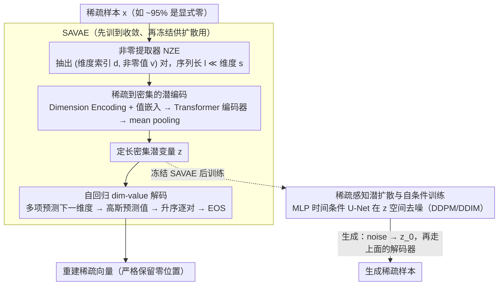

# Skipping the Zeros in Diffusion Models for Sparse Data Generation

**会议**: ICML 2026  
**arXiv**: [2605.01817](https://arxiv.org/abs/2605.01817)  
**代码**: <https://github.com/PhilSid/sparsity-exploiting-diffusion>  
**领域**: 扩散模型 / 稀疏数据生成 / 科学计算 / 生成式建模  
**关键词**: 稀疏扩散, 隐扩散, 自回归解码, 单细胞测序, 量能器图像

## 一句话总结
SED 把扩散模型从"对所有维度做全密集去噪"改成"只在非零维度上跑扩散+自回归解码维度-值对"，让计算量从随维度线性增长变成几乎随非零数恒定，同时严格保留科学数据中"显式零"这一语义信息。

## 研究背景与动机

**领域现状**：扩散模型 (DM) 在图像、音频、文本等密集连续数据上做到了 SOTA，DDPM/LDM 是事实标准。但许多科学数据本质稀疏：粒子物理量能器 (~95% 零)、单细胞 RNA 测序 scRNA (90-98% 零)、推荐系统、稀疏图像等——大部分坐标确实是**零**（没有信号），而不是"接近零"。

**现有痛点**：(1) **稀疏被抹平**——把稀疏数据喂给 DDPM/LDM，输出会在所有零坐标处产生虚假非零值，破坏稀疏模式（见 Figure 1 的 MNIST 演示）。这对生物上的 dropout、物理上的"无能量沉积"等具有明确物理含义的零是灾难性的。(2) **计算被浪费**——率失真分析 (Figure 3) 显示扩散模型对零维度只分配几乎零比特率，但去噪网络依然在所有维度上跑前向传播——"信息容量集中在信息维度，计算却不集中"。(3) 现有补丁式方法都有缺陷：thresholding 输出（DDPM-T/LDM-T）保留稀疏但牺牲细节；domain-specific 模型（SARM）依赖手工螺旋采样的零位置先验，泛化差；离散 DM 处理不了连续值；最近 Ostheimer 2025 的稀疏感知 DM 给每个维度配一个二进制指示符，反而把维度翻倍。

**核心矛盾**：信息(rate)是稀疏的，但密集 DM 的**计算和参数化**是 dense 的，二者天然不匹配。要么保留 dense 架构丢稀疏语义，要么放弃 Transformer 的可扩展性手工编码稀疏先验，没有兼得方案。

**本文目标**：(1) 让 DM 在**只处理非零维度**的紧凑表示上做扩散，使计算量随**信号密度**而非环境维度增长；(2) **严格保留零模式**，输出零的位置必须与真实数据匹配；(3) 不依赖手工先验，跨多个科学域 (物理/生物/视觉) 都能用。

**切入角度**：作者把每个稀疏样本表示成"(维度索引集合, 对应非零值集合)"对，用 Transformer 编码器把这个变长集合 pool 成一个**定长**的密集潜变量 $\mathbf{z}$；扩散在这个密集潜空间上跑（成熟稳定），解码时自回归生成"下一个维度-值对"直到 [EOS]。

**核心 idea**：把"扩散应该跨所有维度"这个隐含假设打破——扩散在**潜空间**保持密集稳定，但**输入空间表示**和**解码**都跳过零，让算力跟着信号走。

## 方法详解

### 整体框架
SED 要解决的是"稀疏数据喂给密集扩散会抹平零、还浪费算力"这个矛盾，做法是先把每个稀疏样本压成一个定长密集潜向量、在潜空间跑成熟扩散，再自回归地把维度-值对解码回去。具体分两阶段、LDM 风格：先训一个 **SAVAE (Sparsity-Aware VAE)** —— 非零提取器 NZE 把 $\mathbf{x}^{(i)} \in \mathbb{R}^s$ 转成"维度-值"对 $(\mathbf{d}^{(i)}, \mathbf{v}^{(i)})$（长度 $l_i \ll s$），Transformer 编码器 $q_\phi$ 把这个变长 token 序列池化成定长潜变量 $\mathbf{z}$，自回归解码器 $p_\theta = p_{\theta_1}(\mathbf{d}) p_{\theta_2}(\mathbf{v})$ 依次吐出下一个维度和对应值；SAVAE 冻结后，再让标准 DM (DDPM/DDIM) 在 $\mathbf{z}$ 空间上学习（对应 SEDP/SEDI），生成时从 $\mathcal{N}(0,I)$ 去噪得 $\mathbf{z}_0$ 再解码填回稀疏向量。

### 关键设计

**1. 稀疏到密集的潜编码 SAVAE：让序列长度跟着信号走**

密集 DM 的算力被零维度白白吃掉，SAVAE 的对策是从一开始就只让 Transformer 看到非零项。NZE 先抽出非零索引集合 $\mathbf{d}^{(i)} = \{j \mid \mathbf{x}^{(i)}_j \neq 0\}$ 与对应值 $\mathbf{v}^{(i)}$，序列长度 $l_i = \|\mathbf{x}^{(i)}\|_0$ 远小于环境维度 $s$。为了让 Transformer 知道每个 token 来自哪个特征，作者复用位置编码的形式但把"序列位置"换成"维度索引"，即 **Dimension Encoding** $\text{DE}_{(dim, 2i)} = \sin(dim / k^{2i/d_{model}})$（$k=20000$）；值经线性投影 embed 后与 DE 相加送进编码器，输出做 mean pooling（也试过加 [CLS] token，性能近似但稳定性差）得定长 $\mathbf{z}$，并用重参数化采样 $\mathbf{z} \sim q_\phi$。这样一来计算量随非零数 $l_i$ 而非维度 $s$ 增长，是 SED 效率优势的根源；同时 $\mathbf{z}$ 是密集低维向量，可以直接套用成熟的 DDPM/DDIM 后端。

**2. 自回归 dim-value 解码：变长稀疏结构的结构性需求**

把 $\mathbf{z}$ 解回稀疏空间既要决定"哪些"维度非零（数量逐样本变化），又要决定它们的"值"，固定长度根本表达不了——一个细胞可能只有少数活跃基因，另一个则很多。解码器 $p_\theta(\mathbf{d}, \mathbf{v} \mid \mathbf{z})$ 因此拆成两个联合训练的头：$p_{\theta_1}$ 在剩余维度上用多项分布预测下一个非零维度索引，$p_{\theta_2}$ 在该位置用高斯分布预测对应值，按维度索引升序的规范顺序逐对解码、遇 [EOS] 停止，升序排序消除了排列歧义。关键是训练时用 teacher forcing 并行评估所有目标对，只有采样阶段才必须串行，所以自回归不拖累训练效率。

**3. 稀疏感知潜扩散与自条件训练：把稀疏定制全留给 SAVAE**

扩散本身保持原样、稳定可控，所有"稀疏适配"都集中在前面的 SAVAE，二者解耦后各模块可独立替换升级，而且在密集 $\mathbf{z}$ 上训练远比在高维稀疏空间稳定。冻结 SAVAE 后，扩散目标为 $\mathcal{L}_{\text{SED}}(\theta) = \mathbb{E}\|\mathbf{z}_0 - f_\theta(\mathbf{z}_t, t, \tilde{\mathbf{z}}_0)\|^2$，其中 $\mathbf{z}_t = \sqrt{\gamma(t)}\mathbf{z}_0 + \sqrt{1-\gamma(t)}\boldsymbol{\epsilon}$、$\tilde{\mathbf{z}}_0$ 是自条件 (Chen 2023) 的先前估计；骨干网用 MLP-based 时间条件 U-Net（不用卷积，因为 $\mathbf{z}$ 没有网格空间结构），采样支持 DDPM/DDIM 两种 sampler 分别得到 SEDP/SEDI。

### 损失函数 / 训练策略
SAVAE 用 $\beta$-VAE 形式：$\mathcal{L}_{\text{SAVAE}} = -\log p_\theta(\mathbf{d}, \mathbf{v}|\mathbf{z}) + \beta \cdot D_{\text{KL}}(q_\phi \| p)$，$\beta = 10^{-6}$ 轻正则；负对数似然分解为维度部分（多项）和值部分（高斯）。两阶段训练：先训 SAVAE 到收敛，再冻结后训扩散。$\gamma(t)$ 从 1 到 0 单调递减，用 log-SNR 参数化。

## 实验关键数据

### 主实验
跨三域六数据集：**物理**——muon 信号/背景量能器图像 ($32 \times 32$, ~95% 零)；**生物**——Tabula Muris (98% 零) 和 Human Lung PF (96% 零) scRNA；**视觉**——MNIST (81% 零), Fashion-MNIST (50% 零)。指标：物理用 Wasserstein 距离 $W_P$ 对 $P_T$ 和 invariant mass；scRNA 用 SCC 和 MMD；视觉用稀疏度直方图匹配。

| 任务 | 模型 (参数) | 指标 | 值 | 备注 |
|------|------------|------|------|------|
| Muon Signal | DDPM (37M) | $W_P (P_T)$↓ | 220.32 | dense 完全失败 |
| Muon Signal | DDPM-T (37M) | $W_P (P_T)$↓ | 24.22 | thresholding 缓解 |
| Muon Signal | SARM (25M, domain) | $W_P (P_T)$↓ | 28.01 | 用螺旋先验 |
| Muon Signal | **SEDP (15M)** | $W_P (P_T)$↓ | **16.31** | 参数最少且最优 |
| Tabula Muris | DDPM (5M) | SCC↑ / MMD↓ | 0.50 / 3.60 | dense 失败 |
| Tabula Muris | scDiffusion (5M, domain) | SCC↑ / MMD↓ | 0.71 / 1.53 | 需预训练 cell corpus |
| Tabula Muris | **SEDP (4M)** | SCC↑ / MMD↓ | **0.74 / 0.55** | 无需 domain pretraining |
| Human Lung PF | **SEDP (4M)** | SCC↑ / MMD↓ | **0.82 / 0.54** | 胜 scDiffusion |

### 消融实验

| 配置 | 关键指标 | 说明 |
|------|---------|------|
| SED 完整 (SAVAE + 潜扩散 + AR 解码) | 最优 | — |
| LDM (无稀疏感知) | LDM SCC=0.87 但 MMD=5.82 | 形状对了但分布距离大 |
| LDM-T (thresholded) | SCC 暴跌至 0.26 | thresholding 破坏 LDM 的细节 |
| DDPM/DDIM 原始 | 完全失败 | 既不保稀疏也距离大 |
| SARM (物理 domain prior) | 弱于 SED | 手工螺旋先验不通用 |
| Sampling 时间 (95% 稀疏) | SED 24ms vs DDPM 453ms | 高稀疏度下加速 19× |
| 维度排序正确率 (Fashion-MNIST) | 100% | 序列长但简单不出错 |
| 维度排序正确率 (Muon BG) | 87.9% | 复杂结构下出错率最高 |

### 关键发现
- **计算几乎随维度恒定**：scRNA 数据保持 1000 活跃基因，添加额外零基因到 27k 维，DDPM/LDM 线性增长，SED 几乎平坦（Figure 2/9）。
- **稀疏度越高加速越明显**：Muon (95%) 加速近 20×，MNIST (81%) 加速 7×，Fashion-MNIST (50%) 几乎无加速——SED 的优势严格随稀疏度递增。
- **scRNA 任务上 SED 同时胜过 dense baseline、thresholded 变体、domain-specific scDiffusion**——后者还要昂贵的 cell corpus 预训练。
- 自回归错排序在长序列上**不会**系统性恶化（Fashion-MNIST 长序列 100% 正确），错率高的是复杂结构 (Muon BG 87.9%)——说明难点是数据复杂度而非长度。

## 亮点与洞察
- **"信息维度才需计算"是 dense DM 时代被忽视的原则**：作者用率失真分析直观证明 DDPM 给零维度几乎零比特率却给它们全部算力，是非常漂亮的诊断分析。
- **Dimension Encoding 复用位置编码思想**：把"序列位置"换成"特征索引"是非常简洁的工程改造，让 Transformer 直接吃稀疏 (index, value) 对。
- **两阶段解耦**：SAVAE 解决"如何表示稀疏"，扩散负责"如何生成密集潜变量"——干净分离，每个模块可独立替换或升级。
- 这个思路可迁移到 graph generation（边稀疏）、3D 点云（空间稀疏）、稀疏注意力中的 KV cache 压缩、稀疏激活 MoE 等。

## 局限与展望
- **依赖自回归解码**——采样时必须串行，对超长非零序列仍有延迟开销；作者明确点名要找非自回归替代。
- **维度排序错误**会产生不真实样本（Figure 7 MNIST 演示），尤其在复杂稀疏模式（如粒子物理）上 12% 样本被影响；但作者验证物理实验数据上这种错误不影响整体生成质量。
- **低稀疏度下优势消失**：Fashion-MNIST (50% 零) 上 SED 的采样时间几乎与 DDPM 持平，LDM 反而最快——SED 是 high-sparsity 专用。
- scRNA 上 SED 略弱于某些 LDM 配置的 SCC（但 MMD 更好）——说明保稀疏与匹配整体分布之间有微妙的取舍。
- 缺少与 sparse Transformer 类工作（如 XTrimoGene）的更细比较。

## 相关工作与启发
- **vs DDPM/LDM (dense baselines)**：他们在所有维度上跑去噪，SED 只在非零上跑，效率随稀疏度线性加速且严格保零模式。
- **vs DDPM-T / LDM-T (post-hoc thresholding)**：thresholding 是 hack——保稀疏但破坏边界细节；SED 是结构性方案。
- **vs SARM (Lu 2021, domain-specific)**：SARM 用螺旋采样硬编码物理零位置先验，泛化差；SED 不用 domain prior 且性能更好。
- **vs Discrete DM (Austin 2021)**：离散 DM 能精确生成零但只能在离散态空间，处理不了连续稀疏值；SED 能同时建模"哪里有信号 + 信号值多少"。
- **vs scDiffusion (Luo 2024)**：scDiffusion 需要在大规模 cell corpus 上预训练 autoencoder；SED 端到端无 domain pretraining 即可超过它。
- **vs Sparse Transformer (XTrimoGene, scGPT)**：那些是 representation learning，用 MSE 只在 masked 基因上算 loss；SED 是生成式，需要从头预测维度索引。

## 评分
- 新颖性: ⭐⭐⭐⭐⭐ "扩散应该跨稀疏维度跑"这一隐含假设被打破，自回归 dim-value 对的解码视角是真正原创
- 实验充分度: ⭐⭐⭐⭐⭐ 跨物理/生物/视觉三个截然不同的稀疏域，对比覆盖 dense/thresholded/domain-specific 全谱
- 写作质量: ⭐⭐⭐⭐⭐ 率失真诊断 → 方法动机 → 实验验证的逻辑链非常清晰，图示直观
- 价值: ⭐⭐⭐⭐⭐ 在科学计算（高稀疏）场景下提供可立刻使用的计算+保真双赢方案，开源代码已放出

<!-- RELATED:START -->

## 相关论文

- [\[ICML 2026\] SAEmnesia: Erasing Concepts in Diffusion Models with Supervised Sparse Autoencoders](saemnesia_erasing_concepts_in_diffusion_models_with_supervised_sparse_autoencode.md)
- [\[CVPR 2026\] Guiding Token-Sparse Diffusion Models](../../CVPR2026/image_generation/guiding_token-sparse_diffusion_models.md)
- [\[ICML 2026\] GUDA: Counterfactual Group-wise Training Data Attribution for Diffusion Models via Unlearning](guda_counterfactual_group-wise_training_data_attribution_for_diffusion_models_vi.md)
- [\[ICCV 2025\] Less is More: Improving Motion Diffusion Models with Sparse Keyframes](../../ICCV2025/image_generation/less_is_more_improving_motion_diffusion_models_with_sparse_keyframes.md)
- [\[ICML 2026\] When Preference Labels Fall Short: Aligning Diffusion Models from Real Data](when_preference_labels_fall_short_aligning_diffusion_models_from_real_data.md)

<!-- RELATED:END -->
