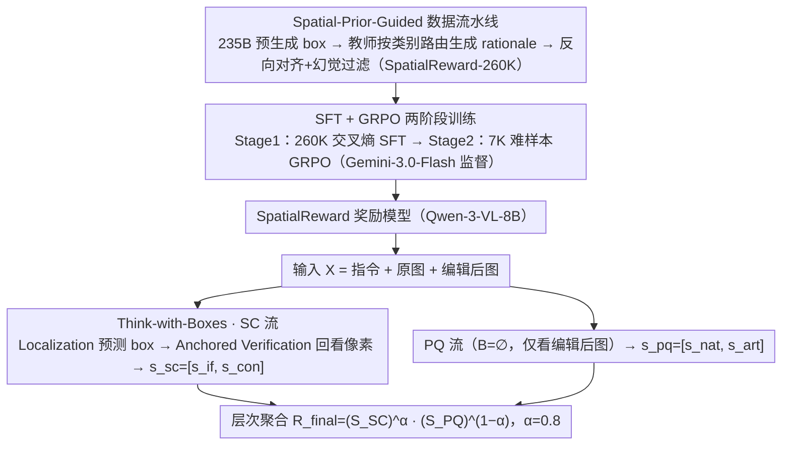

# SpatialReward: Bridging the Perception Gap in Online RL for Image Editing via Explicit Spatial Reasoning

**会议**: ICML 2026  
**arXiv**: [2602.07458](https://arxiv.org/abs/2602.07458)  
**代码**: 项目页 https://lorangan-ddup.github.io/SpatialReward/ (有)  
**领域**: 图像生成 / 图像编辑 / RLHF / 奖励模型 / 多模态评估  
**关键词**: Reward Model, 图像编辑, 在线 RL, Think-with-Boxes, 空间推理

## 一句话总结
作者指出 MLLM 类编辑奖励模型存在"注意力坍缩"问题——评分时不去比较原图与编辑后图、而是塌缩到 sink token 上做盲判，进而提出 SpatialReward：先让 8B 模型预测编辑区域的边界框、再以这些 box token 为锚做交错式跨图推理；配上一个 260K 样本的空间感知数据集和 GRPO 两阶段训练后，在三个 reward benchmark 上 SOTA，并把 OmniGen2 的 GEdit-Bench 分数拉升 +0.90（是 GPT-4.1 提升的两倍）。

## 研究背景与动机

**领域现状**：指令图像编辑（InstructPix2Pix、MagicBrush、OmniGen、Qwen-Edit、FLUX 等）这几年已经能把"风格转换"扩展到复杂多区域编辑。最近的 Flow-GRPO、Dance-GRPO 把在线 RL 引入扩散模型，把编辑当作交互试错过程对齐到人类偏好，效果远超 SFT。但在线 RL 的效果完全卡在 reward model 上——奖励信号必须可靠、高效、可解释，并且对图像各区域做细粒度判断。

**现有痛点**：现有 reward 设计有三类，每类都不适合做编辑任务的在线 RL：(i) pairwise 奖励（如 MMRB2）擅长零样本相对排序，但在线 RL 需要绝对标量，把排序换成标量会引入歧义、且 $O(N^2)$ 推理代价不可承受；(ii) pointwise 判别式（如 EditReward）在 VLM 嵌入上加线性头回归人类偏好，缺乏显式推理链，标注成本高，扩展性差；(iii) pointwise 生成式（"MLLM-as-a-judge"，如 EditScore、GPT-5）虽然能输出 chain-of-thought，但在编辑任务里需要严格的"跨图区域对照"——而当前主流 MLLM 缺少明确空间锚点，连 GPT-5 这种顶级闭源模型都会落入"注意力坍缩"：注意力分布塌缩到首尾几个 sink token 上，源图几乎被忽略，等同于退化为单图评估，自然漏掉细微差异。

**核心矛盾**：在线 RL 的训练动力学要求 reward model 既能做交叉图像的细粒度区域级判别、又能输出绝对标量；但现有 MLLM 评估者没有空间锚点引导跨图对比，所以无论是 prompt 工程还是参数蒸馏都治不好"注意力坍缩"，导致评分系统性偏离人类偏好。

**本文目标**：(i) 明确诊断并量化"注意力坍缩"这一感知缺口；(ii) 设计一个能强制 MLLM 做跨图区域对照的架构；(iii) 构建支撑这种能力的大规模空间感知数据；(iv) 用 GRPO 在难样本上对齐偏好；(v) 验证它能切实改进下游在线 RL 的编辑模型质量。

**切入角度**：作者发现人类做编辑判断时遵循"先定位、再对比"的两步流程，而 MLLM 没有内建这一流程；如果显式让模型在推理前先预测编辑区域的边界框、再把这些 box token 当成"看这里"的硬指针注入推理链，就能把注意力从 sink token 拉回到真正应该比较的像素区。

**核心 idea**：用 "Think-with-Boxes" 把空间锚点（bounding box）作为可被语言模型直接 cite 的 interleaved token，强制每次区域级判断都重新"看回去"，进而做出基于像素证据的细粒度评分；再通过空间先验数据流水线 + SFT→GRPO 两阶段训练把这种能力固化为稳定 reward signal。

## 方法详解

### 整体框架
SpatialReward 要解决的是"MLLM 评分时不回看源图"的感知缺口，做法是把 reward 从一次盲打分改造成一个条件生成任务：模型把输入 $X$ 映射成结构化输出 $Y=(B, \mathcal T, s)$，其中 $B$ 是被编辑区域的 bounding box 序列、$\mathcal T$ 是文本 rationale、$s$ 是标量分数。评估协议沿用 VIEScore 把判断解耦成两条性质不同的流——Semantic Consistency（SC，含指令遵循 $s_{if}$ 与源一致性 $s_{con}$）走"先定位再对比"的 Think-with-Boxes 路径并真正比对原图与编辑后图，Perceptual Quality（PQ，含自然度 $s_{nat}$ 与瑕疵 $s_{art}$）则只看编辑后图做无参考评估；两条流的结果最后以层次聚合 $R_{final}=(S_{SC})^{\alpha}(S_{PQ})^{1-\alpha}$（$\alpha=0.8$）合成最终 reward。

### 关键设计

**1. Think-with-Boxes：把"看哪里"写进推理链**

MLLM 之所以在 cross-image 评估时坍缩到首尾的 sink token，根因是它从未被强制 ground 到具体像素，于是源图被忽略、退化成单图盲判。SpatialReward 的对策是让 SC 流分三步走，把空间锚点做成模型能直接 cite 的 interleaved token：先做 Localization 预测所有被编辑对象的 bounding box $B$，输出形如 `<|bbox_0|>(x1,y1,x2,y2)`；再进入 Anchored Verification，rationale $\mathcal T$ 里每出现一个 `<|bbox_id|>` 就强制模型"回看"对应像素区域，并用一个额外的 `<|global|>` token 触发全局上下文扫描；最后吐出 SC 分数 $s_{sc}=[s_{if}, s_{con}]$。PQ 流不需要对照源图，因此 $B=\emptyset$，只输出纯文本 rationale 与 $s_{pq}=[s_{nat}, s_{art}]$。backbone 是 Qwen-3-VL-8B-Instruct。这样每产生一次区域级判断，模型都被 box token 逼着重新看回该看的地方，跨图注意力的健康分布随之恢复——Fig.1c 的注意力可视化清楚显示 attention 重新对齐到了源图的相应区域。

**2. Spatial-Prior-Guided 数据流水线：260K 三者对齐的训练集**

要让 SFT 学到"先 ground 再推理"的范式，就需要 box、rationale、score 三者一致对齐的大规模数据，而这单靠人类标注无法规模化获得。作者用三步流水线从开源模型 + 闭源教师里蒸馏出 SpatialReward-260k：Step I 用 Qwen-3-VL-235B-A22B-Instruct 给所有样本预生成 bounding box $B$ 作空间先验；Step II 按类别路由专家，让每个教师只干自己最擅长的活——人物编辑交给 Gemini-2.5-Pro 配 crop 提示生成 rationale，物体编辑交给 GPT-5 并在图上叠加可视化 box 强制空间聚焦，PQ 由 GPT-5 独立评估；Step III 把生成的 $\mathcal T_{raw}$ 与 $B$ 反喂 Qwen-3-VL-235B 做 alignment（写成 interleaved 格式）并做 hallucination check，凡 $\mathcal T$ 与 $B$ 的视觉证据不一致就丢弃，保证训练分布干净。最终 260K 由三部分构成：100K 重新清洗并注入 $B$ 的 EditScore 数据、100K 丢弃原粗粒度分数后重新生成 rationale 的 EditReward 数据、60K 自建多区域编辑数据。

**3. SFT + GRPO 两阶段训练：用在线 RL 补 SFT 的长尾偏差**

SFT 只能拟合教师分布的"平均水平"，对长尾难样本仍会幻觉打分，所以训练分两步走。Stage 1 在 Qwen-3-VL-8B-Instruct 上用 260K 数据做 SFT，目标为标准交叉熵 $\mathcal L_{SFT}=-\sum_t \log P_\theta(y_t|y_{<t}, X)$，输出 $Y$ 对 SC 任务展开为 $(B,\mathcal T,s)$、对 PQ 任务为 $(\mathcal T,s)$。Stage 2 从训练集挖出 7K 低分难样本，用 Gemini-3.0-Flash 当 Online Supervisor 给模型 rollouts 打 0–1 一致性分作 reward，按 GRPO 做组相对优化 $\mathcal J_{GRPO}=\mathbb E[\frac{1}{G}\sum_i \frac{\pi_\theta(o_i|q)}{\pi_{\theta_{old}}(o_i|q)}\hat A_i] - \beta D_{KL}(\pi_\theta\|\pi_{ref})$，优势 $\hat A_i=(r_i-\mathrm{mean}\{r_j\})/\mathrm{std}\{r_j\}$，恰好在 SFT 最容易出错的难样本上以一致性为目标把偏差拉回来。一个被低估但对 RL dynamics 很关键的细节是 reward 聚合：最终 reward 用 weighted geometric mean $R=(S_{SC})^\alpha (S_{PQ})^{1-\alpha}$，而非 min（bucket principle，梯度太稀疏、RL 收敛慢）或 arithmetic mean（无法惩罚短板），既给稠密梯度又能压住短板。聚合与权重参数 $\alpha=0.80$、$w_{SC}=\{0.6,0.4\}$（指令遵循:源一致性）、$w_{PQ}=\{0.5,0.5\}$ 均由 2K 验证样本上的 grid search 确定，GRPO 的 group size $G$、KL 系数 $\beta$ 等按 DeepSeek-R1 系列默认。

## 实验关键数据

### 主实验
三个 reward benchmark 上的总体准确率（粗体表示最高、SpatialReward 用 Qwen-3-VL-8B）：

| 模型 | EditReward-Bench (Ovrl) | MMRB2 (Ovrl) | MER-Bench (Ovrl) |
|------|------------------------|--------------|------------------|
| GPT-4.1 | 0.705 | 0.535 | 0.358 |
| GPT-5 | 0.755 | 0.619 | 0.423 |
| Gemini-2.5-Pro | 0.722 | 0.534 | 0.462 |
| Gemini-3.0-Flash | 0.769 | 0.621 | **0.508** |
| EditScore-8B (baseline) | 0.690 | 0.570 | 0.350 |
| EditReward (判别) | 0.792 | 0.657 | 0.448 |
| **SpatialReward (Ours, 8B)** | **0.803** | **0.661** | 0.483 |

下游在线 RL（基于 OmniGen2 + Flow-GRPO，在 GEdit-Bench-EN 上的 Overall 分数提升 $\Delta$）：

| Reward signal | GEdit Ovrl | $\Delta$ |
|---------------|-----------|----------|
| Baseline OmniGen2 | 6.42 | — |
| w/ GPT-4.1 | 6.73 | +0.45 |
| w/ EditScore | 6.89 | +0.61 |
| w/ EditReward | 7.19 | +0.77 |
| **w/ SpatialReward** | **7.32** | **+0.90** |
| 同框架换到更强 backbone（UniRef-Edit） | 7.46→7.56 | +0.10 |

### 消融实验

| 配置 | EditReward-Bench 准确率 | 说明 |
|------|------------------------|------|
| SFT baseline（无空间锚） | 0.743 | 起点 |
| SFT w/ Box Only（只预测 box，不 cite） | 0.761 | 加 box 已有收益 |
| SFT w/ Think-with-Box | 0.778 | 显式 cite 进一步涨 |
| **+ Online GRPO** | **0.803** | RL 阶段最关键 |
| Bucket Principle（min 聚合） | 0.774 | 稀疏梯度，RL 慢 |
| Arithmetic Mean 聚合 | 0.771 | 不惩罚短板 |
| Weighted Geometric Mean (Ours) | **0.803** | 既密又能惩罚短板 |

注意力诊断（在 776 个 EditReward-Bench 样本上）：

| 方法 | 熵差 $|\Delta H|$ ↓ | 源熵 $H_{src}$ | 集中度 ↓ | 跨样本一致性 ↑ |
|------|-------------------|----------------|----------|---------------|
| Baseline | 3.48 ± 0.57 | 2.88 ± 0.71 | 0.84 ± 0.05 | 0.04 |
| **Ours** | **1.16 ± 1.10** | **5.71 ± 0.81** | **0.37 ± 0.14** | **0.12** |

### 关键发现
- 仅靠"先预测 box"就能涨 1.8 个点，加上"cite box 引导推理"再涨 1.7 个点；说明空间锚点 + 主动 cite 是两个独立的有效成分，前者给监督信号、后者改造推理路径。
- 在 MER-Bench 4-Pair 难度（要求区分细粒度子维度差异）上，SpatialReward 21.5% 准确率超越 Gemini-3.0-Flash（19.5%），证明空间锚点对最难的 fine-grained 区分尤其有效。
- 在 RL 上 SpatialReward 的 +0.90 是 EditScore（+0.61）的 1.5 倍、GPT-4.1（+0.45）的 2 倍，并且推理速度比 EditReward 快 1.5×（依托 vLLM 集成）。
- 注意力诊断 quantitative 地确认了"注意力坍缩"假设：baseline 集中度 0.84 → 0.37，源熵 2.88 → 5.71，几乎把分布拉回到对称健康状态。

## 亮点与洞察
- 第一次把 "MLLM-as-a-judge 不会跨图比较" 这一长期被默认的事实定量诊断为"attention collapse 到 sink token"，并用一个简单的 box-cite 机制根治；这种"先诊断—再对症"的范式比单纯做新数据/新损失更有说服力。
- Think-with-Boxes 的本质是"让生成 token 之间能传递空间硬指针"，这一思路完全可以迁移到任何需要 cross-image / cross-region 判断的任务（多文档检索、UI 验证、空间问答），不限于编辑评估。
- 用 weighted geometric mean 作 reward 聚合是一个被低估的工程细节：min 在 RL 里给稀疏梯度训练效率差，arithmetic mean 无法惩罚短板，geometric mean 兼顾二者；论文给的 Fig.6 训练曲线直观显示 reward 设计对 RL dynamics 的实质影响。
- 数据流水线里"专家路由 + box overlay 强制聚焦 + 反向 alignment 与一致性 check"是从开源模型 + 闭源教师生成高质量数据的标准模板，可复用。

## 局限与展望
- SpatialReward 的 reward 是单标量，没有把每个编辑区域的局部 reward 单独反传给生成器；作者也承认这是未来方向（region-level credit assignment 可与 Flow-GRPO 结合，给出更密集的局部监督信号）。
- 空间锚点完全依赖 box，不支持任意形状（mask）；细颗粒任务（如发丝级编辑）下 box 可能太粗。
- GRPO 阶段使用的 Gemini-3.0-Flash 作 supervisor，本身仍是闭源模型，限制了 reward 模型的完全开源复现。
- 8B 模型在 MER-Bench 上仍弱于 Gemini-3.0-Flash（0.483 vs 0.508）；MER-Bench 综合排名第二，说明空间锚点并未完全填平 8B 与超大模型在复杂多约束推理上的 gap。

## 相关工作与启发
- **vs EditScore（生成式 baseline）**：EditScore 用同样的 8B backbone 蒸馏自 GPT-4.1，但没有空间锚点，注意力坍缩明显；本文证明只要补上 Think-with-Boxes 就能在同等参数下 +11.3%。
- **vs EditReward（判别式 SOTA）**：EditReward 仅训练指令遵循维度，缺失源一致性建模，在线 RL 时容易让生成器过度修改未指定区域；本文用显式 SC 维度避免 content drift（论文 Fig.7 给出强对比）。
- **vs VIEScore / GPT-4.1 (UniPic) / RewardDance / OneReward**：这些方法都把 reward 寄托于强模型本身或 yes/no token 概率，没有架构上的空间机制；本文证明哪怕用 8B 模型，只要让推理 ground 到空间锚点，就能稳定超过万亿参数闭源模型。
- **vs Shikra / Qwen-VL / Kosmos-2 / Ferret（VLM 空间推理）**：这些工作证明显式坐标输出能强化对象-属性绑定，本文是第一次把这条结论用到 reward modeling，把"推理时显式 cite 空间坐标"作为 reward 评估的核心机制。

## 评分
- 新颖性: ⭐⭐⭐⭐⭐ 用"诊断 attention collapse → 引入空间锚 token → 让生成 token 之间传递硬指针"打开了 MLLM reward 评估的全新设计空间。
- 实验充分度: ⭐⭐⭐⭐⭐ 三个 reward benchmark + 在线 RL 在两个编辑 backbone 上的对比 + 注意力诊断 + 聚合策略消融，环环相扣。
- 写作质量: ⭐⭐⭐⭐⭐ 从"perception gap"到"Think-with-Boxes"再到"two-stage training"，叙事和图示（Fig.1/2/5/6）都极清晰。
- 价值: ⭐⭐⭐⭐⭐ 既是 SOTA 编辑 reward 模型，也是开放 RL pipeline 的关键组件，可直接拿来训练自家编辑模型而无需依赖闭源 GPT-4.1。

<!-- RELATED:START -->

## 相关论文

- [\[ICLR 2026\] EditScore: Unlocking Online RL for Image Editing via High-Fidelity Reward Modeling](../../ICLR2026/image_generation/editscore_unlocking_online_rl_for_image_editing_via_high-fidelity_reward_modelin.md)
- [\[CVPR 2026\] SpatialReward: Verifiable Spatial Reward Modeling for Fine-Grained Spatial Consistency in Text-to-Image Generation](../../CVPR2026/image_generation/spatialreward_verifiable_spatial_reward_modeling_for_fine-grained_spatial_consis.md)
- [\[ICML 2026\] A Systematic Investigation of RL-Jailbreaking in LLMs](a_systematic_investigation_of_rl-jailbreaking_in_llms.md)
- [\[ICLR 2026\] Bridging Generalization Gap of Heterogeneous Federated Clients Using Generative Models](../../ICLR2026/image_generation/bridging_generalization_gap_of_heterogeneous_federated_clients_using_generative_.md)
- [\[CVPR 2026\] ReasonEdit: Towards Reasoning-Enhanced Image Editing Models](../../CVPR2026/image_generation/reasonedit_towards_reasoning-enhanced_image_editing_models.md)

<!-- RELATED:END -->
