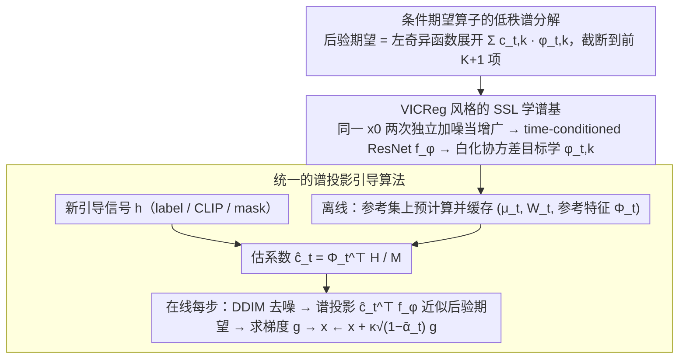

# Spectral Guidance for Flexible and Efficient Control of Diffusion Models

**会议**: ICML 2026  
**arXiv**: [2605.28900](https://arxiv.org/abs/2605.28900)  
**代码**: https://github.com/gabmoreira/spectralguidance  
**领域**: 扩散模型 / 图像生成 / 可控生成  
**关键词**: 谱引导, 训练免费引导, 条件期望算子, 奇异值分解, 自监督学习

## 一句话总结
本文提出 Spectral Guidance：通过自监督学习扩散过程条件期望算子的左奇异函数，把任意引导信号（标签 / CLIP / mask）投影到这组与扩散动力学对齐的谱基上，绕开 denoiser 反向传播，在 CIFAR-10 上较最强 training-free 基线提升 37 个百分点准确率且采样快 4 倍。

## 研究背景与动机

**领域现状**：扩散模型的可控生成主要走两条路。一是 classifier guidance / classifier-free guidance，从训练阶段就把模型绑定到固定条件集；二是 training-free guidance（DPS / LGD / FreeDoM / TFG），在采样时通过 denoiser 的点估计 $\hat{x}_0(x_t)$ 把任意 clean-data loss $p(y\mid x_0)$ 拉回到 $x_t$ 空间。

**现有痛点**：第一类不灵活，换条件就得重训；第二类灵活但代价大：需要在每个采样步对 denoiser 做反向传播，计算昂贵且梯度容易消失；同时 $p(y\mid x_0)\approx p(y\mid \hat{x}_0(x_t))$ 这个近似只在 $p(y\mid x_0)$ 是 $x_0$ 的仿射函数时严格成立，在大噪声水平下后验均值常常飘到数据流形外，导致引导梯度方向错误。

**核心矛盾**：训练免费引导既想用任意 clean-data 信号、又被迫穿过 denoiser 做点估计，灵活性与稳定性 / 效率天然冲突。

**本文目标**：构造一种与具体引导信号无关的中间表示，使得"算 $p_t(y\mid x_t)$"退化为线性投影、与 denoiser 解耦。

**切入角度**：把条件期望 $p_t(y\mid x_t)=\mathbb{E}_{X_0\sim p_t(\cdot\mid x_t)}[p(y\mid X_0)]$ 看作一个从 clean 空间 $\mathcal{H}_0$ 到 noisy 空间 $\mathcal{H}_t$ 的线性算子 $T_t$；随着 $t$ 增大噪声把信息抹掉，$T_t$ 几乎处处低秩，只剩少数"抗噪"方向。这些方向就是 $T_t$ 的左奇异函数 $\{\phi_{t,k}\}$，它们组成一组随时间变化、与扩散动力学对齐的低维坐标。

**核心 idea**：把任意引导信号在这组左奇异基上做谱展开 $\mathbb{E}[h(X_0)\mid x_t]=\sum_k c_{t,k}\phi_{t,k}(x_t)$，截断到前 $K+1$ 项就能得到稳定且廉价的引导估计；而 $\phi_{t,k}$ 本身可用一个 VICReg 风格的 SSL 目标离线学到，不再依赖 denoiser 的梯度。

## 方法详解

### 整体框架
训练免费引导的瓶颈在于每一步都要算后验期望 $p_t(y\mid x_t)$，而这一步绕不开 denoiser 的点估计与反向传播。本文把这件事代数化：先离线学一组与扩散过程对齐的"谱坐标"，把它当作所有引导信号共享的中间表示；之后任意新引导信号只要在这组坐标上做一次投影，在线采样就退化成浅网络上的线性投影加一次浅梯度，再不碰 denoiser。整套流程分离线、在线两段——离线学谱基并缓存参考特征，在线把 label / CLIP / mask 信号投影进去逐步注入轨迹。

### 关键设计

**1. 条件期望算子的低秩谱分解：把"算后验期望"变成与 denoiser 无关的线性投影**

training-free 引导卡在 $p_t(y\mid x_t)=\mathbb{E}_{X_0\sim p_t(\cdot\mid x_t)}[p(y\mid X_0)]$ 这一步既依赖具体信号 $h$、又依赖 denoiser 点估计 $\hat x_0(x_t)$，大噪声下点估计飘出流形导致梯度方向错。本文把后验期望看成一个线性算子 $T_t:\mathcal{H}_0\to\mathcal{H}_t$，$(T_tf)(x_t):=\mathbb{E}[f(X_0)\mid x_t]$，其伴随 $T_t^\ast$ 对应正向扩散。协方差算子 $T_tT_t^\ast$ 紧自伴，存在谱分解 $T_tf=\sum_k \sigma_{t,k}\phi_{t,k}(x_t)\,\mathbb{E}_{p_0}[f\psi_{t,k}]$，其中 $\sigma_{t,1}=1$ 对应常数模。于是命题 4.1 把任意 $h\in\mathcal{H}_0$ 的后验期望写成左奇异函数上的展开

$$\mathbb{E}[h(X_0)\mid x_t]=\sum_k c_{t,k}\,\phi_{t,k}(x_t),\qquad c_{t,k}=\mathbb{E}[h(X_0)\phi_{t,k}(X_t)].$$

这样"算后验期望"就从依赖 $h$、依赖 denoiser 的点估计，变成只依赖扩散过程本身的固定线性投影。之所以能截断成低秩，是因为截到前 $K$ 项的 $L^2(p_t)$ 误差被 $\sigma_{t,K+1}^2\|h\|_{p_0}^2$ 控制，而命题 4.7 进一步证明 $\sigma_{t,k}^2\le \mathbb{E}_{p_0}[\chi^2(p_t(\cdot\mid X_0)\|p_t)]$（$k\ge2$）在 $\bar\alpha_t\to0$ 时归零——噪声越大能存活的模式越少，低秩近似反而越严格，$K$ 也因此成了引导的"内在信息维度上界"。

**2. VICReg 风格的 SSL 学谱基：用扩散自身的两次加噪当增广，不碰 denoiser 就学到奇异函数**

奇异函数 $\{\phi_{t,k}\}$ 需要在不接触 denoiser 的前提下学到。定理 4.2 给出了变分刻画：对任意 $f=(f_1,\dots,f_K)^\top$ 且 $\mathbb{E}_{p_t}[f]=0$，有 $\max_f \operatorname{Tr}(\mathbf{C}_t(f)\boldsymbol{\Sigma}_t(f)^{-1})=\sum_{k=2}^{K+1}\sigma_{t,k}^2$，最大化子恰是 $\text{span}\{\phi_{t,k}\}$。这是个 Rayleigh–Ritz 形式，等价于以 $\zeta(x_t,\tilde x_t):=\int p_t(x_t\mid x_0)p_t(\tilde x_t\mid x_0)p_0(x_0)\,dx_0$ 为核的 Kernel PCA。关键观察是：对同一个 $x_0^{(i)}$ 采两次独立噪声得到的 $(x_t,\tilde x_t)$ 本身就是协方差算子 $T_tT_t^\ast$ 的成对采样——它替代了 VICReg 里手工 crop / color jitter 的增广，使 SSL 目标与谱分解严格对应。实现上把这一对过轻量 time-conditioned ResNet $f_\phi:\mathcal{X}\times\mathbb{R}_{>0}\to\mathbb{R}^K$ 得 $\mathbf{Z},\tilde{\mathbf{Z}}\in\mathbb{R}^{B\times K}$，用 batch 协方差的特征分解 $\hat{\boldsymbol{\Sigma}}=\mathbf{V}\boldsymbol{\Lambda}\mathbf{V}^\top$ 构造白化矩阵 $\mathbf{W}=\mathbf{V}(\boldsymbol{\Lambda}+\xi\mathbf{I})^{-1/2}$，再优化

$$L=-\operatorname{Tr}\big((\mathbf{Z}^w)^\top\tilde{\mathbf{Z}}^w\big)\big/\big(K(B-1)\big),$$

其中白化项 $\boldsymbol{\Sigma}_t(f)^{-1}$ 起防坍塌作用，并对一侧做 stop-gradient 稳定训练。

**3. 统一的谱投影引导算法：重活前置离线，在线只剩浅梯度且三任务复用一套基**

有了 $f_\phi$，就能把所有"重活"前置到一次性离线阶段：对每个 $t\in\mathcal{T}$ 在参考集 $\mathcal{D}_\text{ref}=\{x_0^{(i)}\}_{i=1}^M$ 上预计算白化变换 $(\boldsymbol{\mu}_t,\mathbf{W}_t)$ 与参考特征矩阵 $\boldsymbol{\Phi}_t=[\mathbf{1}\;(\mathbf{Z}_t-\boldsymbol{\mu}_t)\mathbf{W}_t]\in\mathbb{R}^{M\times(K+1)}$ 并缓存。来了新引导信号 $h$ 只需一次 Monte Carlo 估系数 $\hat{\mathbf{c}}_t=\boldsymbol{\Phi}_t^\top\mathbf{H}/M$。采样阶段（算法 2）每步先做标准 DDIM 去噪，再用 $\hat{\mathbf{c}}_t^\top f_\phi^w(x,t)$ 近似 $\mathbb{E}[h(X_0)\mid x_t]$，对其求梯度 $g=\nabla_{x}\mathcal{L}(\hat{\mathbf{c}}_t^\top f_\phi^w(x,t))$，按 $x\leftarrow x+\kappa\sqrt{1-\bar\alpha_t}\,g$ 注入轨迹。三类任务只换损失 $\mathcal{L}$：label 用 $\nabla z/z$ 形式的对数似然（截断展开可能局部违反正性，故用比值代替 $\log$），CLIP 用 $\mathcal{L}(\mathbf{z})=\mathbf{z}^\top \mathbf{e}_\text{text}/\|\mathbf{z}\|$，mask 用 $-\|\mathbf{z}-\mathbf{z}_\text{target}\|^2$。因为梯度只穿过 16M 参数的 $f_\phi$（denoiser 是 114M）、且同一套 $\{\boldsymbol{\Phi}_t\}$ 在所有下游任务间复用，"任意引导信号免重训"才真正落地。

### 损失函数 / 训练策略
训练只优化单一目标 $L=-\operatorname{Tr}((\mathbf{Z}^w)^\top\tilde{\mathbf{Z}}^w)/(K(B-1))$，外加白化的小岭项 $\xi$；timestep 从 $\mathcal{T}$ 均匀采样、batch 内重算 $\boldsymbol{\mu},\mathbf{W}$，对一侧做 stop-gradient。CIFAR-10 / CelebA-HQ 取 $K=512$，ImageNet 取 $K=2000$；CelebA-HQ 训 $f_\phi$ 约 10 GPU·h，预计算 $\{\boldsymbol{\Phi}_t\}$ 仅 0.8 GPU·h。

## 实验关键数据

### 主实验
在 CIFAR-10 / CelebA-HQ / ImageNet 上对照 DPS / LGD / FreeDoM / MPGD / UGD / TFG，覆盖 label / 属性组合 / CLIP / mask 四种引导，所有方法共用同一个无条件 DDPM U-Net。

| 数据集 / 任务 | 指标 | 无引导 | 最强 baseline | 本文 | 提升 |
|---|---|---|---|---|---|
| CIFAR-10 / Labels | Acc↑ | 10.0 | 52.0 (TFG) | **89.4** | **+37.4** |
| CIFAR-10 / Labels | FID↓ | 98.1 | 88.3 (MPGD) | **70.7** | −17.6 |
| CelebA-HQ / Gender+Age | Acc↑ | 25.0 | 75.2 (TFG) | **91.5** | +16.3 |
| CelebA-HQ / Gender+Hair | Acc↑ | 22.4 | 76.0 (TFG) | **88.3** | +12.3 |
| ImageNet / Labels | Acc↑ | 0.0 | 40.9 (TFG) | **41.6** | +0.7 |
| CelebA-HQ / Mask | IoU↑ | 0.38 | 0.78 (TFG, FreeDoM) | **0.80** | +0.02 |
| CelebA-HQ / CLIP | VQAScore↑ | 0.34 | 0.62 (TFG) | **0.64** | +0.02 |

效率对比（CelebA-HQ，DDIM 100 步，batch=1）：

| 阶段 | 指标 | 无引导 | TFG | 本文 |
|---|---|---|---|---|
| 离线 | 训 $f_\phi$ / GPU·h | – | – | 10.0 |
| 离线 | 预计算 $\{\Phi_t\}$ / GPU·h | – | – | 0.8 |
| 在线 | 每步延迟 / ms | 19.2 | 81.2 | **21.7** |
| 在线 | 单图吞吐 / s | 1.9 | 8.1 | **2.2** |
| 在线 | 峰值显存 / GB | 1.1 | 2.8 | 3.6 |
| 端到端 | 1 万图总耗时 / h | 5.3 | 22.5 | **16.9** |

### 消融实验
| 配置 | 关键指标 | 说明 |
|---|---|---|
| Full（$K=512$，扫 $\kappa$） | Acc-FID 前沿 | 显著优于所有 training-free 基线，逼近需要带噪 classifier 的 CG |
| 改变秩 $K\in\{8,\dots,512\}$ | Acc 在 $K=8\to 128$ 急升后饱和 | 印证 Prop. A.11 的低秩误差界，前几模式即可承载多数可恢复类信息 |
| 大 $\kappa$ | FID 退化 | 引导主导得分会把轨迹推离数据流形，呈现典型多样性 - 保真度权衡 |
| 滑动时间窗 $[\tau-100,\tau+100]$ | Acc(τ) 与 $\operatorname{tr}(T_tT_t^\ast)$ 归一化迹高度相关 | CIFAR-10 最佳窗口 $\tau\approx 400$，CelebA-HQ $\tau\approx 700$，对应谱"相变"区 |

### 关键发现
- CIFAR-10 上 37 个百分点的跨越主要来自谱基本身——同样的 $\{\boldsymbol{\Phi}_t\}$ 既支撑 label 又支撑 CLIP / mask，证明这套坐标确实是"任务无关的扩散内在结构"。
- $K$ 不仅是表示维度，超过饱和点后实质等价于"引导强度旋钮"：每加一模等价于在固定 $\kappa$ 下放大有效引导尺度，进一步压窄类内多样性。
- $T_tT_t^\ast$ 的谱在中段存在相变（CIFAR-10 ~400、CelebA-HQ ~700），相变区恰好是引导最有效的时间窗——这给出了"何时引导"的可解释判据，也解释了 CIFAR-10 上 posterior-mean 类方法表现差（相变早，早期反向步缺乏稳定引导信号）。
- 反向投影到像素级的稠密约束（如 inpainting 一半 256×256×3 图像需满足约 9.8 万独立约束）超出 $K$ 维子空间表达能力，故 Spectral Guidance 与 DPS 类方法是互补关系而非替代。

## 亮点与洞察
- **把"训练免费引导"重写为"训练免费的谱投影"**：之前 training-free 路线被卡在 $p_t(y\mid x_t)$ 难算这一步，作者把它代数化为算子 SVD，再用 SSL 学奇异函数——一次性把所有 $h$ 的引导问题统一在同一组基上。
- **VICReg 与扩散的天然耦合**：两次独立加噪本身就是协方差算子的成对采样，让原本启发式的"扩增-不变性"获得了严格的谱解释；这意味着任何"成对随机退化"过程都可能被借来学谱基。
- **谱相变作为引导窗口的物理指针**：把"应在哪些步上施加引导"从超参经验提升到由 $\sigma_{t,k}$ 衰减曲线决定，可以迁移到任何 score-based 模型作可解释的 schedule 设计。
- **离线-在线分摊**：把 denoiser 反向传播彻底踢出在线路径，每步只剩 16M 浅梯度，是 plug-and-play 引导真正能上规模的关键工程姿态。

## 局限与展望
- 作者承认目前只在像素级、中等规模 DDPM 上验证，未直接评测 latent diffusion / 大规模 T2I 基础模型；不过 $T_t$ 与谱分解只依赖扩散过程本身，在 latent 空间训 $f_\phi$ 是自然延展。
- 估 $\hat{\mathbf{c}}_t$ 需要一个带 $h$ 标注的参考集 $\mathcal{D}_\text{ref}$，而 training-free 基线只要现成 loss / 预训模型；当目标领域无标注数据时是实质成本，作者指出 $\mathcal{D}_\text{ref}$ 可以小、并可从无条件模型自采。
- 像素级线性逆问题（inpainting / 超分）所需约束数远超 $K$，本方法的低秩子空间表达不够；与 DPS 类后验均值方法互补而非替代。
- 个人补充：所有结果都基于无条件 DDPM + DDIM 100 步，未与 CFG 在大规模 latent T2I 上的实际可控性正面对比，难以判断该框架在"开放词表 prompt + 强先验"场景下的真实增益；同时谱基对训练分布偏移（domain gap）的鲁棒性、与 flow matching 等非 score-based 生成模型的兼容性都是待验证的开放问题。

## 相关工作与启发
- **vs CG / CFG**：CG/CFG 把条件烧进训练，换条件就重训；本文用无条件模型 + 谱基组合，做到一次训练任意条件复用，且在线代价与 CG 同量级。
- **vs DPS / LGD / MPGD**：它们都依赖 $\hat{x}_0(x_t)$ 这一点估并穿过 denoiser 求梯度；本文用算子 SVD 显式建模整个后验期望、把梯度限制在浅网 $f_\phi$ 上，准确率和速度同时上去。
- **vs UGD / FreeDoM / TFG**：这些方法用"time-travel"与自适应 schedule 弥补点估的不稳；本文从谱衰减直接读出引导窗口，把 schedule 设计从经验拍数变成有理论依据的选择。
- **vs NoiseCLR / 雅可比谱编辑（Park et al. 2023、Chen et al. 2024）**：后者把谱分析用于发现编辑方向的 post-hoc 工具；本文把谱分解前置为引导的本体——同样是"谱"，目标完全不同。

## 评分
- 新颖性: ⭐⭐⭐⭐⭐ 把训练免费引导重写为算子 SVD + SSL 学谱基，是 guidance 范式上的真创新
- 实验充分度: ⭐⭐⭐⭐ 三数据集 / 四任务 / 七基线齐全，但缺 latent diffusion 与大规模 T2I 验证
- 写作质量: ⭐⭐⭐⭐⭐ 数学推导（命题 4.1 / 定理 4.2 / 命题 A.11）与算法 / 实验衔接非常清晰
- 价值: ⭐⭐⭐⭐⭐ 同时给出可控性、效率、可解释性三方面收益，并把"引导窗口"提升为可读的物理量

<!-- RELATED:START -->

## 相关论文

- [\[CVPR 2026\] CFG-Ctrl: Control-Based Classifier-Free Diffusion Guidance](../../CVPR2026/image_generation/cfg-ctrl_control-based_classifier-free_diffusion_guidance.md)
- [\[ICML 2026\] Caracal: Causal Architecture via Spectral Mixing](caracal_causal_architecture_via_spectral_mixing.md)
- [\[AAAI 2026\] RelaCtrl: Relevance-Guided Efficient Control for Diffusion Transformers](../../AAAI2026/image_generation/relactrl_relevance-guided_efficient_control_for_diffusion_transformers.md)
- [\[ICML 2026\] GuidedBridge: Training-freely Improving Bridge Models with Prior Guidance](guidedbridge_training-freely_improving_bridge_models_with_prior_guidance.md)
- [\[ICML 2026\] Local Hessian Spectral Filtering for Robust Intrinsic Dimension Estimation](local_hessian_spectral_filtering_for_robust_intrinsic_dimension_estimation.md)

<!-- RELATED:END -->
