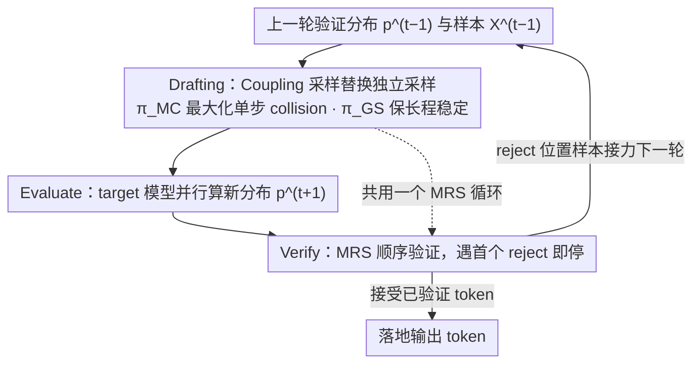

# Speculative Coupled Decoding for Training-Free Lossless Acceleration of Autoregressive Visual Generation

**会议**: ICML 2026  
**arXiv**: [2510.24211](https://arxiv.org/abs/2510.24211)  
**代码**: https://github.com/junhyukso/SCD (有)  
**领域**: 图像生成 / 自回归视觉模型 / 推理加速  
**关键词**: 投机解码, Jacobi 迭代, Coupling, 自回归图像生成, 无损加速

## 一句话总结
本文发现 Speculative Jacobi Decoding (SJD) 在自回归视觉生成中加速有限的根因是连续迭代之间 draft token 的独立采样导致 collision 概率几乎为零；只需把独立采样换成 Maximal/Gumbel Coupling（一行修改、零额外训练），就能把图像生成最高加速到 $4.2\times$、视频生成 $13.6\times$，并严格保持输出分布与原 AR 解码一致。

## 研究背景与动机

**领域现状**：自回归（AR）建模已经成为统一图像、视频、3D、音频生成的主流范式（Lumina-mGPT, Janus-Pro, Cosmos-1-AR 等），但生成一张高分辨率图像要数千个 token 串行解码，导致严重的推理延迟。Speculative Decoding (SD) 是 LLM 文本侧加速的事实标准，思想是用一个便宜的 draft 模型先猜 $L$ 个 token，再让 target 模型并行验证，靠 modified rejection sampling 保证输出严格服从 target 分布。

**现有痛点**：标准 SD 在视觉 AR 上效果差——一方面需要单独训一个 draft 模型，开销大；另一方面视觉 token 分布非常 flat，draft 命中率低。最近提出的 Speculative Jacobi Decoding (SJD) 用上一轮 Jacobi 验证的分布当下一轮 draft，绕过了训 draft 模型的麻烦，无需训练，但图像加速只有 $\sim 2\times$，远低于文本 SD 的 $4\times$+。

**核心矛盾**：作者发现 SJD 的接受率 $\beta_i^{(t)} = 1 - \mathcal{D}_{TV}(p^{(t)}, p^{(t-1)})$ 直接由"相邻两轮 prefix 上下文的相似度"决定。问题在于：即使两个 draft 分布在概率空间上很接近（TV 距离小），由于独立采样，真正采出来的 token 序列之间的 collision 概率（$\Pr[X^{(t)} = X^{(t-1)}]$）依然极低——视觉 token 分布平坦让 Rényi-2 entropy 很大，独立采样的 collision 概率被熵上界压制到几乎为零，约 94% 的位置每轮都在变。这种"概率空间近 ≠ 实现空间近"的撕裂让 SJD 收敛轨迹极不稳定，接受率波动大且不收敛。

**本文目标**：在不引入额外模型、不修改 target 模型、不破坏 lossless 性质的前提下，把 SJD 的有效接受率拉满，从而把视觉 AR 的加速比推到与文本 SD 同档甚至更高。

**切入角度**：既然根因是"独立采样让 collision 概率被熵卡死"，那就别独立采样——用信息论里的 Coupling 工具，让相邻两轮的 draft 采样共享随机性，在保证各自边缘分布不变的前提下最大化 $\Pr[X^{(t)} = X^{(t-1)}]$。由于 SD 的 lossless 性质只依赖于 draft 的边缘分布、与 draft 之间的相关性无关，Coupling 是"白嫖"的稳定性增益。

**核心 idea**：把 SJD drafting 阶段那行独立采样替换成 Maximal Coupling（等价于复用验证里的 MRS）或 Gumbel Sharing Coupling，一行代码、零额外训练、零额外显存，把 collision 概率从接近 0 推到 $1 - \mathcal{D}_{TV}$ 上界附近。

## 方法详解

### 整体框架

SCD 要解决的是 SJD「概率空间近但样本空间远」的问题：相邻两轮 draft 分布很接近，但因为每轮都独立重采样，真正采出的 token 几乎每次都变，接受率被卡死。它的做法不是改模型也不是改验证逻辑，而是只动 drafting 阶段的采样器——让相邻两轮共享随机性，在各自边缘分布不变的前提下尽量采到同一个 token。整体仍沿用 SJD 的三段循环：drafting 阶段并行从上一轮验证分布 $p^{(t-1)}$ 给窗口内每个位置采 draft token；evaluate 阶段让 target 模型并行算这些 prefix 下的新分布 $p^{(t+1)}_j = p_\theta(\cdot \mid X^t_{0:j-1})$；verify 阶段用 modified rejection sampling（MRS）顺序验证，遇到第一个 reject 就停，落地之前的 token、把 reject 位置的新样本接力为下一轮 draft。SCD 唯一的改动是把 drafting 里那行「从 $p^t_j$ 独立采样」换成「从 $p^t_j$ 与 $p^{t-1}_j$ 的 Coupling 联合分布里采样一对 $(X^t_j, X^{t-1}_j)$，取 $X^t_j$ 当 draft」。

### 关键设计

**1. Maximal Coupling（$\pi_{MC}$）：把单步 collision 推到理论上界**

SJD 的接受率由相邻两轮 draft token 的 collision 概率 $\Pr[X^{(t)}=X^{(t-1)}]$ 决定，而独立采样让它被 Rényi-2 熵上界 $C_{SJD} \le e^{-\frac{1}{2}(H_2(p)+H_2(q))}$ 压到接近 0——视觉 token 分布平坦、熵大，约 94% 的位置每轮都在变。Coupling 的思路是构造一个联合分布 $\pi(x,y)$，在保持两个边缘 $x\sim p^{(t)}$、$y\sim p^{(t-1)}$ 不变的前提下，把 collision 概率 $C(\pi)=\Pr[X=Y]$ 顶到理论极限 $1-\mathcal{D}_{TV}(p^{(t)}, p^{(t-1)})$。关键观察是：验证阶段用的 MRS 本身就是一个 maximal coupling——给定 $X\sim Q$，它输出的 $Y$ 满足 $Y\sim P$ 且 $\Pr[Y=X]=1-\mathcal{D}_{TV}(P,Q)$。所以 drafting 阶段直接复用同一个 MRS：从上一轮的 $X^{t-1}_j$ 出发跑 $\texttt{MRS}(p^t_j, p^{t-1}_j, X^{t-1}_j)$ 就得到新 draft $X^t_j$，算法上只是把 SJD 第 5 行的独立 sample 换成一行 MRS 调用。这样每一对相邻迭代都贪婪地把 collision 顶满，1-step 接受率被最大化；而因为 lossless 只依赖 draft 的边缘分布、与两轮间的相关性无关，输出分布严格保持不变。

**2. Gumbel Sharing Coupling（$\pi_{GS}$）：换取多步长程稳定性**

$\pi_{MC}$ 是 1-step 贪婪最优，但对连续多步迭代没有非平凡保证，可能局部最优却长程仍抖。$\pi_{GS}$ 提供另一种实现：让两轮 categorical sampling 共享同一份 Gumbel 噪声 $G$，用 Gumbel-Max trick 取 $X=\arg\max_i(\log P_i+g_i)$、$Y=\arg\max_i(\log Q_i+g_i)$，分布相近时两者大概率落到同一个 token。它的单步 collision 下界是 $C(\pi_{GS})\ge (1-\mathcal{D}_{TV})/(1+\mathcal{D}_{TV})$，略低于 $\pi_{MC}$ 的 $1-\mathcal{D}_{TV}$；但这个下界对任意一对分布都成立，因此能延伸到多步 Hamming 距离 $\mathrm{Hamm}(t,t+N)$ 上给出保证。实现上 Gumbel 噪声可以用 token 全局 index 哈希在线生成，零显存开销。代价是单步略弱、收益是长程更稳，所以在 draft 容易预测的任务上更划算——比如视频 AR 相邻帧高度相似、低分辨率图像，这些场景里「早期 draft token 保持不变」带来的收益超过「持续微调它们」。

**3. 零开销实现整合：drafting 与 verify 共用一个 MRS 循环**

因为 drafting 和 verify 用的是同一种 MRS 操作，两者可以融进同一个循环、不增加任何额外 forward。作者观察到 SCD 第 5 行的 $\texttt{MRS}(p^t_j, p^{t-1}_j, X^t_j)$ 与第 10 行的 $\texttt{MRS}(p^{t+1}_j, p^t_j, X^t_j)$ 其实是同一操作——下一轮的 $p^{t+1}$ 就是上一轮的 $p^t$。于是把验证循环向量化（不提前 break、只记录第一个 reject 的 index），就能在一趟里同时完成 drafting 与 verify。实测在 Janus-Pro 7B 上向量化 MRS 只花 1.5 ms，相对 Transformer forward 的 26–36 ms 可忽略，$\pi_{MC}$ 的 per-NFE 额外延迟 < 5%；整篇方法实际只多了几行代码、零参数、零训练。

### 损失函数 / 训练策略

完全无训练。SCD 是纯推理时的算法替换。所有 logit post-processing（top-k、CFG）都放在 $p^{(t)}$ 定义之前，以保持 lossless 证明的严格性。

## 实验关键数据

### 主实验

| 模型 / 数据集 | 配置 | NFE ↓ | 延迟 ↓ | 加速比 | FID ↓ | CLIP ↑ |
|---------------|------|-------|--------|--------|-------|--------|
| Lumina-mGPT / MS-COCO | Vanilla AR | 2390 | 102.0 s | $1.0\times$ | 30.79 | 31.31 |
| Lumina-mGPT / MS-COCO | SJD ($L=64$) | 1036 | 43.0 s | $2.31\times$ | 30.81 | 31.31 |
| Lumina-mGPT / MS-COCO | + $\pi_{MC}$ ($L=64$) | 568 | 24.4 s | $\mathbf{4.21\times}$ | 30.83 | 31.37 |
| Lumina-mGPT / MS-COCO | + $\pi_{GS}$ ($L=64$) | 568 | 24.2 s | $\mathbf{4.21\times}$ | 30.90 | 31.37 |
| Janus-Pro 7B / MS-COCO | SJD ($L=32$) | 318 | 10.6 s | $1.25\times$ | 37.76 | – |
| Janus-Pro 7B / MS-COCO | + $\pi_{GS}$ ($L=32$) | 154 | 5.39 s | $\mathbf{2.45\times}$ | 37.49 | – |
| Cosmos-1-AR / Real-Estate-10k | Vanilla AR | 7680 | 157 s | $1.0\times$ | FVD 156.9 | – |
| Cosmos-1-AR / Real-Estate-10k | + $\pi_{GS}$ ($L=128$) | 564 | 13.6 s | $\mathbf{13.6\times}$ | FVD 152.4 | – |

### 消融实验

| 配置 | NFE | 说明 |
|------|-----|------|
| SJD baseline | 1036 | 独立采样，约 94% token 每轮都变 |
| + $\pi_{MC}$ | 568 | Maximal coupling，单步 collision 最大化 |
| + $\pi_{GS}$ | 568 | Gumbel coupling，长程 collision 有保证 |
| 与 lossy GSD ($G=10$) 对比 | 701 | GSD 更快但 FID 从 30.79 降到 33.21（掉点） |
| Coupling strength $\alpha$ 扫描 | – | NFE 随 $\alpha \to 1$ 单调下降，验证因果关系 |
| 窗口 $L$ 扫描 | – | SJD 在 $L\!>\!16$ 后停滞，SCD 单调受益于更大 $L$ |

### 关键发现

- 加速比随窗口 $L$ 的变化最能说明问题：标准 SJD 在 $L=16, 32, 64$ 上加速比都卡在 $\sim 2.3\times$ 不增长，而 SCD 在 $L=64$ 推到 $4.2\times$。说明 SJD 的瓶颈不是窗口太小，而是接受率被独立采样卡死，加大窗口只会带来更多 reject。
- 视频 AR 加速比远高于图像（$13.6\times$ vs $4.2\times$）：相邻帧之间的强时间冗余让 draft 预测特别容易，长窗口下 $\pi_{GS}$ 的长程稳定性反而更有用。
- $\pi_{MC}$ 在 1-step Hamming 上确实更优，但 2/3-step 上 $\pi_{GS}$ 更稳——这呼应了"贪婪 1-step 最优 ≠ 长程最优"。
- Coupling strength $\alpha$ 实验给了非常干净的因果证据：随 $\alpha$ 从 0 升到 1，token 级 Hamming 距离和 NFE 都单调下降，把"提升 collision → 提升上下文稳定性 → 减少 NFE"这条链跑实了。

## 亮点与洞察

- "概率近 ≠ 样本近" 的洞察非常漂亮：标准 SJD 的失败被精确归因到 $C_{SJD} \le e^{-1/2 \cdot (H_2(p) + H_2(q))}$ 这条 Rényi-2 熵上界，并因此解释了为何视觉 AR（flat 分布、高熵）比文本更难加速。这种把工程现象映射到信息论量的能力可复用到任何"分布相似但样本不一致"的问题。
- 复用 verification 的 MRS 当 drafting 的 sampler 是一招神来之笔——drafting 和 verify 共享同一种数学结构，导致 $\pi_{MC}$ 几乎零实现成本，还能向量化进同一个 loop。
- $\pi_{GS}$ 暴露了"1-step 最优 vs 长程稳定性"的 trade-off，这种 trade-off 在其他迭代式 inference 加速（如 consistency model、Jacobi for LLM）里都可能复现，值得迁移。
- 整篇 paper 极致体现"小改动 + 严证明 + 强结果"的论文范式：一行代码、零训练、保 lossless、$4-13\times$ 加速。

## 局限与展望

- 加速比的天花板由 target 模型本身的 $\mathcal{D}_{TV}(p^{(t)}, p^{(t-1)})$ 决定——如果上下文变化太剧烈（比如带强 CFG 的高分辨率生成），即便 $\pi_{MC}$ 也只能把 collision 推到这个 TV 距离对应的上界，作者也观察到 CFG $\lambda$ 越大加速越弱。
- $\pi_{MC}$ vs $\pi_{GS}$ 没有给出 task-adaptive 的选择规则，目前是经验性的"视频/低分辨率用 $\pi_{GS}$、高分辨率图像用 $\pi_{MC}$"。
- 只测了 AR 视觉生成，没探索能否迁移到 AR 音频/机器人 token 序列；考虑到这两者也是平坦分布，潜在收益应该很大。
- Coupling 思想本身可推广到 Self-SD 之外——比如 Medusa 这种多 head SD，head 之间的 collision 概率是否也能被同样的 Coupling 工具拉满？

## 相关工作与启发

- **vs SJD (Teng et al., 2024)**：SJD 用上一轮分布当 draft，去掉了 draft 模型，但独立采样让 collision 卡死，加速 $\sim 2\times$。本文一行修改换成 Coupling 采样，把加速推到 $4.2\times$，保持 lossless。
- **vs GSD (So et al., 2025)**：GSD 是 lossy SD，靠"分组接受"加速，速度 $\sim 3.4\times$ 但 FID 从 30.8 涨到 33.2 明显掉点。SCD 更快且严格无损。
- **vs Medusa (Cai et al., 2024)**：Medusa 在文本侧靠多 head 训出 draft 实现 $4\times$ 加速，但需要训练且 head 之间相关性难以控制。SCD 在视觉侧做到了"无训练 + 同档加速"。
- **vs Judge Decoding (Bachmann et al., 2025)**：靠 judge 模型放宽接受条件实现加速，会牺牲 lossless 性。SCD 保留 lossless 性。

## 评分
- 新颖性: ⭐⭐⭐⭐⭐ 把信息论 Coupling 引入 SJD 的视角非常新，且一行修改换上界级提升。
- 实验充分度: ⭐⭐⭐⭐ 覆盖 Lumina-mGPT/Janus-Pro/Lumina-mGPT-2 图像与 Cosmos-1-AR 视频，$\alpha$-coupling、多步 Hamming、CFG 扫描都给了。
- 写作质量: ⭐⭐⭐⭐⭐ 从 motivation 到证明再到 algorithm 一气呵成，命题与算法编号清晰，图 3、4、5 的 trajectory 可视化极有说服力。
- 价值: ⭐⭐⭐⭐⭐ 直接可插拔到现有 AR 视觉生成产线，最高 $13.6\times$ 视频加速，工业落地价值高。

<!-- RELATED:START -->

## 相关论文

- [\[CVPR 2026\] Multi-Scale Local Speculative Decoding for Image Generation](../../CVPR2026/image_generation/multi-scale_local_speculative_decoding_for_image_generation.md)
- [\[AAAI 2026\] Annealed Relaxation of Speculative Decoding for Faster Autoregressive Image Generation](../../AAAI2026/image_generation/annealed_relaxation_of_speculative_decoding_for_faster_autor.md)
- [\[ICCV 2025\] Grouped Speculative Decoding for Autoregressive Image Generation](../../ICCV2025/image_generation/grouped_speculative_decoding_for_autoregressive_image_generation.md)
- [\[ICML 2026\] DFlash: Block Diffusion for Flash Speculative Decoding](dflash_block_diffusion_for_flash_speculative_decoding.md)
- [\[CVPR 2026\] SparVAR: Exploring Sparsity in Visual Autoregressive Modeling for Training-Free Acceleration](../../CVPR2026/image_generation/sparvar_exploring_sparsity_in_visual_autoregressive_modeling_for_training-free_a.md)

<!-- RELATED:END -->
