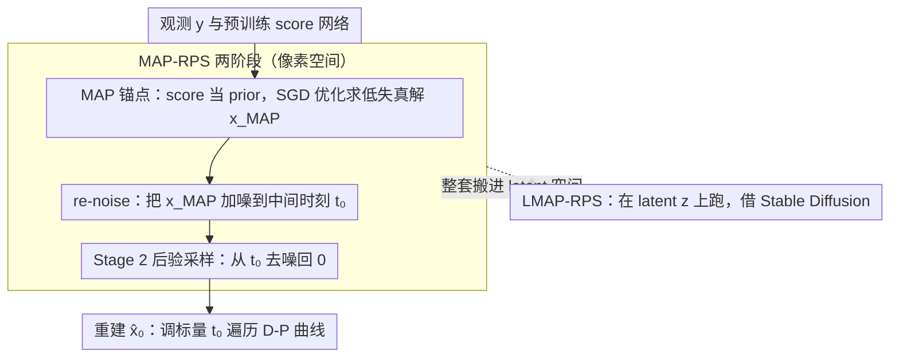

# Stage-wise Distortion-Perception Traversal in Zero-shot Inverse Problems with Diffusion Models

**会议**: ICML 2026  
**arXiv**: [2605.28711](https://arxiv.org/abs/2605.28711)  
**代码**: https://github.com/weigerzan/MAP_RPS (有)  
**领域**: 扩散模型 / 图像恢复 / 逆问题  
**关键词**: distortion-perception tradeoff, zero-shot inverse problem, diffusion posterior sampling, MAP estimation, latent diffusion

## 一句话总结
提出 MAP-RPS 两阶段框架：先用扩散模型的 score 做 MAP 估计逼近 MMSE 解（低失真起点），再把 MAP 结果 re-noise 到时刻 $t_0$ 后做后验采样（沿 D-P 曲线滑向高感知质量），单一预训练扩散模型就能在推理时灵活遍历 distortion-perception trade-off，并扩展到 latent diffusion 后在 MS-COCO 上多任务 SOTA。

## 研究背景与动机

**领域现状**：扩散模型已成为零样本求解 Bayesian 逆问题（超分、去模糊、修复、压缩感知、HDR）的主流框架，代表性方法如 DPS、$\Pi$GDM、ReSample、PSLD 通过近似 $\nabla_{\mathbf{x}_t}\log p_t(\mathbf{y}\mid\mathbf{x}_t)$ 来从后验 $p_{X\mid Y}$ 采样。

**现有痛点**：Blau & Michaeli (2018) 证明的 distortion-perception (D-P) 权衡告诉我们，PSNR/SSIM 等失真指标和 LPIPS/FID 等感知指标天然对立——纯后验采样只能落在 D-P 曲线的"高感知/高失真"一端，而单纯的 MMSE 估计只能落在另一端。实际应用（医学影像偏 fidelity、消费摄影偏感知）需要在两端之间自由滑动，但已有方法要么靠调采样步数、靠平均多次采样、靠手调超参，要么需要额外训练新模型，**缺一个原则化、推理时可控、计算高效的 D-P 遍历机制**。

**核心矛盾**：D-P 曲线两端的两个最优估计器 $X_{\text{MMSE}}=\mathbb{E}[X\mid Y]$ 和 perception-optimal 估计器（如后验采样）来自完全不同的优化目标。理论上 Freirich 等给出了"在两者之间线性插值即可遍历 D-P 曲线"（公式 15），但 zero-shot 扩散场景下 MMSE 端就难算——它需要从后验里反复采样取均值，单样本就要上百次网络前向，做平均开销爆炸。

**本文目标**：分解为两个子问题——(1) 不靠平均采样，如何在 zero-shot 扩散框架里高效拿到一个低失真起点（近似 MMSE）；(2) 给定这个低失真起点，如何**连续可控**地把它"推"向高感知端。

**切入角度**：作者注意到，在图像恢复里"真实图像"通常是接近唯一的——这意味着后验分布 $p_{X\mid Y}$ 在很多场景下近似 **strongly log-concave**（单峰、集中）。在这个温和假设下，MAP 估计与 MMSE 之间的距离可证有界（$\mathcal{O}(\sqrt{n_x/\mu})$），而 MAP 比 MMSE 便宜得多（只是梯度优化，不用反复采样）。第二阶段则借用扩散模型的"加噪—去噪"天然双向流：把 MAP 结果加噪到中间时刻 $t_0$，再让后验采样 SDE 从 $t_0$ 跑回 0，$t_0$ 越大越接近纯后验采样（感知最优），$t_0=0$ 就完全退化为 MAP（失真最优），**单一标量 $t_0$ 在推理时遍历 D-P 曲线**。

**核心 idea**：用 **MAP 替代 MMSE 作低失真锚点 + 用 re-noise 时刻 $t_0$ 作 D-P 滑块**，把"是 MMSE 还是后验采样"这个二选一变成连续可调，无需重训也无需多采样平均。

## 方法详解

### 整体框架
MAP-RPS 要解决的是"如何用一个不动的预训练扩散模型，在推理时自由滑动 distortion-perception trade-off"。它把这件事拆成两阶段串联：先用扩散 score 当 prior、用梯度优化求一个低失真的 MAP 锚点（对应 D-P 曲线失真端），再把这个锚点沿扩散的正向 SDE 加噪到中间时刻 $t_0$、用现成后验采样器从 $t_0$ 去噪跑回 0（向感知端滑动）。输入是观测 $\mathbf{y}=\mathcal{A}(\mathbf{x})+\sigma_{\mathbf{y}}\mathbf{n}$ 和预训练 score 网络 $\mathbf{s}_\theta(\mathbf{x}_t,t)$，输出是重建图像 $\hat{\mathbf{x}}_0$，而用户只需调一个标量 $t_0\in[0,T]$ 就能在两端之间任意取点。整套流程还能整体搬进 VAE 隐空间得到 LMAP-RPS，直接借力 Stable Diffusion 跑 MS-COCO 级别的近真实任务。

### 关键设计

**1. 用 MAP 替代 MMSE 作低失真锚点：可证误差界 + 单次前向的 score 梯度**

D-P 曲线的失真端理论上是 MMSE 解 $X_{\text{MMSE}}=\mathbb{E}[X\mid Y]$，但在 zero-shot 扩散设定里它需要从后验反复采样再取均值，开销爆炸。作者改用便宜得多的 MAP 解，并用"图像恢复的真实图像近似唯一、后验近似 $\mu$-strongly log-concave"这一工程常识兜底误差：Theorem 3.2 证明 $\mathbb{E}\|X_{\text{MAP}}-X_{\text{MMSE}}\|\le\sqrt{n_x/\mu}$、$\mathbb{E}\|X-X_{\text{MAP}}\|^2\le D^*+n_x/\mu$，即 MAP 带来的额外失真有界于 $\mathcal{O}(n_x^{1/2})$，后验越集中（$\mu$ 越大）界越紧。算法上 Stage 1 从随机初始化出发解 $\mathbf{x}_{\text{MAP}}=\arg\max_{\mathbf{x}}\log p_{Y\mid X}(\mathbf{y}\mid\mathbf{x})+\log p_X(\mathbf{x})$，其中 likelihood 项退化为 $\ell_2$ 数据项，prior 梯度则由 Theorem 3.3 给出可计算闭式 $\nabla_{\mathbf{x}}\log p_X(\mathbf{x})=\frac{1-\bar\alpha_{t_1}}{r_{t_1}^2\sqrt{\bar\alpha_{t_1}}}\mathbb{E}_{p_{X_{t_1}\mid X_0}}\nabla_{\mathbf{x}_{t_1}}\log p_{t_1}(\mathbf{x}_{t_1})$，于是单条 SGD 优化路径（每次外层迭代只 1 次 score 前向）就能拿到锚点，比 MMSE 的反复采样取平均便宜一两个数量级。

**2. re-noised posterior sampling：用单参数 $t_0$ 遍历 D-P 曲线**

有了低失真锚点，怎么连续地把它"推"向高感知端、而不是只能停在某一固定 trade-off 点？作者借扩散模型天然的"任意时刻加噪 / 任意时刻去噪"对称结构做线性插值器：Stage 2 把 $\mathbf{x}_{\text{MAP}}$ 沿正向 SDE 加噪到 $\mathbf{x}_{t_0}\sim\mathcal{T}(0,t_0)_\#\delta_{\mathbf{x}_{\text{MAP}}}$，再用后验采样 SDE $\tilde{\mathcal{T}}(t_0,0;\mathbf{y})_\#$ 从 $t_0$ 去噪回 0。这里 $t_0=0$ 完全退化为 MAP（最低失真），$t_0=T$ 退化为标准后验采样（最佳感知），中间任意 $t_0$ 给出曲线上的插值点——失真端被 MAP 锚住、感知端靠 score 重新混入随机性，两端的桥就是这一个标量。理论上 Theorem 3.5 给出 Wasserstein-2 上界 $W_2(p_X,\,p_{0\to t_0\to 0})\le(\bar\alpha_{t_0})^{1-L_s}\sqrt{2n_x/\mu}+\epsilon_{\text{score}}$，Corollary 3.6 进一步指出当 score 网络 Lipschitz 常数 $L_s<1$ 时该上界关于 $t_0$ 单调递减，即"加越多噪 → 感知越好"，把 D-P 理论坐实成了一个 plug-and-play 的推理控件。

**3. LMAP-RPS：整体搬进 latent space 借力大模型**

纯像素扩散模型分辨率有限，要做真正实用的逆问题求解必须吃到 latent 扩散的大模型红利。作者把 MAP 优化与 re-noised posterior sampling 整体放进 latent $\mathbf{z}\in\mathbb{R}^d$，观测约束通过 decoder $\mathcal{D}$ 拉回像素空间近似 $\log p_{Y\mid Z}(\mathbf{y}\mid\mathbf{z})\approx\log p_{Y\mid X}(\mathbf{y}\mid\mathcal{D}(\mathbf{z}))$，相当于把 decoder 输出当成 $p_{X\mid Z}$ 的 point estimate；Appendix C 的 Theorem C.2、C.3 把像素空间那两条理论保证平移到了 latent 版。这样不仅能直接套 Stable Diffusion 跑 MS-COCO，而且 latent 维度低、MAP 优化更快，整体计算复杂度反而比 ReSample、PSLD 这些多步精修 baseline 更低。

### 损失函数 / 训练策略
全程 zero-shot 推理，不更新任何扩散模型参数。Stage 1 的目标是 $-\log p_{Y\mid X}(\mathbf{y}\mid\mathbf{x})-\log p_X(\mathbf{x})$（数据项是 $\ell_2$，prior 项由 Theorem 3.3 的 score 估计实现），用普通 SGD 优化；Stage 2 用 Euler–Maruyama 求解后验采样 SDE，posterior score 直接换成 DPS / $\Pi$GDM 的现成实现即可。需要调的超参只有三个：MAP 迭代步数 $N$、步长 $\gamma$、re-noise 时刻 $t_0$。

## 实验关键数据

### 主实验
MS-COCO 上 6 个 latent-space 近真实逆问题（inpainting / SR 4× / 各向异性 deblur / CS 2× / HDR / nonlinear deblur），与 Latent-DPS、ReSample、PSLD、STSL、LDIR、Latent-DCDP、Latent-DMAP、Latent-DAPS、Latent-SITCOM 比较：

| 任务 | 指标 | LMAP-RPS (0) | LMAP-RPS (600) | 次佳基线 |
|------|------|---------------|------------------|----------|
| Inpainting | PSNR↑ / LPIPS↓ / FID↓ | **28.14** / **0.2769** / **61.35** | 27.22 / 0.3084 / 92.23 | Latent-SITCOM 28.06 / Latent-DMAP 0.3078 / Latent-DCDP 72.05 |
| SR 4× | PSNR↑ / LPIPS↓ / FID↓ | **25.03** / 0.3888 / 107.57 | 24.49 / **0.3505** / **87.20** | LDIR 25.01 / Latent-DMAP 0.3721 / ReSample 91.43 |
| Deblur Aniso | PSNR↑ / LPIPS↓ / FID↓ | **26.42** / 0.3504 / 90.80 | 25.59 / **0.3503** / 85.01 | Latent-SITCOM 26.28 / Latent-DCDP 0.3535 / Latent-DCDP 81.27 |
| CS 2× | PSNR↑ / LPIPS↓ / FID↓ | 22.87 / 0.3498 / **113.06** | **22.90** / **0.3497** / 113.58 | ReSample 21.82 / 0.3806 / 113.36 |
| HDR | PSNR↑ / LPIPS↓ / FID↓ | **25.86** / **0.3595** / **108.79** | 23.06 / 0.3944 / 116.08 | Latent-DCDP 23.31 / ReSample 0.3666 / ReSample 111.89 |
| Nonlinear Deblur | PSNR↑ / LPIPS↓ / FID↓ | **24.27** / **0.3942** / 119.43 | 24.29 / – / – | LDIR 23.13 / Latent-DCDP 0.4225 / Latent-DCDP 140.32 |

### 消融 / D-P 曲线分析
| 配置 | 关键现象 | 说明 |
|------|---------|------|
| $t_0=0$（纯 MAP） | PSNR 最高、LPIPS/FID 较差 | D-P 曲线低失真端，对应理论上 $W_2$ 上界中 $(\bar\alpha_{t_0})^{1-L_s}$ 项最大 |
| $t_0=600$（re-noise 强） | LPIPS/FID 更好、PSNR 下降 | $t_0$ 增大 → $\bar\alpha_{t_0}$ 减小 → 感知项上界单调下降，验证 Corollary 3.6 |
| $t_0$ 连续扫描 | FFHQ 上画出的 D-P 曲线最贴近"理想 D-P 曲线" | 比 Latent-DPS、ReSample、Wang 2025 的方差缩放都更逼近理论最优前沿 |
| 去掉 Stage 1（直接随机加噪后采样） | 退化为标准 posterior sampling | 失去低失真锚点，PSNR 大幅掉点 |
| 去掉 Stage 2（只跑 MAP） | LPIPS/FID 显著变差 | 感知质量退到 MAP 单峰水平 |

### 关键发现
- **两个 $t_0$ 设置就能在不同任务上拿到主表多数 SOTA**：LMAP-RPS(0) 主打失真敏感任务（HDR、nonlinear deblur 全 best），LMAP-RPS(600) 主打感知敏感任务（SR 4× 的 LPIPS/FID 拿最佳），同一份模型同一份算法，**仅通过推理时调一个 $t_0$ 就覆盖两端**。
- **计算反而比基线更便宜**：作者在正文与 Appendix 中强调 LMAP-RPS 总 NFE（neural function evaluations）少于 ReSample、PSLD 等多步精修方法，因为 MAP 阶段单次梯度只要 1 次 score 前向、Stage 2 又是从中间 $t_0$ 起步而非 $T$。
- **理论假设比想象的鲁棒**：Appendix E.1 实验显示即便在非严格 log-concave 的真实图像分布上，MAP 近似 MMSE 的失真增量仍非常小，说明"图像恢复后验近似单峰"在工程层面普适。

## 亮点与洞察
- **"扩散加噪/去噪"被重新解释为 D-P 曲线插值器**：作者把 Freirich (2021) 的"在 MMSE 与 perception-optimal 之间线性插值"理论操作化为"在扩散的时间轴上挑一个 $t_0$ 把锚点向上一推"，物理意义清晰、实现也只是改 1 行起跳时刻。
- **MAP 当 MMSE 用 + 用 strong log-concavity 兜底**：这是把"不可计算的理论最优"换成"可计算的理论次优"的漂亮工程化策略，给出闭式误差界让审稿人和工程师都能买账。
- **可迁移启示**：任何"双目标 trade-off + 一端贵一端便宜"的场景（如 fidelity vs diversity、accuracy vs latency）都可以套这套"便宜端做锚点 + 加噪/扰动到中间时刻 + 再用昂贵采样跑回"的两阶段模板。

## 局限与展望
- **依赖 strong log-concavity 假设**：在多模态严重的逆问题（如 text-to-image 无条件生成、强遮挡修复多解场景）理论保证可能失效，文中只在 Appendix E.1 用经验数据搪塞过去。
- **$t_0$ 仍需人工选择**：虽然单参数已经很简单，但没给出"按下游应用自动选 $t_0$"的策略，类似 perception-prior 强弱、用户偏好的自动 calibration 还缺。
- **Stage 1 的 MAP 优化对初始化敏感**：随机初始化加 SGD 可能陷入 prior 的局部模式，文中未深入讨论初始化策略；可考虑用一次粗 posterior sampling 提供 warm-start。
- **latent 空间 likelihood 近似 $\log p_{Y\mid X}(\mathbf{y}\mid\mathcal{D}(\mathbf{z}))$ 仍是粗糙的 point estimate**：encoder/decoder 的非线性误差未被理论量化，可结合 VAE posterior 的方差信息进一步精化。

## 相关工作与启发
- **vs DPS / $\Pi$GDM**：两者只能停在 D-P 曲线感知端（标准后验采样），MAP-RPS 把它们作为 Stage 2 的子模块复用，再叠加一个 MAP 锚点+$t_0$ 滑块，实现"原方法 + D-P 可控"。
- **vs Wang et al. 2025（variance-scaled posterior sampling）**：Wang 通过缩放注入噪声方差控制 D-P，需要 Gaussian 后验假设和小心调参；MAP-RPS 用单一可解释的时间轴参数 $t_0$，理论上界更清晰、实验在 FFHQ D-P 曲线上更贴近最优前沿。
- **vs Whang 2022 / Delbracio 2023 等"调采样步数遍历 D-P"**：那些方法的 D-P 控制是经验性的，无理论保证；MAP-RPS 给出 $W_2$ 上界关于 $t_0$ 单调递减的 closed-form 结论。
- **vs ReSample / PSLD / Latent-DAPS**：同样面向 latent 扩散逆问题，但都只能给出一个固定 trade-off 点；LMAP-RPS 用同一算法+同一模型扫出整条 D-P 曲线，且 NFE 更少。

## 评分
- 新颖性: ⭐⭐⭐⭐ 把"$t_0$ 当 D-P 滑块"是个简洁有力的视角，但 MAP-replace-MMSE 与 re-noise-then-sample 的两个子技巧此前都各有原型，本文胜在把它们焊成一个有理论闭包的框架。
- 实验充分度: ⭐⭐⭐⭐ FFHQ + MS-COCO，6 个 latent-space 任务，对比 9 个 baseline，并给出 D-P 曲线扫描和 NFE 对比；缺真正高分辨率（>1K）和视频逆问题。
- 写作质量: ⭐⭐⭐⭐ 理论—算法—实验—appendix 闭环干净；定理陈述清楚但 Stage 2 的 SDE pushforward 记号有点重，对实践派读者门槛偏高。
- 价值: ⭐⭐⭐⭐ 对所有用扩散做逆问题的工程师，多了一个"推理时一键滑动 D-P"的能力且不增成本；对理论侧，把 D-P 插值定理具体化到扩散流程，能启发后续 trade-off 可控生成的设计。

<!-- RELATED:START -->

## 相关论文

- [\[ICML 2026\] Saving Foundation Flow-Matching Priors for Inverse Problems](saving_foundation_flow-matching_priors_for_inverse_problems.md)
- [\[ICML 2026\] GUDA: Counterfactual Group-wise Training Data Attribution for Diffusion Models via Unlearning](guda_counterfactual_group-wise_training_data_attribution_for_diffusion_models_vi.md)
- [\[CVPR 2025\] Traversing Distortion-Perception Tradeoff Using a Single Score-Based Generative Model](../../CVPR2025/image_generation/traversing_distortion-perception_tradeoff_using_a_single_score-based_generative_.md)
- [\[NeurIPS 2025\] A Gradient Flow Approach to Solving Inverse Problems with Latent Diffusion Models](../../NeurIPS2025/image_generation/a_gradient_flow_approach_to_solving_inverse_problems_with_latent_diffusion_model.md)
- [\[AAAI 2026\] Constrained Particle Seeking: Solving Diffusion Inverse Problems with Just Forward Passes](../../AAAI2026/image_generation/constrained_particle_seeking_solving_diffusion_inverse_problems_with_just_forwar.md)

<!-- RELATED:END -->
