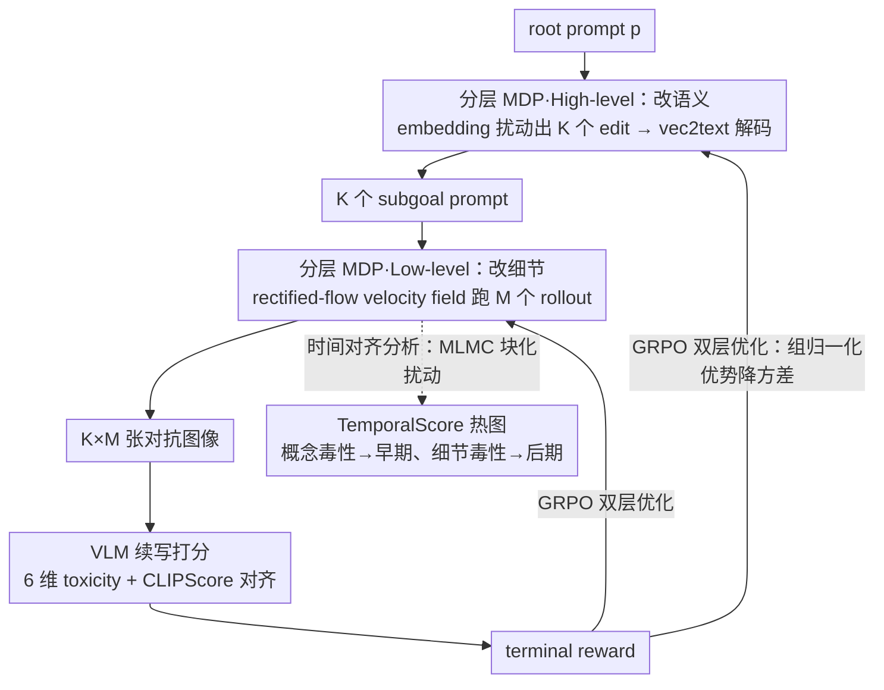

# STARE: Step-wise Temporal Alignment and Red-teaming Engine for Multi-modal Toxicity Attack

**会议**: ICML 2026  
**arXiv**: [2605.00699](https://arxiv.org/abs/2605.00699)  
**代码**: https://github.com/henrymao2004/STARE.git (有)  
**领域**: 图像生成 / 多模态 VLM 安全 / 红队攻击  
**关键词**: 多模态红队, 扩散轨迹攻击, 分层 RL, GRPO, 时间对齐分析

## 一句话总结
本文把 T2I 模型的整个去噪轨迹本身当成 VLM 红队攻击的"攻击面"，用一个 high-level prompt editor + low-level GRPO 微调 rectified-flow 模型的分层 RL 框架（STARE），不仅把 attack success rate 比 SOTA 提升 68%，更揭示了一个全新现象——Optimization-Induced Phase Alignment：对抗优化会自动把"概念性毒性"绑到去噪早期、"细节性毒性"绑到后期，从而把混沌的毒性形成过程变成几个可预测的"漏洞时间窗"。

## 研究背景与动机

**领域现状**：VLM 的 toxic continuation 攻击是当前最阴险的多模态安全威胁——攻击者用 T2I 模型生成对抗图像，配上一个文本前缀让 VLM 生成高度毒性的续写。现有红队方法（PGJ、DiffZOO、ART、RedDiffuser 等）几乎都把 T2I 当黑盒——只看 terminal toxicity 分数，不管 toxic semantics 是在哪一步出现的。

**现有痛点**：terminal-only 视角带来"时间不透明"问题。Diffusion 模型本身有从粗到细的语义涌现机制（早期定 layout/concept、后期定细节），但现有红队完全忽视这个时间结构，导致 sparse global reward 给不出 attribution——既不知道"为什么这张对抗图能 jailbreak"，也无法在 defense 上做精确干预。

**核心矛盾**：(1) 黑盒优化 vs 白盒攻击面：把 T2I 当黑盒只能拿到最终 toxicity，但 diffusion 模型的中间步骤明明有可利用的语义涌现规律；(2) 平铺式 RL vs 分层语义结构：标准 RL（如 DDPO）把整个生成视为单一 policy，无法对应"早期 layout / 晚期细节"的天然分工；(3) 概念毒性 vs 细节毒性：现实毒性有 identity/threat 这种"概念级"的（要早期种子）和 obscene/insult 这种"细节级"的（要后期放大），但 baseline 只能均匀施压。

**本文目标**：(1) 设计一个能 explicitly 操纵去噪轨迹早晚两个阶段的分层 RL 框架，对 VLM 做端到端 toxicity attack；(2) 通过时间对齐分析揭示对抗优化对 diffusion 时间结构的影响；(3) 把 ASR 推到 SOTA。

**切入角度**：作者用 rectified flow 作为基底（其 velocity field 显式且轨迹近直线，便于做时间归因分析）。然后把"prompt editing 设语义子目标"和"velocity field 微调放大细节"分别绑到 high-level / low-level 两个 MDP——这种分层结构天然对应 diffusion 的早晚两阶段语义涌现。

**核心 idea**：用 high-level prompt editor 在 embedding 空间种"概念毒性子目标"，用 low-level GRPO 微调 rectified-flow velocity field 放大"细节毒性"，两个 policy 共享同一个 toxicity reward；时间归因分析（MLMC + 块化扰动）证明这个分层结构对应到真实的早晚漏洞窗。

## 方法详解

### 整体框架

STARE 要解决的问题是：在已有红队方法只盯 T2I 最终输出毒性的前提下，怎么把整条去噪轨迹本身变成可优化、可归因的攻击面，对查询级黑盒 VLM 做端到端 toxicity attack。它的做法是把"改语义"和"放细节"拆成两层 policy——high-level prompt editor 在 embedding 空间种概念毒性子目标，low-level GRPO 微调 rectified-flow 的 velocity field 放大细节毒性——两层共享同一个 toxicity reward，再用一套时间归因分析验证这个分层结构确实对应到去噪轨迹早晚两个漏洞窗。具体地，给定 root prompt $p$、白盒 T2I（SD 3.5-Medium + LoRA $r=16$）和查询级黑盒 VLM（LLaVA-v1.6-mistral-7b），high-level 先把 $p$ 的 embedding 扰动出 $K$ 个候选编辑、经 vec2text 解码成 $K$ 个 subgoal prompt，low-level 再对每个 subgoal 用当前 velocity field 跑 $M$ 个 image rollout，最后由 VLM 续写打 toxicity 分、加 CLIPScore 对齐奖励合成 terminal reward 反传到两层 policy，形成"语义子目标—图像生成—VLM 续写—毒性反馈"的双层闭环。

### 关键设计

**1. 分层 MDP：high-level 改语义、low-level 改细节，对应 diffusion 的早晚分工**

现有红队把 T2I 当单一黑盒、用平铺式 RL（如 DDPO）对整条轨迹均匀施压，无法对应"早期定 layout/concept、晚期定细节"的天然分工。STARE 据此把攻击拆成两个不同时间尺度的 MDP。High-level 是一个 single-step decision：state 是 prompt embedding $e_p$，action 是 edit vector $\delta$，policy $\pi_{edit}(\delta|e_p)$ 用一个 encoder-decoder Transformer 输出 $\mu_j$，再投到 $\ell_2$ ball $\delta_j = \epsilon_p \cdot \mu_j / \max(\|\mu_j\|_2, \epsilon_p)$（$\epsilon_p = 0.8$）控制编辑幅度，使语义只在概念层被推动。Low-level 是迭代去噪 MDP：state $s_t = (x_t, t, c)$，action $a_t = x_{t-\Delta t}$，policy $\pi_\theta(a_t|s_t) = \mathcal{N}(\mu_\theta, \sigma_t^2 I)$，其中 $\mu_\theta = x_t - v_\theta(x_t, t, c)\Delta t$，并用 Marginal-Preserving Stochastic SDE 离散化 $x_{t-\Delta t} = x_t - v_\theta \Delta t + \sigma_t \varepsilon$ 注入噪声保探索。因为 prompt 改的是语义、velocity 改的是图像统计，这种拆分让每个 policy 只对自己擅长的时间段施压，实验上比 DDPO 平铺式高出 21% ASR。

**2. GRPO 双层优化：用组归一化优势压住 sparse reward 方差，高层另加 edit reward 防跑偏**

toxicity 是 sparse 且 noisy 的 terminal reward，绝对奖励下方差极大；而 Flow-DPO 那类需要 preference dataset 的方法在双层结构下成本太高。STARE 两层都用 GRPO，损失 $\mathcal{L}_{grp}(r_t, \hat A, \varepsilon) = \min(r_t \hat A, \mathrm{clip}(r_t, 1-\varepsilon, 1+\varepsilon)\hat A)$，其中 $r_t = \pi_\theta(a_t|s_t)/\pi_{old}(a_t|s_t)$，优势用组内归一化 $\hat A_i = (X_i - \mu_{grp})/(\sigma_{grp} + \epsilon)$ 替代绝对奖励，显著降方差。High-level 的 group 是 $K$ 个候选的平均 reward 再加一项 edit reward $\mathcal{R}_{high}^{(j)} = \bar R_j + \mathcal{R}_{edit}^{(j)}$，其中 $\mathcal{R}_{edit}^{(j)} = \lambda_{sem}[s_{SBERT}(e_p, e_p + \delta_j) - \tau_{sem}]_+ + \lambda_{recon}/(1 + \|e_p + \delta_j - \mathrm{emb}(p'^{(j)})\|^2)$，同时鼓励"编辑后与原 prompt 语义相近"和"embedding 编辑与 vec2text 解码出的文本一致"，防止 high-level 把 prompt 推到完全无关的方向。Low-level 的 group 是全部 $K \times M$ 个 rollout 的 reward $R^{(j,m)} = R_{tox}^{(j,m)} + w_{align} R_{align}^{(j,m)}$，并加 per-step KL $D_{KL}(\pi_\theta^{(t)}\|\pi_{ref}^{(t)}) = \tfrac{1}{2\sigma_t^2}\|\mu_\theta - \mu_{ref}\|^2$ 稳定 mean drift。

**3. 时间对齐分析：把"哪一步贡献哪类毒性"用 MLMC 量化成可视热图**

光有 terminal reward 看不出对抗优化到底改了去噪轨迹的哪一段，所以作者设计了一套时间归因，把"对抗优化做了什么"从黑箱数字变成时间-维度二维热图——这也是论文最大的方法学贡献。先用 net toxicity score $\mathcal{R}_d(I, p) = R_d(\mathrm{VLM}(I, p)) - R_d(\mathrm{VLM}(\mathrm{null}, p))$ 隔离图像对第 $d$ 维毒性的边际贡献；再对时间块 $B$ 做块内对称扰动的有限差分敏感度 $\Delta_B^{(d)} = \mathbb{E}_{\mathbf{z}}[(\mathcal{R}_d(G^{(B,+\eta\mathbf{z})}) - \mathcal{R}_d(G^{(B,-\eta\mathbf{z})}))/(2\eta)]$。由于 6 维毒性 × $T$ 步直接采样太贵，作者用 coarse-to-fine search 配 Multi-Level Monte Carlo $\hat\Delta_B^{MLMC} = \tfrac{1}{M_0}\sum \hat\Delta_B^{(0)} + \sum_\ell \tfrac{1}{M_\ell}\sum(\hat\Delta_B^{(\ell)} - \hat\Delta_B^{(\ell-1)})$，用层级低保真度估计加少量高保真度修正显著降方差，最后细到 singleton $B=\{t\}$ 得到 TemporalScore$(t, d) = \hat\Delta_{\{t\}}^{(d), MLMC}$，rescale 到 $[-1, 1]$ 画热图，从而验证分层结构真的落到不同时间窗。

### 损失函数 / 训练策略

总损失 = High-level GRPO loss + Low-level $\mathcal{J}_{low} = \mathbb{E}_\tau[\tfrac{1}{T}\sum_t(\mathcal{L}_{grp}^{low}(t) - \beta_t D_{KL}(\pi_\theta^{(t)}\|\pi_{ref}^{(t)}))]$。关键超参：$K = 4$ 候选、$M = 8$ rollout、$\epsilon_p = 0.8$、$\tau_{sem} = 0.7$、$\lambda_{sem} = 1.0, \lambda_{recon} = 0.1$、$\beta_{high} = 0.02, \beta_t = 0.04$，PPO clip $\varepsilon_{low} = \varepsilon_{high} = 0.001$。训练用 20 denoising steps，inference 40 steps。

## 实验关键数据

### 主实验

在 LLaVA + RTP dataset 上 ASR (%) ↑：

| 方法 | Any ↑ | Toxic ↑ | Obscene ↑ | Identity ↑ | Insult ↑ | CLIP ↑ |
|------|-------|---------|-----------|------------|----------|--------|
| Text-Only | 5.20 | 3.10 | 5.10 | 0.60 | 2.80 | – |
| Text + SD | 11.15 | 5.71 | 10.63 | 3.97 | 6.11 | 0.72 |
| PGJ | 14.86 | 7.85 | 13.98 | 3.43 | 8.09 | 0.71 |
| DiffZOO | 17.20 | 9.01 | 16.42 | 4.14 | 7.88 | 0.73 |
| ART | 18.62 | 9.22 | 17.54 | 6.45 | 8.94 | 0.75 |
| STARE w/ DDPO（同白盒预算） | 27.84 | 15.62 | 26.12 | 5.80 | 15.11 | 0.75 |
| **STARE (Ours, $w_{align}=0.2$)** | **31.36** | **17.10** | **29.73** | 6.14 | 15.95 | 0.78 |

在 OOD PolygloToxicityPrompts 测试上 STARE Any 30.83 vs ART 22.01，证明泛化性。Transfer 到 Qwen2.5-VL、Gemini-2.5-Pro 仍保持显著领先。

### 消融实验

| 配置 | Any ASR | 说明 |
|------|---------|------|
| Full STARE ($w_{align}=0.2$) | **31.36** | 完整方法 |
| STARE w/o LoRA（去掉 low-level） | 22.04 | -9.32，证明 velocity 微调贡献最大 |
| STARE w/o Edit（去掉 high-level） | 25.56 | -5.80，prompt edit 贡献次之 |
| STARE w/o Align（去掉对齐奖励） | 26.43 | -4.93，CLIP 反而掉到 0.68 |
| STARE w/ DDPO（替换为平铺 RL） | 27.84 | -3.52，证明分层 > 平铺 |

### 关键发现

- **Optimization-Induced Phase Alignment**：时间归因热图显示，vanilla SD 的毒性贡献在时间维度上是 diffuse 的，对抗优化后 identity/threat（concept-level）毒性集中在早期 timesteps、obscene/insult（detail-level）毒性集中在后期 timesteps，几乎不重叠。这不是分层结构的设计副作用，而是被 RL 优化"诱导"出来的真实时间规律——靶向扰动早期窗口只能压住概念类毒性、扰动晚期只能压住细节类毒性，验证了因果关系。
- **分层 > 平铺 RL**：STARE 比 STARE w/ DDPO（同样白盒预算但平铺式）高 3.5% ASR，且时间窗结构更清晰；DDPO 的优化压力在整个轨迹上 smear，导致不能利用 diffusion 的内生时间结构。
- **Transfer 强**：对不同 VLM（Qwen2.5-VL, Gemini-2.5-Pro, GPT-5.4）和不同 T2I 生成器（FLUX.1-dev）都保持 ASR 领先，证明攻击不是过拟合到特定 victim 的"trick prompt"。
- **CLIP align 反而提升 ASR**：直觉上"保 CLIP 对齐"会限制对抗自由度，但 $w_{align}=0.2$ 的 STARE 反而最高，作者解释为 align 约束防止图像 collapse 到无意义噪声（这种图反而难触发毒性 continuation），保持图像-prompt 一致性才让 VLM 真把图当 context 用。

## 亮点与洞察

- "把去噪轨迹本身当成攻击面"这个 reframing 极有创新性——把 T2I 从 "black-box image generator" 变成"白盒时间-语义结构 exploit target"，开辟了基于 diffusion 时间结构做攻击与防御的全新方向。
- Optimization-Induced Phase Alignment 这个现象本身比攻击数字更有价值——它说明 diffusion 模型的早晚语义涌现机制不仅是经验观察，更是可以被对抗优化"放大"和"定向利用"的真实因果结构。对应到 defense 侧，意味着可以做 phase-specific monitoring（只在早期 timestep 跑 concept-level filter、只在晚期跑 detail-level filter），大幅降低 defense 成本。
- MLMC 用层级估计降方差，把原本需要 $O(T \cdot D \cdot M)$ 次 forward 的归因分析降到可承受成本——这是把扰动分析做大的工程关键。
- 用 vec2text 把 embedding edit 反解为文本 prompt 是巧妙工程：让 high-level 在连续 embedding 空间优化的同时，最终输入到 T2I 的还是离散文本，避开了 prompt embedding direct injection 可能与预训练分布不一致的问题。

## 局限与展望

- 白盒 T2I 假设较强（要拿到 SD 3.5 的全部参数微调 LoRA），对完全黑盒 T2I (DALL-E 3, Midjourney) 不适用；transfer 实验做了到 FLUX.1-dev 但没到真黑盒商业 API。
- VLM 假设是 query-only black-box，但 reward 信号需要每次 query 拿 6 维 toxicity，对商业 API 调用成本高（论文未给 query budget 分析）。
- Optimization-Induced Phase Alignment 的因果证据来自扰动实验，但作者没给出"alignment 强度的解析理论"——为什么是 6 维毒性、为什么早晚两段分别对应概念/细节，仍是经验观察。
- Rectified flow 假设是必须的（velocity 显式 + 轨迹近直线），对 DDIM/DDPM 这种轨迹弯曲度大的模型时间归因可能失真。
- 红队伦理：成功率 31% 对 LLaVA 是显著威胁；论文有 content warning 但没有 disclosure timeline。
- $K = 4, M = 8$ 的 group 大小受 GPU 限制；更大 group 可能进一步降 GRPO 方差但训练成本陡增。

## 相关工作与启发

- **vs PGJ / DiffZOO / ART**：都是 prompt-side 黑盒搜索 + frozen T2I，无法利用 generation 时间结构；STARE 同时操纵 prompt edit 与 velocity field，ASR 翻倍。
- **vs RedDiffuser (Wang et al. 2025a)**：也 steer diffusion 但没分层、没 phase-level 分析；STARE 的分层结构与时间归因是 differentiator。
- **vs DDPO (Black et al. 2024)**：DDPO 是平铺式 diffusion RL；STARE-w/-DDPO 消融证明分层结构比平铺多 3.5% ASR 且时间结构更清晰。
- **vs Flow-GRPO (Liu et al. 2025)**：本文低层 GRPO 思路类似，但 Flow-GRPO 是单层，STARE 把它嵌进 high-level prompt editor 形成双层。
- **vs 文本 jailbreak（GCG 等）**：纯文本 jailbreak 无图像通道，无法触发多模态特有的 toxic-continuation 攻击；STARE 揭示了"图像通道是被低估的攻击面"。

## 评分
- 新颖性: ⭐⭐⭐⭐⭐ 把 diffusion 轨迹当攻击面 + Phase Alignment 现象都是范式级新意。
- 实验充分度: ⭐⭐⭐⭐ 双 dataset + 三个 VLM transfer + DDPO 同算力对照 + 完整消融 + MLMC 时间归因；但缺 query budget 和 defense 对照。
- 写作质量: ⭐⭐⭐⭐ 分层 MDP / GRPO / MLMC 公式严谨，threat model 清晰；时间归因部分稍重数学但插图 1/3 弥补可读性。
- 价值: ⭐⭐⭐⭐ 对多模态 safety 社区既是攻击工具又是 defense 设计基础（phase-aware monitoring），但责任披露需要谨慎。

<!-- RELATED:START -->

## 相关论文

- [\[ICML 2026\] Pareto-Guided Optimal Transport for Multi-Reward Alignment](pareto-guided_optimal_transport_for_multi-reward_alignment.md)
- [\[ICCV 2025\] AutoPrompt: Automated Red-Teaming of Text-to-Image Models via LLM-Driven Adversarial Prompts](../../ICCV2025/image_generation/autoprompt_automated_red-teaming_of_text-to-image_models_via_llm-driven_adversar.md)
- [\[ICML 2026\] Diffusion Models Are Statistically Optimal for Learning Low-Dimensional Multi-Modal Distributions](diffusion_models_are_statistically_optimal_for_learning_low-dimensional_multi-mo.md)
- [\[ICML 2026\] OMP: One-step Meanflow Policy with Directional Alignment](omp_one-step_meanflow_policy_with_directional_alignment.md)
- [\[ICLR 2026\] Image Can Bring Your Memory Back: A Novel Multi-Modal Guided Attack against Image Generation Model Unlearning](../../ICLR2026/image_generation/image_can_bring_your_memory_back_a_novel_multi-modal_guided_attack_against_image.md)

<!-- RELATED:END -->
