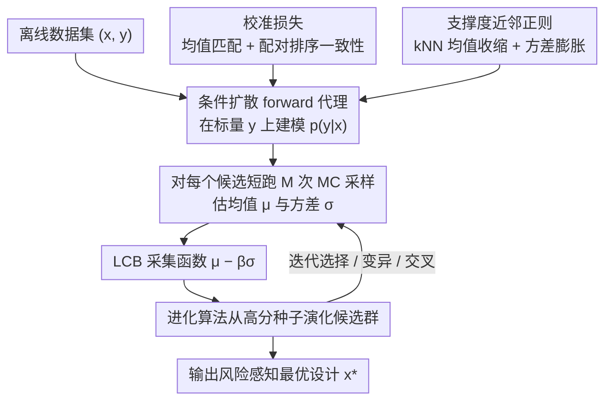

# Support-Proximity Augmented Diffusion Estimation for Offline Black-Box Optimization

**会议**: ICML 2026  
**arXiv**: [2605.11246](https://arxiv.org/abs/2605.11246)  
**代码**: https://github.com/HarryYoung2018/spade (有)  
**领域**: 扩散模型 / 离线黑盒优化  
**关键词**: 离线 BBO、条件扩散代理、kNN 支撑度正则、LCB 采集函数

## 一句话总结
SPADE 用一个条件扩散模型替代传统回归代理来建模 $p(y\mid\boldsymbol{x})$，并通过"均值/排序校准"+"kNN 支撑度正则（均值收缩 + 方差膨胀）"把数据先验隐式注入到代理里，使离线黑盒优化在 Design-Bench 和 LLM 数据混合任务上稳定达到 SOTA。

## 研究背景与动机

**领域现状**：离线黑盒优化（offline BBO）只能用一个静态数据集 $\mathcal{D}=\{(\boldsymbol{x}_i,y_i)\}$ 去找最优设计，不能再查询真实 oracle。主流做法分两派：inverse 方法直接学 $p(\boldsymbol{x}\mid y)$ 来按高分条件采样设计；forward 方法学一个回归代理 $f_\theta(\boldsymbol{x})$，然后梯度上升或采集函数搜索。

**现有痛点**：inverse 方法本质上是 ill-posed 的一对多映射，训练难、容易 mode collapse；forward 方法里的确定性 MLP 给不出 epistemic 不确定性，搜索过程会"打洞"——优化器一旦找到代理高估的区域就疯狂往那儿钻，结果在真实环境里完全不靠谱。

**核心矛盾**：好的 forward 代理需要同时具备三件事——分布表达力（能给均值 + 方差）、全局精度（均值要准、排序要对）、以及对 OOD 区域的天然保守性（远离数据流形要自动调低估值）。现有方法每一项都只满足一个。

**本文目标**：1) 让扩散模型也能当 forward 代理用，捕获 $p(y\mid\boldsymbol{x})$ 的全分布；2) 让训练目标额外校准全局均值与配对排序；3) 在不另训生成模型 $p(\boldsymbol{x})$ 的情况下，把先验信息塞进代理。

**切入角度**：把 Bayes 公式 $p(\boldsymbol{x}\mid y)\propto p(y\mid\boldsymbol{x})\,p(\boldsymbol{x})$ 拆开看——forward 部分用条件扩散建模，prior 部分用 kNN 距离作非参密度估计，并在理论上证明这种几何正则化"一阶等价于"在采集函数里加上 $\log p(\boldsymbol{x})$。

**核心 idea**：用条件扩散当 forward 代理 + 校准损失锚定全局统计 + kNN 距离驱动的均值收缩/方差膨胀来注入支撑度先验，最后用 LCB + 进化算法做风险感知搜索。

## 方法详解

### 整体框架
SPADE 想解决的是离线黑盒优化里 forward 代理"既要给不确定性、又要排序准、还要在 OOD 区自动保守"这三件难以兼得的事。它的做法是把代理从确定性 MLP 换成一个以设计 $\boldsymbol{x}$ 为条件的扩散模型来建模整个 $p(y\mid\boldsymbol{x})$，再用两个额外损失分别校准全局统计量、注入数据先验。训练完成后进入优化阶段：用进化算法从数据集中的高分种子演化候选群体，每个候选靠多次 MC 采样估出均值与方差，按 LCB 采集函数挑出风险感知意义上最优的设计。

### 关键设计

**1. 条件扩散 forward 代理：用一维标量上的扩散给出预测分布**

传统 forward 代理是确定性 MLP，只能输出一个点估计，拿不到方差 $\sigma$，于是 LCB / EI 这类需要不确定性的风险感知采集函数根本无从谈起。SPADE 把代理换成 DDPM：按方差调度 $\{\beta_t\}$ 在标签 $y_0$ 上加噪得到 $q(y_t\mid y_0)=\mathcal{N}(\sqrt{\bar\alpha_t}y_0,(1-\bar\alpha_t)\mathbf{I})$，再训一个以 $\boldsymbol{x}$ 为条件的噪声预测网络 $\epsilon_\theta(y_t,t,\boldsymbol{x})$，基础损失就是标准去噪目标 $\mathcal{L}_{\text{diff}}=\mathbb{E}\|\epsilon-\epsilon_\theta(y_t,t,\boldsymbol{x})\|_2^2$。推理时对同一个 $\boldsymbol{x}$ 短跑 $M$ 次采样得到 $\{y^{(m)}\}$，从这组样本里同时估出预测均值和方差。妙处在于这里扩散建的是一维标量 $y$ 而非高维设计，模型很轻量却天然能表达多模态与异方差，比 ensemble 或 BNN 更易扩展。

**2. 校准损失：把全局均值和配对排序显式锚进训练目标**

单跑去噪损失只保证局部分布拟合得好，却不保证代理的全局均值准、更不保证"谁比谁好"的排序对——而 BBO 真正消费的恰恰是排序。校准损失补上这两件事：先从 mini-batch 里用 $M$ 次短跑 MC 估出 $\hat\mu_\theta(\boldsymbol{x})\approx\frac{1}{M}\sum_m y^{(m)}$，然后叠加两项，一项是一阶矩匹配 $(\hat\mu_\theta(\boldsymbol{x})-y)^2$ 把均值钉到真值，另一项是 pairwise 排序一致性 $\log(1+\exp\{-s[\hat\mu_\theta(\boldsymbol{x}_i)-\hat\mu_\theta(\boldsymbol{x}_j)]\})$（只在 $y_i>y_j$ 的有序对上计算，温度 $s=1$）。后者相当于把 BBO 的 utility 信号——"哪个设计更好"——直接反向传播进扩散网络，让 EA 后续选候选时不会被错排的均值带偏。

**3. 支撑度近邻正则：用 kNN 几何代替生成式先验，让 OOD 区自动保守**

forward 代理最危险的失效模式是 reward hacking：优化器一旦找到代理高估的 OOD 区域就疯狂往那钻，真实环境里却完全不靠谱。常规解法是另训一个 $p(\boldsymbol{x})$ 生成器做先验，但既贵又难调。SPADE 改用非参的 kNN 距离当密度代理：取第 $k$ 近邻距离 $R_k(\boldsymbol{x})$，定义 $d(\boldsymbol{x})=\log R_k(\boldsymbol{x})$，从而 $-\log\hat p_{\text{knn}}(\boldsymbol{x})\propto d(\boldsymbol{x})$，离数据流形越远 $d$ 越大。正则由两项 hinge 组成：mean-shrink 项 $\max(0,\hat\mu_\theta-\mu_{\text{NN}}-\tau(d))$ 把均值往邻居均值方向压、且离得越远压得越狠；variance-floor 项 $\max(0,\sigma_{\min}(d)-\hat\sigma_\theta)$ 给方差顶一个随距离单调上升的下限。其中 $\tau(d)=ad$、$\sigma_{\min}(d)=a_0+a_1 d$，默认 $a=0.02,a_0=0.02,a_1=0.005$ 全任务通用。hinge 写法保证只在违反"该保守"约束时才施加梯度，不干扰流形内部的拟合。论文进一步证明：在 LCB 这种"$\mu$ 单增、$\sigma$ 单减"的采集函数下，正则后的采集函数满足 $\widetilde{\mathcal{A}}(\boldsymbol{x})=\mathcal{A}(\mu,\sigma)+\kappa(\boldsymbol{x})\log\hat p_{\text{knn}}(\boldsymbol{x})+o(\cdot)$，一阶等价于在 utility 上加了一个 $\log p(\boldsymbol{x})$ 先验——这就把纯几何约束和贝叶斯后验 $p(\boldsymbol{x}\mid y)\propto p(y\mid\boldsymbol{x})p(\boldsymbol{x})$ 画上了等号。

### 损失函数 / 训练策略
总损失 $\mathcal{L}(\theta)=\mathcal{L}_{\text{diff}}+\lambda_1\mathcal{L}_{\text{calib}}+\lambda_2\mathcal{L}_{\text{prox}}$ 把去噪、校准、支撑度三项一起优化。推理用 LCB $\hat\mu_\theta(\boldsymbol{x})-\beta\hat\sigma_\theta(\boldsymbol{x})$ 作采集函数，由进化算法（EA）从 $\mathcal{D}$ 中高分种子初始化种群，每代评估每个候选的 LCB 后做选择 / 变异 / 交叉，最终输出 $\arg\max_{\boldsymbol{x}\in\mathcal{P}}\text{LCB}(\boldsymbol{x})$。

## 实验关键数据

### 主实验
在 Design-Bench（SuperConductor、Ant、D'Kitty、TF8、TF10）+ LLM Data Mixture（LLM-DM）共 6 个任务上，报告 $K=128$ 候选中的 100th-percentile 归一化分数（mean ± SE，8 seed）。

| 任务 | $\mathcal{D}(\text{best})$ | 之前 SOTA 范围 | SPADE | 备注 |
|------|---------------------------|---------------|-------|------|
| SuperConductor | 0.399 | 各 baseline 0.40~0.55 区间 | 最佳之一 | 校准让代理排序更准 |
| Ant Morphology | 0.565 | 0.60~0.90 区间 | 最佳之一 | 高维连续控制 |
| D'Kitty | 0.884 | ~0.90 区间 | 最佳之一 | OOD 风险大 |
| LLM-DM | 1.000 | 接近上限 | 与 baseline 持平/更稳 | LLM 数据混合优化 |
| TF8 / TF10 | 0.439 / 0.511 | 离散设计任务 | 最佳之一 | 离散空间也能用 |

SPADE 在 mean rank 和 median rank 两项综合指标上都排名第一，是唯一在 6 个任务上整体稳定 top 的方法。

### 消融实验

| 配置 | 关键现象 | 说明 |
|------|---------|------|
| Full SPADE | 全部 6 个任务 SOTA 或并列 | 三模块缺一不可 |
| w/o $\mathcal{L}_{\text{calib}}$ | 排序错乱，EA 选错候选 | 缺乏全局校准 |
| w/o $\mathcal{L}_{\text{prox}}$ | 经典 OOD reward hacking，EA 把估值打飞 | 没有先验约束 |
| w/o 扩散（普通 MLP 回归） | 没有 $\sigma$，LCB 退化为均值贪心 | 失去风险感知能力 |
| 改 kNN 为 KDE | 高维下崩，结果显著变差 | kNN 自适应带宽更稳 |
| 改 LCB 为均值贪心 | OOD 风险被放大 | 验证 LCB 是正则的最佳搭档 |

### 关键发现
- $\mathcal{L}_{\text{prox}}$ 是稳定性最大贡献者：去掉它后多数任务出现 reward hacking，分数比完整模型低 10~30%；它本质上是用几何代替生成式先验。
- $\mathcal{L}_{\text{calib}}$ 的 rank 项比 moment 项更关键，因为 BBO 真正消费的是相对排序而非绝对值。
- 扩散步数 $T$ 对结果不敏感（短跑就够），但 MC 采样数 $M$ 影响方差估计精度，太小会让 LCB 噪声大。
- $a, a_0, a_1$ 这套超参跨任务通用，不需要每个任务单独调，体现 kNN 几何先验的鲁棒性。

## 亮点与洞察
- "用扩散当 forward 代理"是个反直觉但合理的设计：扩散通常出现在 inverse 的 $p(\boldsymbol{x}\mid y)$ 中，本文反过来把它放到 $p(y\mid\boldsymbol{x})$ 上，巧妙之处在于 $y$ 是一维标量，扩散变得很轻量但仍能给出 $\sigma$。
- 把"几何约束"和"贝叶斯先验"用一阶等价定理画上等号，这种证明思路很值得迁移——它告诉我们：如果一个 hinge 正则项 $\tau(d)$ 随 $-\log p(\boldsymbol{x})$ 线性增长，就相当于在采集函数里加 log-prior。其他任务（如 imitation learning、offline RL）都可以套用。
- mean-shrink + variance-floor 是一对天然搭档：前者降 $\mu$、后者升 $\sigma$，两者协同让 LCB 在 OOD 区"双重打折"，比单一项更稳。

## 局限与展望
- 作者承认 Proposition 3.1 只是"动机"而非全算法保证，实际行为还受 EA、$\beta$、MC 噪声影响。
- kNN 在百维以上设计空间里仍可能退化（距离同质化），蛋白质等极高维场景需要先做表示学习或用 manifold-aware 距离。
- $\mathcal{L}_{\text{calib}}$ 需要每步 $M$ 次短跑 MC，训练时间比纯回归代理高几倍，是工程上的主要开销。
- 没有讨论 LCB 系数 $\beta$ 在不同任务间的最优范围，实际应用还得调 $\beta$。

## 相关工作与启发
- **vs DDOM / inverse 扩散方法**：他们建模 $p(\boldsymbol{x}\mid y)$ 受 ill-posed 一对多困扰；SPADE 走 forward $p(y\mid\boldsymbol{x})$ 路线 + 显式先验注入，回避了 inverse 的训练难题。
- **vs COMs / ROMA 等保守回归 baseline**：他们在 MLP 上加对抗或惩罚项做保守化，但点估计本质让 LCB 用不了；SPADE 用扩散自带分布 + kNN 几何，先验注入更显式且有 Bayes 解释。
- **vs GP / BNN 等概率代理**：GP 在高维不 scale；BNN 训练贵且未必 calibrated；扩散 + 短跑 MC 在表达力与可扩展性间取得了不错的平衡。

## 评分
- 新颖性: ⭐⭐⭐⭐ 把扩散从 inverse 搬到 forward 的视角清新，并配套了 Bayes 等价定理。
- 实验充分度: ⭐⭐⭐⭐ 覆盖 Design-Bench 全套 + LLM-DM，消融完整且超参跨任务通用。
- 写作质量: ⭐⭐⭐⭐ 公式推导清晰，pipeline 图把训练/优化两阶段画得很顺。
- 价值: ⭐⭐⭐⭐ 给离线 BBO 提供了一个稳定 SOTA 的新代理范式，kNN-as-prior 的思想可迁移到其他保守离线场景。

<!-- RELATED:START -->

## 相关论文

- [\[ICML 2026\] Offline Preference Optimization for Rectified Flow with Noise-Tracked Pairs](offline_preference_optimization_for_rectified_flow_with_noise-tracked_pairs.md)
- [\[ICML 2025\] PPO-MI: Efficient Black-Box Model Inversion via Proximal Policy Optimization](../../ICML2025/image_generation/ppo-mi_efficient_black-box_model_inversion_via_proximal_policy_optimization.md)
- [\[CVPR 2026\] CSF: Black-box Fingerprinting via Compositional Semantics for Text-to-Image Models](../../CVPR2026/image_generation/csf_black-box_fingerprinting_via_compositional_semantics_for_text-to-image_model.md)
- [\[ICLR 2026\] Pareto-Conditioned Diffusion Models for Offline Multi-Objective Optimization](../../ICLR2026/image_generation/pareto-conditioned_diffusion_models_for_offline_multi-objective_optimization.md)
- [\[ICML 2026\] Offline Multi-agent Reinforcement Learning via Sequential Score Decomposition](offline_multi-agent_reinforcement_learning_via_sequential_score_decomposition.md)

<!-- RELATED:END -->
