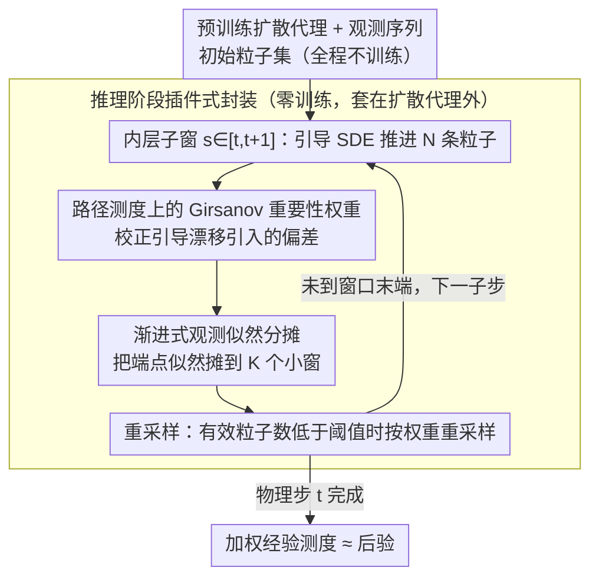

# SURGE: Approximation and Training Free Particle Filter for Diffusion Surrogate

**会议**: ICML 2026  
**arXiv**: [2605.18745](https://arxiv.org/abs/2605.18745)  
**代码**: 无  
**领域**: 科学计算 / 数据同化 / 扩散模型推理  
**关键词**: 数据同化, 粒子滤波, 扩散代理模型, Girsanov 测度变换, Sequential Monte Carlo  

## 一句话总结
SURGE 把扩散代理模型的引导采样视为路径测度上的有偏分布，用 Girsanov 公式计算重要性权重做 SMC 重采样，从而在不重新训练、不近似 Doob $h$-变换的前提下，得到无近似偏差的扩散代理数据同化滤波器，在 Lorenz、Navier-Stokes 和 SEVIR 天气预报上一致超越 BPF/EnKF/SDA/FlowDAS。

## 研究背景与动机

**领域现状**：数据同化（DA）把"模型预报"和"稀疏含噪观测"融合成系统状态后验，是天气、海洋、地震等领域的核心任务。近年用扩散模型当"数字孪生"做条件转移密度 $p(x_{t+1}\mid x_t)$ 的代理（FlowDAS、SDA 等）很流行，因为扩散能表达高维复杂分布、生成真实的随机演化。

**现有痛点**：当新观测 $y_{t+1}$ 到来时，主流做法是把观测似然作为引导项 $\lambda(s)\nabla_x \log p(y_{t+1}\mid x_s)$ 加进反向 SDE 漂移里，把样本"推"向观测一致的状态。但这种引导只有在 $G=\log h$ 恰好等于 Doob $h$-变换时才能得到精确后验，而精确 $h$-变换要解一个高维反向 Kolmogorov 方程，几乎不可行。实际用的引导都是近似的、启发式的，会引入系统性偏差。

**核心矛盾**：扩散代理的灵活性带来了不可解的后验得分 $\nabla_{x_t}\log p_t(x_t\mid y_{1:t})$（因为要对扩散前向核做边缘化）；既要保留扩散建模能力，又要在推理阶段做出无近似偏差的后验采样，看似两难。直接照搬经典粒子滤波又会撞上"维度诅咒"——高维下权重退化严重。

**本文目标**：(1) 在不修改预训练扩散代理的前提下，把引导生成产生的偏差矫正回真后验；(2) 保持高维长时序下数值稳定，缓解粒子退化；(3) 推理阶段即插即用，套到 FlowDAS、SDA 等现有 backbone 上。

**切入角度**：作者注意到，扩散采样本身就在一段内部时间 $s\in[t,t+1]$ 上生成一条**轨迹**而非单点。如果把"引导扩散"和"无引导扩散+观测倾斜"都看作路径测度 $\mathbb{P}^G, \mathbb{P}(\cdot\mid y_{1:t+1})$，那么二者的 Radon–Nikodym 导数可以用 Girsanov 定理写成闭式——这正是构造无偏重要性权重所需要的桥梁。

**核心 idea**：把 SMC 重采样从"终点粒子"提升到"整条扩散路径"，权重直接来自 Girsanov 测度变换 + 观测似然倾斜，再配合"分段渐进似然"控制权重方差，得到 approximation-free particle filter。

## 方法详解

### 整体框架
SURGE 是一个套在预训练扩散代理外面的推理阶段滤波循环，要解决的是"引导采样得到的状态分布有系统性偏差、又没法精确实现 Doob $h$-变换"这个矛盾。它的关键转法是把每个同化步内部的扩散采样看成一条路径而非一个终点：外层沿物理时间 $t=0\to T-1$ 逐步同化，内层把每个同化步的扩散采样时间 $s\in[t,t+1]$ 切成 $K$ 个小窗 $[s_k,s_{k+1}]$，在小窗里同时推进 $N$ 条粒子轨迹，并用路径测度之间的 Girsanov 权重把"引导扩散生成的有偏路径"重新加权回真后验路径。

具体到一个内层小窗，每条粒子先经历**传播**：用引导 SDE（公式 4）向前走一步 $\Delta s$，漂移项是扩散网络 $v_\theta$ 加上似然引导 $\Sigma(s)\nabla_x G(x_s, s\mid y_{t+1})$，扩散项为 $\Sigma^{1/2}(s)\mathrm{d}W_s$；再经历**加权**：按 Girsanov 公式叠加渐进似然算出这一小段的重要性权重增量 $\beta_t^{(i)}$，累乘进 $w_{t+s_k}^{(i)}$；最后经历**重采样**：归一化权重后检查有效粒子数 $\widehat{N}_{\text{eff}} = 1/\sum_i (\tilde w^{(i)})^2$，一旦低于阈值 $c$ 就按权重做 Categorical 重采样并把权重重置为 $1/N$。每个物理步结束时，用加权经验测度 $\sum_i \tilde w_{t+1}^{(i)} \delta_{x_{t+1}^{G,(i)}}$ 作为后验 $p(x_{t+1}\mid y_{1:t+1})$ 的 approximation-free 近似。整个流程输入预训练扩散代理 $v_\theta$、初始粒子集、观测序列 $\{y_t\}$、引导势 $G$、方差调度 $\Sigma(s)$、子步数 $K$ 和重采样阈值 $c$，输出后验粒子轨迹 $\{x_t^{(i)}\}$，全程不训练任何新参数。

### 关键设计

**1. 路径测度上的 Girsanov 重要性权重：把近似引导自动校正成无偏后验**

传统粒子滤波只在终点 $x_{t+1}$ 用观测似然 $p(y_{t+1}\mid x_{t+1})$ 加权，没法纠正采样过程内部由近似引导积累出来的路径偏差，而要让引导精确无偏又得求等于 Doob $h$-变换的引导势——这是个不可解的高维反向 Kolmogorov 方程。SURGE 的破法是把整段引导扩散看成路径测度 $\mathbb{P}^G$，真后验看成路径测度 $\mathbb{P}(\cdot\mid y_{1:t+1})$，用 Radon–Nikodym 链式法则 $\frac{\mathrm{d}\mathbb{P}(\cdot\mid y_{1:t+1})}{\mathrm{d}\mathbb{P}^G(\cdot\mid y_{1:t+1})} = \frac{\mathrm{d}\mathbb{P}(\cdot\mid y_{1:t+1})}{\mathrm{d}\mathbb{P}(\cdot\mid y_{1:t})} \cdot \frac{\mathrm{d}\mathbb{P}(\cdot\mid y_{1:t})}{\mathrm{d}\mathbb{P}^G(\cdot\mid y_{1:t})}$ 把权重拆成两块：第一块 $\propto p(y_{t+1}\mid x_{t+1})$ 就是经典观测倾斜，第二块用 Girsanov 定理写成闭式 $\exp\bigl(-\int_0^1 \Sigma^{1/2}(s)\nabla_x G \cdot \mathrm{d}W_s - \tfrac12\int_0^1 \|\Sigma^{1/2}(s)\nabla_x G\|^2 \mathrm{d}s\bigr)$，专门抵消引导漂移引入的偏差。提升到路径空间之后，引导势 $G$ 不再被要求等于 Doob $h$-变换，任何启发式引导都会被这条权重自动校正回真后验，于是"想精确实现 $h$-变换"这个不可解问题被换成了"用 SMC 估计一个期望"这个可解问题。

**2. 渐进式观测似然分摊：把高维下的极端权重摊薄成小步**

高维状态空间里经典粒子滤波的权重 $\propto p(y\mid x)$ 几乎全部退化为 0、只剩极少数为 1，这就是粒子滤波的维度诅咒。SURGE 的应对是把整段观测对数似然 $\log p(y_{t+1}\mid x_{t+1})$ 沿内部时间 $s\in[0,1]$ 平摊到 $K$ 个子窗：在权重公式（6）里把一次性的端点似然替换成渐进项 $s_{k+1}\log p(y_{s_{k+1}}\mid x_{s_{k+1}}^{(i),G}) - s_k\log p(y_{s_k}\mid x_{s_k}^{(i),G})$。当 $\Delta s$ 足够小时相邻两步的似然差也小，权重在每个小窗内变化平缓、重采样方差可控，而多个子窗的累积通过伸缩求和与一次性 $\log p(y_{t+1}\mid x_{t+1})$ 在数学上完全等价。本质上这是让重要性采样的"代价"分多次小幅支付，把有效粒子数维持在阈值 $c$ 以上，与退火重要性采样（AIS）一脉相承，是高维 SMC 的必备稳定化手段。

**3. 推理阶段插件式封装：零训练、零改模型、跨 backbone 通用**

扩散代理本身训练成本极高（天气、流体场动辄数天 GPU 时间），现有 backbone 已经投入巨大，所以 SURGE 选择只在推理阶段做矫正、完全不碰原模型权重。算法 1 里除了来自任意预训练扩散代理的 $v_\theta$ 和来自 backbone 现成选择的引导 $G$（例如 $\Sigma(s)\nabla_x G = \lambda(s)\nabla_x \log p(y\mid x_s)$）之外，只需要 Euler–Maruyama 离散化引导 SDE、按上面两条公式累计权重、按 ESS 触发重采样，方差调度 $\Sigma$ 和网络架构都直接沿用 backbone。因此它能当作 FlowDAS、SDA 等扩散数据同化方法的 inference-time 包装器即插即用，backbone 一升级就立即受益，又不带来权重兼容问题。运行时所需超参也很少：粒子数 $N$（实验中 $N=20$）、子步数 $K$、重采样阈值 $c$（通常取 $c=N/2$）、引导强度 $\lambda(s)$ 沿用 backbone，主要额外开销是每个物理步要并行跑 $N$ 条扩散轨迹、相对单条采样放大约 $N$ 倍。

## 实验关键数据

### 主实验
评估涵盖三种系统：低维混沌 ODE（Lorenz 63）、高维 SPDE（强制不可压 Navier-Stokes）、真实大气（SEVIR VIL 天气预报），全部以 FlowDAS 为 SOTA 基线。

| 数据集 | 指标 | FlowDAS | + SURGE | 提升 |
|--------|------|---------|---------|------|
| Lorenz 63 (15 步, 仅观测 $\arctan(x)$) | RMSE ↓ | 0.0545 | **0.0502** | -7.9% |
| Lorenz 63 | $W_1$ ↓ | 0.0388 | **0.0363** | -6.4% |
| NS 超分 ($8^2\to128^2$) | KES-RE ↓ | 0.401 | **0.317** | -20.9% |
| NS 超分 | RMSE ↓ | 1.018 | **0.851** | -16.4% |
| NS 稀疏恢复 (5%→100%) | KES-RE ↓ | 0.543 | 0.278 | -48.8% |
| SEVIR 天气 (10% 观测) | RMSE ↓ | 0.0657 | **0.0513** | -21.9% |
| SEVIR | CSI($\tau_{40}$) ↑ | 0.4044 | **0.4541** | +12.3% |

在 NS 稀疏恢复任务上 SDA backbone 表现优于 FlowDAS（KES-RE 0.231 vs 0.543），但 SDA+SURGE 进一步降到 **0.207**，说明 SURGE 改进与 backbone 选择正交。

### 消融实验
论文未给独立的"逐模块去掉"消融，但通过 SDA 和 FlowDAS 两个 backbone 的对照验证组件价值。

| 配置 | Lorenz RMSE | NS 超分 KES-RE | 说明 |
|------|-------------|---------------|------|
| BPF (经典粒子滤波 $N=20$) | 0.0625 | 0.490 | 仅端点权重，高维严重退化 |
| EnKF | 0.0624 | 0.551 | 高斯近似，非线性场景失真 |
| SDA (score-based 扩散同化) | 0.0589 | 0.473 | 引导但无 SMC 校正 |
| SDA + SURGE | 0.0555 | 0.417 | 在同 backbone 上单加 SURGE |
| FlowDAS | 0.0545 | 0.401 | flow matching 引导 |
| FlowDAS + SURGE | **0.0502** | **0.317** | 完整方法 |

### 关键发现
- 在两个 backbone（SDA、FlowDAS）上都能一致提升，强证明改进来自"路径空间 SMC 校正"而非偶然 backbone 配合。
- 极端稀疏场景（NS 5% 观测、SEVIR 10% 观测、Lorenz 只看 $\arctan(x)$ 一维）提升最显著，因为引导越不准、SURGE 校正空间越大。
- BPF 在高维 NS 上 RMSE 1.143 显著差于 EnKF 的 0.847，复现了"粒子滤波在高维退化"的经典现象；SURGE 把路径空间 SMC 嵌进扩散内部时间，相当于在生成过程中持续做小步重采样，成功绕开了这个陷阱。
- 长时自回归（NS 100 步 rollout）下 SURGE 的能量谱误差曲线一直贴着真值，而 FlowDAS 后期发散——说明 Girsanov 校正不仅修当前步，还稳住了整条长程轨迹。

## 亮点与洞察
- **路径空间是正确的抽象层级**：以往把扩散代理的引导偏差当作"采样误差"修补，本文把它视作"两条路径测度之间的 Radon–Nikodym 导数"，瞬间给出了闭式权重，是把随机分析工具用在生成模型推理上的漂亮案例。
- **Girsanov 权重把"近似引导"变成"无偏估计器"**：任何启发式引导都能放进 $G$，权重会自动抵消其偏差，等价于把"想精确实现 Doob $h$-变换"这个不可解问题，转化成"用 SMC 估计期望"这个可解问题，思想上与变分推断 + 重要性采样的关系类似但走在路径上。
- **渐进似然是高维 SMC 的关键加速器**：把一次性大跳的对数似然拆成 $K$ 小步的伸缩求和，本质上是退火重要性采样（AIS）在扩散内部时间上的体现，可直接迁移到任何需要"在生成轨迹中插入观测信号"的任务（如条件视频生成、约束分子动力学）。

## 局限与展望
- 计算开销与粒子数 $N$ 线性相关，文中只测 $N=20$，对于真正大尺度气象/海洋模型（DOF $\sim 10^9$）是否还能维持 ESS 不退化，尚未验证。
- 性能"intrinsically linked to the base model's quality"——若 backbone 的扩散代理在物理上就跑偏，SURGE 也只能逼近 backbone 的能力上限，不能凭空补足模型缺陷。
- 引导势 $G$ 的梯度 $\nabla_x G$ 仍需可计算且 well-defined，对黑箱观测算子（如复杂雷达正演）不友好；可考虑用模型梯度近似或得分网络替代。
- 未给完整的"渐进似然 vs 一次性似然"消融，无法量化分摊技巧在不同 $K$ 下的稳定性收益。
- 缺少对极小 $N$（如 $N=4$）和极大长程（如 $T>1000$）的压力测试。

## 相关工作与启发
- **vs FlowDAS (Chen et al., 2025b)**：FlowDAS 用 stochastic interpolant 做引导但终点是有偏分布；本文把 FlowDAS 的引导项原样放进 $G$，外层包 SMC，因此严格意义上是其无偏化版本。NS 与天气实验里 +SURGE 一致改进证实了"FlowDAS 有偏 → SURGE 修偏"的关系。
- **vs DEFT (Denker et al., 2024) 等 $h$-变换学习方法**：那类方法试图学一个网络逼近 Doob $h$-函数，仍是近似而且要训练；SURGE 完全不学 $h$，只用引导 + 重采样，训练成本为零。
- **vs 经典 BPF / EnKF**：BPF 在终点空间加权、高维退化；EnKF 用高斯近似牺牲非线性。SURGE 既保留了非线性扩散先验，又通过路径分摊避免了维度灾难。
- **启发**：路径测度 + Girsanov + SMC 这套组合可推广到任何"引导生成 → 无偏后验"的任务——条件文本/图像/视频生成的 CFG 校正、RL 中的策略修正采样、约束满足下的分子构象生成等，都可能直接套用该框架。

## 评分
- 新颖性: ⭐⭐⭐⭐ 把 Girsanov 路径权重和扩散同化首次系统结合，思想清晰但 SMC + 扩散并非首创组合。
- 实验充分度: ⭐⭐⭐⭐ Lorenz / NS / SEVIR 三档难度全覆盖且都对比 4 个基线，缺独立组件消融略遗憾。
- 写作质量: ⭐⭐⭐⭐ 数学推导规范、记号清楚；个别公式排版小错（如 $\log p(x_{s_k}\mid x_{s_k}^{(i),G})$ 应为 $\log p(y_{s_k}\mid \cdot)$）。
- 价值: ⭐⭐⭐⭐⭐ 推理阶段插件、零训练、跨 backbone 通用，对地球科学/气候模拟实际部署价值高。

<!-- RELATED:START -->

## 相关论文

- [\[ICML 2026\] Simple Approximation and Derivative Free Inference-Time Scaling for Diffusion Models via Sequential Monte Carlo on Path Measures](simple_approximation_and_derivative_free_inference-time_scaling_for_diffusion_mo.md)
- [\[ICML 2026\] AdaEraser: Training-Free Object Removal via Adaptive Attention Suppression](adaeraser_training-free_object_removal_via_adaptive_attention_suppression.md)
- [\[ICML 2026\] Speculative Coupled Decoding for Training-Free Lossless Acceleration of Autoregressive Visual Generation](speculative_coupled_decoding_for_training-free_lossless_acceleration_of_autoregr.md)
- [\[CVPR 2026\] TAP: A Token-Adaptive Predictor Framework for Training-Free Diffusion Acceleration](../../CVPR2026/image_generation/tap_a_token-adaptive_predictor_framework_for_training-free_diffusion_acceleratio.md)
- [\[CVPR 2026\] TAUE: Training-free Noise Transplant and Cultivation Diffusion Model](../../CVPR2026/image_generation/taue_training-free_noise_transplant_and_cultivation_diffusion_model.md)

<!-- RELATED:END -->
