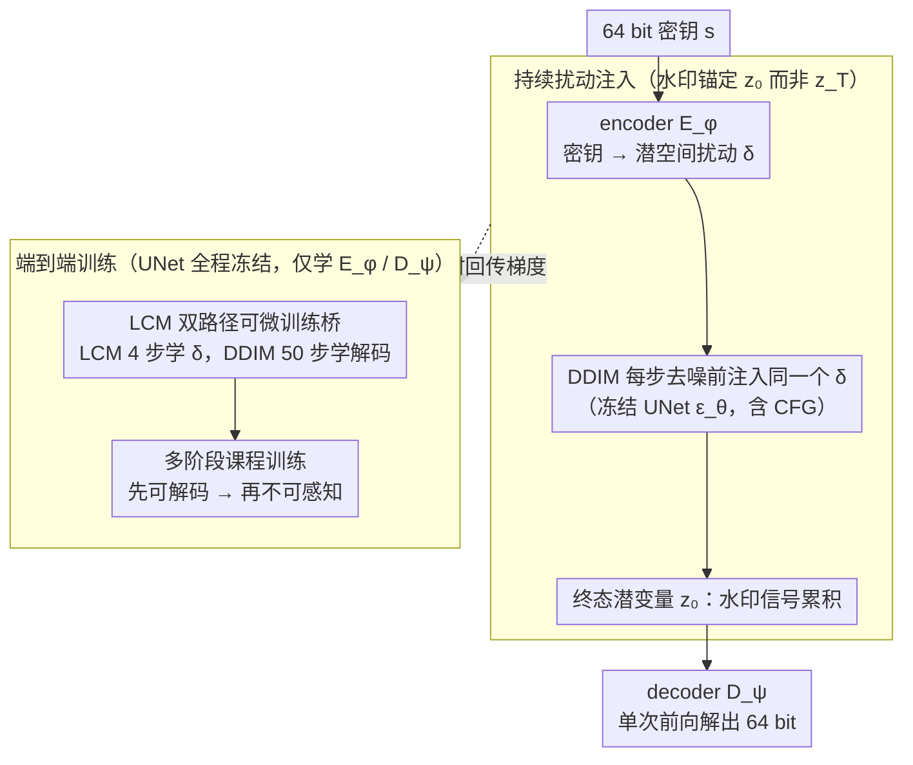

# Transferable Multi-Bit Watermarking Across Frozen Diffusion Models via Latent Consistency Bridges

**会议**: ICML2026  
**arXiv**: [2603.20304](https://arxiv.org/abs/2603.20304)  
**代码**: 待确认  
**领域**: AI 安全 / 扩散模型水印  
**关键词**: 多比特水印, 冻结扩散模型, 潜空间扰动, LCM 可微桥, 跨模型可迁移

## 一句话总结
DiffMark 把一个学到的潜空间扰动 $\delta$ 在冻结扩散模型的每一步去噪中持续注入，让水印信号在终态潜变量 $z_0$ 上累积，并借助 Latent Consistency Model 作为可微训练桥绕过 50 步 DDIM 的反向传播，实现单次前向 16.4 ms 解出 64 bit、跨模型即插即用且无需重训的水印方案。

## 研究背景与动机
**领域现状**：当前主流的扩散模型水印分两条路线：一是 sampling-based（Tree-Ring / RingID / Shallow Diffuse），把水印写进初始噪声 $z_T$ 或中间潜变量，靠 DDIM 反演 50 步把噪声"找回来"做检测；二是 fine-tuning-based（Stable Signature / AquaLoRA），通过 fine-tune UNet 或挂 LoRA 把水印绑到模型权重里，再用一个轻量 decoder 一次性读出多比特。

**现有痛点**：sampling-based 的反演检测每张图要跑 N=50 步 UNet，平台级吞吐不可承受；多数只支持 0-bit（在/不在），无法做用户身份归属；而且每张图换 key 都得重新生成噪声 pattern。fine-tuning-based 虽然支持多比特单次解码，但水印和某个 checkpoint 死死绑定，新出一个 SD 变体就得重训一遍 —— 在开源扩散模型生态里完全没法做统一治理。

**核心矛盾**：监管要的是"跨模型、可归属、可平台级验证"的水印基础设施，而现有两类方法分别在"延迟/位数"和"模型可迁移性"上各让一头，没法同时满足。根因在于把水印锚定在 $z_T$ 或 UNet 权重上 —— 前者强制反演，后者强制重训。

**本文目标**：(i) 检测端单次前向解出 $L$ bit，不要 N 步反演；(ii) 水印对 frozen UNet 透明，一套编码-解码权重能跨 SD 家族多模型直接用；(iii) 每张图可任意指定 key，不需要为每个 key 重新训练。

**切入角度**：作者观察到 —— 既然累积扰动会沿去噪轨迹一路放大并最终落在 $z_0$ 上，那水印没必要藏在 $z_T$ 里，可以以一个"恒定加性扰动 $\delta$"的形式在每一步去噪前持续注入。这样解码端只看 $z_0$ 就够，反演彻底没必要；而 $\delta$ 又只依赖一个轻量 encoder $E_\phi(s)$，跟 UNet 权重解耦，自然支持跨模型和 per-image key。

**核心 idea**：把水印从"噪声里的 pattern"或"权重里的指纹"重写为"每步去噪都加的同一个潜空间扰动 $\delta$"，再用 LCM 把 50 步 DDIM 压成 4 步可微路径用来回传 $\delta$ 的梯度，从而在 UNet 完全冻结的前提下端到端学一对 encoder-decoder。

## 方法详解

### 整体框架
DiffMark 要解决的是"水印藏在哪里"这个问题：以往把它藏在初始噪声 $z_T$ 里（检测要反演 50 步）或藏在 UNet 权重里（换模型要重训），本文则把它改写成一个在每步去噪前都加进潜变量的恒定扰动 $\delta$，让信号沿采样轨迹累积到终态 $z_0$ 上。推理端给一个 64 bit 密钥 $s$，轻量 encoder 映出 $\delta = E_\phi(s)$，标准 DDIM 照常跑、每步只多加一次 $\delta$，最后只看 $z_0$ 就能用轻量 decoder 单次前向读出密钥，反演彻底没必要。训练端则因为 50 步 DDIM 不可微，引入 LCM 作为短而可微的"梯度桥"，与真实 DDIM 路径并行，在 UNet 完全冻结下端到端学一对 encoder-decoder。

### 关键设计

**1. 持续扰动注入：把水印锚在 $z_0$ 而不是 $z_T$**

痛点是 sampling-based 方法把水印写进 $z_T$，检测必须 DDIM 反演 50 步把噪声"找回来"，平台级吞吐扛不住。作者的反转是：累积扰动会沿去噪轨迹一路放大并最终落在 $z_0$ 上，所以水印根本不必藏在初始噪声里——把密钥编码成一个加性潜空间扰动 $\delta = E_\phi(s) \in \mathbb{R}^{4\times h\times w}$，在 DDIM 每一步去噪前用 $\tilde z_{t_k} = z_{t_k} + \delta$ 替换当前潜变量再喂冻结的 $\epsilon_\theta$（含 CFG），随后照常更新 $z_{t_{k+1}} = \sqrt{\bar\alpha_{t_{k+1}}}\frac{\tilde z_{t_k} - \sqrt{1-\bar\alpha_{t_k}}\hat\epsilon_{t_k}}{\sqrt{\bar\alpha_{t_k}}} + \sqrt{1-\bar\alpha_{t_{k+1}}}\hat\epsilon_{t_k}$。这样解码端只需把图过 VAE encoder 拿回 $z_0$、再过 decoder 一次前向即可，反演成本归零。为了让 $\tilde z_{t_k}$ 不跑出 UNet 的训练分布，对 $\delta$ 加 magnitude loss $\mathcal{L}_{mag} = (\sigma(\delta) - \sigma_{target})^2$ 和 KL 散度 $\mathcal{L}_{KL}$ 把 encoder 的变分输出拉向标准高斯，强制 $\|\delta\| \ll \|z_T\|$。由于 $\delta$ 只依赖密钥、不依赖图像内容，每张图换 key 不用重新生成噪声 pattern，per-image key 是天然属性。

**2. LCM 双路径可微训练桥：在冻结 UNet 上端到端学小模块**

要端到端学 encoder，梯度必须穿过 50 步 DDIM 采样链回到 $\delta$，但这个计算图在显存和梯度稳定性上都不可承受。LCM 的 4 步蒸馏恰好是一条"短可微近似"路径：LCM 路径用 K=4 步把 $\delta$ 推到 $z_0^{lcm}$，反向链路 $\mathcal{L}_{lcm} \to D_\psi \to z_0^{lcm} \to 4\,\text{LCM steps} \to \delta \to E_\phi$ 完全可微，梯度只穿过 UNet、不更新 UNet。但 LCM 输出保真度低于 DDIM，只走 LCM 会让 decoder 在真实推理分布上掉点，于是并行挂一条 DDIM 路径：用 N=50 步标准采样得到高保真 $z_0^{ddim}$，对 $\delta$ 取 stop-gradient 且把每步注入缩放为 $\delta/N$ 以匹配 LCM 路径的累积扰动量，$\mathcal{L}_{ddim} = \mathcal{L}_{CE}(D_\psi(z_0^{ddim}), s)$ 只更新 decoder。一句话，LCM 路径负责"encoder 学 $\delta$ 该放哪里"、DDIM 路径负责"decoder 学怎么从真实 $z_0$ 读出来"，两个目标解耦互不污染；UNet 既然只过梯度不改权重，一次训练得到的 $(E_\phi, D_\psi)$ 就能零成本挂到任何 SD-family 模型上。

**3. 多阶段课程训练：先建可解码水印再修不可感知性**

重建要求 $\|\delta\|$ 足够大才能被读出，不可感知性却要求 $\|\delta\| \to 0$，这对目标若一开始就联合优化，不可感知项会迅速把 $\delta$ 压到 0、水印信号还没建立就被消掉。解法是给每个 loss 配一个激活门 $g_i(t) = \mathbb{1}[t \geq \tau_i]$，把重建组 $\mathcal{G}_{rec} = \{\mathcal{L}_{lcm}, \mathcal{L}_{ddim}\}$ 和不可感知组 $\mathcal{G}_{imp} = \{\mathcal{L}_{lafid}, \mathcal{L}_{prvl}, \mathcal{L}_{freq}, \mathcal{L}_{neg}\}$ 的开启时刻调度成 $\max_{i \in \mathcal{G}_{rec}} \tau_i \leq \min_{j \in \mathcal{G}_{imp}} \tau_j$，总 loss $\mathcal{L}(t) = \sum_i g_i(t) \cdot w_i(t) \cdot \mathcal{L}_i$。其中 $\mathcal{L}_{lafid}$ 在潜空间约束 $z_0$ 偏移、$\mathcal{L}_{prvl}$ 分散水印能量、$\mathcal{L}_{freq}$ 把扰动推到高频、$\mathcal{L}_{neg}$ 对未水印图施加负熵让 decoder 输出趋近 uniform 以压假阳。严格"先解码后隐蔽"是这类对抗目标训练唯一稳定的路径——先让硬目标（水印可解）建立稳定的解空间，再渐进加软目标（不可感知）来修。

### 损失函数 / 训练策略
预训练阶段先把 encoder-decoder 在脱离 DM 的情况下用 $\mathcal{L}_{CE}$（per-bit 交叉熵）+ 正交损失 $\mathcal{L}_{orth} = \frac{1}{B(B-1)}\sum_{i \neq j} \frac{\langle\delta_i, \delta_j\rangle_F}{\|\delta_i\|_F \|\delta_j\|_F}$ 联合训 50,000 步（batch 64，AdamW，encoder lr $3 \times 10^{-4}$、decoder lr $1 \times 10^{-4}$），让不同密钥映到尽量正交的扰动且对 $\delta + \epsilon$ 噪声扰动鲁棒。然后接入 SD v1.5 + LCM_Dreamshaper_v7（K=4）做 10,000 步联合微调（batch 16，encoder lr $5 \times 10^{-5}$、decoder lr $3 \times 10^{-4}$，500 步 linear warmup 后 linear decay 到 $10^{-6}$），按课程门控逐步打开 $\mathcal{G}_{rec}$ 和 $\mathcal{G}_{imp}$ 中各 loss。推理时只跑标准 50 步 DDIM，相对原模型零额外开销。

## 实验关键数据

### 主实验
DiffusionDB 上对比 6 个 baseline（StegaStamp / Stable Signature / AquaLoRA / Tree-Ring / RingID / Shallow Diffuse），同时覆盖检测准确率、生成一致性、生成质量三大类指标：

| 方法 | 类型 | Plug&Play | bits | Bit Acc | TPR@0.1%FPR | PSNR↑ | FID↓ | CLIP-FID↓ |
|------|------|-----------|------|---------|-------------|-------|------|-----------|
| StegaStamp | 后处理 | ✗ | 100 | 0.9994 | 1.0 | 11.34 | 54.82 | 10.26 |
| Stable Signature | 微调 | ✗ | 48 | 0.9950 | 0.9900 | 16.23 | 46.81 | 4.61 |
| AquaLoRA | 微调 | ✗ | 48 | 0.9355 | 0.9910 | 20.59 | 32.32 | 1.98 |
| Tree-Ring | 采样 | ✓ | 0 | — | 1.0 | 11.02 | 47.09 | 4.65 |
| RingID | 采样 | ✓ | 11 | — | 1.0 | 10.74 | 47.18 | 4.77 |
| Shallow Diffuse | 采样 | ✓ | 0 | — | 1.0 | 11.01 | 43.37 | 4.10 |
| **DiffMark** | 采样 | ✓ | **64** | 0.9381 | 1.0 | 11.01 | **38.07** | **2.20** |

跨模型可迁移：只在 SD 1.5 上训练，零样本测 SD-2.1 / DreamShaper 8 / Realistic Vision 5.1 / OpenJourney v4 四个未见模型，bit accuracy 稳定在 93.3–95.5%，证明 encoder-decoder 对 SD 家族通用。检测延迟：L40S GPU 上 DiffMark 16.4 ms/img，对比 Tree-Ring 754.9 ms、RingID 753.2 ms、Shallow Diffuse 239.8 ms，加速 $45\times$。身份归属：64 bit 容量在 $10^6$ 用户规模下 Top-1 准确率 100%，$10^8$ 用户仍 $\geq$ 99.97%。

### 消融实验

| 配置 | 关键发现 | 说明 |
|------|---------|------|
| K=2 / 4 / 8 LCM 步 | K=4 报告主结果；K=2 收敛更快、显存更省、accuracy 相当 | 论文承认 K=2 才是更优默认值，K 增大反而拉长梯度路径无收益 |
| L=48 / 64 / 128 / 256 bit | L=128 在 step 600 训练塌缩，$\mathcal{L}_{orth}$ 维持不住多样性 | L=64 是质量-容量甜点；L=256 LPIPS 飙到 0.508 |
| Random vs Fixed key (DiffMark) | 两种 BER 分布几乎一致 | 真正泛化到 $2^{64}$ key 空间，非局部插值 |
| Random vs Fixed key (AquaLoRA) | BER 从 6.42% 飙到 28.16% | 暴露 fine-tune 类方法对训练 key 的过拟合 |
| 13 类攻击鲁棒 (TPR@0.1%FPR) | 平均 0.70，亮度/对比度/JPEG/Erase 全 1.00，Regen-Diff/Rinse-2×Diff 全 1.00 | 旋转 / 模糊 / 随机裁剪 / Adv-KLVAE8 为 0 —— 攻击直接破坏 VAE 潜表示，是潜空间方法共性弱点 |

### 关键发现
- 双路径设计中 LCM 路径的作用是"梯度桥"而非"采样器"：消融显示 K=2 已足够，加多步只会拖慢训练 —— 验证了核心 insight：encoder 学的是 $\delta$ 该放哪儿，不需要 LCM 自己生成多漂亮的图。
- 课程训练里把不可感知 loss 推迟到水印能解码之后再开，是稳定训练的关键；同步开会被 $\mathcal{L}_{imp}$ 把 $\|\delta\|$ 压到 0。
- 潜空间水印在几何变换（旋转/裁剪/模糊）和针对 VAE 的灰盒对抗攻击下系统性失守，是这类范式的结构性局限，不是 DiffMark 独有问题。
- 64 bit 容量在 $10^8$ 用户规模仍能 99.97% Top-1 归属，这是"水印作为治理基础设施"能不能落地的关键阈值。

## 亮点与洞察
- "把水印锚在 $z_0$ 不是 $z_T$"这一观念翻转直接同时解决了延迟、key 灵活性、跨模型三个独立痛点 —— 之前所有方法都默认水印必须藏在初始噪声里，本文证明这不是必要假设。
- 用 LCM 做"训练用的可微短路径 + DDIM 做推理用的高保真长路径"这套双路径范式，是处理"不可微大模型 + 需要端到端学小模块"的一个很通用的模板，可以迁移到任何需要在 frozen large model 上挂可学习适配器的场景（如冻结扩散模型上学条件编码、frozen LLM 上学 prompt-to-perturbation）。
- 课程训练里"先解码后隐蔽"的顺序揭示了一个一般规律：对抗目标联合训练时，必须先让"硬目标"（这里是水印可解）建立稳定的 attractor，再渐进加"软目标"（不可感知），否则软目标会把硬目标对应的解空间挤光。
- 第 5 节把技术结果直接对接到 EU AI Act / C2PA / 加州 SB-53 等具体监管条款，把单次 64 bit 解码、跨模型迁移、per-image key 三个能力分别映射到"用户归属"、"生态级治理"、"事后审计"三个治理需求 —— 这种 policy-to-technology 的双向论证是 AI safety 论文里少见的写法。

## 局限与展望
- 作者承认的局限：旋转、模糊、随机裁剪、针对 VAE 的灰盒对抗攻击下完全失守，因为这些攻击在 VAE encoder 阶段就把 $z_0 = \mathcal{E}(x) \cdot f_s$ 打乱，decoder 拿不到有效输入；这也是所有潜空间水印的共性。
- 自己看到的局限：(i) 跨模型只测了 SD 1.x 家族，对 SDXL / SD3 / Flux / DiT 这类架构差异更大的新一代扩散模型没有验证；(ii) "每步加同一个 $\delta$"的假设在更短采样轨迹（如 SDXL Turbo 1-4 步、Flux 4 步）下是否仍能累积出足够强信号未知；(iii) 单 encoder-decoder 训练完后的密钥空间是固定 64 bit，扩展到更长比特或可变长度需要重训。
- 改进思路：(i) 在 $\delta$ 注入前加一个空间-频率联合的几何不变变换（如对数极坐标），缓解旋转/裁剪；(ii) 把 $\delta$ 改成跟时间步相关的 $\delta_t = E_\phi(s, t)$，在短轨迹模型上让晚期步骤注入更强信号；(iii) 联合训练一个 VAE 鲁棒化 adapter 防灰盒对抗。

## 相关工作与启发
- **vs Tree-Ring / RingID / Shallow Diffuse (sampling-based)**：它们把水印写进 $z_T$，检测必须 DDIM 反演 50 步；DiffMark 把水印写进每步注入的 $\delta$，检测只需一次 VAE encode + 一次 decoder forward。DiffMark 的代价是 bit accuracy 0.938 略低于 sampling-based 的 TPR=1.0，但换来 $45\times$ 延迟降低和多比特能力。
- **vs Stable Signature / AquaLoRA (fine-tuning-based)**：它们改 UNet 权重或挂 LoRA，水印和模型 checkpoint 死死绑定，换模型就重训；DiffMark 一套 encoder-decoder 跨 4 个未见 SD 模型 bit acc 93.3–95.5%。AquaLoRA 在 random key 下 BER 暴涨到 28.16%，暴露了 fine-tune 派对训练 key 的过拟合 —— 这恰恰是 DiffMark 不存在的问题（per-image key 是设计目标而非副产品）。
- **vs StegaStamp (post-generation pixel watermark)**：它对生成内容做后处理，质量牺牲严重（PSNR 11.34、CLIP-FID 10.26）；DiffMark 在生成阶段就嵌入，质量指标全面更优，且不需要在生成 pipeline 之外加一个独立的水印模块。
- 启发：LCM 作为"可微梯度桥"的用法不限于水印 —— 任何需要在冻结扩散模型上端到端学一个轻量条件模块（如可控生成的条件 encoder、对齐用的偏好 reward head）都可以套这个双路径模板，避免 DDIM 反向传播的显存爆炸。

## 评分
- 新颖性: ⭐⭐⭐⭐ "水印锚 $z_0$ 不锚 $z_T$ + LCM 作训练桥"双思路组合干净利落，单看每一点都不算颠覆但合在一起重写了问题边界。
- 实验充分度: ⭐⭐⭐⭐ 3 数据集 × 6 baseline × 13 攻击 × 4 跨模型 + LCM 步/比特长度消融，攻击榜单完整暴露弱点不藏短。
- 写作质量: ⭐⭐⭐⭐⭐ Sec.5 把技术能力对接到具体监管条款，policy-to-tech 论证清晰，少见的能让政策制定者看懂的技术论文。
- 价值: ⭐⭐⭐⭐⭐ $45\times$ 加速 + 跨模型 + per-image key 的组合让扩散模型水印第一次具备"平台级治理基础设施"可部署性。

<!-- RELATED:START -->

## 相关论文

- [\[ICML 2026\] Discrete Diffusion Samplers and Bridges: Off-Policy Algorithms and Applications in Latent Spaces](discrete_diffusion_samplers_and_bridges_off-policy_algorithms_and_applications_i.md)
- [\[CVPR 2026\] SLICE: Semantic Latent Injection via Compartmentalized Embedding for Image Watermarking](../../CVPR2026/image_generation/slice_semantic_latent_injection_via_compartmentalized_embedding_for_image_waterm.md)
- [\[ICML 2026\] Geometry-based Schrödinger Bridges for Trustworthy Multimodal Fusion](geometry-based_schrödinger_bridges_for_trustworthy_multimodal_fusion.md)
- [\[ICML 2026\] Latent Diffusion Pretraining for Crystal Property Prediction](latent_diffusion_pretraining_for_crystal_property_prediction.md)
- [\[ICLR 2026\] LVTINO: LAtent Video consisTency INverse sOlver for High Definition Video Restoration](../../ICLR2026/image_generation/lvtino_latent_video_consistency_inverse_solver_for_high_definition_video_restora.md)

<!-- RELATED:END -->
