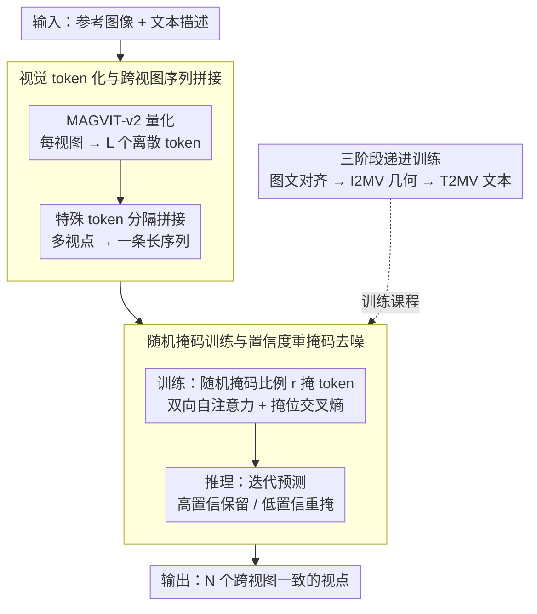

# ViewMask-1-to-3: Multi-View Consistent Image Generation via Multimodal Discrete Diffusion Models

**会议**: ICML 2026  
**arXiv**: [2512.14099](https://arxiv.org/abs/2512.14099)  
**代码**: 待确认  
**领域**: 图像生成 / 扩散模型  
**关键词**: 离散扩散, 多视图生成, 视觉 token 化, 掩码预测

## 一句话总结
通过离散扩散模型和视觉 token 化，将多视图生成建模为离散序列预测任务——利用简单的随机掩码策略结合自注意力自然地实现跨视图一致性，显著超越连续扩散方法。

## 研究背景与动机

**领域现状**：多视图生成任务长期由连续扩散方法主导——基于 3D 表示（NeRF、3D Gaussian）的几何感知方法、相机条件扩散模型、图像编辑风格的多视图生成器。这些方法依赖显式 3D 先验或复杂跨视图同步机制。

**现有痛点**：连续扩散方法需明确相机参数或精细几何约束保证视图一致性，且逐视图独立生成易在细节和纹理上不一致。文本到多视图需先用 T2I 模型生成参考图再多视图扩展，流程冗长。

**核心矛盾**：几何一致性与生成灵活性存在权衡——强化 3D 约束提高一致性但限制多样性；纯粹 2D 方法灵活但难以自然编码跨视图关系。

**本文目标**：探索离散扩散模型在多视图生成中的潜力，建立统一的图文视觉框架。

**切入角度**：离散扩散（掩码 token 预测）在多模态理解与生成中已被证明有效（如 LLaDA）。优势——推理更快（平行解码）、天然融合文本与视觉 token、与 LLM 对齐。

**核心 idea**：将多视图生成重新表述为离散序列建模问题，每个视点表示为 MAGVIT-v2 生成的视觉 token 序列，通过掩码扩散迭代 token 预测，利用简单随机掩码 + 双向自注意力自然诱导跨视图一致性。

## 方法详解

### 整体框架

ViewMask 要解决的是多视图生成里几何一致性与生成灵活性难以兼得的老问题：连续扩散要么靠显式 3D 先验、相机参数来锁住一致性，要么逐视点独立生成导致细节漂移。本文把这个任务整个搬到离散域——先用 MAGVIT-v2 把每张视图量化成一串离散视觉 token，再把多个视点拼成一条带分隔符的长序列，于是"生成多视图"就变成了"在掩码序列上做 token 预测"。一致性不再靠几何约束硬加，而是借双向自注意力让各视点的 token 互相参照自然涌现。模型按预训练对齐、图像到多视图、文本到多视图三个阶段递进训练，推理时从全掩码的目标视图出发，迭代预测与重掩码逐步还原完整序列。

### 关键设计

**1. 视觉 token 化与跨视图序列拼接：把多视点压成一条统一序列**

痛点在于多视点之间的关系若用连续特征逐视图独立处理，很难让信息自然流动。本文用 MAGVIT-v2 把每张图像 $I_i \in \mathbb{R}^{H \times W \times 3}$ 编码成长度为 $L$ 的离散 token 序列，词表规模 $|\mathcal{V}| = 2^{18}$，再用特殊 token（[SOI]、[EOI]）把多个视点首尾分隔拼成一条长序列——I2MV 任务里就是把参考视图加上 3 个待生成视点一起编码。这样做的好处是 I2MV 与 T2MV 共享同一套序列格式，二者结构差异被压到最小；更关键的是，序列化之后双向 cross-attention 可以直接在所有视点的 token 之间流动信息，跨视图关系被编码进同一个注意力场而非靠外部模块同步。

**2. 随机掩码训练与置信度重掩码去噪：让一致性从注意力里自然涌现**

这是诱导跨视图一致性的核心机制。训练时从均匀分布 $r \sim \text{Uniform}(0,1)$ 采样掩码比例，把目标视点的部分 token 随机替换成 [MASK]，再用交叉熵损失只在被掩位置上监督预测：$\mathcal{L}_{CE} = -\sum_{i=1}^{3}\sum_{j \in \mathcal{M}_i}\log P(v_j^{(i)}|s_{\setminus\mathcal{M}})$。因为预测当前视点的缺失 token 时必须参考其余未掩视点已有的 token，双向自注意力被迫去利用跨视图线索，一致性就这样从机制里长出来，不需要任何显式 geometric prior。推理时采用 confidence-based 迭代去噪：每步只保留高置信度的预测、把低置信度 token 重新掩回，由 cosine/linear/quadratic 调度函数决定下一步重掩的 token 数量；其中 cosine 调度最稳，linear/quadratic 容易过早锁定错误 token 而产生幻觉。

**3. 三阶段递进训练：从图文对齐到几何约束再到文本条件**

单阶段直接学多视图一致性缺乏基础 token 理解，本文用由弱到强的三段课程化训练。Stage 1 在 1.2M 图文对上做多模态预训练，让模型先建立文本与视觉 token 的对齐与基础生成能力；Stage 2 在 180K 个 3D object（Objaverse + HSSD）上微调 I2MV，每个 object 以 30° 仰角渲染 8 帧轨道序列，让模型显式吃进几何一致性约束；Stage 3 在用 Cap3D 描述增强的 Objaverse 上训练 T2MV、生成 4 个视点，引入文本条件把应用范围从图像扩展到纯文本输入。三段共享同一序列与 token 空间，逐层叠加监督强度。

## 实验关键数据

### 主实验

| 方法 | 架构 | GSO-PSNR↑ | GSO-SSIM↑ | 3D-FUTURE-PSNR↑ | 3D-FUTURE-SSIM↑ | 平均排名 |
|------|------|-----------|-----------|-----------------|-----------------|----------|
| Zero-1-to-3 | 2D 连续扩散 | 18.82 | 0.8294 | 17.05 | 0.8163 | 5.2 |
| Zero-1-to-3 XL | 2D 连续扩散 | 19.68 | 0.8381 | 18.47 | 0.8337 | 3.0 |
| ViVid-1-to-3 | 2D 连续扩散 | 19.80 | 0.8566 | 18.32 | 0.8437 | 3.3 |
| **ViewMask-1-to-3** | **2D 离散扩散** | **20.61** | **0.8561** | **19.99** | **0.8650** | **1.3** |

### 3D 重建一致性

| 方法 | GSO-CD↓ | GSO-IoU↑ | 3D-FUTURE-CD↓ | 3D-FUTURE-IoU↑ |
|------|---------|---------|---------------|----------------|
| Zero-1-to-3 | 0.0163 | 0.5665 | 0.0113 | 0.5005 |
| ViVid-1-to-3 | 0.0163 | 0.5841 | 0.0105 | 0.5246 |
| **ViewMask-1-to-3** | **0.0149** | **0.5847** | **0.0106** | **0.5315** |

### 关键发现
- 掩码调度策略：cosine（PSNR 18.10）优于 linear/quadratic，linear/quadratic 易产生幻觉。
- 高视点数泛化——超出训练 token 预算（8 视点）仍能泛化，验证离散序列建模鲁棒性。
- 3D-FUTURE 的 IoU 相比最强连续 baseline 提升 10.6%。

## 亮点与洞察
- **范式转换的优雅性**：将多视图生成理解为离散序列预测问题，无需显式 3D 几何约束。简单随机掩码 + 双向注意力就能诱导一致性。
- **统一多模态框架**：共享 token embedding 空间天然融合文本、参考图像、多目标视点，I2MV 与 T2MV 无缝统一。
- **超越连续扩散的关键突破**：平均排名 1.3 远优于 Zero-1-to-3 XL 的 3.0。
- **推理效率与生成质量的平衡**：掩码扩散支持并行预测，20 步迭代足以达到 SOTA。

## 局限与展望
- 固定仰角训练数据可能限制极端视角的泛化。
- 分辨率瓶颈——当前仅在 256×256 验证。
- T2MV 任务文本条件丰富度有限——仅来自 Cap3D。
- 改进：多分辨率 token 化；增强数据多样性；探索更精细的信心度评估；结合 3D 先验。

## 相关工作与启发
- **vs Zero-1-to-3 / Zero-1-to-3 XL**：2D 连续扩散 + 相机参数编码，逐视点独立生成；ViewMask 离散 token 序列化自然编码多视点关系。
- **vs TRELLIS / 3D-aware methods**：显式 3D representation 计算复杂；ViewMask 无 3D 显式建模通过 simple masking + attention 达到更优几何一致性。
- **vs 离散扩散基线（LLaDA-V）**：首次将其系统化应用于多视图生成。

## 评分
- 新颖性: ⭐⭐⭐⭐⭐  首次系统探索离散扩散在多视图生成的应用。
- 实验充分度: ⭐⭐⭐⭐⭐  双数据集 + 多维度指标 + 完整消融 + 可扩展性验证。
- 写作质量: ⭐⭐⭐⭐⭐  逻辑清晰，三阶段训练策略循序渐进。
- 价值: ⭐⭐⭐⭐⭐  不仅刷新多视图生成 SOTA 更为视觉生成任务提供离散建模新思路。

<!-- RELATED:START -->

## 相关论文

- [\[CVPR 2026\] InstructMix2Mix: Consistent Sparse-View Editing Through Multi-View Model Personalization](../../CVPR2026/image_generation/instructmix2mix_consistent_sparse-view_editing_through_multi-view_model_personal.md)
- [\[ICML 2026\] Divide and Conquer: Reliable Multi-View Evidential Learning for Deepfake Detection](divide_and_conquer_reliable_multi-view_evidential_learning_for_deepfake_detectio.md)
- [\[CVPR 2026\] Correspondence-Attention Alignment for Multi-View Diffusion Models](../../CVPR2026/image_generation/correspondence-attention_alignment_for_multi-view_diffusion_models.md)
- [\[ECCV 2024\] M2D2M: Multi-Motion Generation from Text with Discrete Diffusion Models](../../ECCV2024/image_generation/m2d2m_multi-motion_generation_from_text_with_discrete_diffusion_models.md)
- [\[ECCV 2024\] PanoFree: Tuning-Free Holistic Multi-view Image Generation with Cross-view Self-Guidance](../../ECCV2024/image_generation/panofree_tuning-free_holistic_multi-view_image_generation_with_cross-view_self-g.md)

<!-- RELATED:END -->
