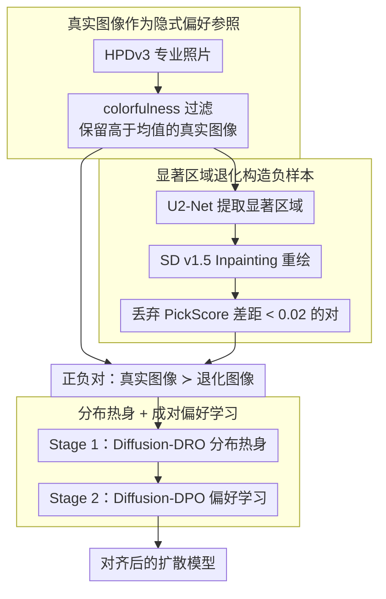

# When Preference Labels Fall Short: Aligning Diffusion Models from Real Data

**会议**: ICML2026  
**arXiv**: [2605.19839](https://arxiv.org/abs/2605.19839)  
**代码**: https://cwyxx.github.io/RealAlign  
**领域**: 图像生成  
**关键词**: 扩散模型, 偏好对齐, 真实图像, Diffusion-DPO, 数据策展

## 一句话总结
这篇论文认为由生成图像组成的偏好标签容易把模型带向“相对更好但仍有缺陷”的样本，提出用真实图像及其可控退化版本自动构造偏好信号，在只用 512 对样本的情况下对齐 SD-1.5 和 SD-3.5-M，并取得接近或补充 Diffusion-DPO / FlowGRPO 的效果。

## 研究背景与动机
**领域现状**：文本到图像扩散模型通常先通过大规模图文对学习似然，再通过偏好对齐阶段让输出更符合人类审美、真实感和提示词一致性。Diffusion-DPO、FlowGRPO 等方法把人类偏好、奖励模型或成对比较引入扩散模型后训练，已经成为提升生成质量的重要路线。

**现有痛点**：主流偏好数据集往往由同一个或多个生成模型采样图片，再让人标注哪张更好。这种偏好是相对的：被选中的图片可能只是比另一张少一点瑕疵，本身仍然有局部伪影、不自然色彩或风格偏置。模型如果长期优化这种信号，就可能学到“偏好数据里的生成器偏差”，而不是接近真正高质量图像。

**核心矛盾**：偏好对齐想教模型什么是好图像，但生成图像之间的二选一标签并不能充分定义“好”的绝对参照。当两张图都不好时，偏好标签只能告诉模型哪张更不差，难以提供稳定的真实感、结构一致性和语义一致性锚点。

**本文目标**：作者希望减少对人工偏好标注的依赖，用已有真实图像自动构造偏好监督，并验证这种监督是否可以独立对齐扩散模型、是否能作为现有偏好方法的补充后训练阶段。

**切入角度**：真实图像来自摄影平台或高质量数据集，天然包含人类选择、构图、语义和真实感信息。论文把真实图像看作正样本，再通过局部可控退化生成负样本，让偏好信号来自真实图像与缺陷版本之间的差异。

**核心 idea**：不用让人比较两张生成图，而是把真实图像当作“隐式偏好参考”，先把扩散模型拉向真实图像分布，再用真实图像和局部退化图像做 DPO 式成对学习。

## 方法详解
论文的方法可以理解为一个数据中心的扩散模型对齐框架。它并不发明新的扩散采样器，也不替换 DPO 目标，而是重新设计偏好信号来源：从 HPDv3 的专业真实照片出发，经过筛选、显著区域扰动和两阶段训练，把真实数据中隐含的人类视觉偏好转成可优化的监督。

### 整体框架
首先，论文从 HPDv3 中取专业照片作为候选正样本，并用 colorfulness 过滤掉视觉上过平或低对比的图片。接着，对每张真实图像用 U2-Net 找到显著区域，再用 prompt-conditioned SD v1.5 Inpainting 重绘这些区域。由于重绘模型会在局部纹理、结构或语义上引入缺陷，原图与重绘图就形成一对“真实参考优于退化版本”的偏好样本。最后，训练分两步进行：Stage 1 用类似 Diffusion-DRO 的分布级目标让模型靠近真实图像分布；Stage 2 从 Stage 1 模型出发，用 Diffusion-DPO 在真实图像与退化图像之间做细粒度偏好学习。

这个流程的特点是，监督信号完全来自真实数据与自动扰动，不需要人工比较标签。作者还把它作为 plug-in 后训练步骤接到 Diffusion-DPO 或 FlowGRPO 之后，验证真实数据监督与传统偏好监督是互补的。

### 关键设计

**1. 真实图像作为隐式偏好参照：用专业照片当绝对质量锚点**

偏好对齐的老问题是：偏好对里的“优胜”样本本身也是生成图，可能只是比对手少一点伪影，仍带着生成器的风格偏置和局部瑕疵，模型长期学它等于把生成器的缺陷一并学了进去。本文换一个监督来源——直接从 HPDv3 的专业摄影照片里取正样本，并用色彩丰富度（colorfulness）过滤掉视觉过平、低对比的图片，只保留高于均值的样本作为“偏好区域”的代表。这些真实照片天然包含人类在构图、语义和真实感上的选择，更接近模型真正想逼近的绝对目标分布，而不是“两张烂图里挑较好的一张”，因此能给对齐提供一个稳定、不继承生成伪影的锚点。

**2. 显著区域退化构造负样本：让正负差异集中在质量维度**

光有正样本还不够，DPO 式学习需要成对的负样本来界定“什么该被压低”。本文不另找一张图当负例（差异太大模型会学到无关变化），而是对同一张真实图做局部退化：先用 U2-Net 找出显著区域，再用 prompt 条件的 SD v1.5 Inpainting 重绘这块区域。受 inpainting 模型表达力所限，重绘区会在纹理、结构或语义上变差，于是原图与重绘图构成一对“真实参考 ≻ 退化版本”、且整体布局与语义基本对齐的偏好对。为保证信号清晰，作者还丢弃 PickScore 差距小于 0.02 的样本对。这样退化只动局部、差异恰好落在视觉保真度和图文一致性这些偏好相关维度上，监督既不空泛也不过强。

**3. 分布热身 + 成对偏好学习：先拉近分布再做细粒度对齐**

如果一上来就把“真实图像 vs 退化图像”丢进 DPO，效果有限——因为模型起点离真实图像分布太远，成对优化在悬殊分布上不稳定。本文因此分两步：Stage 1 用 Diffusion-DRO 风格的分布级目标，训练一个奖励模型区分真实图像与当前策略生成图，再更新策略去缩小这种可分性、把模型整体拉近真实分布（用 margin 避免对已排好序的样本过度优化）；Stage 2 才从热身后的模型出发，用 Diffusion-DPO 在真实图像与退化图像对上做细粒度偏好学习，提高真实图似然、压低退化图似然，并用 KL 约束防止分布漂移。消融也印证这个顺序的必要性：只做 Stage 2 提升很小，只做 Stage 1 已明显见效，两段合起来最好。

### 损失函数 / 训练策略
训练采用 LoRA。SD-1.5 使用 rank 4、scaling 4；SD-3.5-M 使用 rank 32、scaling 64。Stage 1 使用 Diffusion-DRO 目标，训练奖励/策略模型区分真实图像与当前策略生成图像，并通过 margin 避免对已经排序正确的样本过度优化；SD-1.5 学习率为 $1e^{-4}$、1600 步，SD-3.5-M 学习率为 $2e^{-4}$、3200 步。Stage 2 使用 Diffusion-DPO 目标，正样本为真实图像 $x_0^w$，负样本为退化图像 $x_0^l$，学习率为 $2.56e^{-6}$，SD-1.5 训练 1000 步，SD-3.5-M 训练 500 步。

## 实验关键数据

### 主实验
论文在 SD-1.5 与 SD-3.5-M 上训练，并在 Pick-a-Pic v2、DrawBench 和 Parti-Prompts 上评估。指标包括 PickScore、ImageReward、UnifiedReward、HPSv3、DeQA 和 LAION aesthetic score。

| 模型 / 数据集 | 方法 | 训练数据 | PickScore | ImageReward | HPSv3 | DeQA | Aes |
|---------------|------|----------|-----------|-------------|-------|------|-----|
| SD-1.5 / Pick-a-Pic v2 | Base | 无 | 20.65 | 0.16 | 5.98 | 3.70 | 5.48 |
| SD-1.5 / Pick-a-Pic v2 | Diffusion-DPO | 851k pairs | 21.03 | 0.33 | 6.80 | 3.78 | 5.59 |
| SD-1.5 / Pick-a-Pic v2 | Ours | 512 pairs | 21.04 | 0.38 | 7.33 | 3.96 | 5.64 |
| SD-3.5-M / DrawBench | Base | 无 | 22.42 | 0.79 | 10.03 | 4.09 | 5.44 |
| SD-3.5-M / DrawBench | Diffusion-DPO | 851k pairs | 22.70 | 0.97 | 10.79 | 3.96 | 5.44 |
| SD-3.5-M / DrawBench | Ours | 512 pairs | 22.80 | 1.08 | 12.77 | 4.26 | 5.55 |
| SD-3.5-M / Parti-Prompts | Base | 无 | 22.54 | 1.11 | 8.97 | 4.00 | 5.60 |
| SD-3.5-M / Parti-Prompts | Ours | 512 pairs | 22.90 | 1.27 | 10.66 | 4.20 | 5.73 |

### 消融实验
两阶段策略是论文最重要的组件消融。结果显示只做 Stage 2 的收益很小，只做 Stage 1 已经明显提升，两个阶段结合最好。

| Stage 1 分布热身 | Stage 2 偏好学习 | PickScore | HPSv3 | DeQA | Aes | 说明 |
|------------------|------------------|-----------|-------|------|-----|------|
| ✗ | ✗ | 20.65 | 5.98 | 3.70 | 5.48 | SD-1.5 base |
| ✗ | ✓ | 20.74 | 6.11 | 3.93 | 5.52 | 直接用构造对做 DPO，提升有限 |
| ✓ | ✗ | 20.87 | 6.83 | 3.75 | 5.57 | 真实分布热身贡献更大 |
| ✓ | ✓ | 21.04 | 7.33 | 3.96 | 5.64 | 完整方法最好 |

| 泛化分析 | 结果 | 解释 |
|----------|------|------|
| 非写实 Anime, vs SD-3.5-M | 73.33% win rate | 真实图像信号不只提升摄影真实感，也迁移到构图和语义一致性 |
| 非写实 Concept-Art, vs Diffusion-DPO | 66.67% win rate | 对已有偏好方法仍有补充作用 |
| DPG-Bench SD-1.5 | Base 62.84, Ours 64.38 | 密集 prompt following 有提升 |
| DPG-Bench SD-3.5-M | Base 83.40, Ours 85.43 | 更大模型上同样有效 |

### 关键发现
- 只用 512 对真实数据构造的偏好样本，SD-1.5 上已经达到与 851k 对 Diffusion-DPO 相当或更好的指标，尤其 HPSv3 从 5.98 提升到 7.33。
- SD-3.5-M 上，真实数据偏好信号对 HPSv3 的提升很明显，从 10.03 到 12.77，说明方法不是只对小模型有效。
- 真实数据监督可以接在 Diffusion-DPO 或 FlowGRPO 后继续提升，说明它补的是数据来源维度，而不是与具体偏好优化算法竞争。
- 数据量从 256 增加到 512 有明显收益，但继续增加收益递减，论文由此强调样本质量和策展比单纯扩大数据更关键。

## 亮点与洞察
- 论文把“偏好标签不足”说得很具体：问题不是 DPO 目标一定不好，而是生成样本偏好对的正样本本身可能带有伪影和风格偏置。
- 真实图像不是被当作普通监督数据，而是通过局部退化构造成可比较的偏好对，这让学习信号更聚焦在可解释的质量差异上。
- 两阶段训练的设计很朴素但合理：先解决真实分布与生成分布的距离，再做细粒度 DPO；消融结果也支持这个顺序。
- 这篇论文给图像生成对齐提供了一个数据策展视角：与其无限扩人工偏好，不如先问正负样本是否真的表达了希望模型学习的视觉标准。

## 局限与展望
- 正样本主要来自专业照片，虽然实验显示能迁移到 Anime 和 Concept-Art，但对抽象艺术、医学图像、设计图等非摄影域还需要更细验证。
- 负样本由 inpainting 模型产生，退化类型受该模型能力限制；如果负样本缺陷单一，模型可能学到特定扰动模式。
- 自动指标仍是主要量化依据，用户研究只有 18 名参与者和 60 个 prompt，规模偏小。
- 方法目前依赖图像-caption 和显著区域检测，未来可以探索视频扩散、3D 生成或多模态编辑中的真实数据偏好构造。

## 相关工作与启发
- **vs Diffusion-DPO**: Diffusion-DPO 依赖大规模人工偏好对，本文保留 DPO 优化形式，但把偏好对来源换成真实图像与退化图像，减少标注成本。
- **vs FlowGRPO**: FlowGRPO 通过奖励模型和 group optimization 改进对齐，本文指出奖励模型也继承生成样本偏差，因此真实数据监督可以作为后训练补丁。
- **vs ImageReward / PickScore 类奖励**: 奖励模型给出可微或可优化偏好信号，但可能诱导风格同质化；真实图像构造的监督更强调真实感、结构和语义一致性。
- **启发**: 对齐数据的“正样本质量”可能比偏好标签数量更重要。未来做生成模型 RLHF/RLAIF 时，可以考虑让真实数据或高质量专家数据承担锚点角色。

## 评分
- 新颖性: ⭐⭐⭐⭐☆ 用真实图像构造偏好信号的想法直观但有效，关键贡献在数据策展和两阶段训练组合。
- 实验充分度: ⭐⭐⭐⭐☆ 覆盖两种 SD 模型、多指标、用户研究和多项消融；真实用户评测规模还可以扩大。
- 写作质量: ⭐⭐⭐⭐☆ 动机和实验叙事清楚，方法没有过度复杂化；部分公式沿用 Diffusion-DRO/DPO，需要读者有扩散对齐背景。
- 价值: ⭐⭐⭐⭐⭐ 对实际图像生成对齐很有启发，尤其适合缺少人工偏好标签但拥有高质量真实图像的场景。

<!-- RELATED:START -->

## 相关论文

- [\[AAAI 2026\] Margin-aware Preference Optimization for Aligning Diffusion Models without Reference](../../AAAI2026/image_generation/margin-aware_preference_optimization_for_aligning_diffusion_models_without_refer.md)
- [\[CVPR 2025\] Calibrated Multi-Preference Optimization for Aligning Diffusion Models](../../CVPR2025/image_generation/calibrated_multi-preference_optimization_for_aligning_diffusion_models.md)
- [\[CVPR 2026\] Towards Fine-Grained Attribution: Instance-Aware Preference Optimization for Aligning Diffusion Models](../../CVPR2026/image_generation/towards_fine-grained_attribution_instance-aware_preference_optimization_for_alig.md)
- [\[ICLR 2026\] AlignTok: Aligning Visual Foundation Encoders to Tokenizers for Diffusion Models](../../ICLR2026/image_generation/aligntok_aligning_visual_foundation_encoders_to_tokenizers_for_diffusion_models.md)
- [\[AAAI 2026\] Rethinking Direct Preference Optimization in Diffusion Models](../../AAAI2026/image_generation/rethinking_direct_preference_optimization_in_diffusion_models.md)

<!-- RELATED:END -->
