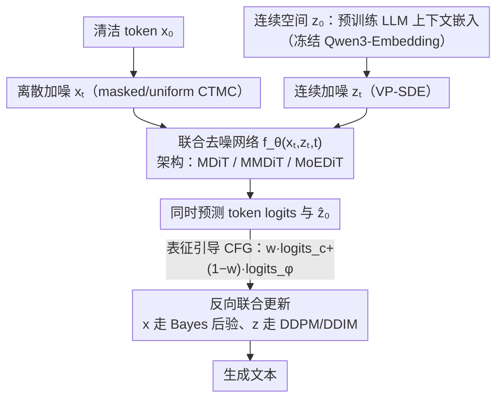

# Coevolutionary Continuous Discrete Diffusion: Make Your Diffusion Language Model a Latent Reasoner

**会议**: ICML 2026  
**arXiv**: [2510.03206](https://arxiv.org/abs/2510.03206)  
**代码**: https://github.com/zhouc20/CCDD (有)  
**领域**: 扩散语言模型 / 隐式推理 / 多模态扩散  
**关键词**: Diffusion LM、Latent Reasoning、连续-离散联合扩散、Looped Transformer、CFG

## 一句话总结
本文从表达力与可训练性两个维度系统比较连续扩散、离散掩码扩散、looped transformer，证明"连续扩散"在表达力上严格强于离散扩散并能模拟 looped transformer，但实际性能受限于解码与表征空间；据此提出 **CCDD（Coevolutionary Continuous Discrete Diffusion）**——在离散 token 空间和预训练 LLM 的上下文嵌入空间上同时扩散，由单一模型联合去噪，在 LM1B/OWT 上比 MDLM 困惑度降 25-35%，并以仅 8 步采样超过 MDLM 256 步效果。

## 研究背景与动机
**领域现状**：语言建模目前主流是自回归 LLM；非自回归路线分两支：连续扩散语言模型（CDM，SDE/PF-ODE，早期但弱）与离散扩散语言模型（DDM，尤其是 masked 扩散如 MDLM/SEDD，近期反超 CDM）。同时还有"隐式推理"路线：looped transformer（LT）和 continuous CoT，理论上能突破 transformer 在 $\mathsf{TC^0}$ 的表达力上限。

**现有痛点**：(1) LT 理论强但缺中间监督，rollout 深度偏离训练时严重 OOD，难以实用；(2) CDM 理论上可以更强，但实测被 DDM 反超，作者认为是"决策空间过大、嵌入空间不佳、解码组合复杂"的三重训练性问题；(3) masked DDM 虽然 trainable，但每步把 logits 量化成 token，丢失了跨步的不确定性记忆，且失去自纠错能力。

**核心矛盾**：**表达力上限 ↔ 实际可训练性**的根本 trade-off。连续表征能保留完整信息利于推理，但难以训练并解码；离散表征训练目标清晰但信息瓶颈。

**本文目标**：在不放弃任何一方的前提下，构造一个同时具备 (a) 连续 CDM 的高表达力（涵盖 LT），(b) 离散 DDM 的良好可训练性，(c) 预训练 LLM 嵌入的语义先验，(d) 灵活 NFE 采样的统一框架。

**切入角度**：把"语言扩散"重新定义在 $\mathcal{X} \times \mathcal{Z}$ 的**联合多模态空间**上——离散 token 提供易解码的"骨架"，预训练 LLM 的上下文嵌入提供平滑、信息丰富的"血肉"。两套噪声并行注入，一个网络同时去噪。

**核心 idea**：用"离散 token 扩散 + 连续上下文嵌入扩散"的联合 CTMC×SDE 过程做语言建模，让连续部分负责跨步的潜在推理记忆，离散部分负责高置信解码。

## 方法详解

### 整体框架
CCDD 要解决的是"连续扩散表达力最强却最难训"这个老矛盾，做法是把语言扩散搬到 $\mathcal{X}\times\mathcal{Z}$ 的联合多模态空间上：离散 token $x$ 提供易解码、强监督的"骨架"，连续上下文嵌入 $z$ 提供平滑、信息丰富、能跨步保留概率历史的"血肉"。前向时对清洁数据 $(x_0,z_0)$ 同时注入两路独立噪声——$x_t \sim \text{Cat}(\eta_t x_0 + (1-\eta_t)\pi_t)$ 走 masked/uniform CTMC，$z_t \sim \mathcal{N}(\alpha_t z_0, \sigma_t^2 I)$ 走 VP-SDE；反向时由单个网络 $f_\theta(x_t,z_t,t)$ 同时吃进两路噪声态，输出 token logits 与 embedding 预测 $\hat{x}_{0,\theta},\hat{z}_{0,\theta}$，再分别按各自模态规则更新（DDPM/DDIM 更新 $z$、Bayes 后验式 (8) 更新 $x$）。训练目标是两路 ELBO 的加权和 $\mathcal{L}_{\text{CCDD}} = \gamma_{\text{cont}} \mathcal{L}_{\text{cont}} + \gamma_{\text{disc}} \mathcal{L}_{\text{disc}}$。

### 关键设计

**1. 联合连续-离散扩散过程：让一个网络同时跑 CTMC 和 SDE**

针对 DDM"每步把 logits 量化成 token、丢失跨步不确定性记忆"和 CDM"从连续空间反解 token 组合爆炸"这两个对立痛点，CCDD 把前向设计成完全可分的乘积 $q_t(x_t,z_t|x_0,z_0) = q_t^{\text{disc}}(x_t|x_0)\, q_t^{\text{cont}}(z_t|z_0)$ 以保证加噪简单，反向却写成 $p_\theta(x_s,z_s|x_t,z_t) = p_\theta^{\text{disc}}(x_s|x_t,z_t)\, p_\theta^{\text{cont}}(z_s|x_t,z_t)$——虽然因式分解，但每个 factor 都同时依赖两路输入（Remark 4.1），这种"前向独立 + 反向条件耦合"的写法被证明与完全耦合反向核在步长 $\to 0$ 时表达力渐近等价（Theorem B.19），却大大简化了参数化。这样连续路径就能承担"跨步记忆与计划"——保留 logit 几何而非每步量化（Lemma B.9 证明 DDM 的"logits→sample→embed"是硬信息瓶颈），离散路径则承担"高置信解码"，两者各取所长。

**2. 用预训练 LLM 上下文嵌入当连续空间：解决 CDM 的"嵌入差"病根**

作者把 CDM 失败归因为"决策空间过大、嵌入空间不佳、解码组合复杂"，其中"嵌入差"是关键，所以 $z_0$ 不另学新 embedding，而是冻结取自 **Qwen3-Embedding-0.6B 倒数几层的上下文嵌入**（hidden dim 取 32、归一化后）。Figure 2 的核心消融对比了 0-th 层（接近 token-wise 查表）和第 28 层（充分上下文化）作为生成目标：前者重建 cross-entropy 最低（易解码）但 MSE 最高（难生成），后者反之，中间层（12-th、20-th）在两者间取得平衡，最终选 contextualized 层；Table 1 进一步横比 simplex / token-wise $\mathbb{R}^d$ / contextualized $\mathbb{R}^d$，结论是 contextualized 在维度、平滑度、解码歧义上综合最优（解码歧义虽高但可靠离散分支兜底）。理论上 Proposition E.1 证明 token-wise embedding 维度 $d\le V$ 表达力不超过 simplex 且生成目标是离散码本集合、对 CDM 极不友好，simplex 又有高维硬约束，唯有上下文嵌入既给出平滑生成目标又携带预训练语义先验，相当于自带"代理 representation guidance"（与 REPA、Yu 2024 同源）——这正是 CCDD 仅 40k 步就追平 MDLM 1000k 步 PPL、训练加速 25× 的来源。

**3. 表征引导的 Classifier-Free Guidance 与三种多模态架构**

为了让连续 $z$ 的影响强度在推理时可调，CCDD 把它当作"自生成的表征条件"做 CFG：训练时以概率 $p_{\text{drop}}$ 把 $z_t$ 整体置零，使模型同时学会 conditional（$z$ 在）和 unconditional（$z$ 全零）两条 forward；采样时按 $\text{logits} = w\cdot\text{logits}_c + (1-w)\cdot\text{logits}_\phi$ 混合，guidance 强度 $w$ 越大、连续推理被强化越多（消融里 $w=1.5$ 比 $w=0$ 把 Gen NLL 从 9.06 压到 8.25）。架构端给三种依算力预算可选的方案：**MDiT** 把 $x_t,z_t$ 的 embedding 直接相加进 DiT，零额外参数也能拿到 25% PPL 下降；**MMDiT** 借鉴 MM-DiT 双流交叉注意，参数翻倍换最好效果；**MoEDiT** 用 MoE 把不同模态路由到不同专家，参数膨胀小而 FLOPs 利用率高，做到性价比最优。

### 损失函数 / 训练策略
损失为两模态 ELBO 加权和，采用 $x_0$-prediction 参数化；网络在 SEDD 的 DiT 上改造并加 rotary embedding，hidden dim 取 32 与 Qwen3-Embedding 对齐。LM1B 序列长 128、OWT 序列长 512，均训 1M 步、batch 512（分别 33B / 131B tokens）。由于 Qwen-2 与 GPT-2 tokenizer 的 PPL 不可直接比较，所有基线统一用 Qwen-2 重训对齐。

## 实验关键数据

### 主实验
在 LM1B 和 OWT 上比较 PPL，参数量基本对齐 MDLM 92.1M baseline：

| 数据集 | 模型 | 参数 | 训练 tokens | Val PPL ↓ | 相对 MDLM |
|--------|------|------|------------|-----------|-----------|
| LM1B | MDLM (reimpl.) | 92.1M | 33B | ≤39.17 | — |
| LM1B | **CCDD-MDiT w/ Qwen3** | 92.1M | 33B | ≤29.22 | **-25.4%** |
| LM1B | CCDD-MoEDiT w/ Qwen3 | 104M | 33B | ≤28.50 | -27.2% |
| LM1B | CCDD-MMDiT w/ Qwen3 | 216M | 33B | ≤25.76 | -34.2% |
| OWT (Qwen-2) | MDLM (reimpl.) | 92.1M | 131B | ≤33.78 | — |
| OWT (Qwen-2) | CCDD-MoEDiT w/ Qwen3 | 104M | 131B | ≤21.90 | **-35.2%** |
| OWT (GPT-2) | MDLM (reimpl.) | 92.1M | 131B | ≤27.39 | — |
| OWT (GPT-2) | CCDD-MoEDiT w/ RoBERTa | 104M | 131B | ≤24.56 | -10.3% |
| OWT (GPT-2) | GIDD+ (reimpl.) | 92.1M | 131B | ≤25.82 | -5.7% |

在 Sudoku / 3-SAT / Countdown 三个复杂推理任务上 6M 小模型对比：

| 任务 | GPT2(6M) | Llama-7B | MDM(20 步) | LT(2 层) | LT(3 层) | **CCDD(2 步)** | **CCDD(3 步)** |
|------|----------|----------|-----------|----------|----------|---------------|---------------|
| Sudoku | 16.2 | 27.1 | 99.9 | 100.0 | 100.0 | **100.0** | **100.0** |
| 3-SAT | 73.1 | — | 87.0 | 91.3 | — | **91.9** | — |
| Countdown | 31.9 | 41.1 | 52.0 | 60.6 | 68.2 | **67.8** | **73.7** |

### 消融实验

| 配置 | Val PPL / 指标 | 说明 |
|------|---------------|------|
| Qwen3-Embedding layer 0（token-wise） | 最小 token CE，最大 representation MSE | 易解码但难生成 |
| Qwen3-Embedding layer 28（contextualized） | 最大 token CE，最小 representation MSE | 易生成但需 token 分支兜底 |
| Qwen3-Embedding 中间层 | 两个 loss 都中等 | 取得平衡，最终用此配置 |
| CCDD w=0 (joint) | Gen NLL 9.06 | 已超 MDLM 9.19 |
| CCDD w=1 (discrete-only forward) | Gen NLL 8.38 | CFG 显著提升 |
| CCDD w=1.5 | Gen NLL 8.25 | 推理时 guidance 加强进一步提升 |
| CCDD 8 步采样 | 优于 MDLM 256 步 | **16× 采样加速** |

### 关键发现
- **少步采样的颠覆性优势**：CCDD 仅 8 步就能超过 MDLM 256 步——这是连续部分能建模 joint distribution、支持 ODE 采样的直接红利，而 DDM 只能 SDE 采样所以步数大才能均匀。
- **训练效率 25×**：在 LM1B 上，CCDD 40k 步达到 MDLM 1000k 步的 PPL，预训练 LLM 嵌入起到了显著的表征正则化作用。
- **推理任务上 CCDD 2 步 ≈ LT 最佳深度**：Sudoku/3-SAT 已被 CCDD 2 步打满，Countdown 上 CCDD 3 步反超 LT 3 层最高分，验证了"连续路径承担跨步推理"的理论假设。
- **架构敏感性**：MDiT（零额外参数）已能拿到 25% PPL 下降，说明性能主要来自联合扩散的设计本身而非参数堆叠；MMDiT/MoEDiT 是锦上添花。

## 亮点与洞察
- **统一视角**："CDM ⊋ DDM、CDM 模拟 LT"两条理论结论把过去三条独立路线（continuous diffusion / discrete diffusion / looped transformer）放在同一表达力阶梯上，给出了清晰的方向感——continuous 是上限，问题在于可训练性。
- **可训练性的三因素分解**（决策空间大、嵌入差、解码组合复杂）非常深刻，**直接指导了用预训练 LLM 上下文嵌入解决"嵌入差"、用离散分支解决"解码难"**，逻辑链条罕见地干净。
- **CFG-as-representation-guidance**：把"连续表征"和"分类自由引导"两件事缝合在一起——训练时随机置零、推理时调强，这种范式可以迁移到任何"主模态 + 辅助模态条件生成"的任务（如代码生成 + AST，分子生成 + 图）。
- **8 步打 256 步**比 PPL 提升更有产业意义：扩散 LM 落地的最大瓶颈是采样慢，CCDD 给出了一条系统性的破局路径——靠表达力更强的连续分支减少 NFE，而不是靠新的 sampler。
- **理论与实验密接**：Theorem 3.2、Prop 3.4 给的是"为何要走这条路"，Figure 2 给的是"为何选 contextualized 层"，Table 6 推理任务给的是"理论预言被验证"，整篇论文形成完整闭环，很少见这么 self-consistent 的扩散语言模型工作。

## 局限与展望
- **依赖外部预训练嵌入**：性能强度强烈绑定 Qwen3-Embedding 质量，换更小或更弱的 encoder（RoBERTa）增益就只剩 ~10% 而非 35%；如果目标场景没有合适的预训练嵌入器（小语种、特殊领域），这条路线退化严重。
- **实验规模仍偏小**：92M-216M 参数远小于现代 LLM；论文只在 LM1B/OWT 这种 1B-级数据集上预训练，scaling laws 未做，3.2B/7B 量级的表现不明。
- **联合扩散在长序列上的开销**：尽管理论与实验都强调高效，但联合输入两路状态、CFG 需要两次 forward，单步成本约 2×；论文未给出与 AR LLM 在同 FLOPs 下的端到端 wall-clock 对比。
- **离散自纠错能力损失**：masked DDM 已牺牲自纠错换 trainability，CCDD 同样使用 masked 离散过程，作者未讨论是否能用 uniform DDM 配合连续分支重获自纠错。

## 相关工作与启发
- **vs MDLM / SEDD（masked DDM）**：本文证明这类模型在表达力上严格弱于 CDM，靠加一个连续分支既保留它们的可训练性又突破上限。
- **vs Continuous DLM（SED, Score Diffusion）**：作者诊断出 CDM 失败的真正原因不是"理论不行"而是"嵌入空间不行"，指出用预训练 LLM 嵌入是正解。
- **vs Looped Transformer / Universal Transformer**：CDM 在原理上能模拟 LT 且自带中间监督，作者建议用 CDM 替代 LT 做隐式推理——给"latent reasoning"开辟了扩散派的新方向。
- **vs DiT / MM-DiT / MoE**：架构端直接搬运 DiT 系，是少有的把视觉扩散架构成功迁移到语言扩散且效果显著的工作。
- **vs REPA / RCG（表征引导扩散）**：把"用预训练 encoder 表征作为扩散引导"这个视觉工作的核心思想成功移植到语言。

## 评分
- 新颖性: ⭐⭐⭐⭐⭐ 联合 CTMC × SDE 扩散是范式级新结构，并把多条独立路线统一在表达力-训练性框架下。
- 实验充分度: ⭐⭐⭐⭐ 两个数据集 + 三类架构 + CFG + 复杂推理任务的横向纵向比较完整，但缺 scaling 实验和 wall-clock 对比。
- 写作质量: ⭐⭐⭐⭐⭐ 从动机到理论到方法到实验逻辑闭环，Figure 1/2/3 与 Table 1/6 高度自洽，可读性极佳。
- 价值: ⭐⭐⭐⭐⭐ 给出"扩散语言模型如何超越 AR LLM 做推理"的可行路径，少步采样的实践意义巨大，预计会成为后续 DLM 工作的标准 baseline。

<!-- RELATED:START -->

## 相关论文

- [\[ICML 2026\] Consistent Diffusion Language Models](consistent_diffusion_language_models.md)
- [\[ICML 2026\] Plan for Speed: Dilated Scheduling for Masked Diffusion Language Models](plan_for_speed_dilated_scheduling_for_masked_diffusion_language_models.md)
- [\[ICML 2026\] PODiff: Latent Diffusion in Proper Orthogonal Decomposition Space for Scientific Super-Resolution](podiff_latent_diffusion_in_proper_orthogonal_decomposition_space_for_scientific_.md)
- [\[CVPR 2026\] Language-Guided One-Step Diffusion Model for Nighttime Flare Removal](../../CVPR2026/image_restoration/language-guided_one-step_diffusion_model_for_nighttime_flare_removal.md)
- [\[ICLR 2026\] Activation Steering for Masked Diffusion Language Models](../../ICLR2026/image_restoration/activation_steering_for_masked_diffusion_language_models.md)

<!-- RELATED:END -->
