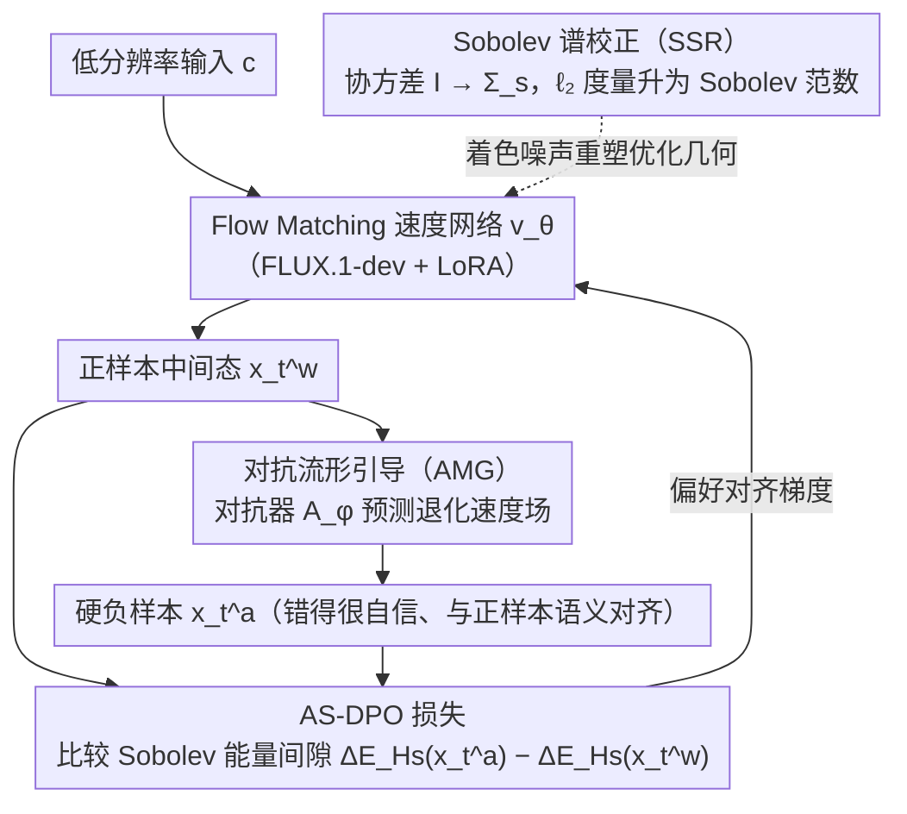

# Coloring the Noise: Adversarial Sobolev Alignment for Faithful Image Super Resolution

**会议**: ICML 2026  
**arXiv**: [2605.23264](https://arxiv.org/abs/2605.23264)  
**代码**: https://github.com/wafer-bob/ASASR  
**领域**: 图像恢复  
**关键词**: 图像超分辨率, Sobolev空间, DPO对齐, 对抗学习, 频谱一致性  

## 一句话总结

ASASR 通过将 Flow Matching 的噪声先验从各向同性高斯替换为 Sobolev 谱着色噪声，结合对抗性流形引导生成硬负样本，构建 AS-DPO 框架，实现了超分辨率中感知质量与结构保真度的最优平衡。

## 研究背景与动机

**领域现状**：基于大规模生成先验（扩散模型 / Flow Matching）的图像超分辨率（SR）方法已能合成逼真纹理，但生成质量与忠实还原之间仍存在根本性矛盾——模型倾向于"幻觉"出视觉上合理但结构上不正确的高频细节。

**现有痛点**：现有方法（如 StableSR、SeeSR、DiffBIR）依赖监督训练范式，在合成退化数据上进行像素级对齐。这导致两个问题：（1）模型过拟合人工退化假设，无法泛化到真实退化；（2）基于 $\ell_2$ 范数的优化对所有频率施加均匀权重，无法区分真实高频细节与伪影。将 DPO 引入 SR 领域是一条潜在的对齐路径，但标准 DPO 使用各向同性高斯参数化，其平坦频谱先验与自然图像固有的频谱衰减特性严重不匹配。

**核心矛盾**：标准 DPO 的 $\ell_2$ 目标在频域中对所有频率分量赋予单位权重 $\|\boldsymbol{\gamma}_\theta\|_2^2 = \frac{1}{MN}\sum_{\boldsymbol{k}} 1 \cdot \|\hat{\boldsymbol{\gamma}}_\theta[\boldsymbol{k}]\|^2$，完全忽略了自然图像功率谱密度随频率衰减的统计特性，导致模型无法在高频区域有效惩罚伪影。

**本文目标**：设计一种理论驱动的框架，使超分优化在与自然图像频谱特性对齐的几何空间中进行，同时提供信息丰富的负样本驱动对齐学习。

**切入角度**：作者观察到自然图像的功率谱密度符合 $1/f$ 衰减规律，而 Sobolev 空间 $H^s(\Omega)$ 恰好通过频率依赖的加权 $(1+\|\boldsymbol{\omega}\|^2)^s$ 编码了这种衰减约束。将噪声协方差矩阵从 $\mathbf{I}$ 替换为 Sobolev 谱算子 $\boldsymbol{\Sigma}_s$，可以自然地将优化度量从 $\ell_2$ 提升为 Sobolev 范数。

**核心 idea**：用 Sobolev 谱着色噪声替代各向同性高斯噪声来重塑 DPO 优化几何，并用基于 Riesz 表示定理的参数化对抗器生成最坏情况下的 Sobolev 梯度作为硬负样本，实现频率感知的偏好对齐。

## 方法详解

### 整体框架

ASASR 把超分辨率当成一个频率感知的偏好对齐问题来解：输入低分辨率图像 $\boldsymbol{c}$（$256\times256$），输出 $4\times$ 超分结果（$1024\times1024$），核心是让 Flow Matching 的优化几何与自然图像的频谱衰减特性对齐。训练分两步走——先在 Sobolev 谱着色噪声下训练速度网络 $\boldsymbol{v}_\theta$，再用 AS-DPO 损失做偏好对齐，其中关键的硬负样本由一个对抗网络 $\mathcal{A}_\phi$ 在线生成。骨干采用 FLUX.1-dev，通过 LoRA（$r=16,\alpha=16$）微调。

### 关键设计

**1. Sobolev 谱校正（SSR）：把优化度量从 $\ell_2$ 升级成频率加权范数**

标准 DPO 的 $\ell_2$ 目标对所有频率一视同仁，高频伪影因此得不到额外惩罚。SSR 的做法是把 Flow Matching 转移核的协方差矩阵从单位矩阵 $\mathbf{I}$ 替换为结构化谱算子 $\boldsymbol{\Sigma}_s = \mathcal{F}^{-1}\mathrm{diag}((1+\|\boldsymbol{\omega}\|_2^2)^{-s})\mathcal{F}$。由于高斯似然由 Mahalanobis 距离控制，对应的精度矩阵 $\boldsymbol{\Sigma}_s^{-1}$ 会放大高频分量，使对数似然比自然地从 $\ell_2$ 范数差变为 Sobolev 范数差 $\log\frac{p_\theta}{p_{\mathrm{ref}}}\propto -(\|\boldsymbol{\gamma}_\theta\|_{H^s}^2 - \|\boldsymbol{\gamma}_{\mathrm{ref}}\|_{H^s}^2)$。这相当于把 DPO 优化从平坦的欧几里得空间提升到 Sobolev 黎曼流形——$(1+\|\boldsymbol{\omega}\|^2)^s$ 的加权恰好编码了自然图像 $1/f$ 的频谱衰减先验，高频误差因此被自动施加更高惩罚，而这一切只靠改协方差矩阵实现，不动网络结构。

**2. 对抗流形引导（AMG）：在线造出"错得很自信"的硬负样本**

标准 DPO 缺少有信息量的负样本——静态样本对捕捉不到超分里那些细微的结构失真，而 T2I 偏好数据集又因语义布局差异给不出空间对齐的负样本。AMG 训练一个参数化对抗器 $\mathcal{A}_\phi$ 专门学习模型的典型重建失败模式：从正样本中间状态 $\boldsymbol{x}_t^w$ 出发，对抗器预测的速度场把轨迹引向退化估计 $\widehat{\boldsymbol{x}}_1^a = \boldsymbol{x}_t^w + (1-t)\cdot\boldsymbol{v}_\phi(\boldsymbol{x}_t^w, t, \boldsymbol{c})$，再用同一噪声实现 $\boldsymbol{x}_0$ 回投到流状态，从而保证负样本与正样本语义对齐、只在"细节真假"上有差别。理论上可证明这个最优扰动等价于 Sobolev 梯度方向 $\boldsymbol{\delta}_t^* = -\varepsilon_t \frac{\boldsymbol{\Sigma}_s \nabla_{\boldsymbol{x}}\mathcal{J}_{L^2}}{\sqrt{\langle\nabla_{\boldsymbol{x}}\mathcal{J}_{L^2}, \boldsymbol{\Sigma}_s\nabla_{\boldsymbol{x}}\mathcal{J}_{L^2}\rangle}}$。它不是简单地最大化损失，而是模仿模型自信度（最小化 $\ell_2$ 残差能量）同时偏离真实轨迹，专门暴露模型"错误自信"的盲区，因此比随机扰动更有信息量。

**3. AS-DPO 损失：把谱几何和对抗负样本拧成一个目标**

最终损失把 AMG 生成的对抗负样本 $\boldsymbol{x}_t^a$ 与 SSR 的 Sobolev 能量间隙 $\Delta\mathcal{E}_{H^s}$ 整合到一起：$\mathcal{L}_{\text{AS-DPO}}(\theta) = -\mathbb{E}[\log\sigma(\beta[\Delta\mathcal{E}_{H^s}(\boldsymbol{x}_t^a, \boldsymbol{c}) - \Delta\mathcal{E}_{H^s}(\boldsymbol{x}_t^w, \boldsymbol{c})])]$。基于 Riesz 表示定理可证对抗扰动等价于最坏情况下的 Sobolev 梯度，使优化沿"合理但有感知失败"的切空间推进。SSR 和 AMG 在这里是相互耦合的：AMG 提供面向真实感的对齐信号，SSR 提供频谱感知的几何约束，使对齐不以牺牲重建保真度为代价——消融实验也印证了二者缺一不可。

### 训练策略

对抗网络 $\mathcal{A}_\phi$ 的训练数据来自 Real-ESRGAN、SeeSR、SUPSR 在 DIV2K/LSDIR/RealSR/DRealSR 的 25% 随机子集上的推理输出，以覆盖足够多样的伪影模式。主模型用 AdamW 优化器、学习率 $1\times10^{-5}$，对抗网络学习率 $5\times10^{-5}$。Sobolev 指数经验设定为 $s=1.5$——这是在结构保真度和纹理真实感之间取得的最优平衡点。

## 实验关键数据

### 主实验

在合成数据集（DIV2K-Val、LSDIR-Val）和真实数据集（RealSR、DrealSR）上与 11 种 SOTA 方法对比。以 DIV2K-Val 为例：

| 方法 | PSNR↑ | SSIM↑ | LPIPS↓ | MANIQA↑ | MUSIQ↑ | CLIPIQA+↑ |
|------|-------|-------|--------|---------|--------|-----------|
| BSRGAN | 20.36 | 0.5637 | 0.3899 | 0.3097 | 54.51 | 0.5641 |
| Real-ESRGAN | 21.11 | 0.5870 | 0.3147 | 0.3726 | 61.24 | 0.6126 |
| StableSR | 19.93 | 0.5528 | 0.3016 | 0.4224 | 66.30 | 0.6702 |
| SeeSR | 20.46 | 0.5411 | 0.3325 | 0.5187 | 70.59 | 0.7222 |
| DreamClear | 19.79 | 0.5137 | 0.3206 | 0.4878 | 60.66 | 0.6356 |
| DP2O-SR | 19.60 | 0.5064 | 0.3130 | 0.5810 | 70.58 | 0.7142 |
| **ASASR** | **20.60** | **0.6171** | **0.2784** | **0.6519** | **71.40** | **0.7521** |

下游任务（OCR / 目标检测 / 实例分割 / 语义分割）评估：

| 任务 | 指标 | GT | LQ | SeeSR | DreamClear | DP2O-SR | **ASASR** |
|------|------|-----|------|-------|------------|---------|-----------|
| OCR | Recall↑ | 50.32 | 3.81 | 29.33 | 36.78 | 40.03 | **45.91** |
| 检测 | AP_b↑ | 48.32 | 12.53 | 28.06 | 28.04 | 33.51 | **35.62** |
| 实例分割 | AP_m↑ | 42.52 | 11.03 | 23.98 | 24.20 | 29.22 | **30.98** |
| 语义分割 | mIoU↑ | 49.39 | 25.18 | 39.11 | 39.16 | 41.54 | **43.33** |

### 消融实验

| 配置 | LPIPS↓ | MANIQA↑ | MUSIQ↑ | Recall↑ | AP_b↑ | mIoU↑ |
|------|--------|---------|--------|---------|-------|-------|
| Full (Sobolev + Adversarial DPO) | **0.2784** | **0.6519** | **71.40** | **45.91** | **35.62** | **43.33** |
| Euclidean Guidance (w/o SSR) | 0.3115 | 0.6184 | 67.25 | 41.64 | 34.18 | 42.15 |
| DPO w/ Supervised Data (w/o AMG) | 0.3109 | 0.6047 | 68.82 | 40.16 | 32.49 | 40.26 |
| Only Supervised Learning | 0.3135 | 0.6012 | 69.15 | 40.33 | 31.95 | 39.85 |

### 关键发现

- SSR 贡献最大：去掉 SSR 后 LPIPS 从 0.2784 恶化到 0.3115，MANIQA 从 0.6519 降至 0.6184，证明频谱感知几何是性能提升的核心
- AMG 与 SSR 耦合效应显著：单独使用 DPO+监督数据效果有限，但结合 SSR 后 mIoU 从 40.26 跃升至 43.33，说明 AMG 需要频谱感知的几何约束才能有效工作
- Sobolev 指数 $s=1.5$ 是最优选择：$s \geq 2$ 时过度平滑导致感知质量下降，$s < 1$ 时频谱约束不足
- 用户研究中 Top-1 选择率达 91.1%（50 位参与者、64 张测试图）

## 亮点与洞察

- **噪声着色思想**：将 Flow Matching 的各向同性高斯噪声替换为谱着色噪声这一操作极其优雅——不改变网络架构，仅修改协方差矩阵就将 $\ell_2$ 优化提升为 Sobolev 范数优化，理论推导自然流畅
- **对抗器设计哲学**：AMG 不是简单地最大化损失，而是最小化 $\ell_2$ 残差能量（模仿模型自信度）同时偏离真实轨迹，这种"暴露盲区"的策略比随机扰动更能生成有信息量的硬负样本
- **谱着色 + 对抗引导的组合可迁移**：SSR 将优化几何重塑为频谱感知空间的思路可直接应用于其他逆问题（去噪、去模糊、压缩伪影去除），AMG 的反事实负样本生成策略也可迁移到任意需要偏好对齐的生成任务

## 局限与展望

- 训练需要 8 张 H800 GPU，计算成本较高；推理仍需多步 ODE 求解，实时性不足
- 对抗网络的训练依赖于已有 SR 基线模型的输出作为伪影代理，若基线模型的失败模式不够多样，可能限制 AMG 的泛化能力
- Sobolev 指数 $s$ 需手动调节，未来可探索自适应频谱加权策略
- 仅在 $4\times$ 超分上验证，未探索任意尺度或极端退化场景

## 相关工作与启发

- **DP2O-SR** (Wu et al., 2025)：基于聚合 IQA 指标的启发式 DPO，缺乏理论基础；ASASR 通过 Sobolev 几何提供了严格的数学框架
- **FaithDiff** (Chen et al., 2024)：强调保真度但未解决频谱对齐问题
- **SeeSR / SUPSR**：利用语义/文本引导增强可控性，但仍受限于 $\ell_2$ 训练范式的频谱偏差

<!-- RELATED:START -->

## 相关论文

- [\[CVPR 2026\] Spectral Super-Resolution via Adversarial Unfolding and Data-Driven Spectrum Regularization](../../CVPR2026/image_restoration/spectral_super-resolution_via_adversarial_unfolding_and_data-driven_spectrum_reg.md)
- [\[ICLR 2026\] Are Deep Speech Denoising Models Robust to Adversarial Noise?](../../ICLR2026/image_restoration/are_deep_speech_denoising_models_robust_to_adversarial_noise.md)
- [\[CVPR 2025\] AdcSR: Adversarial Diffusion Compression for Real-World Image Super-Resolution](../../CVPR2025/image_restoration/adversarial_diffusion_compression_for_real-world_image_super-resolution.md)
- [\[CVPR 2026\] CASR: A Robust Cyclic Framework for Arbitrary Large-Scale Super-Resolution with Distribution Alignment and Self-Similarity Awareness](../../CVPR2026/image_restoration/casr_a_robust_cyclic_framework_for_arbitrary_large-scale_super-resolution_with_d.md)
- [\[ICML 2026\] Semi-Supervised Neural Super-Resolution for Mesh-Based Simulations](semi-supervised_neural_super-resolution_for_mesh-based_simulations.md)

<!-- RELATED:END -->
