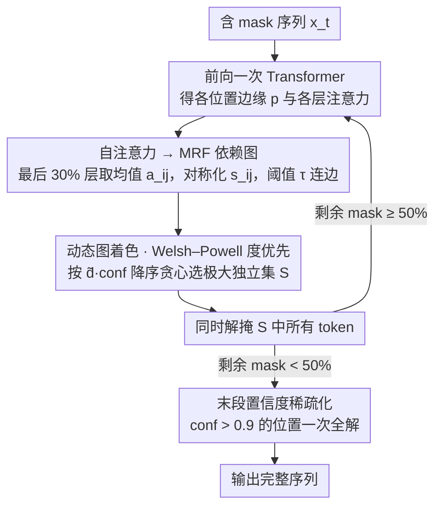

# DAPD: Dependency-Aware Parallel Decoding via Attention for Diffusion LLMs

**会议**: ICML 2026  
**arXiv**: [2603.12996](https://arxiv.org/abs/2603.12996)  
**代码**: https://ai-isl.github.io/dapd (项目页)  
**领域**: LLM效率 / 扩散语言模型 / 并行解码  
**关键词**: dLLM, 并行解码, 自注意力, 马尔可夫随机场, 图着色

## 一句话总结
DAPD 把 dLLM 单步并行解掩问题转化为「在自注意力诱导的 MRF 上选独立集」的动态图着色问题，无需训练即可同时解掩弱依赖位置，在 LLaDA / Dream 上把多问题混合提示的解码步数压到原始的 1/3.87，且准确率几乎不掉。

## 研究背景与动机
**领域现状**：以 LLaDA、Dream 为代表的扩散语言模型 (dLLM) 通过对 mask token 反复去噪生成文本，号称相对自回归模型最大的优势就是「单步可以并行解掩多个 token」，从而大幅压低函数评估次数 (NFE) ——后者是推理延迟的主要决定因素。

**现有痛点**：dLLM 训练目标只建模每个 mask 位置的条件**边缘分布** $p_\theta(x^i\mid\mathbf{x})$，并不显式建模联合分布。若直接独立地从各位置的边缘里同时采样多个 token，就会出现「联合-边缘失配」：例如 prompt「The capital of [M] is [M]」可能在两个 mask 位置分别给出高概率「France」「London」，单看都合理，合起来就是错的。

**核心矛盾**：现有 training-free 并行解码方法 (Fast-dLLM / EB-Sampler / KLASS) 都只用「边缘置信度 / 熵 / KL 稳定性」这些 token-wise 信号过滤位置，**完全没建模 mask 位置之间的依赖**。结果是：要么保守地一次只解几个 token（速度上不去），要么激进地并行解多个强耦合 token（质量塌掉）。引入辅助 planner 或重新训练 (dParallel, Learn-to-Parallel) 又破坏了 ELBO 框架且开销大。

**本文目标**：在不额外训练、不引入辅助模型的前提下，给每个解码步显式估计「哪些 mask 位置可以安全地一起解掩」。

**切入角度**：dLLM 内部已经算好了一张自注意力图——如果位置 $i$ 几乎不 attend 到位置 $j$，那么给定其他上下文时，$X_i$ 对 $X_j$ 的预测基本无关，二者就近似条件独立。换言之，**自注意力本身就是免费的条件独立性探针**。

**核心 idea**：用对称化注意力分数 $s_{ij}=\tfrac{1}{2}(a_{ij}+a_{ji})$ 在 mask 位置上诱导一个 MRF 依赖图，把并行解码归约为在该图上选「独立集」，并用 Welsh–Powell 度优先贪心着色策略每步选一个极大独立集同时解掩。

## 方法详解

### 整体框架
DAPD 要解决的是 dLLM「单步该同时解哪些 mask 才不破坏联合分布」的调度问题，做法是把它转成一道图论题：每步前向跑完一次 Transformer 后，复用已经算好的注意力把当前 mask 位置组织成一张依赖图，再在图上选一个内部互不相连的子集同时解掩。具体地，对当前 mask 序列 $\mathbf{x}_t$ 前向一次得到各位置边缘 $p_\theta(x^i\mid\mathbf{x}_t)$ 与各层各头注意力，取最后约 30% 层全部头平均得到 $a_{ij}$、对称化为 $s_{ij}$，按阈值 $\tau_t$ 连边得到 mask 节点的依赖图 $G_t=(V_t,E_t)$；随后按「置信度加权代理度数」$\tilde d_i\cdot\mathrm{conf}_i$ 降序贪心选出一个与已选节点全不相邻的独立集 $S$，把 $S$ 里所有 token 各按自己的边缘 argmax 一起解掩；当剩余 mask 比例降到 50% 以下时再切到「置信度 > 0.9 一次全解」的快速末段策略。整套流程不调任何额外模型、不重训，唯一新增开销是图构造与贪心排序，相对一次前向几乎可以忽略。

### 关键设计

**1. 自注意力 → MRF 依赖图：把模型内部已算好的注意力当作免费的条件独立性探针**

以往的 training-free 方法都把 mask 位置当成互相无关的独立单元，只用 confidence / 熵 / KL 这类逐位置边缘信号过滤，丢掉了「位置之间到底耦不耦合」这一根本信息，而联合-边缘失配恰恰就来自被忽略的位置间依赖。DAPD 的切入点是：dLLM 前向时早已算好一张注意力图，若位置 $i$ 几乎不 attend 到 $j$，则给定其余上下文时二者近似条件独立。据此在 mask 索引集 $V_t$ 上定义对称边分数 $s_{ij}=\tfrac{1}{2}(a_{ij}+a_{ji})$，由阈值触发边 $(i,j)\in E_t \iff s_{ij}>\tau_t$，把注意力直接当成 MRF 的边权。其理论依据是 Transformer 的局部 Markov 性质——$p_\theta(X_i\mid X_{V_t\setminus\{i\}})\approx p_\theta(X_i\mid X_{V_t\setminus\{i,j\}})$，即 $X_i\perp X_j \mid X_{V_t\setminus\{i,j\}}$。作者在合成数据上做了受控验证：用 length-9 序列 $(X_1,\dots,X_5,Y_1,\dots,Y_4)$ 且 $Y_i\equiv(X_i+X_{i+1})\bmod 3$ 构造已知 MRF 结构，注意力恢复出的边检测 AUC 达 0.928、边/非边的均值分数比 2.204、度估计的「顺序违反率」（OVR，即估计度数与真实度数排序不一致的比例）仅 0.04，说明注意力对真实依赖结构的恢复相当可靠，且这一切零额外训练、零额外参数。

**2. 动态图着色 + Welsh–Powell 度优先：用最少步数覆盖所有 mask，而非单步贪图最宽**

有了依赖图，「用最少步数解完所有 mask」就精确对应到「用最少颜色给 $G_t$ 合法着色」——同色即可同步并行解掩。但每解掩一批后 $V_t$ 缩小、新 token 提供的上下文又会改变 $E_t$，所以这是一道**动态**图着色。这里有个反直觉的取舍：若每步都去追最大独立集，会偏好挑低度节点，把高度的「hub」反复留到后面，尾部步数被拖长；本文的真正目标是最小化总 NFE 而非单步并行宽度，因此改用 Welsh–Powell 度优先——按代理度数 $\tilde d_i:=\sum_{j\ne i}s_{ij}$ 降序扫描，依次把与当前 $S$ 不相邻的节点加入，得到一个**极大**（不必最大）独立集。优先打掉 hub 能让残图迅速稀疏化，后续步反而可以批量解掩大量孤立节点。最终实现把排序键进一步改为 $\tilde d_i\cdot\mathrm{conf}_i$，相当于「期望有效度数」，同时兼顾结构重要性与预测可靠性。

**3. 末段置信度稀疏化：依赖几乎消失后丢掉图构造，激进收尾**

当剩余 mask 比例降到 50% 以下时，大多数节点度数已接近 0、近似条件独立，此时继续构图既无信息又有非零开销。DAPD 于是关闭图构造，转用「所有 $\mathrm{conf}_i>0.9$ 的位置一次性全解」的策略——此时置信度阈值本身就是独立集的一个低成本近似。一个更激进且无风险的变体（附录讨论）是：任何置信度恰为 1.0 的位置可随时预先解掩，因为若某边缘对某 token 概率为 1，所有相容联合分布在该位置必取同一 token，绝不会引入失配。这一步把 DAPD 的步数曲线压到比纯置信度方法更低，同时保住准确率。

### 损失函数 / 训练策略
完全 training-free：DAPD 不修改任何 dLLM 权重、不引入任何额外可训练参数，仅复用前向已算的注意力。所有评测都直接套在公开的 LLaDA-8B-Instruct 与 Dream-7B-Instruct 上。

## 实验关键数据

### 主实验
评测在 LLaDA / Dream 上覆盖代码 (HumanEval / MBPP)、数学 (GSM8K / Math500)、指令跟随 (IFEval) 与 ParallelBench；最大生成 256 token，用 lm-eval。下面是「多问题混合提示」TriviaQA × 5 设置 (LLaDA，单 block，关闭 EOS 抑制) 的核心对比：

| 方法 | 准确率 (↑) | 步数 | 相对加速 |
|------|-----------|------|---------|
| 逐 token 原版 (confidence) | 52.64 | 256.0 | 1.00× |
| Fast-dLLM | 52.12 | 124.4 | 2.06× |
| KLASS | 52.20 | 177.4 | 1.44× |
| EB-Sampler | 51.20 | 131.3 | 1.95× |
| **DAPD (本文)** | **52.08** | **66.2** | **3.87×** |

在 MBPP、IFEval 等任务上，DAPD 在单 block 设置下显著超过需要 block 切分或 EOS 抑制才能保住准确率的 baseline；ParallelBench (专门压力测试并行解码的依赖鲁棒性) 上同样占据 Score-Steps 帕累托前沿。

### 消融实验
| 配置 | 关键观察 | 说明 |
|------|---------|------|
| 注意力层选取 (Tab. 10) | 用最后 ~30% 层最佳 | 高层整合全局信息，低层偏向 token-level 局部信号 |
| 排序键: $\tilde d_i$ vs $\tilde d_i\cdot\mathrm{conf}_i$ | 加权版更优 | 同时考虑结构重要性和预测可靠性 |
| Welsh–Powell vs 最大独立集 | 度优先总步数更少 | 早解 hub 节点能更快稀疏化残图 |
| 后期阈值切换 (mask < 50%) | 进一步压步数 | 残图近乎无边时置信度阈值即近似独立集 |

### 关键发现
- **解码轨迹质变**：可视化 5 个独立小问题拼成的 prompt，baseline (Fast-dLLM / KLASS / EB-Sampler) 都呈现「两端向内推进」的伪自回归模式，segment 数始终很低；DAPD 则在前 50% 步里跨整个序列分散解掩，segment 数先升后降，真正利用了 dLLM 的双向、any-order 能力。
- **加速来源主要是「并行解决独立子问题」**：DAPD 的 3.87× 加速是 Fast-dLLM 的 ~1.88×，说明显式建模依赖比单看 marginal 置信度能挖出多得多的并行机会。
- **跨模型泛化**：Dream 上没有 block 解码 / EOS 抑制等 trick 时同样赢，证明改进来自方法本身而非 LLaDA-specific 调参。
- **图构造开销可忽略**：DAPD 复用已算好的注意力，端到端 TPS (tokens/sec) 也相对 baseline 有实测提升，不是「步数少但单步贵」的虚假加速。

## 亮点与洞察
- **「自注意力 = 免费的条件独立性探针」是一个高复用度的视角**：以往各种 token-wise 信号 (confidence / entropy / KL) 全是边缘，DAPD 第一次系统地把 attention 本身重新解释为依赖图，逻辑上对准「联合-边缘失配」根因，工程上零额外训练、零额外参数。
- **把并行解码归约到「动态图着色」是非常优雅的形式化**：以往大家把并行解码描述成「选多少 token」的连续参数问题，DAPD 直接抬到组合优化框架，能借用 Welsh–Powell 这种成熟启发式，也为未来引入更强图算法 (如分支定界、近似算法) 留出空间。
- **度优先而非最大独立集**：这是一个反直觉但正确的选择——单步最大化看似贪心最优，长期反而拖步；优先打掉 hub 节点的思路可迁移到很多「全局批调度」场景，例如 KV cache 替换、speculative decoding 的草稿选择。
- **end-of-sequence 视角的副作用**：作者发现 baseline 在单 block 设置下准确率塌掉的主因是 EOS 溢出，需要 4-block 或 EOS 抑制兜底；DAPD 因为分散解掩、晚生成结构化结尾，反而天然避开了这个坑。

## 局限与展望
- **图构造开销**：虽然只是注意力聚合 + 度排序，但当序列长到几千 token 时 $O(L^2)$ 的边分数仍会成为瓶颈；论文未给出长序列 (>1k token) 下的实测。
- **阈值 $\tau_t$ 与层数选择的稳健性**：核心超参 (注意力层、阈值、置信度切换点 0.9、长度 50% 切换点) 都偏 LLaDA / Dream 特化，换更大或不同架构的 dLLM 可能需要重新调；论文没给自动选择规则。
- **理论近似的边界**：「低 attention ⟹ 条件独立」只是一阶近似，间接依赖路径 (path-based)、跨头不同语义的 attention 都被简单平均吃掉，可能在专门构造的 adversarial 依赖结构上失效。
- **任务依赖**：在 GSM8K 这种「单一全局一致答案」的任务上，DAPD 与 baseline 的差距远不如 TriviaQA × 5 这种「天然多独立子查询」prompt 上大——也就是说，DAPD 的最大红利依赖于「prompt 本身真的有可并行的独立子结构」。

未来可顺着两条线扩展：(1) 用更强的图算法或学习型独立集选择器 (例如让 dLLM 自蒸馏一个调度小头) 替代 Welsh–Powell；(2) 把同样的「attention → 依赖图」视角用到 KV cache 共享、speculative decoding draft 选择、MoE expert 路由等其他「需要按依赖批调度」的场景。

## 相关工作与启发
- **vs Fast-dLLM (Wu et al., 2026)**：Fast-dLLM 只用一个固定置信度阈值过滤可并行位置；DAPD 复用了它在末段 (mask < 50%) 的阈值收尾思路，但前段用 MRF 独立集显式建模依赖，把 3.87× vs 2.06× 的加速差距全靠依赖建模拉开。
- **vs EB-Sampler (Ben-Hamu et al., 2025)**：EB-Sampler 用熵界控制并行风险，本质仍是 marginal 信号，DAPD 通过 attention 引入跨位置交互信息更直接对准联合-边缘失配。
- **vs KLASS (Kim et al., 2025b)**：KLASS 用相邻步 KL 散度估计 token 稳定性，仍是逐位置标量；DAPD 是结构化（图）信号，因此能区分「都很自信但相互冲突」的位置对。
- **vs 训练型方法 (dParallel, Learn-to-Parallel, APD)**：那些方法引入额外 planner 或重新训练 dLLM 让其学会同时解多 token，效果通常更好但成本高、可能破坏 ELBO；DAPD 选了另一条路——「在已有模型内部信号上做几何/组合优化」，工程上几乎零迁移成本。
- **vs MaskGIT 系列 (Chang et al., 2022)**：MaskGIT 在视觉离散扩散上用 top-k 置信度并行解码，可视为 dLLM 文本场景下 baseline 的祖先；DAPD 表明在文本任务上单靠置信度远不够，必须显式建模 token 间依赖。

## 评分
- 新颖性: ⭐⭐⭐⭐⭐ 「自注意力当 MRF 边权 + 动态图着色」是非常干净的新视角，且把以往零散的 training-free 启发式统一到组合优化框架。
- 实验充分度: ⭐⭐⭐⭐ 覆盖两种 dLLM、五大任务 + ParallelBench + 合成数据 MRF 验证，消融到位；不足是长序列与更大模型规模上的表现没给。
- 写作质量: ⭐⭐⭐⭐ 数学推导、可视化、对照实验环环相扣，「动态图着色」「hub 节点优先打」等比喻容易抓住；公式较多但都点到为止。
- 价值: ⭐⭐⭐⭐⭐ 训练-free、即插即用、对所有现有 dLLM 立即可用、加速比相对 SOTA 翻倍，工程价值与思想价值兼具。

<!-- RELATED:START -->

## 相关论文

- [\[ICML 2026\] DyLLM: Efficient Diffusion LLM Inference via Saliency-based Token Selection and Partial Attention](dyllm_efficient_diffusion_llm_inference_via_saliency-based_token_selection_and_p.md)
- [\[ICLR 2026\] Skip to the Good Part: Representation Structure & Inference-Time Layer Skipping in Diffusion vs. Autoregressive LLMs](../../ICLR2026/image_restoration/skip_to_the_good_part_representation_structure_inference-time_layer_skipping_in_.md)
- [\[ICML 2026\] Triadic Dynamics Aware Diffusion Posterior Sampling for Inverse Problems: Optimizing Guidance and Stochasticity Schedules](triadic_dynamics_aware_diffusion_posterior_sampling_for_inverse_problems_optimiz.md)
- [\[ICML 2025\] ε-VAE: Denoising as Visual Decoding](../../ICML2025/image_restoration/epsilon-vae_denoising_as_visual_decoding.md)
- [\[CVPR 2026\] CARD: Correlation Aware Restoration with Diffusion](../../CVPR2026/image_restoration/card_correlation_aware_restoration_with_diffusion.md)

<!-- RELATED:END -->
