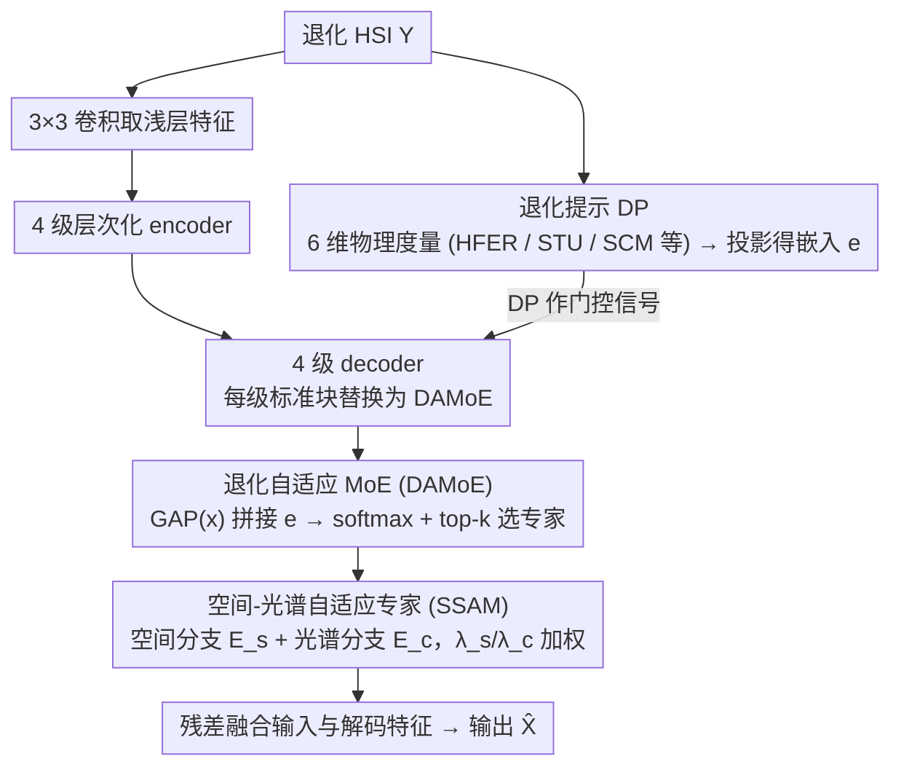

# Degradation-Aware Metric Prompting for Hyperspectral Image Restoration

**会议**: ICML 2026  
**arXiv**: [2512.20251](https://arxiv.org/abs/2512.20251)  
**代码**: https://github.com/MiliLab/DAMP (有)  
**领域**: 图像恢复 / 高光谱图像 / 统一恢复  
**关键词**: 高光谱图像恢复, 退化感知提示, 可解释度量, Mixture-of-Experts, 零样本泛化

## 一句话总结
DAMP 用 6 个可解释的空间-光谱物理度量（高频能量比/纹理一致性/光谱曲率等）作为"退化提示" (DP) 代替黑盒嵌入与显式退化标签，再用 DP 作为门控驱动 Spatial-Spectral Adaptive MoE 选择不同的"空间专家/光谱专家"，在 5 种 HSI 恢复任务和 2 种未见退化（运动模糊、Poisson 噪声）上同时取得 SOTA。

## 研究背景与动机
**领域现状**：高光谱图像 (HSI) 在数百个连续波段上记录材料的光谱响应，但受信噪比、运动模糊、条带缺失、波段缺失、压缩等多种退化影响。早期方法对每类退化训练一个专用网络；随后受自然图像中 PromptIR / InstructIR 等"统一恢复 (UIR)"框架启发，PromptHSI、MP-HSIR 等开始用"一个模型恢复多种退化"的范式。

**现有痛点**：当前的 HSI 统一恢复方法分两条路，都有硬伤——

- **显式先验类**（PromptHSI/MP-HSIR）：需要外部给定的退化类型标签或文本描述。实际拍摄场景中很难事先知道是"模糊+条带+波段缺失"哪个组合，更别说严重度。
- **隐式黑盒类**（PromptIR/DFPIR）：从输入直接编码出一个 latent prompt，把所有未见退化都强行投影到训练分布的流形里，泛化能力差；而且没有显式机制建模光谱相关性，光谱保真度差。

**核心矛盾**：HSI 退化在物理上是"连续、混合、跨维度"的（空间维上是纹理破坏，光谱维上是光谱曲线扭曲），但现有提示要么是离散类别（不连续），要么是不可解释 latent（不分维度）。提示空间的几何结构与退化的物理结构不匹配，导致泛化与可解释性同时失败。

**本文目标**：构造一种**不依赖外部标签、可解释、跨维度、对未见退化天然连续**的退化表征，并让恢复网络能根据这个表征"按需"分配计算资源（什么时候该重建空间纹理，什么时候该恢复光谱连续性）。

**切入角度**：作者在 1000 张退化 HSI 上做了一个先导实验——用高频能量比 (HFER)、空间纹理一致性 (STU) 和光谱曲率均值 (SCM) 这 3 个简单的物理度量做随机森林分类，发现 5 类退化已经能被清晰区分；同时不同退化类型在某些度量上呈现重叠分布（如轻微模糊与低噪声的 SCM 接近）。这说明：**少量可解释度量既能区分退化身份，又能自然反映退化之间的共性**——前者解决可解释性，后者解决泛化。

**核心 idea**：把"退化 prompt"从黑盒嵌入或类别标签换成**多维物理度量向量** (Degradation Prompt, DP)，再用它作为 MoE 的门控信号，强制路由逻辑显式锚定在"高频能量越高 ⇒ 偏向光谱滤波专家"这类物理规则上，从而把可解释性、混合退化处理、零样本泛化一次解决。

## 方法详解

### 整体框架
DAMP 是一个层次化 U-Net 风格的统一 HSI 恢复网络，要解决的是"不知道退化类型也不给标签时，怎么用一个模型恢复多种 HSI 退化"。它把问题转成两条平行流的协作：一条从输入退化 HSI $\mathcal{Y}$ 直接算出 6 维物理度量、投影成退化提示向量 $\mathbf{e} \in \mathbb{R}^d$（DP），作为贯穿所有解码层的全局退化条件；另一条是常规的特征恢复流——$3\times 3$ 卷积取浅层特征、4 级层次化 encoder（标准注意力块）、4 级 decoder，但每一级 decoder 的标准块都被 DAMoE 替换，由 DP 充当门控信号动态调节恢复轨迹，最后残差融合输入与解码特征输出 $\hat{\mathcal{X}} = \mathcal{R}_\theta(\mathcal{Y})$。真正非平凡的地方有三处：DP 用哪些度量、DAMoE 怎么靠 DP 路由、以及每个专家 (SSAM) 内部如何在空间与光谱之间分工。

### 关键设计

**1. Degradation Prompt：用可解释物理度量取代黑盒退化表征**

DP 要回答的痛点是现有 prompt 要么是离散类别（不连续、依赖外部标签）、要么是黑盒 latent（不可解释、被训练分布锁死）。作者的做法是从 25 个候选度量（涵盖熵、梯度、频域统计）出发做三阶段筛选——先用可解释性把没有明确物理对应的抽象统计量剔掉，再按空间-光谱覆盖确保空间结构和光谱保真两个维度都有代表，最后用随机森林对退化分类、按特征重要性挑出可分性最高的几个，最终留下 6 维：高频能量比 HFER $=\frac{1}{C}\sum_c \frac{\sum_{(u,v)\in\Omega_H}|\mathcal{F}[x_c]|^2}{\sum_{(u,v)}|\mathcal{F}[x_c]|^2}$、空间纹理一致性 STU（频谱几何均值/算术均值之比）、光谱曲率均值 SCM $=\frac{1}{C-2}\sum_i|\nabla^2 s_i|$、光谱曲率标准差、梯度标准差、空间相关系数，再过一个小投影网络得到嵌入 $\mathbf{e}$。这套度量之所以有效，是因为它们是退化的物理客观指标而非拟合量：HFER 直接反映高频细节被破坏的程度，对噪声/模糊/降采样都敏感且方向各异；SCM 反映光谱曲线是否平滑连续，能识别波段缺失与光谱失真。因为不绑定训练分布，即便遇到训练时没出现的 Poisson 噪声或运动模糊，DP 也会落在合理数值区间而不会被强行投影到错误类别上——这正是零样本泛化的源头。

**2. Degradation-Adaptive MoE：让 DP 显式驱动专家路由**

有了可解释的退化条件，下一步是让恢复网络"按需调度"，而不是用黑盒视觉特征决定算什么。DAMoE 在 decoder 每一级里动态选 top-$k$ 个专家组合：给定输入特征 $\mathbf{x}$，先用 GAP 把空间维压成全局向量、与 DP 嵌入 $\mathbf{e}$ 拼接，再经两层投影 + softmax + top-$k$ 稀疏化得到门控分数 $\mathbf{g} = \mathcal{T}_k(\text{softmax}(\mathbf{W}_g \cdot \sigma(\mathbf{W}_{proj}[\text{GAP}(\mathbf{x}), \mathbf{e}]) + \epsilon))$，训练时注入 $\epsilon \sim \mathcal{N}(0,1)$ 噪声促进专家探索与负载均衡；最终特征 $\mathbf{f}_{deg} = \sum_{i \in \mathcal{K}} g_i \cdot \mathbf{f}_i$ 再与一个共享专家提取的"退化无关特征"通过 channel-wise 卷积融合。和 MoCE-IR 那类纯视觉特征路由的 MoE 比，DAMoE 的路由同时被"物理可解释"和"输入条件"双重锚定：HFER 高（噪声重）时门控会显式偏向擅长光谱滤波的专家，即便视觉特征因重度退化而模糊不清，路由依然稳定。这也解释了消融里把 DP 路由换成频域路由掉 3.71 dB、换成类别路由掉 5.16 dB、换成隐式 prompt 掉 4.62 dB——路由信号本身的物理对齐度决定了 MoE 的上限。

**3. SSAM：用 expert-wise 混合系数逼出专家分化**

DAMoE 里的每个专家算子由 SSAM 实现，要解决的是"怎么让专家真的不一样"。每个专家有两条平行分支：$\mathcal{E}_s$ 用 Window-based Multi-head Self-Attention 抓空间结构依赖，$\mathcal{E}_c$ 用 1D 卷积建模波段间相关性，第 $i$ 个专家输出 $\mathbf{F}_{expert}^{(i)} = \lambda_s^{(i)} \mathcal{E}_s(\mathbf{F}) + \lambda_c^{(i)} \mathcal{E}_c(\mathbf{F})$ 且 $\lambda_s^{(i)} + \lambda_c^{(i)} = 1$。关键约束在于 $\lambda_s^{(i)}, \lambda_c^{(i)}$ 是专家特定的可学习参数而非输入特定的预测值——也就是每个专家长期"选边站"，训练完会自然分化出空间专家（$\lambda_s$ 大、专做纹理恢复）和光谱专家（$\lambda_c$ 大、专做光谱保真）。这一步针对的是 HSI 退化空间维与光谱维不同步的事实（模糊主要破坏空间、光谱曲线相对完好；噪声两者都破坏）：若让每个专家都用 instance-wise 自适应权重，专家会趋同、MoE 退化成一个大网络；改成 expert-wise 学习权重后强制每个专家走极端，路由器才真正有"不同配比的专家可挑"，从而根据 DP 选出针对当前退化的最优空间/光谱配比。这把复杂度从单个算子转移到专家组合的动态编排上，分支本身反而可以做得简洁高效。

### 损失函数 / 训练策略
直接用 L1 损失：$\mathcal{L} = \|\hat{\mathcal{X}} - \mathcal{X}\|_1$，无额外正则。门控里加高斯噪声是唯一的负载均衡机制。AdamW（$\beta_1=0.9, \beta_2=0.999$），lr $=1\times 10^{-4}$，batch size 4，自然场景 HSI 训 3000 epoch，遥感 HSI 训 1500 epoch，单卡 RTX 4090。

## 实验关键数据

### 主实验
5 种统一恢复任务 + 自然场景/遥感两类数据集的全面 PSNR/SSIM/SAM 对比（节选自 Table 2，单位 dB / – / °）：

| 任务（数据集） | MP-HSIR | PromptIR | MoCE-IR | **DAMP** | 提升 |
|---|---|---|---|---|---|
| Gaussian Deblur (ARAD) | 44.58 / 0.984 / 0.900 | 49.18 / 0.996 / 0.822 | 50.52 / 0.996 / 0.673 | **52.84 / 0.998 / 0.508** | +2.32 dB |
| Super-Resolution (ARAD) | 41.77 / 0.972 / 1.142 | 40.57 / 0.966 / 1.168 | 40.62 / 0.967 / 1.110 | **44.01 / 0.981 / 0.866** | +2.24 dB |
| Inpainting (Xiong'an) | 33.42 / 0.697 / 11.13 | 31.36 / 0.579 / 13.60 | 29.04 / 0.518 / 15.79 | **33.62 / 0.711 / 10.98** | +0.20 dB |
| Gaussian Denoise (ICVL) | 42.16 / 0.968 / 3.030 | 42.35 / 0.970 / 2.659 | 42.66 / 0.973 / 2.434 | **42.86 / 0.974 / 2.229** | +0.20 dB |
| Avg. on ARAD (5 任务) | 47.85 / 0.984 / 1.608 | 47.20 / 0.984 / 1.510 | 48.72 / 0.985 / 1.203 | **51.43 / 0.989 / 0.936** | +2.71 dB |
| Avg. on RS 数据 | 38.33 / 0.839 / 12.73 | 38.19 / 0.812 / 13.25 | 36.78 / 0.774 / 15.09 | **39.42 / 0.851 / 10.11** | +1.09 dB |

零样本（在 CAVE 上、训练时未见过的退化，Table 3）：

| 方法 | 运动模糊 PSNR/SSIM | Poisson 去噪 PSNR/SSIM |
|---|---|---|
| PromptIR | 30.53 / 0.881 | 21.98 / 0.442 |
| MoCE-IR | 30.34 / 0.878 | 19.51 / 0.401 |
| MP-HSIR | 23.63 / 0.688 | 16.96 / 0.240 |
| **DAMP** | **31.05 / 0.899** | **24.08 / 0.538** |

Poisson 去噪 +2.10 dB 的零样本提升尤其能说明 DP 的物理度量没有被训练分布"锁死"。

### 消融实验
组件消融（Table 4，ARAD 上 5 任务平均 PSNR/SSIM）：

| 配置 | PSNR (dB) | SSIM | 说明 |
|---|---|---|---|
| Baseline (无 DP 无 SSAM) | 45.82 | 0.976 | 退化成普通 U-Net |
| + DP | 50.02 | 0.986 | **+4.20 dB**，DP 是主要贡献者 |
| + DP + SSAM (Full) | **51.43** | **0.989** | +1.41 dB，SSAM 在 DP 之上再加成 |

路由策略消融（Table 5）：

| 路由信号 | PSNR (dB) | 与 DP 差距 |
|---|---|---|
| Frequency-based (MoCE-IR 同款) | 47.72 | −3.71 |
| Degradation Type (类别标签) | 46.27 | −5.16 |
| Implicit Prompt (PromptIR 同款) | 46.81 | −4.62 |
| **DP (Ours)** | **51.43** | – |

### 关键发现
- DP 单独加进来就涨 4.20 dB，远大于 SSAM 的 1.41 dB——**真正的核心创新是退化表征，而不是 MoE 架构本身**。MoE 在 HSI UIR 里早有人用，但用错了路由信号，所以效果上不去。
- 类别标签路由比隐式 prompt 路由还差 0.5 dB，说明"硬分类"反而会丢失退化连续性信息；DP 既保留连续性又保留物理可解释性，因此两头都赢。
- 跨频谱 band 的误差分析（Fig. 6）显示 SSAM 在所有任务上都把光谱误差压得最低，证明 expert-wise 学习的 $\lambda_s/\lambda_c$ 确实让光谱专家发挥了作用，没有被空间任务淹没。
- 零样本 Poisson 去噪 +2.10 dB 这种幅度在 UIR 文献里非常少见，进一步印证 DP 的物理度量对训练时未见过的噪声分布也能给出有意义的数值。

## 亮点与洞察
- **把"prompt"从语义/类别拉回物理度量**：自然图像 UIR 整个赛道都在卷"文本 prompt / 视觉 prompt / 隐式 prompt"，DAMP 反其道而行——用闭式可计算的频域和曲率统计量当 prompt。这种"prompt 物理化"的思路其实可以迁移到很多有明确退化物理模型的任务（医学图像、低剂量 CT、地震信号、点云去噪），凡是退化过程可被几个物理量表征的领域都适用。
- **Expert-wise 而非 instance-wise 的混合系数**：在 MoE 里强制每个专家的内部组合系数是固定可学的（而不是动态预测的），是一个反直觉但很有效的设计。它牺牲了单个专家的灵活性，换来了专家分化（specialization），让路由器真正有"不同的专家可挑"。这个 trick 可以套用到任何需要 MoE 分化的任务上，比如多模态 LLM 的模态专家、多任务学习的任务专家。
- **路由信号决定 MoE 上限**：消融里换路由信号就能差 3-5 dB，比换专家结构差距还大。这给后续做 MoE 的人一个清晰提示——把精力放在"门控该看什么"比"专家该是什么"更重要。

## 局限与展望
- **6 个度量是手工筛的，不是端到端学的**：作者用随机森林 + 三阶段筛选确定 6 维 DP，过程虽然有原则但仍带有人工偏置。如果换数据集或换任务（如 SAR、医学），这套筛选很可能要重做。一个自然的延伸是把度量池本身变成可学习的字典，端到端联合训练。
- **未与显式物理退化模型耦合**：DP 只是描述退化的程度，没有反演退化算子 $\mathcal{D}(\cdot)$。如果在 DP 之上再加一个轻量的退化反演头（例如估计模糊核或噪声分布），可能进一步提升性能，也能给出"我恢复的是什么样的退化"的诊断信息。
- **天然场景和遥感分开训练**：因为域差距太大，作者训了两个独立模型。理想的统一恢复应该跨域，未来可以考虑用 DP 作为跨域桥梁（因为度量本身是与传感器无关的）。
- **运行效率与参数量**：FLOPs / 参数量 / 推理时间在 Table 6 中只给到 InstructIR 一行（被截断），完整对比缺失；MoE 在每层 decoder 都用，理论上比单 backbone 慢，部署到机载/星载平台还要验证。

## 相关工作与启发
- **vs PromptIR / InstructIR**（自然图像 UIR）：都用 prompt 作为退化条件，但 PromptIR 用从输入抽的隐式 prompt、InstructIR 用文本指令，本质都是"高维 + 与训练分布耦合"。DAMP 用"低维 + 物理客观"的 prompt，从根本上换掉了表征空间，因此零样本能赢 2+ dB。
- **vs MP-HSIR / PromptHSI**（HSI UIR）：都试图把自然图像的 prompt 思路搬到 HSI，但都依赖外部退化类型/文本标签，实际场景拿不到。DAMP 不需要任何外部标注，从输入自己算度量，更符合实际部署。
- **vs MoCE-IR**（用 MoE 做自然图像 UIR）：架构上最接近，都是 MoE + 路由。差别在于 MoCE-IR 用频域统计做路由（仅空间维），DAMP 用空间 + 光谱双维度物理量做路由，且专家内部用 expert-wise 学习的空间/光谱配比强制分化。在 HSI 场景下 DAMP 比 MoCE-IR 平均涨 2.71 dB。
- **启发**：可解释 prompt 在任何"退化机理可建模"的逆问题里都值得一试；MoE 想真正发挥作用，"让专家变得不一样"比"加更多专家"重要得多。

## 评分
- 新颖性: ⭐⭐⭐⭐ "用物理度量取代黑盒/标签 prompt"在 HSI UIR 里是个清晰的概念翻转，虽然单点技术（度量、MoE、SSAM）都不算全新。
- 实验充分度: ⭐⭐⭐⭐⭐ 5 任务 × 8 数据集主实验 + 2 个零样本任务 + 组件/路由两组关键消融 + 跨 band 光谱误差分析，覆盖全面。
- 写作质量: ⭐⭐⭐⭐ 动机推导清晰、图表丰富；可惜效率表 (Table 6) 在公开稿里被截断，DP 度量定义的部分细节进了 supplementary。
- 价值: ⭐⭐⭐⭐ 对所有做高光谱/多光谱/医学影像统一恢复的研究者都是直接可借鉴的设计；"prompt 物理化"和"expert-wise 混合系数"两个思路有跨领域迁移潜力。

<!-- RELATED:START -->

## 相关论文

- [\[CVPR 2025\] Degradation-Aware Feature Perturbation for All-in-One Image Restoration](../../CVPR2025/image_restoration/degradation-aware_feature_perturbation_for_all-in-one_image_restoration.md)
- [\[CVPR 2026\] DRFusion: Degradation-Robust Fusion via Degradation-Aware Diffusion Framework](../../CVPR2026/image_restoration/drfusion_degradation_robust_fusion_via_degradation_aware_diffusion_framework.md)
- [\[CVPR 2025\] DPIR: Dual Prompting Image Restoration with Diffusion Transformers](../../CVPR2025/image_restoration/dpir_dual_prompting_restoration_dit.md)
- [\[CVPR 2026\] Degradation-Robust Fusion: An Efficient Degradation-Aware Diffusion Framework for Multimodal Image Fusion in Arbitrary Degradation Scenarios](../../CVPR2026/image_restoration/degradation-robust_fusion_an_efficient_degradation-aware_diffusion_framework_for.md)
- [\[CVPR 2026\] EMR-Diff: Edge-aware Multimodal Residual Diffusion Model for Hyperspectral Image Super-resolution](../../CVPR2026/image_restoration/emr-diff_edge-aware_multimodal_residual_diffusion_model_for_hyperspectral_image_.md)

<!-- RELATED:END -->
