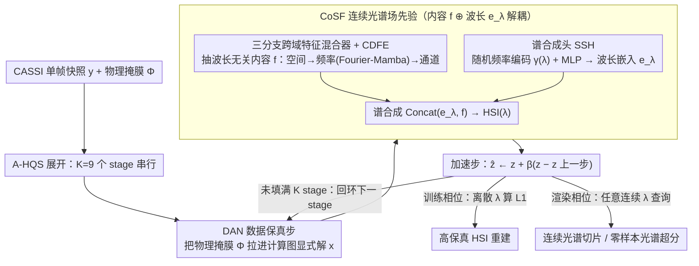

# Phy-CoSF: Physics-Guided Continuous Spectral Fields Reconstruction and Super-Resolution for Snapshot Compressive Imaging

**会议**: ICML 2026  
**arXiv**: [2605.13583](https://arxiv.org/abs/2605.13583)  
**代码**: [github.com/PaiDii/Phy-CoSF](https://github.com/PaiDii/Phy-CoSF)  
**领域**: 图像恢复 / 高光谱成像 / 隐式神经表征  
**关键词**: CASSI, 高光谱重建, 深度展开网络, 隐式神经表征, 连续光谱超分

## 一句话总结
为单次曝光式压缩光谱成像 (CASSI) 设计一个 train-render 两阶段、按波长可任意查询的深度展开框架——在每个展开 stage 内塞入连续光谱场 (CoSF) 先验模块，由 Fourier-Mamba 驱动的三分支跨域特征混合器 + 随机频率编码 + 谱合成头组成，离散波长训练即可在推理时合成任意连续波长的高光谱图像，实现连续光谱重建与零样本光谱超分。

## 研究背景与动机

**领域现状**：CASSI 系统通过物理掩膜 + 色散器 + 2D 传感器把 3D 高光谱图像 (HSI) 压缩成单张快照，从单帧反推完整 HSI 是严重欠定的逆问题。主流方案沿着"模型驱动先验（稀疏、低秩）→ E2E CNN/Transformer (TSA-Net, MST++) → 深度展开网络 DUN (ADMM-Net, GAP-Net, DAUHST, DERNN-LNLT, LADE-DUN, MiJUN)"路线演进，DUN 凭借物理可解释 + 数据驱动并重成为当前主流。

**现有痛点**：所有主流方法（不论 E2E 还是 DUN）都建立在**固定离散波长**的输入-输出假设上：训练时绑定 28 个波长通道，推理时也只能输出这 28 个波长。但 CASSI 的物理成像原理是连续色散，这种"训练-推理都离散"的设定既与物理本质矛盾，又彻底排除了"在新波长上推断"或"光谱方向超分"等高价值能力。要扩展到新波长就必须重新采集训练数据并重训整个模型。

**核心矛盾**：DUN 的强先验来自"每个 stage 学一个离散通道的去噪/去模糊算子"，但要做连续波长查询，先验本身必须是关于波长的连续函数。如何把隐式神经表征 (INR) 的"按坐标查询任意输出"能力嵌进展开网络，同时不破坏物理一致性，是关键挑战。

**本文目标**：(1) 让单一模型既能做高保真的 HSI 重建，又能在任意目标波长上做光谱超分；(2) 保留 DUN 的物理可解释结构 (A-HQS 算法展开)，先验模块改成 "波长无关内容 + 连续光谱合成" 的解耦形式；(3) 充分利用 HSI 在空间/频率/通道三域的互补结构。

**切入角度**：作者意识到光谱合成问题与 NeRF 中"按坐标查询颜色"的本质相同——只要在 DUN 的每个 stage 用"波长无关的内容表征 $f$"+"连续波长嵌入 $e_\lambda$"做隐式解码，就可以训练时只用离散波长样本、推理时按任意 $\lambda$ 渲染。

**核心 idea**：把 DUN 改造为 **train-render 两阶段范式**——训练相位只在有 GT 的离散波长上查询并算 L1 loss，渲染相位则把同一模型自由查询任意连续波长，实现"零样本光谱超分"。

## 方法详解

### 整体框架
Phy-CoSF 要解决的是 CASSI 单帧快照反推完整高光谱图像这个严重欠定的逆问题，做法是把带加速的半二次分裂算法 A-HQS 沿前向物理模型 $y = \Phi x + n$ 展开成 $K=9$ 个 stage，并在每个 stage 的先验步里嵌入一个"按波长连续查询"的隐式表征模块。单个 stage 依次做三件事：先由 DAN (degradation-aware network) 显式求解数据保真子问题 $x_{k+1} = (\Phi^T \Phi + \mu I)^{-1}(\Phi^T y + \mu \hat z_k)$，把物理掩膜 $\Phi$ 直接拉进计算图；再由 CoSF 模块求解先验子问题 $z_{k+1} = \text{CoSF}(x_{k+1}, \eta)$，其中 $\eta = \sqrt{\tau/\mu}$ 是可学噪声水平；最后做加速步 $\hat z_{k+1} = z_{k+1} + \beta_k(z_{k+1} - z_k)$。整套网络在训练相位只对随机抽取的若干离散波长查询并算 L1 loss，推理相位则可向 CoSF 喂任意波长 $\lambda$ 渲染出单波长切片 $HSI(\lambda) \in \mathbb{R}^{1\times H\times W}$。

### 关键设计

**1. 连续光谱场先验 CoSF：把"针对固定通道训练的离散去噪算子"换成关于波长的连续场**

传统 DUN 的痛点是每个 stage 学到的先验只对训练时绑定的离散通道有效，无法外推到新波长。CoSF 通过把先验解耦成"波长无关内容 + 波长相关嵌入"两半来打破这一限制。内容侧的 Triple-Branch Cross-Domain Feature Mixer 抽取一个与波长无关的多尺度表征 $f \in \mathbb{R}^{C \times H \times W}$：先用 $3\times 3$ 卷积升通道得到 fine-grained 特征 $f_H \in \mathbb{R}^{C/12 \times H \times W}$，再经 $4\times 4$ 卷积逐级下采样并过 CDFE 得到 meso-scale $f_M \in \mathbb{R}^{C/6 \times H/2 \times W/2}$ 与 coarse-scale $f_L \in \mathbb{R}^{C/3 \times H/4 \times W/4}$，三条分支都经 CDFE 跨域处理后插值回原分辨率，做 $1\times 1$ refinement 卷积并按通道 concat 成 $f$——三个尺度同时兜住局部纹理、中尺度结构与全局上下文。波长侧的 Spectral Synthesis Head (SSH) 把目标 $\lambda$ 归一化到 $[-1,1]$，经随机频率编码 $\gamma(\lambda) = [\sin(2\pi\lambda b_1), \dots, \cos(2\pi\lambda b_m)]$（$b_i \sim \mathcal{N}(0,\sigma^2)$ 固定不学）和 MLP 投影得到嵌入 $e_\lambda \in \mathbb{R}^D$，与 $f$ concat 后由两个 $3\times 3$ 加一个 $1\times 1$ 卷积合成该波长强度图 $HSI(\lambda) = \text{SH}(\text{Concat}(e_\lambda, f))$。随机 Fourier 编码这一步尤为关键，它注入"高频归纳偏置"来对抗深度网络天生的低频偏好；而内容与波长的解耦，正是同一模型能在任意 $\lambda$ 上连续查询的物理基础。

**2. 跨域特征编码器 CDFE：在空间→频率→通道三个域接力补足卷积只看局部的短板**

HSI 的空间结构、频谱关联与跨通道相关性本是三种天然解耦的信号，单靠卷积只能抓局部上下文。CDFE 用一条三段串联的序列骨干依次在三域提炼特征：空间域用 GLAM-Net (global-local attention) 抽局部纹理，$f_{spatial} = f_{in} + \text{GLAM}(f_{in})$；频率域（本文创新点）先用 2D-FFT 把 $f_{spatial}$ 映到频域——此时每个频域系数都已编码全图结构信息——再展平成 1D 序列喂入 Mamba block 做长程依赖建模并 iFFT 回空间域残差连接，即 $f_{freq} = f_{spatial} + i\text{FFT}(\text{Mamba}(\text{FFT}(f_{spatial})))$；通道域再用 GDFN 按通道校准 $f_{out} = f_{freq} + \text{GDFN}(f_{freq})$，各段维度保持一致以便残差。在频域用 Mamba 而非 Transformer 是有意为之：1D SSM 能在 $O(N)$ 内做长程建模，避开 $O(N^2)$ 注意力开销，特别适合高分辨率高光谱这种序列长度等于 $H\times W$ 展平的场景。

**3. Train-Render 两阶段范式：用最小训练改动换来零样本光谱超分**

光谱超分的真值数据极难获取，作者因此让训练只在有 GT 的离散波长上进行、把连续能力留到推理时白嫖出来。训练相位每个 batch 随机抽一组 GT 对应的离散波长，CoSF 只查询这些坐标得到切片并算 L1 重建损失 $\mathcal{L}_{rec} = \|HSI_{pred}(\lambda) - HSI_{gt}(\lambda)\|_1$ 来更新整网；但由于 SSH 把 $\lambda$ 当作连续输入条件，模型实际学到的是一个关于波长的连续函数而非离散查表。推理相位随即解除限制：直接向 SSH 喂训练集从未出现过的任意 $\lambda$，即可得到该波长的高保真光谱切片，从而在光谱维度上完成零样本超分。这套范式只改了 query 坐标的采样方式，却让 DUN 第一次具备了"按需查询波长"的能力。

### 损失函数 / 训练策略
训练只用 L1 重建损失 $\mathcal{L}_{rec} = \|HSI_{pred}(\lambda) - HSI_{gt}(\lambda)\|_1$，每个 batch 随机抽样一组离散波长查询。展开 stage 数 $K = 9$，每 stage 含 1 个 DAN、1 个 CoSF 与一次加速更新；CDFE 内的 Fourier-Mamba 块为方向无关的 1D Mamba，输入序列长度即频域 $H \times W$ 展平。评估在 ICVL 数据集 10 个 scene 上进行，指标为 SAM (谱角)、PSNR、SSIM。

## 实验关键数据

### 主实验
连续光谱重建（与多种主流 DUN/E2E 方法在统一离散波长设置下对比）：

| 方法 | Params (M) | FLOPs (G) | Avg SAM ↓ | Avg PSNR (dB) ↑ | Avg SSIM ↑ |
|---|---|---|---|---|---|
| MST++ | 0.07 | 1.18 | 2.43 | 34.48 | 0.884 |
| CST-L+ | 0.15 | 3.94 | 2.41 | 34.39 | 0.882 |
| GAP-Net | 4.21 | 65.73 | 2.38 | 36.01 | 0.915 |
| DAUHST-9stg | 2.42 | 6.68 | 2.32 | 35.76 | 0.911 |
| RDLUF-MixS2-9stg | 0.11 | 31.49 | 2.47 | 35.03 | 0.900 |
| DERNN-LNLT*-9stg | 0.93 | 122.14 | 2.33 | 35.72 | 0.911 |
| LADE-DUN-10stg | 1.23 | 8.34 | 2.16 | 35.79 | 0.914 |
| MiJUN-9stg | 0.04 | 6.01 | 2.37 | 35.26 | 0.901 |
| **Phy-CoSF-9stg** | 0.27 | 801.38 | **1.14** | **36.45** | **0.915** |

Phy-CoSF 的 SAM 仅 1.14（最强基线 LADE-DUN 是 2.16，几乎翻倍优势），PSNR 36.45 dB 也是最佳；尤其在多个 scene（Scene1/2/4/7/10）上的 SAM 降到 1 左右，远低于其他方法的 2–3.5。代价是 FLOPs 高达 801G，比其他展开网络大一个数量级。

### 消融实验

| 配置 | 关键指标 (Avg) | 说明 |
|---|---|---|
| Full Phy-CoSF-9stg | SAM 1.14 / PSNR 36.45 / SSIM 0.915 | 完整三大模块 |
| w/o CoSF 模块 (退回离散先验) | 接近 LADE-DUN 等基线水平 (PSNR ~35.7) | 失去连续渲染能力，性能掉 0.7 dB+ |
| w/o Fourier-Mamba (频域分支) | SSIM/PSNR 下降明显 | 全局依赖建模缺失 |
| 单尺度替代三分支 | 多尺度细节丢失 | 验证 fine/meso/coarse 必要性 |
| 固定波长编码替代 RFE | 高频细节不足 | 随机 Fourier 编码提供必要归纳偏置 |
| Train-Render 不分离 | 无法做零样本光谱超分 | 范式本身决定能力上限 |

（注：详细消融表在论文附录。）

### 关键发现
- **SAM 的显著优势**说明 Phy-CoSF 的光谱保真度大幅领先：SAM 从 ~2.4 降到 1.14 意味着光谱方向上的角度误差减半，主因是 RFE + SE 的连续 $\lambda$ 编码让 SSH 能精细刻画频谱形状。
- **参数高效但 FLOPs 高**：0.27M 参数（仅次于 MST++/MiJUN），但 FLOPs 801G 远超对手——因为 SSH 需要逐 stage、逐波长执行，是典型的"参数小但计算密集"的隐式表征架构。
- **零样本光谱超分**首次在 CASSI DUN 框架内实现：训练时只用离散波长，推理时直接查询任意 $\lambda$ 得到高保真切片，图 1 底部展示了这一能力。
- **Fourier-Mamba 比频域 Transformer 更高效**：作者特别强调用 Mamba 在频域做 1D 序列建模，扩大上下文同时控制了显存，验证了 SSM 在结构化谱信号上的适用性。

## 亮点与洞察
- 把 INR 思想嵌进 DUN 的每个 stage 是非常自然但少有人做的组合：DUN 提供物理可解释 + 强先验，INR 提供连续查询能力，二者互补几乎天作之合。
- "波长无关内容 $f$ + 波长相关嵌入 $e_\lambda$" 的解耦设计可以迁移到任何"按某连续坐标查询输出"的逆问题，比如时间维度上的视频帧率提升、空间维度上的 super-resolution、或动态范围维度上的 HDR 渲染。
- Fourier-Mamba 块的灵感来自"频域系数本身就是 1D 全局信号"——把 2D 频谱展平后用 Mamba 处理，巧妙绕过了 Transformer 在大图上的复杂度问题，是 SSM 用于频域处理的一个干净案例。
- Random Fourier 编码 + 可学 MLP 投影的组合（先固定高频归纳偏置，再用 MLP 做任务适配）已经在 NeRF 系列中得到验证，本文把它无缝迁移到 1D 波长坐标上。

## 局限与展望
- FLOPs 801G 远超基线（最近 DAUHST 仅 6.68G），单图推理速度未给出；对实时高光谱重建不友好。
- 连续光谱超分仅在 train-render 范式下做了定性展示（图 1），缺少对"新波长上的真值"做定量评估的实验，超分质量的上界还需进一步分析。
- 评估只在 ICVL 上做，未覆盖更具挑战的 KAIST、CAVE 或真实仪器数据；对不同色散参数的鲁棒性未知。
- 训练用 L1 损失，对噪声/高动态范围场景可能偏向过平滑；可考虑加 perceptual 或谱角损失。
- CoSF 模块的 SSH 必须按波长逐次查询，渲染整套 200+ 波长需要多次前向；可探索批量并行查询的实现优化。

## 相关工作与启发
- **vs LADE-DUN**：LADE-DUN 用预训练 latent diffusion 当生成先验、PSNR 35.79；Phy-CoSF 把先验改成连续场，PSNR 36.45 且额外获得连续渲染能力。
- **vs MiJUN (Mamba + tensor mode-k unfolding)**：MiJUN 是首批把 Mamba 用进 CASSI DUN 的工作；Phy-CoSF 把 Mamba 用到频域而非时间/空间维度，并 + INR 解耦。
- **vs DERNN-LNLT**：跨 stage 共享参数压缩模型；Phy-CoSF 走相反路径——参数仍小但通过 INR 让模型具有更多功能 (连续渲染)。
- **vs NeRF/INR 系列**：本文是把 NeRF "坐标 → 颜色"的思想沿光谱坐标轴 (而非空间坐标轴) 延伸到 HSI 重建的一次成功尝试，启示后续可在更多 inverse problem 中部署。

## 评分
- 新颖性: ⭐⭐⭐⭐ INR + DUN + Fourier-Mamba 三件套的组合，是 CASSI 重建从"离散波长"跨入"连续光谱"的首批工作之一。
- 实验充分度: ⭐⭐⭐ 与 9 种主流方法在 ICVL 上对比清楚，但缺乏多数据集 + 连续超分定量评估。
- 写作质量: ⭐⭐⭐⭐ 物理推导 + 模块分解清晰，图 3/4 配合好。
- 价值: ⭐⭐⭐⭐ 为高光谱成像引入"按需查询波长"的新能力，对遥感、医学影像、农业等下游应用有显著实用价值。

<!-- RELATED:START -->

## 相关论文

- [\[CVPR 2026\] Spectral Super-Resolution via Adversarial Unfolding and Data-Driven Spectrum Regularization](../../CVPR2026/image_restoration/spectral_super-resolution_via_adversarial_unfolding_and_data-driven_spectrum_reg.md)
- [\[CVPR 2026\] Statistical Characteristic-Guided Denoising for Rapid High-Resolution Transmission Electron Microscopy Imaging](../../CVPR2026/image_restoration/statistical_characteristic-guided_denoising_for_rapid_high-resolution_transmissi.md)
- [\[CVPR 2025\] A Physics-Informed Blur Learning Framework for Imaging Systems](../../CVPR2025/image_restoration/a_physics-informed_blur_learning_framework_for_imaging_systems.md)
- [\[CVPR 2026\] UCAN: Unified Convolutional Attention Network for Expansive Receptive Fields in Lightweight Super-Resolution](../../CVPR2026/image_restoration/ucan_unified_convolutional_attention_lightweight_sr.md)
- [\[ICML 2026\] Coevolutionary Continuous Discrete Diffusion: Make Your Diffusion Language Model a Latent Reasoner](coevolutionary_continuous_discrete_diffusion_make_your_diffusion_language_model_.md)

<!-- RELATED:END -->
