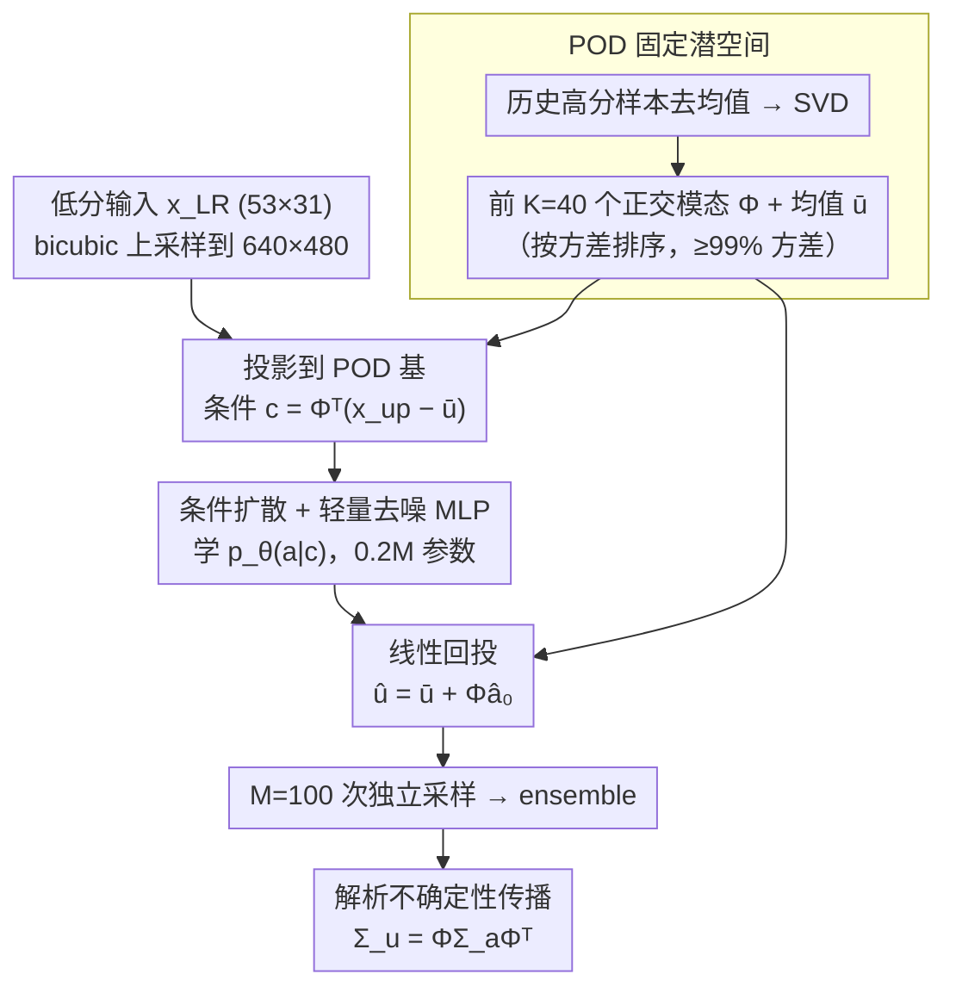

# PODiff: Latent Diffusion in Proper Orthogonal Decomposition Space for Scientific Super-Resolution

**会议**: ICML 2026  
**arXiv**: [2605.03399](https://arxiv.org/abs/2605.03399)  
**代码**: 无  
**领域**: 扩散模型 / 科学机器学习 / 概率超分辨率  
**关键词**: POD 潜空间, 条件扩散, 不确定性量化, 海表温度降尺度, 集成生成

## 一句话总结
PODiff 把扩散模型从像素空间搬到固定的、按方差排序的 POD 系数空间里跑，用极小的 MLP 就能在 $640\times 480$ SST 降尺度任务上拿到与像素级扩散相当的精度，同时因为重构是线性的，集成方差可以通过 $\Sigma_u=\Phi\Sigma_a\Phi^\top$ 解析回传到物理空间，得到空间上可解释、且校准良好的不确定性。

## 研究背景与动机
**领域现状**：在气候、海洋、地球物理流体等科学计算中，"低分辨率场 → 高分辨率场" 的超分辨率（downscaling）是一个长期任务。近几年扩散模型成为概率超分辨率的主流：相比确定性 U-Net 只给一个点估计，扩散模型能采样集成，自然给出预测分布。

**现有痛点**：直接在像素空间跑扩散对 $640\times 480$ 这种典型海洋场已经非常昂贵——PixelDiff 在文中训练 48 小时、峰值显存 12.5 GB、单样本推理 1.24 秒；要做 100 样本集成就更夸张。而经典的 latent diffusion（Rombach 等）虽然把扩散搬到 autoencoder 学到的低维空间，但学到的非线性潜空间与"空间方差"没有清晰对应，无法把潜空间方差解析地翻译成物理量上的方差。

**核心矛盾**：扩散模型的概率优势需要"采样很多次"才能体现，而像素空间采样代价高得无法接受；想用 latent 又会失去"潜变量 ↔ 物理空间不确定性"之间的可解释映射。

**本文目标**：(1) 把扩散搬进一个低维但仍与物理空间对应明确的潜空间；(2) 让不确定性能从潜空间解析地映回物理空间；(3) 在 SST 降尺度这种实际任务上证明这两点同时成立。

**切入角度**：作者注意到科学场（气候、流体）通常具有强低秩线性结构——前几个 POD 模态就能解释绝大多数方差。POD 同时给出一组**正交、按方差排序**的基，这意味着潜空间天然带有几何结构：低阶系数 ↔ 大尺度模态，高阶系数 ↔ 细尺度变化。

**核心 idea**：用 POD 投影代替学习式 autoencoder 当扩散潜空间，扩散只在 $K\ll d$ 个 POD 系数上跑；线性重构 $\hat u=\bar u+\Phi\hat a$ 让协方差从 $\Sigma_a$ 到 $\Sigma_u$ 有解析关系。

## 方法详解

### 整体框架
输入是低分辨率场 $x_\text{LR}\in\mathbb{R}^{d_\text{low}}$（53×31 的 ACCESS-S2 海洋再分析），输出是同一区域 $640\times 480$ 的高分辨率 SST 场及其逐像素方差。Pipeline 分四步：(1) **离线 POD**——用历史高分辨率训练样本去均值后做 SVD，得到前 $K$ 个正交模态 $\Phi\in\mathbb{R}^{d\times K}$ 和均值 $\bar u$，$K$ 取累计方差 $\geq\eta$ 的最小整数（实验取 $\eta\approx 99\%$，$K=40$）。(2) **条件构造**——把低分辨率 bicubic 上采样到 $d=640\times 480$，投到 POD 基上得到 $c=\Phi^\top(x_\text{up}-\bar u)\in\mathbb{R}^K$。(3) **POD 系数空间扩散**——一个轻量 conditional MLP 学习 $p_\theta(a\mid c)$，前向加噪 $a_t=\sqrt{\bar\alpha_t}\,a_0+\sqrt{1-\bar\alpha_t}\,\epsilon$，反向 $T=1000$ 步训练、$S=100$ 步采样。(4) **线性回投与方差传播**——预测 $\hat a_0$ 反标准化后 $\hat u=\bar u+\Phi\hat a_0$；多次独立采样得到 ensemble，潜空间样本协方差 $\Sigma_a$ 通过 $\Sigma_u=\Phi\Sigma_a\Phi^\top$ 解析传到物理空间。

### 关键设计

**1. POD 作为固定潜空间：用问题自带的几何替代 learned autoencoder**

像素空间扩散在 $d\approx 3\times 10^5$ 维上太贵，而学习式 autoencoder 的非线性 latent 又跟物理量脱钩。PODiff 不训练任何编码器，而是对中心化的 snapshot 矩阵 $U=[u_1-\bar u,\dots,u_N-\bar u]$ 做一次离线 SVD，按特征值排序保留前 $K$ 个模态 $\Phi$，于是任何场都可写成 $u\approx\bar u+\Phi a$、系数为 $a=\Phi^\top(u-\bar u)$；取 $K=40$（累计方差 $\geq 99\%$）就把空间场压成 40 维，第一个模态单独就解释了 SST 方差的 70%+。这组基的好处是三重的：免去 encoder-decoder 训练、避免潜空间畸变；正交且按方差排序，潜几何稳定、低阶系数对应大尺度、高阶对应细节；而且线性重构让协方差关系 $\Sigma_u=\Phi\Sigma_a\Phi^\top$ 严格成立，二阶统计量可以解析传播。它真正起作用的是"按方差排序、与数据自适应"这一性质而非单纯降维——RandOrthDiff 这个对照（把 POD 换成随机正交基、其余完全相同）RMSE 从 0.39 一路飙到 1.00 ∘C 就是证据。

**2. 条件扩散与轻量去噪 MLP：把扩散从卷积搬到 40 维向量上**

降维之后扩散只需在 $K$ 维系数空间学条件分布 $p_\theta(a\mid c)$。条件向量 $c$ 来自把 bicubic 上采样后的低分辨率场投影到 POD 基，与噪声系数 $a_t$ 拼接后送入一个 4 层、宽 256 的残差 MLP，配正弦时间步嵌入，输出预测噪声 $\epsilon_\theta(a_t,c,t)$，训练目标就是标准 $\ell_2$ 噪声预测损失 $\mathbb{E}\|\epsilon-\epsilon_\theta\|^2$（POD 系数训练前按模逐个标准化、采样后反标准化）。因为维度极小，这个去噪网络只有 0.20M 参数，对比像素级扩散的 33M U-Net；这一替换把训练时间从 48 h 压到 3.8 h、峰值显存从 12.5 GB 压到 1.4 GB，却完整保留了扩散的概率采样能力。

**3. 解析不确定性传播：方差直接由线性基从潜空间回投物理空间**

要给出空间分辨的预测方差，PODiff 不额外训练 uncertainty head，而是直接利用重构的线性性。做 $M=100$ 次独立扩散采样，每个 $\hat a_0^{(m)}$ 经 $\hat u^{(m)}=\bar u+\Phi\hat a_0^{(m)}$ 回到物理空间，物理空间协方差就是 $\Sigma_u=\Phi\Sigma_a\Phi^\top$（$\Sigma_a$ 为潜系数样本协方差），低阶模态的不确定性主导大尺度形态、高阶模态表现为局部细节变化，传播路径几何上完全可解释。相比之下，MC Dropout U-Net 要跑 100 次完整 U-Net 前向、PixelDiff 要跑 100 次像素级扩散反向才能估方差，而这里整个采样代价被压到 MLP 级。校准质量用经验覆盖率、reliability curve、MACE 与 CRPS 评估。

### 损失函数 / 训练策略
训练目标是标准 DDPM 噪声预测损失 $\mathcal{L}(\theta)=\mathbb{E}_{a_0,t,\epsilon}\|\epsilon-\epsilon_\theta(a_t,c,t)\|_2^2$，$t\sim\text{Uniform}\{1,\dots,T\}$，$T=1000$，推理用 $S=100$ 步 sampler。优化器 AdamW，学习率 $2\times 10^{-4}$，扩散模型按验证 diffusion loss 选最优 checkpoint。SST 任务用 1998–2009 训练、2010 验证、2011（含 marine heatwave 极端事件）测试。所有指标只在海洋像素上算。

## 实验关键数据

### 主实验
SST 降尺度，全 2011 年 365 天均值；"Extreme" 是超过日内 90 百分位气候态的极端事件子集。

| 方法 | RMSE (∘C) | MAE (∘C) | Extreme RMSE | Extreme MAE |
|------|----------|---------|--------------|-------------|
| PODiff-K40 | **0.3923** | **0.2976** | **0.4836** | **0.3537** |
| PixelDiff (像素扩散) | 0.4118 | 0.3158 | 0.4899 | 0.3600 |
| U-Net (33M) | 0.6788 | 0.5141 | 0.8366 | 0.6109 |
| POD-proj (无扩散) | 0.7084 | 0.5223 | 0.8896 | 0.6305 |
| RBF 插值 | 0.7784 | 0.5804 | 0.7899 | 0.5936 |
| RandOrthDiff-K40 | 0.9987 | 0.7577 | 1.2309 | 0.9003 |

计算代价对比（关键卖点）：

| 方法 | 参数 | 峰值显存 | 训练时间 | 单样本推理 |
|------|------|--------|--------|----------|
| U-Net | 33M | 8.8 GB | 8.2 h | 0.05 s |
| PixelDiff | 33M | 12.5 GB | 48 h | 1.24 s |
| PODiff (K=40) | **0.20M** | **1.4 GB** | **3.8 h** | 0.08 s |

### 消融实验

| 配置 | RMSE | 说明 |
|------|------|------|
| PODiff-K40 | 0.3923 | 完整模型，$K=40$（≥99% 方差） |
| PODiff-K20 | 0.5171 | 截断到 20 个模态 |
| PODiff-K10 | 0.7725 | 截断到 10 个模态，已逼近无扩散 baseline |
| POD-proj | 0.7084 | 同 $K$ 但去掉扩散，仅 $\hat u=\bar u+\Phi c$ |
| RandOrthDiff-K40 | 0.9987 | 同架构同 $K$，把 POD 基换成随机正交基 |

校准（empirical coverage / nominal）：90% 名义置信区间 → PODiff 实测 0.9009、PixelDiff 0.9010、MC Dropout U-Net 仅 0.8871；PODiff 与 PixelDiff CRPS 也明显低于 MC Dropout（0.2889 vs 0.4821）。

### 关键发现
- **POD 基本身才是 secret sauce**：同样的 MLP-扩散架构，把 POD 换成随机正交基，RMSE 从 0.39 涨到 1.00，几乎打回 RBF 插值水平。说明性能不是来自"低维 + 扩散"，而是来自"按方差排序的、与物理空间一致的低维基"。
- **扩散是必要的**：POD-proj（只用 $\Phi\Phi^\top$ 投影）RMSE 0.71，比 PODiff-K40 高接近一倍，证明仅靠降维不够，扩散捕捉到了 $a$ 的条件分布。
- **PixelDiff 没赢精度，但代价高 10×**：PODiff 在精度上和 PixelDiff 不相上下，却把训练时间砍到 1/13、单样本推理快 15×，集成时差距更显著。
- **不确定性空间结构合理**：方差高的区域集中在近岸和强温度梯度区，而不是简单跟着重构误差走，说明潜空间不确定性确实捕捉到"小尺度未解析动力学"。
- **低 nominal 区间略 over-confident**：50% 名义区间实测 0.47，说明截断 POD（丢掉了 <1% 的尾部方差）会让中心区间稍稍偏窄，但 90%+ 的高置信尾部仍校准良好。

## 亮点与洞察
- **"用问题本身的几何当 latent"** 是这篇最聪明的地方：与其训练一个 autoencoder 然后辩解 latent 维度的意义，不如直接拿一个数学上就有"按方差排序"性质的线性基（POD/SVD），让潜空间天生跟物理量对齐。在科学场这种低秩占主导的领域，这一招甚至打过通用的 pixel-space diffusion。
- **不确定性"解析传播"是少见的清爽设计**：很多 latent diffusion 想给不确定性都要再训一个 head；这里因为重构是线性的，潜空间方差走 $\Phi\Sigma_a\Phi^\top$ 自动到物理空间，不需要任何额外网络，连传播路径都是几何上可解释的（低阶模态 ↔ 大尺度不确定性）。
- **可迁移 trick**：任何"先验已知低秩"的科学问题（气压场、流场、磁共振模态、PDE 解空间）都可以照搬这套——离线 POD 一次，扩散只在 $K$ 维上跑，不确定性通过线性算子回传。把这个思路推广到 wavelet 基或 Koopman 算子的特征函数基也是自然的延伸。
- **RandOrthDiff 这种 ablation 设计值得学**：很多论文用 PCA 时省掉了"是否任何正交基都行"的对照，这里直接给出"换成随机正交基掉到 baseline 水平"，把功劳精准归到 POD 的方差排序性质上。

## 局限与展望
- **强低秩假设**：只有在场本身低秩（$K\ll d$ 即可覆盖 99% 方差）时才有效。对高度湍流、强非线性、不连续场（激波、自由表面突变），POD 截断误差会放大，需要数千个模态才能逼近。
- **基固定，不能 adapt distribution shift**：POD 是在训练数据上一次性算出来的，遇到长时间尺度的气候漂移、新区域、新物理场可能需要重新计算或在线更新基；论文坦言这留给未来工作。
- **截断不确定性未建模**：丢掉的高阶模态的方差被直接忽略，这是中心 50% 区间略 over-confident 的根源；可以考虑用未保留模态的训练方差给个 baseline 校正项。
- **MLP 去噪可能不够强**：把 MLP 换成 1D Transformer 或者考虑 POD 系数之间的物理关联（比如能量级联）可能进一步改善高阶系数的建模质量。
- **只验证了 2D 海洋场**：3D 大气、时序耦合场（含时间维 POD）是自然下一步。

## 相关工作与启发
- **vs Rombach 等的 Latent Diffusion (LDM)**：LDM 用学习式 autoencoder 得到非线性 latent，对自然图像有效但 latent 没有物理意义；PODiff 用线性可解释基，牺牲一点表达力换"可解析方差传播"，特别适合科学场。
- **vs PixelDiff (作者自己的 baseline)**：精度几乎打平，但参数少 165×、训练快 13×、推理快 15×，是"用领域结构换效率"的典型成功案例。
- **vs MC Dropout U-Net**：MC Dropout 是常见的廉价不确定性 baseline，但本文显示它 systematically under-cover（50% 区间只到 41%），且 CRPS 比 PODiff 差近一倍，说明"加 dropout 当贝叶斯"在科学超分辨任务上不够可靠。
- **vs Leinonen 等的气候 latent diffusion**：同样是"latent diffusion 用于地球物理 downscaling"，但他们仍是 learned latent；PODiff 强调用 POD 当 latent 可以同时获得效率和可解释不确定性。
- **启发**：把 POD/SVD 这种"工程界已经用了 30 年的降维"重新嵌进现代生成模型，是一个值得反复挖的方向——例如把 POD 系数空间换成 Koopman 算子的特征空间，做动力系统的概率预报。

## 评分
- 新颖性: ⭐⭐⭐⭐ 把 POD 当扩散 latent 不是首次提到，但首次完整给出"扩散 + 解析方差传播 + 端到端 SST 验证"，并系统对比 RandOrthDiff/POD-proj 等 ablation。
- 实验充分度: ⭐⭐⭐⭐ SST 真实任务 + advection-diffusion 控制 benchmark 双线，校准 / RMSE / 计算代价三类指标齐全，ablation 把功劳精准归因。
- 写作质量: ⭐⭐⭐⭐ 公式与表述都很干净，"为什么用 POD 而不是 autoencoder"那一段把 design rationale 讲透，可读性高。
- 价值: ⭐⭐⭐⭐ 给科学计算社区一个工程上立刻可用的概率超分辨率方案，参数和显存的下降幅度（>60×）足以让 ensemble 推理在普通卡上跑得起来。

<!-- RELATED:START -->

## 相关论文

- [\[ICML 2026\] Coevolutionary Continuous Discrete Diffusion: Make Your Diffusion Language Model a Latent Reasoner](coevolutionary_continuous_discrete_diffusion_make_your_diffusion_language_model_.md)
- [\[NeurIPS 2025\] Latent Harmony: Synergistic Unified UHD Image Restoration via Latent Space Regularization and Controllable Refinement](../../NeurIPS2025/image_restoration/latent_harmony_synergistic_unified_uhd_image_restoration_with_pre-trained_diffus.md)
- [\[NeurIPS 2025\] Audio Super-Resolution with Latent Bridge Models](../../NeurIPS2025/image_restoration/audio_super-resolution_with_latent_bridge_models.md)
- [\[CVPR 2026\] Reflection Separation from a Single Image via Joint Latent Diffusion](../../CVPR2026/image_restoration/reflection_separation_from_a_single_image_via_joint_latent_diffusion.md)
- [\[CVPR 2026\] Time Without Time: Pseudo-Temporal Representation for Space-Time Super-Resolution](../../CVPR2026/image_restoration/time_without_time_pseudo-temporal_representation_for_space-time_super-resolution.md)

<!-- RELATED:END -->
