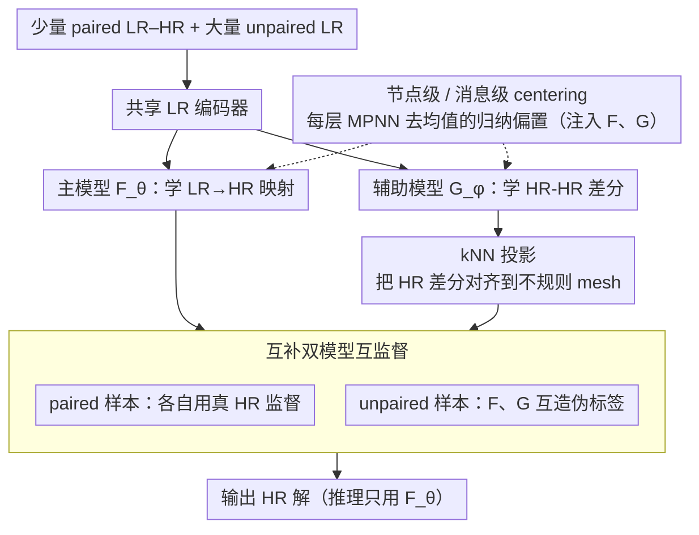

# Semi-Supervised Neural Super-Resolution for Mesh-Based Simulations

**会议**: ICML 2026  
**arXiv**: [2605.09284](https://arxiv.org/abs/2605.09284)  
**代码**: <https://github.com/jykim-git/SuperMeshNet.git>  
**领域**: 3D 视觉 / 物理仿真 / 图神经网络  
**关键词**: mesh 超分辨、半监督回归、互补学习、消息传递归纳偏置、PDE 仿真加速

## 一句话总结
SuperMeshNet 用两个互补 MPNN——主模型预测 LR→HR，辅助模型预测 LR-LR 对应的 HR-HR 差分——在无配对 HR 的样本上互相生成伪标签，并配合节点级 / 消息级 centering 两个轻量归纳偏置，使得 PDE mesh 超分仅用 10% HR 数据就能超过 100% HR 全监督基线，跨 6 种 MPNN 架构一致下降 RMSE。

## 研究背景与动机

**领域现状**：FEM、FVM 等基于 mesh 的 PDE 仿真在解的精度与计算成本之间被 mesh 大小直接控制，细网格精确但贵；神经网络超分辨就是想用便宜的 LR 仿真预测出 HR 解。已有工作大致两类：CNN-based（需要把不规则 mesh 插值到规则栅格，效率低）和 MPNN-based（直接吃图，但都要大量配对 HR 监督）。

**现有痛点**：HR 数据的获取本身就是想被超分辨规避的瓶颈——细网格仿真才贵——所以「全监督」其实是自相矛盾。已有无监督方案 PhySRNet 把 PDE 残差写进 loss，但只能在规则网格上做 finite difference；MAgNet 做 zero-shot 插值，预测误差远高于监督版本。

**核心矛盾**：HR 数据稀缺 vs MPNN 训练贪婪，而经典半监督回归方法（Mean Teacher、UCVME、TNNR）几乎都默认两个模型预测「同一个目标」，导致伪标签高度相关、互相强化错误，对 MPNN 超分场景不工作。

**本文目标**：(1) 第一次把半监督引入 mesh-based super-resolution，且要兼容任意 MPNN；(2) 设计一种「两模型预测不同但相关的目标」机制，让伪标签彼此互补、误差去相关；(3) 系统地总结对超分有用的 MPNN 归纳偏置。

**切入角度**：从物理角度，两个 HR 解都受同一 PDE 支配、仅参数 $\mu$ 不同，那么它们的差就刻画了系统对参数扰动的响应；如果有一个模型专门学这种差分，它给出的伪标签维度跟「直接预测 HR」是正交的，可以打破伪标签塌缩。

**核心 idea**：用主模型 $F_\theta$ 学 inter-resolution map $u_l \to u_h$，辅助模型 $G_\phi$ 学 intra-resolution difference $(u_l^r, u_l^s) \to (u_h^r - u_h^s)$，二者互为伪标签源，对 unpaired LR 做互补监督。

## 方法详解

### 整体框架
SuperMeshNet 要解决的是「HR 数据稀缺却又非要靠它监督」这个自相矛盾的局面，做法是把数据切成一小块 paired LR–HR 集 $\mathcal{D}_a=\{(u_l^q, u_h^q)\}_{q=1}^{N_h}$（$N_h \ll N$）和一大块 unpaired LR 集 $\mathcal{D}_b=\{u_l^q\}_{q=N_h+1}^{N}$，再让两个预测目标互不相同的 MPNN 在 unpaired 样本上互相造伪标签。其中 primary 模型 $F_\theta(u_l^q)=\hat{u}_h^q$ 学的是 LR→HR 这条 inter-resolution map、最终用于推理；auxiliary 模型 $G_\phi(u_l^r, u_l^s)=\hat{u}_h^{rs}$ 学的是「两个 LR 样本对应的 HR 解之差」、只在训练时充当互补监督源。两模型共享同一个 LR 编码器以省算力，主模型骨架是 SRGNN，并用 kNN-upsampler 与 latent-space upsampler 两条上采样路径融合。

### 关键设计

**1. 互补双模型互监督：让伪标签去相关而非塌缩**

经典半监督回归（Mean Teacher、UCVME）的痛点是两个同构网络预测同一目标，伪标签很快收敛到同一个 mode 后误差互相强化，即 confirmation bias。本文从物理上拆开这个耦合：两个 HR 解都受同一 PDE 支配、只是参数 $\mu$ 不同，于是它们的差分刻画了「系统对参数扰动的响应」，与「直接预测 HR」是正交的学习维度。监督端分别用 $\alpha,\beta$ 两个 paired 样本训练 $\mathcal{L}_{F,sup} = \ell(\hat{u}_h^\alpha, u_h^\alpha) + \ell(\hat{u}_h^\beta, u_h^\beta)$ 与 $\mathcal{L}_{G,sup} = \ell(\hat{u}_h^{\alpha\beta}, u_h^\alpha - \text{kNN}(u_h^\beta;P_h^\beta\to P_h^\alpha))$；无监督端则在 unpaired 样本 $\gamma$ 上让两模型互造伪标签——$\mathcal{L}_{F,unsup}$ 拿 $\hat{u}_h^{\gamma\alpha} + u_h^\alpha$（辅助模型的差分预测加上已知 HR）当伪标签督导 $F_\theta(u_l^\gamma)$，$\mathcal{L}_{G,unsup}$ 拿 $\hat{u}_h^\gamma - u_h^\alpha$（主模型预测减去已知 HR）当伪标签督导 $G_\phi(u_l^\gamma, u_l^\alpha)$。因为两条预测落在不同的空间（HR 解 vs HR 差分），误差天然去相关，还顺带注入了对参数敏感性的物理先验。

**2. kNN 投影：让 HR 差分在两套不规则 mesh 上有定义**

辅助模型要算 $u_h^r - u_h^s$，但不同参数 $\mu$ 对应的几何不同，两者的节点位置 $P_h^r \ne P_h^s$，根本无法逐点相减。本文用 kNN 距离加权把一方投到另一方的节点坐标上，写作 $\text{kNN}(u_h^s; P_h^s \to P_h^r)$ 后再做减法；上面所有 unsupervised loss 里的差分项都要按对应方向先做这步投影。之所以选 kNN 而非学一个对齐网络，是因为 mesh-based 仿真与 CNN/规则网格最大的区别就是结构天生不规则，kNN 插值是 PointNet 风格的可微、轻量方案，零额外参数。

**3. 节点级 / 消息级 centering：一行代码的 MPNN 通用归纳偏置**

作者观察到超分主要依赖局部相对结构而非绝对均值，于是在每个 MPNN 层更新完 node embedding 后做一次去均值 $x_i \leftarrow x_i - \frac{1}{n}\sum_i x_i$；对显式聚合 message 的架构（如 MGN）再额外对聚合量做 $agg_i \leftarrow agg_i - \frac{1}{n}\sum_i agg_i$，相当于在中间表示里抹掉全局均值。这类似 BatchNorm 平滑 loss landscape，但只对「不依赖全局均值」的任务有益。它是 MPNN-agnostic 的：消融显示 GCN/SAGE/GAT/GTR/GIN/MGN 六种架构 RMSE 全部一致下降（MGN 从 0.0269 降到 0.0226）。

### 一个完整示例
取一个训练 batch，含两个 paired LR 样本 $\alpha,\beta$（HR 已知）和一个 unpaired LR 样本 $\gamma$（HR 未知）。第一步走监督：$F_\theta$ 分别预测 $\hat{u}_h^\alpha,\hat{u}_h^\beta$ 直接和真 HR 比；$G_\phi$ 预测 $\hat{u}_h^{\alpha\beta}$ 去拟合 $u_h^\alpha$ 与（kNN 投影后的）$u_h^\beta$ 之差。第二步走互监督：在 $\gamma$ 上，$G_\phi(u_l^\gamma,u_l^\alpha)$ 给出差分预测 $\hat{u}_h^{\gamma\alpha}$，加上已知的 $u_h^\alpha$ 就合成了 $\gamma$ 的 HR 伪标签去督导 $F_\theta(u_l^\gamma)$；反过来 $F_\theta(u_l^\gamma)$ 给出 $\hat{u}_h^\gamma$，减去 $u_h^\alpha$ 就合成了差分伪标签去督导 $G_\phi(u_l^\gamma,u_l^\alpha)$。一个 batch 内两模型各被真标签和对方造的伪标签同时拉一把，unpaired 样本因此被「免费」用上。

### 损失函数 / 训练策略
总损失为 $\mathcal{L}_F = \mathcal{L}_{F,sup} + \mathcal{L}_{F,unsup}$ 与 $\mathcal{L}_G = \mathcal{L}_{G,sup} + \mathcal{L}_{G,unsup}$，两组权重均取 1、未做任何调度。当同时输出多个物理量（velocity + pressure）时改用加权 MSE 来抵消量级差异：时间依赖 PDE 数据集用 99:1，真实几何数据集用 $10^{-8}:1$。优化器 Adam（$\text{lr}=10^{-3}$）配 PyTorch AMP，硬件为 i9-10920X + RTX A6000。

## 实验关键数据

### 主实验

Dataset 1（线性弹性 von Mises stress，FEM），RMSE↓ 跨 6 MPNN：

| 方法 | $N_h$, $N$ | GCN | SAGE | GAT | GTR | GIN | MGN |
|------|------------|-----|------|-----|-----|-----|-----|
| 全监督（无 bias） | 20, 20 | 0.0874 | 0.0876 | 0.0826 | 0.0758 | 0.0819 | 0.0655 |
| 全监督（无 bias） | 200, 200 | 0.0575 | 0.0544 | 0.0512 | 0.0450 | 0.0381 | 0.0228 |
| SuperMeshNet-O（无 bias） | 20, 200 | 0.0613 | 0.0589 | 0.0544 | 0.0451 | 0.0404 | 0.0269 |
| **SuperMeshNet（含 bias）** | 20, 200 | **0.0431** | **0.0450** | **0.0457** | **0.0385** | **0.0277** | **0.0226** |

现实几何（motorbike + 骑手 incompressible Navier-Stokes）阻力 / 升力系数（相对误差）：

| 方法 | $N_h$,$N$ | Drag（rel. err） | Lift（rel. err） |
|------|-----------|--------------------|--------------------|
| Ground truth HR | — | 0.3724 | 0.0368 |
| SuperMeshNet | 40, 200 | 0.3778 (0.014) | 0.0433 (0.177) |
| 全监督 | 200, 200 | 0.3653 (0.019) | 0.0380 (0.033) |

### 消融实验

Dataset 1, MGN，$N_h=20, N=200$，归纳偏置消融：

| 配置 | RMSE | 说明 |
|------|------|------|
| 无 bias (O) | 0.0269 | 仅互补学习 |
| + 节点 centering (N) | 0.0237 | 单独 N 已能拿到大头 |
| + 消息 centering (M) | 0.0247 | M 单独略弱于 N |
| N + M | **0.0226** | 两者叠加最佳 |

半监督回归基线（Dataset 1, $N_h=20, N=200$, MGN）：

| 方法 | RMSE | 训练时间 (s) |
|------|------|----------------|
| Mean-Teacher | 0.0325 | 693.84 |
| TNNR | 0.0624 | 477.48 |
| UCVME | 0.0293 | 1122.62 |
| SuperMeshNet-O | 0.0269 | 503.2 |
| **SuperMeshNet** | **0.0226** | **421** |

### 关键发现
- 只用 10% HR（20 vs 200）即超过 100% HR 全监督的 baseline——HR 节省 90% 是核心实用结论；尤其在细 mesh 上数据生成成本随分辨率指数级上升，整体训练总成本因此被反转为净降。
- 互补学习不仅 RMSE 最低，训练时间还最短（421 s vs UCVME 1122 s），原因是其他半监督方法两模型同构、需要重复运算同一目标；本文复用了共享编码器。
- 在时间依赖 PDE 数据集 2 上，HR 涡量与 LR 涡量差异巨大（128 倍节点比），全监督 fail，而 SuperMeshNet 仍能复现 HR——证明 $G_\phi$ 提供的 HR-HR 关系比纯 LR→HR 映射更具学习信号。

## 亮点与洞察
- 「两个模型预测不同物理量但通过公共 HR 量耦合」是把 co-training 与 PDE 物理对称性结合的优雅范式，可以推广到任何带有「参数化解族」结构的问题（气候、生物力学、晶格仿真）。
- 节点 / 消息 centering 这种通用归纳偏置只是加一行代码，却让 6 种 MPNN 架构均匀提升，说明对「相对结构」任务做去均值是非常便宜的稳健 trick。
- 实验设计中专门强调「主要价值在 HR 数据节省 90%，而非 RMSE 绝对降」，态度务实——这是 mesh-based 超分领域真正卡脖子的瓶颈。

## 局限与展望
- 互补学习训练时间比全监督更长（但比同类半监督短），文章承认要在 mesh 足够细时才能因 HR 数据生成成本爆炸而拿到净收益；中小规模 mesh 上不一定划算。
- 训练稳定性的理论保证缺失，只在附录里给出经验研究；当辅助模型 $G_\phi$ 自身误差大时，理论上仍可能出现互相放大；强非线性或带 bifurcation 的 PDE 上预期会失效。
- HR 样本如何挑也很重要（作者在附录 I.12 给出经验探索），但当前只是随机采样；一个 active learning 风格的 HR 采样策略大概率能进一步压低 $N_h$。

## 相关工作与启发
- **vs PhySRNet (Arora, 2022)**: 完全无监督但需要 finite-difference，只适规则栅格；本文需要少量 HR 但能处理不规则 mesh。
- **vs MAgNet (Boussif et al., 2022)**: zero-shot MPNN 插值，预测误差远高于监督版；本文用极少 HR 显著拉低误差。
- **vs UCVME / Mean Teacher / TNNR**: 这些半监督回归方法用「同目标双网络」，伪标签塌缩；本文「异目标双网络」从根本上去相关。

## 评分
- 新颖性: ⭐⭐⭐⭐ 把「双模型异目标 + 物理差分」组合用在 mesh 超分上是真正首创，且适配 MPNN。
- 实验充分度: ⭐⭐⭐⭐⭐ 6 种 MPNN × 3 FEM 数据集 + 3 CFD 数据集 + 半监督基线 + 归纳偏置消融，覆盖非常详尽。
- 写作质量: ⭐⭐⭐⭐ 物理 / 数学符号严谨，pipeline 图清晰；附录非常丰富。
- 价值: ⭐⭐⭐⭐ HR 节省 90% 直接对应工业 CAE 与气候仿真的真实痛点，且开源代码可即用。

<!-- RELATED:START -->

## 相关论文

- [\[NeurIPS 2025\] Spiking Meets Attention: Efficient Remote Sensing Image Super-Resolution with Attention Spiking Neural Networks](../../NeurIPS2025/image_restoration/spiking_meets_attention_efficient_remote_sensing_image_super-resolution_with_att.md)
- [\[ICML 2026\] Coloring the Noise: Adversarial Sobolev Alignment for Faithful Image Super Resolution](coloring_the_noise_adversarial_sobolev_alignment_for_faithful_image_super_resolu.md)
- [\[ICML 2026\] PODiff: Latent Diffusion in Proper Orthogonal Decomposition Space for Scientific Super-Resolution](podiff_latent_diffusion_in_proper_orthogonal_decomposition_space_for_scientific_.md)
- [\[ICML 2026\] Phy-CoSF: Physics-Guided Continuous Spectral Fields Reconstruction and Super-Resolution for Snapshot Compressive Imaging](phy-cosf_physics-guided_continuous_spectral_fields_reconstruction_and_super-reso.md)
- [\[CVPR 2025\] EchoMimicV2: Towards Striking, Simplified, and Semi-Body Human Animation](../../CVPR2025/image_restoration/echomimicv2_towards_striking_simplified_and_semi-body_human_animation.md)

<!-- RELATED:END -->
