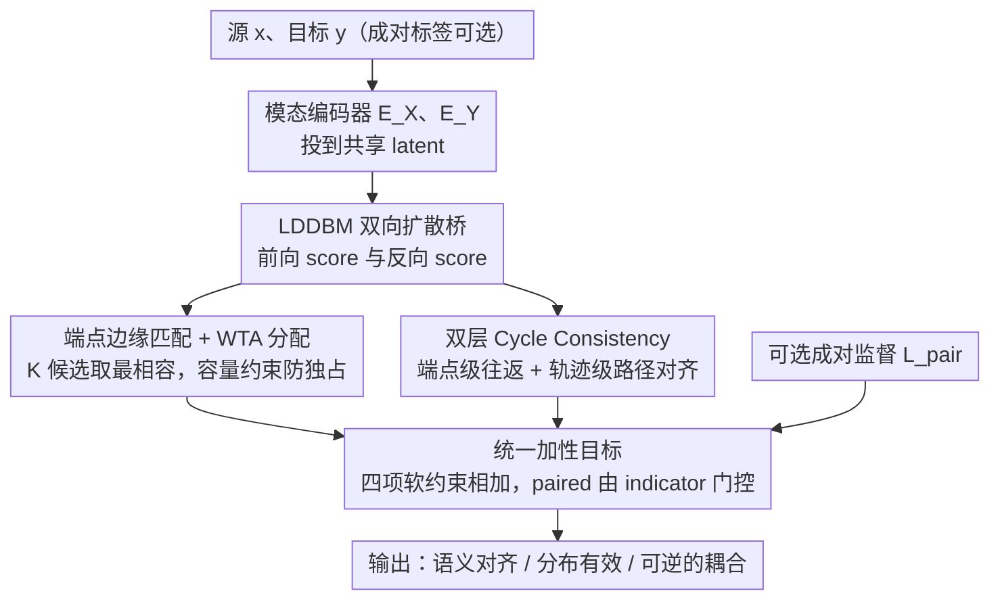

# Structured Diffusion Bridges: Inductive Bias for Denoising Diffusion Bridges

**会议**: ICML 2026  
**arXiv**: [2605.02973](https://arxiv.org/abs/2605.02973)  
**代码**: 无  
**领域**: 扩散模型 / 模态翻译 / 图像超分 / 无成对学习  
**关键词**: Latent diffusion bridge、Marginal matching、Cycle consistency、Winner-takes-all、半成对训练

## 一句话总结
SDB 把模态翻译重写为"在所有满足边缘约束的耦合集合 $\mathcal{P}$ 中挑一个"，在 LDDBM 之上叠加边缘匹配（WTA + 容量约束）+ 端点级 + 轨迹级双层 cycle consistency，把成对监督仅作为可选启发式之一，从而在零成对、半成对、全成对三种监督预算下都能跑，并且全成对时也比 paired-only 基线更好（FFHQ→CelebA-HQ PSNR 从 25.6 提到 25.9）。

## 研究背景与动机

**领域现状**：Diffusion bridge（DDBM、LDDBM 等）已成为分布间翻译的强大范式，LDDBM 通过共享潜空间解决端点维度不一致问题，在图像超分、shape↔voxel 等任务上达到 SOTA。但几乎所有 bridge 方法都要求**全成对监督**——训练样本必须是 $(x,y)$ 配对的 LR-HR、多视角图-体素等。

**现有痛点**：成对数据隐式承担了三种独立约束——(i) 语义对应（源→目标的正确映射）、(ii) 分布有效性（输出落在目标边缘上）、(iii) 几何一致性（可逆性）。让一个 paired loss 同时承担三件事是次优的：哪怕数据够多，模型也可能最小化重建误差但偏离真实流形。更糟糕的是，很多场景成对数据稀缺甚至不存在（医学影像、艺术风格转换），让 bridge 方法寸步难行。

**核心矛盾**：仅给定边缘 $p_\mathcal{X}, p_\mathcal{Y}$ 时，可行联合分布集合 $\mathcal{P}=\{p(x,y)|p(x)=p_\mathcal{X},p(y)=p_\mathcal{Y}\}$ 有**无数个**，边缘信息本身不能唯一确定 coupling；现有方法用"成对样本"做 Doob h-transform 的隐式约束，相当于用数据穷举去选一个 $p$，既低效又脆弱。

**本文目标**：(i) 把模态翻译显式重述为"在 $\mathcal{P}$ 中选耦合"的几何问题；(ii) 引入可组合的结构性约束（边缘匹配 + cycle consistency），让 paired loss 退化为众多启发式之一；(iii) 在 $\rho\in\{0,0.5,1\}$ 三种成对比例下保持优雅退化；(iv) 即使全成对也能涨点。

**切入角度**：经典 unpaired translation（CycleGAN、CUT）已用过 cycle consistency；Schrödinger bridge 路线（UNSB）则用对抗 + 熵正则。作者把这两条经验**移植到 latent diffusion bridge 框架**——既享受 LDDBM 维度无关的便利，又用扩散过程暴露的中间状态 $z_t$ 让 cycle consistency 能在**整条轨迹**而不只是端点上做约束。

**核心 idea**：把"训练 diffusion bridge"重构为多个独立启发式的加权组合：边缘匹配（确保终态落在目标 marginal）+ 端点级 cycle（$y\to x\to\hat y\approx y$）+ 轨迹级 cycle（前向轨迹与反向轨迹在 $t$ 与 $T-t$ 时刻潜状态一致）+ 可选 paired 监督。

## 方法详解

### 整体框架
SDB 要解决的是"只给定两侧边缘 $p_\mathcal{X}, p_\mathcal{Y}$、成对标签可有可无时，如何在无穷多个可行耦合集合 $\mathcal{P}$ 里挑出一个语义对、分布有效、几何可逆的 coupling"。它沿用 LDDBM 的双向扩散桥骨架：模态特定编码器 $E_\mathcal{X}, E_\mathcal{Y}$ 把 $x, y$ 投到共享 latent，桥在 latent 上学前向 score $s_{\mathcal{X}\to\mathcal{Y}}(z,t)$ 与反向 score $s_{\mathcal{Y}\to\mathcal{X}}(z,t)$；关键改动是每个训练 step 同时优化四个可独立增删的几何约束的加性组合，把原本压在成对数据身上的三件事（对应 / 有效 / 可逆）拆给不同启发式承担，因而 $\rho=0$ 纯启发式也能跑、$\rho>0$ 时 paired 项只在成对子集上追加。

### 关键设计

**1. 端点边缘匹配 + WTA 分配：在无成对监督下挑出"最相容"的耦合**

无 / 半成对设置最大的退化风险是——随机把任意 $x$ 配任意 $y$ 都能把 DSM 损失压低，于是模型学到的是混在一起的 mode mixing 耦合而非真实对应。SDB 的做法是从两侧独立采样 $x\sim p_\mathcal{X}, y\sim p_\mathcal{Y}$，对每个 target $z_0=E_\mathcal{X}(x)$ 抽 $K$ 个条件候选 $\{y^{(k)}\}_{k=1}^K\sim p_\mathcal{Y}$，逐个算去噪 score matching 损失 $\mathcal{L}_{DSM}=\mathbb{E}\|s_\theta(z_t,t|y)-\nabla_{z_t}\log q(z_t|z_0)\|_2^2$，再只对 $k^\star=\arg\min_k \mathcal{L}_{DSM}(z_0,y^{(k)})$ 这个"当前 bridge 最能解释 target 的候选"反传。这本质是一个经典 winner-takes-all 优化启发式：它不保证 identifiability，只是把局部最相容的配对挑出来、缩小耦合的不确定性，从而把终态拉回目标边缘 $p_\mathcal{X}$。为了避免 WTA 退化成"少数低信息量的 $y$ 被反复选中去解释所有 $x$"（condition dominance），再加一条容量约束 $C_y=2$：每个候选 $y^{(i)}$ 在一个 epoch 内最多被选 2 次，强制选择面铺开。

**2. 双层 Cycle Consistency：端点级 + 轨迹级一起逼近可逆**

边缘对齐只管"落在目标分布上"，管不了信息是否可逆，模型仍可能 mode dropping。SDB 用 cycle 一致性补这一刀，且做了两层。端点级沿用 CycleGAN 思路，设前向 stochastic flow $\Phi_{\mathcal{X}\to\mathcal{Y}}$、反向 $\Phi_{\mathcal{Y}\to\mathcal{X}}$，约束往返回到原点 $\mathcal{L}_{cycle}^{end}=\mathbb{E}\|\hat z_0-z_0\|_2^2$，其中 $\hat z_0=\Phi_{\mathcal{Y}\to\mathcal{X}}\circ\Phi_{\mathcal{X}\to\mathcal{Y}}(z_0)$。但扩散桥本身是随机过程，光约束端点不够，所以又加轨迹级：把前向轨迹 $\{z_t^{X\to Y}\}$ 与反向轨迹 $\{z_{T-t}^{Y\to X}\}$ 在对应时刻配对，求 $\mathcal{L}_{cycle}^{traj}=\mathbb{E}[w(t)\|z_t^{X\to Y}-z_{T-t}^{Y\to X}\|_2^2]$，权重 $w(t)=1/(\sigma_t^2+\epsilon)$ 对不同时刻的尺度差异做归一化。它强制"前后向走的是同一条隧道"，等价于约束整条 SDE 路径的对称性，是一种 trajectory-level identifiability 正则。两层组合让可逆性既受粗粒度（终点）也受细粒度（路径）约束，实证里轨迹项把 unpaired 内容准确率从 16% 拉到 87%。

**3. 统一加性目标：把 paired 监督降级为四个并列启发式之一**

最后把上述约束加上可选的成对监督，统一成一个加性目标 $\mathcal{L}_{total}=\mathcal{L}_{DSM}+\lambda_{end}\mathcal{L}_{cycle}^{end}+\lambda_{traj}\mathcal{L}_{cycle}^{traj}+\lambda_{pair}\mathbf{1}_{(x,y)\in\mathcal{D}_{pair}}\mathcal{L}_{pair}$（公式 10），paired 项靠 indicator $\mathbf{1}_{(x,y)\in\mathcal{D}_{pair}}$ 只在成对子集上激活，所有 $\lambda=1$、未做精细调权（作者没观察到调权有显著收益）。几何上看，这种"加性组合 + indicator gating"相当于在可行耦合集 $\mathcal{P}$ 里叠加多个软约束面，把可行集逐步压缩到偏好 reversible、condition-preserving 的那块；工程上看，indicator 让 dataloader 不必区分成对/不成对样本，同一份代码就能在 $\rho\in[0,1]$ 任意预算下训练并优雅退化。$K$ 个 WTA 候选、容量 $C_y=2$ 都按上文配置，双向桥需同步训练（cycle 项依赖反向桥），半成对时 paired 子集大小由 $\rho$ 决定而总端点样本量固定，只改变标签的可用比例。

## 实验关键数据

### 主实验
FFHQ→CelebA-HQ Super-Resolution（Zero-shot SR，$\rho$ 扫描）：

| 方法 | $\rho=0$ | $\rho=0.5$ | $\rho=1.0$ |
|---|---|---|---|
| **SDB PSNR↑** | **19.0 ± 0.6** | **25.2 ± 0.3** | **25.9 ± 0.3** |
| DiWa PSNR | n/a | 22.6 ± 0.2 | 23.3 |
| LDDBM PSNR | n/a | 24.9 ± 0.3 | 25.6 ± 0.4 |
| SDB SSIM↑ | 0.54 | 0.68 | 0.69 |
| SDB LPIPS↓ | 0.37 | 0.32 | 0.31 |

合成 benchmark 上结构约束对耦合质量的影响（$\rho=0$ 切片）：

| 方法 | SWD ↓ | MMD² ↓ | Content Acc. ↑ | Cycle MSE ↓ |
|---|---|---|---|---|
| Marginal matching only | 0.02021 | $-1.03\times10^{-4}$ | 0.162 | 0.972 |
| + Endpoint cycle | 0.01891 | $-1.69\times10^{-4}$ | 0.662 | 0.831 |
| + Trajectory cycle | 0.01968 | $-1.11\times10^{-4}$ | **0.868** | **0.680** |

### 消融实验

| 配置 ($\rho$) | 关键变化 | 结论 |
|---|---|---|
| MM only ($\rho=0$) | Content Acc 0.162 | 边缘匹配能对齐分布但不学耦合 |
| + Endpoint cycle | Acc 0.662 | 端点可逆性显著恢复语义对应 |
| + Trajectory cycle | Acc 0.868 | 轨迹约束进一步压缩耦合歧义 |
| Paired-only ($\rho=0.5$) | Acc 0.641 | 半成对 paired loss 不如 SDB 启发式组合 |
| **SDB Semi-paired ($\rho=0.5$)** | **Acc 0.955** | 启发式 + paired 补充协同最强 |
| Paired-only ($\rho=1.0$) | Acc 0.887 | 全成对时纯 paired 也不及结构约束加持 |
| **SDB ($\rho=1.0$)** | **Acc 0.965** | 全成对 + 结构约束同时涨点 |

### 关键发现
- 半成对 SDB 在 $\rho=0.5$ 已经达到 Paired-only ($\rho=1.0$) 的水平甚至超过——说明结构约束确实把"成对数据所承担的对应/有效/可逆三件事"中的两件接管过去。
- 即使 $\rho=1$ 全成对，SDB 仍优于纯 paired baseline（PSNR 25.9 vs 25.6, Content Acc 0.965 vs 0.887），证实结构约束是**互补**而非替代。
- $\rho=0$ 时纯启发式 PSNR 19.0 仍然有意义（超过随机基线），首次让 LDDBM 框架在零成对设定下可训。
- Multi-view→3D Voxel（ShapeNet）实验中，SDB 在 $\rho\in\{0.5,1.0\}$ 全面胜过 EDM 与 LDDBM，且在 $\rho=0$ 时仍可训（baseline 直接不可用）。

## 亮点与洞察
- **把训练目标重塑为"启发式组合"的视角**：以前 bridge 方法都把目标当作整体优化，作者把它拆成 4 个可独立增删的几何约束，让 ablation 真正"几何上可解释"——每个被关掉的项对应放松一类可逆性。
- **轨迹级 cycle consistency**：在 stochastic 扩散框架里做轨迹一致性，比 CycleGAN 的端点 cycle 严格得多，等价于约束**整条 SDE 路径的对称性**，是把 OT/Schrödinger bridge 的可逆性直觉嫁接到 DDBM 的精彩一步。
- **WTA + 容量约束**：是"无对应监督下选耦合"的小巧实现，比对抗训练或 InfoNCE 都简单，几乎是零成本插件，但实证带来巨大 Content Acc 涨幅。
- **优雅退化**：在三种成对预算下同一份目标都跑得通，让 SDB 成为现实场景中真正可用的统一框架——许多医学/科学影像就是部分成对，少有 0/1 极端。

## 局限与展望
- 全部 $\lambda=1$ 看似优雅，但在更困难的高分辨率/3D 任务上可能需要调权；论文未给出系统调权研究。
- WTA 候选数 $K$ 和容量 $C_y=2$ 是经验值，对计算预算敏感；自适应 $K$ 是自然延伸。
- Cycle 一致性需要双向桥同步训练，参数量与训练成本翻倍。
- 评测局限在图像超分、3D voxel 翻译等成熟基准；对真正"语义未对齐"的开放域翻译（如 sketch↔photo 跨域）仍待验证。
- 与 OT-style 工作的联系还可深挖，例如把轨迹 cycle 与 Schrödinger bridge 的 marginals + cost 结构对齐做理论化。

## 相关工作与启发
- **vs LDDBM (Berman 2026)**：直接基座；SDB 在其上加结构约束并把 paired 降级为可选项。
- **vs DDBM (Zhou 2024)**：用 Doob h-transform 隐式靠成对数据约束 bridge，SDB 把这种约束**显式化 + 可分解**。
- **vs CycleGAN / CUT**：他们用确定性端点 cycle；SDB 把 cycle 推广到 stochastic 扩散轨迹。
- **vs UNSB (Schrödinger bridge 对抗版)**：UNSB 用 GAN 训，常见 mode collapse；SDB 走 score matching + cycle，训练更稳。
- **vs LADB**：LADB 通过复用预训练 source latent diffusion 减少成对需求，SDB 用一阶启发式直接在 bridge 里加约束，路径正交且可组合。

## 评分
- 新颖性: ⭐⭐⭐⭐ 把 cycle consistency 推广到 stochastic 扩散轨迹是优雅创新，整体框架是漂亮的"组合"
- 实验充分度: ⭐⭐⭐⭐ 合成 + 真实 SR + 3D voxel 三类任务 + 三种 $\rho$ + 完整 ablation 矩阵
- 写作质量: ⭐⭐⭐⭐⭐ 把"翻译 = 在 $\mathcal{P}$ 中挑耦合"这一几何 framing 写得极清晰
- 价值: ⭐⭐⭐⭐ 解锁 LDDBM 的零/半成对应用场景，对成对数据稀缺领域价值显著

<!-- RELATED:START -->

## 相关论文

- [\[CVPR 2026\] Bi-Bridge: Bidirectional Diffusion Bridges for Low-Light Image Enhancement](../../CVPR2026/image_restoration/bi-bridge_bidirectional_diffusion_bridges_for_low-light_image_enhancement.md)
- [\[ICML 2026\] Early Decisions Matter: Proximity Bias and Initial Trajectory Shaping in Non-Autoregressive Diffusion Language Models](early_decisions_matter_proximity_bias_and_initial_trajectory_shaping_in_non-auto.md)
- [\[ICML 2026\] Consistent Diffusion Language Models](consistent_diffusion_language_models.md)
- [\[ICML 2026\] Coevolutionary Continuous Discrete Diffusion: Make Your Diffusion Language Model a Latent Reasoner](coevolutionary_continuous_discrete_diffusion_make_your_diffusion_language_model_.md)
- [\[ICML 2026\] Plan for Speed: Dilated Scheduling for Masked Diffusion Language Models](plan_for_speed_dilated_scheduling_for_masked_diffusion_language_models.md)

<!-- RELATED:END -->
