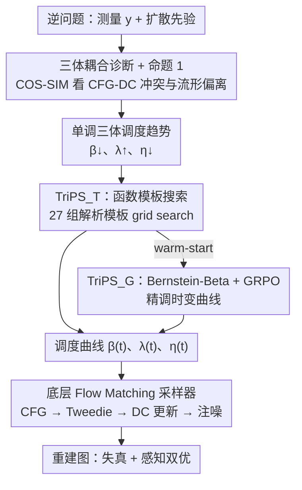

# Triadic Dynamics Aware Diffusion Posterior Sampling for Inverse Problems: Optimizing Guidance and Stochasticity Schedules

**会议**: ICML 2026  
**arXiv**: [2605.26470](https://arxiv.org/abs/2605.26470)  
**代码**: 待确认  
**领域**: 图像恢复 / 扩散后验采样 / 逆问题  
**关键词**: 扩散后验采样, CFG 调度, 随机性正则化, GRPO, 逆问题

## 一句话总结
本文把扩散后验采样中长期被当作常数的三个力——数据一致性 (DC) 引导、Classifier-Free Guidance (CFG)、随机性 (stochasticity)——首次系统地视为一个**耦合的时变三体系统**，理论 + 实证证明早期 CFG 与 DC 方向冲突、而随机性能把轨迹拉回高概率流形，据此提出"DC↓、CFG↑、η↓"的单调三体调度趋势，并用"模板搜索 + GRPO 强化学习"两套方法找最优曲线，在 FFHQ / DIV2K 的超分与去模糊上同时刷新失真和感知指标。

## 研究背景与动机

**领域现状**：扩散/Flow Matching 模型已成为成像逆问题（超分、去模糊、修复等）的主流先验。一个标准的后验采样器在每个时间步会做三件事：(1) 用 DC 引导把 $\hat{x}_{0|t}$ 拉向满足 $y=\mathcal{A}x_0+n$ 的测量子空间；(2) 用 CFG 把 score 朝文本条件方向外推；(3) 注入高斯噪声 $\eta(t)\epsilon$ 维持随机性。三个力分别由标量 $\beta(t)$、$\lambda(t)$、$\eta(t)$ 控制。

**现有痛点**：几乎所有现有工作都把这三个标量当成**时间无关的常数或只局部调整**。FlowChef 直接令 $\lambda(t)=\lambda$、$\beta(t)=\beta$、$\eta(t)=0$；PiGDM、Fast Samplers 只调 $\beta(t)$ 防过饱和；ReSample/DDPG/FlowDPS 联合调 $\beta,\eta$ 但没碰 $\lambda$。CFG 在文生图里早被证明随时间调节能提升质量，但在逆问题语境里几乎没人探索。

**核心矛盾**：作者认为这三个力**不是独立可分别调**的，它们在同一条采样轨迹上互相干扰：CFG 想把样本推向语义流形，DC 想把样本拉向测量流形，二者方向天生不一致；而随机性能否补救这种冲突，过去没有定量刻画。结果就是"三个力各自最优 ≠ 三个力一起最优"，留下大量性能空间。

**本文目标**：(i) 把三体耦合的方向冲突写成可计算的几何量；(ii) 推出一个**普适的、由数据驱动验证的调度趋势**；(iii) 给出两套实用的曲线优化框架，覆盖"想要可解释 baseline"和"想榨干性能"两类需求。

**切入角度**：把后验采样改写成**时变最优控制问题**，状态是 $x_t$，控制是 $(\beta(t),\lambda(t),\eta(t))$，目标是最大化感知-失真复合奖励。一旦控制是时变的，就可以借助一阶导数分析（命题 1）和余弦相似度可视化看到三力方向之间的耦合。

**核心 idea**：早期高噪声阶段必须"强 DC + 弱 CFG + 强随机性"以建立全局结构、压制 CFG-DC 冲突、把轨迹拉回高概率区；晚期低噪声阶段应"弱 DC + 强 CFG + 弱随机性"以细化语义、避免噪声泄漏，由此凝练成**单调三体调度趋势** $\beta(t)\downarrow,\lambda(t)\uparrow,\eta(t)\downarrow$。

## 方法详解

### 整体框架
TriPS 的骨架是一个标准的 Flow Matching 后验采样器（基于 SD3.5-M 或 SD1.5），但把 $\beta,\lambda,\eta$ 从常数提升为可学习/可搜索的时变函数。算法上分两层：

1. **底层 sampler**：在每个时间步先按式 $v_t(x_t)=v_\theta(x_t,\varnothing)+\lambda(t)(v_\theta(x_t,c)-v_\theta(x_t,\varnothing))$ 算 CFG 加成后的速度场，用 Flow Tweedie 公式得到 $\hat{x}_{0|t}$ 与 $\hat{x}_{1|t}$，再做一次 DC 梯度更新 $\tilde{x}_{0|t}=\hat{x}_{0|t}-\beta(t)\nabla\mathcal{L}(\mathcal{A}\hat{x}_{0|t},y)$（DC loss 用 Back-Projection 与 Least-Square 的混合形式），最后用 $\tilde{x}_{1|t}=\sqrt{1-\eta^2(t)}\hat{x}_{1|t}+\eta(t)\epsilon$ 注入随机性，Euler 步进到 $x_{t+\Delta t}$。

2. **上层调度优化器**：两个互补范式产生 $(\beta(t),\lambda(t),\eta(t))$ 曲线——$\text{TriPS}_\text{T}$ 用解析模板族做粗搜索，$\text{TriPS}_\text{G}$ 用 GRPO 强化学习做精细微调，且 $\text{TriPS}_\text{T}$ 作为 $\text{TriPS}_\text{G}$ 的 warm-start。

为了量化三力耦合，作者定义两类**余弦相似度可视化诊断量**：$\text{COS-SIM}_1(x_t)=\langle \tilde{b}_\text{dc},\tilde{b}_\text{cfg}\rangle/(\|\tilde{b}_\text{dc}\|\|\tilde{b}_\text{cfg}\|)$ 衡量 DC 与 CFG 的方向冲突；$\text{COS-SIM}_2(x_t)=\langle b_\text{det},\nabla_{x_t}\log p_t(x_t)\rangle/(\cdots)$ 衡量总漂移与无条件分数的对齐度。实证发现：早期 $t\simeq 1$ 时 $\text{COS-SIM}_1$ 显著为负（CFG 与 DC 对着干），CFG 越大冲突越严重，对应残差范数 $\mathcal{R}(\hat{x}_{0|t})=\|y-\mathcal{A}\hat{x}_{0|t}\|^2$ 下降速度越慢；增大 $\beta,\lambda$ 都让 $\text{COS-SIM}_2$ 下降（轨迹偏离流形），唯独增大 $\eta$ 能把 $\text{COS-SIM}_2$ 拉回正方向。这就是"三体调度趋势"的实证依据。

### 关键设计

**1. 三体耦合诊断 + 命题 1：把"CFG 拖累 DC"变成可监测的标量信号**

以往工作只给经验调度，没人解释为什么 CFG 不能从头开足、为什么需要噪声把轨迹"喂回"流形。本文把下一步期望残差范数对 CFG 标度求一阶导，得到 $\partial_{\lambda(t)}\mathbb{E}[\mathcal{R}(\hat{x}_{0|t+\Delta t})|x_t]=-\Delta t\langle\tilde{b}_\text{dc},\tilde{b}_\text{cfg}\rangle+o(\Delta t)$：当 DC 漂移与 CFG 漂移的内积为负（早期普遍如此），增大 $\lambda$ 反而拖慢残差下降，这就给出"早期 $\lambda$ 必须低"的硬性数学证据。配合 $\text{COS-SIM}_2$ 的实证——增大 $\beta$ 或 $\lambda$ 都让总漂移偏离 score 方向，唯独增大 $\eta$ 能把 $b_\text{det}$ 拉回 score 方向——进一步推出"早期 $\eta$ 必须高、$\beta$ 必须高"。三个结论拼在一起，让三体趋势 $\beta\downarrow,\lambda\uparrow,\eta\downarrow$ 不再是炼丹直觉，而是数学（命题 1）+ 几何（余弦相似度）的双向验证。

**2. $\text{TriPS}_\text{T}$：函数模板搜索，用最少自由度产出可解释 baseline**

逐时间步独立调三个标量是高维优化，而采样器又没有梯度，直接跑大规模数值优化既贵又不稳。$\text{TriPS}_\text{T}$ 把这个高维问题坍缩成低维模板选择：每条曲线只从三个解析函数族 $\mathcal{T}=\{\text{linear, exp, log}\}$ 里挑一个，方向强制满足三体单调趋势，幅值则用 $\lambda\in[1,6]$、$\eta\in[0,1]$、$\beta\in[\beta_\min^T,\beta_\max^T]$ 截断。于是每个任务的搜索空间只剩 $|\mathcal{T}|^3=27$ 个组合（外加幅值的小网格），在小校准集 $\mathcal{D}_\text{cal}$ 上以 PSNR 与 LPIPS 复合的多目标效用 $\mathcal{U}$ 做 grid search，取 $\tau^\star=\arg\max_\tau\mathcal{U}(\tau;\mathcal{D}_\text{cal})$ 即可。得到的曲线天然落在物理可行域里，既能当稳健的可解释 baseline，又能直接作为 GRPO 的 warm-start，省去强化学习冷启动期的崩溃风险。

**3. $\text{TriPS}_\text{G}$：Bernstein-Beta 参数化 + GRPO，把折中推到极限**

模板族装不下更复杂的时变曲线，所以 $\text{TriPS}_\text{G}$ 改用 $d$ 阶 Bernstein 多项式 $\tilde{s}(t)=\sum_{k=0}^d w_k^{(s)}B_{k,d}(t)$（$s\in\{\lambda,\beta,\eta\}$）表示每条曲线，系数 $w_k^{(s)}\sim\text{Beta}(a_k^{(s)},b_k^{(s)})$。这套参数化的精妙之处在于把"探索必须合法"塞进结构本身：Beta 样本天然落在 $(0,1)$，Bernstein 基又满足"和为 1"的单位分拆，二者叠加保证 $\tilde{s}(t)$ 必然在 $(0,1)$，再仿射映回物理区间 $[s_\min,s_\max]$，于是 RL 策略结构性地不会越界，比单纯加惩罚项稳定得多。策略 $\pi_\theta$ 的参数 $\theta=\{a_k^{(s)},b_k^{(s)}\}$ 用 GRPO 训练：每轮采 $G$ 组系数 $\{\mathbf{w}_i\}$，各自跑完整 sampler 得到重建图，按混合奖励 $R=w_\text{dist}R_\text{dist}+w_\text{perc}R_\text{perc}$（PSNR + LPIPS + CLIP-IQA+ + Q-Align，全部归一为单调递增）算组内标准化优势 $\hat{A}_i$，再用 PPO 风格的截断目标 $\max_\theta\mathbb{E}_i[\min(r_i\hat{A}_i,\text{clip}(r_i,1\pm\epsilon)\hat{A}_i)]-\beta_\text{KL}D_\text{KL}(\pi_\theta\|\pi_\text{ref})$ 更新。选 GRPO 是因为采样器对 $\theta$ 不可微、传统 actor-critic 跑不动，而 GRPO 既不需要 value network 也不需要可微 sampler，用组内标准化估基线恰好适配"重跑 sampler 才能拿到奖励"的设定；参考策略 $\pi_\text{ref}$ 直接初始化为 $\text{TriPS}_\text{T}$ 找出的 $\mathbf{S}_\text{T}$，既给 warm-start 又限制策略漂移。

### 损失函数 / 训练策略
$\text{TriPS}_\text{T}$ 阶段无梯度训练，只在小校准集上跑 grid search。$\text{TriPS}_\text{G}$ 阶段以 PSNR、LPIPS、CLIP-IQA+、Q-Align 的加权和为奖励，组大小 $G$、KL 系数 $\beta_\text{KL}$、PPO 截断 $\epsilon$ 等超参在附录 E.2 中给出；参考策略固定为 $\text{TriPS}_\text{T}$ 的最优曲线，既提供 warm-start 又限制策略漂移。

## 实验关键数据

### 主实验
FFHQ ($768^2$, 1000 张) + DIV2K ($768^2$, 800 张)，骨架 SD3.5-M，NFE=28，测量噪声 $\sigma_n=0.03$。

| 任务 / 数据集 | 指标 | FlowChef | FlowDPS | FLAIR | $\text{TriPS}_\text{T}$ | $\text{TriPS}_\text{G}$ |
|---|---|---|---|---|---|---|
| FFHQ SR×8 | PSNR↑ / LPIPS↓ | 27.53 / 0.147 | 27.92 / 0.120 | 28.88 / 0.123 | **29.03** / 0.113 | 28.55 / **0.107** |
| FFHQ Motion Deblur | PSNR↑ / FID↓ | 24.88 / 63.48 | 25.15 / 43.18 | 28.80 / 21.57 | **31.20** / 17.28 | **31.20** / **15.89** |
| FFHQ Gaussian Deblur | PSNR↑ / LPIPS↓ | 27.30 / 0.152 | 26.02 / 0.204 | 28.60 / 0.090 | **29.95** / 0.084 | 29.60 / **0.074** |
| DIV2K SR×8 | PSNR↑ / FID↓ | 22.08 / 47.47 | 22.14 / 35.18 | 22.90 / 41.23 | **23.05** / 31.80 | 22.78 / **27.84** |
| DIV2K Motion Deblur | PSNR↑ / LPIPS↓ | 19.62 / 0.366 | 19.88 / 0.322 | 23.90 / 0.129 | **26.29** / 0.066 | 26.19 / **0.066** |

$\text{TriPS}_\text{T}$ 失真指标普遍最强，$\text{TriPS}_\text{G}$ 感知指标普遍最强；运动去模糊上对 FLAIR 的 PSNR 提升超过 2 dB，KID / LPIPS 接近腰斩。

### 调度迁移与扩散骨架验证
| 设置 | 方法 | PSNR↑ | LPIPS↓ | KID↓ |
|---|---|---|---|---|
| FFHQ Gaussian Deblur（SR×8 上学到的调度直接迁移） | FLAIR | 27.74 | 0.109 | 0.012 |
| 同上 | $\text{TriPS}_\text{G}$ on SR×8 | **28.90** | **0.089** | 0.014 |
| FFHQ SR×12（同样跨退化迁移） | FLAIR | 27.51 | 0.148 | 0.017 |
| 同上 | $\text{TriPS}_\text{G}$ on SR×8 | **28.80** | **0.099** | **0.012** |

GRPO 学到的调度在没见过的退化算子上仍然碾压基线，说明三体趋势捕捉到的是与具体 $\mathcal{A}$ 弱相关的结构性规律。表 3 在 SD1.5 上对 PSLD/DDPG/P2L/TReg 也观察到一致优势。

### 关键发现
- **早期 CFG 与 DC 真的方向对立**：图 1 的 $\text{COS-SIM}_1$ 在 $t\simeq 1$ 处为负，$\lambda$ 越大负得越多；高 $\lambda$ 直接产生"虎纹幻觉"破坏测量一致性，命题 1 的导数公式给出对应的解析解释。
- **随机性是早期的隐藏正则化器**：图 2 显示提升 $\beta$ 或 $\lambda$ 单调降低 $\text{COS-SIM}_2$（远离流形），唯独提升 $\eta$ 能稳定地把总漂移拉回 score 方向；KID 实验也证明合适的早期噪声减小生成分布与真实分布的差距。
- **GRPO 比模板更狠但更脆**：在重感知指标的设定下 $\text{TriPS}_\text{G}$ 全面赢，但有时 PSNR 不如 $\text{TriPS}_\text{T}$，说明 RL 探索倾向于偏向奖励主导方向；Bernstein-Beta + KL 约束保证了它不会跑出物理可行域。

## 亮点与洞察
- **从"调一个参数"升级到"调控一条轨迹"**：本文最大的视角转变是把后验采样直接当时变最优控制看待，CFG-DC-stochasticity 三个标量的耦合一旦显式建模，单调三体趋势就几乎是必然结论，这一思想完全可以迁移到任何"多种引导力共同作用"的扩散控制场景（如人类反馈对齐、可控生成、视频后验等）。
- **Bernstein-Beta 参数化是把"硬约束"塞进 RL 的优雅技巧**：用基函数 partition of unity + 有界分布把可行域从奖励里挪到结构里，比单纯加大 KL/惩罚项稳定得多，这种"用参数化保证安全探索"的思路在任何 RL 调度场景都可复用。
- **诊断量先行的方法论**：先定义可量化的诊断（$\text{COS-SIM}_1$ 看冲突、$\text{COS-SIM}_2$ 看流形偏离），再用诊断结果反推调度趋势，最后给优化框架——这种"观测→定律→工程"的三段式比直接 NAS/RL 搜调度更让人信服，也更容易在新任务上复现。

## 局限与展望
- 三体趋势的"硬单调"约束（$\beta\downarrow,\lambda\uparrow,\eta\downarrow$）在某些极端退化（强非线性、过亮过暗）上未必最优，论文没讨论何时趋势会被打破。
- $\text{TriPS}_\text{G}$ 要重复跑完整 sampler 采奖励，训练成本随 group size $G$ 和 NFE 线性增长；附录里 NFE 调到 28，但若用大模型或高分辨率场景成本可能爆炸。
- 文本 prompt 用了固定模板（FFHQ 用 "A high quality photo of a face"，DIV2K 用 DAPE），CFG 调度对 prompt 质量的敏感性没有充分剖析，可能影响真实场景的可复现性。
- 跨退化迁移表现好，但只在 FFHQ 100 张子集上验证，跨数据域（自然图像→医学/卫星）的鲁棒性仍待考察。

## 相关工作与启发
- **vs FlowChef / FlowDPS**：他们把 $\beta,\lambda,\eta$ 当常数或只局部调，本文系统化为时变控制，性能提升的主要来源是早期"低 CFG + 高 stochasticity"组合。
- **vs FLAIR**：FLAIR 是当前最强 flow-matching baseline，在 PSNR 上有时和 $\text{TriPS}_\text{T}$ 接近，但在感知指标 (LPIPS / FID / KID) 上被 $\text{TriPS}_\text{G}$ 明显甩开，差距主要来自 GRPO 调出来的非平凡时变曲线。
- **vs Limited Interval CFG (生成任务)**：那篇在文生图里发现 CFG 只在中间区间有用，思路相近但没建模与 DC 的耦合，本文相当于把"区间 CFG"思想从纯生成迁移到逆问题并给出几何解释。
- **vs Restart Sampling / DDPM 随机性研究**：那些工作把随机性看作"重启采样的扰动源"，本文则赋予随机性"早期流形拉回器"的新角色，与 KID 实证一致。

## 评分
- 新颖性: ⭐⭐⭐⭐ 把扩散后验采样里三个标量首次显式建模为时变耦合系统，CFG-DC 冲突的一阶导分析 + 随机性正则化解读都很有原创性。
- 实验充分度: ⭐⭐⭐⭐ FFHQ/DIV2K × SR/去模糊 × flow / diffusion 两种骨架，外加跨退化迁移实验，覆盖面到位；可惜大多在人脸 + 单一分辨率上。
- 写作质量: ⭐⭐⭐⭐ 诊断量先行的叙事很清晰，命题 1 给出关键直觉的数学支撑，方法两条线 ($\text{TriPS}_\text{T}/\text{TriPS}_\text{G}$) 分工明确。
- 价值: ⭐⭐⭐⭐ 三体趋势 + Bernstein-Beta + GRPO 这套组合可直接套用到其他需要时变多力调度的扩散采样问题，工程价值很高。

<!-- RELATED:START -->

## 相关论文

- [\[ICML 2026\] Learning Normalized Energy Models for Linear Inverse Problems](learning_normalized_energy_models_for_linear_inverse_problems.md)
- [\[CVPR 2026\] Outlier-Robust Diffusion Solvers for Inverse Problems](../../CVPR2026/image_restoration/outlier-robust_diffusion_solvers_for_inverse_problems.md)
- [\[CVPR 2026\] GSNR: Graph Smooth Null-Space Representation for Inverse Problems](../../CVPR2026/image_restoration/gsnr_graph_smooth_null_space_representation_for_inverse_problems.md)
- [\[CVPR 2026\] Variational Garrote for Sparse Inverse Problems](../../CVPR2026/image_restoration/variational_garrote_for_sparse_inverse_problems.md)
- [\[CVPR 2026\] PnP-CM: Consistency Models as Plug-and-Play Priors for Inverse Problems](../../CVPR2026/image_restoration/pnp-cm_consistency_models_as_plug-and-play_priors_for_inverse_problems.md)

<!-- RELATED:END -->
