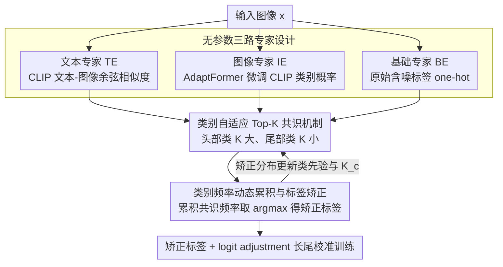

# CARE: Class-Adaptive Expert Consensus for Reliable Learning with Long-Tailed Noisy Labels

**会议**: ICML 2026  
**arXiv**: [2605.23254](https://arxiv.org/abs/2605.23254)  
**代码**: https://github.com/qwq123-study/CARE (有)  
**领域**: 自监督/表示学习  
**关键词**: 噪声标签学习, 长尾分布, 视觉语言模型, 专家共识, 标签矫正  

## 一句话总结

提出 CARE 框架，利用 VLM 的文本嵌入、图像特征和原始标签三路互补专家，通过类别自适应 Top-$K$ 共识机制实现长尾噪声标签场景下的可靠标签矫正，在合成与真实基准上一致超越 SOTA 最高 3.0%。

## 研究背景与动机

**领域现状**：现实数据通常同时存在标签噪声（annotation noise）和类别不平衡（long-tailed distribution）两大挑战。单独处理时，长尾学习方法假设标签干净，可能放大尾部类的标注错误；噪声标签方法假设类别均衡，倾向于丢弃噪声样本，导致尾部类丧失宝贵信息。

**现有痛点**：近期的 LTNL（Long-Tailed Noisy Label）方法尝试联合处理，但多采用**类别无关（class-agnostic）**的标签矫正策略。例如 RLA 先矫正标签再用矫正后的分布做 logit adjustment，但矫正过程对头尾类一视同仁。实验表明，即使整体噪声率大幅下降，若尾部标签未被充分矫正，反而会因长尾校准中引入的不准确正则化导致性能下降（如 RLD 2 的总精度从 79.5% 降至 76.8%）。

**核心矛盾**：头部类样本充足、标签可靠性高，可容忍宽松矫正；尾部类样本稀缺、噪声率更高，需要更严格的矫正。统一阈值无法兼顾两者。

**本文目标**：设计一个无额外参数的框架，在标签矫正阶段就实现**类别感知**的噪声过滤与分布校准。

**切入角度**：利用预训练 VLM（CLIP）天然提供的文本语义和视觉特征作为两个独立的"专家"，与原始标签构成三路互补信号。

**核心 idea**：通过类别自适应 Top-$K$ 共识投票——头部类取较大 $K$、尾部类取较小 $K$——在专家间强制执行差异化一致性检查，实现可靠的标签矫正。

## 方法详解

### 整体框架

CARE 的整体流程：给定一张图像 $x$，分别从三个无参数专家获取类别置信度向量：**(1)** 文本专家 TE 利用 CLIP 文本编码器计算类别文本与图像特征的余弦相似度；**(2)** 图像专家 IE 利用经 AdaptFormer 微调的 CLIP 图像编码器输出类别概率；**(3)** 基础专家 BE 直接使用原始（可能含噪）标签的 one-hot 向量。三路置信度通过类别自适应共识机制聚合，输出矫正后的类别频率分布，最终用矫正标签配合 logit adjustment 损失进行长尾校准训练。

### 关键设计

1. **类别自适应 Top-$K$ 共识机制**：

   核心思想是根据类别频率动态调整每个专家保留的候选类数量。对于 TE 和 IE，分别取各自置信度的 Top-$K_c$ 预测，其中 $K_c \propto n_c^e$（$n_c^e$ 为第 $e$ 轮类别 $c$ 的样本数）。头部类 $K$ 大、容许更多候选，尾部类 $K$ 小、强制更严格一致。每个专家仅对其 Top-$K$ 内的类别贡献置信度：$g_m(c) = \mathbb{I}[c \in \mathcal{T}_K^m] \cdot p_c^m$。若观测标签 $\tilde{y}$ 出现在专家的 Top-$K$ 中，则该专家被视为可靠，其置信度加权增强；否则仅保留 Top-$K$ 预测，避免强化噪声标签。理论上（Theorem 1），由于真实标签在多专家 Top-$K$ 中联合出现的概率远高于噪声标签，共识机制天然具备去噪效果。与全局统一 $K$ 相比，类别自适应 $K_t$ 提升尾部类共识精度（Proposition 4）。

2. **类别频率动态累积与标签矫正**：

   在训练过程中，逐样本累积各类别的共识频率：$F_c^{(e)} = F_c^{(e-1)} + \sum_{m} \alpha_m(x) \cdot g_m(c)$。矫正标签取频率最高的类别：$y^{r,(e)} = \arg\max_c F_c^{(e)}$。随着训练推进，正确标签在频率矩阵中不断累积主导地位，实现渐进式自纠正（Corollary 2）。矫正后的类别分布 $n_c^{r,(e)}$ 被用于重新估计类先验概率，驱动后续的 logit adjustment 校准。

3. **无参数三路专家设计**：

   三个专家均不引入额外可训练参数。TE 使用冻结的 CLIP 文本编码器，通过 $p_c^{TE} = \text{softmax}(s \cdot \cos(\mathbf{t}_c, \hat{\mathbf{f}}))$ 提供语义先验。IE 复用训练中微调的 CLIP 图像编码器（AdaptFormer），通过 $p_c^{IE} = \text{softmax}(s \cdot \cos(\mathbf{w}_c, \mathbf{f}))$ 提供任务适配的视觉置信度。BE 直接使用 one-hot 观测标签。三者互补：TE 不受标签矫正影响，提供稳定的语义锚点；IE 随训练进化但可能受噪声影响；BE 对头部类仍有信息量。消融实验验证任意单一或两两组合均无法降低噪声率，三者联合才将噪声从 50% 降至 27.8%。

## 实验关键数据

| 设定 | 数据集 | CLIP+LA | CLIP+RLA | CLIP+LA w. CARE | 提升 |
|------|--------|---------|----------|-----------------|------|
| Joint NR=50%, IF=10 | CIFAR-100-LTN | 79.5% | 80.7% | **80.7%** | +1.2% vs LA |
| Joint NR=50%, IF=100 | CIFAR-100-LTN | 75.3% | 66.7% | **76.7%** | +1.4% vs LA, +10.0% vs RLA |
| Sym NR=60%, IF=10 | CIFAR-100-LTN | 76.0% | 77.0% | **79.2%** | +3.2% vs LA |
| Asym NR=40%, IF=10 | CIFAR-100-LTN | 68.2% | 69.3% | **70.5%** | +2.3% vs LA |
| Real noise, IF=100 | Food101N | 83.7% | 77.2% | **84.1%** | +6.9% vs RLA |
| Real noise | WebVision-50 | 85.1% | 85.0% | **85.3%** | +0.3% vs LA |

| 消融实验 | 组合 | 噪声率 (%) | 精度 (%) |
|----------|------|-----------|----------|
| BE only | ✓ / ✗ / ✗ | 50.0 | 78.7 |
| BE + TE | ✓ / ✓ / ✗ | 50.0 | 78.7 |
| BE + IE | ✓ / ✗ / ✓ | 50.0 | 78.7 |
| BE + TE + IE (CARE) | ✓ / ✓ / ✓ | **27.8** | **80.3** |

## 亮点与洞察

- **关键发现**：仅降低整体噪声率不够，必须保证尾部类标签矫正的准确性，否则长尾校准引入的正则化反而有害。
- **无参数设计**：CARE 在专家共识阶段完全不引入额外参数，IE 复用主训练管线的微调编码器，TE 使用冻结的预训练编码器。
- **跨骨干泛化**：不限于 CLIP——ResNet + GloVe 组合、TABASCO 框架、MLP-Mixer 架构均获得一致提升，说明增益来自共识机制本身而非强骨干。
- **理论支撑**：提供了共识去噪的可靠性放大定理（Theorem 1）和尾部类自适应 $K$ 的精度提升命题（Proposition 4）。

## 局限性 / 可改进方向

- 尾部类精度提升以头部类轻微下降为代价（Table 8: head 83.4% → 81.8%），源于矫正后 LA 对头部更强的正则化效应。
- 依赖 CLIP 等预训练 VLM 提供文本和视觉专家，在无预训练模型可用的场景适用性受限。
- $K_c$ 与类别频率成正比的设定较为简单，更精细的自适应策略（如考虑类别间语义相似度）可能进一步提升性能。

## 相关工作与启发

- **长尾学习**：LDAM-DRW、LA (logit adjustment)、MiSLAS 等从损失/分类器层面处理不平衡，但均假设标签干净。
- **噪声标签学习**：Co-teaching、DivideMix、UNICON 等通过样本选择/混合训练应对噪声，但假设类别均衡。
- **LTNL 联合方法**：TABASCO 考虑观测与内在分布差异，RCAL/ECBS/RLA 联合处理两者，但多用类别无关策略。
- **启发**：VLM 的多模态信号（文本+视觉）可作为天然的标签审计工具，类别自适应的共识阈值思路可推广到其他需要差异化信任分配的场景。

## 评分

- 新颖性: 7/10 — 类别自适应共识投票是有洞察力的新设计，但整体框架思路（多专家投票矫正标签）较直觉  
- 实验充分度: 9/10 — 合成+3个真实数据集、5种噪声设定、3种骨干架构，消融全面  
- 写作质量: 8/10 — 动机清晰、理论分析完整，Figure 1 的直觉展示非常有效  
- 价值: 7/10 — 对 LTNL 场景有实用价值，但增益幅度在强 baseline (CLIP+LA) 上较为温和

<!-- RELATED:START -->

## 相关论文

- [\[AAAI 2026\] Neighbor-aware Instance Refining with Noisy Labels for Cross-Modal Retrieval](../../AAAI2026/information_retrieval/neighbor-aware_instance_refining_with_noisy_labels_for_cross-modal_retrieval.md)
- [\[ICCV 2025\] External Knowledge Injection for CLIP-Based Class-Incremental Learning](../../ICCV2025/information_retrieval/external_knowledge_injection_for_clip-based_class-incremental_learning.md)
- [\[ICML 2026\] Retriever Portfolios: A Principled Approach to Adaptive RAG](retriever_portfolios_a_principled_approach_to_adaptive_rag.md)
- [\[ICML 2026\] Very Efficient Listwise Multimodal Reranking for Long Documents](very_efficient_listwise_multimodal_reranking_for_long_documents.md)
- [\[ICML 2026\] ParisKV: Fast and Drift-Robust KV-Cache Retrieval for Long-Context LLMs](pariskv_fast_and_drift-robust_kv-cache_retrieval_for_long-context_llms.md)

<!-- RELATED:END -->
