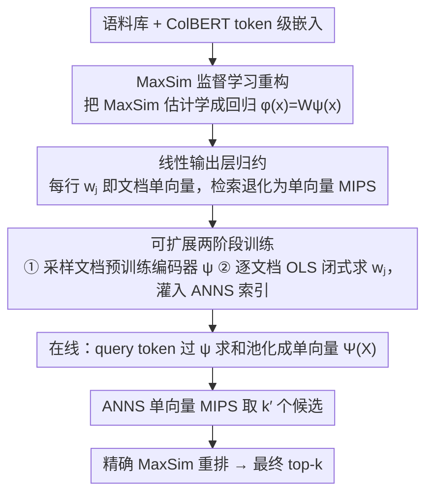

# LEMUR: Learned Multi-Vector Retrieval

**会议**: ICML 2026  
**arXiv**: [2601.21853](https://arxiv.org/abs/2601.21853)  
**代码**: [github.com/ejaasaari/lemur](https://github.com/ejaasaari/lemur)  
**领域**: 信息检索  
**关键词**: 多向量检索, 近似最近邻搜索, MaxSim, 监督学习降维, ColBERT  

## 一句话总结
Lemur 将多向量相似性搜索转化为监督学习问题，用一个两层 MLP 将 token 级嵌入映射到低维潜空间，再利用现有单向量 ANNS 索引完成检索，比 PLAID/MUVERA 等方法快一个数量级。

## 研究背景与动机

**领域现状**：以 ColBERT 为代表的 late interaction 模型通过每个 token 一个 embedding 的多向量表示实现了比单向量模型更高的检索精度。查询与文档之间的相似度通过 MaxSim 度量，即每个 query token 与最相似 document token 的内积之和。

**现有痛点**：MaxSim 的计算代价极高——需要评估所有 query embedding 与所有 document embedding 之间的内积。现有加速方法（PLAID、DESSERT、EMVB、IGP）依赖 token 级剪枝作为第一步，但单个 token 的相似度是文档级 MaxSim 的不精确代理，导致候选集必须很大才能保证召回率。MUVERA 通过固定维度编码（FDE）将问题归约为单向量搜索，但需要 10240 维才能获得足够精度，内存和延迟代价仍然很高。

**核心矛盾**：多向量检索的高精度优势与其高延迟之间存在根本矛盾。现有方法要么依赖不精确的 token 级代理（PLAID 系列），要么需要极高维的数据无关编码（MUVERA），都无法高效弥合这一差距。

**本文目标**：设计一个轻量级、语料库特定的搜索降维框架，将多向量搜索归约为低维单向量搜索，同时保持高召回率。

**切入角度**：MaxSim 可以分解为逐 token 贡献的加和 $\text{MaxSim}(X,C) = \sum_{x \in X} \max_{c \in C} \langle x,c \rangle$，每个 token 对所有文档的贡献 $g(x) \in \mathbb{R}^m$ 是一个从 $\mathbb{R}^d$ 到 $\mathbb{R}^m$ 的回归问题，可以用 MLP 来学习。

**核心 idea**：用一个两层 MLP 学习 token 到文档相似度的映射，然后利用其线性输出层的结构将多向量搜索归约为潜空间中的单向量 MIPS 问题。

## 方法详解

### 整体框架
Lemur 要解决的是「多向量检索精度高但 MaxSim 太慢」这个矛盾，做法是把多向量相似度搜索拆成两步归约：先用一个两层 MLP 把多向量 MaxSim 估计学成一个回归问题，再借助这个 MLP 线性输出层的结构，把检索归约成潜空间里的单向量 MIPS，从而直接复用成熟的 ANNS 索引。落地上分离线、在线两个阶段：离线训练 MLP 并把输出层权重矩阵的每一行作为对应文档的单向量表示存入 ANNS 索引；在线时把所有 query token 过 MLP 隐藏层、求和池化成单向量查询，用 ANNS 取回 $k'$ 个候选，再用精确 MaxSim 重排出最终 top-$k$。

### 关键设计

**1. MaxSim 的监督学习重构：把相似度估计变成多输出回归**

现有加速方法之所以慢，是因为它们用单 token 相似度做剪枝代理，而这个代理与文档级 MaxSim 偏差大、候选集只能开得很大。Lemur 直接绕开代理：注意到 MaxSim 可按 token 贡献分解为 $\text{MaxSim}(X,C)=\sum_{x\in X}\max_{c\in C}\langle x,c\rangle$，于是把目标定义成 $g_l(x)=\max_{c\in C_l}\langle x,c\rangle$，即每个 token embedding $x$ 对第 $l$ 个文档的 MaxSim 贡献，整体就是一个 $\mathbb{R}^d\to\mathbb{R}^m$ 的多输出回归。用一个两层网络 $\phi(x)=W\psi(x)$ 去拟合它，其中 $\psi$ 是隐藏层特征编码器、$W\in\mathbb{R}^{m\times d'}$ 是线性输出层；由于每个 $g_l$ 都是凸分段线性函数，两层结构已有足够的拟合能力。因为是直接优化 MaxSim 估计精度而非套用数据无关编码，低至 2048 维的表示就能超过 MUVERA 的 10240 维 FDE。

**2. 线性输出层到单向量 MIPS 的归约：让检索复用现成 ANNS**

回归本身只是中间品，真正的巧思在于输出层是线性的这一点。把估计写开就是 $f(X)\approx W\Psi(X)$，其中 $\Psi(X)=\sum_{x\in X}\psi(x)$ 是把所有 query token 过隐藏层后求和池化得到的单向量。于是「找 MaxSim 估计最大的 $k'$ 个文档」就等价于「在 $d'$ 维空间里找与 $\Psi(X)$ 内积最大的 $k'$ 个权重行向量 $w_j$」——这正是标准的单向量 MIPS。这样一来无需为多向量专门设计数据结构，输出层的每一行 $w_j$ 天然就是文档在潜空间的单向量表示，可直接灌进 HNSW 等高度优化的 ANNS 库加速，整条在线链路退化成一次普通的近邻搜索加一次精确重排。

**3. 可扩展的两阶段训练：把索引构建做成线性可扩展**

直接端到端训练一个 $m$ 维输出的 MLP 在百万级语料库上内存不可行（$m$ 等于文档数），Lemur 把特征学习和线性拟合解耦成两阶段。第一阶段只在 $m'\ll m$ 个采样文档上预训练特征编码器 $\psi$；第二阶段固定 $\psi$，对每个文档 $j$ 用 OLS 回归解析求解输出层的对应行 $w_j=Z^{+}y_j$，其中 $Z$ 是训练样本经过 $\psi$ 后的特征矩阵、$y_j$ 是这些样本对文档 $j$ 的真实 MaxSim 贡献。由于每个 $w_j$ 是独立闭式解，求解天然可并行，索引构建随文档数线性扩展，新文档进来也只需一次 OLS 回归加一次 HNSW 插入即可增量更新。

## 实验关键数据

### 主实验（ColBERTv2, k=100, QPS@≥80% Recall）

| 数据集 | Lemur | MUVERA | IGP | DESSERT | PLAID |
|--------|-------|--------|-----|---------|-------|
| MSMARCO (8.8M docs) | **799** | 150 | 62 | — | 13 |
| HotpotQA (5.2M docs) | **426** | 22 | 37 | — | 10 |
| NQ (2.7M docs) | **869** | 79 | 107 | 38 | 16 |
| Quora (523K docs) | **4068** | 787 | 679 | 284 | 89 |
| FiQA (58K docs) | **2416** | 239 | 310 | 242 | 51 |
| SCIDOCS (26K docs) | **2591** | 391 | 320 | 285 | 85 |

### 消融实验（隐藏层维度 $d'$ 对性能的影响）

| 配置 | MaxSim 近似精度 | 端到端延迟趋势 | 说明 |
|------|----------------|---------------|------|
| $d'=1024$ | 7/8 数据集超过 MUVERA 10240 维 FDE | 最快 ANNS | 精度已超 10x 大的 FDE |
| $d'=2048$（默认） | 显著优于 $d'=1024$ | 最佳性价比 | 延迟增量可忽略 |
| $d'=4096$ | 略优于 $d'=2048$ | 收益递减 | ANNS 代价部分抵消精度增益 |

### 关键发现
- Lemur 在所有 8 个 BEIR 数据集上在 ≥80% 召回时比最佳基线快 5–16 倍
- 1024 维 Lemur 嵌入在 7/8 数据集上召回率超过 10240 维 MUVERA FDE，说明监督学习的表示远优于数据无关编码
- 在非 ColBERTv2 模型（answerai-colbert-small、GTE-ModernColBERT、LFM2-ColBERT）上，MUVERA 召回率甚至无法超过 60%，而 Lemur 仍然稳定
- Pearson 相关系数和 Spearman 秩相关系数在所有数据集上均 > 0.94，表明 MaxSim 估计质量极高

## 亮点与洞察
- 将多向量搜索转化为监督回归再归约为单向量 MIPS 的"双重归约"思路非常优雅——关键洞察在于线性输出层的行向量天然就是文档在潜空间的单向量表示，无需额外投影
- 特征编码器用随机权重（ELM 模式）仍然有效，说明隐藏层主要起非线性特征扩展作用而非学习高度特化的表示，这一发现对理解 late interaction 嵌入空间的结构有启发价值
- 索引支持增量更新（新文档只需一次 OLS 回归 + HNSW 插入），这在生产系统中至关重要
- 用语料库文档本身作为训练数据（无需单独的训练查询集）也能工作，极大降低了部署门槛；使用真实查询训练时性能更好

## 局限与展望
- 依赖语料库特定训练，跨语料库直接迁移能力有限；不过两阶段训练设计使得重训成本较低（最大数据集 8.8M 文档总索引耗时约 4.8 小时）
- 未探索与极低精度向量压缩（如 2-bit 量化）的兼容性，标准标量量化和乘积量化应可直接适用但需验证
- 在视觉文档检索（ViDoRe）上优势缩小，因为图像文档的 embedding 数量远大于文本（平均 1073 vs 68），重排阶段成为瓶颈
- 未来可探索跨语料库迁移学习和合成训练集，减少对特定语料库的依赖

## 相关工作与启发
- **vs MUVERA**: MUVERA 用数据无关的 FDE 做单向量归约，Lemur 用监督学习做语料库特定归约，后者在 1/10 维度下就超过前者，代价是需要训练
- **vs PLAID/DESSERT/IGP**: 这些方法依赖 token 级剪枝做候选筛选，proxy 不精确需要大候选集；Lemur 直接在文档级做 MaxSim 估计，候选集更小更精准
- **vs TCT-ColBERT**: TCT 训练一个通用的单向量检索器来蒸馏 MaxSim，Lemur 只训练一个轻量级搜索降维而非端到端检索器，更灵活且可直接适配任意 late interaction 模型
- **vs BGE-M3**: BGE-M3 通过自蒸馏联合训练 dense/sparse/multi-vector 模式，是通用 embedding 模型；Lemur 不训练编码器，只为已有模型构建高效搜索索引

## 评分
- 新颖性: ⭐⭐⭐⭐⭐ 双重归约思路原创性强，将检索问题转化为回归+MIPS 的视角令人眼前一亮
- 实验充分度: ⭐⭐⭐⭐⭐ 8 个 BEIR 数据集 × 5 个文本模型 + 2 个视觉模型，消融全面
- 写作质量: ⭐⭐⭐⭐⭐ 数学推导清晰，从问题定义到算法设计一气呵成
- 价值: ⭐⭐⭐⭐⭐ 直接可用于加速 ColBERT 系列检索系统，已开源

<!-- RELATED:START -->

## 相关论文

- [\[ACL 2026\] Hybrid-Vector Retrieval for Visually Rich Documents: Combining Single-Vector Efficiency and Multi-Vector Accuracy](../../ACL2026/information_retrieval/hybrid-vector_retrieval_for_visually_rich_documents_combining_single-vector_effi.md)
- [\[ACL 2026\] Prune-then-Merge: Towards Efficient Multi-Vector Visual Document Retrieval](../../ACL2026/information_retrieval/sculpting_the_vector_space_towards_efficient_multi-vector_visual_document_retrie.md)
- [\[ICML 2025\] POQD: Performance-Oriented Query Decomposer for Multi-Vector Retrieval](../../ICML2025/information_retrieval/poqd_performance-oriented_query_decomposer_for_multi-vector_retrieval.md)
- [\[ICML 2026\] HGMem: Hypergraph-based Working Memory to Improve Multi-step RAG for Long-Context Complex Relational Modeling](hgmem_hypergraph-based_working_memory_to_improve_multi-step_rag_for_long-context.md)
- [\[CVPR 2025\] LotusFilter: Fast Diverse Nearest Neighbor Search via a Learned Cutoff Table](../../CVPR2025/information_retrieval/lotusfilter_fast_diverse_nearest_neighbor_search_via_a_learned_cutoff_table.md)

<!-- RELATED:END -->
