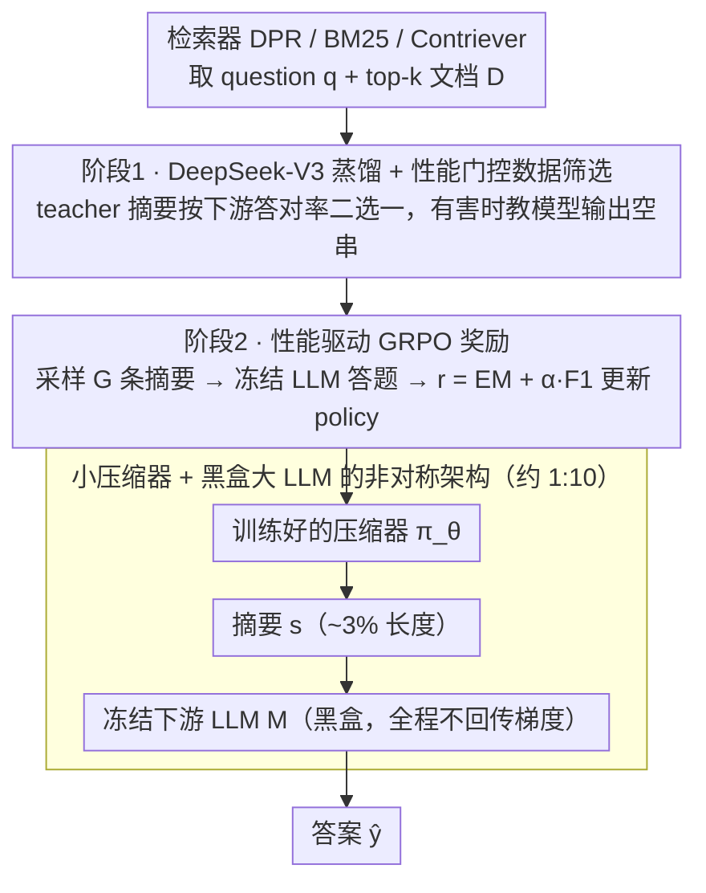

# Less Is More: Elevating RAG via Performance-Driven Context Compression

**会议**: ICML 2026  
**arXiv**: [2508.19282](https://arxiv.org/abs/2508.19282)  
**代码**: https://github.com/ziqiangcui/CORE-RAG-ICML26 (有)  
**领域**: 信息检索 / RAG / 上下文压缩  
**关键词**: RAG, 上下文压缩, GRPO, 知识蒸馏, 性能驱动

## 一句话总结
CORE-RAG 用"性能即奖励"的 GRPO 强化学习训练一个 1.5B 小压缩器，把检索到的 top-k 文档压成 ~3% 长度的摘要，结果不仅没掉点反而在 4 个 QA benchmark 上比满上下文 RAG 平均提升 3.3 EM。

## 研究背景与动机

**领域现状**：RAG 通过把 top-k 检索文档拼到 query 前面，把 LLM 的事实性 QA 表现拉高了 10+ EM。但 token 数也线性涨 —— 5 文档要 ~700 tokens，10 文档要 ~1400 tokens，编码代价和延迟同时上来。

**现有痛点**：现有压缩方法（RECOMP / NoiseFilter-IB / LongLLMLingua / QGC 等）几乎都会掉点，相比满上下文 baseline 普遍掉 2-6 EM。原因是它们的训练目标依赖 **代理启发式**（proxy heuristics）：最大化原文-摘要互信息、模仿 teacher 输出、BM25 词面重叠、信息熵剪枝……这些目标和"下游 LLM 答对没有"之间没有任何因果链。

**核心矛盾**：压缩任务没有 ground-truth label —— 没人知道什么样的摘要"最适合"下游 LLM 回答这个具体问题。所有 surrogate loss 都是在猜，猜不准就掉点；与此同时部分压缩模型（如 NoiseFilter-IB）参数量逼近下游 LLM 本身，压缩省下的算力又被压缩器自己吃掉。

**本文目标**：(i) 让压缩目标和下游任务表现严格对齐，做到"无损甚至超越"；(ii) 压缩器要远小于下游 LLM，真省算力。

**切入角度**：既然没有 gold summary，那就**把下游 LLM 的答题正确率本身当奖励**，让压缩器作为 policy 在 RL 框架里学。下游 LLM 全程冻结（黑盒），只训轻量压缩器，天然适配 API 模型场景。

**核心 idea**：压缩 = 决策过程；用 GRPO 以下游 EM/F1 作 reward 直接优化压缩器；先用 DeepSeek-V3 蒸馏 + 一套筛数据规则做 warm-start，再 RL 收尾。

## 方法详解

### 整体框架

CORE-RAG 要解决的是"RAG 压缩必掉点"，做法是把压缩从"找一个好摘要"重新定义为"找一个能让下游 LLM 答对的摘要"。系统里有三个角色：一个由现成 retriever（DPR / BM25 / Contriever）拿到 question $q$ 加 $k$ 篇文档 $D$；一个小语言模型压缩器 $\pi_\theta:(q,D)\mapsto s$（主实验 Qwen2.5-1.5B-Instruct）；一个全程冻结、当黑盒用的下游 LLM $M:(s,q)\mapsto\hat{y}$（主实验 Qwen2.5-14B-Instruct）。训练分两阶段——先用 DeepSeek-V3 蒸馏给小模型一个稳健起点，再用下游答题正确率作 reward 跑 GRPO 强化学习收尾；推理时只剩 $s=\pi_\theta(q,D)$、$\hat{y}=M(s,q)$ 两步，压缩器作为 plug-in 挂在任意 LLM 前面。

### 关键设计

**1. 下游性能驱动的 GRPO 奖励：把"答对没有"直接当 reward**

压缩任务没有 gold summary，所有 surrogate loss（互信息、BM25 重叠、teacher 模仿）都是在猜什么摘要"好"，猜不准就掉点。CORE 干脆绕开这个伪命题：把压缩器 $\pi_\theta$ 当 policy，对每个输入 $x=(q,D)$ 采样 $G$ 条摘要 $\{s_i\}$，逐条拼上 $q$ 喂给冻结的 $M$ 得到答案 $\hat{y}_i=M(s_i,q)$，再用下游表现算 reward $r=r_{\text{EM}}+\alpha\cdot r_{\text{F1}}$——其中 $r_{\text{EM}}=\mathbb{I}(\hat{y}=y)$ 是稀疏的硬正确信号，$r_{\text{F1}}$ 是 token-level F1 提供的稠密部分正确信号，$\alpha\in(0,1]$ 调两者权重（影响见 Figure 4）。优化用 GRPO（DeepSeek-Math 提出），把组内 $G$ 条 rollouts 做均值-标准差归一化得 advantage $A_i=(r_i-\text{mean})/\text{std}$，从而不需要 critic 模型省一份显存，并加 KL 项 $\beta\mathbb{D}_{\text{KL}}(\pi_\theta\|\pi_{\theta_{\text{ref}}})$ 防止偏离 warm-start。这套设计有效，是因为 reward 直接等于用户真正关心的目标、不再有任何代理误差；而组内对比"同一 query 不同摘要哪个让 LLM 答得对"也天然贴合压缩这个"长输入→短输出"的生成场景。相比同走 RL 路线的 TACO（只做 token-level keep/drop 二值决策、reward 仍是 proxy），CORE 的压缩器是生成式的、能改写综合内容，且因为 $M$ 黑盒冻结而天然适配商业 API。

**2. DeepSeek-V3 蒸馏 + 性能门控数据筛选：给 RL 一个不崩的起点**

1.5B 小模型直接上 RL 会因初始 policy 太弱而探索失败，所以需要 warm-start，但 teacher 摘要本身不保证最优、不能照单全收。CORE 的做法是用蒸馏数据本身就和 task performance 对齐：先用 DeepSeek-V3 (671B) 作 teacher 对每个 $(q,D)$ 生成摘要 $\hat{s}$，再用下游 LLM 在带摘要、裸 query 两种条件下分别作答打分得 $p_{\text{summary}}$ 与 $p_{\text{original}}$，据此二选一构造监督样本——若 $p_{\text{summary}}>p_{\text{original}}$ 就保留样本、target 设为 teacher 摘要 $\hat{s}$；若 $p_{\text{original}}=1$ 而 $p_{\text{summary}}<p_{\text{original}}$（摘要把本来对的搞错了）则 target 设为空串、教模型"必要时拒绝输出"；其余样本全丢。最后在筛出的 $\mathcal{X}_f$ 上做标准 SFT，loss 为 token-level cross-entropy $\mathcal{L}_d=-\frac{1}{|\mathcal{X}_f|}\sum\sum_t\log P_{\pi_\theta}(\hat{s}_t\mid q,D,\hat{s}_{<t})$。这一步等于在 SFT 阶段就埋下了 RL reward 的雏形：既让小模型学会输出像样的摘要，又把"该不该输出空"这个被多数压缩工作忽视的关键自由度写进训练信号。消融里去掉蒸馏后 RL 仍能跑但显著变弱（尤其 2Wiki 36.72→31.40），说明 warm-start 决定了 RL 能不能摸到天花板。

**3. 小压缩器 + 黑盒大 LLM 的非对称架构：让省下的算力真正落地**

很多前作（如 NoiseFilter-IB）压缩器体量逼近下游 LLM，压缩省下的 FLOPs 又被压缩器自己吃回去，加速形同虚设。CORE 刻意把 $\pi_\theta$ 设计得远小于 $M$（主实验 1.5B vs. 14B，约 1:10），训练时只反传压缩器梯度、$M$ 全程冻结当 reward 函数用；推理时压缩器对 5-10 文档生成 ~30-50 token 的摘要再丢给 LLM 解码，输入序列从 ~700-1400 tokens 砍到 ~50 tokens（压缩比 ~3-6%）。因为 $M$ 不参与训练，整套框架既兼容 GPT-4/Claude 这类 API 黑盒模型，训出来的压缩器也能直接迁移到不同下游 LLM（论文用 Qwen 训、在 Llama-3.1-8B 上 zero-shot transfer 仍保持优势）。相比 ReSearch / R1-Searcher 那条要训生成器本身、必须白盒且参数大的 search-augmented 路线，CORE 只训一个 plug-in 压缩器，训练和推理成本都低一个量级。

### 损失函数 / 训练策略

两阶段各有 objective：阶段 1 蒸馏用 token-level cross-entropy $\mathcal{L}_d$（公式 1）；阶段 2 GRPO 用 $\mathcal{J}(\theta)$（公式 2），含 clip 系数 $\epsilon$、KL 系数 $\beta$、组大小 $G$ 条 rollouts，复合 reward $r=r_{\text{EM}}+\alpha r_{\text{F1}}$（$\alpha\in(0,1]$ 的影响见 Figure 4）。推理阶段对压缩器用 greedy decoding，保证摘要确定可复现。

## 实验关键数据

### 主实验
4 个 QA benchmark（NQ / TriviaQA / HotpotQA / 2WikiMultihopQA），下游 LLM = Qwen2.5-14B-Instruct，所有可训练 baseline 统一用 Qwen2.5-1.5B-Instruct 初始化、5 文档训练。

| 数据集 | 指标 | 满上下文 top-5 | CORE(1.5B) | 相比满上下文 | tokens 压缩比 |
|--------|------|----------------|-------------|---------------|----------------|
| NQ | EM | 38.03 | **41.02** | +2.99 | 712→46 (~6.5%) |
| TriviaQA | EM | 64.10 | **65.63** | +1.53 | 715→32 (~4.5%) |
| HotpotQA | EM | 32.99 | **33.67** | +0.68 | 737→36 (~4.9%) |
| 2WikiMultihopQA | EM | 29.64 | **36.72** | +7.08 | 766→49 (~6.4%) |

对比强 baseline（5 文档训练）：RECOMP-Abs/Ext、NoiseFilter-IB、LongLLMLingua、QGC 在 4 个数据集上几乎都比满上下文掉 2-6 EM；DeepSeek-V3 (671B) 作为 teacher 直接做摘要在 NQ/2Wiki 上也跑不过满上下文。CORE 用 1.5B 同时超过所有压缩 baseline 与 DeepSeek-V3 teacher 4-5 EM，并且超过满上下文 10 文档（top-10 baseline EM 38.67 vs. CORE-top5 41.02）。

**长度泛化**：在 top-5 训练的压缩器直接 zero-shot 到 top-10 文档，CORE 在 NQ 上 EM 41.88、token 仅 52（压缩比 ~3.6%），相比 top-10 满上下文 (EM 38.67) 仍提升 3.2 点。

### 消融实验
| 配置 | NQ EM | TQA EM | HotpotQA EM | 2Wiki EM | 说明 |
|------|-------|--------|-------------|----------|------|
| CORE (full) | **41.02** | **65.63** | **33.67** | **36.72** | 蒸馏 + GRPO RL |
| w/o distillation | 36.37 | 65.23 | 32.01 | 31.40 | 直接 RL 冷启，NQ/2Wiki 掉 ~5 EM |
| w/o RL | 34.18 | 60.31 | 28.96 | 30.25 | 只蒸馏不 RL，4 数据集普遍掉 3-6 EM |

### 关键发现
- **RL 那一步是大头**：去掉 RL 后掉点比去掉蒸馏更猛（NQ 41.02→34.18 vs. 41.02→36.37），证实 teacher 摘要确实不是任务最优，performance-driven 信号不可替代。
- **蒸馏不是装饰**：去掉蒸馏后 RL 仍可跑但显著弱（尤其 2Wiki 36.72→31.40），说明 1.5B 小模型靠 GRPO 自己探索难以收敛到好策略；warm-start 决定了 RL 的天花板能不能摸到。
- **跨长度/跨 LLM 泛化**：top-5 训出来的压缩器直接用于 top-10 仍超 baseline，说明学到的不是"截 N 个 token"而是任务相关的取舍模式；迁移到 Llama-3.1-8B 同样保持优势。
- **小压缩器够用**：1B-3B Llama / Qwen backbone 全部受益（Figure 5），3B 不显著强于 1.5B，说明瓶颈不在容量而在训练信号。

## 亮点与洞察
- **"用下游正确率当 reward"的暴力简洁**：彻底抛弃所有 surrogate loss（互信息、BM25、teacher 模仿），直接最优化用户真正关心的目标。这种"reward 即任务"的思路在压缩之外（rerank、query 重写、prompt 工程）都可直接套用。
- **"摘要可以是空"是被人忽视的关键自由度**：通过蒸馏阶段第 (b) 类样本把"该不该输出空"写进训练信号，相当于给压缩器一个"有害就保持沉默"的开关，这在其他压缩工作里几乎没人显式建模。
- **黑盒 LLM + 轻量 plug-in 训练**：下游 LLM 不需要梯度可达，这把整套方法平移到 GPT-4/Claude 这类 API 模型上没有任何障碍；与那些必须训生成器的 search-reasoning 方法（ReSearch、R1-Searcher、DeepResearcher）形成鲜明对比。
- **GRPO 用在生成式压缩上的范式价值**：之前 GRPO 主要在数学推理里火，这里证明只要 reward 能从下游任务定义出来，GRPO 同样适用于"长输入→短输出"的生成式压缩，组内对比天然贴合"同一 query 不同摘要哪个让 LLM 答得对"。

## 局限与展望
- **作者承认**：开放生成任务（长文生成、对话）没有 EM/F1 这种硬 reward，需要换成 LLM-as-Judge 或 ROUGE/BARTScore + 幻觉惩罚，论文只给了思路（3.4 节）未实验，开放域上的实际效果未验。
- **依赖训练集有 ground-truth answer**：方法本质是 supervised RL，对没有标注答案的 QA 域（如新领域、私有知识库）冷启代价不小，可能需要 LLM-as-Judge 作伪 label。
- **下游 LLM 与 reward 强耦合**：reward 由特定 $M$ 算出，更换 $M$ 严格说应重训；论文用 Qwen 训的压缩器直接迁移到 Llama-3.1-8B 仍 work，但更激进的迁移（如换成代码 LLM、不同语种 LLM）能否保持优势仍未知。
- **可改进方向**：(i) 引入 process reward（按 token / 按句给 reward）改善信用分配；(ii) 把压缩器和 retriever 联合训练，让"检索什么"和"压缩成什么"端到端对齐；(iii) 把 reward 从 EM/F1 升级为可校准的 LLM-as-Judge，扩展到长文/代码生成；(iv) 引入"压缩比"作为辅助 reward，显式控制 token-quality 权衡。

## 相关工作与启发
- **vs RECOMP (Xu et al., 2024)**：RECOMP 通过数据选择 + 蒸馏训抽取/生成式摘要器，loss 是 token-level CE，目标仍是模仿；CORE 复用其问题设定但把 loss 替换为下游性能 reward + GRPO，因此能"无损"。在 NQ 上 CORE 41.02 vs. RECOMP-Abs 34.18，差距巨大。
- **vs NoiseFilter-IB (Zhu et al., 2024)**：NoiseFilter-IB 用信息瓶颈最大化压缩摘要与 ground-truth output 的互信息，仍是代理目标；并且压缩器体量逼近下游 LLM。CORE 用 reward 显式对齐性能，且压缩器小 ~10x。
- **vs LongLLMLingua / QGC (Jiang/Cao et al., 2024)**：这两者都用 query 引导 token-level 剪枝（保留率/位置调整），属硬剪枝；CORE 是生成式可改写，且训练信号是下游 reward 而非熵/对齐分。
- **vs TACO (Shandilya et al., 2025)**：同属 RL 路线，但 TACO 做 token keep/drop 二值决策且不专为 RAG；CORE 是生成式 + RAG 专用 + 真正性能 reward，直接对照下 TACO 仍掉点，CORE 不掉点。
- **vs ReSearch / R1-Searcher / WebThinker / DeepResearcher**：这一脉是 RL 训生成器把 search+reasoning 揉进 LLM 内部，要白盒、参数大、推理慢；CORE 反其道，把 LLM 当冻结黑盒，只训一个 plug-in 压缩器，训练/推理代价低一个量级，且适配 API 模型。

## 评分
- 新颖性: ⭐⭐⭐⭐ "下游性能即 reward"用在压缩任务上简洁有力，蒸馏阶段的"空串监督"思路也巧妙；但 GRPO 本身是搬来的，整体属于"老技术新场景"的精准命中而非全新算法。
- 实验充分度: ⭐⭐⭐⭐⭐ 4 个 QA benchmark + 多 retriever + 跨下游 LLM（Qwen2.5-14B / Llama-3.1-8B）+ 跨压缩器 backbone（1B/1.5B/3B、Llama/Qwen）+ 长度泛化（top-5→top-10）+ 完整消融，覆盖度极强。
- 写作质量: ⭐⭐⭐⭐ 动机层层递进，方法叙述清晰，表格紧凑；唯一小遗憾是开放生成只在 3.4 节口头讨论未实验。
- 价值: ⭐⭐⭐⭐⭐ 真正解决 RAG "压缩必掉点"这一痛点，把压缩比降到 3-6% 还能涨点，对工业 RAG 系统（API LLM + 长检索）有直接落地价值，且训练范式可推广到其他 RAG 子模块。

<!-- RELATED:START -->

## 相关论文

- [\[ACL 2026\] More Than Efficiency: Embedding Compression Improves Domain Adaptation in Dense Retrieval](../../ACL2026/information_retrieval/more_than_efficiency_embedding_compression_improves_domain_adaptation_in_dense_r.md)
- [\[ACL 2025\] EXIT: Context-Aware Extractive Compression for Enhancing Retrieval-Augmented Generation](../../ACL2025/information_retrieval/exit_context-aware_extractive_compression_for_enhancing_retrieval-augmented_gene.md)
- [\[ICLR 2026\] Attributing Response to Context: A Jensen-Shannon Divergence Driven Mechanistic Study of Context Attribution in Retrieval-Augmented Generation](../../ICLR2026/information_retrieval/attributing_response_to_context_a_jensen-shannon_divergence_driven_mechanistic_s.md)
- [\[ACL 2026\] BRIEF-Pro: Universal Context Compression with Short-to-Long Synthesis for Fast and Accurate Multi-Hop Reasoning](../../ACL2026/information_retrieval/brief-pro_universal_context_compression_with_short-to-long_synthesis_for_fast_an.md)
- [\[ICML 2026\] Ranking-Free RAG: Replacing Re-Ranking with Selection in RAG for Sensitive Domains](ranking_free_rag_replacing_re-ranking_with_selection_in_rag_for_sensitive_domain.md)

<!-- RELATED:END -->
